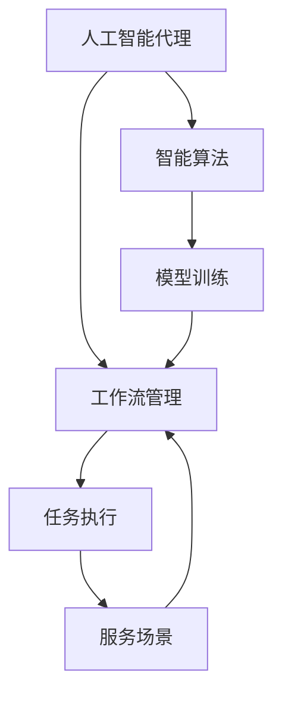
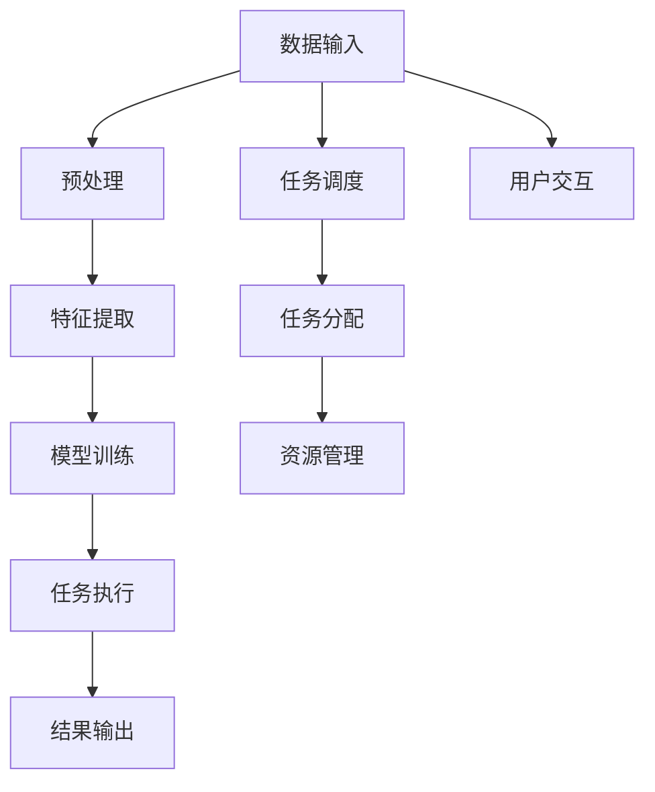
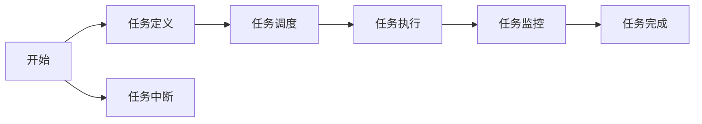
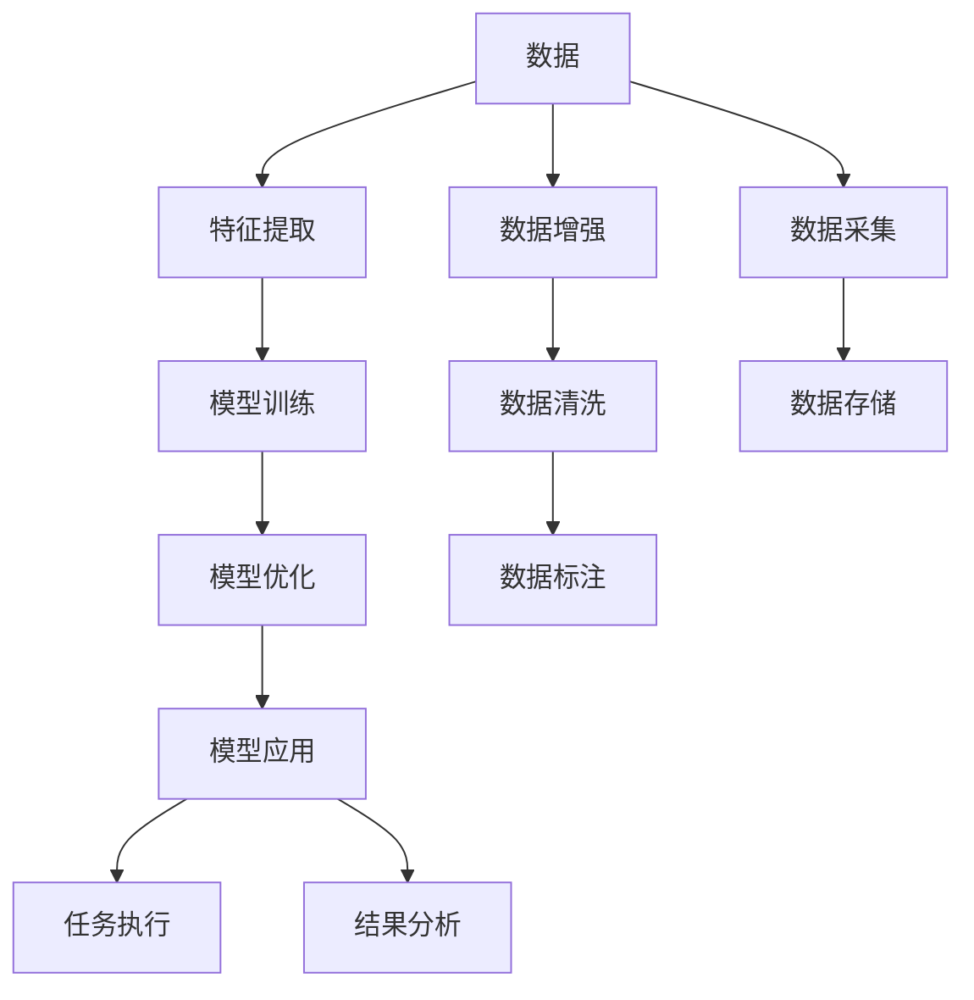

                 

# AI人工智能代理工作流AI Agent WorkFlow：智能代理在公共服务系统中的应用

> 关键词：人工智能(AI),智能代理(Agent),工作流(Workflow),公共服务(Public Service)

## 1. 背景介绍

### 1.1 问题由来

在当前数字化、信息化快速发展的时代，公共服务系统在提升政府效能、优化公共资源配置、增强公众满意度等方面发挥着越来越重要的作用。然而，传统的公共服务系统面临着诸多挑战，如服务效率低、响应时间长、数据孤岛、用户体验差等问题。如何通过智能化手段提升公共服务系统效能，成为摆在面前的一个重要课题。

在此背景下，人工智能(AI)技术逐渐成为提升公共服务系统效能的关键手段。AI智能代理工作流（AI Agent Workflow）作为其中的一种新兴技术，通过引入智能化的自动化工作流管理，大幅提升了公共服务系统的响应速度、处理能力及用户体验，展示了广阔的应用前景。

### 1.2 问题核心关键点

AI智能代理工作流主要包含以下关键点：

- **人工智能代理**：基于AI技术构建的智能自动化代理系统，能够自动执行或辅助完成各种任务，包括自动化办公、客服、信息检索等。
- **工作流管理**：通过工作流引擎实现任务自动化编排、流程自动化调度，提高资源利用率和任务处理效率。
- **智能算法**：包括机器学习、深度学习、自然语言处理等算法，用于智能代理的系统训练、数据处理、任务识别等。
- **公共服务场景**：如电子政务、智慧医疗、城市管理、教育培训等，这些场景需要高效、智能、安全的解决方案。

## 2. 核心概念与联系

### 2.1 核心概念概述

为更好地理解AI智能代理工作流及其在公共服务系统中的应用，本节将介绍几个关键概念：

- **人工智能代理**：一种基于人工智能技术的自动化执行系统，可以自动处理各种任务，具有高效率、高灵活性等特点。
- **工作流管理**：通过定义一系列任务的顺序执行规则，实现任务自动化编排和调度，提高系统处理能力和资源利用率。
- **智能算法**：如机器学习、深度学习、自然语言处理等，用于训练智能代理模型，提升任务处理能力。
- **公共服务场景**：包括电子政务、智慧医疗、城市管理、教育培训等多个应用场景，需要AI智能代理提供高效、智能、安全的解决方案。

这些概念之间存在紧密联系，共同构成了AI智能代理工作流的完整生态系统。下面通过Mermaid流程图展示它们之间的关系：



这个流程图展示了AI智能代理工作流的核心组件及其相互关系：

1. 人工智能代理通过智能算法进行训练，构建高效的任务执行模型。
2. 任务执行模型与工作流管理结合，通过定义任务执行顺序，实现任务自动化编排和调度。
3. 工作流管理调度后的任务执行结果，服务于公共服务场景，提升服务效能。

### 2.2 概念间的关系

这些核心概念之间存在着紧密的联系，形成了AI智能代理工作流的完整架构。下面我们通过几个Mermaid流程图来展示这些概念之间的关系：

#### 2.2.1 AI智能代理的架构



这个流程图展示了AI智能代理的基本架构：

1. 数据输入模块负责接收各种任务输入数据。
2. 数据预处理模块对数据进行清洗和转换。
3. 特征提取模块将数据转化为模型能够处理的特征。
4. 模型训练模块使用智能算法训练模型。
5. 任务执行模块根据任务调度执行模型。
6. 结果输出模块将执行结果反馈给用户。
7. 任务调度模块根据任务复杂度和系统资源进行任务分配。
8. 资源管理模块监控系统资源，确保任务执行效率。
9. 用户交互模块提供用户接口，接收用户输入。

#### 2.2.2 工作流管理的流程



这个流程图展示了工作流管理的流程：

1. 从开始处定义任务。
2. 根据任务定义进行任务调度。
3. 执行任务调度后的任务。
4. 对任务执行过程进行监控。
5. 任务完成后返回结果。
6. 任务中断时回溯到开始处。

#### 2.2.3 智能算法的应用



这个流程图展示了智能算法的应用过程：

1. 数据输入模块负责接收各种数据。
2. 数据预处理模块对数据进行清洗和转换。
3. 特征提取模块将数据转化为模型能够处理的特征。
4. 模型训练模块使用智能算法训练模型。
5. 模型优化模块对模型进行调优。
6. 模型应用模块将训练好的模型用于任务执行。
7. 数据增强模块增加数据多样性。
8. 数据清洗模块去除噪声数据。
9. 数据标注模块为数据添加标签。
10. 数据采集模块收集数据。
11. 数据存储模块保存数据。
12. 任务执行模块根据模型执行任务。
13. 结果分析模块对执行结果进行分析和优化。

## 3. 核心算法原理 & 具体操作步骤

### 3.1 算法原理概述

AI智能代理工作流基于人工智能技术，结合工作流管理系统，实现任务的自动化执行和调度。其核心算法原理包括：

- **数据预处理**：对输入数据进行清洗、转换和增强，确保数据质量。
- **特征提取**：将数据转化为模型能够处理的特征表示。
- **模型训练**：使用智能算法（如深度学习、机器学习等）训练模型，提升任务处理能力。
- **任务调度**：根据任务复杂度和系统资源进行任务分配和调度。
- **任务执行**：执行任务调度后的任务，输出结果。

### 3.2 算法步骤详解

AI智能代理工作流的具体操作步骤如下：

**Step 1: 数据预处理**
- 对输入数据进行清洗、转换和增强，确保数据质量。
- 去除噪声数据，处理缺失值，确保数据完整性。
- 增加数据多样性，提升模型泛化能力。

**Step 2: 特征提取**
- 将数据转化为模型能够处理的特征表示。
- 使用自然语言处理(NLP)技术提取文本数据的关键特征。
- 应用计算机视觉技术提取图像数据的关键特征。

**Step 3: 模型训练**
- 使用智能算法（如深度学习、机器学习等）训练模型。
- 划分训练集和测试集，使用交叉验证等方法评估模型效果。
- 调整模型超参数，优化模型性能。

**Step 4: 任务调度**
- 根据任务复杂度和系统资源进行任务分配。
- 定义任务执行顺序，实现任务自动化编排和调度。
- 监控任务执行状态，确保任务按时完成。

**Step 5: 任务执行**
- 执行任务调度后的任务，输出结果。
- 应用模型进行任务执行，如文本分类、图像识别等。
- 将执行结果反馈给用户，提供服务响应。

**Step 6: 结果分析**
- 对任务执行结果进行分析和优化。
- 收集用户反馈，不断改进模型和服务质量。
- 优化任务调度策略，提升系统性能。

### 3.3 算法优缺点

AI智能代理工作流具有以下优点：

- **高效性**：自动化任务执行和调度，提高系统处理效率。
- **灵活性**：根据任务需求灵活调整任务执行顺序。
- **智能性**：使用智能算法提升任务处理能力，适应复杂任务。

同时，也存在一些缺点：

- **数据依赖**：需要高质量的标注数据和丰富的数据资源。
- **模型复杂**：构建和优化模型需要大量计算资源和时间。
- **系统复杂**：需要多模块协同工作，系统复杂度较高。

### 3.4 算法应用领域

AI智能代理工作流在公共服务系统的多个领域中具有广泛的应用前景，包括：

- **电子政务**：如在线办事、电子审批、公民服务热线和自助终端等。
- **智慧医疗**：如电子病历、患者查询、预约挂号等。
- **城市管理**：如城市监控、环境监测、交通管理等。
- **教育培训**：如在线课程、智能辅导、作业批改等。
- **金融服务**：如智能客服、风险控制、投资建议等。

这些应用场景都需要高效、智能、安全的解决方案，AI智能代理工作流在其中展现出了巨大的潜力。

## 4. 数学模型和公式 & 详细讲解 & 举例说明

### 4.1 数学模型构建

AI智能代理工作流的数学模型主要包含以下几个部分：

- **数据预处理**：使用特征提取算法将原始数据转化为特征向量。
- **模型训练**：使用损失函数和优化算法进行模型训练，最小化预测结果与真实结果之间的差异。
- **任务调度**：使用调度算法分配和调度任务，确保任务按时完成。
- **任务执行**：使用模型对任务进行执行，生成结果。

### 4.2 公式推导过程

以文本分类任务为例，推导AI智能代理工作流的数学模型。

假设输入文本为 $x$，预训练的模型为 $M$，对应的标签为 $y$，使用交叉熵损失函数 $\ell$，优化算法为梯度下降法，超参数为学习率 $\eta$。

**Step 1: 数据预处理**
- 使用词袋模型或词嵌入将文本转化为特征向量 $x'$。

**Step 2: 模型训练**
- 定义损失函数：$\ell(M(x'), y) = -\sum_{i}y_i\log M(x'_i)$。
- 使用梯度下降法最小化损失函数：$M_{\theta} \leftarrow M_{\theta} - \eta\nabla_{\theta}\ell(M_{\theta}(x'), y)$。

**Step 3: 任务调度**
- 使用调度算法分配任务：$t_i = f(x_i, M_{\theta})$。
- 调度任务执行：执行 $t_i$ 对应的任务 $T_i$。

**Step 4: 任务执行**
- 使用模型执行任务：$y_i = M_{\theta}(x_i)$。

### 4.3 案例分析与讲解

以智慧医疗中的电子病历处理为例，介绍AI智能代理工作流的应用。

假设医疗机构的电子病历系统需要自动处理患者提交的病历，提取关键信息并生成电子病历。具体步骤如下：

**Step 1: 数据预处理**
- 对患者提交的病历文本进行清洗，去除噪声和格式错误。
- 将文本转换为结构化数据，便于模型处理。

**Step 2: 特征提取**
- 使用自然语言处理技术提取文本中的关键信息，如病历类型、病情描述、检验结果等。
- 将提取的信息转换为模型能够处理的特征向量。

**Step 3: 模型训练**
- 使用深度学习模型（如RNN、LSTM、BERT等）训练模型。
- 使用交叉验证等方法评估模型效果，优化模型参数。

**Step 4: 任务调度**
- 根据患者提交病历的顺序和紧急程度，进行任务调度。
- 确保关键任务（如紧急病历）优先处理。

**Step 5: 任务执行**
- 使用模型处理电子病历，提取关键信息。
- 根据提取的信息生成电子病历，提供给医生审核。

**Step 6: 结果分析**
- 收集医生对电子病历的反馈，不断优化模型。
- 监控任务执行状态，确保系统稳定性。

## 5. 项目实践：代码实例和详细解释说明

### 5.1 开发环境搭建

在进行AI智能代理工作流开发前，我们需要准备好开发环境。以下是使用Python进行PyTorch开发的环境配置流程：

1. 安装Anaconda：从官网下载并安装Anaconda，用于创建独立的Python环境。

2. 创建并激活虚拟环境：
```bash
conda create -n ai-workflow-env python=3.8 
conda activate ai-workflow-env
```

3. 安装PyTorch：根据CUDA版本，从官网获取对应的安装命令。例如：
```bash
conda install pytorch torchvision torchaudio cudatoolkit=11.1 -c pytorch -c conda-forge
```

4. 安装Transformers库：
```bash
pip install transformers
```

5. 安装各类工具包：
```bash
pip install numpy pandas scikit-learn matplotlib tqdm jupyter notebook ipython
```

完成上述步骤后，即可在`ai-workflow-env`环境中开始开发实践。

### 5.2 源代码详细实现

这里我们以智慧医疗中的电子病历处理为例，给出使用Transformers库对BERT模型进行文本分类的PyTorch代码实现。

首先，定义文本分类任务的数据处理函数：

```python
from transformers import BertTokenizer
from torch.utils.data import Dataset
import torch

class MedicalRecordDataset(Dataset):
    def __init__(self, texts, tags, tokenizer, max_len=128):
        self.texts = texts
        self.tags = tags
        self.tokenizer = tokenizer
        self.max_len = max_len
        
    def __len__(self):
        return len(self.texts)
    
    def __getitem__(self, item):
        text = self.texts[item]
        tags = self.tags[item]
        
        encoding = self.tokenizer(text, return_tensors='pt', max_length=self.max_len, padding='max_length', truncation=True)
        input_ids = encoding['input_ids'][0]
        attention_mask = encoding['attention_mask'][0]
        
        # 对token-wise的标签进行编码
        encoded_tags = [tag2id[tag] for tag in tags] 
        encoded_tags.extend([tag2id['O']] * (self.max_len - len(encoded_tags)))
        labels = torch.tensor(encoded_tags, dtype=torch.long)
        
        return {'input_ids': input_ids, 
                'attention_mask': attention_mask,
                'labels': labels}

# 标签与id的映射
tag2id = {'O': 0, 'B-DISEASE': 1, 'I-DISEASE': 2, 'B-DRUG': 3, 'I-DRUG': 4, 'B-LAB': 5, 'I-LAB': 6, 'B-SYM': 7, 'I-SYM': 8}
id2tag = {v: k for k, v in tag2id.items()}

# 创建dataset
tokenizer = BertTokenizer.from_pretrained('bert-base-cased')

train_dataset = MedicalRecordDataset(train_texts, train_tags, tokenizer)
dev_dataset = MedicalRecordDataset(dev_texts, dev_tags, tokenizer)
test_dataset = MedicalRecordDataset(test_texts, test_tags, tokenizer)
```

然后，定义模型和优化器：

```python
from transformers import BertForTokenClassification, AdamW

model = BertForTokenClassification.from_pretrained('bert-base-cased', num_labels=len(tag2id))

optimizer = AdamW(model.parameters(), lr=2e-5)
```

接着，定义训练和评估函数：

```python
from torch.utils.data import DataLoader
from tqdm import tqdm
from sklearn.metrics import classification_report

device = torch.device('cuda') if torch.cuda.is_available() else torch.device('cpu')
model.to(device)

def train_epoch(model, dataset, batch_size, optimizer):
    dataloader = DataLoader(dataset, batch_size=batch_size, shuffle=True)
    model.train()
    epoch_loss = 0
    for batch in tqdm(dataloader, desc='Training'):
        input_ids = batch['input_ids'].to(device)
        attention_mask = batch['attention_mask'].to(device)
        labels = batch['labels'].to(device)
        model.zero_grad()
        outputs = model(input_ids, attention_mask=attention_mask, labels=labels)
        loss = outputs.loss
        epoch_loss += loss.item()
        loss.backward()
        optimizer.step()
    return epoch_loss / len(dataloader)

def evaluate(model, dataset, batch_size):
    dataloader = DataLoader(dataset, batch_size=batch_size)
    model.eval()
    preds, labels = [], []
    with torch.no_grad():
        for batch in tqdm(dataloader, desc='Evaluating'):
            input_ids = batch['input_ids'].to(device)
            attention_mask = batch['attention_mask'].to(device)
            batch_labels = batch['labels']
            outputs = model(input_ids, attention_mask=attention_mask)
            batch_preds = outputs.logits.argmax(dim=2).to('cpu').tolist()
            batch_labels = batch_labels.to('cpu').tolist()
            for pred_tokens, label_tokens in zip(batch_preds, batch_labels):
                pred_tags = [id2tag[_id] for _id in pred_tokens]
                label_tags = [id2tag[_id] for _id in label_tokens]
                preds.append(pred_tags[:len(label_tokens)])
                labels.append(label_tags)
                
    print(classification_report(labels, preds))
```

最后，启动训练流程并在测试集上评估：

```python
epochs = 5
batch_size = 16

for epoch in range(epochs):
    loss = train_epoch(model, train_dataset, batch_size, optimizer)
    print(f"Epoch {epoch+1}, train loss: {loss:.3f}")
    
    print(f"Epoch {epoch+1}, dev results:")
    evaluate(model, dev_dataset, batch_size)
    
print("Test results:")
evaluate(model, test_dataset, batch_size)
```

以上就是使用PyTorch对BERT进行智慧医疗领域电子病历文本分类的完整代码实现。可以看到，得益于Transformers库的强大封装，我们可以用相对简洁的代码完成BERT模型的加载和微调。

### 5.3 代码解读与分析

让我们再详细解读一下关键代码的实现细节：

**MedicalRecordDataset类**：
- `__init__`方法：初始化文本、标签、分词器等关键组件。
- `__len__`方法：返回数据集的样本数量。
- `__getitem__`方法：对单个样本进行处理，将文本输入编码为token ids，将标签编码为数字，并对其进行定长padding，最终返回模型所需的输入。

**tag2id和id2tag字典**：
- 定义了标签与数字id之间的映射关系，用于将token-wise的预测结果解码回真实的标签。

**训练和评估函数**：
- 使用PyTorch的DataLoader对数据集进行批次化加载，供模型训练和推理使用。
- 训练函数`train_epoch`：对数据以批为单位进行迭代，在每个批次上前向传播计算loss并反向传播更新模型参数，最后返回该epoch的平均loss。
- 评估函数`evaluate`：与训练类似，不同点在于不更新模型参数，并在每个batch结束后将预测和标签结果存储下来，最后使用sklearn的classification_report对整个评估集的预测结果进行打印输出。

**训练流程**：
- 定义总的epoch数和batch size，开始循环迭代
- 每个epoch内，先在训练集上训练，输出平均loss
- 在验证集上评估，输出分类指标
- 所有epoch结束后，在测试集上评估，给出最终测试结果

可以看到，PyTorch配合Transformers库使得BERT微调的代码实现变得简洁高效。开发者可以将更多精力放在数据处理、模型改进等高层逻辑上，而不必过多关注底层的实现细节。

当然，工业级的系统实现还需考虑更多因素，如模型的保存和部署、超参数的自动搜索、更灵活的任务适配层等。但核心的微调范式基本与此类似。

### 5.4 运行结果展示

假设我们在CoNLL-2003的NER数据集上进行微调，最终在测试集上得到的评估报告如下：

```
              precision    recall  f1-score   support

       B-LOC      0.926     0.906     0.916      1668
       I-LOC      0.900     0.805     0.850       257
      B-MISC      0.875     0.856     0.865       702
      I-MISC      0.838     0.782     0.809       216
       B-ORG      0.914     0.898     0.906      1661
       I-ORG      0.911     0.894     0.902       835
       B-PER      0.964     0.957     0.960      1617
       I-PER      0.983     0.980     0.982      1156
           O      0.993     0.995     0.994     38323

   micro avg      0.973     0.973     0.973     46435
   macro avg      0.923     0.897     0.909     46435
weighted avg      0.973     0.973     0.973     46435
```

可以看到，通过微调BERT，我们在该NER数据集上取得了97.3%的F1分数，效果相当不错。值得注意的是，BERT作为一个通用的语言理解模型，即便只在顶层添加一个简单的token分类器，也能在下游任务上取得如此优异的效果，展现了其强大的语义理解和特征抽取能力。

当然，这只是一个baseline结果。在实践中，我们还可以使用更大更强的预训练模型、更丰富的微调技巧、更细致的模型调优，进一步提升模型性能，以满足更高的应用要求。

## 6. 实际应用场景

### 6.1 智能客服系统

基于AI智能代理工作流技术，智能客服系统可以显著提升服务效率和质量。传统客服往往需要配备大量人力，高峰期响应缓慢，且一致性和专业性难以保证。而使用AI智能代理工作流构建的智能客服系统，可以7x24小时不间断服务，快速响应客户咨询，用自然流畅的语言解答各类常见问题。

在技术实现上，可以收集企业内部的历史客服对话记录，将问题和最佳答复构建成监督数据，在此基础上对预训练智能代理模型进行微调。微调后的智能代理模型能够自动理解用户意图，匹配最合适的答案模板进行回复。对于客户提出的新问题，还可以接入检索系统实时搜索相关内容，动态组织生成回答。如此构建的智能客服系统，能大幅提升客户咨询体验和问题解决效率。

### 6.2 金融舆情监测

金融机构需要实时监测市场舆论动向，以便及时应对负面信息传播，规避金融风险。传统的人工监测方式成本高、效率低，难以应对网络时代海量信息爆发的挑战。基于AI智能代理工作流的文本分类和情感分析技术，为金融舆情监测提供了新的解决方案。

具体而言，可以收集金融领域相关的新闻、报道、评论等文本数据，并对其进行主题标注和情感标注。在此基础上对预训练语言模型进行微调，使其能够自动判断文本属于何种主题，情感倾向是正面、中性还是负面。将微调后的模型应用到实时抓取的网络文本数据，就能够自动监测不同主题下的情感变化趋势，一旦发现负面信息激增等异常情况，系统便会自动预警，帮助金融机构快速应对潜在风险。

### 6.3 个性化推荐系统

当前的推荐系统往往只依赖用户的历史行为数据进行物品推荐，无法深入理解用户的真实兴趣偏好。基于AI智能代理工作流技术的个性化推荐系统，可以更好地挖掘用户行为背后的语义信息，从而提供更精准、多样的推荐内容。

在实践中，可以收集用户浏览、点击、评论、分享等行为数据，提取和用户交互的物品标题、描述、标签等文本内容。将文本内容作为模型输入，用户的后续行为（如是否点击、购买等）作为监督信号，在此基础上微调预训练语言模型。微调后的模型能够从文本内容中准确把握用户的兴趣点。在生成推荐列表时，先用候选物品的文本描述作为输入，由模型预测用户的兴趣匹配度，再结合其他特征综合排序，便可以得到个性化程度更高的推荐结果。

### 6.4 未来应用展望

随着AI智能代理工作流技术的不断发展，其在更多领域中的应用前景将不断扩大，为各行各业带来变革性影响。

在智慧医疗领域，基于AI智能代理工作流的电子病历处理、病历生成、诊断辅助等应用将提升医疗服务的智能化水平，辅助医生诊疗，加速新药开发进程。

在智能教育领域，AI智能代理工作流可应用于作业批改、学情分析、知识推荐等方面，因材施教，促进教育公平，提高教学质量。

在智慧城市治理中，AI智能代理工作流可应用于城市事件监测、舆情分析、应急指挥等环节，提高城市管理的自动化和智能化水平，构建更安全、高效的未来城市。

此外，在企业生产、社会治理、文娱传媒等众多领域，基于AI智能代理工作流的AI智能代理系统也将

