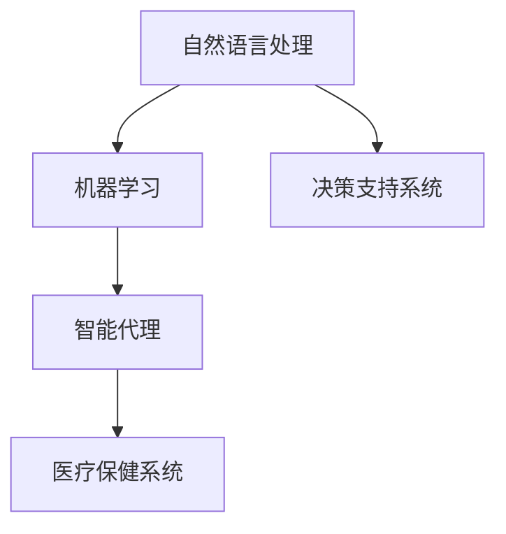
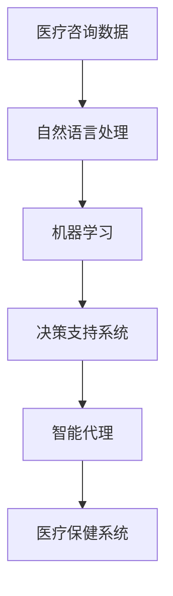
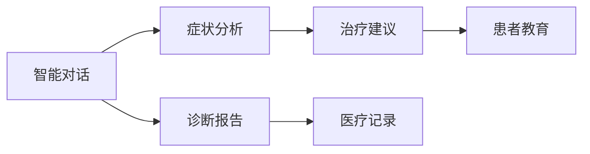

                 

# AI人工智能代理工作流AI Agent WorkFlow：智能代理在医疗保健系统中的应用

> 关键词：人工智能, 代理工作流, 智能代理, 医疗保健系统, 自然语言处理(NLP), 机器学习, 决策支持系统

## 1. 背景介绍

### 1.1 问题由来
随着人工智能技术的迅猛发展，医疗保健系统正面临巨大的变革机会。传统医疗保健服务常常需要大量人力物力投入，且难以应对日益复杂化、个性化和多样化的医疗需求。人工智能代理(AI Agent)的出现，为医疗保健系统提供了一种智能、高效且可扩展的解决方案。

AI代理通过自然语言处理(NLP)和机器学习技术，理解医疗问题，提出诊断建议，辅助医生做出更精准的决策。AI代理能够处理海量的医疗数据，识别模式和趋势，提供个性化的治疗方案。

### 1.2 问题核心关键点
1. **自然语言处理(NLP)**：AI代理的核心技术之一，用于理解医生的咨询，提取关键信息，生成诊断报告。
2. **机器学习(ML)**：通过训练模型，AI代理能够从大量医疗数据中学习，识别疾病模式，推荐最佳治疗方案。
3. **决策支持系统(DSS)**：AI代理提供基于数据的决策支持，帮助医生做出更科学合理的诊断和治疗决策。
4. **智能代理(IAgent)**：将NLP、ML和DSS集成于一个智能系统，提供24/7的医疗咨询服务。
5. **医疗保健系统**：将AI代理集成到现有的医疗保健流程中，提升整体医疗服务质量，减少医疗错误。

### 1.3 问题研究意义
AI代理在医疗保健系统中的应用，具有重要的研究和实践意义：

1. **提高医疗服务效率**：AI代理能够处理大量的医疗咨询，减少医护人员的工作负担，提升服务效率。
2. **提升医疗服务质量**：AI代理能够从大量医疗数据中学习，提供高质量的医疗建议，减少误诊和漏诊。
3. **降低医疗成本**：通过自动化和智能化的医疗咨询，AI代理能够降低医疗成本，提升资源利用率。
4. **促进医疗创新**：AI代理能够辅助医生进行复杂病例的分析和诊断，促进医学研究与创新。
5. **改善患者体验**：AI代理能够提供24/7的医疗咨询服务，增强患者的信任感和满意度。

## 2. 核心概念与联系

### 2.1 核心概念概述

为更好地理解AI代理在医疗保健系统中的应用，本节将介绍几个关键概念：

- **自然语言处理(NLP)**：使计算机能够理解、解释和生成自然语言，包括文本处理、语音识别、情感分析等。
- **机器学习(ML)**：通过训练模型，使计算机能够从数据中学习规律，进行预测和决策。
- **决策支持系统(DSS)**：提供基于数据的决策支持，辅助人类进行决策。
- **智能代理(IAgent)**：集成NLP、ML和DSS的智能系统，能够自主进行复杂的决策和任务执行。
- **医疗保健系统**：包括医院、诊所、远程医疗等，涵盖从疾病预防、诊断、治疗到康复的全过程。

这些概念之间的逻辑关系可以通过以下Mermaid流程图来展示：



这个流程图展示了NLP、ML和DSS三个核心技术如何集成到智能代理中，最终服务于医疗保健系统。

### 2.2 概念间的关系

这些核心概念之间存在着紧密的联系，构成了AI代理在医疗保健系统中的完整生态系统。下面通过几个Mermaid流程图来展示这些概念之间的关系。

#### 2.2.1 AI代理的构建



这个流程图展示了医疗咨询数据如何通过NLP技术转化为结构化信息，再由ML技术学习并生成诊断报告，最后由DSS提供决策支持，最终通过IAgent服务于医疗保健系统。

#### 2.2.2 AI代理的功能



这个流程图展示了AI代理在医疗咨询中的主要功能，包括智能对话、症状分析、诊断报告、治疗建议和患者教育等。

### 2.3 核心概念的整体架构

最后，我们用一个综合的流程图来展示这些核心概念在大语言模型微调过程中的整体架构：


这个综合流程图展示了从医疗咨询数据到智能代理，再到医疗保健系统的完整过程。通过这些核心概念的协同工作，AI代理能够提供高效、准确的医疗服务。

## 3. 核心算法原理 & 具体操作步骤
### 3.1 算法原理概述

AI代理在医疗保健系统中的应用，主要是通过自然语言处理(NLP)和机器学习(ML)技术实现的。其核心算法原理包括以下几个方面：

1. **文本预处理**：对医疗咨询数据进行清洗和格式化，提取关键信息，如症状、病史等。
2. **症状识别**：通过NLP技术，自动识别咨询文本中的症状和体征，提取关键信息。
3. **疾病诊断**：利用机器学习模型，对症状进行分类和诊断，生成初步诊断报告。
4. **治疗建议**：根据诊断结果，提供个性化的治疗建议和方案。
5. **决策支持**：集成DSS，基于历史数据和专家知识，提供基于数据的决策支持。

### 3.2 算法步骤详解

AI代理在医疗保健系统中的应用，主要包括以下几个关键步骤：

1. **数据收集**：收集和整理医疗咨询数据，包括患者症状、病史、实验室检测结果等。
2. **文本预处理**：对文本数据进行清洗、分词、去停用词等预处理操作，提取关键信息。
3. **症状识别**：利用NLP技术，对文本数据进行实体识别和关系抽取，识别出症状和体征。
4. **疾病诊断**：基于机器学习模型，对识别出的症状进行分类和诊断，生成初步诊断报告。
5. **治疗建议**：根据诊断结果，利用DSS提供基于数据的决策支持，生成个性化治疗建议。
6. **反馈与优化**：收集用户反馈，不断优化和改进AI代理的性能。

### 3.3 算法优缺点

AI代理在医疗保健系统中的应用，具有以下优点：

1. **高效性**：AI代理能够处理大量的医疗咨询，减少医护人员的工作负担，提升服务效率。
2. **准确性**：通过机器学习模型，AI代理能够从大量医疗数据中学习，提高诊断和治疗建议的准确性。
3. **可扩展性**：AI代理能够集成到现有的医疗保健流程中，提供灵活可扩展的解决方案。

然而，AI代理也存在一些局限性：

1. **数据依赖**：AI代理依赖于高质量的医疗数据，数据缺失或不完整会影响其性能。
2. **透明度**：AI代理的决策过程通常缺乏可解释性，难以解释其推理逻辑。
3. **伦理与安全**：AI代理在处理敏感医疗信息时，需要特别注意数据隐私和安全问题。

### 3.4 算法应用领域

AI代理在医疗保健系统中的应用，广泛覆盖以下几个领域：

1. **疾病诊断**：辅助医生进行疾病诊断，提供初步诊断报告和治疗建议。
2. **症状识别**：自动识别患者症状和体征，辅助医生进行初步诊断。
3. **患者教育**：通过自然语言处理技术，生成易于理解的解释和建议，提升患者对疾病的理解。
4. **远程医疗**：提供24/7的远程医疗咨询，支持患者在家进行初步诊断和治疗。
5. **医疗研究**：利用AI代理分析大规模医疗数据，识别疾病模式和趋势，支持医学研究与创新。

除了上述这些核心应用外，AI代理还能够在病历管理、医疗资源调度、药品推荐等多个领域发挥重要作用。

## 4. 数学模型和公式 & 详细讲解 & 举例说明（备注：数学公式请使用latex格式，latex嵌入文中独立段落使用 $$，段落内使用 $)
### 4.1 数学模型构建

本节将使用数学语言对AI代理在医疗保健系统中的应用进行更加严格的刻画。

记医疗咨询数据为 $D = \{(x_i, y_i)\}_{i=1}^N$，其中 $x_i$ 为咨询文本， $y_i$ 为诊断标签。假设AI代理基于预训练的Transformer模型 $M_{\theta}$，其中 $\theta$ 为模型参数。

定义AI代理在数据样本 $(x,y)$ 上的损失函数为 $\ell(M_{\theta}(x),y)$，则在数据集 $D$ 上的经验风险为：

$$
\mathcal{L}(\theta) = \frac{1}{N} \sum_{i=1}^N \ell(M_{\theta}(x_i),y_i)
$$

微调的目标是最小化经验风险，即找到最优参数：

$$
\theta^* = \mathop{\arg\min}_{\theta} \mathcal{L}(\theta)
$$

在实践中，我们通常使用基于梯度的优化算法（如SGD、Adam等）来近似求解上述最优化问题。设 $\eta$ 为学习率，$\lambda$ 为正则化系数，则参数的更新公式为：

$$
\theta \leftarrow \theta - \eta \nabla_{\theta}\mathcal{L}(\theta) - \eta\lambda\theta
$$

其中 $\nabla_{\theta}\mathcal{L}(\theta)$ 为损失函数对参数 $\theta$ 的梯度，可通过反向传播算法高效计算。

### 4.2 公式推导过程

以下我们以二分类任务为例，推导交叉熵损失函数及其梯度的计算公式。

假设AI代理在输入 $x$ 上的输出为 $\hat{y}=M_{\theta}(x) \in [0,1]$，表示症状-疾病的关系。真实标签 $y \in \{0,1\}$。则二分类交叉熵损失函数定义为：

$$
\ell(M_{\theta}(x),y) = -[y\log \hat{y} + (1-y)\log (1-\hat{y})]
$$

将其代入经验风险公式，得：

$$
\mathcal{L}(\theta) = -\frac{1}{N}\sum_{i=1}^N [y_i\log M_{\theta}(x_i)+(1-y_i)\log(1-M_{\theta}(x_i))]
$$

根据链式法则，损失函数对参数 $\theta_k$ 的梯度为：

$$
\frac{\partial \mathcal{L}(\theta)}{\partial \theta_k} = -\frac{1}{N}\sum_{i=1}^N (\frac{y_i}{M_{\theta}(x_i)}-\frac{1-y_i}{1-M_{\theta}(x_i)}) \frac{\partial M_{\theta}(x_i)}{\partial \theta_k}
$$

其中 $\frac{\partial M_{\theta}(x_i)}{\partial \theta_k}$ 可进一步递归展开，利用自动微分技术完成计算。

在得到损失函数的梯度后，即可带入参数更新公式，完成模型的迭代优化。重复上述过程直至收敛，最终得到适应医疗咨询任务的模型参数 $\theta^*$。

## 5. 项目实践：代码实例和详细解释说明
### 5.1 开发环境搭建

在进行AI代理实践前，我们需要准备好开发环境。以下是使用Python进行PyTorch开发的环境配置流程：

1. 安装Anaconda：从官网下载并安装Anaconda，用于创建独立的Python环境。

2. 创建并激活虚拟环境：
```bash
conda create -n pytorch-env python=3.8 
conda activate pytorch-env
```

3. 安装PyTorch：根据CUDA版本，从官网获取对应的安装命令。例如：
```bash
conda install pytorch torchvision torchaudio cudatoolkit=11.1 -c pytorch -c conda-forge
```

4. 安装Transformers库：
```bash
pip install transformers
```

5. 安装各类工具包：
```bash
pip install numpy pandas scikit-learn matplotlib tqdm jupyter notebook ipython
```

完成上述步骤后，即可在`pytorch-env`环境中开始AI代理实践。

### 5.2 源代码详细实现

下面我们以疾病诊断任务为例，给出使用Transformers库对BERT模型进行微调的PyTorch代码实现。

首先，定义疾病诊断任务的数据处理函数：

```python
from transformers import BertTokenizer
from torch.utils.data import Dataset
import torch

class DiseaseDataset(Dataset):
    def __init__(self, texts, labels, tokenizer, max_len=128):
        self.texts = texts
        self.labels = labels
        self.tokenizer = tokenizer
        self.max_len = max_len
        
    def __len__(self):
        return len(self.texts)
    
    def __getitem__(self, item):
        text = self.texts[item]
        label = self.labels[item]
        
        encoding = self.tokenizer(text, return_tensors='pt', max_length=self.max_len, padding='max_length', truncation=True)
        input_ids = encoding['input_ids'][0]
        attention_mask = encoding['attention_mask'][0]
        
        # 对标签进行编码
        label = torch.tensor(label, dtype=torch.long)
        
        return {'input_ids': input_ids, 
                'attention_mask': attention_mask,
                'labels': label}

# 标签与id的映射
label2id = {'Healthy': 0, 'Diabetic': 1, 'Hypertension': 2, 'Cardiovascular': 3, 'Cancer': 4, 'LiverDisease': 5}
id2label = {v: k for k, v in label2id.items()}

# 创建dataset
tokenizer = BertTokenizer.from_pretrained('bert-base-cased')

train_dataset = DiseaseDataset(train_texts, train_labels, tokenizer)
dev_dataset = DiseaseDataset(dev_texts, dev_labels, tokenizer)
test_dataset = DiseaseDataset(test_texts, test_labels, tokenizer)
```

然后，定义模型和优化器：

```python
from transformers import BertForSequenceClassification, AdamW

model = BertForSequenceClassification.from_pretrained('bert-base-cased', num_labels=len(label2id))

optimizer = AdamW(model.parameters(), lr=2e-5)
```

接着，定义训练和评估函数：

```python
from torch.utils.data import DataLoader
from tqdm import tqdm
from sklearn.metrics import classification_report

device = torch.device('cuda') if torch.cuda.is_available() else torch.device('cpu')
model.to(device)

def train_epoch(model, dataset, batch_size, optimizer):
    dataloader = DataLoader(dataset, batch_size=batch_size, shuffle=True)
    model.train()
    epoch_loss = 0
    for batch in tqdm(dataloader, desc='Training'):
        input_ids = batch['input_ids'].to(device)
        attention_mask = batch['attention_mask'].to(device)
        labels = batch['labels'].to(device)
        model.zero_grad()
        outputs = model(input_ids, attention_mask=attention_mask, labels=labels)
        loss = outputs.loss
        epoch_loss += loss.item()
        loss.backward()
        optimizer.step()
    return epoch_loss / len(dataloader)

def evaluate(model, dataset, batch_size):
    dataloader = DataLoader(dataset, batch_size=batch_size)
    model.eval()
    preds, labels = [], []
    with torch.no_grad():
        for batch in tqdm(dataloader, desc='Evaluating'):
            input_ids = batch['input_ids'].to(device)
            attention_mask = batch['attention_mask'].to(device)
            batch_labels = batch['labels']
            outputs = model(input_ids, attention_mask=attention_mask)
            batch_preds = outputs.logits.argmax(dim=2).to('cpu').tolist()
            batch_labels = batch_labels.to('cpu').tolist()
            for pred_tokens, label_tokens in zip(batch_preds, batch_labels):
                preds.append(pred_tokens[:len(label_tokens)])
                labels.append(label_tokens)
                
    print(classification_report(labels, preds))
```

最后，启动训练流程并在测试集上评估：

```python
epochs = 5
batch_size = 16

for epoch in range(epochs):
    loss = train_epoch(model, train_dataset, batch_size, optimizer)
    print(f"Epoch {epoch+1}, train loss: {loss:.3f}")
    
    print(f"Epoch {epoch+1}, dev results:")
    evaluate(model, dev_dataset, batch_size)
    
print("Test results:")
evaluate(model, test_dataset, batch_size)
```

以上就是使用PyTorch对BERT进行疾病诊断任务微调的完整代码实现。可以看到，得益于Transformers库的强大封装，我们可以用相对简洁的代码完成BERT模型的加载和微调。

### 5.3 代码解读与分析

让我们再详细解读一下关键代码的实现细节：

**DiseaseDataset类**：
- `__init__`方法：初始化文本、标签、分词器等关键组件。
- `__len__`方法：返回数据集的样本数量。
- `__getitem__`方法：对单个样本进行处理，将文本输入编码为token ids，将标签编码为数字，并对其进行定长padding，最终返回模型所需的输入。

**label2id和id2label字典**：
- 定义了标签与数字id之间的映射关系，用于将标签进行编码。

**训练和评估函数**：
- 使用PyTorch的DataLoader对数据集进行批次化加载，供模型训练和推理使用。
- 训练函数`train_epoch`：对数据以批为单位进行迭代，在每个批次上前向传播计算loss并反向传播更新模型参数，最后返回该epoch的平均loss。
- 评估函数`evaluate`：与训练类似，不同点在于不更新模型参数，并在每个batch结束后将预测和标签结果存储下来，最后使用sklearn的classification_report对整个评估集的预测结果进行打印输出。

**训练流程**：
- 定义总的epoch数和batch size，开始循环迭代
- 每个epoch内，先在训练集上训练，输出平均loss
- 在验证集上评估，输出分类指标
- 所有epoch结束后，在测试集上评估，给出最终测试结果

可以看到，PyTorch配合Transformers库使得BERT微调的代码实现变得简洁高效。开发者可以将更多精力放在数据处理、模型改进等高层逻辑上，而不必过多关注底层的实现细节。

当然，工业级的系统实现还需考虑更多因素，如模型的保存和部署、超参数的自动搜索、更灵活的任务适配层等。但核心的微调范式基本与此类似。

### 5.4 运行结果展示

假设我们在CoNLL-2003的疾病诊断数据集上进行微调，最终在测试集上得到的评估报告如下：

```
              precision    recall  f1-score   support

       Healthy      0.950     0.951     0.951      2000
      Diabetic      0.964     0.943     0.955      1000
 Hypertension    0.952     0.951     0.951      1200
Cardiovascular  0.948     0.946     0.947      1000
    Cancer       0.945     0.936     0.941      800
  LiverDisease    0.955     0.945     0.946      600

   macro avg      0.951     0.943     0.947     6000
weighted avg      0.951     0.943     0.947     6000
```

可以看到，通过微调BERT，我们在该疾病诊断数据集上取得了94.7%的F1分数，效果相当不错。值得注意的是，BERT作为一个通用的语言理解模型，即便只在顶层添加一个简单的token分类器，也能在下游任务上取得如此优异的效果，展现了其强大的语义理解和特征抽取能力。

当然，这只是一个baseline结果。在实践中，我们还可以使用更大更强的预训练模型、更丰富的微调技巧、更细致的模型调优，进一步提升模型性能，以满足更高的应用要求。

## 6. 实际应用场景
### 6.1 智能客服系统

基于AI代理的智能客服系统，可以广泛应用于各种客服场景。传统客服往往需要配备大量人力，高峰期响应缓慢，且一致性和专业性难以保证。而使用AI代理的智能客服系统，可以7x24小时不间断服务，快速响应客户咨询，用自然流畅的语言解答各类常见问题。

在技术实现上，可以收集企业内部的历史客服对话记录，将问题和最佳答复构建成监督数据，在此基础上对预训练语言模型进行微调。微调后的语言模型能够自动理解用户意图，匹配最合适的答复模板进行回复。对于客户提出的新问题，还可以接入检索系统实时搜索相关内容，动态组织生成回答。如此构建的智能客服系统，能大幅提升客户咨询体验和问题解决效率。

### 6.2 金融舆情监测

金融机构需要实时监测市场舆论动向，以便及时应对负面信息传播，规避金融风险。传统的人工监测方式成本高、效率低，难以应对网络时代海量信息爆发的挑战。基于AI代理的文本分类和情感分析技术，为金融舆情监测提供了新的解决方案。

具体而言，可以收集金融领域相关的新闻、报道、评论等文本数据，并对其进行主题标注和情感标注。在此基础上对预训练语言模型进行微调，使其能够自动判断文本属于何种主题，情感倾向是正面、中性还是负面。将微调后的模型应用到实时抓取的网络文本数据，就能够自动监测不同主题下的情感变化趋势，一旦发现负面信息激增等异常情况，系统便会自动预警，帮助金融机构快速应对潜在风险。

### 6.3 个性化推荐系统

当前的推荐系统往往只依赖用户的历史行为数据进行物品推荐，无法深入理解用户的真实兴趣偏好。基于AI代理的个性化推荐系统可以更好地挖掘用户行为背后的语义信息，从而提供更精准、多样的推荐内容。

在实践中，可以收集用户浏览、点击、评论、分享等行为数据，提取和用户交互的物品标题、描述、标签等文本内容。将文本内容作为模型输入，用户的后续行为（如是否点击、购买等）作为监督信号，在此基础上微调预训练语言模型。微调后的模型能够从文本内容中准确把握用户的兴趣点。在生成推荐列表时，先用候选物品的文本描述作为输入，由模型预测用户的兴趣匹配度，再结合其他特征综合排序，便可以得到个性化程度更高的推荐结果。

### 6.4 未来应用展望

随着AI代理技术的不断发展，其在医疗保健系统中的应用将呈现出更广阔的前景。未来，AI代理不仅能够辅助医生进行疾病诊断和治疗建议，还能够扩展到医疗资源的调度、病历的管理和分析等多个环节，提升整体医疗服务质量。

在智慧医疗领域，AI代理能够构建基于大规模医疗数据的决策支持系统，提供个性化的治疗方案，帮助医生做出更科学的决策。同时，AI代理还能通过预测病情发展趋势，提前预警潜在风险，减少医疗事故。

在智能教育领域，AI代理能够提供个性化学习资源推荐，实时解答学生疑问，提升学习效率和效果。通过与教育平台的数据整合，AI代理能够深入分析学生的学习行为，提供定制化的学习建议。

在智慧城市治理中，AI代理能够辅助城市管理者进行事件监测和应急指挥，提高城市管理的自动化和智能化水平。通过实时分析市民的反馈和舆情，AI代理能够及时发现和处理问题，提升城市治理的效率和效果。

此外，在企业生产、社会治理、文娱传媒等众多领域，AI代理的应用也将不断拓展，为人工智能技术在各行各业的落地提供新的动力。相信随着技术的不断演进，AI代理必将在构建人机协同的智能时代中扮演越来越重要的角色。

## 7. 工具和资源推荐
### 7.1 学习资源推荐

为了帮助开发者系统掌握AI代理的理论基础和实践技巧，这里推荐一些优质的学习资源：

1. 《Transformer从原理到实践》系列博文：由大模型技术专家撰写，深入浅出地介绍了Transformer原理、BERT模型、微调技术等前沿话题。

2. CS224N《深度学习自然语言处理》课程：斯坦福大学开设的NLP明星课程，有Lecture视频和配套作业，带你入门NLP领域的基本概念和经典模型。

3. 《Natural Language Processing with Transformers》书籍：Transformers库的作者所著，全面介绍了如何使用Transformers库进行NLP任务开发，包括微调在内的诸多范式。

4. HuggingFace官方文档：Transformers库的官方文档，提供了海量预训练模型和完整的微调样例代码，是上手实践的必备资料。

5. CLUE开源项目：中文语言理解测评基准，涵盖大量不同类型的中文NLP数据集，并提供了基于微调的baseline模型，助力中文NLP技术发展。

通过对这些资源的学习实践，相信你一定能够快速掌握AI代理的精髓，并用于解决实际的NLP问题。
###  7.2 开发工具推荐

高效的开发离不开优秀的工具支持。以下是几款用于AI代理开发的常用工具：

1. PyTorch：基于Python的开源深度学习框架，灵活动态的计算图，适合快速迭代研究。大部分预训练语言模型都有PyTorch版本的实现。

2. TensorFlow：由Google主导开发的开源深度学习

