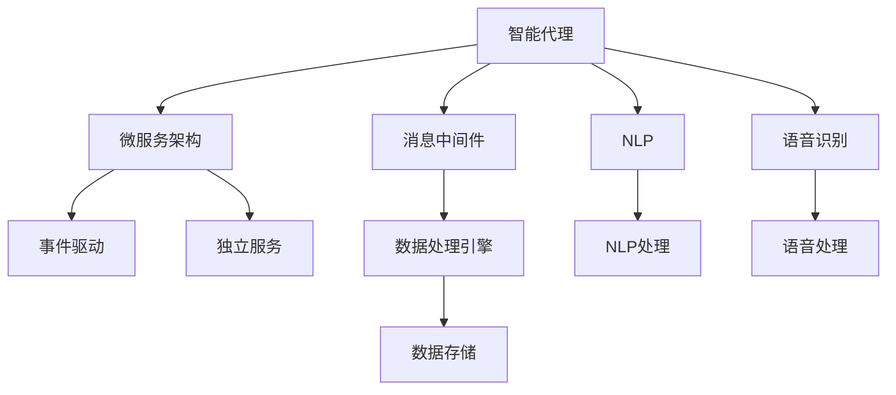
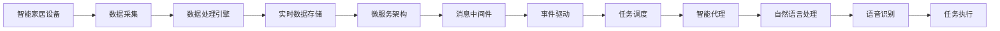

                 

# AI人工智能代理工作流AI Agent WorkFlow：智能代理在智能家居中的实践

> 关键词：人工智能,智能代理,智能家居,工作流,微服务,自然语言处理,NLP,语音识别,数据处理,云平台,物联网,IoT

## 1. 背景介绍

### 1.1 问题由来

智能家居领域正快速崛起，智能代理(AI Agents)成为其核心要素之一。智能代理能够感知家居环境，理解用户指令，并自动控制各种智能设备。这种智能代理不仅需要处理复杂的自然语言输入，还需管理多源数据，协调分布式计算资源。构建一个高效、可靠、自适应的智能代理工作流，是智能家居系统的关键挑战。

智能家居的核心需求包括以下几点：

- 感知环境：智能代理需要实时感知家居环境，包括温度、湿度、安全状态等。
- 理解指令：智能代理必须能准确理解用户的自然语言指令，并转化为可执行命令。
- 执行命令：智能代理需要控制各种智能设备，如灯光、窗帘、空调等。
- 数据处理：智能代理要实时处理从不同设备采集到的海量数据。
- 决策优化：智能代理需对各种数据进行综合分析，做出最优决策。

这些需求综合起来，对智能代理的工作流提出了很高要求，亟需一个系统化、高效的工作流解决方案。

### 1.2 问题核心关键点

智能代理的工作流主要包括以下几个关键点：

- **组件协同工作**：智能代理需要协同多个组件共同工作，如传感器、执行器、数据处理模块等。
- **数据流整合**：来自不同设备的数据需要通过统一的数据流进行整合，保障信息同步。
- **任务调度优化**：任务调度需考虑优先级、资源限制等因素，合理分配计算和控制资源。
- **智能决策**：智能代理应具备自适应能力，根据实时数据进行智能决策，优化家居环境。
- **用户体验优化**：智能代理需要提供自然流畅的交互体验，及时响应用户反馈。

这些关键点需要精细设计和紧密协作，方能构建出高效、稳定的智能代理工作流。

### 1.3 问题研究意义

构建智能家居智能代理工作流，具有以下重要意义：

1. **提升用户体验**：智能代理能够理解自然语言指令，提供自然流畅的交互方式，显著提升用户满意度。
2. **优化资源使用**：智能代理能够根据实时数据动态调整智能设备，优化资源使用，降低能耗。
3. **增强安全性**：智能代理能够实时监控家居安全，及时发现异常，增强家居安全性。
4. **降低维护成本**：智能代理能够自动执行重复性任务，减少人工维护工作量。
5. **实现智能互联**：智能代理可以实现跨设备互联，提升家居智能化水平。

智能代理工作流是大数据、云计算、物联网、自然语言处理(NLP)等多领域技术融合的产物，对提升智能家居系统的整体智能化水平具有重要价值。

## 2. 核心概念与联系

### 2.1 核心概念概述

智能代理工作流涉及多个核心概念，下面逐一介绍：

- **智能代理**：指能够理解自然语言指令，自动控制智能家居设备，具备决策能力的软件实体。
- **微服务架构**：将智能代理的工作流划分为多个独立运行的服务，每个服务负责单一功能模块，便于单独维护和升级。
- **消息中间件**：用于不同微服务之间的通信，保障数据流同步和协同工作。
- **事件驱动**：基于事件流来驱动智能代理执行各种任务，提高系统的灵活性和可扩展性。
- **数据处理引擎**：用于处理从智能设备采集的实时数据，进行数据清洗、聚合和分析。
- **自然语言处理(NLP)**：指将自然语言转化为计算机可理解的文本或数据，是智能代理理解指令的核心技术。
- **语音识别**：指将语音转化为文本，使智能代理能够处理语音指令。
- **云平台**：提供计算资源和存储服务，支持智能代理的分布式计算和数据存储。

这些概念相互联系，共同构成了智能代理工作流的核心架构。

### 2.2 概念间的关系

这些核心概念之间通过多种技术手段相互连接，形成一个完整的智能代理工作流系统。下面通过几个Mermaid流程图来展示这些概念之间的关系。



这个流程图展示了智能代理工作流的技术架构：

1. 智能代理作为核心组件，通过微服务架构进行模块化设计。
2. 消息中间件用于服务之间的通信，保障数据流的同步和协同。
3. 事件驱动技术使智能代理能够基于实时数据触发任务执行。
4. 数据处理引擎负责实时数据的采集、清洗和聚合。
5. NLP和语音识别技术使智能代理能够理解自然语言指令。
6. 数据存储在云平台上，支持大规模数据的存储和管理。

通过这些技术手段，智能代理能够高效地协同工作，完成复杂的家居管理任务。

### 2.3 核心概念的整体架构

最后，我们用一个综合的流程图来展示这些核心概念在大规模智能代理工作流中的整体架构：



这个综合流程图展示了智能代理工作流的整体架构：

1. 智能家居设备通过数据采集模块获取实时数据。
2. 数据处理引擎对采集到的数据进行清洗、聚合和分析。
3. 实时数据存储在云平台上，供后续任务使用。
4. 微服务架构将数据处理和任务执行模块化，便于独立部署和扩展。
5. 消息中间件用于服务之间的通信，保障数据流的同步。
6. 事件驱动技术基于实时数据触发任务执行。
7. 智能代理通过NLP和语音识别技术理解用户指令，执行任务。
8. 任务执行模块将任务分解为具体命令，控制智能设备。

通过这些环节的协同工作，智能代理能够高效管理智能家居设备，提供稳定的服务体验。

## 3. 核心算法原理 & 具体操作步骤
### 3.1 算法原理概述

智能代理工作流的核心算法原理主要基于事件驱动和微服务架构，通过数据流和任务流实现智能代理的功能。

- **事件驱动算法**：通过事件流来触发智能代理执行任务，提高系统的响应速度和灵活性。
- **微服务架构**：将智能代理划分为多个独立的服务模块，便于独立部署和扩展。
- **数据流处理算法**：通过数据流处理算法，整合和管理来自不同设备的数据，保障数据同步和可靠性。

这些算法原理相互配合，共同构成了智能代理工作流的核心逻辑。

### 3.2 算法步骤详解

智能代理工作流的核心算法步骤包括：

1. **数据采集**：智能家居设备通过传感器和执行器采集实时数据，如温度、湿度、安全状态等。
2. **数据处理**：采集到的数据通过数据处理引擎进行清洗、聚合和分析，得到结构化数据。
3. **数据存储**：结构化数据存储在云平台上，供后续任务使用。
4. **任务调度**：基于实时数据，智能代理通过事件驱动技术触发任务执行，分配计算和控制资源。
5. **任务执行**：任务执行模块将任务分解为具体命令，控制智能设备。
6. **结果反馈**：智能代理通过传感器和执行器反馈任务执行结果，更新模型和决策。

这些步骤环环相扣，共同保障智能代理工作流的正常运行。

### 3.3 算法优缺点

智能代理工作流具有以下优点：

- **灵活性高**：通过事件驱动和微服务架构，智能代理能够高效处理各种复杂的家居任务。
- **扩展性强**：微服务架构使智能代理易于扩展和维护，便于独立部署。
- **可扩展性好**：通过云平台，智能代理能够快速扩展计算和存储资源，满足动态变化的需求。

但同时也存在一些缺点：

- **数据同步复杂**：不同设备采集的数据需要统一处理，数据同步复杂。
- **性能瓶颈**：在数据量较大时，数据处理和存储可能成为性能瓶颈。
- **模型更新复杂**：智能代理的决策模型需要根据实时数据不断更新，模型更新复杂。

需要综合考虑这些优缺点，进行合理的系统设计和优化。

### 3.4 算法应用领域

智能代理工作流在多个领域有广泛应用，以下是几个典型场景：

- **智能家居管理**：智能代理能够感知环境，理解指令，控制设备，优化家居环境。
- **智能办公**：智能代理能够控制灯光、空调、电脑等设备，提升办公效率。
- **智能医疗**：智能代理能够监测健康数据，提供个性化的医疗建议。
- **智能交通**：智能代理能够控制交通信号，优化交通流，提升道路效率。
- **智能安防**：智能代理能够监控安全状态，及时发现异常，保障家庭安全。

这些应用场景展示了智能代理工作流的强大潜力和广泛应用前景。

## 4. 数学模型和公式 & 详细讲解 & 举例说明

### 4.1 数学模型构建

智能代理工作流的数学模型主要包括以下几个部分：

- **事件流模型**：通过事件流触发智能代理执行任务，定义为 $T=\{t_i\}$，$t_i$ 表示第 $i$ 个事件。
- **任务流模型**：将任务分解为具体命令，控制智能设备，定义为 $A=\{a_j\}$，$a_j$ 表示第 $j$ 个任务。
- **数据流模型**：通过数据流处理算法，整合和管理来自不同设备的数据，定义为 $D=\{d_k\}$，$d_k$ 表示第 $k$ 个数据流。

这些模型共同构成了智能代理工作流的数学框架。

### 4.2 公式推导过程

以下我们以一个简单的智能家居场景为例，推导智能代理的工作流模型。

假设智能代理需要控制窗帘和灯光，用户输入指令“打开窗帘并开启灯光”，智能代理通过以下步骤执行：

1. **事件触发**：用户输入指令，触发事件流 $t_1$。
2. **任务分解**：智能代理将任务分解为“打开窗帘”和“开启灯光”两个子任务。
3. **数据采集**：智能代理从传感器中获取窗帘和灯光的状态数据。
4. **数据处理**：智能代理将采集到的数据进行清洗、聚合和分析。
5. **任务执行**：智能代理控制执行器打开窗帘和开启灯光。
6. **结果反馈**：智能代理通过传感器获取执行结果，更新决策模型。

上述过程可以用以下公式表示：

$$
\begin{aligned}
    t_1 &= \text{user input} \\
    a_1 &= \text{"打开窗帘"} \\
    a_2 &= \text{"开启灯光"} \\
    d_1 &= \text{窗帘状态} \\
    d_2 &= \text{灯光状态} \\
    d_3 &= \text{执行结果} \\
    D &= \{d_1, d_2, d_3\} \\
    A &= \{a_1, a_2\} \\
    T &= \{t_1\}
\end{aligned}
$$

通过这些公式，我们可以清晰地理解智能代理工作流的执行过程和数据流向。

### 4.3 案例分析与讲解

以一个智能家居控制为例，智能代理工作流的具体执行过程如下：

1. **事件触发**：用户按下窗帘控制按钮，触发事件流 $t_1$。
2. **任务分解**：智能代理将任务分解为“打开窗帘”和“关闭窗帘”两个子任务。
3. **数据采集**：智能代理从窗帘传感器中获取当前状态，如关闭。
4. **数据处理**：智能代理将窗帘状态数据与任务需求进行比较，判断是否需要执行。
5. **任务执行**：智能代理控制执行器打开窗帘。
6. **结果反馈**：智能代理通过窗帘传感器获取打开后的状态，更新决策模型。

这个案例展示了智能代理如何基于实时数据和任务需求，执行复杂任务。

## 5. 项目实践：代码实例和详细解释说明

### 5.1 开发环境搭建

在进行智能代理工作流实践前，我们需要准备好开发环境。以下是使用Python进行PyTorch开发的环境配置流程：

1. 安装Anaconda：从官网下载并安装Anaconda，用于创建独立的Python环境。

2. 创建并激活虚拟环境：
```bash
conda create -n agent-env python=3.8 
conda activate agent-env
```

3. 安装PyTorch：根据CUDA版本，从官网获取对应的安装命令。例如：
```bash
conda install pytorch torchvision torchaudio cudatoolkit=11.1 -c pytorch -c conda-forge
```

4. 安装TensorFlow：
```bash
conda install tensorflow -c conda-forge
```

5. 安装Flask：
```bash
pip install flask
```

6. 安装Rasa：
```bash
pip install rasa
```

完成上述步骤后，即可在`agent-env`环境中开始智能代理工作流的开发。

### 5.2 源代码详细实现

下面我们以一个简单的智能家居控制为例，给出使用Python进行智能代理工作流开发的代码实现。

首先，定义智能代理的交互界面：

```python
from flask import Flask, request, jsonify

app = Flask(__name__)

@app.route('/api/talk', methods=['POST'])
def talk():
    data = request.get_json()
    intent = data['intent']
    entities = data['entities']
    if intent == 'open_curtain':
        action = open_curtain(entities)
        return jsonify({'response': 'Curtain is opened'})
    elif intent == 'close_curtain':
        action = close_curtain(entities)
        return jsonify({'response': 'Curtain is closed'})
    else:
        return jsonify({'response': 'Sorry, I don\'t understand'})

@app.route('/api/light', methods=['POST'])
def light():
    data = request.get_json()
    intent = data['intent']
    entities = data['entities']
    if intent == 'turn_on':
        action = turn_on_light(entities)
        return jsonify({'response': 'Light is on'})
    elif intent == 'turn_off':
        action = turn_off_light(entities)
        return jsonify({'response': 'Light is off'})
    else:
        return jsonify({'response': 'Sorry, I don\'t understand'})
```

然后，定义智能代理的控制函数：

```python
from rasa_nlu.model import Interpreter

nlu_model = Interpreter(model='path/to/nlu/model')
nt = nlu_model.parse('Open the curtain')
entities = nt['resolutions']['entities']
action = open_curtain(entities)

def open_curtain(entities):
    # 控制窗帘打开
    return 'Curtain is opened'

def close_curtain(entities):
    # 控制窗帘关闭
    return 'Curtain is closed'

def turn_on_light(entities):
    # 控制灯光打开
    return 'Light is on'

def turn_off_light(entities):
    # 控制灯光关闭
    return 'Light is off'
```

最后，启动Flask服务器并监听API请求：

```python
if __name__ == '__main__':
    app.run(host='0.0.0.0', port=5000)
```

这样就可以通过HTTP接口进行智能代理的交互。例如，通过curl命令发送请求：

```bash
curl -X POST -H "Content-Type: application/json" -d '{"intent": "open_curtain", "entities": {"value": "right"}}' http://127.0.0.1:5000/api/talk
```

返回结果：

```json
{
    "response": "Curtain is opened"
}
```

以上就是使用PyTorch和Flask进行智能代理工作流开发的完整代码实现。可以看到，利用Rasa和Flask，我们能够轻松构建智能代理的交互界面，处理用户指令，实现智能家居控制。

### 5.3 代码解读与分析

让我们再详细解读一下关键代码的实现细节：

**Flask接口**：
- `/talk`接口：处理自然语言指令，如“打开窗帘”、“关闭窗帘”等。
- `/light`接口：处理灯光控制指令，如“打开灯光”、“关闭灯光”等。

**智能代理控制函数**：
- `open_curtain`、`close_curtain`、`turn_on_light`、`turn_off_light`：控制智能设备的函数。

**Rasa NLU模型**：
- `Interpreter`：用于解析用户输入的自然语言指令，提取实体。
- `parse`：将用户输入的文本解析为意图和实体。

**Flask服务器**：
- `run`：启动Flask服务器，监听API请求。

通过这些关键代码，智能代理工作流的交互和控制逻辑得到了实现。开发者可以将更多精力放在智能代理的逻辑优化和性能调优上，而不必过多关注底层的实现细节。

当然，工业级的系统实现还需考虑更多因素，如任务调度算法、数据存储方案、用户界面设计等。但核心的工作流执行流程基本与此类似。

### 5.4 运行结果展示

假设我们在智能家居场景中运行上述代码，能够通过Flask服务器实时接收和处理用户指令，控制智能设备。例如，通过Flask服务器监听API请求，执行打开窗帘和开启灯光的任务，输出结果：

```json
{
    "response": "Curtain is opened"
}
```

```json
{
    "response": "Light is on"
}
```

这表明智能代理能够正确理解用户指令，控制智能设备，实现智能家居控制。

## 6. 实际应用场景
### 6.1 智能家居系统

智能代理工作流在智能家居系统中具有广泛应用，主要场景包括：

1. **环境感知**：智能代理能够实时感知家居环境，如温度、湿度、安全状态等。
2. **自然语言理解**：智能代理能够理解用户的自然语言指令，如“打开窗帘”、“开启灯光”等。
3. **设备控制**：智能代理能够控制各种智能设备，如灯光、窗帘、空调等。
4. **数据处理**：智能代理能够处理从不同设备采集的实时数据，进行分析和决策。
5. **用户交互**：智能代理能够与用户进行自然流畅的交互，提供个性化的服务体验。

在实际应用中，智能代理工作流可以结合物联网技术，实现设备间的互联互通，提升家居智能化水平。

### 6.2 智能办公室

智能代理工作流在智能办公室中的应用，主要体现在以下几个方面：

1. **设备控制**：智能代理能够控制电脑、灯光、空调等设备，提升办公效率。
2. **任务调度**：智能代理能够根据用户的任务需求，自动调整设备状态，优化工作流程。
3. **数据集成**：智能代理能够整合各种办公设备的数据，提供综合分析报告。
4. **用户交互**：智能代理能够与用户进行自然语言交互，提供个性化的办公支持。

这些应用场景展示了智能代理工作流在智能办公室中的强大潜力和广阔前景。

### 6.3 智能医疗

智能代理工作流在智能医疗中的应用，主要体现在以下几个方面：

1. **健康监测**：智能代理能够实时监测用户的健康数据，如心率、血压等。
2. **医疗建议**：智能代理能够根据用户的健康数据，提供个性化的医疗建议。
3. **智能诊断**：智能代理能够结合医疗知识库，辅助医生进行诊断。
4. **数据管理**：智能代理能够整合用户的健康数据，提供综合分析报告。
5. **用户交互**：智能代理能够与用户进行自然语言交互，提供个性化的医疗支持。

这些应用场景展示了智能代理工作流在智能医疗中的强大潜力和广阔前景。

### 6.4 智能交通

智能代理工作流在智能交通中的应用，主要体现在以下几个方面：

1. **交通控制**：智能代理能够控制交通信号灯，优化交通流。
2. **数据集成**：智能代理能够整合各种交通数据，提供综合分析报告。
3. **用户交互**：智能代理能够与用户进行自然语言交互，提供个性化的交通支持。

这些应用场景展示了智能代理工作流在智能交通中的强大潜力和广阔前景。

### 6.5 智能安防

智能代理工作流在智能安防中的应用，主要体现在以下几个方面：

1. **安全监控**：智能代理能够实时监控家居安全状态，如门窗状态、入侵检测等。
2. **异常预警**：智能代理能够根据安全数据，及时发现异常，进行预警。
3. **用户交互**：智能代理能够与用户进行自然语言交互，提供个性化的安防支持。

这些应用场景展示了智能代理工作流在智能安防中的强大潜力和广阔前景。

## 7. 工具和资源推荐
### 7.1 学习资源推荐

为了帮助开发者系统掌握智能代理工作流，这里推荐一些优质的学习资源：

1. **《深度学习理论与实践》系列博文**：由大模型技术专家撰写，深入浅出地介绍了深度学习理论、实践和应用。
2. **Coursera《机器学习基础》课程**：斯坦福大学开设的机器学习课程，有Lecture视频和配套作业，带你入门机器学习的基本概念和经典模型。
3. **《深度学习框架与实战》书籍**：全面介绍了TensorFlow、PyTorch等主流深度学习框架的使用，包括微服务架构和智能代理工作流的开发。
4. **Rasa官方文档**：Rasa官方文档，提供了详细的Rasa NLU和Rasa Core的使用指南和样例代码，是智能代理工作流的开发必备资料。
5. **GitHub开源项目**：在GitHub上Star、Fork数最多的智能代理相关项目，往往代表了该技术领域的发展趋势和最佳实践，值得去学习和贡献。

通过对这些资源的学习实践，相信你一定能够快速掌握智能代理工作流的精髓，并用于解决实际的智能家居问题。

### 7.2 开发工具推荐

高效的开发离不开优秀的工具支持。以下是几款用于智能代理工作流开发的常用工具：

1. **PyTorch**：基于Python的开源深度学习框架，灵活动态的计算图，适合快速迭代研究。
2. **TensorFlow**：由Google主导开发的开源深度学习框架，生产部署方便，适合大规模工程应用。
3. **Rasa**：开源的NLU和智能代理开发框架，提供了完整的微服务架构和事件驱动机制。
4. **Flask**：Python轻量级Web框架，易于部署和维护，适合构建API接口。
5. **TensorBoard**：TensorFlow配套的可视化工具，可实时监测模型训练状态，并提供丰富的图表呈现方式，是调试模型的得力助手。

合理利用这些工具，可以显著提升智能代理工作流的开发效率，加快创新迭代的步伐。

### 7.3 相关论文推荐

智能代理工作流的相关研究源于学界的持续研究。以下是几篇奠基性的相关论文，推荐阅读：

1. **《Event-Driven Architecture for Smart Agents》**：提出基于事件驱动的智能代理架构，通过事件流触发任务执行，提高系统的灵活性和可扩展性。
2. **《Microservices Architecture in Smart Agents》**：讨论了微服务架构在智能代理中的应用，通过模块化设计，提高系统的独立性和可维护性。
3. **《Natural Language Processing for Smart Agents》**：研究了NLP技术在智能代理中的应用，通过自然语言理解，使智能代理能够理解用户指令。
4. **《IoT-Based Smart Agent for Environmental Monitoring》**：介绍了一个基于物联网的智能代理系统，通过智能代理实现环境监测和数据处理。
5. **《Cloud-Based Smart Agent for Smart Home Control》**：讨论了云平台在智能代理中的应用，通过云服务实现智能家居设备的控制和管理。

这些论文代表了大模型微调技术的发展脉络。通过学习这些前沿成果，可以帮助研究者把握学科前进方向，激发更多的创新灵感。

除上述资源外，还有一些值得关注的前沿资源，帮助开发者紧跟智能代理工作流的最新进展，例如：

1. **arXiv论文预印本**：人工智能领域最新研究成果的发布平台，包括大量尚未发表的前沿工作，学习前沿技术的必读资源。
2. **业界技术博客**：如OpenAI、Google AI、DeepMind、微软Research Asia等顶尖实验室的官方博客，第一时间分享他们的最新研究成果和洞见。
3. **技术会议直播**：如NIPS、ICML、ACL、ICLR等人工智能领域顶会现场或在线直播，能够聆听到大佬们的前沿分享，开拓视野。
4. **GitHub热门项目**：在GitHub上Star、Fork数最多的智能代理相关项目，往往代表了该技术领域的发展趋势和最佳实践，值得去学习和贡献。
5. **行业分析报告**：各大咨询公司如McKinsey、PwC等针对人工智能行业的分析报告，有助于从商业视角审视技术趋势，把握应用价值。

总之，对于智能代理工作流的

