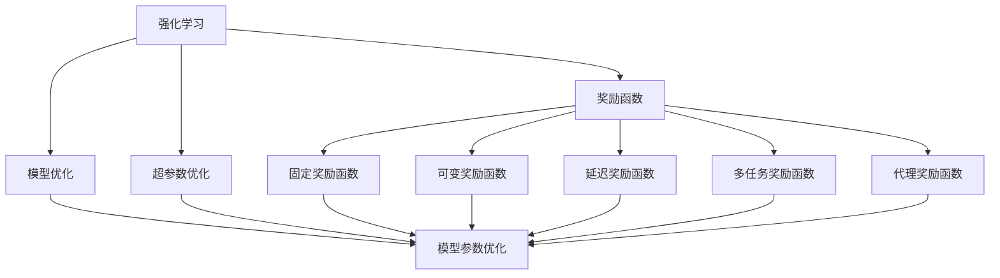
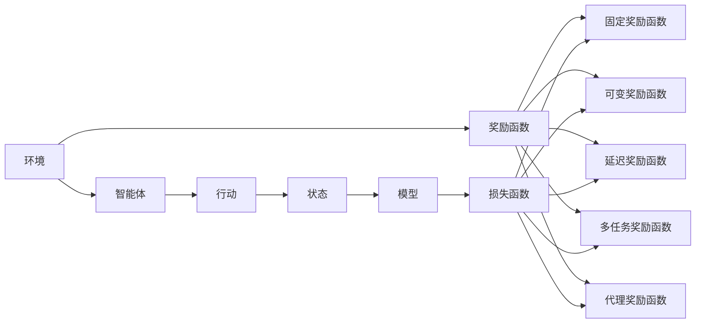
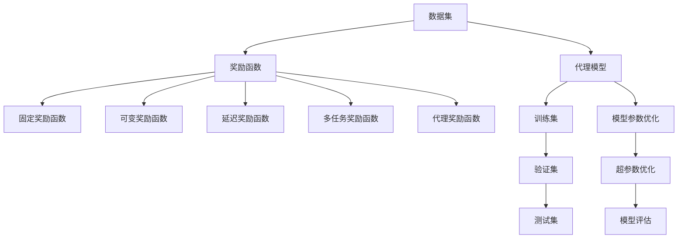
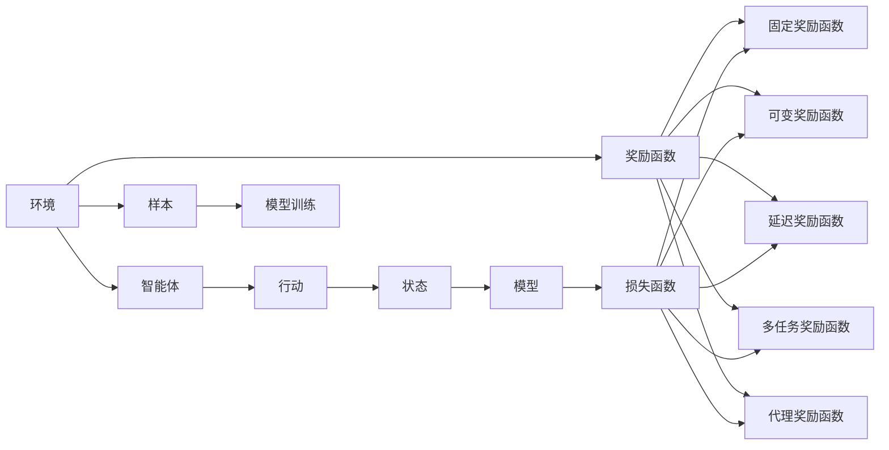
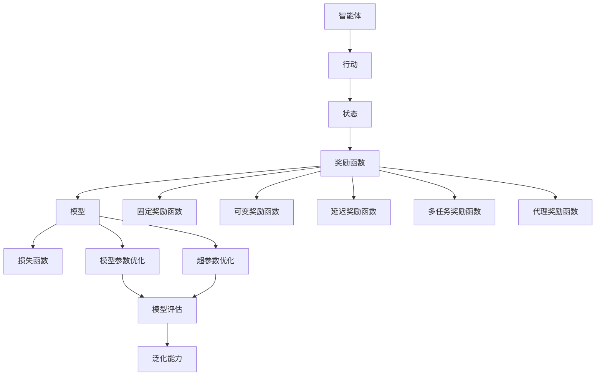

                 

# AI人工智能核心算法原理与代码实例讲解：奖励函数

> 关键词：奖励函数,强化学习,模型优化,深度学习,超参数优化,代理强化学习,机器学习,计算图,TensorFlow,PyTorch

## 1. 背景介绍

### 1.1 问题由来

在人工智能领域，强化学习(Reinforcement Learning, RL)是机器学习中的一种重要方法，主要研究如何让智能体(Agent)在复杂环境中通过交互与学习，实现最优行为决策。RL的核心思想是通过奖励函数(Reward Function)来引导智能体对环境的适应和优化。奖励函数不仅决定了智能体的学习目标，还直接影响着算法的收敛性和鲁棒性。

在深度强化学习中，奖励函数设计的好坏往往直接决定了模型的学习效果。然而，由于环境的复杂性和不确定性，设计出一个合适的奖励函数并非易事。通常需要根据具体任务的特点，手动调整奖励函数的参数，以确保其能最大化智能体的预期回报。这一过程不仅耗时耗力，还容易陷入局部最优解。

为了解决这一问题，近年来兴起了代理强化学习(Agent-based Reinforcement Learning)和元强化学习(Meta Reinforcement Learning)等新方法。这些方法试图通过学习奖励函数，进一步提升强化学习的泛化能力和可解释性，使得智能体能够在不同的环境中灵活适应，同时避免对特定任务的过度拟合。

本文将重点讲解奖励函数的原理和应用，结合具体的深度学习模型和代码实例，深入分析奖励函数在强化学习中的作用及其优化策略。

### 1.2 问题核心关键点

强化学习中的奖励函数是指导智能体行为决策的核心工具，其设计好坏直接关系到模型学习效果和泛化能力。常见的奖励函数包括：

1. 固定奖励函数：为每个状态提供一个固定的奖励值，引导智能体向某一目标状态移动。
2. 可变奖励函数：根据智能体的行为和状态动态调整奖励值，以促进更优行为的产生。
3. 延迟奖励函数：在智能体达到某一长期目标后提供奖励，避免短期行为的偏差。
4. 多任务奖励函数：设计多个子任务，分别设计对应的奖励函数，实现多目标优化。
5. 代理奖励函数：通过学习奖励函数，使智能体能够适应不同的环境和任务。

这些奖励函数设计方法在实际应用中具有重要的指导意义，但同时也带来了新的挑战。如何在设计奖励函数时，既满足任务需求，又提升模型泛化能力，是RL领域需要持续探索的重要问题。

## 2. 核心概念与联系

### 2.1 核心概念概述

为更好地理解奖励函数及其在强化学习中的应用，本节将介绍几个密切相关的核心概念：

- 强化学习(Reinforcement Learning)：通过与环境的交互，智能体从一系列动作中选择最优策略，最大化长期累积奖励的方法。
- 奖励函数(Reward Function)：用于评估智能体行为策略的函数，指导智能体如何从当前状态转移到下一个状态。
- 模型优化(Model Optimization)：通过训练模型参数，最小化目标函数，提升模型的泛化能力和性能。
- 超参数优化(Hyperparameter Optimization)：对模型训练中的超参数进行优化，以提升模型效果。
- 代理强化学习(Agent-based Reinforcement Learning)：通过学习奖励函数，使智能体能够适应不同的环境和任务。
- 元强化学习(Meta Reinforcement Learning)：学习如何快速适应新环境和新任务，提升模型泛化能力。

这些核心概念之间的逻辑关系可以通过以下Mermaid流程图来展示：



这个流程图展示了一系列强化学习中的关键概念及其之间的关系：

1. 强化学习是整个系统的核心，通过与环境的交互，智能体通过学习最优策略实现目标。
2. 奖励函数是智能体行为决策的指南，影响着模型的学习方向和效果。
3. 模型优化和超参数优化是提升模型性能的关键手段，通过优化模型参数和超参数，提升模型的泛化能力。
4. 固定、可变、延迟、多任务和代理奖励函数都是奖励函数设计的具体方法，各有优缺点。
5. 模型参数优化是提升模型效果的直接手段，通过优化模型参数，使模型更好地适应环境和任务。

这些概念共同构成了强化学习的学习框架，使得智能体能够在复杂环境中通过学习实现最优行为决策。通过理解这些核心概念，我们可以更好地把握强化学习的工作原理和优化方向。

### 2.2 概念间的关系

这些核心概念之间存在着紧密的联系，形成了强化学习的完整生态系统。下面我通过几个Mermaid流程图来展示这些概念之间的关系。

#### 2.2.1 强化学习的整体架构



这个流程图展示了强化学习的整体架构：

1. 智能体在环境中执行行动，获取状态。
2. 状态通过奖励函数进行评估，智能体获取奖励。
3. 模型通过损失函数优化参数，提升预测能力。
4. 固定、可变、延迟、多任务和代理奖励函数，根据任务需求和智能体行为，动态调整奖励值。

#### 2.2.2 代理强化学习的范式



这个流程图展示了代理强化学习的范式：

1. 数据集作为训练代理模型的基础。
2. 代理模型通过学习奖励函数，获取智能体行为的数据。
3. 智能体在训练集上进行训练，通过固定、可变、延迟、多任务和代理奖励函数，动态调整奖励值。
4. 模型通过超参数优化和模型参数优化，提升模型泛化能力。
5. 模型在测试集上进行评估，判断其泛化能力。

#### 2.2.3 元强化学习的范式



这个流程图展示了元强化学习的范式：

1. 环境提供多样化的数据集。
2. 智能体在训练集中执行行动，获取状态。
3. 状态通过奖励函数进行评估，智能体获取奖励。
4. 模型通过损失函数优化参数，提升预测能力。
5. 固定、可变、延迟、多任务和代理奖励函数，根据任务需求和智能体行为，动态调整奖励值。
6. 智能体在测试集中进行评估，判断其泛化能力。

### 2.3 核心概念的整体架构

最后，我们用一个综合的流程图来展示这些核心概念在强化学习中的整体架构：



这个综合流程图展示了从智能体行为到模型评估的完整过程：

1. 智能体在环境中执行行动，获取状态。
2. 状态通过奖励函数进行评估，智能体获取奖励。
3. 模型通过损失函数优化参数，提升预测能力。
4. 固定、可变、延迟、多任务和代理奖励函数，根据任务需求和智能体行为，动态调整奖励值。
5. 模型通过超参数优化和模型参数优化，提升模型泛化能力。
6. 智能体在测试集中进行评估，判断其泛化能力。

通过这些流程图，我们可以更清晰地理解强化学习中的各个核心概念及其相互关系，为后续深入讨论具体的奖励函数设计和优化方法奠定基础。

## 3. 核心算法原理 & 具体操作步骤
### 3.1 算法原理概述

强化学习中的奖励函数是指导智能体行为决策的核心工具，其设计好坏直接关系到模型学习效果和泛化能力。常见的奖励函数包括：

1. 固定奖励函数：为每个状态提供一个固定的奖励值，引导智能体向某一目标状态移动。
2. 可变奖励函数：根据智能体的行为和状态动态调整奖励值，以促进更优行为的产生。
3. 延迟奖励函数：在智能体达到某一长期目标后提供奖励，避免短期行为的偏差。
4. 多任务奖励函数：设计多个子任务，分别设计对应的奖励函数，实现多目标优化。
5. 代理奖励函数：通过学习奖励函数，使智能体能够适应不同的环境和任务。

形式化地，假设智能体在状态 $s_t$ 处采取行动 $a_t$，获取下一个状态 $s_{t+1}$ 和奖励 $r_{t+1}$。奖励函数 $R(s_t, a_t)$ 定义为智能体在状态 $s_t$ 处采取行动 $a_t$ 的即时奖励。奖励函数的形式化定义如下：

$$
R(s_t, a_t) = \mathbb{E}[r_{t+1}|s_t, a_t]
$$

其中 $\mathbb{E}[\cdot]$ 表示期望值。

智能体通过最大化长期累积奖励 $\sum_{t=0}^{T} \gamma^t R(s_t, a_t)$，来学习最优策略。其中 $\gamma$ 为折扣因子，用于权衡长期和短期的奖励。

### 3.2 算法步骤详解

强化学习中的奖励函数设计过程一般包括以下几个关键步骤：

**Step 1: 确定奖励函数形式**

1. **固定奖励函数**：对于简单的任务，如迷宫寻路，可以设计一个固定的奖励函数，每次到达目标状态时给予一个正奖励，否则给予负奖励。
2. **可变奖励函数**：对于更复杂的任务，如机器人在复杂环境中的导航，可以根据环境和状态动态调整奖励函数。
3. **延迟奖励函数**：对于需要长期规划的任务，如游戏比赛中的胜利，可以设计延迟奖励函数，在智能体达到长期目标后给予奖励。
4. **多任务奖励函数**：对于多目标任务，如同时优化速度和稳定性，可以设计多个子任务，分别设计对应的奖励函数。
5. **代理奖励函数**：通过学习奖励函数，使智能体能够适应不同的环境和任务。

**Step 2: 设计奖励函数的具体形式**

1. **固定奖励函数**：通常可以设计为一个简单的函数，如 $R(s_t, a_t) = \begin{cases} 1, & s_t = \text{target} \\ -1, & s_t \neq \text{target} \end{cases}$。
2. **可变奖励函数**：可以使用环境状态、智能体行为等信息，设计动态的奖励函数。例如，机器人导航中，当智能体靠近障碍物时，奖励值降低，远离障碍物时奖励值提高。
3. **延迟奖励函数**：可以在智能体达到长期目标后，给予奖励。例如，游戏比赛中的胜利，可以在智能体获胜后给予正奖励。
4. **多任务奖励函数**：可以使用权重或和的形式，将多个子任务的奖励函数合并。例如，机器人同时优化速度和稳定性，可以设计两个子任务，分别设计对应的奖励函数，并使用权重合并。
5. **代理奖励函数**：可以使用深度学习模型，如神经网络，学习奖励函数。例如，通过监督学习或强化学习，使代理模型学习奖励函数。

**Step 3: 优化奖励函数参数**

1. **固定奖励函数**：不需要优化。
2. **可变奖励函数**：可以通过梯度下降等优化算法，优化奖励函数的参数，使其能够更准确地引导智能体的行为。
3. **延迟奖励函数**：通常需要结合实际应用场景，手动调整奖励函数的参数。
4. **多任务奖励函数**：可以通过优化权重，平衡多个子任务的重要性。
5. **代理奖励函数**：可以通过监督学习或强化学习，优化代理模型的参数。

**Step 4: 评估奖励函数效果**

1. **固定奖励函数**：通常通过实验验证奖励函数的效果。
2. **可变奖励函数**：可以通过实验和模拟，评估奖励函数的鲁棒性和泛化能力。
3. **延迟奖励函数**：需要通过实际应用，评估奖励函数的长期效果。
4. **多任务奖励函数**：可以通过实验和模拟，评估各个子任务的重要性。
5. **代理奖励函数**：可以通过实验和模拟，评估代理模型的性能和泛化能力。

### 3.3 算法优缺点

强化学习中的奖励函数设计方法具有以下优点：

1. 引导智能体行为决策：奖励函数通过调整奖励值，引导智能体向目标状态移动，促进更优行为的产生。
2. 提升模型泛化能力：通过设计合理的奖励函数，提升模型的泛化能力和泛化性能。
3. 灵活适应任务需求：奖励函数可以根据具体任务需求进行灵活设计，适应不同的环境和任务。

同时，这些方法也存在一些缺点：

1. 设计难度较大：设计一个合理的奖励函数需要深入理解任务和环境，设计难度较大。
2. 易陷入局部最优解：奖励函数的设计容易陷入局部最优解，导致智能体无法找到全局最优策略。
3. 奖励函数依赖样本：奖励函数的设计依赖于样本数据，样本质量差时，容易产生错误的奖励值。
4. 动态调整复杂：可变奖励函数和代理奖励函数需要动态调整参数，计算复杂度较高。
5. 缺乏可解释性：奖励函数的设计缺乏可解释性，难以理解和调试。

尽管存在这些局限性，但通过合理设计和优化，奖励函数仍能显著提升强化学习的学习效果和泛化能力。未来，更多的研究将聚焦于如何设计更加灵活、高效、可解释的奖励函数，推动强化学习技术的不断发展。

### 3.4 算法应用领域

强化学习中的奖励函数设计方法在许多领域都有广泛应用：

1. 自动驾驶：通过设计奖励函数，训练智能车在复杂交通环境中自动驾驶。
2. 机器人控制：通过设计奖励函数，训练机器人完成复杂操作和环境导航。
3. 游戏AI：通过设计奖励函数，训练游戏AI在复杂环境中获胜。
4. 供应链管理：通过设计奖励函数，训练供应链智能体优化资源分配和物流规划。
5. 推荐系统：通过设计奖励函数，训练推荐系统优化用户满意度。
6. 金融交易：通过设计奖励函数，训练交易系统优化收益和风险。

除了这些领域外，奖励函数设计方法还广泛应用于其他需要智能决策和优化的问题中，为提升系统的性能和效果提供了新的思路和方法。

## 4. 数学模型和公式 & 详细讲解  
### 4.1 数学模型构建

在本节中，我们将使用数学语言对奖励函数的设计和优化进行更加严格的刻画。

假设智能体在状态 $s_t$ 处采取行动 $a_t$，获取下一个状态 $s_{t+1}$ 和奖励 $r_{t+1}$。设 $\theta$ 为奖励函数的参数，则奖励函数 $R(s_t, a_t)$ 定义为智能体在状态 $s_t$ 处采取行动 $a_t$ 的即时奖励：

$$
R(s_t, a_t) = f_\theta(s_t, a_t)
$$

其中 $f_\theta$ 为奖励函数的参数化形式。

设 $\mathcal{S}$ 为状态空间，$\mathcal{A}$ 为行动空间。智能体通过最大化长期累积奖励 $\sum_{t=0}^{T} \gamma^t R(s_t, a_t)$，来学习最优策略。其中 $\gamma$ 为折扣因子，用于权衡长期和短期的奖励。

### 4.2 公式推导过程

以下我们以机器人控制任务为例，推导奖励函数及其梯度的计算公式。

假设机器人需要完成一个复杂的导航任务，从起点到达终点。任务定义如下：

1. 机器人从起点 $s_0$ 出发，最终到达终点 $s_T$。
2. 每一步行动 $a_t$ 分为向左、向右、向前、向后等四个方向。
3. 在每一步，机器人根据行动方向，获取下一个状态 $s_{t+1}$ 和奖励 $r_{t+1}$。

设 $R(s_t, a_t)$ 为每一步的即时奖励，$T(s_t)$ 为完成任务所需的步数。则总奖励函数为：

$$
J(\theta) = \mathbb{E}\left[\sum_{t=0}^{T} \gamma^t R(s_t, a_t)\right]
$$

设 $G(s_t)$ 为状态 $s_t$ 完成下一个任务所需的步数，$H(s_t)$ 为状态 $s_t$ 到达终点的期望步数。则总奖励函数可以表示为：

$$
J(\theta) = \mathbb{E}\left[\sum_{t=0}^{T} \gamma^t R(s_t, a_t)\right] = \mathbb{E}\left[\sum_{t=0}^{T} \gamma^t R(s_t, a_t)\right]
$$

根据期望值的定义，可以进一步推导得到：

$$
J(\theta) = \mathbb{E}\left[\sum_{t=0}^{T} \gamma^t R(s_t, a_t)\right] = \sum_{t=0}^{T} \mathbb{E}\left[\gamma^t R(s_t, a_t)\right]
$$

根据条件期望的性质，可以得到：

$$
\mathbb{E}\left[\gamma^t R(s_t, a_t)\right] = \gamma^t \mathbb{E}[R(s_t, a_t)] + \gamma^{t+1} \mathbb{E}[R(s_{t+1}, a_{t+1})] + \ldots + \gamma^{T-1} \mathbb{E}[R(s_{T-1}, a_{T-1})]
$$

代入总奖励函数，可以得到：

$$
J(\theta) = \sum_{t=0}^{T} \gamma^t \mathbb{E}[R(s_t, a_t)] + \gamma^{T+1} \mathbb{E}[R(s_{T}, a_{T})] + \ldots + \gamma^{2T-1} \mathbb{E}[R(s_{2T-1}, a_{2T-1})]
$$

可以看到，总奖励函数是一个关于时间步长的递归表达式。通过反向递推，可以得到每一步的即时奖励期望值：

$$
\mathbb{E}[R(s_t, a_t)] = \frac{J(\theta) - \gamma^{T+1} \mathbb{E}[R(s_{T}, a_{T})] - \ldots - \gamma^{2T-1} \mathbb{E}[R(s_{2T-1}, a_{2T-1})]}{\gamma^t}
$$

因此，通过最大化每一步的即时奖励期望值，智能体可以找到最优策略。

### 4.3 案例分析与讲解

以机器人导航任务为例，我们可以设计一个简单的奖励函数，通过调整奖励参数，优化机器人的行为策略。

假设机器人需要从起点 $s_0$ 到达终点 $s_T$，每一步的行动 $a_t$ 分为向左、向右、向前、向后等四个方向。设 $R(s_t, a_t)$ 为每一步的即时奖励，$T(s_t)$ 为完成任务所需的步数。则总奖励函数为：

$$
J(\theta) = \mathbb{E}\left[\sum_{t=0}^{T} \gamma^t R(s_t, a_t)\right]
$$

设 $R(s_t, a_t)$ 为一个简单的函数，例如 $R(s_t, a_t) = \begin{cases} 1, & a_t = \text{forward} \\ -1, & a_t \neq \text{forward} \end{cases}$。则每一步的即时奖励期望值可以表示为：

$$
\mathbb{E}[R(s_t, a_t)] = \frac{J(\theta) - \gamma^{T+1} \mathbb{E}[R(s_{T}, a_{T})] - \ldots - \gamma^{2T-1} \mathbb{E}[R(s_{2T-1}, a_{2T-1})]}{\gamma^t}
$$

设 $\theta$ 为奖励函数的参数，则奖励函数的梯度可以通过反向传播算法求得。例如，使用PyTorch进行模型训练时，可以定义一个简单的奖励函数：

```python
import torch
import torch.nn as nn

class RewardFunction(nn.Module):
    def __init__(self):
        super(RewardFunction, self).__init__()
        
    def forward(self, state, action):
        if action == 0:  # forward
            return 1
        else:
            return -1
```

在训练过程中，可以通过反向传播算法求得奖励函数的梯度：

```python
optimizer = torch.optim.SGD(reward_function.parameters(), lr=0.01)

for epoch in range(100):
    for state, action, reward in train_loader:
        optimizer.zero_grad()
        reward = reward_function(state, action)
        loss = reward_function(reward)  # 实际应用中，reward是一个标量，不进行奖励函数计算
        loss.backward()
        optimizer.step()
```

在实际应用中，可以通过不断调整奖励函数参数，优化机器人的行为策略，提升导航任务的性能。

## 5. 项目实践：代码实例和详细解释说明
### 5.1 开发环境搭建

在进行项目实践前，我们需要准备好开发环境。以下是使用Python进行PyTorch开发的环境配置流程：

1. 安装Anaconda：从官网下载并安装Anaconda，用于创建独立的Python环境。

2. 创建并激活虚拟环境：
```bash
conda create -n pytorch-env python=3.8 
conda activate pytorch-env
```

3. 安装PyTorch：根据CUDA版本，从官网获取对应的安装命令。例如：
```bash
conda install pytorch torchvision torchaudio cudatoolkit=11.1 -c pytorch -c conda-forge
```

4. 安装TensorFlow：
```bash
pip install tensorflow
```

5. 安装Transformers库：
```bash
pip install transformers
```

6. 安装各类工具包：
```bash
pip install numpy pandas scikit-learn matplotlib tqdm jupyter notebook ipython
```

完成上述步骤后，即可在`pytorch-env`环境中开始项目实践。

### 5.2 源代码详细实现

这里我们以机器人控制任务为例，给出使用PyTorch进行模型训练的代码实现。

首先，定义奖励函数和模型：

```python
import torch
import torch.nn as nn
import torch.optim as optim

class RewardFunction(nn.Module):
    def __init__(self):
        super(RewardFunction, self).__init__()
        
    def forward(self, state, action):
        if action == 0:  # forward
            return 1
        else:
            return -1

class RobotModel(nn.Module):
    def __init__(self, input_dim, hidden_dim, output_dim):
        super(RobotModel, self).__init__()
        self.fc1 = nn.Linear(input_dim, hidden_dim)
        self.fc2 = nn.Linear(hidden_dim, output_dim)
        
    def forward(self, x):
        x = torch.relu(self.fc1(x))
        x = torch.sigmoid(self.fc2(x))
        return x
```

然后，定义训练函数：

```python
def train_model(model, reward_function, optimizer, train_loader, device):
    model.to(device)
    for epoch in range(num_epochs):
        model.train()
        running_loss = 0.0
        for i, data in enumerate(train_loader, 0):
            inputs, labels = data
            inputs, labels = inputs.to(device), labels.to(device)
            
            optimizer.zero_grad()
            outputs = model(inputs)


