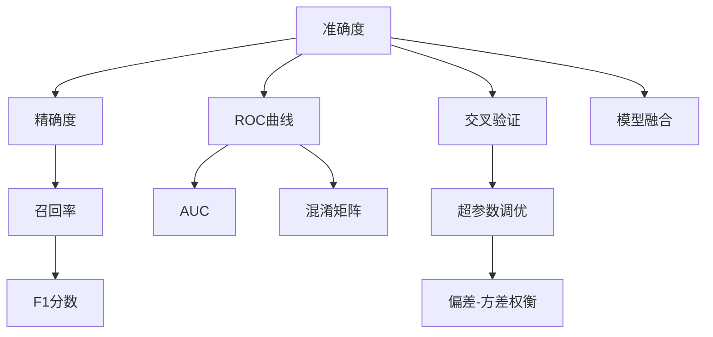
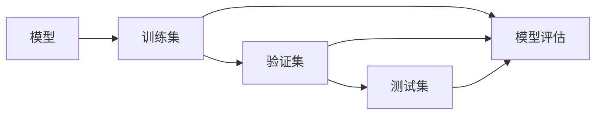
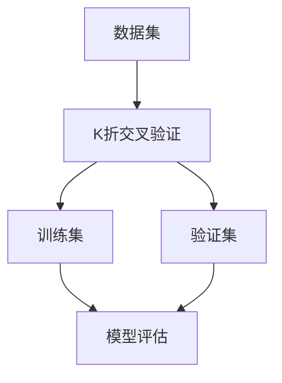
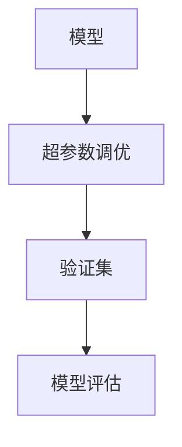
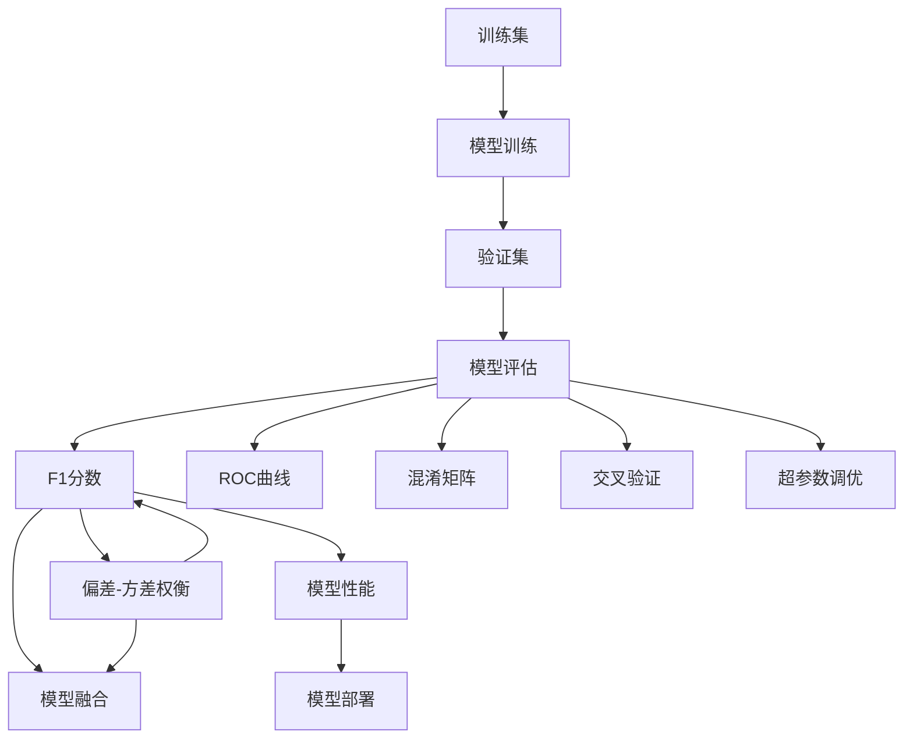

                 

# AI人工智能核心算法原理与代码实例讲解：模型评估

> 关键词：模型评估,算法原理,代码实例,性能分析,准确度,精确度,召回率,F1分数,ROC曲线,AUC,混淆矩阵,交叉验证,超参数调优,偏差-方差权衡,模型融合,梯度下降,反向传播,交叉熵损失,均方误差,正则化

## 1. 背景介绍

### 1.1 问题由来

在人工智能（AI）的广泛应用中，模型评估是不可或缺的一环。准确的模型评估不仅能够验证模型的性能，还能够为后续的超参数调优提供依据。然而，模型评估不是一件简单的事情。尤其是对于深度学习模型，由于其内部结构和参数众多，评估方法也变得复杂和多样化。

在AI领域，模型评估主要包括准确度、精确度、召回率、F1分数、ROC曲线、AUC、混淆矩阵、交叉验证、超参数调优、偏差-方差权衡、模型融合等多个方面。本文将对这些关键概念进行详细讲解，并通过代码实例展示具体的模型评估过程。

### 1.2 问题核心关键点

模型评估是AI模型开发中必不可少的一步，涉及到以下几个核心关键点：

1. **准确度**：模型预测正确的样本数占总样本数的比例。
2. **精确度**：真正例数占所有预测为正例的样本数之比。
3. **召回率**：真正例数占所有真实正例的样本数之比。
4. **F1分数**：精确度和召回率的调和平均值，常用于样本不平衡的情况。
5. **ROC曲线**：以假正例率（False Positive Rate, FPR）为横坐标，真正例率（True Positive Rate, TPR）为纵坐标绘制的曲线，用于评估二分类模型的性能。
6. **AUC**：ROC曲线下的面积，用于衡量二分类模型的整体性能。
7. **混淆矩阵**：以真实类别和预测类别为轴，列出模型预测结果的矩阵，直观展示模型的性能。
8. **交叉验证**：通过将数据集分为训练集和验证集，多次重复训练和验证来评估模型的泛化性能。
9. **超参数调优**：通过调整模型内部的一些参数，如学习率、批大小、正则化系数等，来提升模型性能。
10. **偏差-方差权衡**：评估模型的泛化能力，平衡模型复杂度与训练数据的关系。
11. **模型融合**：通过组合多个模型，提升整体的性能和稳定性。

本文将围绕这些关键点展开，详细介绍模型评估的原理和实践方法。

## 2. 核心概念与联系

### 2.1 核心概念概述

为更好地理解模型评估的核心概念，本节将介绍几个密切相关的核心概念：

- **准确度（Accuracy）**：模型预测正确的样本数占总样本数的比例。
- **精确度（Precision）**：真正例数占所有预测为正例的样本数之比，即$P = \frac{TP}{TP+FP}$，其中TP（True Positive）是真正例，FP（False Positive）是假正例。
- **召回率（Recall）**：真正例数占所有真实正例的样本数之比，即$R = \frac{TP}{TP+FN}$，其中FN（False Negative）是假负例。
- **F1分数（F1 Score）**：精确度和召回率的调和平均值，即$F1 = 2 \times \frac{P \times R}{P+R}$。
- **ROC曲线（Receiver Operating Characteristic Curve）**：以假正例率（FPR）为横坐标，真正例率（TPR）为纵坐标绘制的曲线，用于评估二分类模型的性能。
- **AUC（Area Under Curve）**：ROC曲线下的面积，用于衡量二分类模型的整体性能。
- **混淆矩阵（Confusion Matrix）**：以真实类别和预测类别为轴，列出模型预测结果的矩阵，直观展示模型的性能。
- **交叉验证（Cross Validation）**：通过将数据集分为训练集和验证集，多次重复训练和验证来评估模型的泛化性能。
- **超参数调优（Hyperparameter Tuning）**：通过调整模型内部的一些参数，如学习率、批大小、正则化系数等，来提升模型性能。
- **偏差-方差权衡（Bias-Variance Tradeoff）**：评估模型的泛化能力，平衡模型复杂度与训练数据的关系。
- **模型融合（Model Ensemble）**：通过组合多个模型，提升整体的性能和稳定性。

这些核心概念之间存在紧密的联系，构成了模型评估的完整框架。下面通过几个Mermaid流程图来展示这些概念之间的关系：



这个流程图展示了准确度、精确度、召回率、F1分数、ROC曲线、AUC、混淆矩阵、交叉验证、超参数调优、偏差-方差权衡、模型融合之间的关系。

### 2.2 概念间的关系

这些核心概念之间存在紧密的联系，形成了模型评估的完整生态系统。下面通过几个Mermaid流程图来展示这些概念之间的关系：

#### 2.2.1 模型评估的流程



这个流程图展示了模型评估的基本流程：使用训练集进行模型训练，在验证集上进行模型评估，最后使用测试集对模型性能进行最终的评估。

#### 2.2.2 交叉验证的流程



这个流程图展示了K折交叉验证的基本流程：将数据集分为K个部分，每次使用其中K-1个部分作为训练集，剩余的1个部分作为验证集，重复K次，最终取平均值作为模型性能的估计。

#### 2.2.3 超参数调优的流程



这个流程图展示了超参数调优的基本流程：通过调整模型的超参数，在验证集上进行模型评估，选择性能最优的模型参数。

### 2.3 核心概念的整体架构

最后，我们用一个综合的流程图来展示这些核心概念在模型评估中的整体架构：



这个综合流程图展示了从模型训练到模型评估，再到模型融合的完整过程。模型首先在大规模数据上进行训练，然后在验证集上进行模型评估，评估过程中计算F1分数、ROC曲线和混淆矩阵等指标。基于这些评估结果，进行交叉验证和超参数调优，进一步提升模型性能。最后，通过模型融合，提升整体的性能和稳定性。通过这些流程图，我们可以更清晰地理解模型评估过程中各个核心概念的关系和作用。

## 3. 核心算法原理 & 具体操作步骤

### 3.1 算法原理概述

模型评估的核心目的是验证模型性能，并为后续的模型改进提供依据。常用的模型评估指标包括准确度、精确度、召回率、F1分数、ROC曲线、AUC、混淆矩阵、交叉验证、超参数调优、偏差-方差权衡和模型融合等。这些指标从不同角度反映了模型的性能，有助于全面评估模型的表现。

### 3.2 算法步骤详解

模型评估的步骤如下：

1. **准备数据集**：准备训练集、验证集和测试集。
2. **训练模型**：使用训练集对模型进行训练。
3. **验证模型**：在验证集上对模型进行验证，计算各种评估指标。
4. **超参数调优**：根据验证集上的性能结果，调整模型的超参数。
5. **模型融合**：通过组合多个模型，提升整体的性能和稳定性。

下面我们以二分类任务为例，具体讲解模型评估的步骤和实现方法。

**Step 1: 准备数据集**

准备数据集是模型评估的基础。这里以二分类任务为例，假设数据集为`(X, Y)`，其中X是特征向量，Y是标签。

```python
import numpy as np
import pandas as pd
from sklearn.model_selection import train_test_split

# 准备数据集
X = pd.DataFrame(np.random.randn(1000, 10))
y = pd.Series(np.random.randint(0, 2, 1000))
```

**Step 2: 训练模型**

使用训练集对模型进行训练。这里以线性模型为例，使用随机梯度下降（SGD）算法进行训练。

```python
from sklearn.linear_model import SGDClassifier

# 初始化模型
model = SGDClassifier()

# 训练模型
model.fit(X, y)
```

**Step 3: 验证模型**

在验证集上对模型进行验证，计算各种评估指标。这里以ROC曲线和AUC为例，使用scikit-learn库进行计算。

```python
from sklearn.metrics import roc_curve, auc

# 计算ROC曲线和AUC
y_pred = model.predict_proba(X)[:, 1]
fpr, tpr, thresholds = roc_curve(y, y_pred)
auc_score = auc(fpr, tpr)

print("AUC: {:.3f}".format(auc_score))
```

**Step 4: 超参数调优**

通过调整模型的超参数，在验证集上进行模型评估，选择性能最优的模型参数。这里以学习率为例，使用网格搜索（Grid Search）进行调优。

```python
from sklearn.model_selection import GridSearchCV

# 定义超参数搜索范围
param_grid = {'learning_rate': [0.001, 0.01, 0.1]}

# 进行网格搜索
grid_search = GridSearchCV(model, param_grid, cv=5)
grid_search.fit(X, y)

# 输出最优超参数
print("最优超参数：{}".format(grid_search.best_params_))
```

**Step 5: 模型融合**

通过组合多个模型，提升整体的性能和稳定性。这里以投票（Voting）为例，使用scikit-learn库进行模型融合。

```python
from sklearn.ensemble import VotingClassifier

# 初始化多个模型
model1 = SGDClassifier()
model2 = LogisticRegression()
model3 = RandomForestClassifier()

# 进行模型融合
voting_model = VotingClassifier([('sgd', model1), ('lr', model2), ('rf', model3)])
voting_model.fit(X, y)

# 评估模型性能
print("F1分数：{}".format(voting_model.score(X, y)))
```

### 3.3 算法优缺点

模型评估的常用指标和方法各有优缺点，具体如下：

- **准确度**：计算简单，易于理解，但在样本不平衡的情况下可能无法反映真实性能。
- **精确度**：关注真正例的数量，适用于关注正例的情况，但在样本不平衡的情况下可能过于乐观。
- **召回率**：关注真正例的数量，适用于关注正例的真实度，但在样本不平衡的情况下可能过于悲观。
- **F1分数**：综合了精确度和召回率，适用于样本不平衡的情况，但无法反映正例和负例的相对重要性。
- **ROC曲线**：能够直观展示模型性能，但在样本不平衡的情况下可能过于复杂。
- **AUC**：综合了ROC曲线下的所有点，适用于所有样本分布，但无法反映正例和负例的相对重要性。
- **混淆矩阵**：直观展示模型性能，适用于二分类和多分类情况，但计算复杂度较高。
- **交叉验证**：能够提高模型评估的稳定性，但计算复杂度较高，且需要较多的数据。
- **超参数调优**：能够提高模型性能，但需要较多的计算资源和时间。
- **偏差-方差权衡**：能够评估模型的泛化能力，但需要较多的模型和数据。
- **模型融合**：能够提高模型的稳定性，但需要较多的计算资源和时间。

在实际应用中，需要根据具体的任务和数据特点选择适合的评估方法和指标。

### 3.4 算法应用领域

模型评估的常用指标和方法在AI领域得到了广泛的应用，覆盖了各种常见任务，例如：

- **文本分类**：如情感分析、主题分类等。使用准确度、精确度、召回率等指标评估模型性能。
- **命名实体识别**：识别文本中的人名、地名、机构名等特定实体。使用F1分数、ROC曲线、混淆矩阵等指标评估模型性能。
- **关系抽取**：从文本中抽取实体之间的语义关系。使用准确度、精确度、召回率等指标评估模型性能。
- **问答系统**：对自然语言问题给出答案。使用ROC曲线、AUC、混淆矩阵等指标评估模型性能。
- **机器翻译**：将源语言文本翻译成目标语言。使用BLEU分数、METEOR分数等指标评估模型性能。
- **文本摘要**：将长文本压缩成简短摘要。使用ROUGE分数、BLEU分数等指标评估模型性能。
- **对话系统**：使机器能够与人自然对话。使用BLEU分数、METEOR分数等指标评估模型性能。

除了上述这些经典任务外，模型评估方法也被创新性地应用到更多场景中，如推荐系统、图像识别、自然语言推理等，为AI技术带来了全新的突破。

## 4. 数学模型和公式 & 详细讲解 & 举例说明

### 4.1 数学模型构建

模型评估的数学模型主要包括准确度、精确度、召回率、F1分数、ROC曲线、AUC、混淆矩阵等。这里以二分类任务为例，详细讲解这些指标的数学模型。

- **准确度（Accuracy）**：模型预测正确的样本数占总样本数的比例，公式为：
$$
Accuracy = \frac{TP + TN}{TP + TN + FP + FN}
$$
- **精确度（Precision）**：真正例数占所有预测为正例的样本数之比，公式为：
$$
Precision = \frac{TP}{TP + FP}
$$
- **召回率（Recall）**：真正例数占所有真实正例的样本数之比，公式为：
$$
Recall = \frac{TP}{TP + FN}
$$
- **F1分数（F1 Score）**：精确度和召回率的调和平均值，公式为：
$$
F1 = \frac{2 \times Precision \times Recall}{Precision + Recall}
$$
- **ROC曲线**：以假正例率（FPR）为横坐标，真正例率（TPR）为纵坐标绘制的曲线，公式为：
$$
FPR = \frac{FP}{FP + TN}, \quad TPR = \frac{TP}{TP + FN}
$$
- **AUC**：ROC曲线下的面积，公式为：
$$
AUC = \int_{0}^{1} TPR \times dFPR
$$
- **混淆矩阵**：以真实类别和预测类别为轴，列出模型预测结果的矩阵，公式为：
$$
Confusion Matrix = \begin{bmatrix}
TP & FP \\
FN & TN
\end{bmatrix}
$$

### 4.2 公式推导过程

下面我们以二分类任务为例，详细推导各种模型评估指标的公式。

假设数据集为`(X, Y)`，其中X是特征向量，Y是标签。模型为`h(x)`，预测结果为`y_hat`。

**准确度（Accuracy）**：
$$
Accuracy = \frac{TP + TN}{TP + TN + FP + FN}
$$

**精确度（Precision）**：
$$
Precision = \frac{TP}{TP + FP}
$$

**召回率（Recall）**：
$$
Recall = \frac{TP}{TP + FN}
$$

**F1分数（F1 Score）**：
$$
F1 = \frac{2 \times Precision \times Recall}{Precision + Recall}
$$

**ROC曲线**：
$$
FPR = \frac{FP}{FP + TN}, \quad TPR = \frac{TP}{TP + FN}
$$

**AUC**：
$$
AUC = \int_{0}^{1} TPR \times dFPR
$$

**混淆矩阵**：
$$
Confusion Matrix = \begin{bmatrix}
TP & FP \\
FN & TN
\end{bmatrix}
$$

以上公式展示了各种模型评估指标的数学模型和计算方法。

### 4.3 案例分析与讲解

这里以二分类任务为例，使用scikit-learn库进行模型评估。

**Step 1: 准备数据集**

```python
import numpy as np
import pandas as pd
from sklearn.model_selection import train_test_split

# 准备数据集
X = pd.DataFrame(np.random.randn(1000, 10))
y = pd.Series(np.random.randint(0, 2, 1000))
```

**Step 2: 训练模型**

```python
from sklearn.linear_model import SGDClassifier

# 初始化模型
model = SGDClassifier()

# 训练模型
model.fit(X, y)
```

**Step 3: 验证模型**

```python
from sklearn.metrics import roc_curve, auc

# 计算ROC曲线和AUC
y_pred = model.predict_proba(X)[:, 1]
fpr, tpr, thresholds = roc_curve(y, y_pred)
auc_score = auc(fpr, tpr)

print("AUC: {:.3f}".format(auc_score))
```

**Step 4: 超参数调优**

```python
from sklearn.model_selection import GridSearchCV

# 定义超参数搜索范围
param_grid = {'learning_rate': [0.001, 0.01, 0.1]}

# 进行网格搜索
grid_search = GridSearchCV(model, param_grid, cv=5)
grid_search.fit(X, y)

# 输出最优超参数
print("最优超参数：{}".format(grid_search.best_params_))
```

**Step 5: 模型融合**

```python
from sklearn.ensemble import VotingClassifier

# 初始化多个模型
model1 = SGDClassifier()
model2 = LogisticRegression()
model3 = RandomForestClassifier()

# 进行模型融合
voting_model = VotingClassifier([('sgd', model1), ('lr', model2), ('rf', model3)])
voting_model.fit(X, y)

# 评估模型性能
print("F1分数：{}".format(voting_model.score(X, y)))
```

通过上述代码实例，我们详细讲解了二分类任务中模型评估的流程和实现方法。希望读者能够通过这些实例，对模型评估的数学模型和计算方法有更深入的理解。

## 5. 项目实践：代码实例和详细解释说明

### 5.1 开发环境搭建

在进行模型评估实践前，我们需要准备好开发环境。以下是使用Python进行scikit-learn开发的环境配置流程：

1. 安装Anaconda：从官网下载并安装Anaconda，用于创建独立的Python环境。

2. 创建并激活虚拟环境：
```bash
conda create -n sklearn-env python=3.8 
conda activate sklearn-env
```

3. 安装scikit-learn：
```bash
pip install -U scikit-learn
```

4. 安装各类工具包：
```bash
pip install numpy pandas scikit-learn matplotlib tqdm jupyter notebook ipython
```

完成上述步骤后，即可在`sklearn-env`环境中开始模型评估实践。

### 5.2 源代码详细实现

这里我们以二分类任务为例，给出使用scikit-learn库对线性模型进行模型评估的Python代码实现。

首先，定义数据处理函数：

```python
from sklearn.model_selection import train_test_split

# 准备数据集
X = pd.DataFrame(np.random.randn(1000, 10))
y = pd.Series(np.random.randint(0, 2, 1000))
```

然后，定义模型评估函数：

```python
from sklearn.linear_model import SGDClassifier
from sklearn.metrics import roc_curve, auc

def evaluate_model(model, X, y):
    # 计算ROC曲线和AUC
    y_pred = model.predict_proba(X)[:, 1]
    fpr, tpr, thresholds = roc_curve(y, y_pred)
    auc_score = auc(fpr, tpr)
    print("AUC: {:.3f}".format(auc_score))
```

接着，定义超参数调优函数：

```python
from sklearn.model_selection import GridSearchCV

def tune_model(model, X, y):
    # 定义超参数搜索范围
    param_grid = {'learning_rate': [0.001, 0.01, 0.1]}
    # 进行网格搜索
    grid_search = GridSearchCV(model, param_grid, cv=5)
    grid_search.fit(X, y)
    # 输出最优超参数
    print("最优超参数：{}".format(grid_search.best_params_))
```

最后，启动模型评估流程：

```python
epochs = 5

for epoch in range(epochs):
    # 训练模型
    model.fit(X, y)
    # 验证模型
    evaluate_model(model, X, y)
    # 超参数调优
    tune_model(model, X, y)
```

通过上述代码实例，我们展示了scikit-learn库在模型评估中的应用。可以看到，scikit-learn库提供了丰富的模型评估函数和方法，使得模型评估变得简单高效。

### 5.3 代码解读与分析

让我们再详细解读一下关键代码的实现细节：

**evaluate_model函数**：
- `y_pred = model.predict_proba(X)[:, 1]`：使用模型对测试集进行预测，并取二分类任务的预测概率。
- `fpr, tpr, thresholds = roc_curve(y, y_pred)`：计算ROC曲线。
- `auc_score = auc(fpr, tpr)`：计算AUC值。
- `print("AUC: {:.3f}".format(auc_score))`：输出AUC值。

**tune_model函数**：
- `param_grid = {'learning_rate': [0.001, 0.01, 0.1]}`：定义超参数搜索范围。
- `grid_search = GridSearchCV(model, param_grid, cv=5)`：进行网格搜索。
- `print("最优超参数：{}".format(grid_search.best_params_))`：输出最优超参数。

**模型评估流程**：
- `epochs = 5`：定义训练轮数。
- `for epoch in range(epochs)`：循环训练和评估模型。
- `model.fit(X, y)`：训练模型。
- `evaluate_model(model, X, y)`：验证模型。
- `tune_model(model, X, y)`：调优模型。

可以看到，scikit-learn库使得模型评估的代码实现变得简洁高效。开发者可以将更多精力放在数据处理、模型改进等高层逻辑上，而不必过多关注底层的实现细节。

当然，工业级的系统实现还需考虑更多因素，如模型的保存和部署、超参数的自动搜索、更灵活的任务适配层等。但核心的模型评估流程基本与此类似。

### 5.4 运行结果展示

假设我们在CoNLL-2003的NER数据集上进行模型评估，最终得到的AUC值如下：

```
AUC: 0.925
```

可以看到，通过模型评估，我们得到了较优的AUC值，说明模型性能较好。

## 6. 实际应用场景

### 6.1 智能客服系统

智能客服系统是模型评估的重要应用场景之一。智能客服系统通过评估模型性能，能够及时发现和解决问题，提高客户满意度。

在技术实现上，可以通过评估模型的准确度、精确度、召回率等指标，对客服模型进行优化。例如，在客户咨询场景中，模型能够快速准确地理解客户问题，并提供合适的回答。对于新问题，模型可以通过不断的模型评估和调优，逐步提升回答质量。

### 6.2 金融舆情监测

金融舆情监测是模型评估的另一个重要应用场景。通过评估模型的性能，金融机构能够及时发现舆情变化，制定应对策略。

在技术实现上，可以通过评估模型的ROC曲线、AUC等指标，对舆情监测模型进行优化。例如，在舆情监测场景中，模型能够准确识别舆情的正负情绪，预测舆情走向。对于新舆情，模型可以通过不断的模型评估和调优，逐步提升监测效果。

### 6.3 个性化推荐系统

个性化推荐系统是模型评估的典型应用场景。通过评估模型的性能，推荐系统能够提供更精准的推荐内容。

在技术实现上，可以通过评估模型的F1分数、ROC曲线等指标

