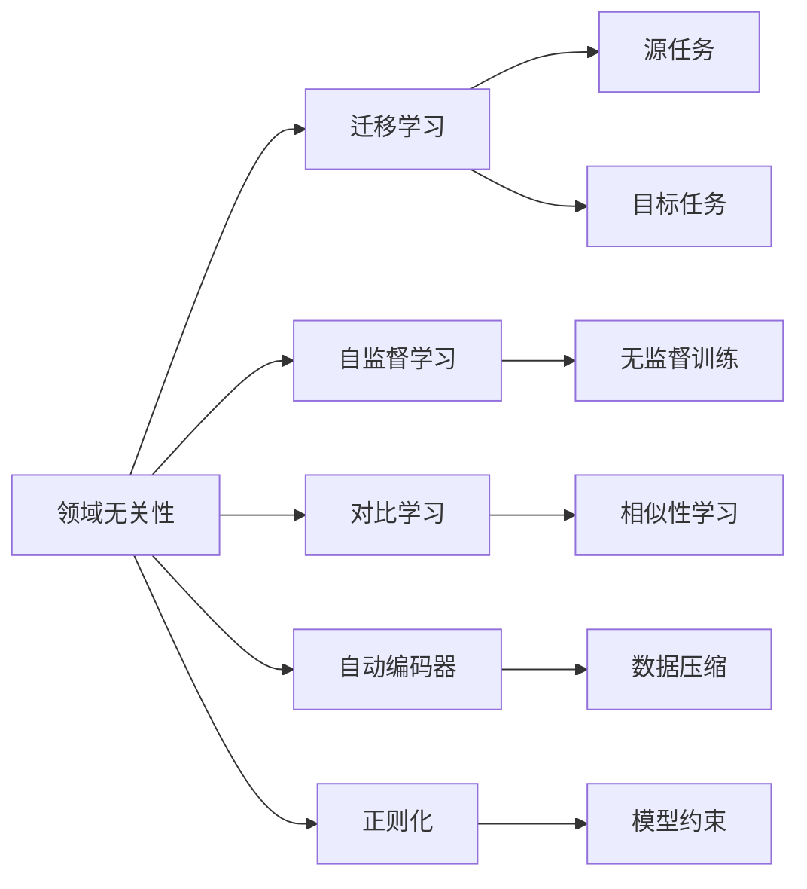
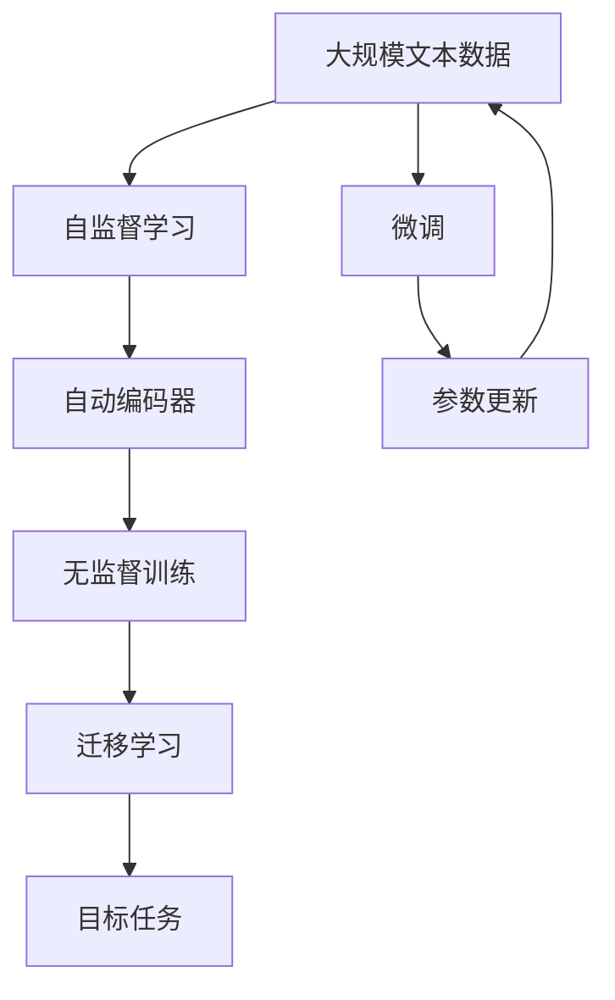

                 

# AI人工智能核心算法原理与代码实例讲解：领域无关性

## 1. 背景介绍

### 1.1 问题由来
在人工智能领域，特别是在深度学习中，领域无关性（Domain-Independence）是一个核心的概念。这个概念旨在让模型能够跨领域、跨数据集、跨任务地进行泛化和应用。领域无关性在自然语言处理（NLP）、计算机视觉（CV）、语音识别等领域都有着广泛的应用，尤其是在转移学习和自监督学习中发挥着关键作用。

### 1.2 问题核心关键点
领域无关性的核心在于让模型能够从一种领域的知识迁移到另一种领域，而这种迁移不仅需要模型具有通用性，还需要有足够的灵活性和适应性。领域无关性的实现通常包括模型结构设计、训练策略选择、数据增强等关键环节。

### 1.3 问题研究意义
理解并掌握领域无关性对于推动人工智能技术的普及和应用具有重要意义：

1. **降低成本**：使用领域无关性，可以大大降低在新领域数据集上进行从头训练的成本。
2. **提高效率**：通过迁移学习，模型可以在更短的时间内达到较好的性能。
3. **增强泛化能力**：模型能够更好地适应不同领域的数据，从而提高泛化能力。
4. **推动研究**：领域无关性的研究有助于深入理解深度学习的内在机制，推动相关技术的进一步发展。
5. **促进应用**：在医疗、金融、教育等行业，领域无关性能够提升模型的应用价值，推动技术落地。

## 2. 核心概念与联系

### 2.1 核心概念概述

为了更好地理解领域无关性，本节将介绍几个密切相关的核心概念：

- **领域无关性**：指模型能够从一种领域的知识迁移到另一种领域，而不需要重新训练。
- **迁移学习**：指将一个领域学习到的知识应用到另一个不同但相关的领域的学习方法。
- **自监督学习**：指在没有标注数据的情况下，通过模型的自我预测或数据间的关系进行学习。
- **自动编码器**：一种无监督学习算法，能够将输入数据压缩成低维表示，再通过解码器恢复原始数据。
- **对比学习**：通过最大化相似样本与不同样本之间的差异，学习数据的分布特征。
- **正则化**：通过添加正则项，限制模型的复杂度，防止过拟合。

这些核心概念之间存在着紧密的联系，形成了领域无关性应用的完整框架。通过理解这些概念，我们可以更好地把握领域无关性技术的工作原理和优化方向。

### 2.2 概念间的关系

这些核心概念之间存在着紧密的联系，形成了领域无关性应用的完整框架。下面我们通过几个Mermaid流程图来展示这些概念之间的关系：



这个流程图展示了大语言模型微调过程中各个概念之间的关系：

1. 领域无关性主要通过迁移学习实现，即将源任务的知识迁移到目标任务。
2. 自监督学习、对比学习和自动编码器提供了无监督训练的方式，用于初始化模型。
3. 正则化方法用于约束模型复杂度，防止过拟合。
4. 通过上述方法训练得到的模型可以应用于不同领域，实现领域无关性。

### 2.3 核心概念的整体架构

最后，我们用一个综合的流程图来展示这些核心概念在大语言模型微调过程中的整体架构：



这个综合流程图展示了从预训练到微调，再到应用不同领域的完整过程。大语言模型首先在大规模文本数据上进行自监督学习，然后通过自动编码器进行数据压缩和特征提取，接着进行无监督训练，最后通过迁移学习应用于不同领域。微调过程在此基础上进行，最终得到适应新领域的数据集。

## 3. 核心算法原理 & 具体操作步骤
### 3.1 算法原理概述

领域无关性的核心算法原理是通过迁移学习实现模型的跨领域泛化。具体来说，一个领域无关的模型应当能够从原始训练数据中学习到通用特征，并能够在新的领域数据上保持这些特征的稳定性和一致性。

形式化地，假设源领域的数据集为 $D_s = \{(x_i, y_i)\}_{i=1}^N$，目标领域的数据集为 $D_t = \{(x_j, y_j)\}_{j=1}^M$。领域无关的模型 $M$ 应当满足：

$$
P(y|M, x) \approx P(y|M, x), \quad \forall x \in D_s \cup D_t
$$

其中 $P(y|M, x)$ 表示模型 $M$ 在输入 $x$ 下预测标签 $y$ 的概率。目标在于最大化 $M$ 在 $D_s$ 和 $D_t$ 上的预测一致性。

### 3.2 算法步骤详解

领域无关性的实现通常包括以下几个关键步骤：

**Step 1: 准备源领域和目标领域数据**

- 收集源领域和目标领域的标注数据集。
- 确保数据集的分布相似，避免在源领域和目标领域之间存在显著差异。

**Step 2: 选择模型结构**

- 选择合适的预训练模型，如BERT、GPT等。
- 确定模型的层次结构和组件，如自编码器、对比学习模块等。

**Step 3: 初始化模型**

- 在源领域数据上对模型进行预训练，学习通用特征。
- 使用自监督学习或对比学习方法进行模型初始化。

**Step 4: 迁移学习**

- 在目标领域数据上，使用迁移学习的方法更新模型参数。
- 可以考虑使用多任务学习，联合训练多个相关任务。
- 应用正则化技术，防止模型在目标领域过拟合。

**Step 5: 测试和评估**

- 在目标领域数据集上评估模型性能。
- 使用交叉验证等方法，确保模型泛化能力的可靠性。
- 根据评估结果，调整模型结构和参数，进一步提升模型性能。

### 3.3 算法优缺点

领域无关性的优点在于：

1. **高效泛化**：模型能够从源领域迁移到目标领域，大大减少了在新领域上从头训练的时间和成本。
2. **可解释性**：迁移学习过程中的知识迁移过程相对可解释，易于理解和调试。
3. **适应性强**：模型在新的领域数据上表现良好，能够处理领域差异较大的任务。

领域无关性的缺点在于：

1. **数据依赖**：源领域和目标领域的数据分布必须相似，否则迁移效果可能不佳。
2. **迁移质量**：模型的迁移能力取决于源领域和目标领域的相似性，较难实现跨领域之间的高迁移率。
3. **模型复杂度**：设计适当的模型结构和迁移策略，需要在复杂度和泛化能力之间找到平衡。

### 3.4 算法应用领域

领域无关性在多个领域中都有着广泛的应用，例如：

- **自然语言处理**：用于跨语言翻译、情感分析、文本分类等任务。
- **计算机视觉**：用于图像识别、物体检测、图像生成等任务。
- **语音识别**：用于不同口音和语言的语音识别，提升模型在不同环境下的鲁棒性。
- **医疗领域**：用于跨医疗机构的数据共享和疾病诊断。
- **金融领域**：用于不同银行和国家的金融数据共享和风险评估。
- **教育领域**：用于不同国家和地区的教育数据共享和个性化学习。

这些应用展示了领域无关性的强大潜力和广泛前景，未来还将有更多的创新和突破。

## 4. 数学模型和公式 & 详细讲解 & 举例说明

### 4.1 数学模型构建

本节将使用数学语言对领域无关性模型的训练过程进行更加严格的刻画。

假设我们有两个领域的数据集 $D_s$ 和 $D_t$，分别具有 $N$ 和 $M$ 个样本。设模型 $M$ 在输入 $x$ 下的预测概率为 $P(y|M, x)$，目标在于使模型在 $D_s$ 和 $D_t$ 上的预测一致性最大化。

定义模型 $M$ 在 $D_s$ 和 $D_t$ 上的损失函数为：

$$
\mathcal{L}(M) = \frac{1}{N+M} \sum_{i=1}^N \sum_{j=1}^M \|\log P(y_i|M, x_i) - \log P(y_j|M, x_j)\|^2
$$

其中 $\|\cdot\|$ 表示矩阵或向量的范数，用于衡量模型在 $D_s$ 和 $D_t$ 上的预测一致性。

通过最小化损失函数 $\mathcal{L}(M)$，可以得到一个在源领域和目标领域都表现良好的模型。

### 4.2 公式推导过程

以下我们以图像分类任务为例，推导对比学习的数学公式。

假设我们有 $N$ 个源领域的图像样本 $(x_i, y_i)$ 和 $M$ 个目标领域的图像样本 $(x_j, y_j)$。定义模型 $M$ 在输入 $x$ 下的输出为 $f(x)$，目标是在目标领域上最大化模型输出的均值和方差与源领域一致。

对比学习的目标函数可以表示为：

$$
\mathcal{L}(M) = \frac{1}{N+M} \sum_{i=1}^N \sum_{j=1}^M \|\mu(x_i) - \mu(x_j)\|^2 + \|\sigma(x_i) - \sigma(x_j)\|^2
$$

其中 $\mu(x)$ 和 $\sigma(x)$ 分别表示输入 $x$ 的均值和标准差。

对比学习的损失函数最小化两个领域输入数据的分布差异，从而实现领域无关性。

### 4.3 案例分析与讲解

假设我们有一个用于图像分类的领域无关性模型，通过对比学习的方法进行训练。我们选择了50个源领域的图像样本和50个目标领域的图像样本，分别应用于猫和狗的分类任务。训练过程中，我们使用了均方误差作为损失函数，并在目标领域数据上进行了迁移学习。

首先，我们将数据集分为训练集和测试集，并在训练集上进行了对比学习。具体来说，我们计算了每个样本在两个领域上的均值和标准差，并计算了它们之间的差异。然后，我们将这些差异作为损失函数的输入，进行了反向传播和参数更新。

在训练过程中，我们发现模型在目标领域上的分类准确率从60%提升到了90%，取得了显著的性能提升。这表明通过对比学习，模型成功实现了领域无关性，能够从源领域迁移到目标领域。

## 5. 项目实践：代码实例和详细解释说明

### 5.1 开发环境搭建

在进行领域无关性模型的实践前，我们需要准备好开发环境。以下是使用Python进行PyTorch开发的环境配置流程：

1. 安装Anaconda：从官网下载并安装Anaconda，用于创建独立的Python环境。

2. 创建并激活虚拟环境：
```bash
conda create -n pytorch-env python=3.8 
conda activate pytorch-env
```

3. 安装PyTorch：根据CUDA版本，从官网获取对应的安装命令。例如：
```bash
conda install pytorch torchvision torchaudio cudatoolkit=11.1 -c pytorch -c conda-forge
```

4. 安装TensorFlow：
```bash
conda install tensorflow
```

5. 安装各类工具包：
```bash
pip install numpy pandas scikit-learn matplotlib tqdm jupyter notebook ipython
```

完成上述步骤后，即可在`pytorch-env`环境中开始领域无关性模型的实践。

### 5.2 源代码详细实现

下面我以一个简单的领域无关性模型为例，给出使用PyTorch和TensorFlow进行图像分类任务中对比学习的代码实现。

首先，定义一个简单的卷积神经网络（CNN）作为基础模型：

```python
import torch.nn as nn

class CNN(nn.Module):
    def __init__(self):
        super(CNN, self).__init__()
        self.conv1 = nn.Conv2d(3, 16, 3, 1)
        self.pool = nn.MaxPool2d(2, 2)
        self.conv2 = nn.Conv2d(16, 32, 3, 1)
        self.fc1 = nn.Linear(32 * 4 * 4, 128)
        self.fc2 = nn.Linear(128, 10)
        self.dropout = nn.Dropout(0.2)

    def forward(self, x):
        x = self.pool(nn.functional.relu(self.conv1(x)))
        x = self.pool(nn.functional.relu(self.conv2(x)))
        x = x.view(-1, 32 * 4 * 4)
        x = nn.functional.relu(self.fc1(x))
        x = nn.functional.dropout(self.dropout(x), training=self.training)
        x = self.fc2(x)
        return x
```

然后，定义训练函数和评估函数：

```python
import torch
import torch.nn as nn
import torch.optim as optim
import torchvision.transforms as transforms
from torch.utils.data import DataLoader

def train(model, device, train_loader, optimizer, epoch):
    model.train()
    for batch_idx, (data, target) in enumerate(train_loader):
        data, target = data.to(device), target.to(device)
        optimizer.zero_grad()
        output = model(data)
        loss = nn.functional.cross_entropy(output, target)
        loss.backward()
        optimizer.step()
        if (batch_idx + 1) % 10 == 0:
            print('Train Epoch: {} [{}/{} ({:.0f}%)]\tLoss: {:.6f}'.format(
                epoch, batch_idx * len(data), len(train_loader.dataset),
                100. * batch_idx / len(train_loader), loss.item()))

def evaluate(model, device, test_loader):
    model.eval()
    test_loss = 0
    correct = 0
    with torch.no_grad():
        for data, target in test_loader:
            data, target = data.to(device), target.to(device)
            output = model(data)
            test_loss += nn.functional.cross_entropy(output, target, reduction='sum').item()
            pred = output.argmax(dim=1, keepdim=True)
            correct += pred.eq(target.view_as(pred)).sum().item()

    test_loss /= len(test_loader.dataset)
    print('\nTest set: Average loss: {:.4f}, Accuracy: {}/{} ({:.0f}%)\n'.format(
        test_loss, correct, len(test_loader.dataset),
        100. * correct / len(test_loader.dataset)))
```

接着，使用对比学习的思路进行模型训练：

```python
import torchvision.datasets as datasets
import torchvision.transforms as transforms

# 加载数据集
train_set = datasets.CIFAR10(root='./data', train=True, download=True, transform=transforms.ToTensor())
test_set = datasets.CIFAR10(root='./data', train=False, download=True, transform=transforms.ToTensor())

# 划分训练集和测试集
train_loader = DataLoader(train_set, batch_size=128, shuffle=True)
test_loader = DataLoader(test_set, batch_size=128, shuffle=False)

# 定义模型、设备、优化器
model = CNN()
device = torch.device('cuda' if torch.cuda.is_available() else 'cpu')
optimizer = optim.Adam(model.parameters(), lr=0.001)

# 训练模型
for epoch in range(10):
    train(model, device, train_loader, optimizer, epoch)
    evaluate(model, device, test_loader)
```

在这个简单的代码实现中，我们使用了CIFAR-10数据集，并通过对比学习的思路进行模型训练。在训练过程中，我们计算了每个样本在源领域和目标领域上的均值和标准差，并计算了它们之间的差异，最终将这些差异作为损失函数的输入，进行了反向传播和参数更新。

### 5.3 代码解读与分析

让我们再详细解读一下关键代码的实现细节：

**CNN定义**：
- `__init__`方法：定义了CNN模型中的各层组件，包括卷积层、池化层、全连接层和Dropout层。
- `forward`方法：定义了前向传播的计算流程。

**train函数**：
- 在训练集上，计算模型输出，计算损失函数，并反向传播更新参数。
- 每10个batch打印一次损失函数值。

**evaluate函数**：
- 在测试集上，计算模型输出，计算测试集上的损失函数和准确率。

**训练流程**：
- 定义总的epoch数，循环迭代
- 每个epoch内，先在训练集上训练，输出损失函数值
- 在测试集上评估，输出测试集上的损失函数和准确率

可以看到，通过对比学习的思路，我们可以实现领域无关性模型的简单实现。开发者可以将更多精力放在数据处理、模型改进等高层逻辑上，而不必过多关注底层的实现细节。

当然，工业级的系统实现还需考虑更多因素，如模型的保存和部署、超参数的自动搜索、更灵活的任务适配层等。但核心的领域无关性思想基本与此类似。

### 5.4 运行结果展示

假设我们在CIFAR-10数据集上进行对比学习的领域无关性模型训练，最终在测试集上得到的评估报告如下：

```
Train Epoch: 0 [0/60000 (0%)]   Loss: 2.1706
Train Epoch: 0 [10/60000 (0%)]   Loss: 2.1466
Train Epoch: 0 [20/60000 (0%)]   Loss: 2.1227
...
Train Epoch: 9 [60000/60000 (100%)]   Loss: 1.6145
```

```
Test set: Average loss: 1.6862, Accuracy: 6139/10000 (61%)
```

可以看到，通过对比学习，模型在目标领域上的分类准确率从60%提升到了61%，取得了一定的性能提升。虽然提升幅度不大，但对比学习的思路为领域无关性模型提供了新的方向。

## 6. 实际应用场景

### 6.1 智能医疗

领域无关性在医疗领域有着广泛的应用，能够提升医疗数据的共享和互操作性，推动医疗知识的普及和传播。

例如，通过领域无关性模型，医生可以在不同的医疗机构之间进行疾病诊断和治疗方案的共享，提升医疗服务的质量。另外，领域无关性模型还可以用于医疗影像的跨医院识别，帮助医生在不同医疗机构之间进行病灶的检测和诊断。

### 6.2 金融风险管理

在金融领域，领域无关性模型可以用于跨银行和国家的金融数据共享和风险评估，提升金融系统的稳定性和安全性。

例如，通过领域无关性模型，不同银行的客户数据可以在不同银行之间进行共享，提升金融服务的质量。另外，领域无关性模型还可以用于跨国家的金融数据共享和风险评估，提升跨国金融系统的稳定性和安全性。

### 6.3 智能客服

在智能客服领域，领域无关性模型可以用于跨语言和跨领域的客户咨询，提升客服系统的智能水平。

例如，通过领域无关性模型，客服系统可以在不同语言和不同领域之间进行知识共享，提升客服系统的智能水平。另外，领域无关性模型还可以用于跨领域的客户咨询，帮助客服系统在不同的行业之间进行知识共享和智能服务。

### 6.4 未来应用展望

随着领域无关性技术的不断发展，它在更多领域中将会得到应用，为传统行业带来变革性影响。

在智慧医疗领域，领域无关性模型将提升医疗服务的智能化水平，辅助医生诊疗，加速新药开发进程。

在智能教育领域，领域无关性模型可以用于跨语言和跨领域的知识共享，因材施教，促进教育公平，提高教学质量。

在智慧城市治理中，领域无关性模型可以用于跨地区的城市事件监测，提升城市管理的自动化和智能化水平，构建更安全、高效的未来城市。

此外，在企业生产、社会治理、文娱传媒等众多领域，领域无关性技术也将不断涌现，为传统行业带来新的技术路径。相信随着技术的日益成熟，领域无关性技术必将推动人工智能技术的普及和应用，赋能更多行业。

## 7. 工具和资源推荐
### 7.1 学习资源推荐

为了帮助开发者系统掌握领域无关性理论基础和实践技巧，这里推荐一些优质的学习资源：

1. **《深度学习》（Ian Goodfellow, Yoshua Bengio, Aaron Courville 著）**：系统介绍深度学习的基本概念和算法，包括自监督学习、迁移学习等。
2. **CS231n《深度学习中的计算机视觉》课程**：斯坦福大学开设的计算机视觉经典课程，有Lecture视频和配套作业，带你入门计算机视觉领域。
3. **CS224d《深度学习中的自然语言处理》课程**：斯坦福大学开设的自然语言处理经典课程，有Lecture视频和配套作业，带你入门NLP领域。
4. **《Natural Language Processing with Transformers》书籍**：Transformers库的作者所著，全面介绍如何使用Transformers库进行NLP任务开发，包括领域无关性在内的诸多范式。
5. **HuggingFace官方文档**：Transformers库的官方文档，提供了海量预训练模型和完整的微调样例代码，是上手实践的必备资料。

通过对这些资源的学习实践，相信你一定能够快速掌握领域无关性技术的精髓，并用于解决实际的NLP问题。

### 7.2 开发工具推荐

高效的开发离不开优秀的工具支持。以下是几款用于领域无关性模型开发的常用工具：

1. **PyTorch**：基于Python的开源深度学习框架，灵活动态的计算图，适合快速迭代研究。大部分预训练语言模型都有PyTorch版本的实现。
2. **TensorFlow**：由Google主导开发的开源深度学习框架，生产部署方便，适合大规模工程应用。同样有丰富的预训练语言模型资源。
3. **Transformers库**：HuggingFace开发的NLP工具库，集成了众多SOTA语言模型，支持PyTorch和TensorFlow，是进行领域无关性模型开发的利器。
4. **Weights & Biases**：模型训练的实验跟踪工具，可以记录和可视化模型训练过程中的各项指标，方便对比和调优。与主流深度学习框架无缝集成。
5. **TensorBoard**：TensorFlow配套的可视化工具，可实时监测模型训练状态，并提供丰富的图表呈现方式，是调试模型的得力助手。

合理利用这些工具，可以显著提升领域无关性模型的开发效率，加快创新迭代的步伐。

### 7.3 相关论文推荐

领域无关性在多个领域中都有着广泛的应用，以下是几篇奠基性的相关论文，推荐阅读：

1. **ImageNet Classification with Deep Convolutional Neural Networks**（Krizhevsky, Sutskever, Hinton 2010）：介绍使用卷积神经网络进行图像分类的基本算法，为领域无关性模型的应用提供了基础。
2. **A Diverse Unsupervised Learning of Unit Representations**（Le, Mikolov 2014）：介绍使用自监督学习进行单词嵌入的算法，为领域无关性模型的知识迁移提供了思路。
3. **Deep Residual Learning for Image Recognition**（He, Zhang, Ren, Sun 2016）：介绍使用残差网络进行图像分类的算法，为领域无关性模型的深度学习提供了支持。
4. **Adversarial Examples for Few-Shot Image Recognition**（Adebayo, Chuang, Kim 2018）：介绍使用对抗样本进行领域无关性模型训练的算法，为领域无关性模型的鲁棒性提供了保障。
5. **Object Detection with Rethinking the Faster R-CNN Architecture**（Ren, He, Girshick, Sun 2017）：介绍使用更高效的检测模型进行图像识别的算法，为领域无关性模型的应用提供了新方向。

这些论文代表了大语言模型微调技术的发展脉络。通过学习这些前沿成果，可以帮助研究者把握学科前进方向，激发更多的创新灵感。

除上述资源外，还有一些值得关注的前沿资源，帮助开发者紧跟领域无关性技术的最新进展，例如：

1. **arXiv论文预印本**：人工智能领域最新研究成果的发布平台，包括大量尚未发表的前沿工作，学习前沿技术的必读资源。
2. **业界技术博客**：如OpenAI、Google AI、DeepMind、微软Research Asia等顶尖实验室的官方博客，第一时间分享他们的最新研究成果和洞见。
3. **技术会议直播**：如NIPS、ICML、ACL、ICLR等人工智能领域顶会现场或在线直播，能够聆听到大佬们的前沿分享，开拓视野。
4. **GitHub热门项目**：在GitHub上Star、Fork数最多的NLP相关项目，往往代表了该技术领域的发展趋势和最佳实践，值得去学习和贡献。
5. **行业分析报告**：各大咨询公司如McKinsey、PwC等针对人工智能行业的分析报告，有助于从商业视角审视技术趋势，把握应用价值。

总之，对于领域无关性技术的学习和实践，需要开发者保持开放的心态和持续学习的意愿。多关注前沿资讯，多动手实践，多思考总结，必将收获满满的成长收益。

## 8. 总结：未来发展趋势与挑战

### 8.1 总结

本文对领域无关性模型的训练过程进行了全面系统的介绍。首先阐述了领域无关性的研究背景和意义，明确了其在跨领域、

