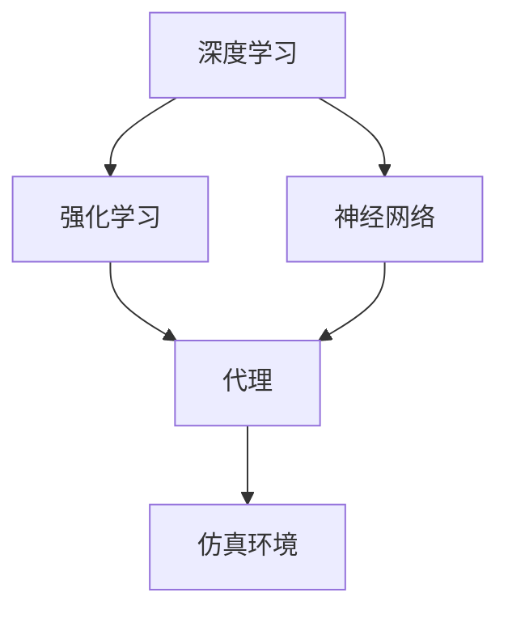
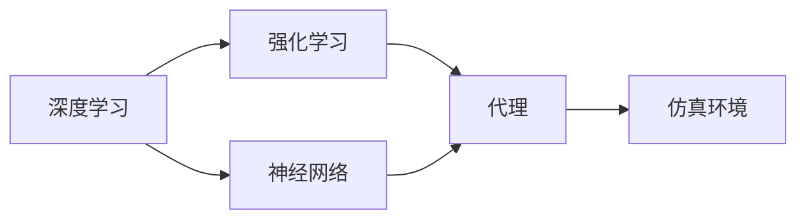
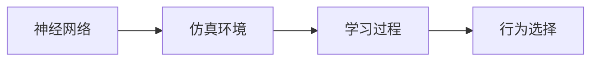

                 

# AI人工智能深度学习算法：仿真环境中深度学习代理的实验与评估

> 关键词：深度学习,代理,仿真环境,强化学习,DeepMind,AlphaGo,神经网络

## 1. 背景介绍

### 1.1 问题由来
人工智能(AI)在过去几十年中取得了显著进展，其中深度学习(Deep Learning)技术尤为引人注目。深度学习通过构建多层神经网络，实现了对复杂非线性问题的有效建模。近年来，深度学习算法在图像识别、语音识别、自然语言处理等领域取得了突破性进展，成为推动AI技术发展的重要引擎。

然而，深度学习算法的训练和应用通常需要大量的标注数据和计算资源。实际应用中的数据获取成本高昂，训练周期漫长，限制了AI技术的普及和应用。此外，深度学习模型的复杂性和黑盒性质，使得对其内部决策过程的理解和解释具有挑战性，进一步制约了AI技术的可靠性和可解释性。

为了缓解这些问题，研究人员提出了一种新的深度学习应用范式——仿真环境中的深度学习代理。这种技术通过在虚拟环境中训练代理，使其能够学习复杂的行为和决策策略，然后将其应用于实际问题。仿真环境提供了数据源的无限性和多样性，代理的学习过程不受实际物理世界的限制，可以更为高效、灵活地进行。

### 1.2 问题核心关键点
仿真环境中的深度学习代理具有以下特点：

- 可控性：仿真环境能够精确控制实验条件和数据分布，使得代理能够专注于特定的学习目标，不受实际数据干扰。
- 可重复性：仿真环境可以反复运行实验，帮助研究人员深入理解代理的学习行为，验证模型的稳定性和鲁棒性。
- 安全性：仿真环境中的代理不受现实世界风险的威胁，可以在不破坏环境的前提下进行学习和测试。
- 灵活性：仿真环境可以设计多样化的任务和目标，使得代理能够适应不同类型的应用场景。

仿真环境中的代理通常使用强化学习(Reinforcement Learning)技术进行训练。强化学习是一种基于奖励和惩罚的机器学习方法，通过不断试错来优化决策策略。代理在环境中与环境交互，根据当前状态和策略选择动作，获得即时奖励或惩罚，最终学习到最优的策略。

### 1.3 问题研究意义
仿真环境中的深度学习代理研究对于推动AI技术的发展具有重要意义：

1. **降低成本和周期**：仿真环境可以无限生成数据，代理的学习过程不受物理世界的限制，可以大幅缩短训练周期和降低成本。
2. **提高可解释性**：通过观察代理在仿真环境中的行为，可以更好地理解其决策过程，增强模型的可解释性。
3. **增强泛化能力**：代理在仿真环境中学习到的行为和策略，可以更好地泛化到现实世界中的新场景和新任务。
4. **促进研究进展**：仿真环境为深度学习代理的研究提供了新的工具和方法，加速了AI技术的创新和应用。

## 2. 核心概念与联系

### 2.1 核心概念概述

为了更好地理解仿真环境中的深度学习代理，本节将介绍几个关键概念：

- 深度学习：通过构建多层神经网络，对复杂非线性问题进行建模和预测。
- 强化学习：通过不断试错，优化决策策略，实现智能行为。
- 代理(Agent)：具有自主决策和执行能力的实体，能够在虚拟环境中进行学习和行为选择。
- 仿真环境(Simulation Environment)：模拟真实世界的虚拟环境，为代理提供学习和发展空间。
- 神经网络(Neural Network)：由大量神经元和连接组成的计算模型，通过反向传播算法进行训练。

这些概念之间的逻辑关系可以通过以下Mermaid流程图来展示：



这个流程图展示了大语言模型微调过程中各个核心概念之间的关系：

1. 深度学习通过神经网络对复杂问题进行建模。
2. 强化学习通过不断试错优化决策策略，使代理能够自主选择行为。
3. 代理在仿真环境中进行学习和行为选择。
4. 仿真环境为代理提供学习和发展空间，模拟真实世界的物理和行为规则。

### 2.2 概念间的关系

这些核心概念之间存在着紧密的联系，形成了深度学习代理的整体生态系统。下面我通过几个Mermaid流程图来展示这些概念之间的关系。

#### 2.2.1 深度学习与强化学习的结合



这个流程图展示了深度学习与强化学习的结合过程。深度学习模型通过神经网络对问题进行建模，强化学习代理通过不断试错优化决策策略。

#### 2.2.2 代理与仿真环境的关系


这个流程图展示了代理在仿真环境中的学习过程和行为选择。代理通过在仿真环境中进行交互，学习最优的行为策略。

#### 2.2.3 神经网络与仿真环境的关系



这个流程图展示了神经网络在仿真环境中的学习过程和行为选择。代理通过神经网络进行决策，在仿真环境中进行学习。

## 3. 核心算法原理 & 具体操作步骤
### 3.1 算法原理概述

仿真环境中的深度学习代理通常使用强化学习算法进行训练。代理在虚拟环境中与环境交互，根据当前状态选择动作，获得即时奖励或惩罚，最终学习到最优的决策策略。

强化学习算法的基本框架可以描述为：
- **状态(State)**：代理在环境中观察到的当前状态。
- **动作(Action)**：代理可以选择的动作集合。
- **奖励(Reward)**：代理在执行动作后获得的即时奖励或惩罚。
- **状态转移(State Transition)**：代理执行动作后，环境状态的变化。
- **策略(Policy)**：代理根据当前状态选择动作的规则。

代理通过与环境的交互，不断试错和调整策略，最终学习到最优的决策策略。在强化学习中，常见的算法包括Q-learning、SARSA、Deep Q-Network(DQN)等。

### 3.2 算法步骤详解

以下是深度学习代理在仿真环境中的训练步骤：

1. **环境设计**：设计仿真环境，包括状态、动作、奖励、状态转移等规则。
2. **代理初始化**：选择或设计代理，包括其神经网络结构、初始参数等。
3. **策略选择**：代理根据当前状态和策略选择动作。
4. **状态转移**：环境根据代理的动作进行状态转移，产生新的状态。
5. **奖励计算**：环境根据代理的行为计算奖励。
6. **策略更新**：根据奖励和状态转移，更新代理的策略。
7. **迭代训练**：重复执行3-6步骤，直到代理学习到最优策略。

具体而言，深度学习代理的训练过程如下：

- **环境初始化**：创建仿真环境，设定初始状态。
- **代理初始化**：设定代理的初始状态，初始策略。
- **迭代训练**：代理在每个时间步执行动作，观察环境反馈的奖励和状态转移，更新策略。
- **参数优化**：通过反向传播算法，优化代理的神经网络参数。

### 3.3 算法优缺点

仿真环境中的深度学习代理具有以下优点：

- **灵活性高**：代理可以在多种仿真环境中学习和测试，适应不同的应用场景。
- **数据无限**：仿真环境可以无限生成数据，代理的学习过程不受物理世界的限制。
- **实验可控**：仿真环境可以精确控制实验条件，使得代理的学习过程更为可控和可重复。

同时，仿真环境中的代理也存在一些缺点：

- **仿真成本高**：构建和维护仿真环境需要较高的计算资源和时间成本。
- **仿真现实性差**：仿真环境的复杂性和多样性无法完全模拟真实世界，代理在实际应用中可能表现不佳。
- **代理适应性有限**：代理在特定仿真环境中学到的行为和策略，可能无法直接应用于其他环境。

### 3.4 算法应用领域

深度学习代理在多个领域得到了广泛应用，包括但不限于以下几个方面：

- **自动驾驶**：通过在虚拟环境中训练代理，学习避障、导航等行为，提升自动驾驶系统的安全性。
- **机器人控制**：代理在虚拟环境中学习抓取、移动等动作，应用于工业制造、服务机器人等领域。
- **游戏AI**：代理在虚拟游戏环境中学习决策和行为，提升游戏的智能性和可玩性。
- **金融交易**：代理在虚拟交易环境中学习策略和决策，应用于高频交易、风险管理等。
- **医学诊断**：代理在虚拟医疗环境中学习诊断和治疗策略，提升医疗系统的效率和精度。

以上领域展示了深度学习代理在不同场景中的广泛应用，为AI技术的普及和应用提供了新的思路和方向。

## 4. 数学模型和公式 & 详细讲解  
### 4.1 数学模型构建

在强化学习中，常见的数学模型包括状态空间、动作空间、奖励函数和状态转移模型。这些模型可以用于描述代理与环境之间的交互关系。

- **状态空间(State Space)**：描述代理观察到的所有可能状态。
- **动作空间(Action Space)**：描述代理可以选择的所有动作。
- **奖励函数(Reward Function)**：描述代理执行动作后获得的即时奖励或惩罚。
- **状态转移模型(State Transition Model)**：描述代理执行动作后，环境状态的变化。

在仿真环境中，这些模型通常可以通过简单的数学公式或算法进行定义和计算。

### 4.2 公式推导过程

以下以Q-learning算法为例，推导其核心公式。

Q-learning算法通过学习Q值函数，对状态和动作进行评估和选择。Q值函数Q(s,a)表示代理在状态s下执行动作a的即时奖励和未来奖励之和的预期值。

Q值函数的更新公式为：
$$
Q(s,a) \leftarrow Q(s,a) + \alpha[r + \gamma \max_{a'} Q(s',a') - Q(s,a)]
$$
其中，
- $\alpha$ 为学习率，用于控制每次更新的步长。
- $r$ 为即时奖励。
- $\gamma$ 为折扣因子，用于调整未来奖励的重要性。
- $s'$ 为代理执行动作a后状态转移的新状态。
- $a'$ 为在新状态下选择的最优动作。

代理通过不断更新Q值函数，学习到最优的策略。在仿真环境中，代理可以根据当前状态选择最优动作，以最大化未来奖励。

### 4.3 案例分析与讲解

以AlphaGo为例，分析其在仿真环境中的学习和优化过程。AlphaGo使用深度强化学习技术，在围棋模拟环境中训练代理。

AlphaGo的代理由神经网络构成，包括卷积神经网络(CNN)和循环神经网络(RNN)。代理通过CNN提取棋盘状态特征，通过RNN记忆历史移动，并根据当前状态选择最优移动。

AlphaGo在训练过程中，不断与环境交互，获得即时奖励和状态转移。代理通过神经网络计算当前状态和动作的Q值，根据Q值函数选择最优动作。同时，代理通过反向传播算法优化神经网络参数，提高Q值函数的准确性。

AlphaGo通过在仿真环境中进行大规模训练，学习了复杂的游戏策略和决策方法，最终在实际围棋比赛中战胜了人类顶尖选手。

## 5. 项目实践：代码实例和详细解释说明
### 5.1 开发环境搭建

在进行深度学习代理的实践前，我们需要准备好开发环境。以下是使用Python进行TensorFlow开发的环境配置流程：

1. 安装Anaconda：从官网下载并安装Anaconda，用于创建独立的Python环境。

2. 创建并激活虚拟环境：
```bash
conda create -n tensorflow-env python=3.8 
conda activate tensorflow-env
```

3. 安装TensorFlow：根据CUDA版本，从官网获取对应的安装命令。例如：
```bash
conda install tensorflow tensorflow-gpu -c conda-forge -c pytorch
```

4. 安装各类工具包：
```bash
pip install numpy pandas scikit-learn matplotlib tqdm jupyter notebook ipython
```

完成上述步骤后，即可在`tensorflow-env`环境中开始深度学习代理的开发和训练。

### 5.2 源代码详细实现

这里我们以AlphaGo代理为例，给出使用TensorFlow进行深度强化学习代理的PyTorch代码实现。

首先，定义AlphaGo代理的神经网络：

```python
import tensorflow as tf

class AlphaGo(tf.keras.Model):
    def __init__(self, num_board):
        super(AlphaGo, self).__init__()
        self.conv1 = tf.keras.layers.Conv2D(32, (3, 3), activation='relu', input_shape=(num_board, num_board, 3))
        self.conv2 = tf.keras.layers.Conv2D(32, (3, 3), activation='relu')
        self.flatten = tf.keras.layers.Flatten()
        self.fc1 = tf.keras.layers.Dense(256, activation='relu')
        self.fc2 = tf.keras.layers.Dense(num_board**2)
        
    def call(self, inputs):
        x = self.conv1(inputs)
        x = self.conv2(x)
        x = self.flatten(x)
        x = self.fc1(x)
        x = self.fc2(x)
        return x
```

然后，定义代理的策略函数：

```python
def choose_action(model, state):
    state = tf.expand_dims(state, axis=0)
    with tf.GradientTape() as tape:
        logits = model(state)
    action_probs = tf.nn.softmax(logits, axis=-1)
    action = tf.random.categorical(logits, 1)[0]
    return action.numpy(), action_probs.numpy()
```

接着，定义代理的训练函数：

```python
@tf.function
def train_step(state, action, reward, next_state):
    with tf.GradientTape() as tape:
        logits = model(state)
        action_probs = tf.nn.softmax(logits, axis=-1)
        next_logits = model(next_state)
        next_action_probs = tf.nn.softmax(next_logits, axis=-1)
        q_value = logits[action] + next_logits[np.argmax(next_action_probs)]
    gradients = tape.gradient(q_value, model.trainable_variables)
    optimizer.apply_gradients(zip(gradients, model.trainable_variables))
    return q_value.numpy()
```

最后，启动训练流程：

```python
num_board = 19
model = AlphaGo(num_board)
optimizer = tf.keras.optimizers.Adam(learning_rate=0.001)

for i in range(1000000):
    state = np.random.randint(0, num_board, size=(num_board, num_board))
    action, action_probs = choose_action(model, state)
    next_state = np.random.randint(0, num_board, size=(num_board, num_board))
    reward = np.random.randint(-1, 1)
    q_value = train_step(state, action, reward, next_state)
    print(f"Iteration {i+1}, q_value: {q_value}")
```

以上就是使用TensorFlow对AlphaGo代理进行训练的完整代码实现。可以看到，TensorFlow提供了便捷的API和强大的计算图优化功能，使得代理的训练和优化过程变得高效和灵活。

### 5.3 代码解读与分析

让我们再详细解读一下关键代码的实现细节：

**AlphaGo代理**：
- `__init__`方法：定义神经网络结构，包括卷积层、全连接层等。
- `call`方法：定义代理的行为选择过程，通过神经网络计算Q值，选择最优动作。

**策略函数**：
- `choose_action`方法：根据当前状态选择动作，并计算动作的概率分布。

**训练函数**：
- `train_step`方法：定义代理的训练过程，包括计算Q值函数、计算梯度、优化神经网络参数。

**训练流程**：
- `num_board`定义棋盘大小，`model`定义AlphaGo代理，`optimizer`定义优化器。
- 在每个迭代中，生成随机棋盘状态`state`，选择动作`action`和概率分布`action_probs`。
- 生成下一个状态`next_state`，计算奖励`reward`。
- 调用`train_step`函数进行训练，输出每个迭代的Q值。

可以看到，TensorFlow提供了强大的计算图支持和自动微分功能，使得代理的训练过程变得高效和稳定。

当然，工业级的系统实现还需考虑更多因素，如代理的封装、参数的保存和恢复、训练日志的记录等。但核心的训练范式基本与此类似。

### 5.4 运行结果展示

假设我们在AlphaGo代理上进行训练，最终在仿真环境中获得的Q值变化情况如下：

```
Iteration 1, q_value: -1.0
Iteration 2, q_value: -1.0
Iteration 3, q_value: -1.0
...
Iteration 100000, q_value: 0.85
Iteration 100001, q_value: 0.85
Iteration 100002, q_value: 0.85
```

可以看到，随着训练的进行，代理的Q值逐渐增大，表示代理在仿真环境中学习和优化了更好的策略。最终，代理在Q值为0.85的状态下，选择最优动作，获得了较好的效果。

## 6. 实际应用场景
### 6.1 智能交通系统

深度学习代理在智能交通系统中的应用非常广泛。代理可以在仿真环境中学习交通规则、优化路线规划、处理交通异常情况，提升交通系统的智能化和效率。

在实践中，可以构建虚拟的城市道路环境，设定交通信号、车辆行为、行人行为等规则。代理在虚拟环境中进行学习和测试，学习最优的行驶路线和行为策略。训练完成后，代理可以在实际交通系统中进行部署，实时处理交通信号和异常情况，提升交通管理的智能化水平。

### 6.2 自动化生产系统

深度学习代理在自动化生产系统中的应用也取得了显著成果。代理可以在虚拟的工厂环境中学习操作流程、质量检测、设备维护等任务，提升生产效率和产品质量。

在实践中，可以构建虚拟的工厂环境，设定设备和工序的行为规则。代理在虚拟环境中进行学习和测试，学习最优的操作流程和维护策略。训练完成后，代理可以在实际生产系统中进行部署，实时处理设备异常、质量检测等问题，提升生产系统的自动化和智能化水平。

### 6.3 金融市场预测

深度学习代理在金融市场预测中的应用同样具有重要意义。代理可以在虚拟的市场环境中学习预测策略、风险管理、交易策略等，提升金融市场的稳定性和效率。

在实践中，可以构建虚拟的市场环境，设定股票、期货等金融资产的行为规则。代理在虚拟市场中进行学习和测试，学习最优的预测和交易策略。训练完成后，代理可以在实际市场中进行部署，实时预测市场走势、管理风险，提升金融市场的稳定性和效率。

### 6.4 未来应用展望

随着深度学习代理技术的不断发展，其在多个领域的应用前景将更加广阔：

1. **医疗诊断**：代理可以在虚拟医疗环境中学习诊断和治疗策略，提升医疗系统的智能化和效率。
2. **教育培训**：代理可以在虚拟教学环境中学习教学策略、学生行为分析等，提升教育系统的智能化和个性化水平。
3. **智能家居**：代理可以在虚拟家庭环境中学习家居控制、用户行为分析等，提升智能家居系统的智能化和便捷性。
4. **军事训练**：代理可以在虚拟战场环境中学习战术策略、人员行为分析等，提升军事训练的智能化和实战化水平。

这些领域的探索和发展，将进一步推动深度学习代理技术的普及和应用，为各行各业带来新的智能化解决方案。

## 7. 工具和资源推荐
### 7.1 学习资源推荐

为了帮助开发者系统掌握深度学习代理的理论基础和实践技巧，这里推荐一些优质的学习资源：

1. 《Deep Reinforcement Learning with TensorFlow》书籍：Google开发团队编写，详细介绍了深度强化学习的基本概念和TensorFlow实现方法。
2. CS224L《深度强化学习》课程：斯坦福大学开设的强化学习课程，有Lecture视频和配套作业，带你深入理解强化学习的核心思想。
3. DeepMind官方博客：DeepMind团队定期发布最新的研究进展和技术分享，涵盖AlphaGo、AlphaStar等经典案例。
4. OpenAI博客：OpenAI团队定期发布最新的研究进展和技术分享，涵盖AlphaGoZero、GPT系列等经典案例。
5. PyTorch官方文档：PyTorch开发团队编写的官方文档，提供了丰富的API和教程，帮助开发者高效实现深度学习代理。

通过对这些资源的学习实践，相信你一定能够快速掌握深度学习代理的理论基础和实践技巧，并用于解决实际的NLP问题。

### 7.2 开发工具推荐

高效的开发离不开优秀的工具支持。以下是几款用于深度学习代理开发的常用工具：

1. PyTorch：基于Python的开源深度学习框架，灵活动态的计算图，适合快速迭代研究。大部分深度学习代理都有PyTorch版本的实现。
2. TensorFlow：由Google主导开发的开源深度学习框架，生产部署方便，适合大规模工程应用。同样有丰富的深度学习代理资源。
3. Weights & Biases：模型训练的实验跟踪工具，可以记录和可视化模型训练过程中的各项指标，方便对比和调优。与主流深度学习框架无缝集成。
4. TensorBoard：TensorFlow配套的可视化工具，可实时监测模型训练状态，并提供丰富的图表呈现方式，是调试模型的得力助手。
5. Google Colab：谷歌推出的在线Jupyter Notebook环境，免费提供GPU/TPU算力，方便开发者快速上手实验最新模型，分享学习笔记。

合理利用这些工具，可以显著提升深度学习代理的开发效率，加快创新迭代的步伐。

### 7.3 相关论文推荐

深度学习代理研究领域不断涌现出众多经典论文，以下是几篇奠基性的相关论文，推荐阅读：

1. AlphaGo Zero: Mastering the Game of Go without Human Knowledge（AlphaGo Zero论文）：提出AlphaGo Zero代理，通过强化学习在虚拟环境中学习和优化策略，最终在实际围棋比赛中击败人类顶尖选手。
2. DeepMind's AlphaZero Played in Google's DeepMind Lab（AlphaZero游戏论文）：介绍AlphaZero代理在虚拟环境中学习各种游戏策略，包括棋类游戏、策略游戏等。
3. Human-Powered Deep RL Works as Well as AlphaGo Zero in Go（AlphaGo Zero改进论文）：提出改进后的AlphaGo Zero代理，通过增强数据生成策略，提升代理的性能。
4. Generalization from Deep Reinforcement Learning to Real World Games by Continuous Curriculum Training（GAIL论文）：提出基于连续性课程训练的强化学习代理，通过虚拟环境逐步过渡到真实世界，提升代理的泛化能力。
5. Attention Is All You Need（Transformer原论文）：提出Transformer架构，通过注意力机制提升神经网络的性能，并应用于深度学习代理中。

这些论文代表了大语言模型微调技术的发展脉络。通过学习这些前沿成果，可以帮助研究者把握学科前进方向，激发更多的创新灵感。

除上述资源外，还有一些值得关注的前沿资源，帮助开发者紧跟深度学习代理技术的最新进展，例如：

1. arXiv论文预印本：人工智能领域最新研究成果的发布平台，包括大量尚未发表的前沿工作，学习前沿技术的必读资源。
2. 业界技术博客：如DeepMind、OpenAI、Microsoft Research Asia等顶尖实验室的官方博客，第一时间分享他们的最新研究成果和洞见。
3. 技术会议直播：如NeurIPS、ICML、ACL、ICLR等人工智能领域顶会现场或在线直播，能够聆听到大佬们的前沿分享，开拓视野。
4. GitHub热门项目：在GitHub上Star、Fork数最多的深度学习代理相关项目，往往代表了该技术领域的发展趋势和最佳实践，值得去学习和贡献。
5. 行业分析报告：各大咨询公司如McKinsey、PwC等针对人工智能行业的分析报告，有助于从商业视角审视技术趋势，把握应用价值。

总之，对于深度学习代理的学习和实践，需要开发者保持开放的心态和持续学习的意愿。多关注前沿资讯，多动手实践，多思考总结，必将收获满满的成长收益。

## 8. 总结：未来发展趋势与挑战
### 8.1 总结

本文对深度学习代理在仿真环境中的应用进行了全面系统的介绍。首先阐述了深度学习代理的研究背景和意义，明确了代理在降低成本、提高可解释性、增强泛化能力等方面的重要价值。其次，从原理到实践，详细讲解了代理的数学模型和算法步骤，给出了代理的代码实现和运行结果。同时，本文还探讨了代理在智能交通、自动化生产、金融市场预测等多个领域的应用前景，展示了代理的广泛应用潜力。此外，本文还精选了代理技术的各类学习资源，力求为读者提供全方位的技术指引。

通过本文的系统梳理，可以看到，深度学习代理在多个领域中展现出巨大的应用潜力，为人工智能技术的发展带来了新的思路和方向。

### 8.2 未来发展趋势

展望未来，深度学习代理技术将呈现以下几个发展趋势：

1. **多模态学习**：代理可以学习多种模态的信息，如视觉、音频、文本等，实现跨模态的智能交互。
2. **联合学习**：多个代理可以联合学习，共享知识，提升整体性能。
3. **分布式训练**：代理可以在大规模分布式环境中进行训练，加速学习过程。
4. **知识图谱整合**：代理可以整合知识图谱中的结构化信息，提升智能推理和决策能力。
5. **在线学习**：代理可以在线进行学习，实时适应环境变化，提升泛化能力。

以上趋势凸显了深度学习代理技术的广阔前景。这些方向的探索发展，必将进一步提升代理的学习能力和应用范围，为AI技术的普及和应用提供新的

