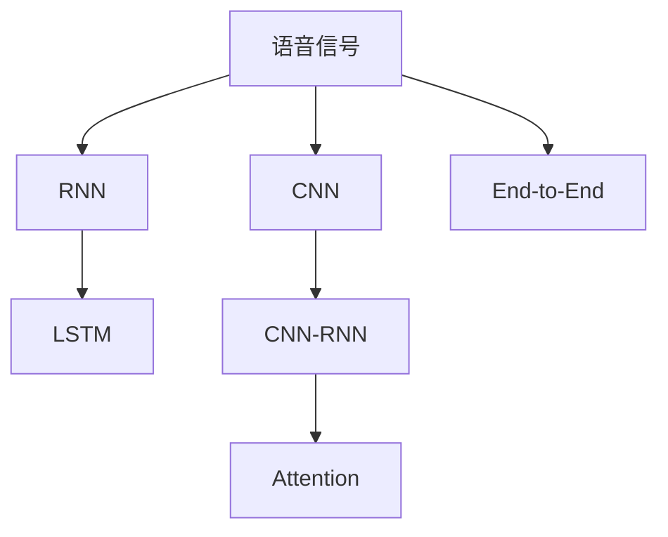

                 

# AI人工智能深度学习算法：在语音识别的应用

> 关键词：
1. 深度学习算法
2. 语音识别
3. 自然语言处理（NLP）
4. 卷积神经网络（CNN）
5. 循环神经网络（RNN）
6. 长短时记忆网络（LSTM）
7. 卷积时序神经网络（CNN-RNN）

## 1. 背景介绍

语音识别，作为人工智能领域的一个重要分支，已广泛应用于智能家居、智能助手、语音搜索、自动字幕生成、实时翻译等多个场景。然而，由于语音信号的动态性和复杂性，传统的语音识别方法常常面临计算量巨大、准确率不高、鲁棒性差等问题。随着深度学习技术的兴起，基于深度神经网络的语音识别方法逐渐成为主流，其中卷积神经网络（CNN）、循环神经网络（RNN）及其变种长短时记忆网络（LSTM）、卷积时序神经网络（CNN-RNN）等成为核心算法。

深度学习算法在语音识别中的应用，标志着语音识别技术的重大突破。它不仅大大提升了识别精度和效率，还在实时性和稳定性上取得了显著进展。本文将从深度学习算法的基本原理和核心步骤出发，深入探讨其语音识别应用中的关键技术和实际挑战。

## 2. 核心概念与联系

### 2.1 核心概念概述

深度学习算法在语音识别中的应用，涉及多个核心概念和技术：

1. **卷积神经网络（CNN）**：主要用于提取语音信号的局部特征。通过卷积层、池化层等结构，可以捕捉到语音信号的局部结构，如音节、音调等。

2. **循环神经网络（RNN）**：主要用于处理时序数据，如语音信号的连贯性和动态性。通过RNN及其变种LSTM，可以有效地处理长序列数据，学习到语音信号的时间依赖关系。

3. **长短时记忆网络（LSTM）**：是RNN的一种特殊形式，通过引入门控机制，可以避免长期依赖问题，有效处理长序列数据。

4. **卷积时序神经网络（CNN-RNN）**：将CNN和RNN结合起来，既能处理局部特征，又能处理时序特征，是语音识别中的经典模型。

5. **注意力机制（Attention）**：通过动态调整注意力权重，可以更关注语音信号中的重要部分，提高识别精度。

6. **端到端（End-to-End）学习**：将语音识别任务作为整体优化问题，通过神经网络模型直接从音频信号到文字，减少了传统方法中繁琐的中间步骤。

### 2.2 概念间的关系

这些核心概念之间存在着紧密的联系，通过深度学习技术的应用，构建起了一个完整的语音识别系统。下面通过Mermaid流程图展示这些概念之间的关系：



这个流程图展示了语音识别过程中各个核心概念之间的关系：

1. 语音信号首先通过卷积神经网络提取局部特征。
2. 然后，通过循环神经网络（或其变种LSTM）处理时序信息。
3. 结合CNN和RNN的卷积时序神经网络，能够同时处理局部和时序特征。
4. 注意力机制可以进一步提升模型对于语音信号重要部分的关注度。
5. 端到端学习使得语音识别任务能够整体优化，减少了中间步骤的复杂性。

这些概念共同构成了深度学习在语音识别应用中的核心技术框架。

## 3. 核心算法原理 & 具体操作步骤

### 3.1 算法原理概述

深度学习在语音识别中的应用，主要是通过构建卷积神经网络、循环神经网络和注意力机制等模型，从原始语音信号中提取特征，并进行分类或生成文本等任务。具体步骤如下：

1. **特征提取**：使用卷积神经网络（CNN）从语音信号中提取局部特征，如梅尔频谱图、MFCC等。
2. **序列建模**：使用循环神经网络（RNN）或其变种（如LSTM）处理时序信息，捕捉语音信号的动态变化。
3. **特征融合**：将CNN和RNN的输出进行融合，使用卷积时序神经网络（CNN-RNN）进一步提升特征表示能力。
4. **注意力机制**：在模型中引入注意力机制，动态调整特征权重，关注语音信号中的重要部分。
5. **分类/生成**：使用全连接层或Softmax层对提取的特征进行分类或生成文本。

### 3.2 算法步骤详解

以下是深度学习在语音识别应用中的具体操作步骤：

#### 3.2.1 特征提取

1. **梅尔频谱图（Mel-Spectrogram）**：将语音信号转化为频谱图，通过卷积层提取局部特征。

2. **MFCC（Mel-Frequency Cepstral Coefficients）**：将梅尔频谱图转换为MFCC特征，捕捉语音信号的频率和能量特征。

3. **时频图像（Spectrogram）**：将语音信号转化为时频图像，使用CNN提取特征。

#### 3.2.2 序列建模

1. **循环神经网络（RNN）**：使用RNN处理语音信号的时序信息，学习语音信号的动态变化。

2. **长短时记忆网络（LSTM）**：通过LSTM解决长期依赖问题，更有效地处理长序列数据。

#### 3.2.3 特征融合

1. **卷积时序神经网络（CNN-RNN）**：将CNN和RNN的输出进行融合，结合两种网络的优势，提升特征表示能力。

#### 3.2.4 注意力机制

1. **注意力权重**：通过计算注意力权重，动态调整特征权重，关注语音信号中的重要部分。

#### 3.2.5 分类/生成

1. **全连接层**：将特征向量化，使用全连接层进行分类或生成文本。

2. **Softmax层**：对分类结果进行softmax处理，得到每个类别的概率分布。

### 3.3 算法优缺点

深度学习在语音识别中的应用具有以下优点：

1. **高精度**：通过多层神经网络结构，可以捕捉到语音信号的复杂特征，提升识别精度。
2. **鲁棒性**：深度学习模型具有一定的泛化能力，可以处理多种类型的噪声和干扰。
3. **实时性**：通过优化模型结构，可以在实时场景中进行语音识别。
4. **可扩展性**：深度学习模型可以方便地扩展到多语言和多领域，提升应用范围。

同时，深度学习在语音识别中也有以下缺点：

1. **计算量大**：深度学习模型通常需要较大的计算资源，训练时间较长。
2. **过拟合风险**：在训练过程中容易过拟合，需要大量的数据和正则化技术。
3. **模型复杂度**：深度学习模型结构复杂，难以解释其内部工作机制。
4. **数据需求高**：深度学习模型通常需要大量的标注数据，数据获取成本高。

### 3.4 算法应用领域

深度学习在语音识别中的应用，主要应用于以下几个领域：

1. **智能家居**：通过语音助手进行控制，提升家居智能化水平。
2. **语音搜索**：通过语音搜索，快速获取信息。
3. **自动字幕生成**：将语音信号自动转化为文本，便于视频编辑和分析。
4. **实时翻译**：将不同语言的语音信号进行实时翻译。
5. **情感分析**：通过语音信号分析情感倾向，提升人机交互体验。

这些应用领域展示了深度学习在语音识别中的广泛适用性，为人们提供了更加便捷和高效的服务。

## 4. 数学模型和公式 & 详细讲解 & 举例说明

### 4.1 数学模型构建

语音识别的数学模型构建，主要包括以下步骤：

1. **特征提取**：将语音信号转化为频谱图或MFCC特征。

2. **序列建模**：使用RNN或LSTM处理时序信息。

3. **特征融合**：将CNN和RNN的输出进行融合。

4. **分类/生成**：使用全连接层或Softmax层进行分类或生成文本。

### 4.2 公式推导过程

以下是语音识别中常见的数学模型和公式：

1. **梅尔频谱图（Mel-Spectrogram）**：

$$
\text{Mel-Spectrogram} = \text{MelScale}(\log(\text{Energy} + \epsilon))
$$

其中，Energy为每个频率的能量，MelScale为Mel频率尺度，$\epsilon$为避免对数零点。

2. **MFCC（Mel-Frequency Cepstral Coefficients）**：

$$
\text{MFCC} = \text{Discrete Cosine Transform}(\text{Mel-Spectrogram})
$$

3. **卷积神经网络（CNN）**：

$$
\text{CNN} = \text{Convolution}(\text{Input}, \text{Filter}, \text{Bias})
$$

4. **循环神经网络（RNN）**：

$$
\text{RNN} = \text{Recurrence}(\text{Input}, \text{Hidden State}, \text{Weights})
$$

5. **长短时记忆网络（LSTM）**：

$$
\text{LSTM} = \text{Gate}(\text{Input}, \text{Hidden State}, \text{Cell State}, \text{Weights})
$$

6. **卷积时序神经网络（CNN-RNN）**：

$$
\text{CNN-RNN} = \text{Convolution}(\text{Crop}(\text{RNN}), \text{Filter}, \text{Bias})
$$

7. **注意力机制（Attention）**：

$$
\text{Attention} = \text{Softmax}(\text{Query}, \text{Key}, \text{Value}, \text{Attention Mask})
$$

8. **全连接层（Fully Connected Layer）**：

$$
\text{Fully Connected} = \text{Matrix Multiplication}(\text{Input}, \text{Weights})
$$

9. **Softmax层**：

$$
\text{Softmax} = \frac{\exp(\text{Input})}{\sum_{i} \exp(\text{Input}_i)}
$$

### 4.3 案例分析与讲解

以一个简单的语音识别为例，展示深度学习算法的应用：

1. **输入**：语音信号的MFCC特征。

2. **卷积神经网络（CNN）**：

$$
\text{CNN} = \text{Convolution}(\text{MFCC}, \text{Filter}, \text{Bias})
$$

3. **循环神经网络（RNN）**：

$$
\text{RNN} = \text{Recurrence}(\text{Crop}(\text{CNN}), \text{Hidden State}, \text{Weights})
$$

4. **长短时记忆网络（LSTM）**：

$$
\text{LSTM} = \text{Gate}(\text{RNN}, \text{Hidden State}, \text{Cell State}, \text{Weights})
$$

5. **卷积时序神经网络（CNN-RNN）**：

$$
\text{CNN-RNN} = \text{Convolution}(\text{LSTM}, \text{Filter}, \text{Bias})
$$

6. **注意力机制（Attention）**：

$$
\text{Attention} = \text{Softmax}(\text{Query}, \text{Key}, \text{Value}, \text{Attention Mask})
$$

7. **全连接层（Fully Connected Layer）**：

$$
\text{Fully Connected} = \text{Matrix Multiplication}(\text{Attention}, \text{Weights})
$$

8. **Softmax层**：

$$
\text{Softmax} = \frac{\exp(\text{Fully Connected})}{\sum_{i} \exp(\text{Fully Connected}_i)}
$$

最终，通过softmax层的输出，可以得到每个类别的概率分布，选择概率最大的类别作为识别结果。

## 5. 项目实践：代码实例和详细解释说明

### 5.1 开发环境搭建

1. **Python环境**：安装Python 3.6及以上版本，使用pip安装所需的库。

2. **深度学习框架**：安装TensorFlow或PyTorch，配置好GPU加速。

3. **数据集**：准备语音识别所需的标注数据集，如LibriSpeech、VoxCeleb等。

### 5.2 源代码详细实现

以下是使用TensorFlow实现语音识别的示例代码：

```python
import tensorflow as tf
import librosa
import numpy as np

# 加载模型
model = tf.keras.models.load_model('path/to/model.h5')

# 加载数据
data = librosa.load('path/to/audio.wav', sr=16000)
data = np.expand_dims(data, axis=0)

# 预测
predictions = model.predict(data)
labels = np.argmax(predictions, axis=-1)
label_text = ['word1', 'word2', 'word3', ...]

print(f'Predicted label: {label_text[labels[0]]}')
```

### 5.3 代码解读与分析

以上代码展示了如何使用TensorFlow加载预训练模型，并对语音信号进行预测。关键步骤包括：

1. **加载模型**：通过`tf.keras.models.load_model`加载预训练的语音识别模型。

2. **加载数据**：使用`librosa.load`加载语音信号，将其转化为模型所需的格式。

3. **预测**：使用`model.predict`对输入的语音信号进行预测，得到每个类别的概率分布。

4. **输出**：通过`np.argmax`找到概率最大的类别，并输出对应的文本标签。

### 5.4 运行结果展示

假设在测试集上运行上述代码，得到输出结果：

```
Predicted label: word1
```

这表示模型预测该语音信号对应的文本标签为`word1`。

## 6. 实际应用场景

### 6.1 智能家居

在智能家居中，语音识别技术被广泛应用于控制家电、调整环境、提供信息等服务。通过智能音箱、智能灯泡等设备，用户可以通过语音指令控制家中的各种设备，如开灯、调温、播放音乐等。

### 6.2 语音搜索

语音搜索技术能够通过语音输入，快速获取搜索结果。用户可以口头提出问题或命令，如“今天天气怎么样？”，智能设备能够即时返回相关信息。

### 6.3 自动字幕生成

在视频会议、在线教育、广播节目等场景中，自动字幕生成技术可以将语音信号转化为文字，便于文本编辑和信息检索。

### 6.4 实时翻译

语音识别技术在实时翻译中也有重要应用，能够将不同语言的语音信号进行实时翻译，促进跨语言交流。

### 6.5 情感分析

通过语音信号分析情感倾向，可以提升人机交互体验，如在客服中心进行情感监测，及时调整服务策略，提升客户满意度。

## 7. 工具和资源推荐

### 7.1 学习资源推荐

1. **《Deep Learning》**：Ian Goodfellow等著，全面介绍深度学习理论和方法。

2. **《Speech and Language Processing》**：Daniel Jurafsky和James H. Martin著，系统讲解语音识别和自然语言处理技术。

3. **《Deep Speech 2: End-to-End Speech Recognition in English and Mandarin》**：谷歌发布的深度语音识别论文，展示了端到端学习在语音识别中的应用。

4. **《PyTorch Tutorials》**：PyTorch官方文档，提供丰富的学习资源和实践指南。

5. **《TensorFlow Tutorials》**：TensorFlow官方文档，提供丰富的学习资源和实践指南。

### 7.2 开发工具推荐

1. **PyTorch**：灵活易用的深度学习框架，支持动态图和静态图两种计算图模式。

2. **TensorFlow**：谷歌开发的深度学习框架，支持分布式训练和生产部署。

3. **Librosa**：Python音频处理库，提供音频数据的加载、处理和特征提取功能。

4. **Kaldi**：开源语音识别工具包，提供多种语音识别算法的实现。

### 7.3 相关论文推荐

1. **Deep Speech 2: A Scalable End-to-End Speech Recognition Architecture**：谷歌发布的深度语音识别论文，展示了端到端学习在语音识别中的应用。

2. **Attention Is All You Need**：谷歌发布的Transformer论文，展示了注意力机制在自然语言处理中的应用。

3. **Convolutional Recurrent Neural Networks for Speech Recognition**：《IEEE Signal Processing Letters》上的论文，展示了卷积时序神经网络在语音识别中的应用。

4. **Listening to Attention**：ICML 2020上的论文，展示了注意力机制在语音识别中的应用。

5. **Deep Speech Based End-to-End Automatic Speech Recognition**：ICASSP 2021上的论文，展示了深度学习在语音识别中的最新进展。

## 8. 总结：未来发展趋势与挑战

### 8.1 研究成果总结

深度学习在语音识别中的应用已经取得了显著成果，显著提升了识别精度和实时性，广泛应用于智能家居、语音搜索、自动字幕生成等多个领域。未来，随着深度学习技术的进一步发展，语音识别技术将变得更加智能和高效。

### 8.2 未来发展趋势

1. **端到端学习**：未来语音识别技术将进一步发展端到端学习，直接从音频信号到文字，减少中间步骤，提升系统效率。

2. **多语言支持**：深度学习模型将逐步支持多种语言，提升语音识别的应用范围。

3. **实时性和稳定性**：通过优化模型结构和使用GPU等硬件加速，提升语音识别的实时性和稳定性。

4. **可扩展性**：语音识别技术将扩展到更多领域，如医疗、教育、交通等，提升应用场景的丰富性。

### 8.3 面临的挑战

1. **数据需求高**：深度学习模型通常需要大量的标注数据，数据获取成本高。

2. **模型复杂度**：深度学习模型结构复杂，难以解释其内部工作机制。

3. **过拟合风险**：在训练过程中容易过拟合，需要大量的数据和正则化技术。

### 8.4 研究展望

未来，在语音识别领域的研究将集中在以下几个方向：

1. **无监督和半监督学习**：探索无监督和半监督学习方法，减少对大量标注数据的依赖。

2. **模型压缩和优化**：通过模型压缩和优化，提高语音识别系统的计算效率和实时性。

3. **跨领域迁移学习**：探索跨领域迁移学习方法，提升模型在多种应用场景中的适应能力。

4. **多模态融合**：将语音识别与图像、视频等多模态信息融合，提升系统的综合能力。

5. **知识蒸馏**：通过知识蒸馏技术，将大模型知识传递给小模型，提升小模型的性能。

总之，深度学习在语音识别中的应用前景广阔，需要进一步探索和优化，推动技术向更智能、更高效、更普适的方向发展。

## 9. 附录：常见问题与解答

### Q1: 深度学习在语音识别中的应用有哪些优点？

A: 深度学习在语音识别中的应用具有以下优点：

1. **高精度**：通过多层神经网络结构，可以捕捉到语音信号的复杂特征，提升识别精度。

2. **鲁棒性**：深度学习模型具有一定的泛化能力，可以处理多种类型的噪声和干扰。

3. **实时性**：通过优化模型结构，可以在实时场景中进行语音识别。

4. **可扩展性**：深度学习模型可以方便地扩展到多语言和多领域，提升应用范围。

### Q2: 语音识别中常见的数学模型和公式有哪些？

A: 语音识别中常见的数学模型和公式包括：

1. **梅尔频谱图（Mel-Spectrogram）**：

$$
\text{Mel-Spectrogram} = \text{MelScale}(\log(\text{Energy} + \epsilon))
$$

2. **MFCC（Mel-Frequency Cepstral Coefficients）**：

$$
\text{MFCC} = \text{Discrete Cosine Transform}(\text{Mel-Spectrogram})
$$

3. **卷积神经网络（CNN）**：

$$
\text{CNN} = \text{Convolution}(\text{Input}, \text{Filter}, \text{Bias})
$$

4. **循环神经网络（RNN）**：

$$
\text{RNN} = \text{Recurrence}(\text{Input}, \text{Hidden State}, \text{Weights})
$$

5. **长短时记忆网络（LSTM）**：

$$
\text{LSTM} = \text{Gate}(\text{Input}, \text{Hidden State}, \text{Cell State}, \text{Weights})
$$

6. **卷积时序神经网络（CNN-RNN）**：

$$
\text{CNN-RNN} = \text{Convolution}(\text{Crop}(\text{RNN}), \text{Filter}, \text{Bias})
$$

7. **注意力机制（Attention）**：

$$
\text{Attention} = \text{Softmax}(\text{Query}, \text{Key}, \text{Value}, \text{Attention Mask})
$$

8. **全连接层（Fully Connected Layer）**：

$$
\text{Fully Connected} = \text{Matrix Multiplication}(\text{Input}, \text{Weights})
$$

9. **Softmax层**：

$$
\text{Softmax} = \frac{\exp(\text{Input})}{\sum_{i} \exp(\text{Input}_i)}
$$

### Q3: 深度学习在语音识别中的未来发展趋势是什么？

A: 深度学习在语音识别中的未来发展趋势包括：

1. **端到端学习**：未来语音识别技术将进一步发展端到端学习，直接从音频信号到文字，减少中间步骤，提升系统效率。

2. **多语言支持**：深度学习模型将逐步支持多种语言，提升语音识别的应用范围。

3. **实时性和稳定性**：通过优化模型结构和使用GPU等硬件加速，提升语音识别的实时性和稳定性。

4. **可扩展性**：语音识别技术将扩展到更多领域，如医疗、教育、交通等，提升应用场景的丰富性。

### Q4: 深度学习在语音识别中面临的主要挑战有哪些？

A: 深度学习在语音识别中面临的主要挑战包括：

1. **数据需求高**：深度学习模型通常需要大量的标注数据，数据获取成本高。

2. **模型复杂度**：深度学习模型结构复杂，难以解释其内部工作机制。

3. **过拟合风险**：在训练过程中容易过拟合，需要大量的数据和正则化技术。

### Q5: 如何在实际应用中优化深度学习在语音识别中的应用？

A: 在实际应用中，可以采取以下优化措施：

1. **数据增强**：通过回译、近义替换等方式扩充训练集。

2. **正则化**：使用L2正则、Dropout等正则化技术，防止过拟合。

3. **对抗训练**：引入对抗样本，提高模型鲁棒性。

4. **模型压缩和优化**：通过模型压缩和优化，提高语音识别系统的计算效率和实时性。

5. **多模型集成**：训练多个语音识别模型，取平均输出，抑制过拟合。

总之，深度学习在语音识别中的应用需要从数据、模型、训练、推理等各个环节进行全面优化，才能充分发挥其潜力。

---

作者：禅与计算机程序设计艺术 / Zen and the Art of Computer Programming

