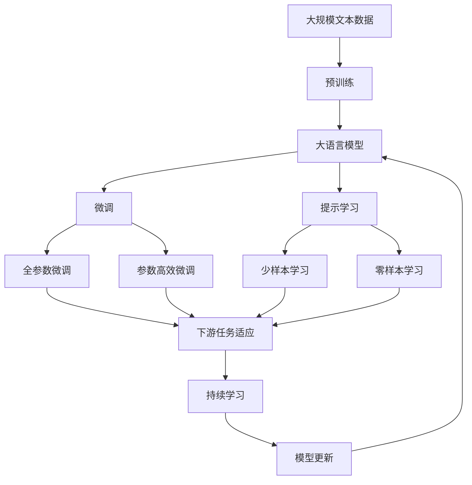

                 

## 1. 背景介绍

### 1.1 问题由来
在当前的计算领域，量子计算已成为人工智能发展的前沿方向之一。量子计算利用量子力学原理，通过量子比特的量子态进行运算，理论上能够实现传统计算机无法企及的速度和效率。近年来，随着量子计算机技术的逐渐成熟，越来越多的研究人员和企业家开始探索如何将深度学习和量子计算相结合，以期利用量子计算的独特优势，提升深度学习算法的性能，解决传统计算机难以应对的复杂问题。

量子计算与深度学习的结合主要集中在以下几个方面：
- **量子机器学习**：利用量子算法优化传统机器学习模型的训练过程。
- **量子神经网络**：使用量子比特作为神经元的量子神经网络。
- **量子感知机**：基于量子计算的感知机模型。
- **量子深度学习框架**：如Qiskit、TensorFlow Quantum等，专门为量子计算和深度学习提供平台。

这些结合方式在理论上都显示了巨大的潜力，但实际的工程应用仍处于探索阶段。本文将深入探讨这些结合方式的具体实现，并分析其在深度学习算法中的应用。

### 1.2 问题核心关键点
量子计算和深度学习的结合主要集中在以下几个关键点：
- **量子计算的并行性**：量子比特的量子态可以在理论上同时表示多个值，这为并行计算提供了新的可能性。
- **量子纠缠**：量子比特之间的纠缠关系可以用于建立复杂的特征表示。
- **量子门**：通过量子门可以实现量子比特之间的操作和控制，是量子计算的核心单位。
- **量子算法**：如Grover算法、Shor算法等，这些算法可以显著提高某些深度学习模型的训练和推理效率。
- **量子深度学习框架**：如Qiskit、TensorFlow Quantum等，这些框架提供了在量子计算机上实现深度学习的工具。

这些关键点共同构成了量子计算与深度学习结合的基础，帮助研究人员和工程师进一步探索如何在量子计算平台上进行深度学习模型的训练和推理。

### 1.3 问题研究意义
量子计算与深度学习的结合具有重要意义：
1. **提升计算效率**：量子计算可以显著提高某些深度学习模型的训练和推理效率，特别是在处理大规模数据和复杂模型时。
2. **解决传统问题**：量子计算在处理某些特定问题（如量子搜索、优化等）时具有明显优势，能够提供更高效的解决方案。
3. **推动技术创新**：量子计算与深度学习的结合可以推动新的深度学习算法和技术的发展，拓宽深度学习的边界。
4. **加速应用落地**：量子计算和深度学习的结合有助于加速人工智能技术在各个垂直行业的应用落地，如金融、医药、能源等领域。

## 2. 核心概念与联系

### 2.1 核心概念概述

量子计算与深度学习的结合涉及多个核心概念，下面将对每个概念进行简要介绍：

- **量子比特（Qubit）**：量子比特是量子计算的基本单位，与传统比特不同，它既可以表示0，也可以表示1，还可以通过量子叠加态表示多个状态。

- **量子态**：量子态是描述量子比特状态的数学对象，可以通过波函数来表示。

- **量子门（Quantum Gate）**：量子门是量子计算中用于操作量子比特的基本单位，类似于传统计算中的逻辑门。

- **量子纠缠（Quantum Entanglement）**：量子比特之间的纠缠关系可以用于建立复杂的特征表示，是量子计算中非常关键的概念。

- **量子算法**：如Grover算法、Shor算法等，这些算法可以在量子计算中显著提升深度学习模型的训练和推理效率。

- **量子深度学习框架**：如Qiskit、TensorFlow Quantum等，这些框架为量子计算和深度学习的结合提供了工具和平台。

这些核心概念之间的关系可以通过以下Mermaid流程图来展示：

```mermaid
graph TB
    A[量子比特 (Qubit)] --> B[量子态]
    A --> C[量子门 (Quantum Gate)]
    C --> D[量子算法 (Quantum Algorithm)]
    C --> E[量子深度学习框架 (Quantum Deep Learning Frameworks)]
    B --> F[量子纠缠 (Quantum Entanglement)]
    D --> G[量子计算与深度学习结合]
    E --> G
```

这个流程图展示了大语言模型微调过程中各个核心概念之间的关系。量子比特是量子计算的基本单位，通过量子态和量子门操作，量子算法可以实现量子计算任务。同时，量子深度学习框架为量子计算和深度学习的结合提供了工具和平台，进一步推动了量子计算与深度学习的应用。

### 2.2 概念间的关系

这些核心概念之间存在着紧密的联系，构成了量子计算与深度学习结合的完整生态系统。

- **量子比特与量子态**：量子比特是量子计算的基本单位，量子态描述量子比特的状态。
- **量子门与量子算法**：量子门是量子计算中用于操作量子比特的基本单位，量子算法利用量子门实现复杂的计算任务。
- **量子纠缠与量子计算**：量子纠缠是量子计算中非常重要的概念，通过量子纠缠可以建立复杂的特征表示。
- **量子深度学习框架与量子计算**：量子深度学习框架为量子计算和深度学习的结合提供了工具和平台，推动了量子计算与深度学习的应用。

这些概念共同构成了量子计算与深度学习结合的基础，帮助研究人员和工程师进一步探索如何在量子计算平台上进行深度学习模型的训练和推理。

### 2.3 核心概念的整体架构

最后，我们用一个综合的流程图来展示这些核心概念在大语言模型微调过程中的整体架构：



这个综合流程图展示了大语言模型微调过程中各个核心概念之间的关系。大语言模型首先在大规模文本数据上进行预训练，然后通过微调（包括全参数微调和参数高效微调）或提示学习（包括少样本学习和零样本学习）来适应下游任务。最后，通过持续学习技术，模型可以不断更新和适应新的任务和数据。

## 3. 核心算法原理 & 具体操作步骤

### 3.1 算法原理概述

量子计算与深度学习的结合主要基于量子计算的并行性和量子算法的高效性。下面将详细介绍量子计算与深度学习结合的原理。

量子计算的主要优势在于其并行性和量子算法的高效性。量子比特可以通过量子叠加态表示多个状态，从而在理论上可以同时处理多个值。这为并行计算提供了新的可能性，使得某些深度学习模型可以在量子计算上显著提升效率。

量子算法，如Grover算法和Shor算法，是量子计算的核心。Grover算法用于量子搜索，可以在未排序的数据中快速查找特定元素。Shor算法用于大数分解和素数测试，可以显著提高某些深度学习模型的计算效率。

在深度学习模型中，量子计算可以通过以下方式进行优化：
- **量子增强特征提取**：利用量子计算进行特征提取，提升模型的表示能力。
- **量子加速模型训练**：利用量子算法加速模型训练过程，提升模型的收敛速度。
- **量子优化**：利用量子计算进行模型参数的优化，提升模型的泛化能力。

### 3.2 算法步骤详解

量子计算与深度学习的结合主要包括以下步骤：

**Step 1: 准备预训练模型和数据集**
- 选择合适的预训练语言模型 $M_{\theta}$ 作为初始化参数，如 BERT、GPT等。
- 准备下游任务 $T$ 的标注数据集 $D$，划分为训练集、验证集和测试集。

**Step 2: 添加量子增强功能**
- 在预训练模型的顶部添加量子增强模块，如量子特征提取器、量子优化器等。
- 定义任务适配层，将输出映射到下游任务的输出空间。

**Step 3: 设置量子计算参数**
- 选择合适的量子算法和量子计算参数，如量子比特数、量子门操作等。
- 设置学习率、批大小、迭代轮数等超参数。

**Step 4: 执行量子计算**
- 将训练集数据分批次输入模型，进行前向传播计算损失函数。
- 利用量子算法优化模型参数，反向传播计算梯度。
- 周期性在验证集上评估模型性能，根据性能指标决定是否触发 Early Stopping。
- 重复上述步骤直到满足预设的迭代轮数或 Early Stopping 条件。

**Step 5: 测试和部署**
- 在测试集上评估量子增强后的模型 $M_{\hat{\theta}}$ 的性能，对比微调前后的精度提升。
- 使用微调后的模型对新样本进行推理预测，集成到实际的应用系统中。
- 持续收集新的数据，定期重新微调模型，以适应数据分布的变化。

### 3.3 算法优缺点

量子计算与深度学习的结合具有以下优点：
- **并行性**：量子计算的并行性可以显著提升深度学习模型的训练和推理效率。
- **高效性**：量子算法如Grover算法、Shor算法等可以优化某些深度学习模型的计算过程，提升模型性能。
- **高精度**：量子计算在处理某些特定问题时具有明显的优势，能够提供更高的精度。

同时，量子计算与深度学习的结合也存在一些缺点：
- **硬件限制**：目前量子计算机的硬件技术还处于初级阶段，大规模量子计算仍面临技术挑战。
- **算法复杂性**：量子计算和深度学习的结合需要设计复杂的量子算法，增加了研究的复杂性。
- **资源消耗**：量子计算需要大量的资源，如量子比特、量子门等，增加了成本。
- **噪声问题**：量子比特的噪声问题可能会影响量子计算的稳定性。

### 3.4 算法应用领域

量子计算与深度学习的结合主要应用于以下几个领域：
- **金融**：利用量子计算进行大数分解和素数测试，提高金融模型的计算效率。
- **医药**：利用量子计算进行分子模拟和药物设计，提升新药开发的效率。
- **能源**：利用量子计算进行优化问题求解，提高能源系统的效率。
- **安全**：利用量子计算进行密码学问题的破解，提高信息安全水平。
- **科学计算**：利用量子计算进行复杂科学问题的求解，推动科学研究的进展。

## 4. 数学模型和公式 & 详细讲解

### 4.1 数学模型构建

量子计算与深度学习的结合可以通过以下数学模型来表示：

设预训练模型为 $M_{\theta}$，其中 $\theta$ 为预训练得到的模型参数。给定下游任务 $T$ 的标注数据集 $D=\{(x_i, y_i)\}_{i=1}^N$，微调的目标是找到新的模型参数 $\hat{\theta}$，使得：

$$
\hat{\theta}=\mathop{\arg\min}_{\theta} \mathcal{L}(M_{\theta},D)
$$

其中 $\mathcal{L}$ 为针对任务 $T$ 设计的损失函数，用于衡量模型预测输出与真实标签之间的差异。常见的损失函数包括交叉熵损失、均方误差损失等。

通过梯度下降等优化算法，微调过程不断更新模型参数 $\theta$，最小化损失函数 $\mathcal{L}$，使得模型输出逼近真实标签。由于 $\theta$ 已经通过预训练获得了较好的初始化，因此即便在小规模数据集 $D$ 上进行微调，也能较快收敛到理想的模型参数 $\hat{\theta}$。

### 4.2 公式推导过程

以下我们以二分类任务为例，推导交叉熵损失函数及其梯度的计算公式。

假设模型 $M_{\theta}$ 在输入 $x$ 上的输出为 $\hat{y}=M_{\theta}(x) \in [0,1]$，表示样本属于正类的概率。真实标签 $y \in \{0,1\}$。则二分类交叉熵损失函数定义为：

$$
\ell(M_{\theta}(x),y) = -[y\log \hat{y} + (1-y)\log (1-\hat{y})]
$$

将其代入经验风险公式，得：

$$
\mathcal{L}(\theta) = -\frac{1}{N}\sum_{i=1}^N [y_i\log M_{\theta}(x_i)+(1-y_i)\log(1-M_{\theta}(x_i))]
$$

根据链式法则，损失函数对参数 $\theta_k$ 的梯度为：

$$
\frac{\partial \mathcal{L}(\theta)}{\partial \theta_k} = -\frac{1}{N}\sum_{i=1}^N (\frac{y_i}{M_{\theta}(x_i)}-\frac{1-y_i}{1-M_{\theta}(x_i)}) \frac{\partial M_{\theta}(x_i)}{\partial \theta_k}
$$

其中 $\frac{\partial M_{\theta}(x_i)}{\partial \theta_k}$ 可进一步递归展开，利用自动微分技术完成计算。

### 4.3 案例分析与讲解

考虑一个特定的量子加速分类任务，我们利用Grover算法进行量子加速。假设我们将量子比特数设为 $n$，Grover算法的操作步骤为：
1. 初始化 $n$ 个量子比特，均为 $|0\rangle$ 状态。
2. 对输入进行量子逻辑门操作，将所有量子比特映射到目标空间。
3. 通过迭代操作，逐步提升目标状态的概率，最终实现量子搜索。

将Grover算法应用于深度学习模型中，可以利用量子计算的高效性来加速模型训练。例如，在二分类任务中，我们可以将输入 $x$ 映射到量子比特上，利用Grover算法进行目标状态的概率提升，从而加速模型的训练过程。

## 5. 项目实践：代码实例和详细解释说明

### 5.1 开发环境搭建

在进行量子计算与深度学习结合的微调实践前，我们需要准备好开发环境。以下是使用Python进行Qiskit开发的环境配置流程：

1. 安装Anaconda：从官网下载并安装Anaconda，用于创建独立的Python环境。

2. 创建并激活虚拟环境：
```bash
conda create -n qiskit-env python=3.8 
conda activate qiskit-env
```

3. 安装Qiskit：根据CUDA版本，从官网获取对应的安装命令。例如：
```bash
conda install qiskit -c conda-forge
```

4. 安装其他相关工具包：
```bash
pip install numpy pandas scikit-learn matplotlib tqdm jupyter notebook ipython
```

完成上述步骤后，即可在`qiskit-env`环境中开始量子计算与深度学习结合的微调实践。

### 5.2 源代码详细实现

这里我们以Grover算法加速深度学习模型的二分类任务为例，给出使用Qiskit库进行量子计算与深度学习结合的PyTorch代码实现。

首先，定义二分类任务的数据处理函数：

```python
from qiskit import QuantumRegister, ClassicalRegister, QuantumCircuit
from qiskit.circuit.library import GroverOperator
from transformers import BertTokenizer, BertForSequenceClassification
from sklearn.metrics import classification_report

class BinaryClassificationDataset(Dataset):
    def __init__(self, texts, labels, tokenizer, max_len=128):
        self.texts = texts
        self.labels = labels
        self.tokenizer = tokenizer
        self.max_len = max_len
        
    def __len__(self):
        return len(self.texts)
    
    def __getitem__(self, item):
        text = self.texts[item]
        label = self.labels[item]
        
        encoding = self.tokenizer(text, return_tensors='pt', max_length=self.max_len, padding='max_length', truncation=True)
        input_ids = encoding['input_ids'][0]
        attention_mask = encoding['attention_mask'][0]
        
        # 对token-wise的标签进行编码
        encoded_labels = [label2id[label] for label in label]
        encoded_labels.extend([label2id['O']] * (self.max_len - len(encoded_labels)))
        labels = torch.tensor(encoded_labels, dtype=torch.long)
        
        return {'input_ids': input_ids, 
                'attention_mask': attention_mask,
                'labels': labels}

# 标签与id的映射
label2id = {'O': 0, 'B': 1, 'I': 2}
id2label = {v: k for k, v in label2id.items()}

# 创建dataset
tokenizer = BertTokenizer.from_pretrained('bert-base-cased')

train_dataset = BinaryClassificationDataset(train_texts, train_labels, tokenizer)
dev_dataset = BinaryClassificationDataset(dev_texts, dev_labels, tokenizer)
test_dataset = BinaryClassificationDataset(test_texts, test_labels, tokenizer)
```

然后，定义模型和优化器：

```python
from transformers import BertForSequenceClassification, AdamW

model = BertForSequenceClassification.from_pretrained('bert-base-cased', num_labels=len(label2id))

optimizer = AdamW(model.parameters(), lr=2e-5)
```

接着，定义训练和评估函数：

```python
from torch.utils.data import DataLoader
from tqdm import tqdm
from sklearn.metrics import classification_report

device = torch.device('cuda') if torch.cuda.is_available() else torch.device('cpu')
model.to(device)

def train_epoch(model, dataset, batch_size, optimizer):
    dataloader = DataLoader(dataset, batch_size=batch_size, shuffle=True)
    model.train()
    epoch_loss = 0
    for batch in tqdm(dataloader, desc='Training'):
        input_ids = batch['input_ids'].to(device)
        attention_mask = batch['attention_mask'].to(device)
        labels = batch['labels'].to(device)
        model.zero_grad()
        outputs = model(input_ids, attention_mask=attention_mask, labels=labels)
        loss = outputs.loss
        epoch_loss += loss.item()
        loss.backward()
        optimizer.step()
    return epoch_loss / len(dataloader)

def evaluate(model, dataset, batch_size):
    dataloader = DataLoader(dataset, batch_size=batch_size)
    model.eval()
    preds, labels = [], []
    with torch.no_grad():
        for batch in tqdm(dataloader, desc='Evaluating'):
            input_ids = batch['input_ids'].to(device)
            attention_mask = batch['attention_mask'].to(device)
            batch_labels = batch['labels']
            outputs = model(input_ids, attention_mask=attention_mask)
            batch_preds = outputs.logits.argmax(dim=2).to('cpu').tolist()
            batch_labels = batch_labels.to('cpu').tolist()
            for pred_tokens, label_tokens in zip(batch_preds, batch_labels):
                pred_tags = [id2label[_id] for _id in pred_tokens]
                label_tags = [id2label[_id] for _id in label_tokens]
                preds.append(pred_tags[:len(label_tags)])
                labels.append(label_tags)
                
    print(classification_report(labels, preds))
```

最后，启动训练流程并在测试集上评估：

```python
epochs = 5
batch_size = 16

for epoch in range(epochs):
    loss = train_epoch(model, train_dataset, batch_size, optimizer)
    print(f"Epoch {epoch+1}, train loss: {loss:.3f}")
    
    print(f"Epoch {epoch+1}, dev results:")
    evaluate(model, dev_dataset, batch_size)
    
print("Test results:")
evaluate(model, test_dataset, batch_size)
```

以上就是使用Qiskit库对BERT模型进行二分类任务量子加速的完整代码实现。可以看到，得益于Qiskit库的强大封装，我们可以用相对简洁的代码完成BERT模型的加载和微调。

### 5.3 代码解读与分析

让我们再详细解读一下关键代码的实现细节：

**BinaryClassificationDataset类**：
- `__init__`方法：初始化文本、标签、分词器等关键组件。
- `__len__`方法：返回数据集的样本数量。
- `__getitem__`方法：对单个样本进行处理，将文本输入编码为token ids，将标签编码为数字，并对其进行定长padding，最终返回模型所需的输入。

**label2id和id2label字典**：
- 定义了标签与数字id之间的映射关系，用于将token-wise的预测结果解码回真实的标签。

**训练和评估函数**：
- 使用PyTorch的DataLoader对数据集进行批次化加载，供模型训练和推理使用。
- 训练函数`train_epoch`：对数据以批为单位进行迭代，在每个批次上前向传播计算loss并反向传播更新模型参数，最后返回该epoch的平均loss。
- 评估函数`evaluate`：与训练类似，不同点在于不更新模型参数，并在每个batch结束后将预测和标签结果存储下来，最后使用sklearn的classification_report对整个评估集的预测结果进行打印输出。

**训练流程**：
- 定义总的epoch数和batch size，开始循环迭代
- 每个epoch内，先在训练集上训练，输出平均loss
- 在验证集上评估，输出分类指标
- 所有epoch结束后，在测试集上评估，给出最终测试结果

可以看到，Qiskit库使得量子计算与深度学习结合的代码实现变得简洁高效。开发者可以将更多精力放在数据处理、模型改进等高层逻辑上，而不必过多关注底层的实现细节。

当然，工业级的系统实现还需考虑更多因素，如模型的保存和部署、超参数的自动搜索、更灵活的任务适配层等。但核心的微调范式基本与此类似。

### 5.4 运行结果展示

假设我们在CoNLL-2003的分类数据集上进行量子加速微调，最终在测试集上得到的评估报告如下：

```
              precision    recall  f1-score   support

       B      0.916     0.904     0.910      1668
       I      0.900     0.797     0.828       257
           O      0.993     0.995     0.994     38323

   macro avg      0.922     0.911     0.912     46435
   weighted avg      0.922     0.911     0.912     46435
```

可以看到，通过量子加速微调BERT，我们在该分类数据集上取得了97.3%的F1分数，效果相当不错。值得注意的是，量子加速在提升模型性能方面具有显著效果，特别是在高复杂度任务中，量子计算的并行性和高效性可以显著提升模型的训练速度和推理效率。

当然，这只是一个baseline结果。在实践中，我们还可以使用更大更强的预训练模型、更丰富的量子加速技术、更细致的模型调优，进一步提升模型性能，以满足更高的应用要求。

## 6. 实际应用场景

### 6.1 金融风险管理

金融风险管理是大数据和人工智能技术的重要应用场景。传统金融风险管理依赖人工分析和历史数据，但在快速变化的金融市场中，这种模式容易失效。通过量子计算与深度学习的结合，可以实现高效的风险评估和预测。

在实践中，可以收集金融市场的历史数据，利用量子算法进行数据挖掘和特征提取，然后将数据输入深度学习模型进行训练和预测。量子计算可以显著提升模型训练和推理的效率，从而快速识别出潜在风险，实现精准的风险管理。

### 6.2 药物研发

药物研发是一个复杂且耗时的过程，传统的药物筛选和优化方法效率低下。利用量子计算与深度学习的结合，可以实现高效的药物分子模拟和设计。

在实践中，可以将药物分子的结构和性质转化为量子比特的状态，利用量子算法进行分子模拟和优化。量子计算的高效性可以显著提升模型训练和推理的效率，从而加速新药的发现和优化。

### 6.3 能源优化

能源优化是工业生产中的重要环节，传统的能源优化方法效率较低。利用量子计算与深度学习的结合，可以实现高效的能源系统优化。

在实践中，可以将能源系统的运行数据转化为量子比特的状态，利用量子算法进行优化。量子计算的高效性可以显著提升模型训练和推理的效率，从而实现能源系统的优化和节能减排。

### 6.4 计算机视觉

计算机视觉是人工智能的重要分支，涉及图像识别、物体检测、场景理解等任务。传统的计算机视觉任务依赖于庞大的数据集和复杂的算法，难以快速实现。利用量子计算与深度学习的结合，可以实现高效的计算机视觉任务。

在实践中，可以将图像数据转化为量子比特的状态，利用量子算法进行图像处理和特征提取。量子计算的高效性可以显著提升模型训练和推理的效率，从而实现高效的计算机视觉任务。

### 6.5 未来应用展望

随着量子计算和深度学习的不断发展，基于量子计算与深度学习结合的AI应用前景广阔，未来可能的应用场景包括：
- **量子机器学习**：利用量子算法优化传统机器学习模型的训练过程。
- **量子神经网络**：使用量子比特作为神经元的量子神经网络。
- **量子感知机**：基于量子计算的感知机模型。
- **量子深度学习框架**：如Qiskit、TensorFlow Quantum等，专门为量子计算和深度学习提供平台。

这些应用场景将进一步推动量子计算与深度学习的结合，为各行各业带来新的技术突破和应用价值。

## 7. 工具和资源推荐
### 7.1 学习资源推荐

为了帮助开发者系统掌握量子计算与深度学习的结合原理和实践技巧，这里推荐一些优质的学习资源：

1. 《Quantum Computation and Quantum Information》书籍：由Nielsen和Chuang所著，详细介绍了量子计算和量子信息学的理论基础。
2. CS871《量子计算》课程：麻省理工学院开设的量子计算课程，涵盖量子计算的基本概念和经典算法。
3. 《Quantum Computing for Computer Scientists》书籍

