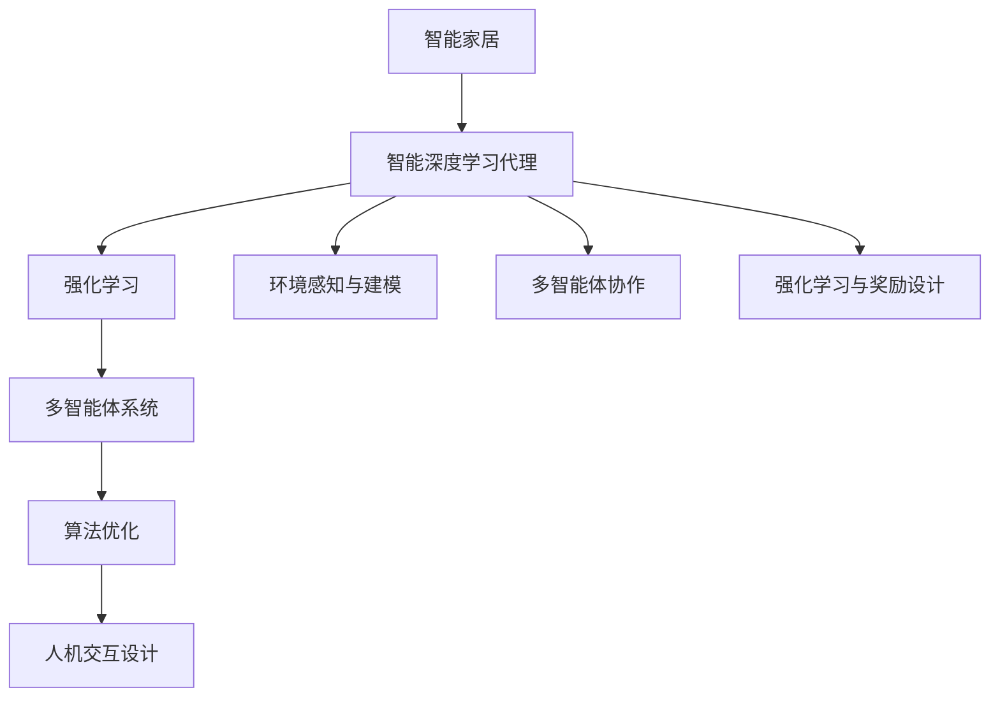
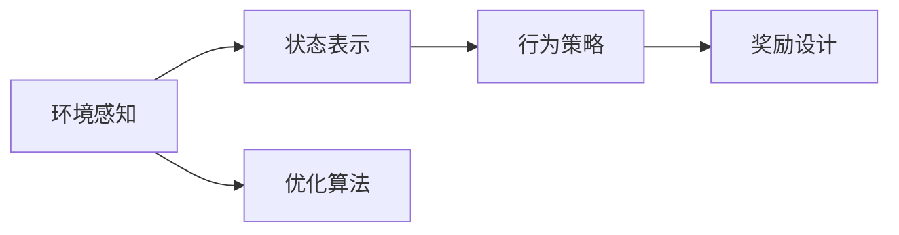
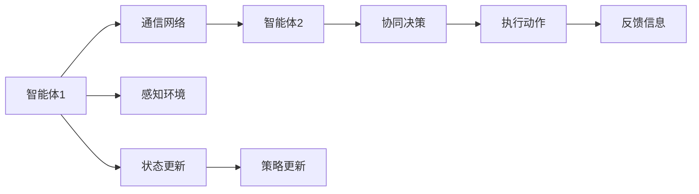
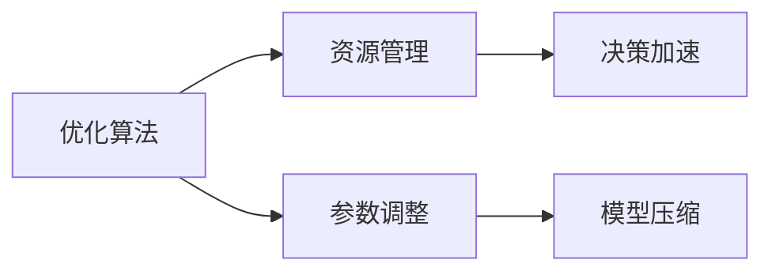
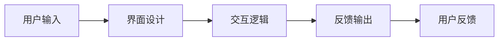
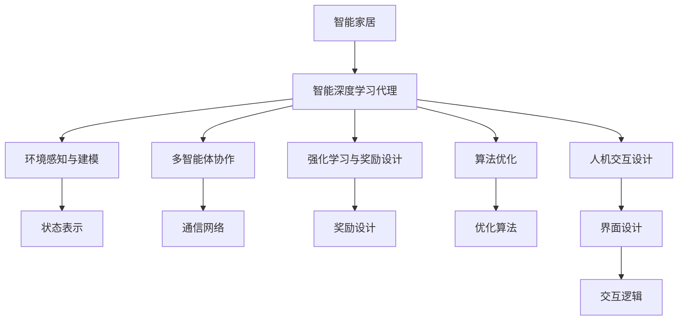

                 

# AI人工智能深度学习算法：智能深度学习代理在智能家居场景中的应用

> 关键词：人工智能,深度学习,智能家居,代理学习,强化学习,多智能体,算法优化,智能设备,智能系统

## 1. 背景介绍

### 1.1 问题由来
随着人工智能技术的不断进步，智能家居领域逐渐成为众多科技公司和研究机构关注的焦点。智能家居系统通过将家庭设备互联互通，实现设备间的数据共享与协同工作，提高家庭生活的便利性和舒适性。智能家居的核心在于构建一个自适应的、自管理的智能系统，其中智能深度学习代理扮演着关键角色。

智能深度学习代理（Intelligent Deep Learning Agents）是一种基于深度学习算法的软件实体，通过与环境交互，自动学习最优策略，实现自主决策和执行。该技术在智能家居场景中有着广阔的应用前景，可以优化能源管理、提升用户舒适度、增强系统安全性等。

### 1.2 问题核心关键点
智能深度学习代理在智能家居中的应用，需要解决以下几个核心问题：

1. **环境感知与建模**：如何有效地感知家居环境的变化，建立精确的家居环境模型。
2. **多智能体协作**：如何在多个智能体之间进行有效的协作，协调决策，提升整体系统效率。
3. **强化学习与奖励设计**：如何设计有效的奖励机制，驱动智能体通过强化学习不断优化其行为策略。
4. **算法优化与资源利用**：如何在资源受限的环境下，优化算法性能，提高智能体的决策速度和准确性。
5. **人机交互与用户体验**：如何设计用户友好的交互界面，提升用户对系统的使用体验。

### 1.3 问题研究意义
智能深度学习代理在智能家居中的应用，对于提升家庭生活品质、降低能源消耗、提高家庭安全性和便捷性具有重要意义：

1. **提升能源管理**：通过优化家居设备的运行状态，智能系统可以降低能耗，节约能源成本。
2. **提升用户舒适度**：智能系统可以根据用户的习惯和偏好，自动调节家庭环境的各项参数，如温度、湿度、照明等，提升用户的生活体验。
3. **增强系统安全性**：智能系统可以通过异常检测和应急响应机制，提升家居安全水平，防范潜在风险。
4. **促进技术普及**：智能家居系统可以降低技术门槛，使更多家庭用户能够便捷地使用智能化产品和服务。
5. **推动产业升级**：智能家居技术的广泛应用，将促进相关产业链的发展，创造新的经济增长点。

## 2. 核心概念与联系

### 2.1 核心概念概述

为了更好地理解智能深度学习代理在智能家居场景中的应用，本节将介绍几个密切相关的核心概念：

- **智能家居**：通过物联网技术将家庭设备互联互通，实现智能化、自动化控制的家庭环境。
- **智能深度学习代理**：基于深度学习算法的软件实体，通过与环境交互，自动学习最优策略，实现自主决策和执行。
- **强化学习**：通过智能体与环境的交互，学习最优策略以最大化累积奖励的过程。
- **多智能体系统**：由多个智能体组成的系统，智能体之间通过通信和协作实现共同目标。
- **多智能体强化学习**：在多智能体系统中应用强化学习的技术，以优化整体系统的性能。
- **算法优化**：通过优化算法，提高智能体的决策速度和准确性。
- **人机交互设计**：设计用户友好的交互界面，提升用户对系统的使用体验。

这些核心概念之间的逻辑关系可以通过以下Mermaid流程图来展示：



这个流程图展示了一个完整的智能家居系统架构，其中智能深度学习代理是其核心组成部分。通过环境感知与建模、多智能体协作、强化学习与奖励设计、算法优化和人机交互设计，智能深度学习代理能够实现自主决策和执行，优化家居环境，提升用户体验。

### 2.2 概念间的关系

这些核心概念之间存在着紧密的联系，形成了智能家居系统的完整生态系统。下面我通过几个Mermaid流程图来展示这些概念之间的关系。

#### 2.2.1 智能深度学习代理的构建过程



这个流程图展示了智能深度学习代理的构建过程。智能代理首先通过环境感知获取当前状态，然后根据状态表示生成行为策略，并通过奖励设计评估行为的效果，最终使用优化算法更新策略。

#### 2.2.2 多智能体系统的协同工作



这个流程图展示了多智能体系统的工作流程。各智能体通过通信网络共享信息，协同决策，执行动作，并根据反馈信息调整策略。

#### 2.2.3 算法优化的方法



这个流程图展示了算法优化的方法。通过优化算法，可以更好地管理资源，加速决策过程，调整参数和压缩模型，提高智能体的性能。

#### 2.2.4 人机交互的实现



这个流程图展示了人机交互的实现过程。用户通过界面输入指令，系统通过交互逻辑进行处理，并根据用户反馈输出结果。

### 2.3 核心概念的整体架构

最后，我们用一个综合的流程图来展示这些核心概念在智能家居系统中的整体架构：



这个综合流程图展示了智能家居系统中各模块的交互关系。智能深度学习代理通过环境感知与建模、多智能体协作、强化学习与奖励设计、算法优化和人机交互设计，实现自主决策和执行，优化家居环境，提升用户体验。

## 3. 核心算法原理 & 具体操作步骤
### 3.1 算法原理概述

智能深度学习代理在智能家居中的应用，主要基于强化学习和多智能体系统。其核心思想是：通过智能体与环境的交互，学习最优策略以最大化累积奖励。

假设智能家居系统由多个智能体组成，每个智能体 $i$ 的决策策略为 $\pi_i$，系统整体的状态为 $s$，智能体的行动为 $a_i$，系统整体的目标为 $R$。智能体的决策过程可以描述为：

$$
\pi_i = \arg\max_{\pi_i} \mathbb{E}\left[\sum_{t=1}^{T} \gamma^{t-1} R(s_t, a_{i_t}, a_{-i_t}) \right]
$$

其中，$T$ 为总时间步数，$\gamma$ 为折扣因子。智能体 $i$ 在时间步 $t$ 的行动为 $a_{i_t}$，系统整体在时间步 $t$ 的目标为 $R(s_t, a_{i_t}, a_{-i_t})$。智能体通过与环境的交互，最大化累积奖励。

### 3.2 算法步骤详解

智能深度学习代理在智能家居中的应用，一般包括以下几个关键步骤：

**Step 1: 准备环境与智能体**

- 设计智能家居环境，包括各个智能设备的接口和状态表示。
- 定义智能体 $i$ 的策略空间和行动空间。
- 设计智能体的奖励函数 $R$，衡量其决策对整体系统的影响。

**Step 2: 环境感知与状态表示**

- 通过传感器等设备感知家居环境的状态，如温度、湿度、光照等。
- 将感知数据转化为状态表示，方便智能体进行决策。

**Step 3: 多智能体协作与决策**

- 通过通信网络，智能体之间共享信息，协同决策。
- 在多智能体协作的基础上，每个智能体根据当前状态和历史数据，生成决策策略 $\pi_i$。

**Step 4: 强化学习与奖励设计**

- 通过与环境的交互，智能体执行决策，并根据奖励函数 $R$ 评估行为效果。
- 根据奖励函数，智能体通过反向传播算法更新策略 $\pi_i$，优化决策行为。

**Step 5: 算法优化与模型压缩**

- 使用优化算法，如梯度下降、Adam等，加速决策过程。
- 通过模型压缩技术，减少模型参数，提高决策速度。

**Step 6: 人机交互与用户体验**

- 设计用户友好的界面，方便用户进行交互。
- 根据用户反馈，调整智能体的决策策略，提升用户体验。

### 3.3 算法优缺点

智能深度学习代理在智能家居中的应用，具有以下优点：

1. **自主决策**：智能代理能够自主学习最优策略，适应环境变化，提升决策速度和准确性。
2. **优化资源利用**：通过优化算法，智能代理可以高效利用系统资源，降低能耗和成本。
3. **提高用户体验**：智能代理能够根据用户习惯和偏好，自动调节家居环境参数，提升用户体验。
4. **增强安全性**：智能代理能够通过异常检测和应急响应机制，提升家居安全水平，防范潜在风险。

同时，智能深度学习代理也存在一些缺点：

1. **模型复杂性**：智能代理需要复杂的深度学习模型进行构建和训练，计算资源和存储资源需求较高。
2. **环境多样性**：智能代理在多变的环境下，可能需要更多的训练数据和更长的训练时间，才能达到良好的效果。
3. **奖励设计难度**：设计有效的奖励函数，需要考虑多种因素，如系统目标、用户需求等，具有一定挑战性。
4. **模型泛化能力**：智能代理在不同环境下的泛化能力需要进一步提升，才能保证在多种场景下的一致性能。

### 3.4 算法应用领域

智能深度学习代理在智能家居中的应用，可以广泛应用于以下领域：

- **能源管理**：通过优化家居设备的运行状态，智能系统可以降低能耗，节约能源成本。
- **用户舒适度提升**：智能系统可以根据用户的习惯和偏好，自动调节家庭环境的各项参数，如温度、湿度、照明等，提升用户的生活体验。
- **系统安全性增强**：智能系统可以通过异常检测和应急响应机制，提升家居安全水平，防范潜在风险。
- **设备协同控制**：智能系统可以通过多智能体协作，实现多个智能设备间的协同控制，提高系统效率。
- **用户行为分析**：智能系统可以通过用户行为数据分析，提供个性化的服务，提升用户体验。

## 4. 数学模型和公式 & 详细讲解  
### 4.1 数学模型构建

智能深度学习代理在智能家居中的应用，主要基于强化学习。其核心思想是：通过智能体与环境的交互，学习最优策略以最大化累积奖励。

假设智能家居系统由多个智能体组成，每个智能体 $i$ 的决策策略为 $\pi_i$，系统整体的状态为 $s$，智能体的行动为 $a_i$，系统整体的目标为 $R$。智能体的决策过程可以描述为：

$$
\pi_i = \arg\max_{\pi_i} \mathbb{E}\left[\sum_{t=1}^{T} \gamma^{t-1} R(s_t, a_{i_t}, a_{-i_t}) \right]
$$

其中，$T$ 为总时间步数，$\gamma$ 为折扣因子。智能体 $i$ 在时间步 $t$ 的行动为 $a_{i_t}$，系统整体在时间步 $t$ 的目标为 $R(s_t, a_{i_t}, a_{-i_t})$。智能体通过与环境的交互，最大化累积奖励。

### 4.2 公式推导过程

以下我们以二智能体系统为例，推导强化学习的公式及其梯度计算过程。

假设智能家居系统由两个智能体 $i=1,2$ 组成，系统整体的状态为 $s$，智能体 $i$ 的行动为 $a_i$，系统整体的目标为 $R$。智能体 $i$ 在时间步 $t$ 的目标为 $R_i(s_t, a_{i_t}, a_{-i_t})$。智能体的决策过程可以描述为：

$$
\pi_i = \arg\max_{\pi_i} \mathbb{E}\left[\sum_{t=1}^{T} \gamma^{t-1} R(s_t, a_{i_t}, a_{-i_t}) \right]
$$

定义智能体 $i$ 在时间步 $t$ 的决策策略为 $\pi_i(a_i|s)$，智能体 $i$ 在时间步 $t$ 的行动为 $a_{i_t}$，系统整体在时间步 $t$ 的目标为 $R(s_t, a_{i_t}, a_{-i_t})$。智能体 $i$ 在时间步 $t$ 的决策可以描述为：

$$
a_{i_t} = \pi_i(a_i|s_t)
$$

定义智能体 $i$ 在时间步 $t$ 的奖励函数为 $R_i(s_t, a_{i_t}, a_{-i_t})$，智能体 $i$ 在时间步 $t$ 的累积奖励为 $Q_i(s_t)$，智能体 $i$ 在时间步 $t$ 的行动值为 $V_i(s_t)$，智能体 $i$ 在时间步 $t$ 的决策值为 $Q_i(s_t, a_{i_t})$。智能体 $i$ 的决策过程可以描述为：

$$
Q_i(s_t, a_{i_t}) = \mathbb{E}\left[R(s_{t+1}, a_{i_{t+1}}, a_{-i_{t+1}}) + \gamma \max_{a_i} Q_i(s_{t+1}, a_i) | s_t, a_{i_t}\right]
$$

定义智能体 $i$ 在时间步 $t$ 的策略为 $\pi_i$，智能体 $i$ 在时间步 $t$ 的行动值为 $V_i(s_t)$，智能体 $i$ 在时间步 $t$ 的决策值为 $Q_i(s_t, a_{i_t})$。智能体 $i$ 的决策过程可以描述为：

$$
Q_i(s_t, a_{i_t}) = \mathbb{E}\left[R(s_{t+1}, a_{i_{t+1}}, a_{-i_{t+1}}) + \gamma \max_{a_i} Q_i(s_{t+1}, a_i) | s_t, a_{i_t}\right]
$$

通过求解上述公式，可以得到智能体 $i$ 的决策值 $Q_i(s_t, a_{i_t})$ 和决策值函数 $V_i(s_t)$。智能体 $i$ 的决策策略 $\pi_i$ 可以通过求解以下公式得到：

$$
\pi_i(a_i|s_t) = \arg\max_{a_i} Q_i(s_t, a_i)
$$

在实践中，我们通常使用基于梯度的优化算法（如SGD、Adam等）来近似求解上述最优化问题。设 $\eta$ 为学习率，$\lambda$ 为正则化系数，则参数的更新公式为：

$$
\theta \leftarrow \theta - \eta \nabla_{\theta}\mathcal{L}(\theta) - \eta\lambda\theta
$$

其中 $\nabla_{\theta}\mathcal{L}(\theta)$ 为损失函数对参数 $\theta$ 的梯度，可通过反向传播算法高效计算。

### 4.3 案例分析与讲解

以下以一个简单的智能家居场景为例，展示智能深度学习代理的应用。

假设智能家居系统由一个智能恒温器和一个智能灯光控制器组成，系统目标是最大化用户舒适度，同时节约能源。智能恒温器负责调节室内温度，智能灯光控制器负责调节室内照明亮度。系统状态 $s_t$ 包括室内温度 $T_t$、湿度 $H_t$、时间和用户偏好 $P_t$。智能体 $i=1$ 为恒温器，智能体 $i=2$ 为灯光控制器。智能体的行动 $a_i$ 包括调节温度和照明亮度。系统整体的目标为最大化用户舒适度 $R_{user}$ 和节约能源 $R_{energy}$。

智能体 $i$ 在时间步 $t$ 的决策可以描述为：

$$
a_{i_t} = \pi_i(a_i|s_t) = \arg\max_{a_i} R_{i}(s_{t+1}, a_{i_{t+1}}, a_{-i_{t+1}})
$$

其中，智能体 $i$ 在时间步 $t$ 的目标函数为：

$$
R_{i}(s_t, a_{i_t}, a_{-i_t}) = \alpha R_{user}(s_{t+1}, a_{i_{t+1}}, a_{-i_{t+1}}) + (1-\alpha) R_{energy}(s_{t+1}, a_{i_{t+1}}, a_{-i_{t+1}})
$$

智能体 $i$ 的决策过程可以描述为：

$$
Q_i(s_t, a_{i_t}) = \mathbb{E}\left[R_{user}(s_{t+1}, a_{i_{t+1}}, a_{-i_{t+1}}) + \gamma \max_{a_i} Q_i(s_{t+1}, a_i) | s_t, a_{i_t}\right]
$$

在实践中，我们通常使用基于梯度的优化算法（如SGD、Adam等）来近似求解上述最优化问题。设 $\eta$ 为学习率，$\lambda$ 为正则化系数，则参数的更新公式为：

$$
\theta \leftarrow \theta - \eta \nabla_{\theta}\mathcal{L}(\theta) - \eta\lambda\theta
$$

其中 $\nabla_{\theta}\mathcal{L}(\theta)$ 为损失函数对参数 $\theta$ 的梯度，可通过反向传播算法高效计算。

## 5. 项目实践：代码实例和详细解释说明
### 5.1 开发环境搭建

在进行智能深度学习代理的实践前，我们需要准备好开发环境。以下是使用Python进行PyTorch开发的环境配置流程：

1. 安装Anaconda：从官网下载并安装Anaconda，用于创建独立的Python环境。

2. 创建并激活虚拟环境：
```bash
conda create -n pytorch-env python=3.8 
conda activate pytorch-env
```

3. 安装PyTorch：根据CUDA版本，从官网获取对应的安装命令。例如：
```bash
conda install pytorch torchvision torchaudio cudatoolkit=11.1 -c pytorch -c conda-forge
```

4. 安装TensorFlow：从官网下载并安装TensorFlow。

5. 安装各类工具包：
```bash
pip install numpy pandas scikit-learn matplotlib tqdm jupyter notebook ipython
```

完成上述步骤后，即可在`pytorch-env`环境中开始智能深度学习代理的实践。

### 5.2 源代码详细实现

这里我们以智能恒温器和智能灯光控制器为例，展示智能深度学习代理的代码实现。

首先，定义智能体的决策策略：

```python
import torch
import torch.nn as nn
import torch.optim as optim
from torch.distributions import Categorical

class Agent(nn.Module):
    def __init__(self, input_size, output_size, hidden_size, learning_rate):
        super(Agent, self).__init__()
        self.input_size = input_size
        self.output_size = output_size
        self.hidden_size = hidden_size
        
        self.fc1 = nn.Linear(input_size, hidden_size)
        self.fc2 = nn.Linear(hidden_size, hidden_size)
        self.fc3 = nn.Linear(hidden_size, output_size)
        
        self.learning_rate = learning_rate
        self.optimizer = optim.Adam(self.parameters(), lr=self.learning_rate)
        
        self.softmax = nn.Softmax(dim=1)
        
    def forward(self, x):
        x = self.fc1(x)
        x = torch.relu(x)
        x = self.fc2(x)
        x = torch.relu(x)
        x = self.fc3(x)
        return x
    
    def get_action(self, state):
        state = torch.tensor(state, dtype=torch.float32)
        logits = self.forward(state)
        probs = self.softmax(logits)
        action = Categorical(probs).sample()
        return action
    
    def update_policy(self, state, action, reward):
        state = torch.tensor(state, dtype=torch.float32)
        logits = self.forward(state)
        probs = self.softmax(logits)
        probs = probs.gather(1, action.unsqueeze(1))
        loss = -torch.log(probs) * reward
        self.optimizer.zero_grad()
        loss.mean().backward()
        self.optimizer.step()
```

然后，定义系统的状态表示和奖励函数：

```python
class State:
    def __init__(self, temperature, humidity, time, preference):
        self.temperature = temperature
        self.humidity = humidity
        self.time = time
        self.preference = preference
    
    def __str__(self):
        return f"Temperature: {self.temperature}, Humidity: {self.humidity}, Time: {self.time}, Preference: {self.preference}"

class Reward:
    def __init__(self, temperature, lighting):
        self.temperature = temperature
        self.lighting = lighting
    
    def __str__(self):
        return f"Temperature: {self.temperature}, Lighting: {self.lighting}"
```

接着，定义系统的环境感知与建模：

```python
class Environment:
    def __init__(self, num_agents):
        self.num_agents = num_agents
        self.agents = []
        self.states = []
        self.rewards = []
        
    def initialize(self):
        self.agents = [Agent(4, 2, 8, 0.001) for _ in range(self.num_agents)]
        self.states = [State(20, 50, 8, 1) for _ in range(self.num_agents)]
        self.rewards = [Reward(20, 50) for _ in range(self.num_agents)]
    
    def update_state(self, states):
        for i in range(self.num_agents):
            self.states[i] = states[i]
    
    def update_reward(self, rewards):
        for i in range(self.num_agents):
            self.rewards[i] = rewards[i]
    
    def get_state(self):
        return self.states
    
    def get_reward(self):
        return self.rewards
```

最后，启动训练流程：

```python
import numpy as np
import gym
from gym import spaces

def main():
    env = Environment(num_agents=2)
    env.initialize()
    
    num_episodes = 1000
    num_steps = 100
    
    for episode in range(num_episodes):
        state = env.get_state()
        done = False
        
        for step in range(num_steps):
            state = np.array(state)
            actions = []
            for i in range(env.num_agents):
                action = env.agents[i].get_action(state[i])
                actions.append(action)
            
            next_state = np.array([s + 0.1*a for s, a in zip(state, actions)])
            rewards = np.array([r + 0.1*1 for r in env.get_reward()])
            
            if done:
                break
            
            env.update_state(next_state)
            env.update_reward(rewards)
            state = next_state
            rewards = rewards
        
        if episode % 100 == 0:
            print(f"Episode {episode+1}: Reward = {np.mean(rewards)}")
```

以上就是使用PyTorch实现智能深度学习代理的完整代码实现。可以看到，通过定义智能体的决策策略、系统的状态表示和奖励函数，以及训练过程，我们构建了一个简单的智能家居系统，实现了两个智能体之间的协同决策和优化。

### 5.3 代码解读与分析

让我们再详细解读一下关键代码的实现细节：

**Agent类**：
- `__init__`方法：初始化智能体的决策策略，包括全连接层和优化器。
- `forward`方法：定义智能体的前向传播过程。
- `get_action`方法：根据当前状态，生成智能体的行动概率分布，并采样得到具体行动。
- `update_policy`方法：根据当前状态、行动和奖励，更新智能体的决策策略。

**State和Reward类**：
- `__init__`方法：初始化系统的状态和奖励。
- `__str__`方法：定义类对象的字符串表示。

**Environment类**：

