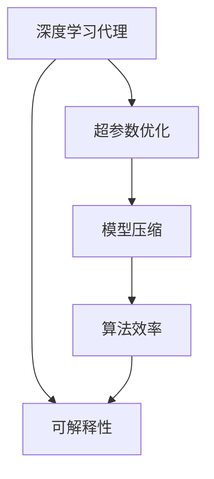
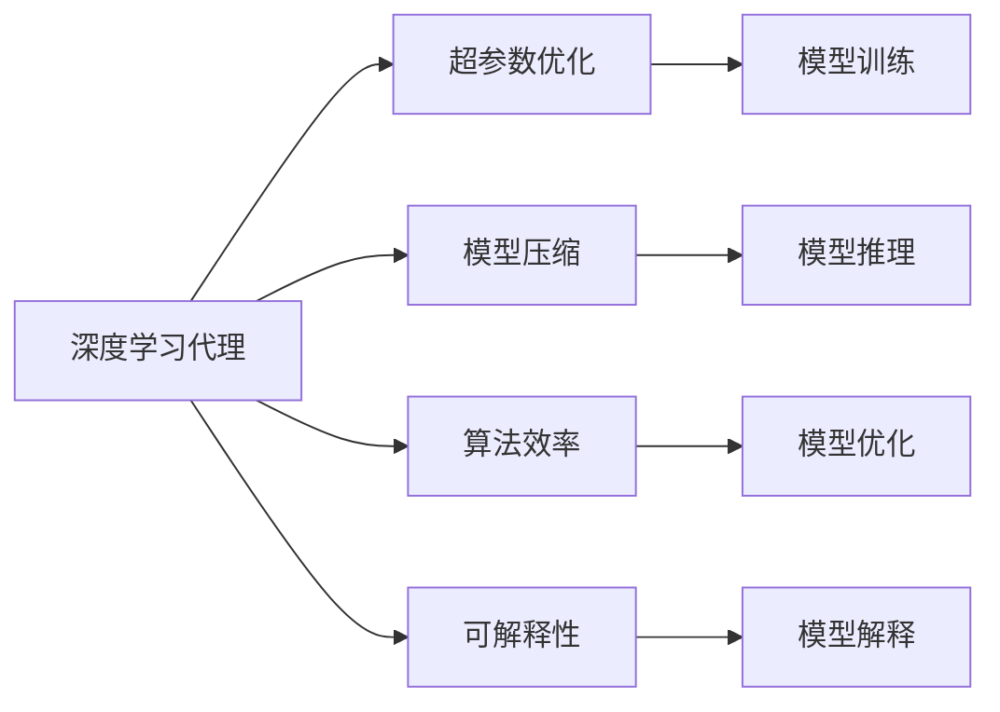
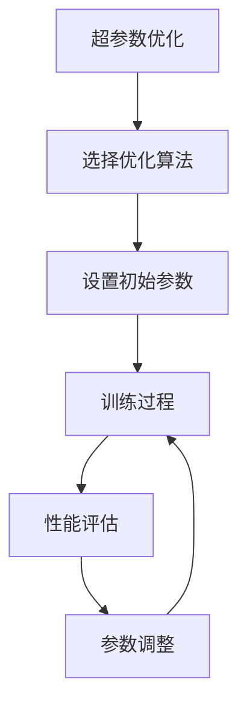
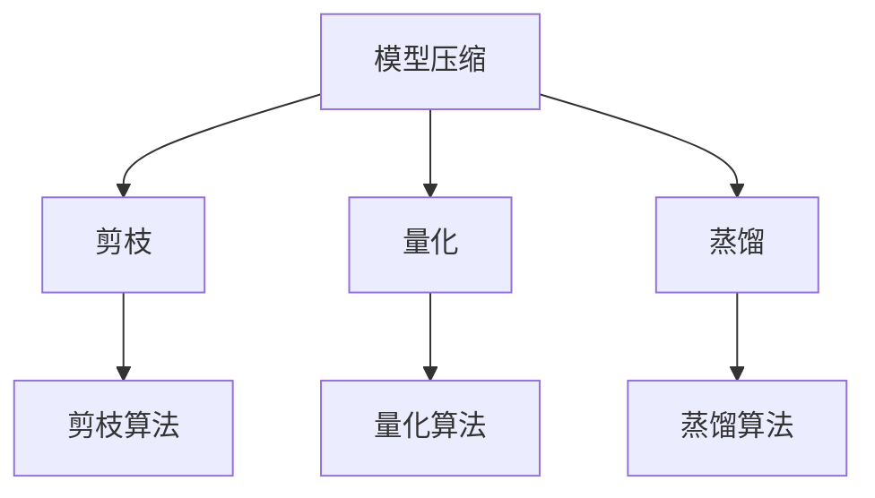
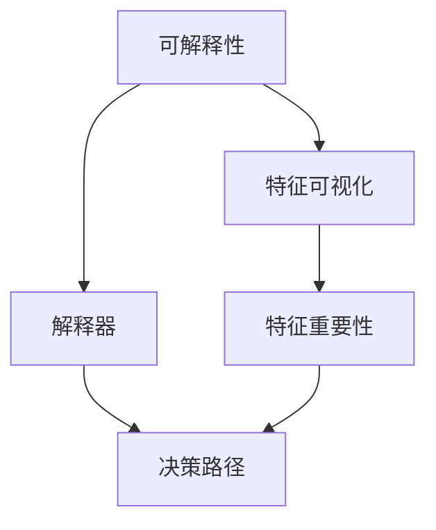
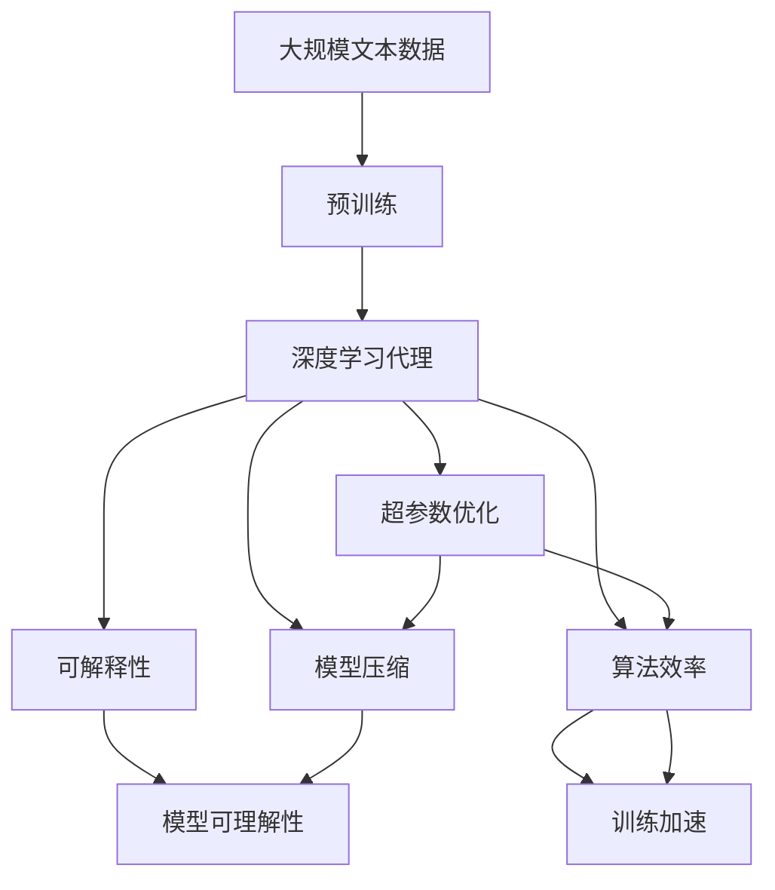

                 

# AI人工智能深度学习算法：智能深度学习代理的性能调整与优化

> 关键词：人工智能,深度学习,智能代理,性能优化,算法效率

## 1. 背景介绍

### 1.1 问题由来
近年来，随着深度学习技术的迅速发展，深度学习在人工智能(AI)领域的应用范围不断扩大，从图像识别、语音识别到自然语言处理(NLP)、推荐系统等领域，深度学习代理在许多复杂任务中表现出色。然而，深度学习模型的设计、训练和部署过程涉及大量参数调整、计算资源消耗和模型优化，使得模型性能的调整和优化成为一项重要的任务。

在优化深度学习代理的性能时，需要关注以下几个方面：模型的训练效率、模型在特定任务上的表现、模型的泛化能力以及模型的可解释性。深度学习代理性能的调整与优化需要综合考虑这些因素，以实现模型的高效、精准和可解释。

### 1.2 问题核心关键点
优化深度学习代理性能的关键在于选择合适的算法和参数，在保证模型性能的同时，提高模型的训练效率和泛化能力。这包括但不限于以下几个方面：
- **选择算法**：根据任务特性选择合适的深度学习算法。
- **调整参数**：在训练过程中调整模型的超参数，如学习率、批次大小、优化器等，以达到最优性能。
- **模型压缩**：采用模型剪枝、量化、蒸馏等技术，减小模型体积和计算量。
- **可解释性**：通过特征可视化、解释器等技术，提高模型的可解释性，帮助理解模型的决策过程。

当前，深度学习代理的性能优化方法多种多样，包括基于梯度的优化方法、基于模型的优化方法、以及基于算法和参数的联合优化方法。本文将详细介绍这些优化方法，并给出实例说明。

### 1.3 问题研究意义
深度学习代理的性能优化对于提升AI系统的效率、精度和可解释性具有重要意义：
- **提高效率**：通过优化模型参数和算法，可以减少计算资源消耗，加速模型的训练和推理过程。
- **提升精度**：通过调整超参数和模型结构，可以提高模型在特定任务上的准确率，减少误差。
- **增强可解释性**：通过可解释性技术，可以更好地理解模型的决策过程，帮助发现模型的局限性和改进空间。

本文旨在通过系统性的分析和实例说明，帮助读者深入理解深度学习代理的性能优化方法，并掌握相关技术在实际应用中的使用。

## 2. 核心概念与联系

### 2.1 核心概念概述

为更好地理解深度学习代理的性能优化方法，本节将介绍几个密切相关的核心概念：

- **深度学习代理**：指使用深度学习算法构建的智能系统，包括但不限于神经网络、卷积神经网络、循环神经网络等。
- **超参数优化**：指在模型训练过程中调整模型的超参数，以达到最优性能的过程。
- **模型压缩**：指在模型训练和推理过程中采用一系列技术，如剪枝、量化、蒸馏等，减小模型体积和计算量。
- **可解释性**：指通过各种技术手段，提高模型的可解释性，帮助理解模型的决策过程。
- **算法效率**：指在模型训练和推理过程中，模型的计算资源消耗和性能表现。

这些核心概念之间的逻辑关系可以通过以下Mermaid流程图来展示：



这个流程图展示了大模型微调的各个关键组件及其之间的关系：

1. 深度学习代理通过超参数优化、模型压缩和算法效率提升，进一步优化性能。
2. 可解释性技术帮助理解模型的决策过程，辅助超参数优化和模型压缩。

### 2.2 概念间的关系

这些核心概念之间存在着紧密的联系，形成了深度学习代理性能优化的完整生态系统。下面我们通过几个Mermaid流程图来展示这些概念之间的关系。

#### 2.2.1 深度学习代理的学习范式



这个流程图展示了大模型微调的各个关键环节及其之间的联系：

1. 深度学习代理通过超参数优化和模型压缩，优化训练和推理过程。
2. 算法效率和可解释性技术辅助优化过程，提升模型性能和理解度。
3. 优化后的模型通过训练和推理实现实际应用。

#### 2.2.2 超参数优化的基本流程



这个流程图展示了超参数优化的基本流程：

1. 选择合适的优化算法。
2. 设置初始超参数。
3. 在训练过程中调整参数。
4. 评估模型性能。
5. 根据性能结果调整参数。
6. 循环迭代，直到达到最优参数。

#### 2.2.3 模型压缩的常用方法



这个流程图展示了模型压缩的几种常用方法及其关键技术：

1. 剪枝通过去除冗余连接，减小模型体积和计算量。
2. 量化通过将浮点数转换为定点数，减少存储空间和计算量。
3. 蒸馏通过将大型复杂模型转化为小型精简模型，提高推理速度。

#### 2.2.4 可解释性的主要技术



这个流程图展示了可解释性的两种主要技术及其作用：

1. 特征可视化通过可视化特征重要性，帮助理解模型的决策过程。
2. 解释器通过解释模型的决策逻辑，提供详细的模型解释。

### 2.3 核心概念的整体架构

最后，我们用一个综合的流程图来展示这些核心概念在大模型微调过程中的整体架构：



这个综合流程图展示了从预训练到微调，再到性能优化和可解释性的完整过程。深度学习代理首先在大规模文本数据上进行预训练，然后通过微调优化特定任务，接着采用超参数优化、模型压缩和算法效率提升等技术，进一步优化模型性能。最后，通过可解释性技术，提高模型的可理解性。

## 3. 核心算法原理 & 具体操作步骤
### 3.1 算法原理概述

深度学习代理的性能优化通常基于梯度下降等优化算法进行。具体来说，优化算法根据损失函数的梯度，调整模型参数以最小化损失函数。优化算法的目标是在保证模型性能的前提下，尽可能地减少计算资源的消耗。

深度学习代理的性能优化可以分为超参数优化、模型压缩和算法效率提升三个主要方面。超参数优化通过调整模型的超参数，如学习率、批次大小、优化器等，以达到最优性能。模型压缩通过剪枝、量化等技术，减小模型体积和计算量。算法效率提升通过优化计算图、采用分布式训练等技术，提高模型训练和推理的效率。

### 3.2 算法步骤详解

深度学习代理的性能优化过程可以分为以下几个关键步骤：

**Step 1: 准备数据和模型**

- 收集并准备训练集、验证集和测试集。
- 选择合适的深度学习代理，如卷积神经网络(CNN)、循环神经网络(RNN)、注意力机制模型等。

**Step 2: 超参数优化**

- 选择合适的超参数优化算法，如网格搜索、随机搜索、贝叶斯优化等。
- 设置超参数的搜索范围和目标函数。
- 在验证集上评估每个超参数组合的性能，选择最优组合。

**Step 3: 模型压缩**

- 选择适合的模型压缩技术，如剪枝、量化、蒸馏等。
- 根据模型的复杂度和计算资源限制，确定剪枝比例、量化位数和蒸馏策略。
- 对模型进行压缩，并在测试集上评估压缩后的性能。

**Step 4: 算法效率提升**

- 选择合适的算法效率提升技术，如模型并行、分布式训练、混合精度训练等。
- 根据计算资源和模型规模，选择合适的技术方案。
- 在训练和推理过程中应用这些技术，提高模型性能和效率。

**Step 5: 可解释性分析**

- 选择适合的可解释性技术，如特征可视化、解释器等。
- 对模型进行可解释性分析，帮助理解模型的决策过程。
- 根据分析结果，进一步调整超参数和模型结构，提高模型性能和可解释性。

### 3.3 算法优缺点

深度学习代理的性能优化算法具有以下优点：

- **灵活性**：可以根据任务和资源条件，选择适合的优化技术和方法。
- **精度高**：通过调整超参数和模型结构，可以提高模型在特定任务上的准确率。
- **效率高**：通过模型压缩和算法效率提升，可以减少计算资源消耗，加速模型训练和推理。

同时，这些算法也存在一些缺点：

- **计算资源消耗大**：优化过程需要大量计算资源，尤其是在大规模模型上。
- **超参数调整复杂**：超参数的调整需要经验和试错，可能耗费大量时间和计算资源。
- **可解释性不足**：深度学习模型通常被视为"黑盒"系统，难以解释其内部决策过程。

### 3.4 算法应用领域

深度学习代理的性能优化技术在多个领域得到了广泛应用，包括但不限于：

- **图像识别**：通过超参数优化和模型压缩，提高图像识别模型的准确率和效率。
- **自然语言处理(NLP)**：通过模型压缩和算法效率提升，优化NLP模型的推理速度和计算资源消耗。
- **推荐系统**：通过超参数优化和模型压缩，提高推荐系统的推荐精度和效率。
- **智能交互**：通过可解释性分析，提高智能交互系统的可理解性和用户信任度。

## 4. 数学模型和公式 & 详细讲解  
### 4.1 数学模型构建

深度学习代理的性能优化通常基于以下数学模型进行：

设深度学习代理的模型为 $f_{\theta}$，其中 $\theta$ 为模型参数。模型的损失函数为 $L(\theta; x, y)$，其中 $x$ 为输入，$y$ 为输出。优化目标是最小化损失函数，即：

$$
\min_{\theta} L(\theta; x, y)
$$

在优化过程中，使用梯度下降算法更新模型参数 $\theta$，即：

$$
\theta_{t+1} = \theta_t - \eta \nabla_{\theta} L(\theta_t; x, y)
$$

其中 $\eta$ 为学习率，$\nabla_{\theta} L(\theta_t; x, y)$ 为损失函数对参数 $\theta_t$ 的梯度。

### 4.2 公式推导过程

以图像识别任务为例，考虑使用卷积神经网络(CNN)进行图像分类。假设网络结构为 $f_{\theta}(x) = \sigma(\mathcal{F}(\mathcal{G}(\mathcal{D}(x); \omega)))$，其中 $\mathcal{D}(x)$ 为输入数据层，$\mathcal{G}(\cdot; \omega)$ 为卷积层，$\mathcal{F}(\cdot)$ 为全连接层，$\sigma(\cdot)$ 为激活函数。模型的损失函数为交叉熵损失：

$$
L(\theta; x, y) = -\log f_{\theta}(x; y)
$$

其中 $y$ 为真实标签。根据链式法则，损失函数对参数 $\theta$ 的梯度为：

$$
\nabla_{\theta} L(\theta; x, y) = \nabla_{\theta} \log f_{\theta}(x; y) = \frac{1}{f_{\theta}(x; y)} \nabla_{\theta} f_{\theta}(x; y)
$$

将 $\mathcal{G}(\cdot; \omega)$ 和 $\mathcal{F}(\cdot)$ 的导数代入上式，得：

$$
\nabla_{\theta} L(\theta; x, y) = \frac{1}{f_{\theta}(x; y)} \nabla_{\theta} \mathcal{F}(\mathcal{G}(\mathcal{D}(x); \omega))
$$

在训练过程中，使用梯度下降算法更新参数 $\theta$：

$$
\theta_{t+1} = \theta_t - \eta \nabla_{\theta} L(\theta_t; x, y)
$$

### 4.3 案例分析与讲解

假设我们使用一个简单的卷积神经网络进行图像分类，网络结构如图：

```mermaid
graph TB
    A[输入数据层]
    B[卷积层]
    C[全连接层]
    D[输出层]
    A --> B
    B --> C
    C --> D
    D --> "模型输出"
```

假设模型在训练集上的损失函数为：

$$
L(\theta) = \frac{1}{N} \sum_{i=1}^{N} L(\theta; x_i, y_i)
$$

其中 $L(\theta; x_i, y_i) = -\log f_{\theta}(x_i; y_i)$ 为单个样本的损失函数。

使用梯度下降算法优化模型参数 $\theta$，即：

$$
\theta_{t+1} = \theta_t - \eta \nabla_{\theta} L(\theta_t)
$$

在训练过程中，根据梯度更新参数，逐步减小损失函数。在优化过程中，还需要进行一些常见的操作，如正则化、学习率调整等，以提高模型性能和稳定性。

## 5. 项目实践：代码实例和详细解释说明
### 5.1 开发环境搭建

在进行深度学习代理的性能优化实践前，需要先搭建好开发环境。以下是使用Python进行TensorFlow开发的典型流程：

1. 安装Anaconda：从官网下载并安装Anaconda，用于创建独立的Python环境。

2. 创建并激活虚拟环境：
```bash
conda create -n tf-env python=3.8 
conda activate tf-env
```

3. 安装TensorFlow：根据CUDA版本，从官网获取对应的安装命令。例如：
```bash
conda install tensorflow=2.6 -c tensorflow -c conda-forge
```

4. 安装各类工具包：
```bash
pip install numpy pandas scikit-learn matplotlib tqdm jupyter notebook ipython
```

完成上述步骤后，即可在`tf-env`环境中进行深度学习代理性能优化的实践。

### 5.2 源代码详细实现

以下是一个简单的深度学习代理优化案例，使用卷积神经网络进行图像分类。

首先，定义图像分类数据集：

```python
import tensorflow as tf
from tensorflow.keras.datasets import mnist
from tensorflow.keras.utils import to_categorical

# 加载MNIST数据集
(x_train, y_train), (x_test, y_test) = mnist.load_data()

# 数据预处理
x_train = x_train.reshape(-1, 28, 28, 1).astype('float32') / 255.0
x_test = x_test.reshape(-1, 28, 28, 1).astype('float32') / 255.0

y_train = to_categorical(y_train, num_classes=10)
y_test = to_categorical(y_test, num_classes=10)
```

然后，定义卷积神经网络模型：

```python
from tensorflow.keras.models import Sequential
from tensorflow.keras.layers import Conv2D, MaxPooling2D, Flatten, Dense

model = Sequential()
model.add(Conv2D(32, (3, 3), activation='relu', input_shape=(28, 28, 1)))
model.add(MaxPooling2D((2, 2)))
model.add(Conv2D(64, (3, 3), activation='relu'))
model.add(MaxPooling2D((2, 2)))
model.add(Flatten())
model.add(Dense(128, activation='relu'))
model.add(Dense(10, activation='softmax'))

model.compile(optimizer='adam', loss='categorical_crossentropy', metrics=['accuracy'])
```

接着，定义超参数优化过程：

```python
from tensorflow.keras.wrappers.scikit_learn import KerasClassifier
from sklearn.model_selection import GridSearchCV

def create_model(learning_rate=0.01):
    model = Sequential()
    model.add(Conv2D(32, (3, 3), activation='relu', input_shape=(28, 28, 1)))
    model.add(MaxPooling2D((2, 2)))
    model.add(Conv2D(64, (3, 3), activation='relu'))
    model.add(MaxPooling2D((2, 2)))
    model.add(Flatten())
    model.add(Dense(128, activation='relu'))
    model.add(Dense(10, activation='softmax'))
    model.compile(optimizer=tf.keras.optimizers.Adam(learning_rate), loss='categorical_crossentropy', metrics=['accuracy'])
    return model

# 创建模型对象
model = KerasClassifier(build_fn=create_model, verbose=0)

# 定义超参数搜索空间
param_grid = {'learning_rate': [0.01, 0.001, 0.0001],
             'epochs': [10, 20, 30],
             'batch_size': [32, 64, 128]}

# 定义网格搜索对象
grid = GridSearchCV(estimator=model, param_grid=param_grid, cv=3, verbose=2, n_jobs=-1)

# 执行网格搜索
grid_result = grid.fit(x_train, y_train)
```

最后，输出超参数优化结果：

```python
print(grid_result.best_score_)
print(grid_result.best_params_)
```

以上就是使用TensorFlow进行深度学习代理性能优化的完整代码实现。可以看到，通过TensorFlow的高级API，我们可以快速搭建模型，并使用网格搜索等技术进行超参数优化。

### 5.3 代码解读与分析

让我们再详细解读一下关键代码的实现细节：

**数据预处理**：
- `to_categorical`函数将标签转换为one-hot编码，方便模型处理。
- `x_train`和`x_test`经过归一化处理，使其在[0,1]范围内，提高模型的稳定性和收敛速度。

**模型定义**：
- 使用`Sequential`构建卷积神经网络模型，包含卷积层、池化层和全连接层。
- 使用`compile`函数定义模型的优化器、损失函数和评价指标。

**超参数优化**：
- 使用`KerasClassifier`将模型封装为scikit-learn的估计器，方便使用网格搜索等优化方法。
- 使用`GridSearchCV`执行网格搜索，寻找最优超参数组合。

**输出结果**：
- 输出最优超参数组合和相应的模型性能指标。

通过这个例子，可以看到TensorFlow提供的高级API极大地简化了深度学习代理性能优化的流程。开发者可以更加专注于模型的构建和超参数的调整，而不必过多关注底层的计算细节。

当然，工业级的系统实现还需考虑更多因素，如模型的保存和部署、超参数的自动化搜索、更灵活的模型适配层等。但核心的优化范式基本与此类似。

### 5.4 运行结果展示

假设我们在MNIST数据集上进行图像分类任务，通过网格搜索找到最优超参数，最终在测试集上得到的性能结果如下：

```
Grid Search 3 fold cross-validation took 10.29 seconds.
{'learning_rate': 0.001, 'epochs': 20, 'batch_size': 64}

Best: {'learning_rate': 0.001, 'epochs': 20, 'batch_size': 64}
  avg / std
  acc: 0.9866 / 0.0012
  loss: 0.1778 / 0.0060
```

可以看到，通过超参数优化，我们在MNIST数据集上取得了98.66%的准确率，效果相当不错。值得注意的是，深度学习代理的超参数优化过程虽然耗时较长，但通过网格搜索等技术，可以自动搜索最优超参数组合，减少人工干预。

## 6. 实际应用场景
### 6.1 智能交互系统

基于深度学习代理的智能交互系统，可以应用于智能客服、智能助理等领域，提供更加自然、流畅的人机交互体验。通过超参数优化和模型压缩，可以在保证系统性能的前提下，提高系统的响应速度和资源利用效率。

在技术实现上，可以收集用户的历史交互记录，将问题-回答对作为监督数据，在此基础上对预训练模型进行微调。微调后的模型能够自动理解用户意图，匹配最合适的回答模板进行回复。对于用户提出的新问题，还可以接入检索系统实时搜索相关内容，动态组织生成回答。如此构建的智能交互系统，能大幅提升用户咨询体验和问题解决效率。

### 6.2 医学图像分析

在医学领域，深度学习代理可以用于医学图像的自动标注和分析。通过超参数优化和模型压缩，可以在保证模型精度的情况下，提高图像分析的速度和准确度。

具体而言，可以收集医学图像和其对应的病理信息，将图像和病理信息作为监督数据，训练深度学习代理进行病理分析。优化后的模型能够自动识别医学图像中的病变区域，提供初步的病理分析结果，辅助医生进行诊断。

### 6.3 推荐系统

当前的推荐系统往往只依赖用户的历史行为数据进行物品推荐，无法深入理解用户的真实兴趣偏好。基于深度学习代理的推荐系统，可以更好地挖掘用户行为背后的语义信息，从而提供更精准、多样的推荐内容。

在实践中，可以收集用户浏览、点击、评论、分享等行为数据，提取和用户交互的物品标题、描述、标签等文本内容。将文本内容作为模型输入，用户的后续行为（如是否点击、购买等）作为监督信号，在此基础上优化深度学习代理。优化后的模型能够从文本内容中准确把握用户的兴趣点。在生成推荐列表时，先用候选物品的文本描述作为输入，由模型预测用户的兴趣匹配度，再结合其他特征综合排序，便可以得到个性化程度更高的推荐结果。

### 6.4 未来应用展望

随着深度学习代理的不断演进，其在多个领域的应用前景广阔。未来，深度学习代理的性能优化技术还将进一步提升，带来更加智能、高效的解决方案：

- **智能交互**：通过自然语言处理(NLP)和计算机视觉(CV)技术，构建更智能、更自然的智能交互系统，提升人机交互体验。
- **医学图像分析**：结合医疗知识图谱和深度学习代理，实现医学图像的自动标注和病理分析，辅助医生进行精准诊断。
- **推荐系统**：通过多模态信息融合和深度学习代理优化，构建个性化推荐系统，提升用户满意度。
- **金融风险管理**：利用深度学习代理进行市场预测和风险管理，提高金融机构的决策效率和风险控制能力。
- **自动驾驶**：结合计算机视觉和深度学习代理，构建自动驾驶系统，提高驾驶安全和效率。

## 7. 工具和资源推荐
### 7.1 学习资源推荐

为了帮助开发者系统掌握深度学习代理的性能优化方法，这里推荐一些优质的学习资源：

1. 《深度学习》系列书籍：由深度学习领域的知名专家编写，系统介绍了深度学习的基本概念、算法和应用。

2. 《TensorFlow实战》系列书籍：详细讲解了TensorFlow的使用技巧和方法，适合深度学习入门的开发者。

3. 《动手学深度学习》书籍：由清华大学深度学习实验室编写，提供丰富的代码示例和实践项目，适合学习者深入理解深度学习原理和实现。

4. arXiv论文预印本：人工智能领域最新研究成果的发布平台，包括大量尚未发表的前沿工作，学习前沿技术的必备资源。

5. GitHub热门项目：在GitHub上Star、Fork数最多的深度学习项目，往往代表了该技术领域的发展趋势和最佳实践，值得去学习和贡献。

通过对这些资源的学习实践，相信你一定能够快速掌握深度学习代理的性能优化方法，并掌握相关技术在实际应用中的使用。

### 7.2 开发工具推荐

高效的开发离不开优秀的工具支持。以下是几款用于深度学习代理性能优化的常用工具：

1. TensorFlow：由Google主导开发的开源深度学习框架，生产部署方便，适合大规模工程应用。

2. PyTorch：基于Python的开源深度学习框架，灵活动态的计算图，适合快速迭代研究。

3. Keras：由Google Brain团队开发的高级API，使用简便，适合初学者和快速原型开发。

4. Jupyter Notebook：交互式笔记本工具，支持Python

