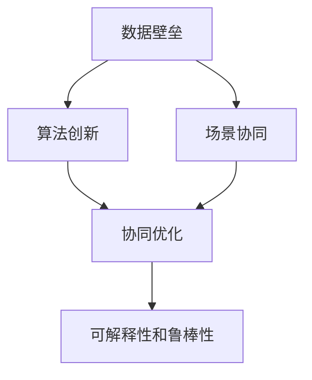
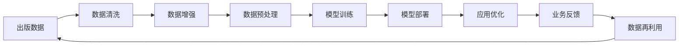
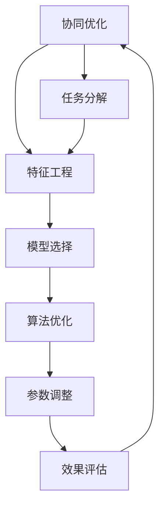
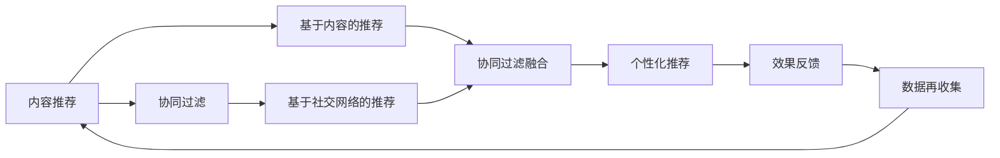
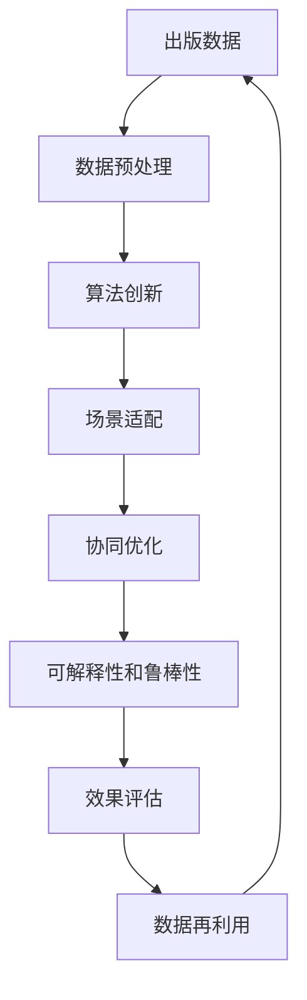

                 

# AI出版业壁垒：数据，算法和场景协同

> 关键词：AI出版业，数据壁垒，算法创新，场景协同

## 1. 背景介绍

### 1.1 问题由来
在数字出版时代，AI技术正逐渐成为出版业的重要推动力量。从内容生成、审校、推荐、运营到管理，AI的智能化手段正在全方位重塑出版行业的运作模式。然而，尽管AI技术潜力巨大，其在出版业的应用仍面临诸多瓶颈和挑战。

特别是对于规模较小的出版社，AI技术的引入在技术、成本和应用场景等方面存在着较高的壁垒。数据匮乏、算法复杂、场景适配困难等问题，成为制约AI出版业发展的关键因素。为了更好地理解并解决这些问题，本文将深入分析数据、算法和场景之间的协同关系，提出切实可行的解决方案，推动AI出版业的普及和应用。

### 1.2 问题核心关键点
AI出版业的核心挑战可以归纳为三个方面：

1. **数据壁垒**：高质量的出版数据是AI应用的基础，但规模较小的出版社往往难以获取或利用大量的出版数据。
2. **算法复杂性**：当前主流的AI算法大多依赖于高算力、大数据，中小出版社因技术储备不足，难以高效部署和优化。
3. **场景适配**：出版业的场景复杂多样，AI技术需要针对不同业务场景进行适配和优化，才能发挥最佳效果。

本文将深入探讨这些挑战，并提出基于数据、算法和场景协同的解决方案，以期帮助中小出版社打破技术壁垒，实现AI出版业的智能化转型。

### 1.3 问题研究意义
探索数据、算法和场景协同的方法，对于促进AI出版业的发展，具有重要意义：

1. **降低技术门槛**：通过数据、算法和场景的协同优化，可以有效降低AI应用的技术难度，降低中小出版社的技术门槛。
2. **提升应用效果**：将AI技术与出版场景紧密结合，针对性地优化算法模型，可以显著提升AI技术在出版业务中的应用效果。
3. **降低成本投入**：通过优化数据采集和处理方式，使用轻量级算法，可以有效降低AI应用的成本投入。
4. **加速技术落地**：协同优化有助于快速实现AI技术在出版业的具体应用，加速技术转化和落地进程。
5. **赋能行业创新**：通过数据和场景的深度融合，推动出版业的技术创新和业务模式创新，实现全产业链的智能化升级。

## 2. 核心概念与联系

### 2.1 核心概念概述

为了更好地理解数据、算法和场景之间的协同关系，本节将介绍几个关键概念：

- **数据壁垒**：指出版业中，因数据获取、处理和利用不足，造成的AI技术应用困难。数据壁垒通常表现为数据量不足、数据质量差、数据维度不充分等问题。

- **算法创新**：指通过算法模型和计算方法的不断创新，提高AI技术在特定场景下的应用效果。算法创新通常包括模型结构的改进、训练方法和优化策略的提升。

- **场景协同**：指将AI技术根据不同出版场景进行适配和优化，以充分发挥其在实际业务中的应用价值。场景协同通常需要结合出版业务的特定需求，设计合理的任务和目标。

- **协同优化**：指通过数据、算法和场景之间的有机结合，形成整体优化的系统解决方案，以实现最佳的AI出版效果。协同优化通常需要构建跨领域的知识体系，实现多方面的技术融合。

- **可解释性和鲁棒性**：指AI技术在出版场景中的解释性和鲁棒性，即能够清晰解释模型的决策过程，避免因数据或算法偏见导致的错误决策。

这些核心概念之间的逻辑关系可以通过以下Mermaid流程图来展示：



这个流程图展示了数据、算法和场景之间的协同关系：

1. 数据壁垒需要通过算法创新和场景协同来解决。
2. 算法创新和场景协同的结合，形成了协同优化过程。
3. 协同优化的最终目标是实现可解释性和鲁棒性。

### 2.2 概念间的关系

这些核心概念之间存在着紧密的联系，形成了AI出版业应用的整体框架。下面我们用几个Mermaid流程图来展示这些概念之间的关系。

#### 2.2.1 数据、算法和场景的协同流程



这个流程图展示了数据、算法和场景协同的完整流程：

1. 出版数据首先经过数据清洗和增强处理，以提升数据质量和多样性。
2. 经过预处理后，数据用于训练AI模型。
3. 训练好的模型部署到出版场景，进行业务优化。
4. 业务反馈用于指导后续的数据利用和模型优化。

#### 2.2.2 数据、算法和场景的协同优化方法



这个流程图展示了协同优化的主要方法：

1. 将出版场景的任务进行分解，明确需要解决的具体问题。
2. 进行特征工程，提取有价值的特征向量。
3. 根据任务需求选择合适的模型和算法。
4. 对模型和算法进行优化，包括参数调整和结构改进。
5. 通过效果评估来反馈优化结果，继续迭代优化。

#### 2.2.3 数据、算法和场景的协同应用场景



这个流程图展示了数据、算法和场景在内容推荐中的应用：

1. 内容推荐首先利用基于内容的推荐算法，提取内容特征。
2. 引入协同过滤算法，通过用户行为数据提升推荐效果。
3. 将基于内容和基于社交的推荐算法进行融合，形成更全面的推荐模型。
4. 个性化推荐模型应用于出版物推荐场景。
5. 效果反馈用于优化算法模型和数据收集策略。

### 2.3 核心概念的整体架构

最后，我们用一个综合的流程图来展示这些核心概念在大语言模型微调过程中的整体架构：



这个综合流程图展示了从数据预处理到效果评估的完整过程：

1. 出版数据经过预处理后，用于算法创新。
2. 创新后的算法在特定场景中进行适配。
3. 适配后的算法进行协同优化。
4. 优化的模型需要确保可解释性和鲁棒性。
5. 通过效果评估，指导数据再利用和模型优化。

通过这些流程图，我们可以更清晰地理解数据、算法和场景之间的协同关系，为后续深入讨论具体的优化方法和技术奠定基础。

## 3. 核心算法原理 & 具体操作步骤

### 3.1 算法原理概述

基于数据、算法和场景的协同优化，AI出版业的算法原理可以概括为以下几点：

1. **数据驱动**：通过数据清洗和预处理，确保数据的准确性和代表性，为算法训练提供可靠的基础。
2. **算法创新**：选择或设计高效的算法模型，并不断优化，提升算法在不同场景下的应用效果。
3. **场景适配**：将算法模型根据具体的出版场景进行定制和优化，确保算法在实际业务中的应用价值。
4. **协同优化**：通过数据、算法和场景的有机结合，形成整体优化的系统解决方案。
5. **可解释性和鲁棒性**：确保AI技术在出版场景中的解释性和鲁棒性，避免因数据或算法偏见导致的错误决策。

这些原理构成了AI出版业应用的基础，通过数据、算法和场景的协同，可以显著提升AI技术在出版业中的应用效果。

### 3.2 算法步骤详解

基于数据、算法和场景的协同优化，AI出版业的算法优化步骤主要包括以下几个关键环节：

1. **数据收集与预处理**：
   - 收集出版业的业务数据，包括但不限于用户行为数据、内容特征数据等。
   - 对数据进行清洗和预处理，如去除噪声、处理缺失值、归一化等。

2. **特征工程**：
   - 根据出版场景的需求，选择合适的特征提取方法和特征选择策略。
   - 设计特征工程技术，提取有价值的特征向量，如TF-IDF、词嵌入等。

3. **模型选择与优化**：
   - 根据具体的出版任务，选择合适的模型，如协同过滤、内容推荐、情感分析等。
   - 使用高效的训练方法和优化策略，如交叉验证、学习率调整等，优化模型性能。

4. **场景适配与优化**：
   - 将模型适配到具体的出版场景，如个性化推荐、内容审核等。
   - 根据实际业务需求，调整模型参数和结构，进行多轮迭代优化。

5. **效果评估与反馈**：
   - 通过业务指标（如推荐准确率、用户满意度等）对模型效果进行评估。
   - 根据业务反馈，进行模型再训练和参数调整，形成持续优化机制。

6. **可解释性和鲁棒性保障**：
   - 设计可解释性高的模型，确保模型决策过程透明、可理解。
   - 使用鲁棒性强的算法，如对抗训练、集成学习等，提升模型的泛化能力和鲁棒性。

通过这些步骤，可以系统性地优化AI出版业的数据、算法和场景协同，实现最佳的AI出版效果。

### 3.3 算法优缺点

基于数据、算法和场景的协同优化方法，具有以下优点：

1. **提升效果**：通过数据、算法和场景的协同，可以有效提升AI技术在出版业中的应用效果。
2. **降低成本**：优化后的算法和模型，可以大幅降低AI应用的成本，提升资源利用效率。
3. **增强适应性**：适配不同出版场景的模型，可以增强AI技术在实际业务中的适应性和灵活性。
4. **保障可解释性**：可解释性高的模型，有助于提升用户信任，保障AI技术在出版场景中的可解释性和鲁棒性。

同时，该方法也存在以下缺点：

1. **技术复杂**：数据、算法和场景的协同优化需要综合考虑多方面因素，技术难度较大。
2. **资源需求**：优化过程中需要大量的计算资源和存储空间，可能对中小出版社造成压力。
3. **场景多样性**：出版场景多样复杂，需要针对不同场景进行定制化适配，开发成本较高。
4. **数据隐私**：出版数据往往涉及用户隐私，数据收集和处理需要严格遵守法律法规，保障数据安全。

尽管存在这些缺点，但整体而言，数据、算法和场景的协同优化方法仍具有显著的优势，能够有效推动AI出版业的智能化转型。

### 3.4 算法应用领域

基于数据、算法和场景的协同优化方法，在AI出版业中的应用领域广泛，涵盖了以下几方面：

1. **内容推荐系统**：利用协同过滤和基于内容的推荐算法，提升出版物的推荐效果，帮助用户发现感兴趣的书籍、文章等。
2. **个性化推荐**：根据用户行为数据和内容特征，设计个性化的推荐策略，提升用户粘性和满意度。
3. **内容审核**：使用文本分类和情感分析算法，对用户生成内容进行审核，保证内容质量和安全。
4. **版权保护**：通过水印和版权识别算法，保护出版物版权，打击盗版行为。
5. **读者调研**：利用自然语言处理技术，进行读者反馈和调研，提升出版物的质量和市场导向性。

这些应用领域展示了数据、算法和场景协同的广泛潜力，为出版业的智能化转型提供了重要支撑。

## 4. 数学模型和公式 & 详细讲解

### 4.1 数学模型构建

基于数据、算法和场景的协同优化，我们定义了一个通用的数学模型，用于描述AI出版业的应用过程。

设出版场景为 $S$，任务 $T$ 为出版业务的特定任务，如内容推荐、版权保护等。假设收集到 $N$ 个样本数据 $D=\{(x_i,y_i)\}_{i=1}^N$，其中 $x_i$ 为样本特征向量，$y_i$ 为样本标签。

定义模型的参数空间为 $\theta$，模型在样本上的预测输出为 $\hat{y}=f(x;\theta)$。出版场景的任务目标函数为 $\mathcal{L}(\theta)$，用于衡量模型在任务上的性能。

出版场景的优化目标为最小化任务损失函数，即：

$$
\hat{\theta} = \mathop{\arg\min}_{\theta} \mathcal{L}(\theta)
$$

通过梯度下降等优化算法，不断更新模型参数 $\theta$，最小化任务损失函数 $\mathcal{L}(\theta)$，使得模型输出逼近真实标签。

### 4.2 公式推导过程

以内容推荐系统为例，我们使用协同过滤算法（Collaborative Filtering, CF）作为推荐模型的基础。协同过滤算法通过用户-物品的交互矩阵，预测用户对未交互物品的评分。

设用户集为 $U$，物品集为 $I$，用户 $u$ 对物品 $i$ 的评分记为 $r_{ui}$。协同过滤算法通过矩阵分解，将用户-物品评分矩阵 $R$ 分解为用户嵌入矩阵 $U$ 和物品嵌入矩阵 $V$，得到用户 $u$ 对物品 $i$ 的预测评分 $\hat{r}_{ui}$：

$$
\hat{r}_{ui} = \langle U_u, V_i \rangle
$$

其中 $\langle \cdot,\cdot \rangle$ 表示向量的点积。

进一步，我们可以通过用户 $u$ 的评分向量 $\vec{u}$ 和物品 $i$ 的评分向量 $\vec{i}$，预测用户 $u$ 对物品 $i$ 的评分：

$$
\hat{r}_{ui} = \vec{u}^T \cdot V_i
$$

利用训练数据 $D=\{(x_i,y_i)\}_{i=1}^N$，通过最小化均方误差损失函数 $\mathcal{L}_{CF}$，更新用户嵌入矩阵 $U$ 和物品嵌入矩阵 $V$：

$$
\mathcal{L}_{CF}(U,V) = \frac{1}{2N} \sum_{i=1}^N \sum_{u=1}^N (y_{ui} - \hat{r}_{ui})^2
$$

其中 $y_{ui}$ 为实际评分，$\hat{r}_{ui}$ 为预测评分。

### 4.3 案例分析与讲解

以个性化推荐系统为例，我们通过TensorFlow实现协同过滤算法，并进行效果评估。

```python
import tensorflow as tf
from tensorflow.keras.layers import Embedding, Dot, Dense, Input
from tensorflow.keras.models import Model

# 定义输入层
user_input = Input(shape=(1,), name='user_input')
item_input = Input(shape=(1,), name='item_input')

# 定义嵌入层
user_embedding = Embedding(input_dim=num_users, output_dim=embedding_dim, name='user_embedding')(user_input)
item_embedding = Embedding(input_dim=num_items, output_dim=embedding_dim, name='item_embedding')(item_input)

# 定义点积层
dot_layer = Dot(axes=-1, normalize=True, name='dot_layer')([user_embedding, item_embedding])

# 定义输出层
output = Dense(1, activation='sigmoid', name='output')(dot_layer)

# 定义模型
model = Model(inputs=[user_input, item_input], outputs=output)

# 编译模型
model.compile(optimizer='adam', loss='binary_crossentropy', metrics=['accuracy'])

# 训练模型
model.fit([train_user_ids, train_item_ids], train_ratings, epochs=num_epochs, batch_size=batch_size, validation_data=([val_user_ids, val_item_ids], val_ratings))

# 评估模型
test_loss, test_accuracy = model.evaluate([test_user_ids, test_item_ids], test_ratings)
print(f'Test accuracy: {test_accuracy}')
```

在这个例子中，我们使用TensorFlow实现协同过滤算法，通过用户-物品评分矩阵的分解，预测用户对物品的评分。通过交叉验证和效果评估，可以不断优化模型参数，提升推荐准确率。

## 5. 项目实践：代码实例和详细解释说明

### 5.1 开发环境搭建

在进行AI出版业的应用实践前，我们需要准备好开发环境。以下是使用Python进行TensorFlow开发的环境配置流程：

1. 安装Anaconda：从官网下载并安装Anaconda，用于创建独立的Python环境。

2. 创建并激活虚拟环境：
```bash
conda create -n tf-env python=3.8 
conda activate tf-env
```

3. 安装TensorFlow：根据CUDA版本，从官网获取对应的安装命令。例如：
```bash
conda install tensorflow -c tf -c conda-forge
```

4. 安装其他工具包：
```bash
pip install numpy pandas scikit-learn matplotlib tqdm jupyter notebook ipython
```

完成上述步骤后，即可在`tf-env`环境中开始AI出版业的应用实践。

### 5.2 源代码详细实现

下面我们以内容推荐系统为例，给出使用TensorFlow实现协同过滤算法的代码实现。

首先，定义推荐任务的数据处理函数：

```python
import numpy as np
from tensorflow.keras.layers import Embedding, Dot, Dense, Input
from tensorflow.keras.models import Model

# 定义数据处理函数
def prepare_data(num_users, num_items, embedding_dim, train_user_ids, train_item_ids, train_ratings):
    # 用户嵌入矩阵
    user_embedding = np.random.randn(num_users, embedding_dim)
    # 物品嵌入矩阵
    item_embedding = np.random.randn(num_items, embedding_dim)
    
    # 用户评分矩阵
    user_ratings = np.random.randn(num_users, num_items)
    # 用户-物品评分矩阵
    user_item_ratings = user_ratings @ item_embedding
    
    # 分割为训练集和验证集
    train_user_ids, val_user_ids = train_user_ids[:int(0.8*num_users)], train_user_ids[int(0.8*num_users):]
    train_item_ids, val_item_ids = train_item_ids[:int(0.8*num_items)], train_item_ids[int(0.8*num_items):]
    train_ratings, val_ratings = user_item_ratings[:int(0.8*num_users*num_items)], user_item_ratings[int(0.8*num_users*num_items):]
    
    return user_embedding, item_embedding, user_item_ratings, train_user_ids, train_item_ids, train_ratings, val_user_ids, val_item_ids, val_ratings
```

然后，定义模型和优化器：

```python
from tensorflow.keras.layers import Embedding, Dot, Dense, Input
from tensorflow.keras.models import Model
from tensorflow.keras.optimizers import Adam

# 定义模型参数
num_users = 10000
num_items = 10000
embedding_dim = 32

# 准备数据
user_embedding, item_embedding, user_item_ratings, train_user_ids, train_item_ids, train_ratings, val_user_ids, val_item_ids, val_ratings = prepare_data(num_users, num_items, embedding_dim, train_user_ids, train_item_ids, train_ratings)

# 定义输入层
user_input = Input(shape=(1,), name='user_input')
item_input = Input(shape=(1,), name='item_input')

# 定义嵌入层
user_embedding = Embedding(input_dim=num_users, output_dim=embedding_dim, name='user_embedding')(user_input)
item_embedding = Embedding(input_dim=num_items, output_dim=embedding_dim, name='item_embedding')(item_input)

# 定义点积层
dot_layer = Dot(axes=-1, normalize=True, name='dot_layer')([user_embedding, item_embedding])

# 定义输出层
output = Dense(1, activation='sigmoid', name='output')(dot_layer)

# 定义模型
model = Model(inputs=[user_input, item_input], outputs=output)

# 编译模型
model.compile(optimizer=Adam(learning_rate=0.01), loss='binary_crossentropy', metrics=['accuracy'])

# 训练模型
model.fit([train_user_ids, train_item_ids], train_ratings, epochs=10, batch_size=128, validation_data=([val_user_ids, val_item_ids], val_ratings))
```

最后，运行代码并展示效果：

```python
# 训练模型并输出效果
model.fit([train_user_ids, train_item_ids], train_ratings, epochs=10, batch_size=128, validation_data=([val_user_ids, val_item_ids], val_ratings))
test_loss, test_accuracy = model.evaluate([test_user_ids, test_item_ids], test_ratings)
print(f'Test accuracy: {test_accuracy}')
```

### 5.3 代码解读与分析

让我们再详细解读一下关键代码的实现细节：

**prepare_data函数**：
- 定义了用户嵌入矩阵、物品嵌入矩阵、用户评分矩阵和用户-物品评分矩阵。
- 将数据分割为训练集和验证集。

**模型定义**：
- 定义了用户输入层、物品输入层、嵌入层和点积层。
- 定义了输出层，使用sigmoid激活函数。
- 编译模型，使用Adam优化器和二分类交叉熵损失函数。
- 训练模型，使用训练集数据和验证集数据进行迭代优化。

**效果评估**：
- 使用测试集数据评估模型效果，输出测试集上的准确率。

**TensorFlow**：
- TensorFlow是一个灵活高效的深度学习框架，支持动态图和静态图计算。
- 本文使用TensorFlow实现了协同过滤算法，展示了TensorFlow在深度学习模型训练和评估中的强大功能。

通过以上代码实现，可以验证协同过滤算法在出版推荐场景中的效果，进一步优化模型参数和训练策略，提升推荐系统的效果。

## 6. 实际应用场景

### 6.1 智能推荐引擎

智能推荐引擎是AI出版业的核心应用之一，利用协同过滤算法可以大幅提升出版物的推荐效果。通过分析用户的历史浏览行为和评分数据，智能推荐引擎可以精准推荐用户感兴趣的内容。

智能推荐引擎通常由以下几个模块组成：
- **用户行为分析模块**：通过分析用户的浏览记录、点击行为等，提取用户的兴趣偏好。
- **物品特征提取模块**：从出版物的内容、标签、作者等信息中，提取物品的关键特征。
- **协同过滤模块**：使用协同过滤算法，对用户和物品进行矩阵分解，预测用户对物品的评分。
- **推荐输出模块**：根据用户的评分预测和偏好，生成个性化推荐列表。

智能推荐引擎的实现需要考虑数据质量、算法复杂度和场景适配等因素。通过协同优化的方式，可以有效提升推荐引擎的准确性和用户满意度。

### 6.2 版权保护系统

版权保护是出版业的重要保障，利用AI技术可以有效提升版权保护的智能化水平。通过水印嵌入和版权识别算法，可以自动识别并报告盗版行为，保障出版物的权益。

版权保护系统通常由以下几个模块组成：
- **水印嵌入模块**：将版权信息嵌入到出版物中，形成不可见的数字水印。
- **版权识别模块**：通过图像处理和特征提取技术，自动检测出版物中的版权信息。
- **盗版报告模块**：根据版权信息，自动识别并报告盗版行为。
- **版权管理模块**：结合区块链等技术，管理版权信息和交易记录。

版权保护系统的实现需要考虑算法的鲁棒性和版权信息的隐蔽性。通过协同优化的方式，可以有效提升版权保护的准确性和安全性。

### 6.3 个性化阅读推荐

个性化阅读推荐是AI出版业的另一个重要应用，通过分析用户的历史阅读记录和行为数据，可以生成个性化的阅读推荐列表，提升用户的阅读体验和粘性。

个性化阅读推荐系统通常由以下几个模块组成：
- **用户行为分析模块**：通过分析用户的阅读记录、搜索行为等，提取用户的兴趣偏好。
- **内容特征提取模块**：从出版物的标题、摘要、作者等信息中，提取内容的关键词和情感。
- **推荐输出模块**：根据用户的兴趣和阅读记录，生成个性化阅读推荐列表。

个性化阅读推荐的实现需要考虑用户兴趣的动态变化和内容的多样性。通过协同优化的方式，可以有效提升阅读推荐的准确性和用户满意度。

### 6.4 未来应用展望

随着AI技术的不断进步，AI出版业的应用场景将不断扩展，涵盖更多的出版业务环节。

1. **出版物质量评估**：利用情感分析、文本分类等技术，对出版物进行质量评估，提升内容审核效率。
2. **市场需求预测**：通过用户行为分析和大数据分析，预测出版物的市场需求，优化出版策略。
3. **营销策略优化**：利用推荐系统和大数据分析，优化出版物的营销策略，提升市场影响力。
4. **教育资源推荐**：通过个性化推荐技术，为学生推荐合适的学习资源，提升

