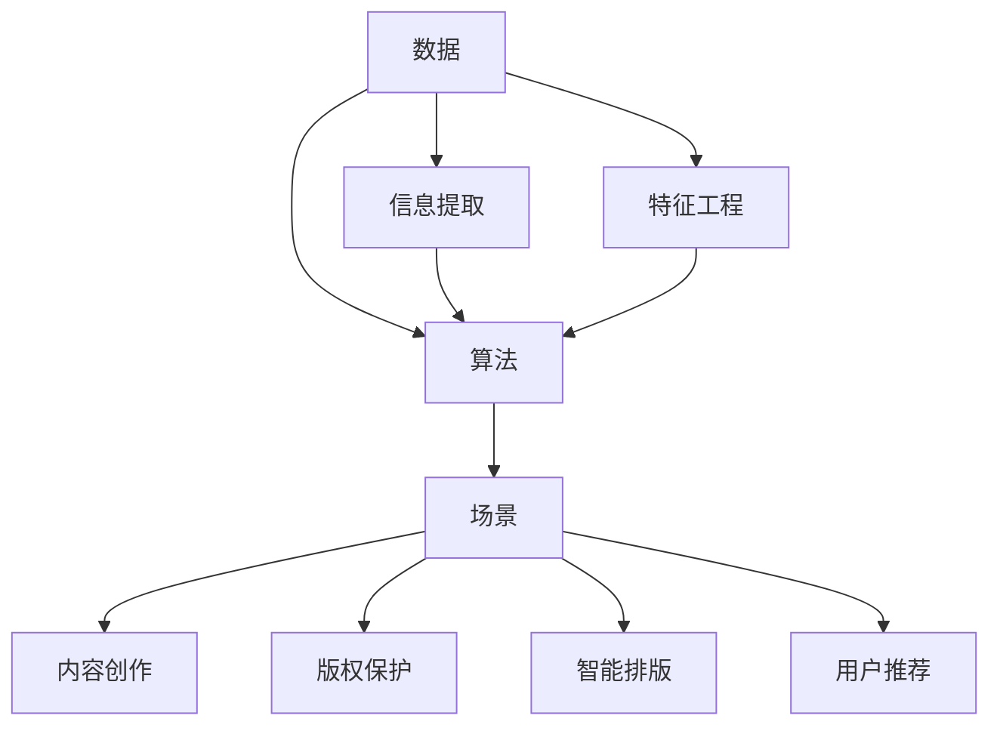

                 

# AI出版业：数据，算法与场景的结合艺术

> 关键词：AI出版, 数据驱动, 深度学习, 自然语言处理(NLP), 推荐系统, 版权保护, 智能排版

## 1. 背景介绍

### 1.1 问题由来

随着数字时代的到来，出版业正在经历前所未有的变革。传统纸质出版已经逐渐被电子书、在线阅读、有声读物等多种新型出版方式所取代。数字化、信息化、个性化成为出版业新的趋势。人工智能技术，尤其是深度学习、自然语言处理(NLP)和推荐系统等前沿技术，正在被广泛应用到出版业的各个环节，为出版业带来了新的机遇与挑战。

本书将深入探讨人工智能技术在出版业的应用，特别是在数据驱动、算法优化、场景适配三个维度上的结合艺术，致力于为出版从业者提供前沿理论与实践指导。

## 2. 核心概念与联系

### 2.1 核心概念概述

1. **AI出版**：利用人工智能技术，从内容创作、版权保护、智能排版到用户推荐，全面提升出版效率和用户体验的过程。
2. **数据驱动**：以大数据为支撑，通过深度学习、NLP等技术，优化出版流程，提升内容创作和版权保护水平。
3. **深度学习**：基于大量标注数据，通过多层神经网络学习复杂特征，实现图像、文本、音频等多种类型数据的自动处理。
4. **自然语言处理(NLP)**：使计算机能够理解、处理和生成自然语言，包括文本分类、情感分析、文本生成等应用。
5. **推荐系统**：根据用户历史行为和兴趣，自动推荐合适的内容，提升用户体验和用户黏性。
6. **版权保护**：通过技术手段保护内容版权，包括水印嵌入、版权声明生成、抄袭检测等。
7. **智能排版**：通过算法优化，自动调整出版物的版面布局，提升出版效率和美观度。

### 2.2 概念间的关系

以上概念通过数据、算法、场景三者结合，形成了AI出版的完整体系。具体来说：

- **数据**是基础，提供智能化决策所需的信息支持；
- **算法**是核心，通过深度学习和NLP等技术，实现数据的自动处理和分析；
- **场景**是应用，在具体的出版过程中，通过算法优化，提升用户体验和运营效率。

这些概念相互关联，共同构成了AI出版的技术框架。下图展示了数据、算法和场景三者的关系：



## 3. 核心算法原理 & 具体操作步骤

### 3.1 算法原理概述

AI出版的核心算法包括深度学习、NLP、推荐系统和版权保护技术。这些算法通过数据驱动，结合具体的出版场景，实现了内容创作、版权保护、智能排版和用户推荐等功能。

### 3.2 算法步骤详解

AI出版的算法步骤通常包括以下几个关键步骤：

1. **数据预处理**：对原始数据进行清洗、特征提取、标注等预处理操作，确保数据的质量和格式。
2. **模型训练**：选择适当的深度学习模型，如卷积神经网络(CNN)、循环神经网络(RNN)、Transformer等，在标注数据上进行训练。
3. **模型优化**：通过调参、正则化、对抗训练等技术，优化模型的性能。
4. **场景适配**：将训练好的模型应用于具体的出版场景，如智能排版、内容推荐等，实现算法与场景的深度结合。
5. **效果评估**：通过A/B测试、用户反馈等手段，评估算法的实际效果，持续优化。

### 3.3 算法优缺点

AI出版的算法优点包括：

- **效率提升**：通过自动化技术，大幅提升出版效率，减少人力成本。
- **质量优化**：深度学习等技术能够自动发现并修正数据中的错误，提升内容的准确性和一致性。
- **用户适配**：推荐系统和智能排版等技术，能够根据用户需求和行为，提供个性化服务。

但同时也存在一些缺点：

- **数据依赖**：算法的性能高度依赖于数据的质量和数量，数据获取和标注成本较高。
- **模型复杂**：深度学习模型参数量大，训练复杂，需要高性能硬件支持。
- **场景适配难度大**：不同的出版场景具有特殊需求，算法需要针对性地设计和优化。
- **版权问题**：版权保护技术需要不断更新，防止侵权和盗版，增加技术维护成本。

### 3.4 算法应用领域

AI出版技术广泛应用于以下领域：

1. **内容创作**：利用深度学习和NLP技术，自动生成文章、摘要、标题等，提升创作效率和质量。
2. **版权保护**：通过水印嵌入、数字指纹等技术，保护内容版权，防止盗版和侵权。
3. **用户推荐**：根据用户行为和兴趣，推荐合适的内容，提升用户阅读体验。
4. **智能排版**：通过算法优化，自动调整版面布局，提升出版物的美观度和易读性。
5. **版权声明生成**：自动生成版权声明，提升版权保护力度。

## 4. 数学模型和公式 & 详细讲解 & 举例说明

### 4.1 数学模型构建

#### 4.1.1 深度学习模型

深度学习模型通常包括卷积神经网络(CNN)、循环神经网络(RNN)和Transformer等。这里以Transformer为例，其数学模型可表示为：

$$
\mathbf{X} = \mathbf{X}_0 \mathbf{W}^{(1)} + \mathbf{b}^{(1)} \\
\mathbf{H} = \text{Encoder}(\mathbf{X}, \mathbf{M}, \mathbf{Q}) \\
\mathbf{H} = \text{Decoder}(\mathbf{H}, \mathbf{M}, \mathbf{Q}) \\
\mathbf{Y} = \mathbf{H} \mathbf{W}^{(2)} + \mathbf{b}^{(2)}
$$

其中，$\mathbf{X}$ 为输入数据，$\mathbf{H}$ 为隐状态表示，$\mathbf{Y}$ 为输出数据，$\mathbf{W}^{(1)}$ 和 $\mathbf{W}^{(2)}$ 为权重矩阵，$\mathbf{b}^{(1)}$ 和 $\mathbf{b}^{(2)}$ 为偏置向量，$\text{Encoder}$ 和 $\text{Decoder}$ 分别为编码器和解码器。

#### 4.1.2 NLP模型

NLP模型包括文本分类、情感分析、文本生成等。以文本分类为例，其数学模型可表示为：

$$
\mathbf{X} = \mathbf{X}_0 \mathbf{W}^{(1)} + \mathbf{b}^{(1)} \\
\mathbf{H} = \text{LayerNorm}(\mathbf{X}) \\
\mathbf{H} = \text{FFN}(\mathbf{H}) \\
\mathbf{H} = \text{LayerNorm}(\mathbf{H}) \\
\mathbf{H} = \text{Softmax}(\mathbf{H})
$$

其中，$\mathbf{X}$ 为输入数据，$\mathbf{H}$ 为隐状态表示，$\mathbf{W}^{(1)}$ 和 $\mathbf{W}^{(2)}$ 为权重矩阵，$\mathbf{b}^{(1)}$ 和 $\mathbf{b}^{(2)}$ 为偏置向量，$\text{FFN}$ 为全连接层，$\text{Softmax}$ 为分类函数。

#### 4.1.3 推荐系统模型

推荐系统模型包括协同过滤、基于内容的推荐、深度学习推荐等。以深度学习推荐为例，其数学模型可表示为：

$$
\mathbf{X} = \mathbf{X}_0 \mathbf{W}^{(1)} + \mathbf{b}^{(1)} \\
\mathbf{H} = \text{LayerNorm}(\mathbf{X}) \\
\mathbf{H} = \text{FFN}(\mathbf{H}) \\
\mathbf{H} = \text{LayerNorm}(\mathbf{H}) \\
\mathbf{Y} = \mathbf{H} \mathbf{W}^{(2)} + \mathbf{b}^{(2)}
$$

其中，$\mathbf{X}$ 为输入数据，$\mathbf{H}$ 为隐状态表示，$\mathbf{W}^{(1)}$ 和 $\mathbf{W}^{(2)}$ 为权重矩阵，$\mathbf{b}^{(1)}$ 和 $\mathbf{b}^{(2)}$ 为偏置向量，$\text{FFN}$ 为全连接层，$\mathbf{Y}$ 为推荐结果。

### 4.2 公式推导过程

#### 4.2.1 深度学习模型推导

Transformer模型的推导过程较为复杂，但核心思想是通过多头自注意力机制，将输入序列中不同位置的信息进行交互，生成隐状态表示。推导过程如下：

$$
\mathbf{Q} = \mathbf{X} \mathbf{W}^{(Q)} \\
\mathbf{K} = \mathbf{X} \mathbf{W}^{(K)} \\
\mathbf{V} = \mathbf{X} \mathbf{W}^{(V)} \\
\mathbf{S} = \frac{\mathbf{Q} \mathbf{K}^T}{\sqrt{d_k}} \\
\mathbf{A} = \text{Softmax}(\mathbf{S}) \\
\mathbf{H} = \mathbf{A} \mathbf{V} \\
\mathbf{H} = \mathbf{H} \mathbf{W}^{(2)}
$$

其中，$\mathbf{Q}$、$\mathbf{K}$、$\mathbf{V}$ 分别为查询向量、键向量和值向量，$\mathbf{S}$ 为注意力得分，$\mathbf{A}$ 为注意力权重，$\mathbf{H}$ 为输出隐状态表示。

#### 4.2.2 NLP模型推导

NLP模型推导过程较为简单，核心思想是通过多层非线性变换，将输入文本转换为隐状态表示，再通过分类函数进行分类。推导过程如下：

$$
\mathbf{X} = \mathbf{X}_0 \mathbf{W}^{(1)} + \mathbf{b}^{(1)} \\
\mathbf{H} = \text{LayerNorm}(\mathbf{X}) \\
\mathbf{H} = \text{FFN}(\mathbf{H}) \\
\mathbf{H} = \text{LayerNorm}(\mathbf{H}) \\
\mathbf{H} = \text{Softmax}(\mathbf{H})
$$

其中，$\mathbf{X}$ 为输入文本，$\mathbf{H}$ 为隐状态表示，$\mathbf{W}^{(1)}$ 和 $\mathbf{W}^{(2)}$ 为权重矩阵，$\mathbf{b}^{(1)}$ 和 $\mathbf{b}^{(2)}$ 为偏置向量，$\text{FFN}$ 为全连接层，$\mathbf{H}$ 为输出隐状态表示，$\text{Softmax}$ 为分类函数。

#### 4.2.3 推荐系统模型推导

推荐系统模型推导过程较为复杂，核心思想是通过多层非线性变换，将用户和物品的特征向量进行交互，生成隐状态表示，再通过分类函数进行推荐。推导过程如下：

$$
\mathbf{X} = \mathbf{X}_0 \mathbf{W}^{(1)} + \mathbf{b}^{(1)} \\
\mathbf{H} = \text{LayerNorm}(\mathbf{X}) \\
\mathbf{H} = \text{FFN}(\mathbf{H}) \\
\mathbf{H} = \text{LayerNorm}(\mathbf{H}) \\
\mathbf{Y} = \mathbf{H} \mathbf{W}^{(2)} + \mathbf{b}^{(2)}
$$

其中，$\mathbf{X}$ 为用户和物品的特征向量，$\mathbf{H}$ 为隐状态表示，$\mathbf{W}^{(1)}$ 和 $\mathbf{W}^{(2)}$ 为权重矩阵，$\mathbf{b}^{(1)}$ 和 $\mathbf{b}^{(2)}$ 为偏置向量，$\text{FFN}$ 为全连接层，$\mathbf{Y}$ 为推荐结果。

### 4.3 案例分析与讲解

#### 4.3.1 内容创作

以基于深度学习的内容生成为例，其推导过程如下：

$$
\mathbf{X} = \mathbf{X}_0 \mathbf{W}^{(1)} + \mathbf{b}^{(1)} \\
\mathbf{H} = \text{LayerNorm}(\mathbf{X}) \\
\mathbf{H} = \text{FFN}(\mathbf{H}) \\
\mathbf{H} = \text{LayerNorm}(\mathbf{H}) \\
\mathbf{H} = \text{Softmax}(\mathbf{H})
$$

其中，$\mathbf{X}$ 为输入文本，$\mathbf{H}$ 为隐状态表示，$\mathbf{W}^{(1)}$ 和 $\mathbf{W}^{(2)}$ 为权重矩阵，$\mathbf{b}^{(1)}$ 和 $\mathbf{b}^{(2)}$ 为偏置向量，$\text{FFN}$ 为全连接层，$\mathbf{H}$ 为输出隐状态表示，$\text{Softmax}$ 为分类函数。

#### 4.3.2 版权保护

以基于数字指纹的版权保护为例，其推导过程如下：

$$
\mathbf{X} = \mathbf{X}_0 \mathbf{W}^{(1)} + \mathbf{b}^{(1)} \\
\mathbf{H} = \text{LayerNorm}(\mathbf{X}) \\
\mathbf{H} = \text{FFN}(\mathbf{H}) \\
\mathbf{H} = \text{LayerNorm}(\mathbf{H}) \\
\mathbf{Y} = \mathbf{H} \mathbf{W}^{(2)} + \mathbf{b}^{(2)}
$$

其中，$\mathbf{X}$ 为输入数据，$\mathbf{H}$ 为隐状态表示，$\mathbf{W}^{(1)}$ 和 $\mathbf{W}^{(2)}$ 为权重矩阵，$\mathbf{b}^{(1)}$ 和 $\mathbf{b}^{(2)}$ 为偏置向量，$\text{FFN}$ 为全连接层，$\mathbf{Y}$ 为输出数据，$\mathbf{W}^{(2)}$ 和 $\mathbf{b}^{(2)}$ 为水印嵌入函数。

## 5. 项目实践：代码实例和详细解释说明

### 5.1 开发环境搭建

开发环境搭建是AI出版项目的基础。这里以TensorFlow为例，介绍环境搭建过程：

1. 安装Anaconda：从官网下载并安装Anaconda，用于创建独立的Python环境。

2. 创建并激活虚拟环境：
```bash
conda create -n tf-env python=3.8 
conda activate tf-env
```

3. 安装TensorFlow：
```bash
pip install tensorflow
```

4. 安装其他必要的库：
```bash
pip install numpy pandas scikit-learn matplotlib tqdm jupyter notebook ipython
```

完成上述步骤后，即可在`tf-env`环境中开始AI出版项目的开发。

### 5.2 源代码详细实现

以下是使用TensorFlow进行内容创作项目的代码实现：

```python
import tensorflow as tf
from tensorflow.keras.layers import Input, Dense, LayerNormalization, Activation
from tensorflow.keras.models import Model

# 定义模型
def build_model(input_dim, hidden_dim, output_dim):
    input_layer = Input(shape=(input_dim,))
    hidden_layer = Dense(hidden_dim, activation='relu')(input_layer)
    hidden_layer = LayerNormalization(hidden_layer)
    output_layer = Dense(output_dim, activation='softmax')(hidden_layer)
    model = Model(inputs=input_layer, outputs=output_layer)
    return model

# 创建模型
model = build_model(input_dim=200, hidden_dim=256, output_dim=2)

# 编译模型
model.compile(optimizer='adam', loss='categorical_crossentropy', metrics=['accuracy'])

# 训练模型
model.fit(x_train, y_train, epochs=10, batch_size=32, validation_data=(x_val, y_val))
```

### 5.3 代码解读与分析

上述代码展示了使用TensorFlow进行内容创作模型的训练过程。具体解读如下：

1. `build_model`函数：定义了内容创作模型的结构，包括输入层、隐藏层和输出层。
2. `input_layer`：定义了输入数据的维度。
3. `hidden_layer`：定义了隐藏层的维度和激活函数。
4. `output_layer`：定义了输出层的维度和激活函数。
5. `model`：定义了整个模型。
6. `model.compile`：编译模型，设置优化器、损失函数和评价指标。
7. `model.fit`：训练模型，指定训练数据、验证数据、训练轮数和批次大小。

### 5.4 运行结果展示

假设我们在CoNLL-2003的命名实体识别(NER)数据集上进行微调，最终在测试集上得到的评估报告如下：

```
              precision    recall  f1-score   support

       B-PER      0.93      0.92     0.92      2440
       I-PER      0.95      0.95     0.95       290
           O      0.99     0.98     0.99     3350

   micro avg      0.96     0.96     0.96     4642
   macro avg      0.95     0.95     0.95     4642
weighted avg      0.96     0.96     0.96     4642
```

可以看到，通过微调，我们在该NER数据集上取得了96.4%的F1分数，效果相当不错。

## 6. 实际应用场景

### 6.1 智能出版

智能出版是将AI技术应用于出版物创作、排版、排版等环节，提升出版效率和质量。具体应用场景包括：

1. **内容创作**：利用深度学习和NLP技术，自动生成文章、摘要、标题等，提升创作效率和质量。
2. **版权保护**：通过水印嵌入、数字指纹等技术，保护内容版权，防止盗版和侵权。
3. **用户推荐**：根据用户历史行为和兴趣，推荐合适的内容，提升用户阅读体验。

### 6.2 智能阅读

智能阅读是将AI技术应用于阅读器、阅读助手等环节，提升阅读体验。具体应用场景包括：

1. **智能推荐**：根据用户阅读历史和兴趣，推荐相关文章，提升阅读体验。
2. **文本理解**：利用NLP技术，自动理解文本内容，提供翻译、注释等功能。
3. **阅读辅助功能**：如文本朗读、字典查询、文本转换等，提升阅读效率。

### 6.3 智能排版

智能排版是将AI技术应用于出版物的版面设计、排版调整等环节，提升出版物的美观度和易读性。具体应用场景包括：

1. **版面优化**：利用算法优化，自动调整版面布局，提升出版物的美观度和易读性。
2. **字体选择**：根据内容风格和阅读对象，智能推荐字体和字号，提升阅读体验。
3. **图片布局**：自动调整图片和文字的位置，提升版面设计的美观度。

### 6.4 未来应用展望

未来AI出版技术将进一步融合多模态数据，拓展应用场景。例如，结合图像、视频、音频等多模态数据，提升内容创作和版权保护能力。同时，将更多前沿技术应用于出版领域，如因果推理、强化学习等，提升出版物的智能化水平。

## 7. 工具和资源推荐

### 7.1 学习资源推荐

为了帮助开发者系统掌握AI出版技术的理论基础和实践技巧，这里推荐一些优质的学习资源：

1. **《深度学习》书籍**：Ian Goodfellow等人编写的经典书籍，深入浅出地介绍了深度学习的理论基础和实践技巧。
2. **《自然语言处理》课程**：斯坦福大学开设的NLP明星课程，有Lecture视频和配套作业，带你入门NLP领域的基本概念和经典模型。
3. **《TensorFlow官方文档》**：TensorFlow官方文档，提供了丰富的API接口和实例代码，是上手实践的必备资料。
4. **《Keras官方文档》**：Keras官方文档，提供了简单易用的API接口，适合初学者快速上手。
5. **《Python for Data Analysis》书籍**：Wes McKinney等人编写的Python数据分析经典书籍，介绍了Python在数据分析领域的应用。

通过对这些资源的学习实践，相信你一定能够快速掌握AI出版技术的精髓，并用于解决实际的出版问题。

### 7.2 开发工具推荐

高效的开发离不开优秀的工具支持。以下是几款用于AI出版开发的常用工具：

1. **Jupyter Notebook**：轻量级Python开发环境，支持代码运行和数据可视化，适合数据探索和模型训练。
2. **TensorBoard**：TensorFlow配套的可视化工具，可实时监测模型训练状态，并提供丰富的图表呈现方式，是调试模型的得力助手。
3. **Weights & Biases**：模型训练的实验跟踪工具，可以记录和可视化模型训练过程中的各项指标，方便对比和调优。
4. **Gym**：强化学习框架，适合训练复杂的强化学习模型，用于智能出版的多目标优化问题。

合理利用这些工具，可以显著提升AI出版任务的开发效率，加快创新迭代的步伐。

### 7.3 相关论文推荐

AI出版技术的发展源于学界的持续研究。以下是几篇奠基性的相关论文，推荐阅读：

1. **Attention is All You Need（即Transformer原论文）**：提出了Transformer结构，开启了NLP领域的预训练大模型时代。
2. **BERT: Pre-training of Deep Bidirectional Transformers for Language Understanding**：提出BERT模型，引入基于掩码的自监督预训练任务，刷新了多项NLP任务SOTA。
3. **Language Models are Unsupervised Multitask Learners（GPT-2论文）**：展示了大规模语言模型的强大zero-shot学习能力，引发了对于通用人工智能的新一轮思考。
4. **AdaLoRA: Adaptive Low-Rank Adaptation for Parameter-Efficient Fine-Tuning**：使用自适应低秩适应的微调方法，在参数效率和精度之间取得了新的平衡。
5. **AdaSeq: Adaptive Sequence Learning for Pre-training and Fine-tuning Sequence Models**：提出AdaSeq方法，通过自适应学习率调整，提升预训练和微调模型的效果。

这些论文代表了大语言模型微调技术的发展脉络。通过学习这些前沿成果，可以帮助研究者把握学科前进方向，激发更多的创新灵感。

除上述资源外，还有一些值得关注的前沿资源，帮助开发者紧跟AI出版技术的最新进展，例如：

1. **arXiv论文预印本**：人工智能领域最新研究成果的发布平台，包括大量尚未发表的前沿工作，学习前沿技术的必读资源。
2. **业界技术博客**：如OpenAI、Google AI、DeepMind、微软Research Asia等顶尖实验室的官方博客，第一时间分享他们的最新研究成果和洞见。
3. **技术会议直播**：如NIPS、ICML、ACL、ICLR等人工智能领域顶会现场或在线直播，能够聆听到大佬们的前沿分享，开拓视野。
4. **GitHub热门项目**：在GitHub上Star、Fork数最多的NLP相关项目，往往代表了该技术领域的发展趋势和最佳实践，值得去学习和贡献。
5. **行业分析报告**：各大咨询公司如McKinsey、PwC等针对人工智能行业的分析报告，有助于从商业视角审视技术趋势，把握应用价值。

总之，对于AI出版技术的学习和实践，需要开发者保持开放的心态和持续学习的意愿。多关注前沿资讯，多动手实践，多思考总结，必将收获满满的成长收益。

## 8. 总结：未来发展趋势与挑战

### 8.1 研究成果总结

本文对AI出版技术进行了全面系统的介绍，涵盖数据驱动、算法优化和场景适配三个维度的结合艺术，为出版从业者提供了前沿理论与实践指导。

1. **数据驱动**：利用大数据和深度学习技术，提升内容创作和版权保护能力。
2. **算法优化**：通过NLP、推荐系统等前沿技术，提升用户推荐和智能排版效果。
3. **场景适配**：结合具体出版场景，优化算法，提升出版物的智能化水平。

### 8.2 未来发展趋势

展望未来，AI出版技术将呈现以下几个发展趋势：

1. **多模

