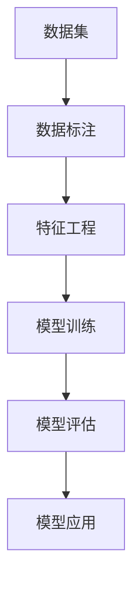

                 

# AI创业中的数据积累与应用

## 1. 背景介绍

### 1.1 问题由来

在AI创业的浪潮中，数据积累与应用成为了企业竞争的核心要素之一。无论是构建产品原型，还是迭代优化模型，都离不开对大量高质量数据的依赖。然而，对于许多初创企业来说，数据获取和处理依然是一个巨大的挑战。一方面，高质量的数据往往不易获取，需要耗费大量时间和成本；另一方面，数据的存储和处理也需要强大的技术支持和数据工程团队的支撑。

### 1.2 问题核心关键点

AI创业中的数据积累与应用涉及以下几个关键点：

- **数据获取**：包括数据采集、标注、预处理等环节，是整个数据管理的基础。
- **数据存储**：如何高效地存储大规模数据，并保证数据的完整性和可访问性。
- **数据处理**：包括数据清洗、归一化、特征工程等环节，目的是将原始数据转化为模型能够利用的形式。
- **数据应用**：将处理后的数据应用于AI模型训练、调优、推理等环节，生成业务价值。

### 1.3 问题研究意义

在AI创业中，数据积累与应用的意义重大：

- **提升产品竞争力**：高质量的数据能够显著提升AI模型的精度和泛化能力，从而增强产品的市场竞争力。
- **降低成本**：合理的数据处理和应用策略可以显著降低企业的研发和运营成本。
- **加速迭代**：有效的数据管理和应用能够加快模型的训练和迭代周期，加速产品迭代速度。
- **实现商业化**：数据是AI产品的核心资产，通过合理应用数据，能够将AI技术转化为实际的商业价值。

## 2. 核心概念与联系

### 2.1 核心概念概述

在AI创业中，涉及的核心概念包括：

- **数据集**：存储于数据库中的原始数据，经过预处理后用于模型训练和推理。
- **数据标注**：对数据进行人工或自动标注，赋予数据特定的含义或属性。
- **特征工程**：通过数据处理和特征提取，将原始数据转化为更有意义和可利用的形式。
- **模型训练**：使用标注数据训练AI模型，使其能够对新数据进行预测和推理。
- **模型评估**：通过测试数据集评估模型性能，优化模型参数。
- **模型应用**：将训练好的模型应用于实际业务场景，生成商业价值。

这些概念之间存在紧密联系，形成了一个完整的数据管理和应用流程。

### 2.2 概念间的关系

这些核心概念之间的关系可以通过以下Mermaid流程图来展示：



这个流程图展示了数据积累与应用的完整过程。数据集首先经过数据标注和特征工程处理，然后用于模型训练，并通过模型评估优化，最终应用于实际业务场景。

### 2.3 核心概念的整体架构

最后，我们用一个综合的流程图来展示这些核心概念在大数据管理和应用中的整体架构：


这个综合流程图展示了从数据采集到模型应用的完整流程，并指出了数据回流和业务反馈的重要性，形成了闭环的数据管理生态系统。

## 3. 核心算法原理 & 具体操作步骤
### 3.1 算法原理概述

在大数据管理和应用中，常用的算法原理包括：

- **数据清洗**：通过预处理和过滤，去除噪声和异常值，提升数据质量。
- **特征提取**：将原始数据转化为更有意义的特征，减少维度，提高模型效率。
- **模型选择与优化**：选择合适的模型架构和优化算法，提升模型性能。
- **模型评估与验证**：使用测试集评估模型性能，并进行交叉验证，确保模型泛化能力。
- **模型应用与部署**：将训练好的模型应用于实际业务场景，生成商业价值。

这些算法原理构成了数据管理和应用的基础，使得企业能够高效地构建和管理AI产品。

### 3.2 算法步骤详解

以下是一份详细的数据管理和应用操作步骤指南：

**Step 1: 数据采集**

- 确定数据采集源：包括线上用户行为数据、线下销售数据、第三方API接口等。
- 数据采集工具：使用爬虫、API调用等工具进行数据采集。
- 数据存储：将采集到的数据存储到数据库中，如MySQL、Hadoop等。

**Step 2: 数据标注**

- 数据标注工具：使用Labelbox、VLabel等工具进行数据标注。
- 标注任务设计：设计合适的标注任务，如分类、回归、标注实体等。
- 标注质量控制：进行标注质量检查，确保标注结果的一致性和准确性。

**Step 3: 数据清洗**

- 数据清洗工具：使用Pandas、Spark等工具进行数据清洗。
- 数据预处理：处理缺失值、异常值、重复记录等。
- 数据归一化：将数据转化为标准化的形式，方便模型处理。

**Step 4: 特征工程**

- 特征选择：选择对业务价值有显著影响的特征。
- 特征提取：使用特征工程技术，如PCA、SVD等，提取更有意义的特征。
- 特征处理：处理文本、图像等不同类型的数据，转化为数值形式。

**Step 5: 模型训练**

- 模型选择：选择合适的模型架构，如线性回归、神经网络、深度学习等。
- 模型训练：使用训练集训练模型，调整模型参数。
- 模型评估：使用测试集评估模型性能，优化模型参数。

**Step 6: 模型应用**

- 模型部署：将训练好的模型部署到生产环境中，如AWS、阿里云等。
- 模型优化：根据业务反馈，优化模型参数，提升模型性能。
- 模型监控：监控模型性能，及时发现和解决异常问题。

### 3.3 算法优缺点

数据管理和应用算法具有以下优点：

- **高效性**：通过自动化处理，显著提升数据管理效率。
- **准确性**：通过严格的标注和清洗，提高数据质量，提升模型精度。
- **可扩展性**：能够处理大规模数据，支持数据快速迭代。

同时，这些算法也存在一些缺点：

- **数据质量依赖**：数据标注和清洗的质量直接影响模型效果。
- **算法复杂度**：特征工程和模型训练过程复杂，需要专业知识和技能。
- **资源消耗**：大规模数据管理和模型训练需要高性能计算资源。

### 3.4 算法应用领域

数据管理和应用算法在多个领域得到了广泛应用，例如：

- **金融科技**：用于风险评估、信用评分、反欺诈等金融应用。
- **零售电商**：用于推荐系统、广告投放、客户细分等电商应用。
- **医疗健康**：用于患者诊疗、药物研发、健康管理等医疗应用。
- **智能制造**：用于生产监控、设备维护、质量检测等制造应用。
- **智能交通**：用于交通流量预测、自动驾驶、交通管理等交通应用。
- **教育培训**：用于学习行为分析、智能推荐、个性化教学等教育应用。

## 4. 数学模型和公式 & 详细讲解 & 举例说明
### 4.1 数学模型构建

在大数据管理和应用中，常用的数学模型包括：

- **线性回归模型**：用于预测连续数值型数据，表达式为 $y = \beta_0 + \beta_1 x_1 + \beta_2 x_2 + ... + \beta_n x_n$。
- **逻辑回归模型**：用于分类任务，表达式为 $P(y=1) = \frac{1}{1+e^{-z}}$，其中 $z = \beta_0 + \beta_1 x_1 + \beta_2 x_2 + ... + \beta_n x_n$。
- **支持向量机模型**：用于分类和回归任务，表达式为 $f(x) = \sum_i \alpha_i y_i K(x_i,x) - \frac{1}{2} \sum_i \sum_j \alpha_i \alpha_j y_i y_j K(x_i,x_j)$。
- **神经网络模型**：用于处理复杂数据，表达式为 $f(x) = \sum_{i=1}^n w_i h_{i-1}(x) + b_i$。

### 4.2 公式推导过程

以逻辑回归模型为例，其公式推导过程如下：

假设训练集为 $\{(x_1, y_1), (x_2, y_2), ..., (x_m, y_m)\}$，其中 $x_i$ 为输入特征，$y_i$ 为标签。模型的目标是最小化交叉熵损失函数 $L = \frac{1}{m} \sum_{i=1}^m -y_i \log P(y=1|x_i) - (1-y_i) \log P(y=0|x_i)$。

使用梯度下降算法求解，目标函数为 $J(\theta) = \frac{1}{2m} \sum_{i=1}^m [y_i - h_\theta(x_i)]^2$，其中 $h_\theta(x_i) = \frac{1}{1+e^{-z}}$。

根据梯度下降算法，求解目标函数的一阶导数：$\frac{\partial J(\theta)}{\partial \theta_j} = \frac{1}{m} \sum_{i=1}^m [h_\theta(x_i) - y_i]x_{ij}$。

### 4.3 案例分析与讲解

以金融风控为例，通过逻辑回归模型进行信用评分：

假设数据集包含用户的基本信息、历史交易记录、信用历史等特征，标签为是否违约。使用逻辑回归模型对用户进行信用评分，公式为：

$$
P(\text{违约}) = \frac{1}{1+e^{-(\beta_0 + \beta_1 x_1 + \beta_2 x_2 + ... + \beta_n x_n)}}
$$

其中，$\beta_0$ 为截距，$\beta_1, \beta_2, ..., \beta_n$ 为特征系数，$x_1, x_2, ..., x_n$ 为特征向量。通过训练模型，可以得到用户的违约概率，从而进行信用评分。

## 5. 项目实践：代码实例和详细解释说明
### 5.1 开发环境搭建

在进行数据管理和应用实践前，我们需要准备好开发环境。以下是使用Python进行Scikit-learn开发的环境配置流程：

1. 安装Anaconda：从官网下载并安装Anaconda，用于创建独立的Python环境。

2. 创建并激活虚拟环境：
```bash
conda create -n sklearn-env python=3.8 
conda activate sklearn-env
```

3. 安装Scikit-learn：
```bash
pip install scikit-learn
```

4. 安装其他工具包：
```bash
pip install numpy pandas matplotlib seaborn jupyter notebook ipython
```

完成上述步骤后，即可在`sklearn-env`环境中开始数据管理和应用实践。

### 5.2 源代码详细实现

这里以金融风控为例，使用Scikit-learn库对逻辑回归模型进行训练和应用。

首先，准备数据集和标签：

```python
import pandas as pd
from sklearn.model_selection import train_test_split
from sklearn.linear_model import LogisticRegression
from sklearn.metrics import accuracy_score, precision_score, recall_score, f1_score

# 读取数据集
data = pd.read_csv('credit_data.csv')

# 选择特征和标签
features = ['age', 'income', 'loan_amount', 'loan_length']
target = 'default'

# 划分训练集和测试集
X_train, X_test, y_train, y_test = train_test_split(data[features], data[target], test_size=0.2, random_state=42)
```

然后，定义模型并进行训练：

```python
# 定义逻辑回归模型
model = LogisticRegression()

# 训练模型
model.fit(X_train, y_train)
```

接着，评估模型性能：

```python
# 在测试集上评估模型性能
y_pred = model.predict(X_test)
print('Accuracy:', accuracy_score(y_test, y_pred))
print('Precision:', precision_score(y_test, y_pred))
print('Recall:', recall_score(y_test, y_pred))
print('F1 Score:', f1_score(y_test, y_pred))
```

最后，使用模型进行预测：

```python
# 对新用户进行信用评分
new_user = pd.DataFrame([[50, 50000, 20000, 2]], columns=features)
print('Credit Score:', model.predict_proba(new_user)[0][1])
```

### 5.3 代码解读与分析

让我们再详细解读一下关键代码的实现细节：

**数据集和标签处理**：
- `pd.read_csv()`方法用于读取CSV格式的数据集，并将数据转化为Pandas DataFrame对象。
- `train_test_split()`方法用于将数据集划分为训练集和测试集，并确保数据集的可重复性。
- `features`和`target`分别代表特征和标签列名，选择对模型训练有用的特征和标签。

**模型定义与训练**：
- `LogisticRegression()`方法用于定义逻辑回归模型。
- `fit()`方法用于训练模型，将训练数据集传递给模型进行拟合。

**模型评估**：
- `predict()`方法用于对测试集进行预测。
- `accuracy_score()`、`precision_score()`、`recall_score()`和`f1_score()`方法用于评估模型的各项指标，包括准确率、精确率、召回率和F1分数。

**模型应用**：
- 定义新用户的特征向量，并使用`predict_proba()`方法预测其信用评分，输出结果为违约概率。

## 6. 实际应用场景
### 6.1 金融科技

在金融科技领域，数据管理和应用算法被广泛用于信用评分、风险评估、反欺诈等任务。通过训练逻辑回归、决策树、随机森林等模型，金融公司能够评估用户的信用风险，预测贷款违约概率，从而做出更为精准的信贷决策。此外，数据管理和应用算法还可以用于反欺诈分析，通过异常检测和分类算法，识别并拦截欺诈行为，保护金融机构和消费者的权益。

### 6.2 零售电商

零售电商企业利用数据管理和应用算法进行个性化推荐、广告投放、客户细分等任务。通过训练协同过滤、深度学习等模型，电商平台能够根据用户的历史行为和偏好，推荐最相关的商品，提升用户体验和销售额。此外，广告投放和客户细分也是电商企业的重要应用场景，通过聚类和分类算法，企业能够将用户划分为不同的细分群体，进行精准的广告投放和营销活动，提升广告投放的效果和转化率。

### 6.3 医疗健康

在医疗健康领域，数据管理和应用算法被用于患者诊疗、药物研发、健康管理等任务。通过训练支持向量机、随机森林等模型，医疗机构能够预测患者患病概率，辅助医生进行诊疗决策。此外，药物研发也是医疗健康的重要应用场景，通过训练回归和分类算法，研究人员能够预测药物疗效和副作用，加速新药的研发和上市。

### 6.4 未来应用展望

随着数据管理和应用算法的不断发展，其在更多领域的应用前景将更加广阔。以下列举几个未来的应用方向：

1. **智能制造**：在智能制造领域，数据管理和应用算法被用于生产监控、设备维护、质量检测等任务。通过训练预测模型和分类算法，企业能够预测设备故障、优化生产流程，提升产品质量和生产效率。

2. **智能交通**：在智能交通领域，数据管理和应用算法被用于交通流量预测、自动驾驶、交通管理等任务。通过训练回归和分类算法，交通管理部门能够预测交通流量、优化交通信号灯，提升交通效率和安全性。

3. **教育培训**：在教育培训领域，数据管理和应用算法被用于学习行为分析、智能推荐、个性化教学等任务。通过训练聚类和分类算法，教育机构能够分析学生的学习行为，推荐合适的学习资源，进行个性化教学，提升教育效果和学生的学习体验。

4. **智能客服**：在智能客服领域，数据管理和应用算法被用于对话生成、情感分析、意图识别等任务。通过训练自然语言处理模型和序列模型，客服系统能够自动理解用户意图，提供个性化的服务，提升客户满意度和业务效率。

5. **智能安防**：在智能安防领域，数据管理和应用算法被用于人脸识别、异常检测、行为分析等任务。通过训练深度学习和计算机视觉算法，安防系统能够识别和监控异常行为，提升安全防护能力。

## 7. 工具和资源推荐
### 7.1 学习资源推荐

为了帮助开发者系统掌握数据管理和应用的技术基础和实践技巧，这里推荐一些优质的学习资源：

1. **《数据科学导论》（Introduction to Data Science）**：斯坦福大学开设的在线课程，系统讲解数据科学的基本概念和关键技术，包括数据清洗、特征工程、模型选择等。

2. **《Python数据科学手册》（Python Data Science Handbook）**：Jake VanderPlas著，详细介绍了Python在数据科学中的应用，包括数据处理、模型训练、可视化等。

3. **Kaggle平台**：全球最大的数据科学竞赛平台，提供丰富的数据集和模型训练竞赛，帮助开发者积累实战经验。

4. **Google Cloud AI Hub**：谷歌提供的AI开发平台，提供大量开源数据集和模型训练工具，支持数据管理和应用算法的研究和应用。

5. **TensorFlow和PyTorch官方文档**：提供详细的API文档和案例代码，帮助开发者学习和应用深度学习模型。

通过对这些资源的学习实践，相信你一定能够快速掌握数据管理和应用的核心技术，并应用于实际业务场景。

### 7.2 开发工具推荐

高效的开发离不开优秀的工具支持。以下是几款用于数据管理和应用开发的常用工具：

1. **Jupyter Notebook**：开源的交互式开发环境，支持Python、R等语言，方便开发者编写和测试代码。

2. **Pandas**：开源的Python数据分析库，支持数据读取、清洗、处理、分析等功能，是数据处理的重要工具。

3. **Scikit-learn**：开源的Python机器学习库，支持回归、分类、聚类等算法，是模型训练和应用的基础。

4. **TensorBoard**：谷歌提供的可视化工具，支持模型训练和调优过程的可视化，帮助开发者实时监控模型性能。

5. **Kibana**：开源的数据可视化平台，支持实时数据展示和分析，帮助开发者更好地理解数据。

合理利用这些工具，可以显著提升数据管理和应用开发效率，加速创新迭代的步伐。

### 7.3 相关论文推荐

数据管理和应用算法的发展源于学界的持续研究。以下是几篇奠基性的相关论文，推荐阅读：

1. **《数据挖掘：概念与技术》（Data Mining: Concepts and Techniques）**：Witten等著，详细介绍了数据挖掘的基本概念和关键技术，包括数据清洗、特征选择、模型评估等。

2. **《机器学习》（Machine Learning）**：Tom Mitchell著，介绍了机器学习的基本理论和方法，包括监督学习、无监督学习、强化学习等。

3. **《深度学习》（Deep Learning）**：Ian Goodfellow等著，详细介绍了深度学习的基本概念和关键技术，包括神经网络、卷积神经网络、循环神经网络等。

4. **《大规模在线机器学习》（Large-Scale Machine Learning）**：Russell Smith著，介绍了大规模机器学习的基本概念和关键技术，包括分布式训练、数据并行、模型压缩等。

这些论文代表了大数据管理和应用技术的发展脉络。通过学习这些前沿成果，可以帮助研究者把握学科前进方向，激发更多的创新灵感。

除上述资源外，还有一些值得关注的前沿资源，帮助开发者紧跟数据管理和应用技术的最新进展，例如：

1. **arXiv论文预印本**：人工智能领域最新研究成果的发布平台，包括大量尚未发表的前沿工作，学习前沿技术的必读资源。

2. **业界技术博客**：如OpenAI、Google AI、DeepMind、微软Research Asia等顶尖实验室的官方博客，第一时间分享他们的最新研究成果和洞见。

3. **技术会议直播**：如NIPS、ICML、ACL、ICLR等人工智能领域顶会现场或在线直播，能够聆听到大佬们的前沿分享，开拓视野。

4. **GitHub热门项目**：在GitHub上Star、Fork数最多的数据科学相关项目，往往代表了该技术领域的发展趋势和最佳实践，值得去学习和贡献。

5. **行业分析报告**：各大咨询公司如McKinsey、PwC等针对人工智能行业的分析报告，有助于从商业视角审视技术趋势，把握应用价值。

总之，对于数据管理和应用技术的学习和实践，需要开发者保持开放的心态和持续学习的意愿。多关注前沿资讯，多动手实践，多思考总结，必将收获满满的成长收益。

## 8. 总结：未来发展趋势与挑战
### 8.1 总结

本文对AI创业中的数据积累与应用进行了全面系统的介绍。首先阐述了数据管理和大数据应用的重要性，明确了数据采集、标注、清洗、处理、应用等关键环节的作用。其次，从原理到实践，详细讲解了数据管理和应用算法的数学模型和操作步骤，给出了详细的代码实例。同时，本文还广泛探讨了数据管理和应用算法在多个行业领域的应用前景，展示了其广阔的应用价值。

通过本文的系统梳理，可以看到，数据管理和应用算法在大数据时代的重要性日益凸显，其高效性、准确性、可扩展性等特点，使其在AI创业中扮演了至关重要的角色。未来，伴随数据技术和AI模型的不断发展，数据管理和应用算法必将为AI创业带来更大的突破。

### 8.2 未来发展趋势

展望未来，数据管理和应用算法将呈现以下几个发展趋势：

1. **自动化和智能化**：通过自动化数据处理和智能算法优化，数据管理和应用算法将更加高效和智能，提升数据处理的自动化水平。

2. **多模态融合**：随着数据来源的多样化，多模态数据融合将成为未来的重要方向。数据管理和应用算法将能够处理文本、图像、视频等多模态数据，提升数据融合的准确性和效果。

3. **分布式计算**：大规模数据的处理需要强大的计算资源支持。分布式计算技术将使得数据管理和应用算法能够高效处理大规模数据，提升计算效率。

4. **模型压缩和加速**：为了降低计算资源消耗，数据管理和应用算法将更加注重模型压缩和加速技术，如剪枝、量化、蒸馏等。

5. **数据治理和隐私保护**：随着数据量的增加，数据治理和隐私保护将成为重要问题。数据管理和应用算法将引入数据治理技术和隐私保护技术，确保数据安全和合规性。

6. **AI伦理和可解释性**：AI技术的广泛应用带来了伦理和安全问题。数据管理和应用算法将引入AI伦理和可解释性技术，确保模型的公正性和透明性。

### 8.3 面临的挑战

尽管数据管理和应用算法已经取得了显著进展，但在迈向更加智能化、普适化应用的过程中，仍面临诸多挑战：

1. **数据质量问题**：数据标注和清洗的质量直接影响模型效果，如何提高数据质量是一个重要挑战。

2. **计算资源消耗**：大规模数据管理和模型训练需要高性能计算资源，如何优化计算资源利用率，降低成本是一个重要问题。

3. **算法复杂度**：特征工程和模型训练过程复杂，需要专业知识和技能，如何降低算法复杂度，提高开发效率是一个重要问题。

4. **模型可解释性**：大型模型的决策过程往往缺乏可解释性，如何提升模型可解释性，增强用户体验是一个重要问题。

5. **隐私保护**：数据管理和应用算法涉及大量个人隐私数据，如何保护数据隐私，避免数据滥用是一个重要问题。

6. **数据偏见**：模型可能学习到数据中的偏见，如何减少模型偏见，确保公平性是一个重要问题。

### 8.4 研究展望

面对数据管理和应用算法所面临的挑战，未来的研究需要在以下几个方面寻求新的突破：

1. **自动化数据标注**：利用半监督学习和无监督学习技术，自动生成标注数据，降低标注成本。

2. **分布式数据处理**：通过分布式计算技术，高效处理大规模数据，提升数据处理效率。

3. **模型压缩和加速**：引入模型压缩和加速技术，如剪枝、量化、蒸馏等，降低模型资源消耗。

4. **多模态数据融合**：引入多模态数据融合技术，提升数据融合的准确性和效果。

5. **AI伦理和可解释性**：引入AI伦理和可解释性技术，确保模型的公正性和透明性。

6. **隐私保护技术**：引入隐私保护技术，如差分隐私、联邦学习等，确保数据隐私和安全。

这些研究方向的探索，必将引领数据管理和应用算法迈向更高的台阶，为AI创业带来更大的突破。面向未来，数据管理和应用算法需要与其他AI技术进行更深入的融合，如知识表示、因果推理、强化学习等，多路径协同发力，共同推动AI技术的进步。只有勇于创新、敢于突破，才能不断拓展数据管理和应用算法的边界，让数据更好地赋能AI创业，推动人工智能技术的发展。

## 9. 附录：常见问题与解答

**Q1：数据管理和应用算法的核心是什么？**

A: 数据管理和应用算法的核心是数据清洗、特征工程和模型训练。数据清洗和特征工程将原始数据转化为更有意义的形式，模型训练则使用标注数据优化模型参数，提升模型精度。

