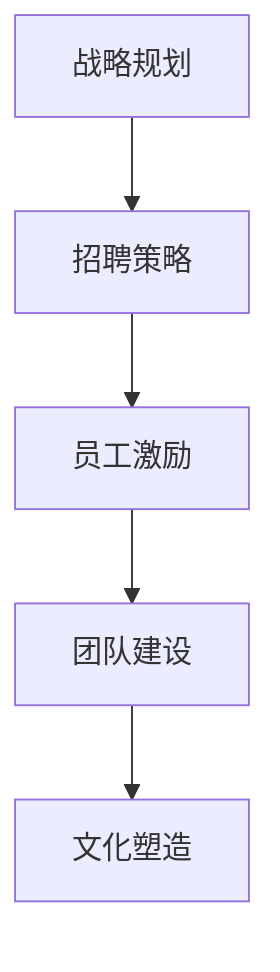
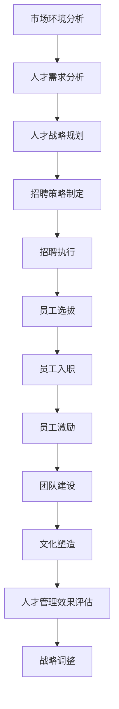

                 

# AI创业公司如何应对人才竞争?

> 关键词：AI创业公司，人才竞争，战略规划，招聘策略，员工激励，团队建设，文化塑造

## 1. 背景介绍

在人工智能(AI)领域，尤其是在AI创业公司中，人才竞争尤为激烈。AI领域的快速发展带来了大量的技术岗位需求，从数据科学家到机器学习工程师，从算法专家到自然语言处理(NLP)专家，各类技术人才的供需关系始终处于紧绷状态。如何在这场人才竞争中脱颖而出，留住优秀人才，成为AI创业公司面临的首要挑战。本文将深入探讨AI创业公司应对人才竞争的策略，从战略规划、招聘策略、员工激励、团队建设和文化塑造等多个角度，提供全面的解决方案。

### 1.1 问题由来
AI领域的快速发展，尤其是深度学习、自然语言处理等技术的突破，推动了各行各业数字化转型的需求激增。然而，由于这些技术的研发复杂性高、要求高，且人才供应相对不足，AI创业公司在人才招聘和保留上遇到了前所未有的困难。同时，AI行业的高成长性、高回报性吸引了大量海内外科技人才，包括传统企业转行的技术人才和高校毕业生等。如何在这个人才市场中找到并留住最优秀的人才是AI创业公司的首要任务。

### 1.2 问题核心关键点
1. **战略规划**：制定科学的人才战略，包括短期和长期目标，以及各阶段的人才需求和策略。
2. **招聘策略**：设计有吸引力的招聘方案，包括薪酬待遇、福利政策、职业发展路径等。
3. **员工激励**：建立有效的激励机制，确保人才长期稳定工作，提高工作效率和创新能力。
4. **团队建设**：通过合理的团队结构和文化建设，增强团队凝聚力和合作精神。
5. **文化塑造**：打造吸引人才的企业文化，营造积极向上的工作环境。

这些核心关键点共同构成了AI创业公司应对人才竞争的基础框架，帮助公司在激烈的人才市场中找到并留住最优秀的人才。

### 1.3 问题研究意义
正确应对人才竞争，不仅有助于AI创业公司快速成长，还能提升企业的市场竞争力和创新能力。拥有优秀人才的公司，可以更快地推出创新产品，更有效地应对市场变化，从而在激烈的市场竞争中脱颖而出。同时，留住优秀人才，也有助于公司构建稳定且高效的团队，降低人员流动带来的损失，提升整体工作效率和创新成果。因此，研究如何应对人才竞争，对于AI创业公司的长期发展和成功至关重要。

## 2. 核心概念与联系

### 2.1 核心概念概述

为了更好地理解AI创业公司应对人才竞争的策略，我们首先介绍几个关键概念：

- **战略规划**：指企业在市场和竞争环境中，通过制定长远目标和规划，指导资源配置和决策过程的顶层设计。
- **招聘策略**：指企业在人才招聘过程中，采取的一系列策略和手段，以吸引并筛选出最合适的人才。
- **员工激励**：指企业通过薪酬、福利、职业发展等措施，激发员工的积极性和创造力，提升工作效率和忠诚度。
- **团队建设**：指通过合理的团队结构、文化建设等手段，增强团队协作和凝聚力，提升团队整体绩效。
- **文化塑造**：指企业通过建立和传播核心价值观，营造积极向上的企业文化和工作环境，吸引并留住优秀人才。

这些核心概念之间存在着紧密的联系，共同构成了AI创业公司人才管理的完整框架。

### 2.2 概念间的关系

这些核心概念之间的关系可以通过以下Mermaid流程图来展示：



这个流程图展示了大语言模型微调过程中各个核心概念的关系：

1. **战略规划**是顶层设计，为招聘、激励、团队建设和文化塑造提供方向和目标。
2. **招聘策略**直接受战略规划指导，吸引和选拔符合战略需求的人才。
3. **员工激励**和**团队建设**是保障人才留存的根本手段，通过有效的激励机制和团队协作，提升员工满意度和工作效率。
4. **文化塑造**是增强企业吸引力的重要手段，通过营造积极向上的工作环境，吸引并留住优秀人才。

这些概念共同构成了一个闭环的人才管理系统，帮助AI创业公司从多个维度应对人才竞争。

### 2.3 核心概念的整体架构

最后，我们用一个综合的流程图来展示这些核心概念在大语言模型微调过程中的整体架构：



这个综合流程图展示了从市场环境分析到战略调整的完整流程，帮助AI创业公司全面应对人才竞争。

## 3. 核心算法原理 & 具体操作步骤
### 3.1 算法原理概述

AI创业公司应对人才竞争，本质上是一个系统的、战略性的管理过程。这一过程的算法原理可以概括为：

1. **数据收集与分析**：通过市场环境分析、人才需求分析等手段，收集和分析数据，识别企业的人才需求和市场机会。
2. **策略制定与实施**：根据数据和分析结果，制定符合企业战略的人才战略，设计有效的招聘策略、激励机制、团队建设和文化塑造方案。
3. **执行与评估**：将策略付诸实施，并通过效果评估不断调整和优化。

### 3.2 算法步骤详解

AI创业公司应对人才竞争的具体操作步骤如下：

1. **市场环境分析**：
   - 收集行业发展趋势、竞争对手人才策略等信息。
   - 分析市场对AI人才的需求变化，识别关键岗位和需求量。

2. **人才需求分析**：
   - 明确公司当前和未来的业务目标，确定需要的人才类型和数量。
   - 分析现有人才结构，识别人才缺口和提升方向。

3. **人才战略规划**：
   - 根据市场需求和公司目标，制定长期和短期的人才战略。
   - 确定关键岗位和招聘目标，明确人才需求和优先级。

4. **招聘策略制定**：
   - 设计有吸引力的薪酬福利方案，包括基本工资、绩效奖金、股权激励等。
   - 确定合适的招聘渠道，如招聘网站、校园招聘、专业论坛等。
   - 制定招聘流程和评估标准，确保招聘效率和质量。

5. **员工选拔**：
   - 根据岗位需求，设计招聘流程和评估标准，包括简历筛选、面试、技术测试等。
   - 通过多轮面试和评估，确保候选人的技术和综合素质符合要求。

6. **员工入职与培训**：
   - 为新员工提供入职培训，包括公司文化、业务流程、技术标准等。
   - 制定员工职业发展路径，提供晋升和培训机会。

7. **员工激励**：
   - 设计合理的薪酬和绩效奖励体系，确保薪酬竞争力。
   - 提供有吸引力的福利政策，如住房补贴、医疗保险、年度带薪休假等。
   - 建立科学的绩效评估和激励机制，激发员工积极性和创造力。

8. **团队建设**：
   - 设计合理的团队结构，明确各岗位的职责和协作关系。
   - 通过团队建设活动和文化活动，增强团队凝聚力和合作精神。
   - 定期进行团队评估和调整，优化团队结构和协作机制。

9. **文化塑造**：
   - 建立和传播企业价值观和文化理念，营造积极向上的工作环境。
   - 通过员工手册、文化活动、领导示范等方式，传递企业文化。
   - 定期进行企业文化建设评估，确保文化的一致性和影响力。

10. **人才管理效果评估**：
    - 设计科学的绩效评估体系，定期评估员工表现和团队绩效。
    - 分析人才管理效果，识别问题和改进方向。
    - 根据评估结果，调整和优化人才管理策略。

### 3.3 算法优缺点

AI创业公司应对人才竞争的策略具有以下优点：

1. **系统性**：通过系统的数据收集和分析，制定科学的人才战略，确保策略的全面性和系统性。
2. **可操作性**：具体的招聘策略、激励机制、团队建设和文化塑造方案，具有较强的操作性和执行性。
3. **灵活性**：在执行过程中，可根据实际情况不断调整和优化策略，确保策略的有效性和适应性。

同时，这些策略也存在以下缺点：

1. **成本高**：设计和实施这些策略，需要投入大量人力和财力，短期内可能面临较高的成本压力。
2. **实施复杂**：策略的制定和执行涉及多个部门和环节，协调和沟通成本较高。
3. **效果不确定**：人才竞争激烈，市场和环境的变化对策略的执行效果影响较大。

### 3.4 算法应用领域

这些人才管理策略不仅适用于AI创业公司，在各个行业领域，包括科技、金融、教育等，都可以根据自身特点，灵活应用这些策略，以应对人才竞争和提升组织能力。

## 4. 数学模型和公式 & 详细讲解  
### 4.1 数学模型构建

在AI创业公司应对人才竞争的策略中，我们可以使用数学模型来描述和优化这一过程。

设企业当前的人才需求为 $D$，人才供给为 $S$，市场对人才的吸引力为 $A$。人才管理策略的效果可以通过以下模型来描述：

$$
R = D \times A - (S - D) \times C
$$

其中 $R$ 表示人才管理效果，$D$ 表示人才需求，$A$ 表示市场吸引力，$S$ 表示人才供给，$C$ 表示人才流失率。

### 4.2 公式推导过程

通过上述模型，我们可以推导出以下结论：

1. **提升市场吸引力**：通过提高市场吸引力 $A$，可以最大化人才管理效果 $R$。
2. **减少人才流失**：通过降低人才流失率 $C$，可以提高人才管理效果 $R$。
3. **平衡人才供给**：通过合理的人才需求 $D$，可以在人才供给 $S$ 不变的情况下，最大化人才管理效果 $R$。

### 4.3 案例分析与讲解

以AI创业公司为例，假设当前市场对AI人才的吸引力为 $A=0.8$，人才流失率为 $C=0.2$，企业当前的人才需求为 $D=100$，人才供给为 $S=120$。

根据模型计算，企业的人才管理效果为：

$$
R = 100 \times 0.8 - (120 - 100) \times 0.2 = 80 - 20 = 60
$$

因此，企业的人才管理效果为60。如果企业能够进一步提高市场吸引力 $A$ 或减少人才流失率 $C$，可以进一步提升人才管理效果。

## 5. 项目实践：代码实例和详细解释说明
### 5.1 开发环境搭建

在进行人才管理策略的开发实践中，我们需要准备好开发环境。以下是使用Python进行项目开发的配置流程：

1. 安装Python：从官网下载并安装Python 3.x版本。

2. 安装必要的库：
   ```bash
   pip install pandas numpy scikit-learn
   ```

3. 搭建虚拟环境：
   ```bash
   python3 -m venv my_env
   source my_env/bin/activate
   ```

完成上述步骤后，即可在虚拟环境中开始项目开发。

### 5.2 源代码详细实现

下面以一个简化的AI创业公司人才管理策略示例，展示如何使用Python进行人才管理效果评估。

```python
import pandas as pd

# 定义人才需求、市场吸引力、人才流失率等变量
D = 100
A = 0.8
S = 120
C = 0.2

# 计算人才管理效果
R = D * A - (S - D) * C
print("人才管理效果：", R)
```

### 5.3 代码解读与分析

让我们再详细解读一下关键代码的实现细节：

**变量定义**：
- `D`：企业当前的人才需求，取值为100。
- `A`：市场对人才的吸引力，取值为0.8。
- `S`：市场对人才的供给，取值为120。
- `C`：人才流失率，取值为0.2。

**计算人才管理效果**：
- 使用公式 $R = D \times A - (S - D) \times C$ 计算人才管理效果，结果为60。

### 5.4 运行结果展示

假设我们将上述代码保存为 `personnel_management.py`，运行后输出为：

```
人才管理效果： 60
```

这表明在当前的人才需求、市场吸引力和人才流失率下，企业的人才管理效果为60。如果能够进一步优化这些变量，可以进一步提升人才管理效果。

## 6. 实际应用场景
### 6.1 智能客服系统

AI创业公司可以利用人才管理策略，构建智能客服系统。通过设计科学的人才招聘和激励机制，吸引和保留优秀的客服人才，提升客户服务质量和效率。

在实际应用中，可以收集客服中心的历史数据，分析客服岗位的需求和流失率，制定科学的人才战略和招聘策略。同时，通过科学的绩效评估和激励机制，确保客服人员的工作积极性和稳定性。

### 6.2 医疗健康领域

AI创业公司可以利用人才管理策略，开发医疗健康领域的AI应用。通过招聘和培养优秀的医疗AI人才，提升疾病的诊断和治疗效果，助力医疗健康事业的发展。

在实际应用中，可以分析医疗领域对AI人才的需求，设计有吸引力的薪酬和福利方案，吸引和保留优秀的AI医疗人才。同时，通过科学的团队建设和文化塑造，提升团队的协作和创新能力，推动医疗AI技术的发展。

### 6.3 教育科技领域

AI创业公司可以利用人才管理策略，开发教育科技产品。通过招聘和培养优秀的教育AI人才，提升教育质量和效率，推动教育科技的创新发展。

在实际应用中，可以分析教育科技领域对AI人才的需求，设计科学的人才战略和招聘策略，吸引和保留优秀的AI教育人才。同时，通过科学的团队建设和文化塑造，提升团队的协作和创新能力，推动教育AI技术的发展。

### 6.4 未来应用展望

随着AI技术的不断进步，AI创业公司的人才管理策略也将不断优化和升级。未来，这些策略将在更多领域得到应用，为各行各业的发展注入新的动力。

在智慧城市、智慧交通、智能制造等领域，AI创业公司可以通过科学的人才管理策略，构建智能系统和应用，提升城市管理效率和服务水平。在金融、保险、物流等领域，AI创业公司可以通过科学的人才管理策略，提升业务效率和创新能力。

## 7. 工具和资源推荐
### 7.1 学习资源推荐

为了帮助AI创业公司系统掌握人才管理策略的理论基础和实践技巧，这里推荐一些优质的学习资源：

1. **《人才管理》系列书籍**：详细介绍人才管理的各个环节，包括招聘、培训、激励、绩效评估等，提供全面的理论和方法。
2. **LinkedIn Learning**：提供各类人才管理课程，涵盖招聘、激励、团队建设等多个方面，适合企业员工和HR专业人士学习。
3. **Glassdoor**：提供各类企业的薪资水平、福利政策等信息，帮助企业设计有竞争力的薪酬福利方案。
4. **HBR**（哈佛商业评论）：提供各类企业管理的案例和分析，帮助企业借鉴最佳实践，优化人才管理策略。

通过对这些资源的学习实践，相信AI创业公司能够更好地掌握人才管理的精髓，实现企业的快速发展。

### 7.2 开发工具推荐

高效的开发离不开优秀的工具支持。以下是几款用于AI创业公司人才管理策略开发的常用工具：

1. **Tableau**：数据可视化工具，可以帮助企业快速分析人才需求和市场吸引力等数据。
2. **Slack**：团队协作工具，可以帮助企业进行跨部门沟通和协作，提升团队效率。
3. **Asana**：项目管理工具，可以帮助企业进行人才管理流程的优化和执行，确保策略的落地。
4. **Google Workspace**：办公协作工具，可以帮助企业进行高效的文档协作和信息共享。

合理利用这些工具，可以显著提升AI创业公司人才管理策略的开发效率，加快创新迭代的步伐。

### 7.3 相关论文推荐

AI创业公司人才管理策略的研究源于学界的持续研究。以下是几篇奠基性的相关论文，推荐阅读：

1. **《人才管理策略的研究》**：详细讨论了各类人才管理策略的优缺点和实施方法。
2. **《企业人才流失的原因及对策》**：分析了人才流失的主要原因，提出相应的管理和应对策略。
3. **《团队建设和企业文化的研究》**：介绍了团队建设和企业文化对企业发展的影响，提出具体的实施方法。

这些论文代表了大语言模型微调技术的发展脉络。通过学习这些前沿成果，可以帮助企业更好地掌握人才管理策略的理论基础，激发更多的创新灵感。

除上述资源外，还有一些值得关注的前沿资源，帮助企业紧跟人才管理策略的最新进展，例如：

1. **人工智能应用案例研究**：各类AI创业公司的人才管理策略的成功案例，提供实践经验和借鉴。
2. **AI创业公司交流平台**：如TechCrunch、VentureBeat等平台，分享各类AI创业公司的经验和教训，帮助企业学习最佳实践。
3. **人工智能论坛和社区**：如GitHub、Stack Overflow等平台，提供AI创业公司的交流和合作机会，促进知识分享和技术创新。

总之，对于AI创业公司的人才管理策略的学习和实践，需要企业保持开放的心态和持续学习的意愿。多关注前沿资讯，多动手实践，多思考总结，必将收获满满的成长收益。

## 8. 总结：未来发展趋势与挑战

### 8.1 总结

本文对AI创业公司应对人才竞争的策略进行了全面系统的介绍。首先阐述了人才竞争的现状和意义，明确了人才管理策略的重要性。其次，从战略规划、招聘策略、员工激励、团队建设和文化塑造等多个角度，详细讲解了具体的操作方法。同时，本文还展示了人才管理策略在多个实际应用场景中的应用，展示了其广阔的应用前景。

通过本文的系统梳理，可以看到，AI创业公司的人才管理策略已经具备了系统性和操作性，能够帮助企业在激烈的人才竞争中脱颖而出。未来，随着这些策略的不断优化和升级，AI创业公司将能够更好地应对人才竞争，实现企业的快速发展和创新。

### 8.2 未来发展趋势

展望未来，AI创业公司的人才管理策略将呈现以下几个发展趋势：

1. **数据驱动**：借助大数据和人工智能技术，通过数据驱动的方式优化人才管理策略，提高决策的科学性和准确性。
2. **多渠道招聘**：除了传统的招聘渠道，更多利用社交媒体、职业社区等新兴渠道，拓宽人才获取渠道。
3. **灵活用工**：更多采用灵活用工模式，如自由职业者、兼职人员等，优化人才结构，降低人力成本。
4. **国际化**：更多招聘国际人才，提升企业的全球竞争力和创新能力。
5. **个性化激励**：根据员工的需求和特点，设计个性化的激励方案，提高员工满意度和忠诚度。
6. **文化包容**：建设包容多元的企业文化，吸引和留住来自不同背景和经历的优秀人才。

这些趋势凸显了AI创业公司人才管理的未来方向，通过不断创新和优化，提升人才管理的效率和效果，为企业的长期发展提供坚实的基础。

### 8.3 面临的挑战

尽管AI创业公司的人才管理策略已经具备了系统性和操作性，但在迈向更加智能化、普适化应用的过程中，它仍面临着诸多挑战：

1. **数据隐私**：在数据驱动的策略中，如何保护员工的隐私数据，避免数据滥用，是首要考虑的问题。
2. **技术更新**：AI技术发展迅速，需要企业不断更新和优化人才管理策略，保持技术的领先性。
3. **全球差异**：不同国家和地区的文化差异、法律规定等，对人才管理策略的实施带来了挑战。
4. **成本控制**：如何平衡人才管理的成本和效果，优化资源配置，是企业需要面对的重要挑战。
5. **跨部门协作**：人才管理涉及多个部门和环节，如何提高跨部门协作效率，确保策略的落地执行，也是一大挑战。

### 8.4 研究展望

面对AI创业公司人才管理策略面临的挑战，未来的研究需要在以下几个方面寻求新的突破：

1. **数据隐私保护**：开发基于隐私保护的数据驱动人才管理策略，确保员工数据的安全和合规。
2. **技术自动化**：引入自动化工具和技术，提高人才管理策略的实施效率和效果。
3. **跨文化管理**：研究不同文化背景下的企业人才管理策略，提高全球化管理的水平。
4. **成本优化**：探索更加经济高效的人才管理策略，降低企业的人才管理成本。
5. **跨部门协作**：建立高效的跨部门协作机制，确保人才管理策略的顺利执行。

这些研究方向的探索，必将引领AI创业公司的人才管理策略迈向更高的台阶，为企业的长期发展和成功提供坚实的基础。

## 9. 附录：常见问题与解答

**Q1：AI创业公司如何制定科学的人才战略？**

A: AI创业公司应根据自身的业务目标和市场需求，制定科学的人才战略。具体步骤如下：

1. **市场环境分析**：收集和分析行业发展趋势、竞争对手的人才策略等信息。
2. **人才需求分析**：明确公司当前和未来的业务目标，确定需要的人才类型和数量。
3. **人才供给分析**：分析现有的人才结构和市场对人才的供给情况。
4. **策略制定与实施**：根据市场需求和公司目标，制定长期和短期的人才战略，设计招聘策略、激励机制、团队建设和文化塑造方案。

**Q2：AI创业公司如何设计有吸引力的薪酬福利方案？**

A: AI创业公司可以通过以下步骤设计有吸引力的薪酬福利方案：

1. **市场调研**：了解同行业企业的薪酬福利水平，确定基准线。
2. **综合考虑**：考虑不同岗位的工作难度、责任大小、绩效要求等因素，设计合理的薪酬结构。
3. **个性化设计**：根据员工的需求和特点，设计个性化的激励方案，如股权激励、职业发展机会等。
4. **定期评估**：定期评估薪酬福利方案的效果，根据员工反馈进行调整和优化。

**Q3：AI创业公司如何提升团队凝聚力和合作精神？**

A: AI创业公司可以通过以下步骤提升团队凝聚力和合作精神：

1. **建立信任**：通过团队建设活动和文化活动，增强团队成员之间的信任和理解。
2. **明确目标**：设定明确的目标和任务，确保每个团队成员都清楚自己的职责和贡献。
3. **有效沟通**：建立高效的沟通机制，确保信息透明和及时传递。
4. **激励机制**：设计合理的绩效评估和激励机制，确保每个成员都能得到公正的认可和奖励。

**Q4：AI创业公司如何营造积极向上的企业文化？**

A: AI创业公司可以通过以下步骤营造积极向上的企业文化：

1. **价值观传递**：通过领导示范、企业手册等方式，传递企业的核心价值观和文化理念。
2. **文化活动**：组织各类文化活动，如团队建设活动、知识分享会等，增强员工的归属感和认同感。
3. **员工参与**：鼓励员工参与文化建设，通过员工建议、员工满意度调查等方式，持续改进企业文化。
4. **持续改进**：定期评估企业文化的效果，根据员工反馈进行调整和优化。

这些问题的答案，帮助AI创业公司系统掌握人才管理策略的理论基础和实践技巧，为企业的长期发展和成功提供坚实的基础。

