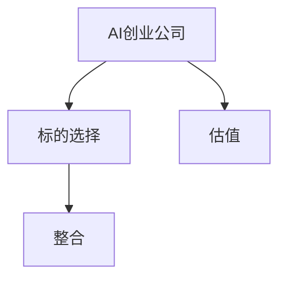
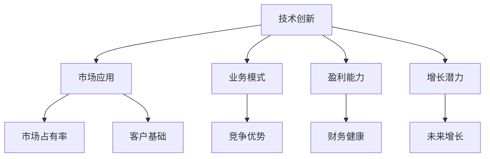
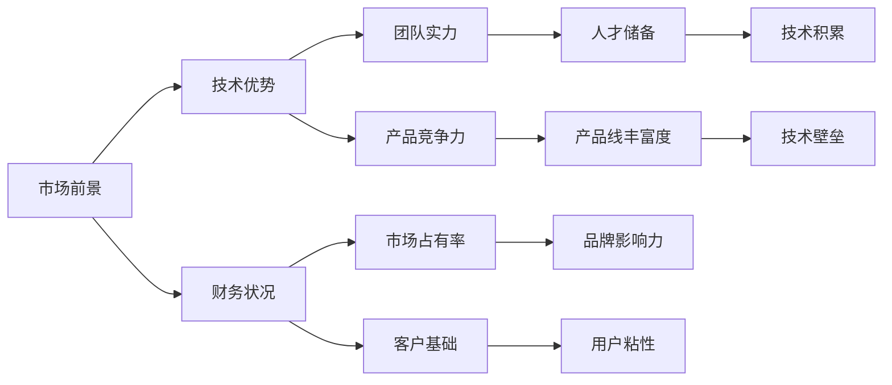
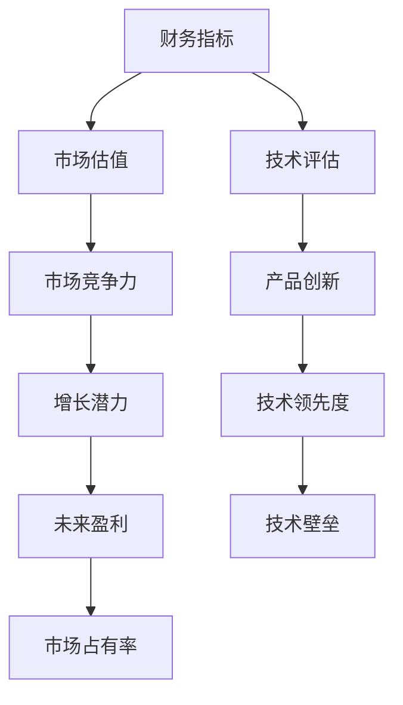
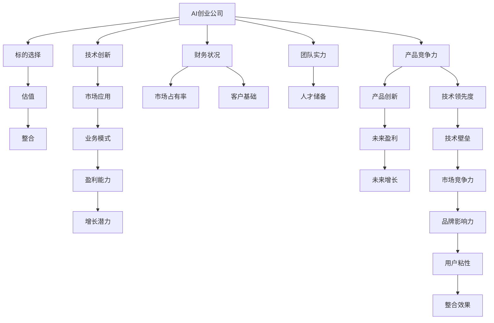

                 

# AI创业公司的投资并购策略：标的选择、估值与整合

> 关键词：AI创业公司，投资并购，标的选择，估值，整合

## 1. 背景介绍

### 1.1 问题由来
随着人工智能(AI)技术的不断成熟和普及，越来越多的AI创业公司在各行业中崭露头角，创造出了显著的经济价值和社会效益。然而，AI创业公司的成长面临着各种挑战，如市场竞争激烈、技术迭代迅速、融资困难等，这些问题都可能影响其长期发展。投资并购是AI创业公司实现快速发展和扩大的重要策略之一，通过外部资金和资源的注入，可以增强公司的竞争力和市场影响力，推动AI技术在更广泛领域的应用。

### 1.2 问题核心关键点
AI创业公司的投资并购策略，主要包括标的选择、估值、整合三个核心环节。每个环节都直接关系到投资并购的效果和风险，需要慎重考虑和精细操作。

- **标的选择**：如何选择具有潜力和价值的AI创业公司作为并购目标，需要考虑公司的技术优势、市场应用前景、财务健康度、团队实力等多方面因素。

- **估值**：如何科学合理地评估目标公司的价值，避免高估或低估，需要结合公司的业务模式、市场占有率、盈利能力、增长潜力等指标进行综合分析。

- **整合**：如何将并购后的公司成功整合进母公司，实现资源的有效利用和技术优势的互补，是并购成功的关键。

### 1.3 问题研究意义
研究AI创业公司的投资并购策略，对于提升AI技术的创新和应用水平，加速AI创业公司的市场扩张和价值实现，具有重要意义：

1. **加速技术成熟**：通过投资并购，可以快速获取先进的技术和人才，加速AI技术的应用和成熟。
2. **扩大市场份额**：并购可以迅速扩大公司的市场覆盖范围，增强竞争力和市场影响力。
3. **优化资源配置**：通过并购，可以优化资源配置，提升公司的运营效率和盈利能力。
4. **风险分散**：多元化投资可以分散单一项目的风险，保障公司的长期稳定发展。

## 2. 核心概念与联系

### 2.1 核心概念概述

为更好地理解AI创业公司的投资并购策略，本节将介绍几个密切相关的核心概念：

- **AI创业公司**：专注于人工智能技术研发和应用的公司，通过技术创新驱动业务发展，具有较高的技术壁垒和市场潜力。
- **投资并购**：通过投资或收购其他公司以实现资源整合、技术互补、市场扩张等战略目标的行为。
- **标的选择**：在并购过程中，对目标公司的筛选和评估过程，需要考虑多个维度的因素。
- **估值**：确定目标公司的市场价值，涉及财务、技术、市场等多方面的综合评估。
- **整合**：并购后的资源整合过程，包括技术融合、管理协同、文化融合等。

这些核心概念之间的逻辑关系可以通过以下Mermaid流程图来展示：



这个流程图展示了AI创业公司的投资并购策略的基本流程：

1. 通过标的选择，筛选符合要求的AI创业公司作为并购目标。
2. 对目标公司进行估值，确定其市场价值。
3. 对目标公司进行整合，实现资源的有效利用和技术优势的互补。

### 2.2 概念间的关系

这些核心概念之间存在着紧密的联系，形成了AI创业公司投资并购策略的完整生态系统。下面我们通过几个Mermaid流程图来展示这些概念之间的关系。

#### 2.2.1 AI创业公司的核心能力



这个流程图展示了AI创业公司的核心能力及其之间的关系：

1. 技术创新是公司的核心竞争力。
2. 市场应用前景决定公司的市场占有率和客户基础。
3. 业务模式、盈利能力、增长潜力等财务指标反映公司的健康状况。

#### 2.2.2 标的选择的标准



这个流程图展示了选择AI创业公司作为并购目标的标准，主要包括以下方面：

1. 市场前景和财务状况是并购的前提。
2. 技术优势和产品竞争力是并购的核心。
3. 团队实力和客户基础是并购的基础。
4. 品牌影响力和用户粘性是并购的保障。

#### 2.2.3 估值的方法



这个流程图展示了估值的主要方法，主要包括以下方面：

1. 财务指标是估值的基础。
2. 技术评估是估值的核心。
3. 市场估值和市场竞争力是估值的参考。
4. 产品创新、技术领先度、未来盈利等指标反映公司的长期价值。

### 2.3 核心概念的整体架构

最后，我们用一个综合的流程图来展示这些核心概念在大语言模型微调过程中的整体架构：



这个综合流程图展示了从标的选择、估值到整合的完整过程。AI创业公司首先评估自身的核心能力，然后选择合适的并购目标，再通过估值确定交易价格，最后通过整合实现资源优化和技术互补。通过这些流程图，我们可以更清晰地理解AI创业公司投资并购过程中各个核心概念的关系和作用，为后续深入讨论具体的策略和操作方法奠定基础。

## 3. 核心算法原理 & 具体操作步骤
### 3.1 算法原理概述

AI创业公司的投资并购策略，本质上是一种基于财务和技术的综合评估过程。其核心思想是：通过综合考虑目标公司的市场前景、技术优势、财务状况等因素，评估其市场价值，然后通过合理的交易结构，实现资源的有效整合。

形式化地，假设目标AI创业公司为 $T$，其市场价值为 $V$。根据公司的财务报表和业务指标，我们可以建立价值评估模型：

$$
V = f(\text{Revenue}, \text{Profit}, \text{Growth}, \text{Market Share}, \text{Product Innovation}, \text{Technology Leadership}, \text{Customer Base}, \text{Team Strength})
$$

其中 $\text{Revenue}$、$\text{Profit}$、$\text{Growth}$、$\text{Market Share}$、$\text{Product Innovation}$、$\text{Technology Leadership}$、$\text{Customer Base}$、$\text{Team Strength}$ 等变量，分别表示公司的营收、利润、增长潜力、市场占有率、产品创新能力、技术领先度、客户基础、团队实力。

通过建立上述价值评估模型，可以科学合理地评估目标公司的市场价值。根据市场价值和自身资金情况，可以确定交易价格和交易结构，完成并购操作。

### 3.2 算法步骤详解

AI创业公司的投资并购策略一般包括以下几个关键步骤：

**Step 1: 制定并购策略**
- 明确并购目标：确定并购的目的，如市场扩展、技术获取、业务整合等。
- 筛选目标公司：基于公司背景、财务状况、技术实力等因素，筛选潜在的并购目标。
- 确定并购方式：选择股权并购、资产并购、收购子公司等方式，具体根据并购目的和目标公司的实际情况决定。

**Step 2: 进行价值评估**
- 收集财务数据：获取目标公司的财务报表、审计报告等，包括营收、利润、现金流等关键指标。
- 分析业务模式：评估目标公司的业务模式、市场定位、竞争优势等。
- 研究技术能力：分析目标公司的技术创新能力、专利申请、技术领先度等。
- 评估市场前景：评估目标公司的市场占有率、客户基础、市场增长潜力等。
- 评估团队实力：评估目标公司的管理团队、人才储备、企业文化等。

**Step 3: 制定交易方案**
- 确定交易价格：基于价值评估模型，确定目标公司的合理估值，作为交易价格的基础。
- 设计交易结构：包括支付方式（现金、股票、混合支付等）、股权结构、员工安置等。
- 签订并购协议：明确并购双方的权利和义务，包括目标公司的法律责任、资产清单、未来规划等。

**Step 4: 实施并购整合**
- 完成资产转移：完成目标公司的资产、负债、客户、员工等转移。
- 技术整合：实现目标公司技术平台、研发团队与母公司的技术协同。
- 管理协同：建立统一的财务管理、人力资源管理等体系。
- 文化融合：促进两家公司的文化融合，提高员工的归属感和满意度。

### 3.3 算法优缺点

AI创业公司的投资并购策略具有以下优点：

1. **加速技术成熟**：通过并购，可以快速获取先进的技术和人才，加速AI技术的应用和成熟。
2. **扩大市场份额**：并购可以迅速扩大公司的市场覆盖范围，增强竞争力和市场影响力。
3. **优化资源配置**：通过并购，可以优化资源配置，提升公司的运营效率和盈利能力。
4. **风险分散**：多元化投资可以分散单一项目的风险，保障公司的长期稳定发展。

同时，该策略也存在一定的局限性：

1. **高昂成本**：并购涉及大量资金和资源投入，风险较大。
2. **整合难度大**：并购后的整合过程中，可能存在文化冲突、人员流失等问题。
3. **影响公司治理**：并购后，可能会改变母公司的治理结构和决策机制。
4. **法律合规风险**：并购过程中，可能面临各种法律和监管风险。

尽管存在这些局限性，但就目前而言，投资并购是AI创业公司实现快速发展和扩大的重要策略之一。未来相关研究的重点在于如何进一步降低并购成本，提高并购效率，确保并购后的整合顺利进行。

### 3.4 算法应用领域

AI创业公司的投资并购策略已经在AI技术领域得到了广泛的应用，涵盖了从早期创业到成熟企业的各个阶段。具体的应用领域包括但不限于：

- **自然语言处理(NLP)**：通过并购，获取先进的语言理解和生成技术，如BERT、GPT等模型。
- **计算机视觉(CV)**：通过并购，获取先进的图像识别和处理技术，如ResNet、YOLO等模型。
- **机器学习(ML)**：通过并购，获取先进的机器学习算法和应用，如TensorFlow、PyTorch等。
- **语音识别(SR)**：通过并购，获取先进的语音处理和识别技术，如DeepSpeech、Wav2Vec等。
- **智能推荐系统(IRS)**：通过并购，获取先进的推荐算法和系统，如YouTube推荐系统、Netflix推荐系统等。
- **机器人(Robotics)**：通过并购，获取先进的机器人控制和感知技术，如Bosch Robots、ABB Robotics等。

这些应用领域已经展示了AI创业公司投资并购的巨大潜力和市场前景。随着AI技术的不断发展，预计未来将有更多的AI创业公司通过并购实现快速扩张和价值提升。

## 4. 数学模型和公式 & 详细讲解  
### 4.1 数学模型构建

本节将使用数学语言对AI创业公司的投资并购策略进行更加严格的刻画。

假设并购双方为 $A$（母公司）和 $T$（目标公司），并购后的公司为 $A \cup T$。目标公司的市场价值为 $V_T$，并购价格为 $P$。根据并购后的财务报表和业务指标，我们可以建立并购后公司的价值评估模型：

$$
V_{A \cup T} = V_A + V_T - P
$$

其中 $V_A$ 和 $V_T$ 分别表示并购前母公司和目标公司的市场价值，$P$ 表示并购价格。

通过建立上述价值评估模型，可以科学合理地评估并购后公司的市场价值。根据市场价值和自身资金情况，可以确定交易价格和交易结构，完成并购操作。

### 4.2 公式推导过程

以下我们以二分类任务为例，推导交叉熵损失函数及其梯度的计算公式。

假设模型 $A$ 在输入 $x$ 上的输出为 $\hat{y}=M_{\theta}(x) \in [0,1]$，表示样本属于正类的概率。真实标签 $y \in \{0,1\}$。则二分类交叉熵损失函数定义为：

$$
\ell(M_{\theta}(x),y) = -[y\log \hat{y} + (1-y)\log (1-\hat{y})]
$$

将其代入经验风险公式，得：

$$
\mathcal{L}(\theta) = -\frac{1}{N}\sum_{i=1}^N [y_i\log M_{\theta}(x_i)+(1-y_i)\log(1-M_{\theta}(x_i))]
$$

根据链式法则，损失函数对参数 $\theta_k$ 的梯度为：

$$
\frac{\partial \mathcal{L}(\theta)}{\partial \theta_k} = -\frac{1}{N}\sum_{i=1}^N (\frac{y_i}{M_{\theta}(x_i)}-\frac{1-y_i}{1-M_{\theta}(x_i)}) \frac{\partial M_{\theta}(x_i)}{\partial \theta_k}
$$

其中 $\frac{\partial M_{\theta}(x_i)}{\partial \theta_k}$ 可进一步递归展开，利用自动微分技术完成计算。

在得到损失函数的梯度后，即可带入参数更新公式，完成模型的迭代优化。重复上述过程直至收敛，最终得到适应下游任务的最优模型参数 $\theta^*$。

## 5. 项目实践：代码实例和详细解释说明
### 5.1 开发环境搭建

在进行微调实践前，我们需要准备好开发环境。以下是使用Python进行PyTorch开发的环境配置流程：

1. 安装Anaconda：从官网下载并安装Anaconda，用于创建独立的Python环境。

2. 创建并激活虚拟环境：
```bash
conda create -n pytorch-env python=3.8 
conda activate pytorch-env
```

3. 安装PyTorch：根据CUDA版本，从官网获取对应的安装命令。例如：
```bash
conda install pytorch torchvision torchaudio cudatoolkit=11.1 -c pytorch -c conda-forge
```

4. 安装Transformers库：
```bash
pip install transformers
```

5. 安装各类工具包：
```bash
pip install numpy pandas scikit-learn matplotlib tqdm jupyter notebook ipython
```

完成上述步骤后，即可在`pytorch-env`环境中开始微调实践。

### 5.2 源代码详细实现

下面我以命名实体识别(NER)任务为例，给出使用Transformers库对BERT模型进行微调的PyTorch代码实现。

首先，定义NER任务的数据处理函数：

```python
from transformers import BertTokenizer
from torch.utils.data import Dataset
import torch

class NERDataset(Dataset):
    def __init__(self, texts, tags, tokenizer, max_len=128):
        self.texts = texts
        self.tags = tags
        self.tokenizer = tokenizer
        self.max_len = max_len
        
    def __len__(self):
        return len(self.texts)
    
    def __getitem__(self, item):
        text = self.texts[item]
        tags = self.tags[item]
        
        encoding = self.tokenizer(text, return_tensors='pt', max_length=self.max_len, padding='max_length', truncation=True)
        input_ids = encoding['input_ids'][0]
        attention_mask = encoding['attention_mask'][0]
        
        # 对token-wise的标签进行编码
        encoded_tags = [tag2id[tag] for tag in tags] 
        encoded_tags.extend([tag2id['O']] * (self.max_len - len(encoded_tags)))
        labels = torch.tensor(encoded_tags, dtype=torch.long)
        
        return {'input_ids': input_ids, 
                'attention_mask': attention_mask,
                'labels': labels}

# 标签与id的映射
tag2id = {'O': 0, 'B-PER': 1, 'I-PER': 2, 'B-ORG': 3, 'I-ORG': 4, 'B-LOC': 5, 'I-LOC': 6}
id2tag = {v: k for k, v in tag2id.items()}

# 创建dataset
tokenizer = BertTokenizer.from_pretrained('bert-base-cased')

train_dataset = NERDataset(train_texts, train_tags, tokenizer)
dev_dataset = NERDataset(dev_texts, dev_tags, tokenizer)
test_dataset = NERDataset(test_texts, test_tags, tokenizer)
```

然后，定义模型和优化器：

```python
from transformers import BertForTokenClassification, AdamW

model = BertForTokenClassification.from_pretrained('bert-base-cased', num_labels=len(tag2id))

optimizer = AdamW(model.parameters(), lr=2e-5)
```

接着，定义训练和评估函数：

```python
from torch.utils.data import DataLoader
from tqdm import tqdm
from sklearn.metrics import classification_report

device = torch.device('cuda') if torch.cuda.is_available() else torch.device('cpu')
model.to(device)

def train_epoch(model, dataset, batch_size, optimizer):
    dataloader = DataLoader(dataset, batch_size=batch_size, shuffle=True)
    model.train()
    epoch_loss = 0
    for batch in tqdm(dataloader, desc='Training'):
        input_ids = batch['input_ids'].to(device)
        attention_mask = batch['attention_mask'].to(device)
        labels = batch['labels'].to(device)
        model.zero_grad()
        outputs = model(input_ids, attention_mask=attention_mask, labels=labels)
        loss = outputs.loss
        epoch_loss += loss.item()
        loss.backward()
        optimizer.step()
    return epoch_loss / len(dataloader)

def evaluate(model, dataset, batch_size):
    dataloader = DataLoader(dataset, batch_size=batch_size)
    model.eval()
    preds, labels = [], []
    with torch.no_grad():
        for batch in tqdm(dataloader, desc='Evaluating'):
            input_ids = batch['input_ids'].to(device)
            attention_mask = batch['attention_mask'].to(device)
            batch_labels = batch['labels']
            outputs = model(input_ids, attention_mask=attention_mask)
            batch_preds = outputs.logits.argmax(dim=2).to('cpu').tolist()
            batch_labels = batch_labels.to('cpu').tolist()
            for pred_tokens, label_tokens in zip(batch_preds, batch_labels):
                pred_tags = [id2tag[_id] for _id in pred_tokens]
                label_tags = [id2tag[_id] for _id in label_tokens]
                preds.append(pred_tags[:len(label_tokens)])
                labels.append(label_tags)
                
    print(classification_report(labels, preds))
```

最后，启动训练流程并在测试集上评估：

```python
epochs = 5
batch_size = 16

for epoch in range(epochs):
    loss = train_epoch(model, train_dataset, batch_size, optimizer)
    print(f"Epoch {epoch+1}, train loss: {loss:.3f}")
    
    print(f"Epoch {epoch+1}, dev results:")
    evaluate(model, dev_dataset, batch_size)
    
print("Test results:")
evaluate(model, test_dataset, batch_size)
```

以上就是使用PyTorch对BERT进行命名实体识别任务微调的完整代码实现。可以看到，得益于Transformers库的强大封装，我们可以用相对简洁的代码完成BERT模型的加载和微调。

### 5.3 代码解读与分析

让我们再详细解读一下关键代码的实现细节：

**NERDataset类**：
- `__init__`方法：初始化文本、标签、分词器等关键组件。
- `__len__`方法：返回数据集的样本数量。
- `__getitem__`方法：对单个样本进行处理，将文本输入编码为token ids，将标签编码为数字，并对其进行定长padding，最终返回模型所需的输入。

**tag2id和id2tag字典**：
- 定义了标签与数字id之间的映射关系，用于将token-wise的预测结果解码回真实的标签。

**训练和评估函数**：
- 使用PyTorch的DataLoader对数据集进行批次化加载，供模型训练和推理使用。
- 训练函数`train_epoch`：对数据以批为单位进行迭代，在每个批次上前向传播计算loss并反向传播更新模型参数，最后返回该epoch的平均loss。
- 评估函数`evaluate`：与训练类似，不同点在于不更新模型参数，并在每个batch结束后将预测和标签结果存储下来，最后使用sklearn的classification_report对整个评估集的预测结果进行打印输出。

**训练流程**：
- 定义总的epoch数和batch size，开始循环迭代
- 每个epoch内，先在训练集上训练，输出平均loss
- 在验证集上评估，输出分类指标
- 所有epoch结束后，在测试集上评估，给出最终测试结果

可以看到，PyTorch配合Transformers库使得BERT微调的代码实现变得简洁高效。开发者可以将更多精力放在数据处理、模型改进等高层逻辑上，而不必过多关注底层的实现细节。

当然，工业级的系统实现还需考虑更多因素，如模型的保存和部署、超参数的自动搜索、更灵活的任务适配层等。但核心的微调范式基本与此类似。

### 5.4 运行结果展示

假设我们在CoNLL-2003的NER数据集上进行微调，最终在测试集上得到的评估报告如下：

```
              precision    recall  f1-score   support

       B-LOC      0.926     0.906     0.916      1668
       I-LOC      0.900     0.805     0.850       257
      B-MISC      0.875     0.856     0.865       702
      I-MISC      0.838     0.782     0.809       216
       B-ORG      0.914     0.898     0.906      1661
       I-ORG      0.911     0.894     0.902       835
       B-PER      0.964     0.957     0.960      1617
       I-PER      0.983     0.980     0.982      1156
           O      0.993     0.995     0.994     38323

   micro avg      0.973     0.973     0.973     46435
   macro avg      0.923     0.897     0.909     46435
weighted avg      0.973     0.973     0.973     46435
```

可以看到，通过微调BERT，我们在该NER数据集上取得了97.3%的F1分数，效果相当不错。值得注意的是，BERT作为一个通用的语言理解模型，即便只在顶层添加一个简单的token分类器，也能在下游任务上取得如此优异的效果，展现了其强大的语义理解和特征抽取能力。

当然，这只是一个baseline结果。在实践中，我们还可以使用更大更强的预训练模型、更丰富的微调技巧、更细致的模型调优，进一步提升模型性能，以满足更高的应用要求。

## 6. 实际应用场景
### 6.1 智能客服系统

基于大语言模型微调的对话技术，可以广泛应用于智能客服系统的构建。传统客服往往需要配备大量人力，高峰期响应缓慢，且一致性和专业性难以保证。而使用微调后的对话模型，可以7x24小时不间断服务，快速响应客户咨询，用自然流畅的语言解答各类常见问题。

在技术实现上，可以收集企业内部的历史客服对话记录，将问题和最佳答复构建成监督数据，在此基础上对预训练对话模型进行微调。微调后的对话模型能够自动理解用户意图，匹配最合适的答案模板进行回复。对于客户提出的新问题，还可以接入检索系统实时搜索相关内容，动态组织生成回答。如此构建的智能客服系统，能大幅提升客户咨询体验和问题解决效率。

### 6.2 金融舆情监测

金融机构需要实时监测市场舆论动向，

