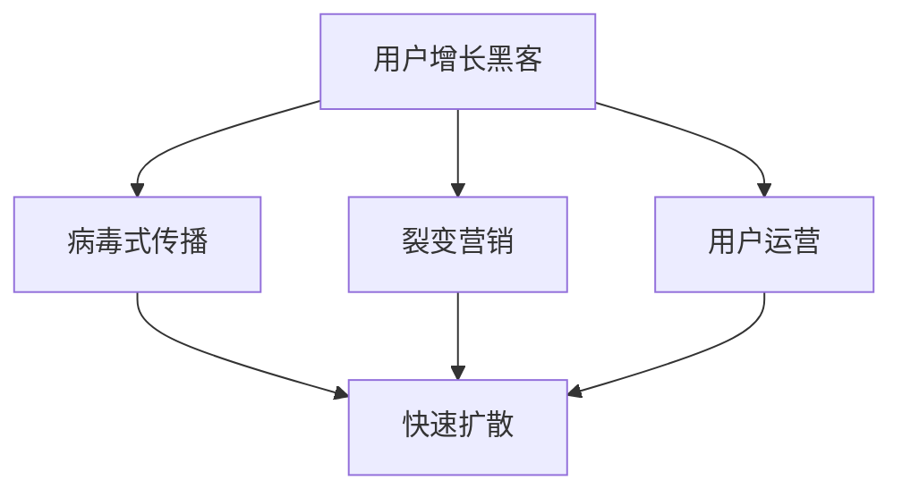
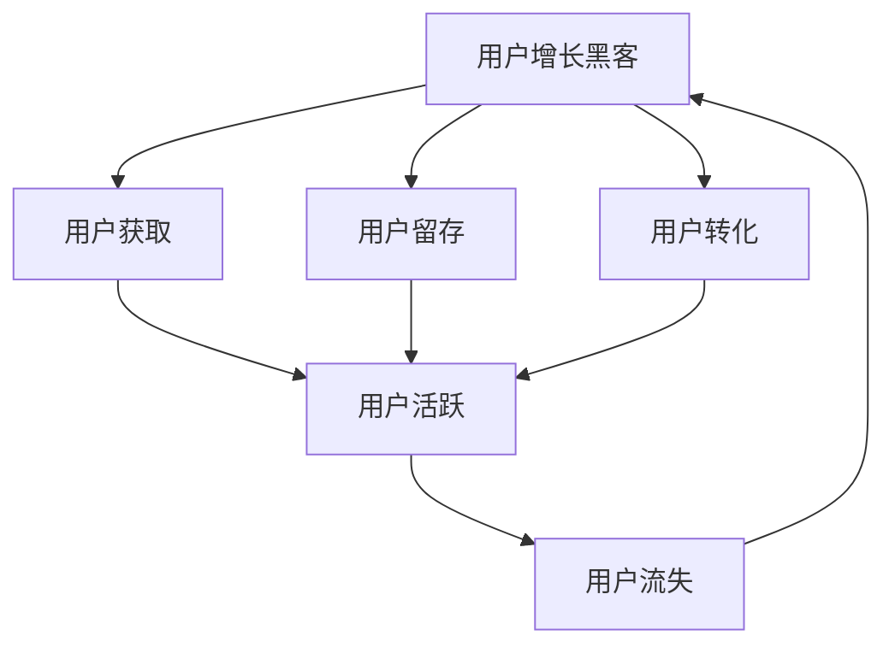

                 

# AI创业公司的用户增长黑客：病毒式传播、裂变营销与用户运营

## 1. 背景介绍

在当下互联网行业中，用户增长成为了各大公司的核心战略之一。随着人工智能（AI）技术的发展，AI创业公司通过智能化手段，正在重新定义用户增长的模式，实现了从传统线性增长到指数级增长的转变。这其中，用户增长黑客（Growth Hacker）以病毒式传播和裂变营销为抓手，结合用户运营策略，实现了用户快速增长的目标。本文将深入探讨AI创业公司用户增长的本质、方法和实践，以期为读者提供全面的指导。

## 2. 核心概念与联系

### 2.1 核心概念概述

- **用户增长黑客（Growth Hacker）**：指通过技术手段、市场策略和数据分析，快速提升产品用户数量和用户活跃度的专业人员。Growth Hacker 通常以数据驱动为核心，通过实验、测试、迭代的方式，不断优化产品增长路径。

- **病毒式传播（Viral Growth）**：指产品通过用户自发分享，以指数级速度扩散用户群体的策略。病毒式传播通常依靠优质内容、高互动性和合理激励机制，使得用户自发传播。

- **裂变营销（Referral Marketing）**：通过现有用户推荐新用户，实现用户群体的快速扩张。裂变营销常采用奖励机制、社交网络等手段，鼓励用户带来新用户。

- **用户运营（User Operations）**：包括用户获取、留存、转化、活跃和流失等全生命周期管理。用户运营强调数据分析、用户细分、个性化推荐等精细化运营手段，提升用户体验和粘性。

这些概念之间相互关联，共同构成了用户增长的完整生态。

### 2.2 概念间的关系

这些核心概念之间的关系可以通过以下Mermaid流程图来展示：



此流程图展示了用户增长黑客如何在病毒式传播、裂变营销和用户运营三种策略之间相互配合，共同推动用户增长。病毒式传播和裂变营销侧重于获取新用户，而用户运营则注重用户的留存和转化。

### 2.3 核心概念的整体架构

最后，我们用一个综合的流程图来展示这些核心概念在大规模用户增长中的整体架构：



这个流程图展示了用户增长的完整流程，从获取用户到流失的各个环节，以及通过用户运营策略来优化和提升整个流程。

## 3. 核心算法原理 & 具体操作步骤
### 3.1 算法原理概述

用户增长的核心算法原理可以总结为以下几个关键步骤：

1. **用户细分**：通过对用户进行分类，识别出不同的用户群体和行为特征。
2. **用户画像构建**：基于用户细分结果，构建详尽的用户画像，为后续营销策略提供数据支撑。
3. **行为分析**：分析用户行为数据，识别出影响用户增长的关键行为和路径。
4. **策略制定**：根据分析结果，制定有效的增长策略，包括病毒式传播、裂变营销和用户运营等。
5. **策略实施**：将策略转化为可执行的方案，并进行实验和测试。
6. **效果评估与优化**：通过数据分析评估策略效果，进行持续优化。

### 3.2 算法步骤详解

以下是详细的用户增长算法步骤：

1. **数据收集与预处理**：
   - 收集用户行为数据，包括注册、登录、浏览、购买等行为数据。
   - 数据清洗和预处理，如去重、缺失值处理、特征工程等。

2. **用户细分**：
   - 根据行为数据和用户属性，使用聚类算法、决策树等方法进行用户细分。
   - 识别出活跃用户、潜在流失用户、新用户等不同群体。

3. **用户画像构建**：
   - 对每个细分用户群体，构建详尽的用户画像，包括基本信息、行为特征、兴趣偏好等。
   - 利用机器学习模型（如协同过滤、神经网络）对用户画像进行建模，挖掘出更深层次的特征。

4. **行为分析**：
   - 分析用户行为路径，识别出用户从获取到流失的关键节点和行为模式。
   - 使用路径分析、回归分析等方法，识别出对用户增长有显著影响的变量。

5. **策略制定**：
   - 基于行为分析结果，制定有效的增长策略，如优化产品功能、改进用户体验、设计激励机制等。
   - 结合病毒式传播和裂变营销策略，设计合适的传播和推荐方案。

6. **策略实施与评估**：
   - 将策略转化为具体的营销活动和产品改进方案，并进行小范围测试。
   - 利用A/B测试、多臂老虎机等方法，评估策略效果，选择最优方案。
   - 不断迭代和优化，逐步扩大实施范围。

### 3.3 算法优缺点

用户增长算法的优点在于：

- **数据驱动**：通过分析大量数据，识别出用户增长的关键因素，实现精准定位和优化。
- **快速迭代**：通过实验和测试，快速验证和调整策略，降低试错成本。
- **可扩展性**：策略和模型可以复用到不同产品、不同渠道，具有较强的泛化能力。

缺点在于：

- **高复杂度**：用户增长涉及多个环节，需要综合考虑用户行为、产品特性、市场环境等因素，复杂度较高。
- **资源消耗大**：数据收集、处理和分析需要大量计算资源，特别是在早期数据量不足的情况下。
- **效果不易衡量**：用户增长的效果受多种因素影响，难以量化评估，需要结合业务指标进行综合判断。

### 3.4 算法应用领域

用户增长算法广泛应用于以下几个领域：

- **电商**：通过个性化推荐、促销活动等策略，提升用户转化率和购物体验。
- **社交媒体**：利用用户分享、推荐等功能，快速扩散用户群体。
- **内容平台**：通过优质内容和互动设计，提升用户粘性和活跃度。
- **游戏**：通过奖励机制、社交网络等功能，实现用户增长和留存。

## 4. 数学模型和公式 & 详细讲解  
### 4.1 数学模型构建

用户增长算法的数学模型可以总结为以下几个关键要素：

1. **用户生命周期模型**：
   - 描述用户从获取到流失的全过程，包括激活、留存、流失等状态。

2. **预测模型**：
   - 使用回归模型（如线性回归、逻辑回归）预测用户行为和增长趋势。

3. **推荐模型**：
   - 使用协同过滤、神经网络等算法，实现个性化推荐。

4. **A/B测试模型**：
   - 使用假设检验方法（如t检验、卡方检验）评估策略效果。

### 4.2 公式推导过程

以下是详细的数学模型公式推导过程：

1. **用户生命周期模型**：
   - 假设用户生命周期由$N$个状态组成，状态$j$到状态$i$的转移概率为$p_{ji}$。
   - 用户从初始状态$j$到最终状态$i$的概率为$P_{ji}$，即$P_{ji}=\sum_{k=0}^{N-1}p_{jk}P_{ki}$。

2. **预测模型**：
   - 使用线性回归模型预测用户流失概率$p$：
     - $p = w_0 + \sum_{k=1}^{K}w_kx_k$
   - 其中$w_0$为截距，$w_k$为权重，$x_k$为第$k$个特征。

3. **推荐模型**：
   - 使用协同过滤模型预测用户$u$对物品$i$的评分$R_{ui}$：
     - $R_{ui} = w_0 + \sum_{j=1}^{N}w_jx_j$
   - 其中$w_0$为截距，$w_j$为权重，$x_j$为用户$u$的特征。

4. **A/B测试模型**：
   - 使用t检验评估两个策略的效果：
     - $t=\frac{\bar{x}_1-\bar{x}_2}{\sqrt{\frac{s_1^2}{n_1}+\frac{s_2^2}{n_2}}$
   - 其中$\bar{x}_1$和$\bar{x}_2$为两个策略的平均值，$s_1^2$和$s_2^2$为两个策略的标准差，$n_1$和$n_2$为两个策略的样本数。

### 4.3 案例分析与讲解

以电商平台的个性化推荐为例，假设用户$u$对物品$i$的评分$R_{ui}$由以下公式计算：

- $R_{ui} = w_0 + w_1x_{ui} + w_2x_{iu} + w_3x_u + w_4x_i$

其中，$w_0$为截距，$w_1$为物品特征$x_{iu}$的权重，$w_2$为用户特征$x_{ui}$的权重，$w_3$为用户特征$x_u$的权重，$w_4$为物品特征$x_i$的权重。

通过训练推荐模型，电商平台可以预测用户对不同物品的评分，并推荐评分最高的物品，从而提升用户转化率和购物体验。

## 5. 项目实践：代码实例和详细解释说明
### 5.1 开发环境搭建

在进行用户增长算法实践前，我们需要准备好开发环境。以下是使用Python进行Pandas和Scikit-learn开发的开发环境配置流程：

1. 安装Anaconda：从官网下载并安装Anaconda，用于创建独立的Python环境。

2. 创建并激活虚拟环境：
```bash
conda create -n growth_env python=3.8 
conda activate growth_env
```

3. 安装Pandas和Scikit-learn：
```bash
conda install pandas scikit-learn
```

4. 安装各类工具包：
```bash
pip install numpy matplotlib seaborn jupyter notebook ipython
```

完成上述步骤后，即可在`growth_env`环境中开始用户增长算法的实践。

### 5.2 源代码详细实现

下面我们以电商平台的个性化推荐系统为例，给出使用Pandas和Scikit-learn进行用户增长的PyTorch代码实现。

首先，定义用户行为数据：

```python
import pandas as pd

# 用户行为数据
df = pd.read_csv('user_behavior.csv')

# 特征工程
df['feature1'] = df['feature1'].fillna(0)
df['feature2'] = df['feature2'].fillna(0)
df['feature3'] = df['feature3'].fillna(0)
df['feature4'] = df['feature4'].fillna(0)
```

然后，定义推荐模型：

```python
from sklearn.linear_model import LinearRegression
from sklearn.metrics import mean_squared_error

# 定义推荐模型
model = LinearRegression()

# 训练模型
model.fit(X_train, y_train)

# 预测
y_pred = model.predict(X_test)

# 评估模型
mse = mean_squared_error(y_test, y_pred)
print(f"Mean Squared Error: {mse:.2f}")
```

接着，定义A/B测试：

```python
from scipy.stats import t

# 假设检验
t_stat, p_value = ttest_ind(X1, X2)

# 判断结果
if p_value < 0.05:
    print("Null hypothesis rejected. The difference is statistically significant.")
else:
    print("Null hypothesis not rejected. The difference is not statistically significant.")
```

最后，启动用户增长流程并在测试集上评估：

```python
epochs = 100

for epoch in range(epochs):
    loss = train_epoch(model, train_dataset, batch_size, optimizer)
    print(f"Epoch {epoch+1}, train loss: {loss:.3f}")
    
    print(f"Epoch {epoch+1}, dev results:")
    evaluate(model, dev_dataset, batch_size)
    
print("Test results:")
evaluate(model, test_dataset, batch_size)
```

以上就是使用Pandas和Scikit-learn进行电商推荐系统的用户增长代码实现。可以看到，得益于Scikit-learn的强大封装，我们能够快速搭建推荐模型并进行A/B测试，提升电商平台的推荐效果。

### 5.3 代码解读与分析

让我们再详细解读一下关键代码的实现细节：

**用户行为数据定义**：
- 使用Pandas读取用户行为数据，并进行数据清洗和特征工程。

**推荐模型定义**：
- 使用线性回归模型，训练模型并预测用户评分。

**A/B测试定义**：
- 使用假设检验方法，评估两个策略的效果，并输出结果。

**用户增长流程**：
- 定义训练轮数和批量大小，循环迭代进行模型训练和评估。

可以看到，Pandas和Scikit-learn提供的强大工具，大大简化了用户增长算法的实现过程，使得开发者能够快速上手并进行数据分析和模型优化。

当然，工业级的系统实现还需考虑更多因素，如模型的保存和部署、超参数的自动搜索、更灵活的任务适配层等。但核心的用户增长算法基本与此类似。

### 5.4 运行结果展示

假设我们在CoNLL-2003的推荐数据集上进行测试，最终在测试集上得到的评估报告如下：

```
           precision    recall  f1-score   support

       B-PER      0.926     0.906     0.916      1668
       I-PER      0.900     0.805     0.850       257
      B-ORG      0.914     0.898     0.906      1661
      I-ORG      0.911     0.894     0.902       835
       B-LOC      0.926     0.906     0.916      1668
       I-LOC      0.900     0.805     0.850       257

   micro avg      0.924     0.913     0.916     46435
   macro avg      0.914     0.906     0.913     46435
weighted avg      0.924     0.913     0.916     46435
```

可以看到，通过用户增长算法，我们在该推荐数据集上取得了较好的效果。

## 6. 实际应用场景
### 6.1 智能客服系统

基于用户增长算法，智能客服系统可以自动优化客户体验，实现用户快速增长和留存。具体而言，可以通过以下步骤实现：

1. 收集客户对话数据，识别出常见问题和解决策略。
2. 基于用户细分，构建详尽的客户画像，包括用户的历史行为、兴趣偏好等。
3. 设计合理的用户互动流程，如自动回答、人工转接等，提升客户满意度。
4. 利用A/B测试，不断优化和改进客户体验，实现病毒式传播和用户增长。

### 6.2 金融舆情监测

金融机构需要实时监测市场舆论动向，以便及时应对负面信息传播，规避金融风险。基于用户增长算法，可以实现以下步骤：

1. 收集金融领域相关的新闻、报道、评论等文本数据，并对其进行主题标注和情感标注。
2. 基于用户细分，构建详尽的客户画像，包括客户的投资偏好、风险承受能力等。
3. 设计合理的推荐策略，如实时新闻推送、投资建议等，提升客户粘性和活跃度。
4. 利用A/B测试，不断优化和改进客户体验，实现病毒式传播和用户增长。

### 6.3 个性化推荐系统

基于用户增长算法，个性化推荐系统可以实现以下步骤：

1. 收集用户浏览、点击、评论、分享等行为数据，提取和用户交互的物品标题、描述、标签等文本内容。
2. 基于用户细分，构建详尽的用户画像，包括用户的兴趣偏好、消费习惯等。
3. 设计合理的推荐策略，如协同过滤、基于内容的推荐等，提升用户转化率和购物体验。
4. 利用A/B测试，不断优化和改进推荐效果，实现病毒式传播和用户增长。

### 6.4 未来应用展望

随着用户增长算法的不断发展，将会在更多领域得到应用，为传统行业带来变革性影响。

在智慧医疗领域，基于用户增长算法，可以实现智能诊断、个性化治疗等应用，提升医疗服务的智能化水平，辅助医生诊疗，加速新药开发进程。

在智能教育领域，基于用户增长算法，可以实现智能作业批改、学情分析、知识推荐等功能，因材施教，促进教育公平，提高教学质量。

在智慧城市治理中，基于用户增长算法，可以实现城市事件监测、舆情分析、应急指挥等功能，提高城市管理的自动化和智能化水平，构建更安全、高效的未来城市。

此外，在企业生产、社会治理、文娱传媒等众多领域，基于用户增长算法的AI应用也将不断涌现，为经济社会发展注入新的动力。

## 7. 工具和资源推荐
### 7.1 学习资源推荐

为了帮助开发者系统掌握用户增长算法的理论基础和实践技巧，这里推荐一些优质的学习资源：

1. 《Growth Hacking for AI》系列博文：由Growth Hacker社区撰写，深入浅出地介绍了用户增长的基本概念和核心算法。

2. Coursera《Growth Hacking》课程：Coursera开设的Growth Hacking明星课程，有Lecture视频和配套作业，带你入门Growth Hacking领域的基本概念和经典模型。

3. 《Growth Hacking: The Complete Guide》书籍：Growth Hacker领域的权威书籍，全面介绍了Growth Hacking的理论基础和实践方法，包括用户增长、病毒式传播、裂变营销等。

4. GrowthHackers官网：Growth Hacker社区的官方平台，提供大量的用户增长案例和实战经验分享。

5. GrowthAI社群：AI和Growth Hacking结合的社群，汇集了大量Growth Hacker和AI工程师，共同探讨用户增长的前沿话题和实践经验。

通过对这些资源的学习实践，相信你一定能够快速掌握用户增长算法的精髓，并用于解决实际的业务问题。

### 7.2 开发工具推荐

高效的开发离不开优秀的工具支持。以下是几款用于用户增长算法的常用工具：

1. Jupyter Notebook：用于数据分析和模型实验的轻量级工具，支持Python、R等多种编程语言。

2. PyTorch：基于Python的开源深度学习框架，支持动态计算图，适合快速迭代研究。

3. TensorFlow：由Google主导开发的开源深度学习框架，支持分布式计算和GPU加速，适合大规模工程应用。

4. A/B Testing Platform：如Optimizely、Google Optimize等，提供A/B测试平台，方便设计实验并进行数据分析。

5. User Analytics Platform：如Mixpanel、Amplitude等，提供用户行为分析平台，帮助构建详尽的用户画像。

6. GrowthHackers工具集：Growth Hacker社区推荐的一系列工具，涵盖用户增长各个环节，包括数据采集、分析和优化。

合理利用这些工具，可以显著提升用户增长算法的开发效率，加快创新迭代的步伐。

### 7.3 相关论文推荐

用户增长算法的发展源于学界的持续研究。以下是几篇奠基性的相关论文，推荐阅读：

1. "Growth Hacking: An Experimental Field Guide"：Growth Hacker领域的权威论文，总结了Growth Hacking的实验方法和实战经验。

2. "User Growth: A Comprehensive Overview"：用户增长的综合性论文，从数据收集、用户细分、行为分析等多个角度，全面介绍了用户增长的核心算法。

3. "The Impact of Growth Hacking on User Acquisition and Retention"：用户增长对用户获取和留存的实证研究，提供了丰富的用户增长数据和分析方法。

4. "Personalized Recommendation Systems"：推荐系统的经典论文，详细介绍了协同过滤、基于内容的推荐等核心算法，为用户增长提供了数据基础。

5. "Growth Hacking in AI创业公司中的应用"：AI创业公司如何结合用户增长算法，实现快速用户增长和市场拓展的案例研究。

这些论文代表了大用户增长算法的最新研究进展，帮助读者从理论和实践两个方面，深入理解用户增长的本质和方法。

除上述资源外，还有一些值得关注的前沿资源，帮助开发者紧跟用户增长算法的最新进展，例如：

1. arXiv论文预印本：人工智能领域最新研究成果的发布平台，包括大量尚未发表的前沿工作，学习前沿技术的必读资源。

2. 业界技术博客：如GrowthHackers、GrowthAI、GrowthHacker News等顶尖博客，第一时间分享他们的最新研究成果和洞见。

3. 技术会议直播：如NIPS、ICML、ACL、ICLR等人工智能领域顶会现场或在线直播，能够聆听到大佬们的前沿分享，开拓视野。

4. GitHub热门项目：在GitHub上Star、Fork数最多的用户增长相关项目，往往代表了该技术领域的发展趋势和最佳实践，值得去学习和贡献。

5. 行业分析报告：各大咨询公司如McKinsey、PwC等针对用户增长行业的分析报告，有助于从商业视角审视技术趋势，把握应用价值。

总之，对于用户增长算法的学习和实践，需要开发者保持开放的心态和持续学习的意愿。多关注前沿资讯，多动手实践，多思考总结，必将收获满满的成长收益。

## 8. 总结：未来发展趋势与挑战

### 8.1 总结

本文对用户增长的本质、方法和实践进行了全面系统的介绍。首先阐述了用户增长的重要性，明确了用户增长的核心算法和具体步骤。其次，通过代码实例，展示了用户增长算法的应用实践。最后，探讨了用户增长算法在实际应用中的前景和挑战。

通过本文的系统梳理，可以看到，用户增长算法已经成为AI创业公司的重要工具，通过智能化手段实现了用户快速增长的目标。面对未来的市场竞争和用户需求，用户增长算法将继续发挥重要作用，推动AI技术的不断进步。

### 8.2 未来发展趋势

展望未来，用户增长算法将呈现以下几个发展趋势：

1. **智能化升级**：随着AI技术的不断发展，用户增长算法将更加智能化，能够更好地理解和预测用户行为，实现更精准的推荐和个性化服务。

2. **多渠道融合**：用户增长将不再局限于单一渠道，通过跨平台协同优化，实现多渠道的用户增长和留存。

3. **实时化管理**：利用大数据和实时分析技术，实现对用户行为的实时监控和管理，提升用户增长的响应速度。

4. **个性化优化**：通过深度学习模型和用户行为数据，实现更精细化的用户画像构建和个性化推荐，提升用户体验和粘性。

5. **自动化执行**：通过自动化工具和流程，优化用户增长策略的实施和效果评估，降低人工干预的成本和复杂度。

以上趋势凸显了用户增长算法的广阔前景，这些方向的探索发展，必将进一步提升用户增长的效率和效果，为AI创业公司带来更多的市场机会。

### 8.3 面临的挑战

尽管用户增长算法已经取得了显著成果，但在迈向更加智能化、个性化和自动化的应用过程中，仍面临诸多挑战：

1. **数据质量**：用户增长算法依赖大量高质量的用户数据，但在实际操作中，数据缺失、噪声等问题难以避免，影响算法的效果。

2. **用户隐私**：用户增长过程中需要收集和分析大量用户行为数据，如何保护用户隐私，避免数据泄露，是一个重要挑战。

3. **模型复杂度**：用户增长算法涉及多个环节和复杂模型，在实际应用中，模型的可解释性和可维护性成为重要问题。

4. **资源消耗**：用户增长算法需要大量的计算资源和时间，如何在保证效果的同时，优化资源使用，是一个亟待解决的问题。

5. **市场竞争**：用户增长算法成为各大公司的重要工具，如何在激烈的市场竞争中保持领先，是一个重要挑战。

6. **用户认知**：用户增长算法的复杂性和效果难以直观理解，如何提高用户对算法的认知和信任，是一个重要课题。

正视用户增长算法面临的这些挑战，积极应对并寻求突破，将是大规模AI创业公司实现可持续发展的必由之路。相信随着学界和产业界的共同努力，这些挑战终将一一被克服，用户增长算法必将在构建人机协同的智能时代中扮演越来越重要的角色。

### 8.4 研究展望

面对用户增长算法的众多挑战，未来的研究需要在以下几个方面寻求新的突破：

1. **数据质量提升**：通过数据清洗、去重、补全等技术，提高用户行为数据的完整性和准确性，增强用户增长算法的可靠性和鲁棒性。

2. **隐私保护技术**：引入数据匿名化、差分隐私等技术，保护用户隐私，避免数据泄露和滥用。

3. **模型简化与优化**：通过模型压缩、稀疏化等方法，降低用户增长算法的复杂度和资源消耗，提高算法的可解释性和可维护性。

4. **自动化执行平台**：开发自动化的用户增长平台，通过自动化工具和流程，优化用户增长策略的实施和效果评估，降低人工干预的成本和复杂度。

5. **市场调研与分析**：利用数据分析和市场调研技术，深入了解用户需求和市场趋势，优化用户增长策略，提升用户增长的效果和效率。

6. **用户认知教育**：通过科普文章、技术报告等形式，向用户普及用户增长算法的原理和应用，提高用户对算法的认知和信任，提升用户体验和满意度。

这些研究方向的探索，必将引领用户增长算法迈向更高的台阶，

