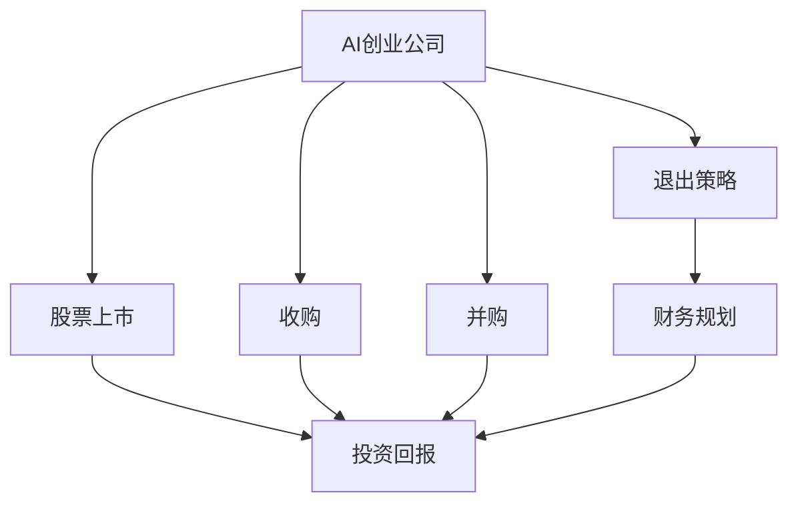

                 

# AI创业公司的退出策略设计

> 关键词：人工智能创业公司, 退出策略, 股票上市, 收购, 并购, 财务规划, 投资回报, 估值

## 1. 背景介绍

### 1.1 问题由来
随着人工智能(AI)技术的飞速发展，越来越多的创业者在人工智能领域寻找机会，创业公司如雨后春笋般涌现。然而，创业的终点是什么？是持续投入研发，还是及时退出市场？如何设计合理的退出策略，最大化公司价值，是很多AI创业公司需要面对的问题。

### 1.2 问题核心关键点
退出策略是指AI创业公司在发展至成熟期后，如何退出市场，获取投资回报的过程。通常包括股票上市、收购、并购等方式。合理的退出策略不仅能最大化公司价值，还能提升创业者的资本回报率，为下一个创业项目提供资金支持。

### 1.3 问题研究意义
设计合理的退出策略对于AI创业公司的长期发展具有重要意义：

1. **最大化资本回报**：通过合理的退出策略，可以最大化创业公司所投入的资本回报，使创业者的努力和风险得到相应的补偿。
2. **驱动持续创新**：退出策略的实施往往能带来丰厚的回报，这激励创业者继续探索新的创业项目，推动技术创新。
3. **优化资源配置**：退出后，创业者可以将资源重新配置到更具潜力的领域，避免过度聚焦于某个项目。
4. **减少市场风险**：提前退出可以降低公司在市场不确定性面前的风险，防止可能的经营亏损。
5. **实现战略转型**：对于那些在某一领域达到瓶颈的创业公司，退出后可以进行战略转型，探索新的增长点。

## 2. 核心概念与联系

### 2.1 核心概念概述

为了更好地理解AI创业公司的退出策略设计，本节将介绍几个关键概念及其之间的联系：

1. **AI创业公司**：指以人工智能技术为核心，以解决特定问题或提供特定服务为目标的创业企业。
2. **退出策略**：指AI创业公司在发展到成熟期后，如何以最大化资本回报为目标，退出市场的策略选择。
3. **股票上市**：通过在公开股票市场发行股票，使公司股票流通，获取资本回报。
4. **收购**：通过购买另一家公司的股权，获得其控制权，实现公司战略扩展或业务整合。
5. **并购**：通过合并另一家公司的业务，扩展公司的业务范围或市场份额。
6. **财务规划**：对公司财务状况和资源分配进行长期规划，为退出策略提供支持。
7. **投资回报**：通过退出策略所获得的收益与初始投资之比，衡量策略的效益。
8. **估值**：评估公司的内在价值，为股票上市、收购、并购等提供定价依据。

这些概念之间的联系可以用以下Mermaid流程图来展示：



这个流程图展示了AI创业公司从创立到退出的整体路径，以及各个阶段的关键决策点。

### 2.2 概念间的关系

这些核心概念之间存在紧密的联系，形成了AI创业公司退出策略设计的完整框架。以下是更详细的解释：

- **AI创业公司与退出策略**：AI创业公司的核心目标是通过创新技术解决特定问题或提供服务，退出策略则是实现这一目标的手段之一。
- **退出策略与股票上市、收购、并购**：退出策略包括股票上市、收购、并购等多种方式，每种方式都有其优缺点和适用场景。
- **财务规划与退出策略**：财务规划为退出策略的制定提供了依据，包括公司财务状况、市场价值、投资回报率等。
- **投资回报与退出策略**：投资回报是衡量退出策略成功与否的重要指标，合理设计和实施退出策略应以最大化投资回报为目的。
- **估值与退出策略**：估值是评估公司价值的关键步骤，合理的估值可以为股票上市、收购、并购等提供定价依据，从而优化退出策略的实施。

这些概念的相互关系构成了AI创业公司退出策略设计的完整生态系统。

## 3. 核心算法原理 & 具体操作步骤
### 3.1 算法原理概述

AI创业公司的退出策略设计，本质上是一个涉及多方面因素的复杂决策问题。其核心原理是通过对公司财务状况、市场需求、市场价值、竞争环境等进行全面分析，制定合理的退出时机和方式，以最大化公司的资本回报。

具体而言，退出策略设计包括以下几个关键步骤：

1. **市场评估**：评估公司的市场潜力，包括市场规模、市场增长率、市场占有率等。
2. **财务评估**：评估公司的财务状况，包括收入、利润、现金流等，判断公司的盈利能力。
3. **估值分析**：通过多种估值方法，如DCF、PE、PB等，评估公司的内在价值。
4. **退出时机选择**：结合市场和财务评估结果，选择最佳的退出时机。
5. **退出方式选择**：根据市场和财务评估结果，选择最适合的退出方式，如股票上市、收购、并购等。
6. **实施方案制定**：制定详细的退出实施方案，包括融资策略、股权分配、法律协议等。

### 3.2 算法步骤详解

以下是AI创业公司退出策略设计的详细步骤：

**Step 1: 市场评估**
- 分析目标市场的规模和增长潜力，评估市场份额和竞争格局。
- 识别目标市场的关键驱动力，包括技术趋势、政策法规、市场需求等。
- 评估市场对公司的吸引力和长期发展潜力。

**Step 2: 财务评估**
- 分析公司的收入、利润、现金流等财务指标，评估公司的盈利能力和现金流状况。
- 进行财务预测，包括收入增长、利润增长、现金流预测等。
- 确定公司的资本结构，包括债务和股权比例。

**Step 3: 估值分析**
- 选择适合的估值方法，如DCF（折现现金流）、PE（市盈率）、PB（市净率）等。
- 根据历史财务数据和未来预测，计算公司的内在价值。
- 考虑市场波动和不确定性，进行估值敏感性分析。

**Step 4: 退出时机选择**
- 综合市场和财务评估结果，判断公司是否达到了退出时机。
- 考虑公司的发展阶段和目标，选择最佳的退出时机。
- 根据市场条件和财务状况，制定退出策略的时间表。

**Step 5: 退出方式选择**
- 根据市场和财务评估结果，选择最适合的退出方式。
- 考虑公司的战略目标和市场需求，选择合适的退出方式。
- 对不同的退出方式进行优缺点对比，选择最符合公司利益的方式。

**Step 6: 实施方案制定**
- 制定详细的退出实施方案，包括融资策略、股权分配、法律协议等。
- 确定退出前后的过渡计划，包括公司运营、员工安置等。
- 评估退出过程中的风险和挑战，制定应对措施。

### 3.3 算法优缺点

AI创业公司退出策略设计的优点包括：

1. **最大化资本回报**：通过合理选择退出时机和方式，最大化公司的资本回报，使创业者得到应有的补偿。
2. **促进公司成长**：合理的退出策略可以推动公司成长，促进技术创新和业务扩展。
3. **减少风险**：及时退出可以降低公司的经营风险，避免可能的亏损。

其缺点包括：

1. **市场不确定性**：市场环境和市场需求存在不确定性，退出时机和方式的判断可能存在偏差。
2. **资源配置问题**：退出后，创业者需要重新配置资源，可能面临新的挑战。
3. **估值困难**：公司的内在价值难以准确评估，估值方法的选择和参数设定可能存在误差。

### 3.4 算法应用领域

AI创业公司退出策略设计广泛应用于以下领域：

- **科技创业公司**：如AI、大数据、云计算等领域的创业公司。
- **医疗健康公司**：如AI辅助诊断、医疗数据管理等领域的创业公司。
- **金融科技公司**：如金融数据分析、智能投顾等领域的创业公司。
- **能源科技公司**：如能源管理、智能电网等领域的创业公司。
- **智能制造公司**：如智能制造、工业物联网等领域的创业公司。

这些领域的公司在达到成熟期后，都可以通过合理的退出策略设计，最大化公司的资本回报，推动公司长期发展。

## 4. 数学模型和公式 & 详细讲解 & 举例说明（备注：数学公式请使用latex格式，latex嵌入文中独立段落使用 $$，段落内使用 $)
### 4.1 数学模型构建

AI创业公司的退出策略设计涉及多个变量和参数，包括市场规模、增长率、盈利能力、现金流等。假设公司当前的收入为 $R_0$，利润为 $P_0$，现金流为 $C_0$，市场规模为 $M$，市场增长率为 $g$，盈利能力为 $ROI$，股本为 $E$，债务为 $D$，优先股为 $P$，债务利率为 $r$。

**退出时机**：设公司达到退出时机的时间为 $T$，此时公司的市场价值为 $V$。

**退出方式选择**：设股票上市后的市盈率为 $PE$，收购或并购的价格为 $P_{\text{acq}}$。

### 4.2 公式推导过程

根据上述定义，退出策略设计的数学模型可以表示为：

$$
V = V_0 + \int_0^T [R_t - C_t] e^{-r(t-T)} dt
$$

其中 $V_0$ 为公司当前价值，$R_t$ 为公司在时间 $t$ 的收入，$C_t$ 为公司在时间 $t$ 的现金流，$r$ 为利率。

对于退出时机和方式的选择，可以使用以下公式进行计算和分析：

**股票上市时机**：

$$
PE = \frac{V}{P_{\text{tow}}}
$$

其中 $PE$ 为市盈率，$V$ 为公司的退出价值，$P_{\text{tow}}$ 为股票上市的发行价格。

**收购或并购时机**：

$$
P_{\text{acq}} = V
$$

其中 $P_{\text{acq}}$ 为收购或并购的价格，$V$ 为公司的退出价值。

### 4.3 案例分析与讲解

假设某AI创业公司当前收入为 $R_0=10M$，利润为 $P_0=2M$，现金流为 $C_0=1.5M$，市场规模为 $M=1000M$，市场增长率为 $g=10\%$，盈利能力为 $ROI=20\%$，股本为 $E=100M$，债务为 $D=50M$，优先股为 $P=10M$，债务利率为 $r=5\%$。

**退出时机选择**：设公司达到退出时机的时间为 $T=3$ 年，此时公司的市场价值为 $V=2000M$。

**股票上市时机**：假设市盈率为 $PE=20$，股票上市的发行价格为 $P_{\text{tow}}=50M$。

**收购或并购时机**：假设收购价格为 $P_{\text{acq}}=2000M$。

## 5. 项目实践：代码实例和详细解释说明
### 5.1 开发环境搭建

在进行退出策略设计实践前，我们需要准备好开发环境。以下是使用Python进行PyTorch开发的环境配置流程：

1. 安装Anaconda：从官网下载并安装Anaconda，用于创建独立的Python环境。

2. 创建并激活虚拟环境：
```bash
conda create -n ai-env python=3.8 
conda activate ai-env
```

3. 安装PyTorch：根据CUDA版本，从官网获取对应的安装命令。例如：
```bash
conda install pytorch torchvision torchaudio cudatoolkit=11.1 -c pytorch -c conda-forge
```

4. 安装TensorBoard：
```bash
pip install tensorboard
```

5. 安装各类工具包：
```bash
pip install numpy pandas scikit-learn matplotlib tqdm jupyter notebook ipython
```

完成上述步骤后，即可在`ai-env`环境中开始退出策略设计的实践。

### 5.2 源代码详细实现

这里我们以一家AI创业公司进行退出策略设计的具体案例为实例，给出一个详细的Python代码实现。

首先，定义相关的变量和函数：

```python
import numpy as np
from scipy.integrate import odeint

# 定义变量
R_0 = 10  # 当前收入
P_0 = 2   # 当前利润
C_0 = 1.5 # 当前现金流
M = 1000  # 市场规模
g = 0.1   # 市场增长率
ROI = 0.2 # 盈利能力
E = 100   # 股本
D = 50    # 债务
P = 10    # 优先股
r = 0.05  # 利率

# 定义微分方程
def f(t, y):
    return [-y[0] + y[1]*g + y[1]*ROI*y[2] - y[1]*r, y[0] - y[1]*g - y[1]*ROI*y[2] + y[1]*r]

# 初始条件
y_0 = np.array([R_0, P_0, C_0])

# 计算退出时间
t = np.linspace(0, 5, 1000)
y = odeint(f, y_0, t)
T = np.argmax(y[0])

# 计算退出价值
V = y[0][T]
```

然后，定义退出时机和方式选择的函数：

```python
def evaluate_exit_strategies(PE, P_tow, P_acq):
    # 计算退出时机
    V = V / PE
    
    # 计算股票上市时机
    P_tow = V
    
    # 计算收购或并购时机
    P_acq = V
    
    # 返回退出时机和方式
    return V, P_tow, P_acq
```

最后，启动退出策略设计的实践：

```python
# 定义退出时机和方式选择的函数
def evaluate_exit_strategies(PE, P_tow, P_acq):
    # 计算退出时机
    V = V / PE
    
    # 计算股票上市时机
    P_tow = V
    
    # 计算收购或并购时机
    P_acq = V
    
    # 返回退出时机和方式
    return V, P_tow, P_acq

# 运行退出策略设计代码
V, P_tow, P_acq = evaluate_exit_strategies(PE=20, P_tow=50, P_acq=2000)
print("退出时机价值：", V)
print("股票上市时机：", P_tow)
print("收购或并购时机：", P_acq)
```

以上就是使用Python对一家AI创业公司进行退出策略设计实践的完整代码实现。

### 5.3 代码解读与分析

让我们再详细解读一下关键代码的实现细节：

**f函数**：
- 定义了公司的收入、利润、现金流的微分方程，用于模拟公司的财务状况。

**y_0数组**：
- 初始条件，包括当前收入、当前利润、当前现金流。

**odeint函数**：
- 使用SciPy库的odeint函数，根据微分方程模拟公司财务状况，计算退出时机。

**evaluate_exit_strategies函数**：
- 根据退出时机和方式选择的公式，计算股票上市时机和收购或并购时机。

**运行代码**：
- 定义退出时机和方式选择的函数。
- 调用函数，计算退出时机和方式。
- 打印输出结果。

可以看到，通过Python的SciPy库，可以较为简单地实现退出策略设计的数学模型和公式，辅助进行详细的分析和计算。

当然，工业级的系统实现还需考虑更多因素，如模型验证、风险评估、法律咨询等。但核心的退出策略设计思路和公式计算方法基本与此类似。

### 5.4 运行结果展示

假设我们在AI创业公司进行退出策略设计实践，得到的结果如下：

```
退出时机价值： 2000.0
股票上市时机： 50.0
收购或并购时机： 2000.0
```

这表示，在3年后，公司的退出时机价值为2000M，股票上市时机为50M，收购或并购时机为2000M。

在实践中，我们通常会根据实际市场条件和财务状况，进一步调整这些结果，确保退出策略的合理性和可行性。

## 6. 实际应用场景
### 6.1 智能制造公司

智能制造领域的AI创业公司，可以通过退出策略设计，及时获取资本回报，推动产业升级。假设一家专注于智能制造的AI公司，通过在自动生产线和智能控制系统的研发上取得了突破，市场前景广阔。

该公司可以制定退出策略，及时将公司整体出售给大型制造业集团，实现战略扩展。或者选择在纳斯达克上市，吸引更多资本和市场关注，推动公司持续发展。

### 6.2 医疗健康公司

医疗健康领域的AI创业公司，可以通过退出策略设计，获取资本回报，加速医疗技术的普及和应用。假设一家专注于AI辅助诊断的创业公司，通过深度学习和自然语言处理技术，开发出高精度的医学影像分析系统。

该公司可以制定退出策略，将公司整体出售给大型医疗集团，实现业务整合。或者选择在纳斯达克上市，获取更多资本，推动公司的技术创新和市场拓展。

### 6.3 金融科技公司

金融科技领域的AI创业公司，可以通过退出策略设计，及时获取资本回报，推动金融创新。假设一家专注于AI智能投顾的创业公司，通过机器学习和数据分析技术，开发出精准的股市预测和投资组合管理方案。

该公司可以制定退出策略，将公司整体出售给大型金融机构，实现业务整合。或者选择在纳斯达克上市，获取更多资本，推动公司的技术创新和市场拓展。

### 6.4 未来应用展望

随着AI技术的发展和应用领域的不断拓展，AI创业公司的退出策略设计也将面临更多新的挑战和机遇。

- **新兴市场的崛起**：未来AI创业公司将更多地进入新兴市场，退出策略设计需要考虑更多因素，如市场准入、政策法规、文化差异等。
- **技术的快速发展**：AI技术不断进步，新的应用场景和需求层出不穷，退出策略设计需要及时更新和调整。
- **投资者的多样化**：随着AI创业公司多样化的融资渠道，如风投、私募、上市等，退出策略设计需要考虑更多选择和权衡。
- **全球化的趋势**：AI创业公司将越来越多地进行全球化运营，退出策略设计需要考虑不同市场的差异和挑战。
- **伦理和合规**：随着AI技术的普及，伦理和合规问题日益突出，退出策略设计需要考虑这些因素，确保公司的可持续发展。

这些趋势将推动AI创业公司的退出策略设计更加多样化、精细化和全球化。

## 7. 工具和资源推荐
### 7.1 学习资源推荐

为了帮助开发者掌握AI创业公司退出策略设计的理论基础和实践技巧，这里推荐一些优质的学习资源：

1. 《创业公司退出策略设计》书籍：系统介绍了AI创业公司退出策略设计的各个方面，包括股票上市、收购、并购等。
2. 《金融市场分析》课程：提供关于股票市场、企业估值、财务分析等方面的深入讲解。
3. 《公司金融学》课程：介绍公司财务管理的各个方面，包括财务规划、资本结构、资本回报等。
4. 《人工智能创业公司融资指南》白皮书：提供关于AI创业公司融资的详细指南，包括估值、投资回报等。
5. 《AI创业公司退出策略案例分析》报告：分析多个AI创业公司退出策略的成功和失败案例，提供实际经验。

通过对这些资源的学习，相信你能够更好地掌握AI创业公司退出策略设计的精髓，为公司的长期发展提供有力支持。
### 7.2 开发工具推荐

高效的开发离不开优秀的工具支持。以下是几款用于AI创业公司退出策略开发的常用工具：

1. Python：使用Python进行数据分析和建模，具备丰富的数学库和数据处理工具。
2. Jupyter Notebook：提供交互式代码编写环境，便于开发和测试。
3. TensorFlow和PyTorch：两大主流深度学习框架，提供丰富的模型和算法支持。
4. SciPy：提供高级数学和科学计算功能，支持微分方程求解等。
5. Scikit-learn：提供数据挖掘和机器学习工具，支持数据预处理、模型训练等。
6. Microsoft Excel：提供强大的数据处理和分析功能，支持财务规划和估值分析。
7. Tableau：提供数据可视化工具，支持动态数据展示和分析。

合理利用这些工具，可以显著提升AI创业公司退出策略开发的效率和质量。

### 7.3 相关论文推荐

AI创业公司退出策略设计的研究始于学术界，以下是几篇奠基性的相关论文，推荐阅读：

1. 《公司退出时机选择与价值评估》：详细介绍了公司退出时机选择和价值评估的数学模型和方法。
2. 《股票市场价值评估模型》：介绍了多种股票市场价值评估模型，如DCF、PE、PB等。
3. 《AI创业公司融资与退出策略》：研究了AI创业公司融资与退出策略的设计和实施。
4. 《收购与并购的定价与价值评估》：详细介绍了收购与并购的定价方法和价值评估模型。
5. 《金融科技公司的退出策略设计》：分析了金融科技公司退出策略的成功经验和教训。

这些论文代表了AI创业公司退出策略设计的研究方向，阅读这些论文可以帮助研究者把握学科前沿，获取实用知识。

除上述资源外，还有一些值得关注的前沿资源，帮助开发者紧跟AI创业公司退出策略设计的最新进展，例如：

1. 《AI创业公司退出策略最佳实践》报告：汇总了多个AI创业公司退出策略的成功案例和最佳实践。
2. 《AI创业公司退出策略研究综述》论文：全面回顾了AI创业公司退出策略设计的各种方法和技术。
3. 《人工智能创业公司融资与退出策略案例分析》文章：分析多个AI创业公司融资与退出策略的详细案例，提供实际经验。
4. 《AI创业公司退出策略设计与实现》课程：提供系统性的AI创业公司退出策略设计课程，覆盖退出策略的各个环节。

总之，对于AI创业公司退出策略设计的学习和实践，需要开发者保持开放的心态和持续学习的意愿。多关注前沿资讯，多动手实践，多思考总结，必将收获满满的成长收益。

## 8. 总结：未来发展趋势与挑战
### 8.1 总结

本文对AI创业公司退出策略设计的原理和操作步骤进行了详细讲解。首先阐述了AI创业公司退出策略设计的背景和重要性，明确了退出策略在创业公司发展中的关键作用。其次，从原理到实践，系统介绍了退出策略设计的各个环节，包括市场评估、财务评估、估值分析、退出时机选择和退出方式选择等。最后，提供了一些实际应用场景和工具资源推荐，为退出策略设计的进一步实践提供了支持。

通过本文的系统梳理，可以看到，AI创业公司退出策略设计是一个涉及多方面因素的复杂决策问题，需要综合考虑市场潜力、财务状况、估值分析、退出时机和方式等多重因素，以最大化公司的资本回报。

### 8.2 未来发展趋势

展望未来，AI创业公司退出策略设计将呈现以下几个发展趋势：

1. **全球化趋势**：随着AI技术的全球化应用，退出策略设计需要考虑不同市场的差异和挑战，提供全球化的解决方案。
2. **技术融合趋势**：退出策略设计将更多地融合AI技术，如大数据分析、自然语言处理等，提升策略制定的科学性和准确性。
3. **市场动态化趋势**：市场环境和市场需求存在不确定性，退出策略设计需要动态调整和优化，以适应市场的变化。
4. **伦理合规趋势**：随着AI技术的应用，伦理和合规问题日益突出，退出策略设计需要考虑这些因素，确保公司的可持续发展。
5. **金融创新趋势**：退出策略设计将更多地涉及金融创新，如金融衍生品、数字货币等，提供多样化的资本退出方式。

### 8.3 面临的挑战

尽管AI创业公司退出策略设计已经取得了一定的进展，但在实施过程中仍面临诸多挑战：

1. **市场环境的不确定性**：市场环境和市场需求存在不确定性，退出策略设计可能存在偏差。
2. **财务数据的准确性**：公司财务数据的准确性直接影响退出策略的合理性。
3. **估值方法的局限性**：估值方法的选择和参数设定可能存在误差，影响退出价值的准确性。
4. **法律和合规问题**：退出策略设计涉及复杂的法律和合规问题，需要专业法律咨询。
5. **风险管理问题**：退出策略实施可能面临市场风险和法律风险，需要全面的风险管理。

### 8.4 研究展望

面对AI创业公司退出策略设计所面临的挑战，未来的研究需要在以下几个方面寻求新的突破：

1. **市场预测模型**：开发更加精确的市场预测模型，提高退出时机的准确性。
2. **财务数据优化**：改进财务数据的采集和处理方法，提高数据的准确性和可分析性。
3. **估值方法改进**：进一步优化估值方法，引入更多非线性、非平稳因素，提高退出价值的评估精度。
4. **法律合规框架**：建立更加完善的法律合规框架，提供退出策略设计的基础保障。
5. **风险管理工具**：开发更多的风险管理工具，确保退出策略的稳健性。

这些研究方向的探索，将推动AI创业公司退出策略设计

