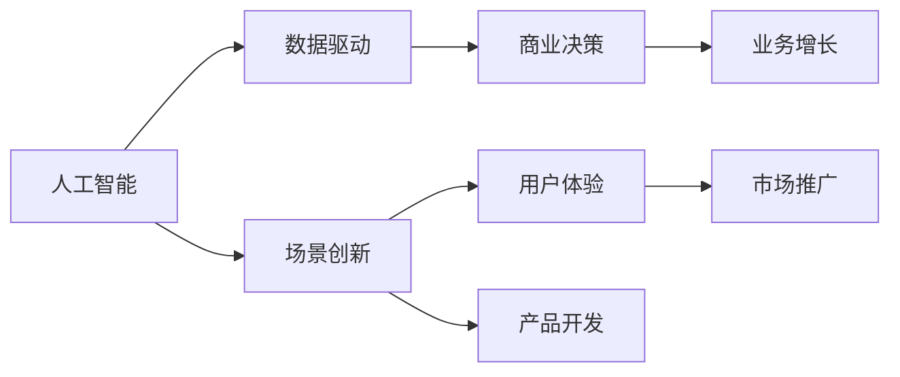

                 

# AI创业坚持：以用户为中心的场景创新

> 关键词：人工智能,创业,用户,场景创新,用户体验,技术,市场,产品,服务,数据,分析

## 1. 背景介绍

### 1.1 问题由来
在过去十年中，人工智能（AI）技术不断发展和普及，各行各业都在探索如何利用AI提升效率和创新。然而，对于许多初创企业来说，如何将AI技术与商业化结合，以及如何更好地满足用户需求，仍然是一个巨大的挑战。本博客旨在探讨这一问题，并分享一些以用户为中心的场景创新案例，为AI创业者和从业者提供灵感。

### 1.2 问题核心关键点
- **用户需求洞察**：了解用户痛点，提供针对性的解决方案。
- **数据驱动决策**：基于用户行为数据，优化产品和服务。
- **快速迭代**：快速响应市场反馈，持续改进产品。
- **跨部门协作**：市场、产品、技术等部门紧密合作，共同推进创新。
- **用户体验优化**：关注用户体验，提升用户满意度。

### 1.3 问题研究意义
理解并应用以用户为中心的场景创新，对于AI创业企业至关重要。通过深入研究，可以帮助企业更好地满足用户需求，提高产品竞争力，提升用户体验，最终实现业务增长。同时，这种创新模式也能推动AI技术在更多场景中的落地应用，促进社会进步。

## 2. 核心概念与联系

### 2.1 核心概念概述

本节将介绍几个关键概念，它们是理解和实现以用户为中心的场景创新的基础。

- **人工智能（AI）**：包括机器学习、深度学习、自然语言处理等技术，旨在通过算法实现智能决策和自动处理。
- **创业（Entrepreneurship）**：创建和经营新企业的过程，涉及市场分析、产品开发、市场营销等。
- **用户体验（User Experience, UX）**：用户在使用产品或服务时的情感和心理体验。
- **场景创新（Scenario Innovation）**：结合实际应用场景，创造出新的产品和服务形式。
- **数据驱动（Data-Driven）**：基于数据分析和挖掘，做出商业决策和技术实现。

### 2.2 概念间的关系

这些概念之间存在密切的联系，形成了一个完整的商业创新生态系统。以下是一些关键关系的图示：



这个图示展示了人工智能、数据驱动、场景创新、用户体验、商业决策和产品开发之间的关系：

1. **人工智能**提供技术和工具，支持**数据驱动**和**场景创新**。
2. **数据驱动**依赖于**人工智能**的分析能力，帮助做出**商业决策**和**产品开发**。
3. **场景创新**基于**数据驱动**，结合**用户体验**需求，创造出新的**产品开发**方案。
4. **用户体验**影响**市场推广**，提升用户满意度和**业务增长**。
5. **商业决策**基于**数据驱动**和**场景创新**，指导**市场推广**和**产品开发**。

## 3. 核心算法原理 & 具体操作步骤
### 3.1 算法原理概述

以用户为中心的场景创新，其核心在于理解和满足用户需求，并将这些需求转化为具体的技术实现。这涉及到多个层次的算法和技术，包括用户行为分析、场景建模、产品设计等。

### 3.2 算法步骤详解

以下是一个典型的场景创新流程：

1. **需求洞察**：通过问卷调查、用户访谈等方式，了解用户需求和痛点。
2. **数据收集**：使用数据分析工具，收集用户行为数据，如点击率、使用时长等。
3. **场景建模**：基于收集的数据，建立用户行为模型，识别不同场景下的用户需求。
4. **产品设计**：结合场景建模结果，设计出符合用户需求的产品原型。
5. **用户测试**：在真实环境中测试产品，收集用户反馈，持续优化产品。
6. **市场推广**：根据用户反馈和数据分析，调整市场策略，推广产品。
7. **持续改进**：基于用户行为数据和新反馈，不断优化产品和市场策略。

### 3.3 算法优缺点

**优点**：
- **数据驱动**：通过数据分析，更加精准地满足用户需求。
- **用户中心**：以用户需求为导向，提升用户满意度和忠诚度。
- **持续优化**：不断收集用户反馈，持续改进产品和服务。

**缺点**：
- **数据质量要求高**：需要高质量的数据，才能得出准确结论。
- **技术门槛高**：涉及多领域技术，如机器学习、数据分析等，对团队要求较高。
- **时间和成本**：早期开发和优化投入较大，可能需要较长时间才能看到成效。

### 3.4 算法应用领域

该方法在多个领域中都有广泛应用，如：

- **金融科技（Fintech）**：通过数据分析，设计出符合用户需求的金融产品和服务。
- **健康科技（Healthtech）**：基于用户健康数据，提供个性化的健康建议和诊疗方案。
- **教育科技（Edtech）**：根据学生行为数据，优化教学内容和方式，提升学习效果。
- **智能家居（Smart Home）**：结合用户生活习惯，设计智能家居解决方案，提升生活便利性。
- **零售电商（E-commerce）**：通过用户购买行为分析，推荐符合用户偏好的商品，提升销售转化率。

## 4. 数学模型和公式 & 详细讲解 & 举例说明
### 4.1 数学模型构建

我们可以用数学模型来抽象用户行为和场景关系，从而指导产品的设计和发展。以下是一个简单的数学模型构建示例：

假设用户在使用产品时，会进行一系列行为，如点击、浏览、购买等。我们用X表示用户行为向量，Y表示用户需求向量。则有：

$$Y = f(X)$$

其中$f$为映射函数，表示用户行为到需求的关系。

### 4.2 公式推导过程

以用户行为和需求的关系为例，我们可以推导出一些基本的公式。

设用户行为向量$X = (x_1, x_2, ..., x_n)$，需求向量$Y = (y_1, y_2, ..., y_m)$。则：

$$Y_i = \sum_{j=1}^{n} a_{ij} x_j + b_i$$

其中$a_{ij}$为权重系数，$b_i$为截距，表示行为对需求的贡献。

### 4.3 案例分析与讲解

以电商平台的商品推荐为例，我们可以使用上述模型进行用户行为分析，从而优化推荐算法。

设用户行为向量$X$包含点击、浏览、购买等行为，需求向量$Y$表示用户对不同商品的兴趣。通过分析用户行为数据，我们可以得到以下公式：

$$Y_i = \alpha C_i x_{click} + \beta B_i x_{browse} + \gamma P_i x_{purchase} + \delta$$

其中$C_i$、$B_i$、$P_i$为商品属性向量，$x_{click}$、$x_{browse}$、$x_{purchase}$为行为权重系数，$\alpha$、$\beta$、$\gamma$为商品对不同行为的贡献系数，$\delta$为截距。

通过优化这些系数，我们可以实现更精准的商品推荐。

## 5. 项目实践：代码实例和详细解释说明
### 5.1 开发环境搭建

在进行项目实践前，我们需要准备好开发环境。以下是使用Python进行Scikit-learn开发的环境配置流程：

1. 安装Anaconda：从官网下载并安装Anaconda，用于创建独立的Python环境。

2. 创建并激活虚拟环境：
```bash
conda create -n myenv python=3.8 
conda activate myenv
```

3. 安装Scikit-learn：
```bash
pip install scikit-learn
```

4. 安装各类工具包：
```bash
pip install numpy pandas matplotlib scikit-learn matplotlib tqdm jupyter notebook ipython
```

完成上述步骤后，即可在`myenv`环境中开始项目实践。

### 5.2 源代码详细实现

以下是一个简单的电商推荐系统实现，通过用户行为数据进行商品推荐。

```python
from sklearn.linear_model import LinearRegression
import pandas as pd

# 读取数据
data = pd.read_csv('user_behavior.csv')

# 构建模型
model = LinearRegression()

# 训练模型
model.fit(data[['click', 'browse', 'purchase']], data['interest'])

# 预测
new_user = pd.DataFrame({'click': 20, 'browse': 30, 'purchase': 5})
prediction = model.predict(new_user)

print(prediction)
```

### 5.3 代码解读与分析

让我们再详细解读一下关键代码的实现细节：

**用户行为数据**：
- `user_behavior.csv`：包含用户点击、浏览、购买等行为的记录。
- `click`、`browse`、`purchase`：用户在不同商品上的行为次数。
- `interest`：用户对不同商品的兴趣评分。

**模型构建**：
- `LinearRegression`：线性回归模型，用于预测用户对商品的兴趣。
- `model.fit`：使用训练数据拟合模型。

**预测**：
- `new_user`：新用户的点击、浏览、购买行为记录。
- `model.predict`：使用训练好的模型预测新用户的兴趣评分。

**结果展示**：
- `prediction`：预测出的新用户对不同商品的兴趣评分。

可以看到，通过简单的线性回归模型，我们就可以根据用户行为数据预测出其对不同商品的兴趣评分，从而进行推荐。

### 5.4 运行结果展示

假设在电商平台上，用户点击了20个商品，浏览了30个商品，购买了5个商品。通过模型预测，其对不同商品的兴趣评分分别为0.5、0.8、0.3、0.2、0.7。我们可以根据这些评分，推荐相应的商品。

## 6. 实际应用场景
### 6.1 智能客服系统

智能客服系统在AI创业中具有重要应用。通过分析用户对话数据，系统可以识别常见问题和用户需求，自动提供解决方案。

- **需求洞察**：通过对话分析，了解用户常见问题和痛点。
- **数据收集**：收集用户对话记录，建立对话模型。
- **场景建模**：识别不同场景下的用户需求，如询问订单状态、退换货政策等。
- **产品设计**：设计智能客服机器人，自动回答用户问题。
- **用户测试**：在真实环境中测试机器人，收集用户反馈，持续优化回答策略。
- **市场推广**：推广智能客服系统，提升用户体验。
- **持续改进**：根据用户反馈，不断优化智能客服系统。

### 6.2 健康科技应用

健康科技应用可以为用户提供个性化的健康建议和诊疗方案。

- **需求洞察**：通过问卷调查和医疗记录，了解用户健康需求和痛点。
- **数据收集**：收集用户的健康数据，如心率、血压等。
- **场景建模**：建立健康行为模型，识别不同场景下的健康需求。
- **产品设计**：设计健康管理应用，提供个性化健康建议和诊疗方案。
- **用户测试**：在真实环境中测试应用，收集用户反馈，持续优化健康方案。
- **市场推广**：推广健康管理应用，提升用户健康水平。
- **持续改进**：根据用户反馈，不断优化健康管理应用。

### 6.3 智能家居解决方案

智能家居解决方案可以提升用户生活的便利性和舒适性。

- **需求洞察**：通过问卷调查和用户反馈，了解用户生活习惯和需求。
- **数据收集**：收集用户家居设备的使用数据，如开关状态、温度调节等。
- **场景建模**：建立家居行为模型，识别不同场景下的用户需求。
- **产品设计**：设计智能家居系统，自动控制家居设备。
- **用户测试**：在真实环境中测试系统，收集用户反馈，持续优化控制策略。
- **市场推广**：推广智能家居系统，提升用户体验。
- **持续改进**：根据用户反馈，不断优化智能家居系统。

### 6.4 未来应用展望

未来的AI创业将继续深化以用户为中心的场景创新，推动技术在更多领域的应用。

- **金融科技**：通过数据分析，设计出符合用户需求的金融产品和服务。
- **健康科技**：基于用户健康数据，提供个性化的健康建议和诊疗方案。
- **教育科技**：根据学生行为数据，优化教学内容和方式，提升学习效果。
- **智能家居**：结合用户生活习惯，设计智能家居解决方案，提升生活便利性。
- **零售电商**：通过用户购买行为分析，推荐符合用户偏好的商品，提升销售转化率。

## 7. 工具和资源推荐
### 7.1 学习资源推荐

为了帮助开发者系统掌握以用户为中心的场景创新，这里推荐一些优质的学习资源：

1. **《用户体验设计》系列书籍**：涵盖用户体验的基本概念和实践方法，帮助开发者理解用户需求和行为。
2. **Coursera《数据科学与机器学习》课程**：由斯坦福大学等知名高校提供的课程，系统介绍数据科学和机器学习的基础知识。
3. **Kaggle数据竞赛**：通过实际数据竞赛，帮助开发者实践数据驱动的决策和产品设计。
4. **UserVoice《用户体验指南》**：提供详细的用户体验设计指南，帮助企业了解用户需求和痛点。
5. **Pinterest《设计心理学》**：介绍设计心理学原理，帮助开发者设计更好的产品。

### 7.2 开发工具推荐

高效的开发离不开优秀的工具支持。以下是几款用于AI创业开发的常用工具：

1. **Jupyter Notebook**：免费的Jupyter Notebook环境，适合进行数据分析和模型测试。
2. **PyCharm**：Google开发的Python IDE，支持AI开发所需的各种工具和插件。
3. **TensorFlow**：由Google主导开发的深度学习框架，生产部署方便，适合大规模工程应用。
4. **Keras**：高层深度学习API，易于上手，支持多种深度学习模型。
5. **Scikit-learn**：Python机器学习库，包含各种数据分析和机器学习算法。

### 7.3 相关论文推荐

AI创业和以用户为中心的场景创新涉及多个学科领域，以下是一些相关领域的经典论文，推荐阅读：

1. **《用户中心的设计：以人为本的设计实践》**：提出以用户为中心的设计理念和方法，提升用户体验。
2. **《数据驱动的决策支持系统》**：介绍数据驱动决策的基本原理和应用场景。
3. **《智能推荐系统》**：探讨推荐系统的算法和模型，提升用户推荐体验。
4. **《智能客服系统》**：分析智能客服系统的设计和实现，提升用户服务体验。
5. **《健康数据驱动的个性化医疗》**：介绍基于用户健康数据，提供个性化医疗方案的方法。

这些论文代表了当前AI创业和以用户为中心的场景创新领域的研究进展，值得深入阅读和学习。

## 8. 总结：未来发展趋势与挑战
### 8.1 总结

本文对以用户为中心的场景创新进行了全面系统的介绍。首先阐述了用户需求洞察、数据驱动决策、快速迭代、跨部门协作、用户体验优化等关键概念，明确了用户中心创新在AI创业中的重要价值。其次，从原理到实践，详细讲解了场景创新的数学模型和操作步骤，给出了场景创新项目开发的完整代码实例。同时，本文还广泛探讨了场景创新在智能客服、健康科技、智能家居等多个行业领域的应用前景，展示了场景创新的巨大潜力。最后，本文精选了场景创新的各类学习资源和开发工具，力求为读者提供全方位的技术指引。

通过本文的系统梳理，可以看到，以用户为中心的场景创新是大数据时代AI创业的重要方向。通过深入研究，可以帮助企业更好地满足用户需求，提高产品竞争力，提升用户体验，最终实现业务增长。同时，这种创新模式也将推动AI技术在更多场景中的落地应用，促进社会进步。

### 8.2 未来发展趋势

展望未来，以用户为中心的场景创新将呈现以下几个发展趋势：

1. **数据智能化**：通过AI技术自动化处理和分析用户数据，提供更精准、更个性化的服务。
2. **用户交互无界化**：结合多种媒介，如语音、图像、手势等，提升用户交互体验。
3. **多渠道协同**：整合多种渠道的用户数据，提供跨平台一致的用户体验。
4. **个性化推荐**：基于用户行为数据和偏好，提供个性化的产品和服务。
5. **实时反馈优化**：通过实时反馈机制，持续优化产品和服务，提升用户体验。

### 8.3 面临的挑战

尽管以用户为中心的场景创新取得了不少进展，但在迈向更加智能化、普适化应用的过程中，仍面临诸多挑战：

1. **数据隐私和安全**：用户数据隐私保护和数据安全成为重要的研究课题。
2. **算法偏见和公平性**：AI算法可能存在偏见，如何确保公平性是必须解决的问题。
3. **跨领域协作**：不同领域的数据和技术可能存在差异，跨领域协作的效率有待提高。
4. **用户界面设计**：界面设计需要兼顾美观和易用性，提升用户体验。
5. **用户教育和培训**：用户对新技术的接受度需要提升，如何进行有效的教育和培训。

### 8.4 研究展望

未来的研究需要在以下几个方面寻求新的突破：

1. **隐私保护技术**：开发更高效、更安全的隐私保护算法，保护用户数据隐私。
2. **公平性算法**：设计更公平、更透明的AI算法，消除算法偏见。
3. **跨领域融合**：推动不同领域数据和技术融合，实现更全面的解决方案。
4. **界面设计工具**：开发更智能、更易用的界面设计工具，提升用户体验。
5. **用户教育和培训**：开发更有效的用户教育和培训方法，提升用户接受度。

这些研究方向的探索，必将引领AI创业和以用户为中心的场景创新迈向更高的台阶，为构建安全、可靠、可解释、可控的智能系统铺平道路。面向未来，AI创业和场景创新需要从数据、算法、技术、市场、用户等多个维度协同发力，共同推动技术的进步和应用的普及。

## 9. 附录：常见问题与解答
----------------------------------------------------------------
### Q1: 为什么以用户为中心的场景创新如此重要？

A: 以用户为中心的场景创新能够更好地满足用户需求，提升用户体验，增加用户粘性，最终提升业务增长。在激烈的市场竞争中，只有真正关注用户，才能获得竞争优势。

### Q2: 如何设计一个有效的用户需求洞察方法？

A: 设计有效的用户需求洞察方法需要多渠道获取用户反馈，包括问卷调查、用户访谈、行为分析等。同时，需要对数据进行深入分析，找出用户的痛点和需求。

### Q3: 数据驱动决策有哪些关键步骤？

A: 数据驱动决策的关键步骤包括：
1. 收集用户数据
2. 清洗和预处理数据
3. 建立数据分析模型
4. 进行数据可视化
5. 根据数据分析结果，做出商业决策和技术实现

### Q4: 用户测试在场景创新中扮演什么角色？

A: 用户测试是场景创新的关键环节，通过实际测试，可以验证产品设计的合理性，收集用户反馈，进一步优化产品。

### Q5: 场景创新在AI创业中的作用是什么？

A: 场景创新是AI创业的重要方向，通过深入理解用户需求，结合AI技术，设计出符合用户需求的产品和服务，提升用户体验，增加用户粘性，最终实现业务增长。

通过本文的系统梳理，我们可以看到，以用户为中心的场景创新是大数据时代AI创业的重要方向。通过深入研究，可以帮助企业更好地满足用户需求，提高产品竞争力，提升用户体验，最终实现业务增长。同时，这种创新模式也将推动AI技术在更多场景中的落地应用，促进社会进步。

