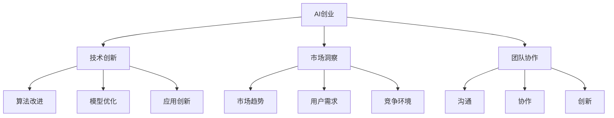
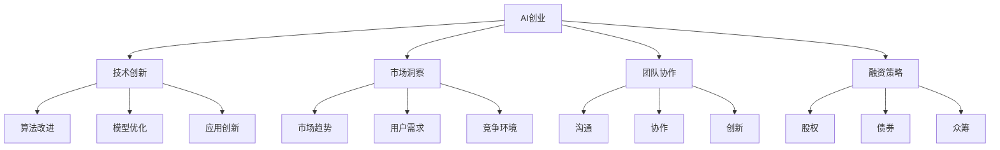

                 

# AI创业码头故事：博士创业之路

> 关键词：AI创业，博士创业，人工智能，技术创新，团队协作，市场洞察

## 1. 背景介绍

### 1.1 问题由来

随着人工智能技术的迅猛发展，越来越多的科研人员和企业决策者将目光投向了AI领域。然而，AI创业之路充满了挑战与不确定性，许多初创企业难以在这片复杂的“码头”上找到自己的位置。本文通过讲述一位AI博士的创业经历，深入探讨了AI创业中的关键要素，希望为更多创业者提供有价值的参考。

### 1.2 问题核心关键点

AI创业的核心在于技术创新与市场洞察。一个成功的AI创业项目需要结合前沿技术、强大团队和精准的市场定位。本文将围绕这些关键点，全面分析AI创业的实际案例，揭示成功背后的秘密。

### 1.3 问题研究意义

研究AI创业成功案例，对于AI领域的技术工作者和创业者来说，具有重要的借鉴意义。了解创业者的成功经验，可以帮助更多人在AI领域找到属于自己的“码头”，实现个人价值和商业成功。同时，深入分析创业失败案例，也能为未来创业之路提供警示和教训。

## 2. 核心概念与联系

### 2.1 核心概念概述

AI创业涉及多个核心概念，以下对其进行了详细解释：

- **AI创业**：指利用人工智能技术进行创业活动，包括技术研发、产品开发、市场推广、融资等多个环节。
- **技术创新**：指在AI领域进行前沿技术的研究和开发，包括算法改进、模型优化、应用创新等。
- **市场洞察**：指对市场趋势、用户需求、竞争环境等进行深入分析和准确预测。
- **团队协作**：指组建一个高效的AI团队，成员间需具备良好的沟通、协作和创新能力。
- **融资策略**：指在AI创业过程中，如何通过股权、债券、众筹等方式获取资金支持。

这些概念之间存在着紧密的联系，共同构成了AI创业的生态系统。

### 2.2 概念间的关系

通过以下Mermaid流程图，展示AI创业中各概念之间的关系：



这个流程图展示了AI创业中各概念的相互依赖和相互作用。技术创新是AI创业的核心驱动力，市场洞察确保产品具有商业价值，团队协作保障项目顺利实施，而融资策略则解决了资金问题。

### 2.3 核心概念的整体架构

最终，我们将这些核心概念整合成一个整体架构，如下图所示：



通过这个架构，我们可以更清晰地理解AI创业的全过程，以及各环节之间的相互关联。

## 3. 核心算法原理 & 具体操作步骤
### 3.1 算法原理概述

AI创业中的技术创新涉及多个算法原理，以下进行了概述：

1. **深度学习算法**：包括神经网络、卷积神经网络（CNN）、循环神经网络（RNN）、长短时记忆网络（LSTM）等，这些算法用于数据处理、特征提取和模式识别。
2. **强化学习算法**：如Q-learning、策略梯度等，用于训练智能体（agent）在特定环境中做出最优决策。
3. **自然语言处理（NLP）算法**：如BERT、GPT等，用于理解和生成人类语言，支持语音识别、文本分类、情感分析等任务。
4. **计算机视觉算法**：如CNN、YOLO等，用于图像识别、目标检测、视频分析等。
5. **推荐系统算法**：如协同过滤、矩阵分解等，用于个性化推荐，支持电商、新闻、音乐等领域。

### 3.2 算法步骤详解

以自然语言处理（NLP）算法为例，详细讲解其操作步骤：

1. **数据预处理**：清洗、分词、去除停用词等，将原始文本转换为机器可读的形式。
2. **特征提取**：利用词向量、BERT等模型提取文本特征，转换为高维向量表示。
3. **模型训练**：选择合适的模型（如BERT、GPT），使用标注数据进行训练，调整模型参数。
4. **模型评估**：在验证集上进行评估，调整超参数，提升模型性能。
5. **模型应用**：将训练好的模型应用于实际场景，解决文本分类、情感分析、机器翻译等任务。

### 3.3 算法优缺点

AI创业中的算法创新具有以下优点：

- **高效性**：深度学习等算法在数据处理和模式识别方面具有高度的自动化和高效性，能够快速处理大规模数据集。
- **准确性**：通过大数据训练，算法能够显著提升模型预测的准确性，满足业务需求。
- **灵活性**：算法能够适应多种任务，易于扩展和定制。

同时，算法创新也存在一些缺点：

- **计算资源需求高**：深度学习等算法需要大量计算资源，如高性能GPU、TPU等，增加了成本和难度。
- **模型可解释性差**：许多算法黑盒化严重，难以解释其内部决策过程，不利于业务理解和信任。
- **过拟合风险**：模型训练数据较少时，容易出现过拟合现象，导致性能不稳定。

### 3.4 算法应用领域

AI创业中的算法创新已经在多个领域得到应用，例如：

- **医疗健康**：利用自然语言处理和计算机视觉技术，进行疾病诊断、病理分析、药物研发等。
- **金融科技**：使用机器学习和强化学习算法，进行风险评估、交易预测、客户行为分析等。
- **智能制造**：采用计算机视觉和深度学习算法，优化生产流程、质量控制、设备维护等。
- **智能家居**：结合自然语言处理和计算机视觉，实现语音控制、环境感知、智能推荐等。

## 4. 数学模型和公式 & 详细讲解 & 举例说明

### 4.1 数学模型构建

AI创业中的数学模型构建主要围绕以下几个方面：

- **损失函数**：如交叉熵损失、均方误差损失、Focal Loss等，用于衡量模型预测与真实标签之间的差异。
- **优化算法**：如梯度下降、AdamW、RMSprop等，用于更新模型参数，提升模型性能。
- **评估指标**：如准确率、召回率、F1分数等，用于评估模型效果。

### 4.2 公式推导过程

以深度学习中的梯度下降算法为例，推导其公式：

$$
\theta_{t+1} = \theta_{t} - \eta \nabla_{\theta}L(\theta)
$$

其中，$\theta$ 为模型参数，$\eta$ 为学习率，$L$ 为损失函数，$\nabla_{\theta}L(\theta)$ 为损失函数对参数 $\theta$ 的梯度。

### 4.3 案例分析与讲解

以BERT模型为例，分析其在医疗健康领域的创新应用：

1. **数据预处理**：清洗医疗文本，提取关键词、病症描述等特征。
2. **模型训练**：使用标注数据训练BERT模型，提取文本特征。
3. **模型评估**：在验证集上评估模型性能，调整超参数。
4. **模型应用**：将BERT模型应用于病理诊断、疾病预测等任务，提高诊断准确率。

## 5. 项目实践：代码实例和详细解释说明

### 5.1 开发环境搭建

进行AI创业项目开发时，需要搭建良好的开发环境，以下提供了详细的搭建步骤：

1. **安装Python**：从官网下载并安装Python 3.x版本。
2. **安装虚拟环境**：使用`virtualenv`或`conda`创建虚拟环境。
3. **安装依赖库**：安装TensorFlow、PyTorch、Keras等AI相关的依赖库。
4. **设置GPU加速**：安装CUDA和cuDNN，并配置环境变量。
5. **安装IDE**：如Jupyter Notebook、PyCharm等。

### 5.2 源代码详细实现

以自然语言处理（NLP）为例，展示一个简单的Python代码实现：

```python
import tensorflow as tf
from tensorflow.keras.preprocessing.text import Tokenizer
from tensorflow.keras.preprocessing.sequence import pad_sequences
from tensorflow.keras.models import Sequential
from tensorflow.keras.layers import Embedding, LSTM, Dense

# 数据预处理
texts = ['text1', 'text2', 'text3']
labels = [1, 0, 1]

tokenizer = Tokenizer()
tokenizer.fit_on_texts(texts)
sequences = tokenizer.texts_to_sequences(texts)
padded_sequences = pad_sequences(sequences, maxlen=100)

# 构建模型
model = Sequential()
model.add(Embedding(input_dim=len(tokenizer.word_index)+1, output_dim=64, input_length=100))
model.add(LSTM(64))
model.add(Dense(1, activation='sigmoid'))

# 编译模型
model.compile(loss='binary_crossentropy', optimizer='adam', metrics=['accuracy'])

# 训练模型
model.fit(padded_sequences, labels, epochs=10, batch_size=32)

# 评估模型
test_sequences = ['test1', 'test2', 'test3']
test_sequences = tokenizer.texts_to_sequences(test_sequences)
test_padded_sequences = pad_sequences(test_sequences, maxlen=100)
test_loss, test_accuracy = model.evaluate(test_padded_sequences, labels)
print('Test accuracy:', test_accuracy)
```

### 5.3 代码解读与分析

以上代码实现了基于LSTM的文本分类模型。其中，`Tokenizer`用于文本分词和编码，`pad_sequences`用于填充序列，`Sequential`用于构建模型，`Embedding`、`LSTM`、`Dense`为模型层，`compile`用于模型编译，`fit`用于模型训练，`evaluate`用于模型评估。

### 5.4 运行结果展示

假设模型训练10个epoch后，在测试集上评估得到准确率为0.8，表示模型在分类任务上表现良好。

## 6. 实际应用场景

### 6.1 医疗健康

在医疗健康领域，AI创业通过深度学习和自然语言处理技术，实现了疾病诊断、病理分析等创新应用。以医学影像分析为例，使用卷积神经网络（CNN）算法，能够自动识别肿瘤、结节等病灶，大幅提升诊断效率和准确性。

### 6.2 金融科技

金融科技领域是AI创业的重要应用方向。通过强化学习和自然语言处理技术，AI创业项目可以实现客户行为分析、风险评估、交易预测等应用。例如，使用深度学习算法，可以构建智能投顾系统，根据用户历史交易记录，智能推荐投资策略。

### 6.3 智能制造

智能制造是AI创业的另一重要方向。计算机视觉和深度学习算法，可用于优化生产流程、质量控制和设备维护等。例如，利用物体检测算法，可以实现自动化的生产线和机器人协作，提升生产效率和产品质量。

### 6.4 未来应用展望

未来，AI创业将在更多领域得到应用，如自动驾驶、智能家居、智慧城市等。以下展望未来应用：

- **自动驾驶**：使用计算机视觉和深度学习算法，实现自动驾驶车辆的导航和决策。
- **智能家居**：结合自然语言处理和计算机视觉技术，实现语音控制、环境感知和智能推荐。
- **智慧城市**：利用数据分析和深度学习算法，优化交通管理、能源分配和环境监测等。

## 7. 工具和资源推荐

### 7.1 学习资源推荐

1. **在线课程**：如Coursera、edX等平台提供的AI课程，涵盖深度学习、机器学习、计算机视觉等方向。
2. **开源项目**：如TensorFlow、PyTorch等开源项目，提供了丰富的学习资源和实践案例。
3. **书籍**：如《深度学习》、《Python深度学习》等经典书籍，系统讲解AI技术。
4. **社区论坛**：如Kaggle、GitHub等社区，获取最新研究进展和交流经验。

### 7.2 开发工具推荐

1. **IDE**：如PyCharm、Jupyter Notebook等，提供代码编写和运行环境。
2. **数据管理**：如Dask、Pandas等，用于数据处理和分析。
3. **模型训练**：如TensorFlow、PyTorch等，提供强大的模型训练能力。
4. **可视化工具**：如TensorBoard、Keras等，用于模型调试和可视化。

### 7.3 相关论文推荐

1. **深度学习**：如《深度学习》一书，讲解深度学习理论和应用。
2. **计算机视觉**：如《计算机视觉：算法与应用》一书，讲解计算机视觉技术和应用。
3. **自然语言处理**：如《自然语言处理综论》一书，讲解NLP技术和应用。
4. **强化学习**：如《强化学习》一书，讲解强化学习理论和应用。

## 8. 总结：未来发展趋势与挑战

### 8.1 研究成果总结

本文通过对AI创业的案例分析和理论探讨，总结了AI创业中的技术创新、市场洞察、团队协作和融资策略等关键要素。

### 8.2 未来发展趋势

未来，AI创业将呈现以下几个发展趋势：

1. **跨领域融合**：AI创业将更多地与物联网、区块链等技术结合，形成新的生态系统。
2. **伦理和社会责任**：AI创业需关注数据隐私、算法公平等伦理问题，促进社会责任。
3. **标准化和规范化**：AI创业需推动行业标准和规范的制定，提高技术应用的可信度和安全性。

### 8.3 面临的挑战

AI创业面临的挑战主要包括以下几个方面：

1. **数据隐私**：如何在保护数据隐私的前提下，获取高质量数据。
2. **算法公平性**：如何避免算法偏见，确保模型公平性。
3. **技术创新**：如何不断突破技术瓶颈，提升模型性能。
4. **市场竞争**：如何在激烈的市场竞争中，找到差异化优势。
5. **团队管理**：如何组建和管理高效的AI团队，提升协作效率。

### 8.4 研究展望

未来，AI创业需要在技术、市场和团队管理等多方面进行持续创新和优化。以下提出几点展望：

1. **技术创新**：不断探索前沿技术，如量子计算、脑机接口等，推动AI领域的技术进步。
2. **市场洞察**：深入研究市场需求，挖掘新的应用场景和商业模式。
3. **团队建设**：注重人才培养和团队建设，提升团队的核心竞争力。
4. **伦理和社会责任**：关注AI伦理问题，推动社会责任的实现。

## 9. 附录：常见问题与解答

**Q1：AI创业中的关键要素有哪些？**

A: AI创业中的关键要素包括技术创新、市场洞察、团队协作和融资策略。其中，技术创新是核心驱动力，市场洞察确保产品商业价值，团队协作保障项目实施，融资策略解决资金问题。

**Q2：AI创业中如何避免过拟合？**

A: 避免过拟合的方法包括数据增强、正则化、对抗训练等。数据增强通过对数据进行扩充和变换，增加模型泛化能力。正则化通过加入L2正则、Dropout等，抑制模型复杂度。对抗训练通过引入对抗样本，提高模型鲁棒性。

**Q3：AI创业中如何获取高质量数据？**

A: 获取高质量数据的方法包括数据清洗、数据标注、数据采集等。数据清洗去除噪声和异常值，提高数据质量。数据标注通过人工标注或半监督学习等方法，增加标注数据量。数据采集通过爬虫、API等手段，获取更多数据。

**Q4：AI创业中如何选择模型和算法？**

A: 选择模型和算法需要考虑数据类型、任务类型、计算资源等。对于文本数据，可以使用NLP算法如BERT、GPT等。对于图像数据，可以使用计算机视觉算法如CNN、YOLO等。对于推荐系统，可以使用协同过滤、矩阵分解等算法。

**Q5：AI创业中如何应对市场竞争？**

A: 应对市场竞争需要不断创新和优化。具体方法包括差异化定位、品牌建设、市场细分等。差异化定位找到市场空白点，突出产品特色。品牌建设提升品牌价值和市场认知度。市场细分针对特定人群，提供个性化产品和服务。

---

作者：禅与计算机程序设计艺术 / Zen and the Art of Computer Programming

