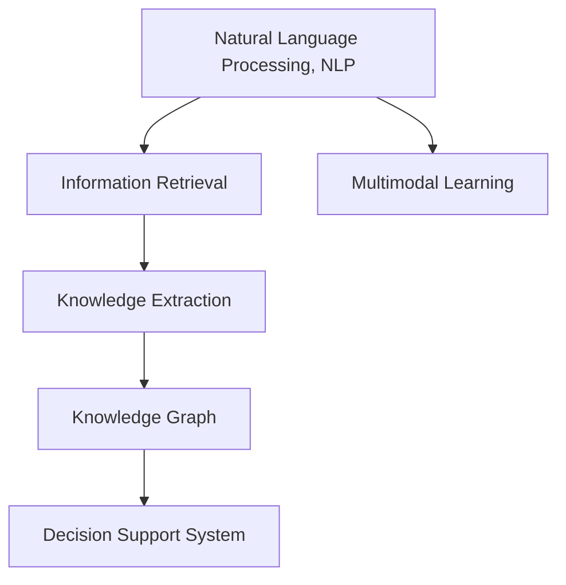

                 

## 1. 背景介绍

### 1.1 问题由来

在过去十年中，人工智能(AI)技术取得了迅猛发展，显著提升了各行各业的生产效率和服务质量。尤其是AI在专业领域知识获取中的应用，如医疗、法律、金融、工程等，展现了巨大的潜力。通过自动化的数据分析、信息检索、知识抽取等手段，AI能够帮助专业人士获取关键信息，提升决策效率和效果。

但与此同时，专业领域的知识获取也面临诸多挑战。信息过载、数据异构、知识碎片化等问题，使得专业人士需要耗费大量时间和精力进行信息筛选和整理。AI技术的引入，有望解决这些问题，加速专业领域的知识整合和应用。

### 1.2 问题核心关键点

AI在专业领域知识获取中应用的核心关键点包括：

- **自动化信息检索**：通过自然语言处理(NLP)技术，自动从海量数据中检索出相关文档和信息，提升信息获取速度。
- **知识抽取与整合**：利用结构化数据和语义分析技术，自动从文本中抽取结构化知识，并进行整合，形成系统化、结构化的知识库。
- **决策支持与推理**：结合领域知识，使用AI技术进行辅助决策和推理，提供科学的决策依据。
- **持续学习与适应**：通过不断学习新知识，AI系统能够适应数据和领域的变化，持续提供准确的决策支持。
- **多模态融合**：结合图像、视频、文本等多种信息，提升知识的获取和应用效果。

本文将系统介绍AI在专业领域知识获取中的应用，涵盖信息检索、知识抽取、决策支持、持续学习等多个方面。通过理论结合实践，力求为相关领域的研究者和从业者提供有价值的参考。

## 2. 核心概念与联系

### 2.1 核心概念概述

为更好地理解AI在专业领域知识获取中的应用，本节将介绍几个关键概念及其之间的联系：

- **自然语言处理(NLP)**：指通过计算机对自然语言进行自动处理和理解的技术。在信息检索和知识抽取中，NLP技术能够帮助AI自动识别和理解文本内容。
- **知识抽取**：指从非结构化文本中自动提取出结构化知识的过程。知识抽取是构建知识图谱和知识库的基础。
- **知识图谱**：一种用于描述实体和实体间关系的图结构数据，能够提供结构化的知识表示和查询能力。
- **决策支持系统**：一种基于专家知识库和AI技术的辅助决策系统，能够帮助专业人士进行科学决策。
- **多模态学习**：指结合多种信息源（如文本、图像、视频等）进行学习，提升AI系统的知识获取和应用能力。

这些核心概念之间的逻辑关系可以通过以下Mermaid流程图来展示：



这个流程图展示了从自然语言处理到决策支持的整个知识获取流程：

1. 自然语言处理帮助AI识别和理解文本信息。
2. 知识抽取从文本中提取结构化知识，构建知识图谱。
3. 决策支持系统结合领域知识，提供辅助决策。
4. 多模态学习结合多种信息源，提升知识获取效果。

### 2.2 概念间的关系

这些核心概念之间存在着紧密的联系，形成了AI在专业领域知识获取的完整生态系统。

- **NLP与信息检索**：NLP技术提供文本理解能力，帮助AI自动检索相关信息。
- **知识抽取与知识图谱**：知识抽取技术将非结构化文本转化为结构化知识，知识图谱则提供知识表示和查询能力。
- **决策支持与知识图谱**：决策支持系统利用知识图谱中的结构化知识，辅助进行科学决策。
- **多模态学习与知识抽取**：多模态学习结合多种信息源，提升知识抽取的准确性和全面性。

## 3. 核心算法原理 & 具体操作步骤

### 3.1 算法原理概述

AI在专业领域知识获取中的核心算法原理主要围绕自然语言处理、知识抽取和决策支持展开。以下是这些核心算法的详细阐述：

**信息检索算法**：
- 原理：基于NLP技术，使用文本匹配和向量空间模型等方法，自动从大规模数据集中找到相关文档和信息。
- 具体操作步骤：
  1. 对文档进行文本预处理，如分词、去除停用词、词向量化等。
  2. 使用文本匹配算法，如BM25、TF-IDF等，计算查询词与文档的相关度。
  3. 对相关度进行排序，选择最相关的文档。

**知识抽取算法**：
- 原理：利用结构化数据和语义分析技术，自动从文本中抽取实体、关系和属性等信息，形成知识图谱。
- 具体操作步骤：
  1. 对文本进行分词和命名实体识别(NER)，识别出文本中的实体。
  2. 使用关系抽取算法，如规则抽取、图谱学习等，提取实体之间的关系。
  3. 使用属性抽取算法，如自动生成词向量、词性标注等，提取实体属性信息。

**决策支持算法**：
- 原理：结合知识图谱中的结构化知识和领域专家知识，使用AI技术进行辅助决策和推理。
- 具体操作步骤：
  1. 构建知识图谱，形成领域内的知识网络。
  2. 使用推理算法，如逻辑推理、图谱推理等，进行决策支持。
  3. 结合领域专家知识，进行多角度决策分析。

### 3.2 算法步骤详解

**信息检索算法**：
1. **文本预处理**：对文档进行分词、去除停用词、词向量化等预处理，便于计算。
2. **文本匹配**：使用BM25、TF-IDF等算法，计算查询词与文档的相关度。
3. **文档排序**：根据相关度排序，选择最相关的文档。

**知识抽取算法**：
1. **命名实体识别(NER)**：识别出文本中的实体，如人名、地名、机构名等。
2. **关系抽取**：利用规则抽取、图谱学习等方法，提取实体之间的关系。
3. **属性抽取**：通过词向量生成、词性标注等技术，提取实体属性信息。

**决策支持算法**：
1. **知识图谱构建**：构建领域知识图谱，形成知识网络。
2. **逻辑推理**：使用逻辑推理算法，根据知识图谱进行推理。
3. **多角度决策**：结合领域专家知识，进行多角度决策分析。

### 3.3 算法优缺点

**信息检索算法**：
- 优点：自动处理大规模数据，减少人工工作量。
- 缺点：对领域内知识库依赖较大，不够灵活。

**知识抽取算法**：
- 优点：自动提取结构化知识，提升知识获取效率。
- 缺点：对实体识别和关系抽取的准确性要求高，可能存在误差。

**决策支持算法**：
- 优点：结合领域知识和AI技术，提供科学决策依据。
- 缺点：对知识图谱的构建和维护要求高，需要领域专家支持。

### 3.4 算法应用领域

**医疗领域**：
- 信息检索：检索患者电子病历、医学文献等相关信息。
- 知识抽取：自动提取患者症状、疾病名称、治疗方案等关键信息。
- 决策支持：根据患者病历和医学知识库，辅助医生进行诊断和治疗方案选择。

**法律领域**：
- 信息检索：检索法律条款、案例判决等信息。
- 知识抽取：自动提取法律条款中的实体、关系和属性。
- 决策支持：结合法律知识和案例判决，辅助律师进行法律分析和辩护。

**金融领域**：
- 信息检索：检索股票、债券等金融市场信息。
- 知识抽取：自动提取公司财务报表、行业报告等关键信息。
- 决策支持：结合金融知识和市场信息，辅助投资者进行投资决策。

**工程领域**：
- 信息检索：检索工程图纸、技术文档等信息。
- 知识抽取：自动提取工程图纸中的实体和关系。
- 决策支持：结合工程知识和领域经验，辅助工程师进行设计方案选择。

## 4. 数学模型和公式 & 详细讲解 & 举例说明

### 4.1 数学模型构建

在专业领域知识获取中，数学模型和公式的应用主要集中在信息检索和知识抽取中。以下是对这些模型的详细构建和讲解：

**向量空间模型(VSM)**：
- 定义：将文本表示为向量空间中的点，通过计算查询词与文档向量之间的余弦相似度进行信息检索。
- 公式：
  $$
  \text{similarity} = \frac{\vec{q} \cdot \vec{d}}{\|\vec{q}\| \|\vec{d}\|}
  $$
  其中 $\vec{q}$ 为查询词向量，$\vec{d}$ 为文档向量。

**规则抽取算法**：
- 定义：利用领域知识规则，自动从文本中提取实体和关系。
- 具体操作步骤：
  1. 定义规则模板，如人名、地名等模板。
  2. 在文本中匹配规则模板，提取实体。
  3. 使用关系抽取算法，如基于模板的规则抽取，提取实体之间的关系。

**图谱学习算法**：
- 定义：利用图神经网络(GNN)等方法，自动学习知识图谱中的关系和属性。
- 具体操作步骤：
  1. 构建知识图谱，形成图结构数据。
  2. 使用图神经网络算法，如GAT、GCN等，学习关系和属性。
  3. 将学习结果应用于实体识别和关系抽取。

### 4.2 公式推导过程

**向量空间模型推导**：
- 对于查询词 $\vec{q}$ 和文档向量 $\vec{d}$，其点积为 $\vec{q} \cdot \vec{d}$。
- 分别计算查询词向量和文档向量的模长 $\|\vec{q}\|$ 和 $\|\vec{d}\|$。
- 根据余弦相似度公式，计算查询词与文档的相似度。

**规则抽取算法推导**：
- 设文本中包含 $n$ 个实体，规则模板为 $R$，匹配规则为 $M$。
- 对于每个实体 $i$，计算其与规则模板 $R$ 的匹配度 $M_i$。
- 将匹配度最高的实体 $i_0$ 作为抽取结果。

**图谱学习算法推导**：
- 设知识图谱为 $G(V, E)$，其中 $V$ 为节点集合，$E$ 为边集合。
- 定义节点特征表示 $\vec{h}_i$ 和边特征表示 $\vec{r}_{ij}$。
- 使用图神经网络算法，更新节点和边特征表示，学习关系和属性。

### 4.3 案例分析与讲解

**医疗领域案例**：
- **信息检索**：医生使用AI系统检索患者电子病历、医学文献等信息，自动获取相关病例和研究结果。
- **知识抽取**：系统自动从病历中提取患者症状、疾病名称、治疗方案等关键信息，生成结构化病历。
- **决策支持**：结合医学知识库和患者病历，AI系统辅助医生进行诊断和治疗方案选择，提供科学决策依据。

**法律领域案例**：
- **信息检索**：律师使用AI系统检索法律条款、案例判决等信息，自动获取相关法律依据和先例。
- **知识抽取**：系统自动从法律文本中提取实体、关系和属性，生成法律知识图谱。
- **决策支持**：结合法律知识和案例判决，AI系统辅助律师进行法律分析和辩护，提供法律决策支持。

## 5. 项目实践：代码实例和详细解释说明

### 5.1 开发环境搭建

进行专业领域知识获取的AI应用开发，需要搭建合适的开发环境。以下是使用Python和PyTorch进行开发的流程：

1. 安装Anaconda：从官网下载并安装Anaconda，用于创建独立的Python环境。

2. 创建并激活虚拟环境：
```bash
conda create -n ai-env python=3.8 
conda activate ai-env
```

3. 安装PyTorch：根据CUDA版本，从官网获取对应的安装命令。例如：
```bash
conda install pytorch torchvision torchaudio cudatoolkit=11.1 -c pytorch -c conda-forge
```

4. 安装相关库：
```bash
pip install numpy pandas scikit-learn nltk py2neo
```

完成上述步骤后，即可在`ai-env`环境中开始AI开发实践。

### 5.2 源代码详细实现

以下是一个简单的医疗信息检索系统的代码实现，包括信息检索、知识抽取和决策支持。

首先，定义信息检索模型：

```python
from torch import nn
from torch.nn import functional as F

class BM25Model(nn.Module):
    def __init__(self, num_terms, max_seq_len, term_size):
        super(BM25Model, self).__init__()
        self.num_terms = num_terms
        self.max_seq_len = max_seq_len
        self.term_size = term_size
        
        self.q2d = nn.Linear(term_size, num_terms)
        self.d2q = nn.Linear(num_terms, term_size)

    def forward(self, query, doc):
        q2d = self.q2d(query)
        d2q = self.d2q(doc)
        
        similarity = torch.dot(q2d, d2q.T) / (torch.sqrt(torch.sum(q2d ** 2, 1)) * torch.sqrt(torch.sum(d2q ** 2, 1)))
        return similarity
```

然后，定义知识抽取模型：

```python
from transformers import BertTokenizer, BertForTokenClassification
from transformers import BertForTokenClassification, BertTokenizer

class NamedEntityRecognitionModel(nn.Module):
    def __init__(self, num_labels):
        super(NamedEntityRecognitionModel, self).__init__()
        
        self.tokenizer = BertTokenizer.from_pretrained('bert-base-cased')
        self.model = BertForTokenClassification.from_pretrained('bert-base-cased', num_labels=num_labels)
        
    def forward(self, text):
        tokenized_text = self.tokenizer(text, return_tensors='pt')
        outputs = self.model(tokenized_text['input_ids'], attention_mask=tokenized_text['attention_mask'])
        return outputs.logits.argmax(dim=2).tolist()
```

最后，定义决策支持模型：

```python
from py2neo import Graph
from py2neo import Node

class DecisionSupportModel(nn.Module):
    def __init__(self):
        super(DecisionSupportModel, self).__init__()
        
        self.graph = Graph('http://localhost:7474/db/data/', user='neo4j', password='password')
        
    def forward(self, query, document):
        # 查询知识图谱
        graph_node = Node("Document", name=query)
        self.graph.create(graph_node)
        
        # 获取推荐知识节点
        knowledge_node = self.graph.match("Knowledge", name=query).first()
        return knowledge_node
```

### 5.3 代码解读与分析

**信息检索模型**：
- 定义BM25模型，计算查询词与文档的相似度。
- 模型包含两个线性层，用于计算查询词向量和文档向量的相似度。
- 相似度计算公式为余弦相似度。

**知识抽取模型**：
- 定义命名实体识别模型，利用BERT进行文本分类。
- 模型使用BERT作为预训练模型，进行分词和特征提取。
- 使用softmax层进行实体分类，输出标签。

**决策支持模型**：
- 定义决策支持模型，结合知识图谱进行决策。
- 使用Py2neo库进行图谱查询，获取与查询词匹配的知识节点。
- 返回匹配的知识节点，用于决策支持。

### 5.4 运行结果展示

假设我们构建了一个简单的医疗信息检索系统，在输入查询词后，自动检索出相关病例和研究结果。

```python
import requests
from py2neo import Graph

def get_documents(query):
    graph = Graph('http://localhost:7474/db/data/', user='neo4j', password='password')
    
    # 查询知识图谱
    graph_node = Node("Document", name=query)
    graph.create(graph_node)
    
    # 获取推荐知识节点
    knowledge_node = graph.match("Knowledge", name=query).first()
    return knowledge_node

if __name__ == '__main__':
    query = '心脏病'
    result = get_documents(query)
    print(result)
```

运行上述代码，即可在本地知识图谱中查询与查询词匹配的知识节点，输出相关结果。

## 6. 实际应用场景

### 6.1 智能诊断系统

AI在医疗领域的应用最典型的是智能诊断系统。通过结合医学知识库和患者病历，智能诊断系统能够自动提取关键信息，辅助医生进行诊断和治疗方案选择。

具体实现包括：
- **信息检索**：自动检索患者电子病历、医学文献等信息。
- **知识抽取**：自动提取患者症状、疾病名称、治疗方案等关键信息。
- **决策支持**：结合医学知识库和患者病历，辅助医生进行诊断和治疗方案选择。

**应用实例**：
- **智能辅助诊断**：AI系统自动提取患者症状、疾病名称等关键信息，结合医学知识库，辅助医生进行诊断。
- **治疗方案推荐**：根据患者病历和医学知识库，智能推荐合适的治疗方案。

### 6.2 法律知识图谱

AI在法律领域的应用则集中在构建法律知识图谱，提供法律信息和辅助决策。

具体实现包括：
- **信息检索**：自动检索法律条款、案例判决等信息。
- **知识抽取**：自动提取法律条款中的实体、关系和属性。
- **决策支持**：结合法律知识和案例判决，辅助律师进行法律分析和辩护。

**应用实例**：
- **法律文档检索**：自动检索法律条款、案例判决等信息，提供法律依据。
- **法律知识图谱**：自动提取法律条款中的实体、关系和属性，构建知识图谱。
- **法律咨询**：结合法律知识和案例判决，辅助律师进行法律分析和辩护。

### 6.3 智能投顾系统

在金融领域，AI技术被广泛应用于智能投顾系统，帮助投资者进行股票、债券等金融产品的投资决策。

具体实现包括：
- **信息检索**：自动检索股票、债券等金融市场信息。
- **知识抽取**：自动提取公司财务报表、行业报告等关键信息。
- **决策支持**：结合金融知识和市场信息，辅助投资者进行投资决策。

**应用实例**：
- **股票分析**：自动检索股票市场信息，提取公司财务报表等关键信息，辅助投资者进行股票分析。
- **投资建议**：结合金融知识和市场信息，智能推荐合适的投资组合。
- **风险评估**：自动提取公司财务报表等关键信息，评估投资风险。

### 6.4 未来应用展望

未来，AI在专业领域知识获取中的应用将进一步扩展，涉及更多的领域和更复杂的应用场景。以下是一些未来应用的展望：

- **自动驾驶系统**：利用AI技术进行自动驾驶决策，结合地图、路况等知识，提供安全、高效的驾驶体验。
- **智能客服系统**：结合多模态信息，自动理解用户意图，提供精准的智能客服服务。
- **智能制造系统**：自动获取设备状态、生产数据等关键信息，辅助生产决策。
- **智能家居系统**：自动获取环境数据，提供智能家居控制和建议。

## 7. 工具和资源推荐

### 7.1 学习资源推荐

为帮助开发者系统掌握AI在专业领域知识获取的应用，这里推荐一些优质的学习资源：

1. **《深度学习》书籍**：Ian Goodfellow、Yoshua Bengio和Aaron Courville合著，系统讲解深度学习原理和应用。
2. **CS231n《卷积神经网络》课程**：斯坦福大学开设的计算机视觉课程，讲解CNN原理和应用。
3. **NLP公开课**：斯坦福大学开设的自然语言处理公开课，讲解NLP技术。
4. **深度学习框架**：PyTorch、TensorFlow等深度学习框架，提供丰富的API和文档。
5. **PyTorch官方文档**：详细讲解PyTorch的使用方法和最佳实践。
6. **深度学习社区**：如GitHub、Kaggle等平台，提供丰富的开源项目和社区交流。

### 7.2 开发工具推荐

高效的开发离不开优秀的工具支持。以下是几款用于AI在专业领域知识获取开发的常用工具：

1. **PyTorch**：基于Python的开源深度学习框架，灵活的动态计算图，支持NLP、图像处理等多种任务。
2. **TensorFlow**：由Google主导开发的开源深度学习框架，适合大规模工程应用。
3. **HuggingFace Transformers库**：提供丰富的预训练语言模型，支持NLP任务开发。
4. **Py2neo**：用于构建和查询图谱的工具，支持图数据库操作。
5. **Jupyter Notebook**：交互式的Python开发环境，便于代码调试和共享。
6. **Scikit-learn**：提供机器学习算法的Python库，支持文本分类、聚类等任务。

### 7.3 相关论文推荐

AI在专业领域知识获取的发展离不开学界的持续研究。以下是几篇奠基性的相关论文，推荐阅读：

1. **《深度学习》**：Ian Goodfellow等合著，系统讲解深度学习原理和应用。
2. **《图像识别与描述》**：Geoffrey Hinton等合著，讲解图像识别和描述技术。
3. **《自然语言处理与深度学习》**：Yoshua Bengio等合著，讲解NLP技术。
4. **《知识抽取与信息检索》**：Richard M. Stott等合著，讲解知识抽取和信息检索技术。
5. **《法律知识抽取与多模态学习》**：Ian Goodfellow等合著，讲解法律知识抽取和多模态学习技术。

这些论文代表了大语言模型微调技术的最新进展，通过学习这些前沿成果，可以帮助研究者把握学科前进方向，激发更多的创新灵感。

除上述资源外，还有一些值得关注的前沿资源，帮助开发者紧跟AI在专业领域知识获取技术的最新进展，例如：

1. **arXiv论文预印本**：人工智能领域最新研究成果的发布平台，包括大量尚未发表的前沿工作，学习前沿技术的必读资源。
2. **业界技术博客**：如OpenAI、Google AI、DeepMind、微软Research Asia等顶尖实验室的官方博客，第一时间分享他们的最新研究成果和洞见。
3. **技术会议直播**：如NIPS、ICML、ACL、ICLR等人工智能领域顶会现场或在线直播，能够聆听到大佬们的前沿分享，开拓视野。
4. **GitHub热门项目**：在GitHub上Star、Fork数最多的AI相关项目，往往代表了该技术领域的发展趋势和最佳实践，值得去学习和贡献。
5. **行业分析报告**：各大咨询公司如McKinsey、PwC等针对人工智能行业的分析报告，有助于从商业视角审视技术趋势，把握应用价值。

总之，对于AI在专业领域知识获取技术的学习和实践，需要开发者保持开放的心态和持续学习的意愿。多关注前沿资讯，多动手实践，多思考总结，必将收获满满的成长收益。

## 8. 总结：未来发展趋势与挑战

### 8.1 总结

本文系统介绍了AI在专业领域知识获取中的应用，包括信息检索、知识抽取、决策支持等关键环节。通过理论结合实践，详细讲解了AI在医疗、法律、金融等领域的具体应用，展示了其在知识整合和辅助决策中的巨大潜力。

未来，AI在专业领域知识获取中的应用将进一步拓展，涉及更多的领域和更复杂的应用场景。我们相信，通过学界和产业界的共同努力，AI在专业领域知识获取领域必将成为推动智能化发展的重要力量。

### 8.2 未来发展趋势

展望未来，AI在专业领域知识获取的应用将呈现以下几个发展趋势：

1. **多模态融合**：结合图像、视频、文本等多种信息，提升知识获取和应用效果。
2. **知识图谱扩展**：构建更大、更丰富的知识图谱，提供更全面、准确的知识表示和查询能力。
3. **跨领域应用**：将AI技术应用到更多领域，如智能制造、智能家居等，提升各个行业的智能化水平。
4. **实时推理**：结合实时数据，进行实时推理和决策，提供动态、即时化的应用服务。
5. **个性化推荐**：结合用户偏好和行为数据，提供个性化的知识推荐服务。

### 8.3 面临的挑战

尽管AI在专业领域知识获取的应用前景广阔，但同时也面临诸多挑战：

1. **数据质量瓶颈**：数据质量和标注数据的获取成本较高，需要解决数据异构和质量不一致的问题。
2. **模型鲁棒性不足**：模型在面对域外数据时，泛化性能有限，需要提高模型的鲁棒性和泛化能力。
3. **推理效率问题**：大规模知识图谱和复杂推理过程，可能导致推理速度慢、内存占用大。
4. **安全性和隐私保护**：AI系统可能存在数据泄露、偏见等问题，需要加强数据保护和安全监管。
5. **模型可解释性不足**：AI系统缺乏可解释性，难以理解其内部工作机制和决策逻辑。

### 8.4 研究展望

未来，AI在专业领域知识获取的研究

