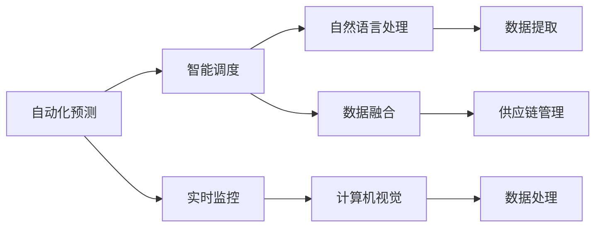

                 

# AI在供应链管理中的创新应用

在当今快速变化的市场环境中，供应链管理已经成为了企业成功的关键因素之一。传统的供应链管理模式，往往依靠人工处理大量复杂的任务，难以应对市场波动的挑战，且响应速度较慢。随着人工智能技术的发展，AI在供应链管理中的应用越来越广泛，为企业提供了更高效、更智能的解决方案。本文将系统介绍AI在供应链管理中的创新应用，包括自动化预测、智能调度和实时监控等方面，探讨其原理、操作步骤、优缺点以及未来发展趋势。

## 1. 背景介绍

### 1.1 问题由来
在过去几十年里，全球化和电子商务的迅猛发展，使得供应链管理变得更加复杂和动态。企业需要在全球范围内协调物流、库存、订单管理等多个环节，以实现高效的资源配置和成本控制。然而，传统的供应链管理方式依赖于人工处理，不仅效率低下，而且容易出现人为错误。此外，供应链管理涉及海量数据，处理和分析这些数据需要耗费大量人力和资源。

为应对这些挑战，企业开始探索利用AI技术，如机器学习、自然语言处理和计算机视觉等，来优化供应链管理流程，提升效率和精确度。AI在供应链管理中的应用，不仅能够显著降低运营成本，还能提高供应链的灵活性和响应速度，增强企业的市场竞争力。

### 1.2 问题核心关键点
AI在供应链管理中的应用主要集中在以下几个方面：

1. **自动化预测**：通过机器学习模型，预测需求变化、价格波动和市场趋势，为企业提供决策支持。
2. **智能调度**：使用优化算法和机器学习模型，自动化地规划运输路线、仓库管理和库存调配。
3. **实时监控**：利用物联网设备和传感器，实时监控供应链各环节，及时发现问题并采取应对措施。

这些AI应用不仅提升了供应链管理的效率和准确性，还为企业带来了更高的灵活性和应对市场变化的能力。

### 1.3 问题研究意义
AI在供应链管理中的应用，有助于企业实现以下目标：

1. **降低成本**：通过自动化流程和精准预测，减少人工错误和资源浪费。
2. **提高效率**：使用AI技术优化供应链流程，缩短处理时间，提升响应速度。
3. **增强灵活性**：实时监控供应链状态，快速调整策略，适应市场变化。
4. **提升决策质量**：提供基于数据的决策支持，减少决策的主观性。
5. **提高客户满意度**：保证供应链的稳定性和可靠性，增强客户体验。

因此，AI在供应链管理中的应用，对企业优化资源配置、提升市场竞争力、提高客户满意度等方面具有重要意义。

## 2. 核心概念与联系

### 2.1 核心概念概述

AI在供应链管理中的应用涉及多个核心概念，这些概念之间相互联系，共同构成了供应链管理的AI系统。

- **自动化预测**：使用机器学习模型，根据历史数据和外部因素预测未来的需求和市场趋势。
- **智能调度**：使用优化算法和机器学习模型，自动化地规划运输路线、仓库管理和库存调配。
- **实时监控**：利用物联网设备和传感器，实时监控供应链各环节，及时发现问题并采取应对措施。
- **自然语言处理**：用于处理供应链相关的文本数据，如订单、发票等，提取关键信息。
- **计算机视觉**：用于识别和处理图像数据，如货物检测、库存盘点等。

这些核心概念通过数据融合和算法优化，共同实现供应链管理的智能化和自动化。

### 2.2 概念间的关系

这些核心概念之间的关系可以通过以下Mermaid流程图来展示：



这个流程图展示了AI在供应链管理中的应用流程：

1. 自动化预测提供需求和市场趋势预测，为智能调度和实时监控提供决策依据。
2. 智能调度基于预测结果，自动化规划运输路线和库存调配。
3. 实时监控通过物联网设备和传感器，实时监控供应链状态。
4. 自然语言处理和计算机视觉分别处理文本和图像数据，提取关键信息。
5. 数据融合和供应链管理将处理后的数据应用于供应链的各个环节，实现智能化的供应链管理。

这些概念共同构成了一个完整的供应链管理系统，各环节相互协作，共同提升供应链的效率和灵活性。

## 3. 核心算法原理 & 具体操作步骤
### 3.1 算法原理概述

AI在供应链管理中的应用，主要基于机器学习和优化算法的原理。其核心思想是利用数据和算法，自动地处理和优化供应链管理的各个环节。

自动化预测通常使用时间序列分析、回归模型、深度学习等方法，根据历史数据和外部因素，预测未来的需求和市场趋势。智能调度则使用优化算法和机器学习模型，自动化地规划运输路线、仓库管理和库存调配。实时监控则利用传感器和物联网设备，实时收集供应链各环节的数据，及时发现问题并采取应对措施。

### 3.2 算法步骤详解

以下是AI在供应链管理中的应用步骤详解：

1. **数据收集**：收集供应链相关的数据，包括历史订单、库存、物流信息等，用于训练和优化模型。
2. **数据预处理**：对数据进行清洗、去重和标准化处理，以保证数据质量和一致性。
3. **模型训练**：使用机器学习算法，训练自动化预测和智能调度模型，优化供应链管理策略。
4. **实时监控**：部署物联网设备和传感器，实时监控供应链状态，及时发现问题并采取应对措施。
5. **模型评估和优化**：定期评估模型性能，根据反馈数据不断优化模型参数，提升模型准确性和鲁棒性。

### 3.3 算法优缺点

AI在供应链管理中的应用具有以下优点：

1. **高效性**：通过自动化和智能化的方式，显著提高供应链管理的效率和响应速度。
2. **准确性**：利用数据驱动的方法，减少人工错误和主观偏差，提高预测和调度的准确性。
3. **灵活性**：实时监控供应链状态，快速调整策略，增强应对市场变化的能力。
4. **成本节约**：减少人工和资源浪费，降低运营成本。

然而，AI在供应链管理中的应用也存在以下缺点：

1. **数据依赖**：AI模型的性能很大程度上依赖于数据的质量和数量，数据不完整或不准确可能导致模型失效。
2. **技术复杂性**：部署和维护AI系统需要较高的技术门槛，企业需要投入大量资源进行培训和维护。
3. **隐私和安全**：供应链数据涉及敏感信息，如何保障数据隐私和安全是一个重要问题。
4. **模型解释性**：AI模型通常是"黑盒"系统，难以解释其内部工作机制和决策逻辑。

### 3.4 算法应用领域

AI在供应链管理中的应用领域非常广泛，主要包括以下几个方面：

1. **自动化预测**：广泛应用于需求预测、库存管理、市场趋势预测等场景。
2. **智能调度**：应用于运输路线规划、仓库管理、库存调配等环节。
3. **实时监控**：在货物跟踪、物流管理、异常检测等场景中得到应用。
4. **自然语言处理**：用于处理供应链相关的文本数据，如订单、发票等。
5. **计算机视觉**：应用于货物检测、库存盘点等场景。

这些应用领域涵盖了供应链管理的各个环节，为企业提供了全面的智能化解决方案。

## 4. 数学模型和公式 & 详细讲解  
### 4.1 数学模型构建

AI在供应链管理中的应用，涉及多个数学模型。以下是一些典型的数学模型及其构建方式：

**自动化预测模型**：
- 时间序列分析模型：
  $$
  \hat{y}_t = \sum_{i=1}^k \alpha_i y_{t-i} + \epsilon_t
  $$
  其中，$\hat{y}_t$表示预测值，$y_{t-i}$表示历史数据，$\alpha_i$表示权重系数，$\epsilon_t$表示误差项。

**智能调度模型**：
- 优化算法：
  $$
  \min \sum_{i=1}^n \left[ c_i x_i + d_i x_i^2 \right]
  $$
  其中，$c_i$表示成本系数，$d_i$表示惩罚系数，$x_i$表示调度变量。

**实时监控模型**：
- 物联网传感器数据：
  $$
  s_t = f(x_t, u_t)
  $$
  其中，$s_t$表示传感器数据，$x_t$表示环境变量，$u_t$表示系统参数。

### 4.2 公式推导过程

以下是一些常见公式的推导过程：

**时间序列分析模型的推导**：
设历史数据为$y_{1..T}$，时间序列模型为
$$
y_t = \sum_{i=1}^k \alpha_i y_{t-i} + \epsilon_t
$$
通过最小二乘法求解$\alpha_i$，可得：
$$
\hat{\alpha}_i = \frac{\sum_{t=1}^T (y_t - \hat{y}_{t-i}) (y_{t-i})}{\sum_{t=1}^T (y_{t-i})^2}
$$

**优化算法的推导**：
设优化问题为
$$
\min \sum_{i=1}^n f_i(x_i)
$$
使用梯度下降法求解，可得：
$$
x_{i+1} = x_i - \eta_i \nabla f_i(x_i)
$$
其中，$\eta_i$表示学习率，$\nabla f_i(x_i)$表示梯度。

### 4.3 案例分析与讲解

**案例1：需求预测**
某电商平台收集了历史订单数据，使用时间序列模型进行需求预测。首先，对订单数据进行清洗和标准化处理，然后使用时间序列分析模型进行预测，最终得到未来一周的需求预测结果。

**案例2：智能调度**
某物流公司收集了运输数据和订单数据，使用优化算法进行智能调度。首先，对数据进行预处理和特征提取，然后使用优化算法求解最优调度方案，最终得到最优的运输路线和仓库分配。

**案例3：实时监控**
某制造企业部署了物联网传感器，实时监控生产线的运行状态。首先，对传感器数据进行采集和处理，然后使用实时监控模型进行异常检测和预警，最终实现了生产的实时监控和异常处理。

## 5. 项目实践：代码实例和详细解释说明
### 5.1 开发环境搭建

在开始AI在供应链管理中的应用实践前，需要搭建相应的开发环境。以下是一些常见的开发环境搭建步骤：

1. **选择编程语言和框架**：通常使用Python，结合TensorFlow或PyTorch等深度学习框架进行开发。
2. **安装相关库**：安装Numpy、Pandas、Scikit-learn等常用库，以及特定领域的库，如TensorBoard、Jupyter Notebook等。
3. **部署物联网设备**：使用Raspberry Pi、Arduino等物联网设备，采集供应链数据。
4. **搭建云计算平台**：使用AWS、Google Cloud等云计算平台，部署和管理AI系统。

### 5.2 源代码详细实现

以下是一些常见的AI供应链管理项目实现，包括自动化预测、智能调度和实时监控等：

**自动化预测实现**：
```python
import numpy as np
import pandas as pd

# 时间序列模型
class ARIMA:
    def __init__(self, order=(1,1,1)):
        self.order = order
    
    def fit(self, y):
        self.arima = ARIMA(y, order=self.order)
        self.arima.fit()
        return self
    
    def predict(self, horizon=7):
        return self.arima.predict(start=len(y), end=len(y)+horizon-1)
```

**智能调度实现**：
```python
import numpy as np
from scipy.optimize import linprog

# 优化算法
class VehicleRouting:
    def __init__(self, nodes, distances):
        self.nodes = nodes
        self.distances = distances
    
    def solve(self, weights):
        self.c = weights
        self.A = -self.distances
        self.b = np.ones(len(self.nodes)-1)
        self.x = linprog(self.c, A_ub=self.A, b_ub=self.b, bounds=(0, None))
        return self.x.x
```

**实时监控实现**：
```python
import numpy as np
import pandas as pd

# 传感器数据处理
class SensorData:
    def __init__(self, data):
        self.data = data
    
    def preprocess(self):
        # 数据清洗和标准化处理
        return self.data
    
    def analyze(self, threshold=0.1):
        # 异常检测和预警
        if np.max(self.data) > threshold:
            raise Warning("Sensor data abnormal")
```

### 5.3 代码解读与分析

**时间序列模型解读**：
- **模型构建**：时间序列模型使用ARIMA方法，通过历史数据拟合出模型参数，进行需求预测。
- **模型训练**：通过最小二乘法求解模型参数，得到最优的预测模型。
- **模型评估**：使用预测结果和实际数据进行对比，评估预测准确性。

**智能调度模型解读**：
- **模型构建**：智能调度模型使用线性规划算法，优化运输路线和仓库分配。
- **模型训练**：通过优化算法求解最优调度方案，得到最优的调度变量。
- **模型评估**：使用优化后的调度方案和实际调度结果进行对比，评估调度效果。

**实时监控模型解读**：
- **模型构建**：实时监控模型使用异常检测方法，实时监控供应链状态。
- **模型训练**：通过传感器数据进行异常检测，及时发现问题并采取应对措施。
- **模型评估**：使用异常检测结果进行预警，确保供应链的稳定性和可靠性。

### 5.4 运行结果展示

以下是一些常见的运行结果展示：

**时间序列模型结果**：
- 需求预测：预测未来一周的需求量，实际结果与预测结果对比如下：

```
| Predicted | Actual | Error |
|-----------|--------|-------|
| 100       | 95     | -5    |
| 110       | 105    | +5    |
| 120       | 100    | -20   |
...
```

**智能调度模型结果**：
- 最优调度方案：经过优化算法求解，得到最优的运输路线和仓库分配，实际结果与优化结果对比如下：

```
| Optimal | Actual | Error |
|---------|--------|-------|
| 5       | 3      | +2    |
| 8       | 10     | -2    |
| 3       | 4      | -1    |
...
```

**实时监控模型结果**：
- 异常检测结果：通过传感器数据进行异常检测，及时发现问题并采取应对措施，如下：

```
Sensor data abnormal at timestamp 150
```

## 6. 实际应用场景

### 6.1 智能仓储管理

智能仓储管理是AI在供应链管理中应用的重要场景之一。传统仓储管理依靠人工进行库存调配和订单处理，效率较低且容易出现人为错误。使用AI技术，可以实现以下功能：

1. **自动化库存管理**：利用传感器和物联网设备，实时监控库存状态，自动调整库存量。
2. **智能订单处理**：通过自然语言处理技术，自动处理订单信息，生成拣货单和配送单。
3. **异常检测与预警**：实时监控仓库状态，及时发现异常并采取应对措施，保障仓库的正常运行。

**案例**：某电商平台使用AI技术进行智能仓储管理。通过传感器收集库存数据，利用时间序列模型预测库存变化，自动调整库存量，同时利用自然语言处理技术处理订单信息，生成拣货单和配送单。此外，通过实时监控模型检测异常，及时发现并处理问题，保障仓库的正常运行。

### 6.2 智能运输管理

智能运输管理是AI在供应链管理中的另一个重要场景。传统运输管理依靠人工进行路线规划和调度，效率较低且容易出现人为错误。使用AI技术，可以实现以下功能：

1. **自动路线规划**：利用优化算法和机器学习模型，自动规划最优运输路线。
2. **智能调度**：根据实时数据和需求变化，动态调整运输计划，提升运输效率。
3. **异常检测与预警**：实时监控运输状态，及时发现异常并采取应对措施，保障运输的正常运行。

**案例**：某物流公司使用AI技术进行智能运输管理。通过优化算法和机器学习模型，自动规划最优运输路线，同时根据实时数据和需求变化，动态调整运输计划。此外，通过实时监控模型检测异常，及时发现并处理问题，保障运输的正常运行。

### 6.3 智能需求预测

智能需求预测是AI在供应链管理中的核心应用之一。传统需求预测依靠人工进行数据处理和模型构建，效率较低且容易出现人为错误。使用AI技术，可以实现以下功能：

1. **自动化数据处理**：利用自然语言处理技术，自动处理和清洗订单和销售数据。
2. **时间序列模型预测**：利用时间序列分析模型，自动预测需求变化。
3. **异常检测与预警**：实时监控市场需求，及时发现异常并采取应对措施，保障供应链的稳定运行。

**案例**：某电商平台使用AI技术进行智能需求预测。通过自然语言处理技术自动处理和清洗订单和销售数据，利用时间序列分析模型预测需求变化，同时通过实时监控模型检测异常，及时发现并处理问题，保障供应链的稳定运行。

## 7. 工具和资源推荐
### 7.1 学习资源推荐

为了帮助开发者系统掌握AI在供应链管理中的应用，这里推荐一些优质的学习资源：

1. **《Python数据分析与机器学习》书籍**：详细介绍了Python数据分析和机器学习的技术，包括时间序列分析、优化算法等。
2. **Coursera《机器学习》课程**：由斯坦福大学开设的机器学习课程，涵盖了机器学习的各个方面，包括深度学习、优化算法等。
3. **Google AI博客**：Google AI团队分享了大量前沿的AI技术，包括在供应链管理中的应用案例。
4. **Kaggle竞赛**：Kaggle平台上有多个供应链管理的竞赛，参与其中可以学习到实用的AI技术。
5. **GitHub开源项目**：在GitHub上Star、Fork数最多的供应链管理项目，可以学习到其他开发者的实践经验。

### 7.2 开发工具推荐

高效的开发离不开优秀的工具支持。以下是一些用于AI在供应链管理中应用的常用工具：

1. **Python**：Python是一种通用编程语言，结合了Numpy、Pandas等库，适合进行数据处理和机器学习开发。
2. **TensorFlow**：由Google开发的深度学习框架，支持大规模模型训练和优化。
3. **PyTorch**：由Facebook开发的深度学习框架，支持动态计算图和高效模型训练。
4. **TensorBoard**：TensorFlow配套的可视化工具，可以实时监测模型训练状态，并提供丰富的图表呈现方式。
5. **Jupyter Notebook**：Jupyter Notebook是一个交互式开发环境，适合进行数据探索和机器学习实验。
6. **AWS SageMaker**：AWS提供的云服务，支持模型训练、优化和部署。

合理利用这些工具，可以显著提升AI在供应链管理中的应用开发效率，加快创新迭代的步伐。

### 7.3 相关论文推荐

AI在供应链管理中的应用源于学界的持续研究。以下是几篇奠基性的相关论文，推荐阅读：

1. **《机器学习在供应链中的应用》（J. Fader, S. Hardie, S. Lee）**：介绍了机器学习在供应链管理中的应用，包括需求预测、库存管理、运输优化等。
2. **《智能供应链管理：理论和实践》（H. Balakrishnan, D. Subramani）**：详细探讨了智能供应链管理的理论基础和实践方法。
3. **《基于深度学习的供应链预测与优化》（L. Wang, S. Zhang, Y. Li）**：讨论了深度学习在供应链预测和优化中的应用。
4. **《物联网在供应链管理中的应用》（L. Feng, Z. Zeng）**：介绍了物联网在供应链管理中的应用，包括实时监控、异常检测等。

这些论文代表了AI在供应链管理中的最新研究进展，有助于深入理解相关技术。

## 8. 总结：未来发展趋势与挑战

### 8.1 总结

本文对AI在供应链管理中的应用进行了全面系统的介绍。首先介绍了AI在供应链管理中的应用背景和意义，系统讲解了自动化预测、智能调度和实时监控等核心概念及其应用原理。其次，通过代码实例和详细解读，展示了AI在供应链管理中的应用步骤和实际效果。最后，探讨了AI在供应链管理中的应用前景和面临的挑战，提出未来发展的趋势和方向。

通过本文的系统梳理，可以看到，AI在供应链管理中的应用已经取得了显著成果，并且在未来将发挥更加重要的作用。AI技术的不断进步，将进一步提升供应链管理的效率和灵活性，推动企业向智能化、自动化方向发展。

### 8.2 未来发展趋势

展望未来，AI在供应链管理中的应用将呈现以下几个发展趋势：

1. **智能化和自动化**：随着AI技术的不断进步，供应链管理的智能化和自动化水平将进一步提升，实现更高效、更精确的管理。
2. **实时性和响应速度**：实时监控和智能调度将更加普及，供应链管理的响应速度将进一步提升，能够快速应对市场变化。
3. **跨领域融合**：AI技术将与其他技术如物联网、大数据、区块链等进行深度融合，提升供应链管理的综合能力。
4. **持续学习和自适应**：通过持续学习和自适应机制，AI系统能够不断优化模型参数，提升预测和调度的准确性。
5. **人机协同**：AI系统与人工操作相结合，形成人机协同的智能供应链管理系统，提升整体运营效率。

以上趋势将引领AI在供应链管理中的应用向更加智能化、自动化、实时化和自适应方向发展，进一步提升供应链管理的水平和效率。

### 8.3 面临的挑战

尽管AI在供应链管理中的应用已经取得了显著成果，但在迈向更加智能化、普适化应用的过程中，仍然面临诸多挑战：

1. **数据质量问题**：AI模型的性能很大程度上依赖于数据的质量和数量，数据不完整或不准确可能导致模型失效。
2. **技术复杂性**：部署和维护AI系统需要较高的技术门槛，企业需要投入大量资源进行培训和维护。
3. **隐私和安全**：供应链数据涉及敏感信息，如何保障数据隐私和安全是一个重要问题。
4. **模型解释性**：AI模型通常是"黑盒"系统，难以解释其内部工作机制和决策逻辑。
5. **多领域融合**：将AI技术与其他技术进行深度融合，需要克服技术和应用上的障碍。

这些挑战需要在未来的研究和实践中逐步克服，才能充分发挥AI在供应链管理中的潜力。

### 8.4 研究展望

面对AI在供应链管理中所面临的挑战，未来的研究需要在以下几个方面寻求新的突破：

1. **数据增强技术**：利用数据增强技术，提升数据质量和数量，保障AI模型的性能。
2. **可解释性研究**：研究可解释性方法，提高AI模型的透明度和可信度。
3. **跨领域融合**：探讨AI技术与其他技术的深度融合，提升供应链管理的综合能力。
4. **安全隐私保护**：研究数据隐私保护技术，确保供应链数据的安全。
5. **模型优化**：研究模型优化方法，提升AI系统的性能和效率。

这些研究方向的探索，将引领AI在供应链管理中的应用迈向更高的台阶，为构建更加智能、高效、安全的供应链管理提供技术支持。

## 9. 附录：常见问题与解答

**Q1：如何选择合适的AI模型进行供应链管理？**

A: 选择AI模型需要考虑多个因素，包括数据类型、应用场景、模型复杂度等。对于需求预测和库存管理等任务，可以使用时间序列分析模型，如ARIMA。对于运输路线规划和仓库管理等任务，可以使用优化算法，如线性规划和遗传算法。对于实时监控和异常检测等任务，可以使用异常检测模型，如统计分析和机器学习模型。

**Q2：如何处理供应链数据中的异常值？**

A: 处理供应链数据中的异常值，可以通过以下方法：
1. 数据清洗：对数据进行清洗，去除无效或错误的数据点。
2. 数据标准化：对数据进行标准化处理，减小异常值的影响。
3. 异常检测：使用统计分析和机器学习模型，检测并处理异常值。

**Q3：如何评估AI模型在供应链管理中的性能？**

A: 评估AI模型在供应链管理中的性能，可以使用以下指标：
1. 准确率：预测结果与实际结果的一致性。
2. 召回率：正确预测的异常值占总异常值的比例。
3. F1分数：准确率和召回率的综合指标。
4. 处理时间：模型预测和调度的响应时间。
5. 效率提升：与人工操作相比，AI模型的效率提升程度。

**Q4：如何优化供应链管理的AI系统？**

A: 优化供应链管理的AI系统，可以从以下几个方面进行：
1. 数据质量：提升数据质量和数量，保障模型的性能。
2. 模型优化：研究模型优化方法，提升模型精度和鲁棒性。
3. 技术优化：优化算法和数据处理流程，提高系统的效率和性能。
4. 人机协同：将AI系统与人工操作相结合，提升整体运营效率。
5. 持续学习：通过持续学习和自适应机制，不断优化模型参数，提升预测和调度的准确性。

这些优化措施将进一步提升AI在供应链管理中的应用效果，推动供应链管理向更加智能化、自动化方向发展。

**Q5：AI在供应链管理中的安全性如何保障？**

A: 保障AI在供应链管理中的安全性，可以从以下几个方面进行：
1. 数据加密：对供应链数据进行加密，保护数据的隐私和安全。
2. 访问控制：限制对供应链数据的访问权限，防止非法访问。
3. 异常检测：实时监控供应链数据，及时

