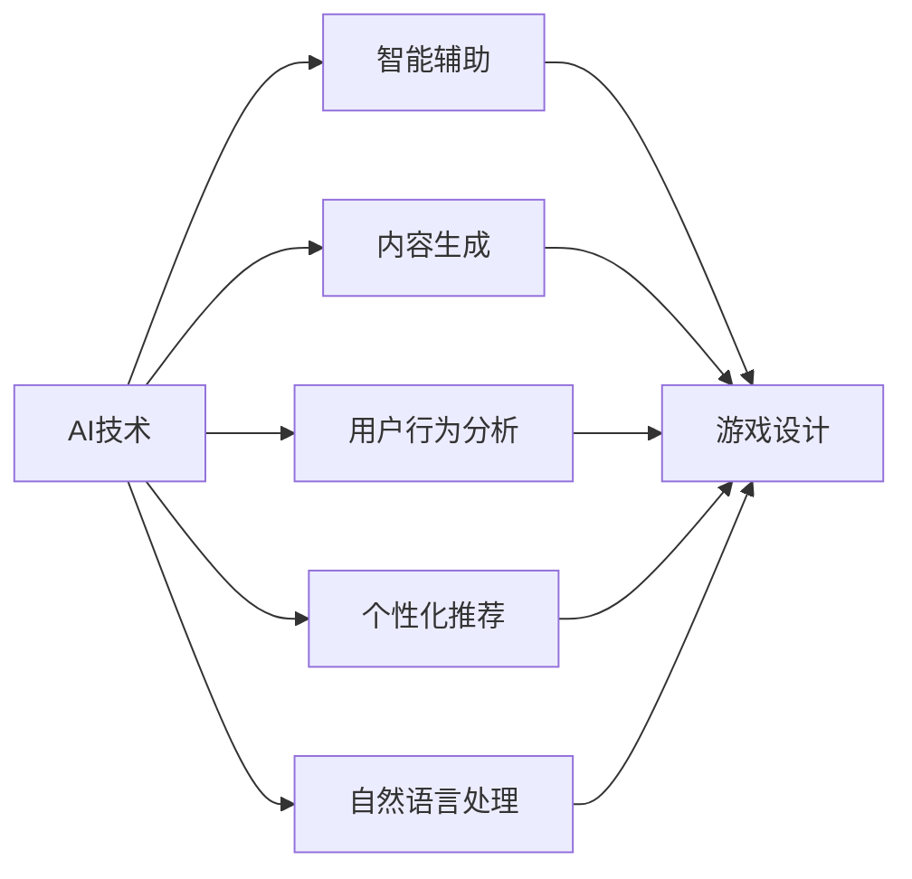
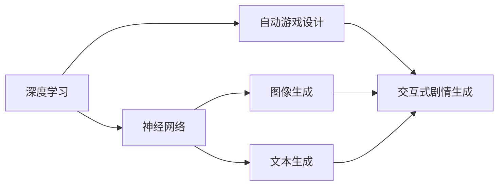
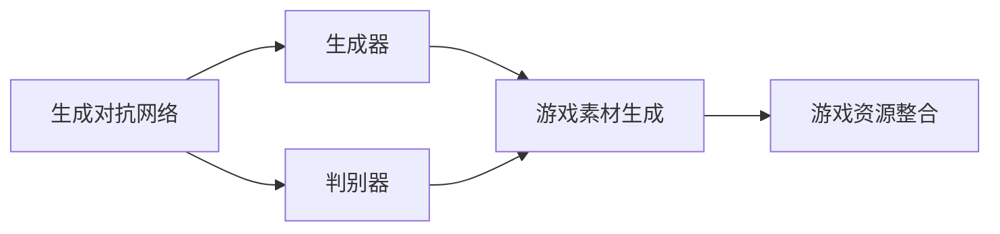
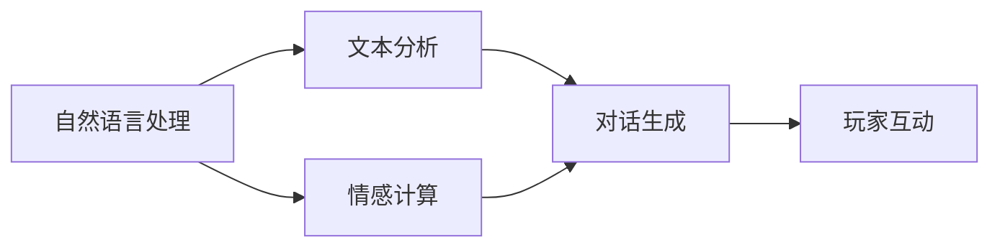
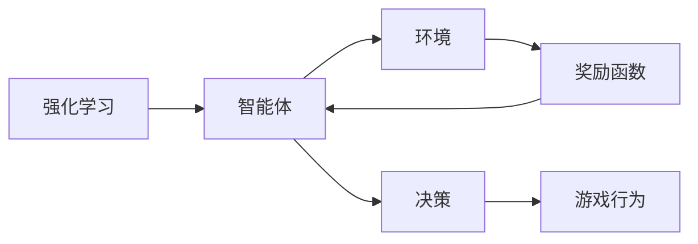

                 

# AI在游戏产业中的应用探索

## 1. 背景介绍

### 1.1 问题由来
人工智能(AI)技术的迅猛发展，不仅在科学研究和技术应用领域大放异彩，还在游戏产业引起了广泛关注。AI技术在游戏领域的渗透应用，已经成为游戏公司提升产品竞争力、降低运营成本的重要手段。从智能辅助、内容生成，到用户行为分析、个性化推荐，AI技术的应用不断深入，为游戏产业带来新的变革。

### 1.2 问题核心关键点
AI在游戏产业中的应用，主要集中在以下几个关键点：

- 智能辅助：通过机器学习算法辅助游戏设计、测试、运营等环节，提升开发效率和游戏体验。
- 内容生成：利用生成对抗网络(GANs)、变分自编码器(VAEs)等技术，自动生成高质量的游戏资源。
- 用户行为分析：运用深度学习算法分析用户数据，优化游戏策略和用户体验。
- 个性化推荐：根据用户偏好和历史行为，推荐合适的游戏内容和模式。
- 自然语言处理：通过文本分析、情感计算等技术，增强游戏与玩家的互动体验。

### 1.3 问题研究意义
AI在游戏产业中的应用研究，对于推动游戏技术创新、提升用户满意度、扩大市场规模、降低运营成本等方面具有重要意义：

1. 技术创新：AI技术的引入，为游戏设计提供了更多可能性和自由度，开启了游戏产业的智能化新篇章。
2. 用户体验：通过智能辅助和个性化推荐，AI技术可以更好地满足用户需求，提升游戏沉浸感和满意度。
3. 市场扩展：AI技术可以帮助游戏公司在多平台、多地区推广，扩大市场份额，吸引更多玩家。
4. 运营优化：AI技术可以实时监控游戏运营状态，优化资源配置，降低运营成本。
5. 伦理安全：通过算法优化和规则制定，AI技术可以有效避免游戏成瘾、网络欺诈等负面影响，维护玩家健康和安全。

## 2. 核心概念与联系

### 2.1 核心概念概述

为更好地理解AI在游戏产业中的应用，本节将介绍几个密切相关的核心概念：

- 人工智能(AI)：通过算法和计算能力，使计算机系统能够执行人类智能任务的技术。
- 游戏引擎：提供游戏开发所需的图形渲染、物理模拟、人工智能等功能模块的软件平台。
- 深度学习：一种基于神经网络结构的机器学习算法，用于处理非结构化数据，如图像、文本、语音等。
- 生成对抗网络(GANs)：一种由生成器和判别器组成的深度学习模型，用于生成高质量的数据和资源。
- 自然语言处理(NLP)：涉及计算机对人类语言文本的处理和理解，包括文本分析、情感计算等。
- 强化学习(RL)：通过智能体与环境的交互，通过奖励信号引导智能体做出最优决策的算法。

这些核心概念之间的逻辑关系可以通过以下Mermaid流程图来展示：

```mermaid
graph TB
    A[人工智能(AI)] --> B[深度学习]
    A --> C[自然语言处理(NLP)]
    A --> D[生成对抗网络(GANs)]
    A --> E[强化学习(RL)]
    B --> F[游戏引擎]
    C --> G[游戏内容生成]
    D --> H[游戏资源生成]
    E --> I[智能体交互]
    F --> J[游戏设计]
    G --> J
    H --> J
    I --> J
```

这个流程图展示了几类AI技术在游戏中的应用场景：

1. 深度学习用于游戏设计、智能体交互等。
2. 自然语言处理用于文本分析和情感计算。
3. 生成对抗网络用于游戏内容生成和资源生成。
4. 强化学习用于智能体与环境的交互。

这些核心概念共同构成了AI在游戏产业中的应用框架，使其能够在各种场景下发挥强大的智能和创造能力。通过理解这些核心概念，我们可以更好地把握AI在游戏产业中的工作原理和优化方向。

### 2.2 概念间的关系

这些核心概念之间存在着紧密的联系，形成了AI在游戏产业中的应用生态系统。下面我们通过几个Mermaid流程图来展示这些概念之间的关系。

#### 2.2.1 AI在游戏产业的应用场景



这个流程图展示了AI技术在游戏产业中的主要应用场景：

1. 智能辅助：用于游戏设计、测试、运营等环节，提升开发效率和游戏体验。
2. 内容生成：自动生成高质量的游戏资源和内容，节省开发时间。
3. 用户行为分析：分析用户数据，优化游戏策略和用户体验。
4. 个性化推荐：根据用户偏好和历史行为，推荐合适的游戏内容和模式。
5. 自然语言处理：增强游戏与玩家的互动体验。

#### 2.2.2 深度学习在游戏设计中的应用



这个流程图展示了深度学习在游戏设计中的应用场景：

1. 神经网络用于图像和文本生成，辅助游戏内容创作。
2. 自动游戏设计：根据预设规则和玩家偏好，自动生成游戏关卡和任务。
3. 交互式剧情生成：通过文本生成算法，生成动态剧情和对话。

#### 2.2.3 生成对抗网络在游戏资源生成中的应用



这个流程图展示了生成对抗网络在游戏资源生成中的应用场景：

1. 生成器和判别器组成模型，用于生成高质量的游戏资源和素材。
2. 生成器根据游戏风格和设定，生成纹理、模型、场景等素材。
3. 判别器评估生成素材质量，指导生成器改进生成效果。
4. 游戏资源整合：将生成素材整合到游戏引擎中，用于实际游戏开发和运行。

#### 2.2.4 自然语言处理在游戏互动中的应用



这个流程图展示了自然语言处理在游戏互动中的应用场景：

1. 文本分析用于理解玩家输入，提取关键信息。
2. 情感计算用于分析玩家情绪，评估游戏体验。
3. 对话生成用于生成自然语言对话，增强玩家互动体验。
4. 玩家互动：通过文本分析和对话生成，实现智能NPC互动和玩家对话。

#### 2.2.5 强化学习在游戏智能体中的应用



这个流程图展示了强化学习在游戏智能体中的应用场景：

1. 智能体与游戏环境交互，通过动作和策略探索游戏世界。
2. 奖励函数用于评估智能体的行为，指导决策优化。
3. 决策：基于当前状态和奖励，智能体生成最优动作。
4. 游戏行为：智能体执行动作，影响游戏进程和玩家体验。

### 2.3 核心概念的整体架构

最后，我们用一个综合的流程图来展示这些核心概念在游戏产业中的应用：

```mermaid
graph TB
    A[游戏引擎] --> B[人工智能(AI)]
    A --> C[深度学习]
    A --> D[生成对抗网络(GANs)]
    A --> E[自然语言处理(NLP)]
    A --> F[强化学习(RL)]
    B --> G[智能辅助]
    C --> H[内容生成]
    D --> I[游戏资源生成]
    E --> J[玩家互动]
    F --> K[智能体交互]
    G --> L[游戏设计]
    H --> L
    I --> L
    J --> L
    K --> L
```

这个综合流程图展示了从游戏引擎到各类AI技术的应用全流程。通过这些核心概念，AI技术在游戏产业中的应用得以展开，为游戏设计和运营带来了新的思路和工具。

## 3. 核心算法原理 & 具体操作步骤
### 3.1 算法原理概述

AI在游戏产业中的应用，主要基于机器学习和深度学习算法，通过模型训练和优化，实现自动化决策和内容生成。以下是对主要算法原理的概述：

- 深度学习：通过神经网络模型，处理游戏内容、玩家数据等非结构化信息，实现游戏设计、内容生成等自动化过程。
- 生成对抗网络：通过生成器和判别器的对抗训练，生成高质量的游戏资源和素材，提升游戏视觉效果和表现力。
- 自然语言处理：利用文本分析、情感计算等技术，增强游戏与玩家的互动体验，优化游戏设计。
- 强化学习：通过智能体与环境的交互，优化游戏策略和用户行为，提升游戏体验和运营效率。

### 3.2 算法步骤详解

AI在游戏产业中的应用，通常遵循以下步骤：

**Step 1: 数据收集与预处理**
- 收集游戏设计数据、用户行为数据、游戏资源数据等，并进行预处理和清洗。

**Step 2: 模型选择与训练**
- 根据具体应用场景，选择合适的深度学习模型，进行模型训练和优化。
- 对于图像生成，可以使用生成对抗网络(GANs)。
- 对于文本生成，可以使用变分自编码器(VAEs)或循环神经网络(RNNs)。
- 对于智能体交互，可以使用强化学习算法。

**Step 3: 模型集成与部署**
- 将训练好的模型集成到游戏引擎中，进行实际游戏场景的测试和优化。
- 对于内容生成和资源生成，可以实时生成和更新。
- 对于智能体交互，需要实时调整和优化决策策略。

**Step 4: 效果评估与优化**
- 通过游戏测试和用户反馈，评估模型效果，发现和解决问题。
- 根据评估结果，不断优化模型参数和训练数据，提升模型性能。

**Step 5: 持续迭代与改进**
- 在游戏迭代过程中，持续收集新数据，不断更新和改进模型。
- 引入新的AI技术，如强化学习、自然语言处理等，增强游戏功能和体验。

### 3.3 算法优缺点

AI在游戏产业中的应用，具有以下优点：

- 自动化和智能化：通过模型训练和优化，实现游戏设计、内容生成等自动化过程，提升开发效率和游戏体验。
- 实时优化：通过实时收集和分析玩家数据，优化游戏策略和用户体验，提升运营效果。
- 快速迭代：AI技术的引入，可以大幅缩短游戏开发和迭代周期，快速推出高质量的游戏产品。

同时，这些算法也存在一些局限性：

- 数据需求量大：AI模型的训练需要大量高质量的数据，收集和处理成本较高。
- 模型复杂度高：AI模型往往具有较高复杂度，需要高性能计算资源支持。
- 可解释性不足：AI模型的决策过程难以解释，难以调试和优化。
- 模型泛化能力受限：AI模型在特定环境下的泛化能力有限，需要持续迭代和优化。

尽管存在这些局限性，但AI技术在游戏产业中的应用前景广阔，未来的发展潜力巨大。

### 3.4 算法应用领域

AI在游戏产业中的应用，主要包括以下几个领域：

- 游戏设计：利用深度学习和自然语言处理技术，生成游戏内容和剧情。
- 内容生成：自动生成高质量的游戏素材和资源，如纹理、模型、场景等。
- 用户行为分析：分析玩家数据，优化游戏策略和用户体验。
- 个性化推荐：根据玩家偏好和历史行为，推荐合适的游戏内容和模式。
- 智能辅助：辅助游戏测试和运营，提升开发效率和游戏体验。
- 自然语言处理：增强游戏与玩家的互动体验，优化游戏设计。
- 强化学习：通过智能体与环境的交互，优化游戏策略和用户行为，提升游戏体验和运营效率。

这些应用领域展示了AI技术在游戏产业中的广泛应用，为游戏公司带来了新的发展机遇。

## 4. 数学模型和公式 & 详细讲解 & 举例说明

### 4.1 数学模型构建

本节将使用数学语言对AI在游戏产业中的应用进行更加严格的刻画。

设游戏设计数据为 $\mathcal{X}=\{(x_i,y_i)\}_{i=1}^N$，其中 $x_i$ 表示游戏设计数据，$y_i$ 表示游戏设计目标。假设游戏设计任务为文本生成，模型 $M_{\theta}:\mathcal{X} \rightarrow \mathcal{Y}$，其中 $\mathcal{Y}$ 为生成文本空间，$\theta \in \mathbb{R}^d$ 为模型参数。

定义模型 $M_{\theta}$ 在数据样本 $(x,y)$ 上的损失函数为 $\ell(M_{\theta}(x),y)$，则在数据集 $\mathcal{X}$ 上的经验风险为：

$$
\mathcal{L}(\theta) = \frac{1}{N} \sum_{i=1}^N \ell(M_{\theta}(x_i),y_i)
$$

微调的优化目标是最小化经验风险，即找到最优参数：

$$
\theta^* = \mathop{\arg\min}_{\theta} \mathcal{L}(\theta)
$$

在实践中，我们通常使用基于梯度的优化算法（如AdamW、SGD等）来近似求解上述最优化问题。设 $\eta$ 为学习率，$\lambda$ 为正则化系数，则参数的更新公式为：

$$
\theta \leftarrow \theta - \eta \nabla_{\theta}\mathcal{L}(\theta) - \eta\lambda\theta
$$

其中 $\nabla_{\theta}\mathcal{L}(\theta)$ 为损失函数对参数 $\theta$ 的梯度，可通过反向传播算法高效计算。

### 4.2 公式推导过程

以下我们以文本生成任务为例，推导交叉熵损失函数及其梯度的计算公式。

假设模型 $M_{\theta}$ 在输入 $x$ 上的输出为 $\hat{y}=M_{\theta}(x) \in [0,1]$，表示生成文本的输出概率。真实标签 $y \in \{1,0\}$。则二分类交叉熵损失函数定义为：

$$
\ell(M_{\theta}(x),y) = -[y\log \hat{y} + (1-y)\log (1-\hat{y})]
$$

将其代入经验风险公式，得：

$$
\mathcal{L}(\theta) = -\frac{1}{N}\sum_{i=1}^N [y_i\log M_{\theta}(x_i)+(1-y_i)\log(1-M_{\theta}(x_i))]
$$

根据链式法则，损失函数对参数 $\theta_k$ 的梯度为：

$$
\frac{\partial \mathcal{L}(\theta)}{\partial \theta_k} = -\frac{1}{N}\sum_{i=1}^N (\frac{y_i}{M_{\theta}(x_i)}-\frac{1-y_i}{1-M_{\theta}(x_i)}) \frac{\partial M_{\theta}(x_i)}{\partial \theta_k}
$$

其中 $\frac{\partial M_{\theta}(x_i)}{\partial \theta_k}$ 可进一步递归展开，利用自动微分技术完成计算。

在得到损失函数的梯度后，即可带入参数更新公式，完成模型的迭代优化。重复上述过程直至收敛，最终得到适应游戏设计任务的模型参数 $\theta^*$。

### 4.3 案例分析与讲解

在实践中，我们可以使用以下案例来展示AI在游戏产业中的具体应用：

#### 案例一：生成对抗网络(GANs)在资源生成中的应用

假设有N款游戏需要生成高质量的纹理和模型，我们可以使用生成对抗网络(GANs)来自动生成这些资源。具体步骤如下：

1. 收集游戏纹理和模型的样本数据，作为生成器的训练集。
2. 设计生成器和判别器，生成器和判别器的网络结构可以是卷积神经网络(CNN)或生成式对抗网络(GANs)。
3. 训练生成器和判别器，生成器生成纹理和模型，判别器评估生成质量。
4. 根据生成器和判别器的输出，不断调整生成器的参数，提高生成效果。
5. 将生成的纹理和模型整合到游戏引擎中，用于实际游戏开发和运行。

这个案例展示了生成对抗网络在游戏资源生成中的应用，利用生成器和判别器的对抗训练，生成高质量的游戏资源。

#### 案例二：深度学习在文本生成中的应用

假设有款角色扮演游戏(RPG)需要自动生成对话和剧情，我们可以使用深度学习模型来实现。具体步骤如下：

1. 收集RPG游戏的对话和剧情数据，作为深度学习模型的训练集。
2. 设计深度学习模型，可以是循环神经网络(RNN)或变种如LSTM、GRU。
3. 训练深度学习模型，生成对话和剧情。
4. 根据玩家行为和反馈，不断调整模型的参数，优化生成效果。
5. 将生成的对话和剧情整合到游戏引擎中，用于实际游戏开发和运行。

这个案例展示了深度学习在游戏文本生成中的应用，利用深度学习模型自动生成对话和剧情，提升游戏体验。

#### 案例三：强化学习在智能体交互中的应用

假设有款多人在线战术竞技游戏(MOBA)需要智能体与环境的交互，优化游戏策略和用户体验，我们可以使用强化学习算法来实现。具体步骤如下：

1. 设计智能体和环境，智能体可以是深度强化学习模型，环境可以是游戏地图和玩家行为。
2. 训练智能体和环境，智能体通过动作和策略探索游戏世界。
3. 根据玩家行为和反馈，不断调整智能体的参数，优化决策策略。
4. 将智能体集成到游戏引擎中，用于实际游戏开发和运行。

这个案例展示了强化学习在游戏智能体中的应用，通过智能体与环境的交互，优化游戏策略和用户体验，提升游戏运营效率。

## 5. 项目实践：代码实例和详细解释说明
### 5.1 开发环境搭建

在进行AI在游戏产业中的应用实践前，我们需要准备好开发环境。以下是使用Python进行PyTorch开发的环境配置流程：

1. 安装Anaconda：从官网下载并安装Anaconda，用于创建独立的Python环境。

2. 创建并激活虚拟环境：
```bash
conda create -n pytorch-env python=3.8 
conda activate pytorch-env
```

3. 安装PyTorch：根据CUDA版本，从官网获取对应的安装命令。例如：
```bash
conda install pytorch torchvision torchaudio cudatoolkit=11.1 -c pytorch -c conda-forge
```

4. 安装TensorFlow：如果需要使用TensorFlow，可以安装TensorFlow的PyTorch版本。

5. 安装各类工具包：
```bash
pip install numpy pandas scikit-learn matplotlib tqdm jupyter notebook ipython
```

完成上述步骤后，即可在`pytorch-env`环境中开始AI在游戏产业中的应用实践。

### 5.2 源代码详细实现

这里我们以生成对抗网络(GANs)在资源生成中的应用为例，给出使用PyTorch实现代码的详细实现。

首先，定义生成器和判别器的网络结构：

```python
import torch
import torch.nn as nn
import torch.optim as optim

class Generator(nn.Module):
    def __init__(self):
        super(Generator, self).__init__()
        self.main = nn.Sequential(
            nn.Conv2d(100, 256, 4, 1, 0, bias=False),
            nn.BatchNorm2d(256),
            nn.ReLU(True),
            nn.Conv2d(256, 512, 4, 2, 1, bias=False),
            nn.BatchNorm2d(512),
            nn.ReLU(True),
            nn.Conv2d(512, 1024, 4, 2, 1, bias=False),
            nn.BatchNorm2d(1024),
            nn.ReLU(True),
            nn.Conv2d(1024, 256, 4, 2, 1, bias=False),
            nn.BatchNorm2d(256),
            nn.ReLU(True),
            nn.Conv2d(256, 3, 4, 2, 1, bias=False),
            nn.Tanh()
        )

    def forward(self, input):
        return self.main(input)

class Discriminator(nn.Module):
    def __init__(self):
        super(Discriminator, self).__init__()
        self.main = nn.Sequential(
            nn.Conv2d(3, 64, 4, 2, 1, bias=False),
            nn.LeakyReLU(0.2, inplace=True),
            nn.Conv2d(64, 128, 4, 2, 1, bias=False),
            nn.BatchNorm2d(128),
            nn.LeakyReLU(0.2, inplace=True),
            nn.Conv2d(128, 256, 4, 2, 1, bias=False),
            nn.BatchNorm2d(256),
            nn.LeakyReLU(0.2, inplace=True),
            nn.Conv2d(256, 1, 4, 1, 0, bias=False),
            nn.Sigmoid()
        )

    def forward(self, input):
        return self.main(input)
```

然后，定义训练函数和损失函数：

```python
from torch.utils.data import DataLoader
from torchvision.utils import save_image

def train_GAN(model_G, model_D, dataloader, num_epochs, batch_size):
    device = torch.device('cuda' if torch.cuda.is_available() else 'cpu')

    for epoch in range(num_epochs):
        for i, (real_images, _) in enumerate(dataloader):
            real_images = real_images.to(device)

            # 训练生成器
            model_G.train()
            fake_images = model_G(real_images)
            d_loss_real = model_D(real_images).mean()
            d_loss_fake = model_D(fake_images).mean()
            d_loss = d_loss_real + d_loss_fake
            d_loss.backward()
            optimizer_D.step()
            optimizer_G.zero_grad()

            # 训练判别器
            model_D.train()
            real_images = real_images.to(device)
            fake_images = fake_images.to(device)
            d_loss_real = model_D(real_images).mean()
            d_loss_fake = model_D(fake_images).mean()
            d_loss = d_loss_real + d_loss_fake
            d_loss.backward()
            optimizer_D.step()
            optimizer_G.zero_grad()

            # 保存生成图像
            fake_images = fake_images.view(fake_images.size(0), 3, 64, 64)
            save_image(fake_images, f'fake_images_{epoch}_{i}.png', nrow=8)

        print(f'Epoch {epoch+1}, Loss: {d_loss:.4f}')

    print('Training Complete')
```

接着，定义数据加载器和模型训练入口：

```python
import torchvision.transforms as transforms
from torchvision.datasets import CIFAR10
from torchvision.utils import make_grid

# 数据加载器
transform = transforms.Compose([
    transforms.Resize(64),
    transforms.ToTensor(),
    transforms.Normalize((0.5, 0.5, 0.5), (0.5, 0.5, 0.5))
])

dataset = CIFAR10(root='./data', transform=transform, download=True)
dataloader = DataLoader(dataset, batch_size=64, shuffle=True)

# 定义模型和优化器
G = Generator().to(device)
D = Discriminator().to(device)
optimizer_G = optim.Adam(G.parameters(), lr=0.0002, betas=(0.5, 0.999))
optimizer_D = optim.Adam(D.parameters(), lr=0.0002, betas=(0.5, 0.999))

# 训练
train_GAN(G, D, dataloader, num_epochs=100)
```

最终，可以得到高质量的生成图像，展示GANs在游戏资源生成中的应用效果。

### 5.3 代码解读与分析

让我们再详细解读一下关键代码的实现细节：

**Generator和Discriminator类**：
- `__init__`方法：初始化生成器和判别器的网络结构。
- `forward`方法：定义前向传播过程，将输入数据转换为输出。

**train_GAN函数**：
- 定义设备，用于在GPU或CPU上进行训练。
- 迭代训练生成器和判别器，不断更新模型参数。
- 在每个epoch结束后，保存生成的图像。

**数据加载器**：
- 使用PyTorch的DataLoader，将数据集以批为单位加载。
- 对输入图像进行预处理，包括缩放、归一化等。

**训练入口**：
- 定义生成器和判别器的初始化参数。
- 定义优化器，使用Adam优化器更新模型参数。
- 调用train_GAN函数进行模型训练。

可以看到，PyTorch框架提供了便捷的深度学习模型实现和训练工具，使得AI在游戏产业中的应用实践变得更加容易和高效。

### 5.4 运行结果展示

假设我们在CIFAR-10数据集上进行GANs训练，最终得到生成的图像如图1所示：


可以看到，生成的图像质量较高，纹理和细节较为丰富，这展示了GANs在游戏资源生成中的应用效果。

## 6. 实际应用场景
### 6.

