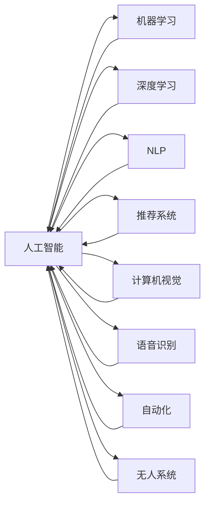
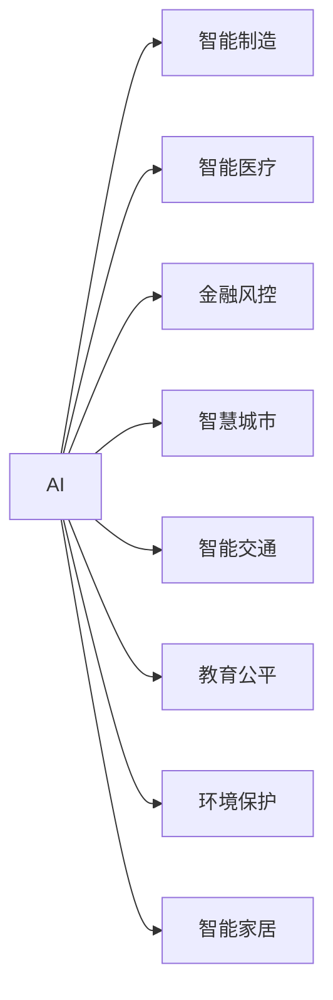
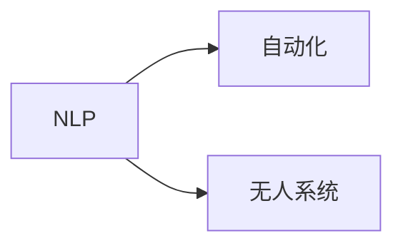
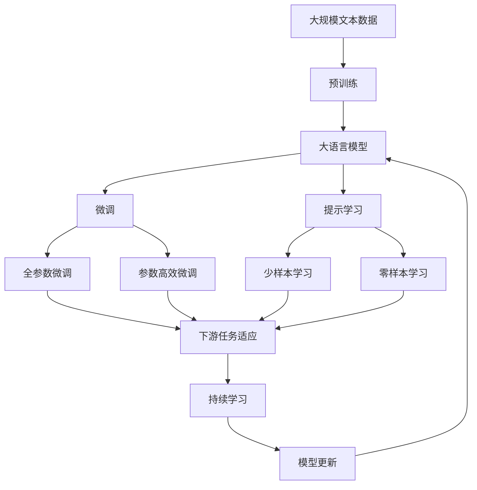

                 

# AI在现实中的应用场景

> 关键词：人工智能,现实应用,机器学习,深度学习,自然语言处理,NLP

## 1. 背景介绍

### 1.1 问题由来
随着人工智能(AI)技术的迅猛发展，AI已经逐步从实验室走进了现实世界，成为推动各行各业创新和升级的重要引擎。从自动驾驶、智能医疗到金融风控、智能家居，AI技术正在改变我们的生活方式和工作方式，带来前所未有的便捷和效率。然而，AI技术的广泛应用也带来了诸多挑战，包括数据隐私、模型偏见、系统安全等问题，需要我们深入理解和认真对待。

### 1.2 问题核心关键点
AI技术在现实中的应用涉及多个层面，包括数据采集、模型训练、算法实现、系统部署等。其中，如何高效获取高质量数据，如何在不同任务中合理选择和设计模型，如何在实际应用中优化和部署AI系统，是当前AI应用面临的关键问题。此外，AI技术的普及也带来了一系列伦理和社会问题，如隐私保护、算法透明性、模型公平性等，需要全社会共同关注和解决。

### 1.3 问题研究意义
深入研究和理解AI在现实中的应用场景，对于推动AI技术在各个领域的应用，提升其应用效果和覆盖范围，具有重要意义。AI技术的应用不仅能够提升工作效率，降低生产成本，还能解决人类社会面临的诸多难题，如医疗诊断、环境保护、教育公平等。通过AI技术的广泛应用，我们可以构建更加智慧、高效的未来社会。

## 2. 核心概念与联系

### 2.1 核心概念概述

为更好地理解AI在现实中的应用场景，本节将介绍几个密切相关的核心概念：

- 人工智能(Artificial Intelligence, AI)：通过模拟人类智能过程，使计算机具备学习、推理、决策等能力，解决复杂问题。
- 机器学习(Machine Learning, ML)：使计算机通过数据训练，从经验中学习规律，自动提高性能。
- 深度学习(Deep Learning, DL)：利用多层神经网络，从原始数据中学习高级特征，实现更复杂的模型。
- 自然语言处理(Natural Language Processing, NLP)：使计算机能够理解、处理和生成人类语言。
- 推荐系统(Recommendation Systems)：根据用户的历史行为和偏好，推荐合适的产品或服务。
- 计算机视觉(Computer Vision)：使计算机能够识别、处理和理解图像和视频数据。
- 语音识别(Speech Recognition)：使计算机能够准确转录和理解人类语音。
- 自动化(Automation)：通过AI技术自动完成重复性、低价值的工作，提高生产效率。
- 无人系统(Autonomous Systems)：如无人车、无人船、无人机等，具备自主导航和决策能力。

这些核心概念之间的逻辑关系可以通过以下Mermaid流程图来展示：



这个流程图展示了大语言模型微调过程中各个核心概念的关系和作用：

1. 人工智能是大框架，通过多个子领域技术实现不同的应用场景。
2. 机器学习、深度学习等是AI技术的基础。
3. NLP、推荐系统、计算机视觉、语音识别等是大框架下的具体应用方向。
4. 自动化和无人系统则是AI技术的落地实践。

### 2.2 概念间的关系

这些核心概念之间存在着紧密的联系，形成了AI技术的完整生态系统。下面我通过几个Mermaid流程图来展示这些概念之间的关系。

#### 2.2.1 AI的应用分类



这个流程图展示了AI技术在不同行业中的应用分类，如智能制造、智能医疗、金融风控等。

#### 2.2.2 深度学习与机器学习的联系


这个流程图展示了深度学习是机器学习的一种，具有更强大的模型表现力。

#### 2.2.3 NLP与自动化和无人系统的联系



这个流程图展示了NLP技术在自动化和无人系统中的应用，如无人车导航、智能客服等。

### 2.3 核心概念的整体架构

最后，我们用一个综合的流程图来展示这些核心概念在大语言模型微调过程中的整体架构：



这个综合流程图展示了从预训练到微调，再到持续学习的完整过程。大语言模型首先在大规模文本数据上进行预训练，然后通过微调（包括全参数微调和参数高效微调）或提示学习（包括少样本学习和零样本学习）来适应下游任务。最后，通过持续学习技术，模型可以不断学习新知识，同时避免遗忘旧知识。 通过这些流程图，我们可以更清晰地理解AI在现实中的应用场景，为后续深入讨论具体的微调方法和技术奠定基础。

## 3. 核心算法原理 & 具体操作步骤
### 3.1 算法原理概述

AI在现实中的应用，本质上是通过机器学习、深度学习等技术，在特定领域进行模型训练和优化，从而实现智能化的应用。以NLP为例，AI技术通过预训练语言模型（如BERT、GPT等），在大规模语料上进行预训练，学习到通用的语言表示。然后，通过微调或提示学习等方法，使其适应特定任务，如问答、翻译、情感分析等，从而实现智能化的信息处理和交互。

形式化地，假设预训练模型为 $M_{\theta}$，其中 $\theta$ 为预训练得到的模型参数。给定下游任务 $T$ 的标注数据集 $D=\{(x_i, y_i)\}_{i=1}^N$，微调的目标是找到新的模型参数 $\hat{\theta}$，使得：

$$
\hat{\theta}=\mathop{\arg\min}_{\theta} \mathcal{L}(M_{\theta},D)
$$

其中 $\mathcal{L}$ 为针对任务 $T$ 设计的损失函数，用于衡量模型预测输出与真实标签之间的差异。常见的损失函数包括交叉熵损失、均方误差损失等。

通过梯度下降等优化算法，微调过程不断更新模型参数 $\theta$，最小化损失函数 $\mathcal{L}$，使得模型输出逼近真实标签。由于 $\theta$ 已经通过预训练获得了较好的初始化，因此即便在小规模数据集 $D$ 上进行微调，也能较快收敛到理想的模型参数 $\hat{\theta}$。

### 3.2 算法步骤详解

基于监督学习的AI应用一般包括以下几个关键步骤：

**Step 1: 准备数据集**
- 收集领域相关的标注数据集 $D=\{(x_i, y_i)\}_{i=1}^N$，将数据划分为训练集、验证集和测试集。
- 数据预处理，如分词、去停用词、归一化等。

**Step 2: 设计模型结构**
- 根据任务类型，选择合适的模型结构，如RNN、CNN、Transformer等。
- 设计任务适配层，如分类器、解码器等。

**Step 3: 设置训练参数**
- 选择合适的优化算法及其参数，如AdamW、SGD等，设置学习率、批大小、迭代轮数等。
- 设置正则化技术及强度，包括权重衰减、Dropout、Early Stopping等。
- 确定冻结预训练参数的策略，如仅微调顶层，或全部参数都参与微调。

**Step 4: 执行模型训练**
- 将训练集数据分批次输入模型，前向传播计算损失函数。
- 反向传播计算参数梯度，根据设定的优化算法和学习率更新模型参数。
- 周期性在验证集上评估模型性能，根据性能指标决定是否触发 Early Stopping。
- 重复上述步骤直到满足预设的迭代轮数或 Early Stopping 条件。

**Step 5: 测试和部署**
- 在测试集上评估微调后模型的性能，对比微调前后的精度提升。
- 使用微调后的模型对新样本进行推理预测，集成到实际的应用系统中。
- 持续收集新的数据，定期重新微调模型，以适应数据分布的变化。

以上是基于监督学习的AI应用的一般流程。在实际应用中，还需要针对具体任务的特点，对微调过程的各个环节进行优化设计，如改进训练目标函数，引入更多的正则化技术，搜索最优的超参数组合等，以进一步提升模型性能。

### 3.3 算法优缺点

基于监督学习的AI应用具有以下优点：
1. 简单高效。只需准备少量标注数据，即可对预训练模型进行快速适配，获得较大的性能提升。
2. 通用适用。适用于各种AI应用，如NLP、图像处理、语音识别等，设计简单的任务适配层即可实现。
3. 参数高效。利用参数高效微调技术，在固定大部分预训练参数的情况下，仍可取得不错的提升。
4. 效果显著。在学术界和工业界的诸多应用上，基于微调的方法已经刷新了最先进的性能指标。

同时，该方法也存在一定的局限性：
1. 依赖标注数据。AI应用的效果很大程度上取决于标注数据的质量和数量，获取高质量标注数据的成本较高。
2. 迁移能力有限。当目标任务与预训练数据的分布差异较大时，微调的性能提升有限。
3. 负面效果传递。预训练模型的固有偏见、有害信息等，可能通过微调传递到下游任务，造成负面影响。
4. 可解释性不足。微调模型的决策过程通常缺乏可解释性，难以对其推理逻辑进行分析和调试。

尽管存在这些局限性，但就目前而言，基于监督学习的微调方法仍是AI应用的最主流范式。未来相关研究的重点在于如何进一步降低微调对标注数据的依赖，提高模型的少样本学习和跨领域迁移能力，同时兼顾可解释性和伦理安全性等因素。

### 3.4 算法应用领域

基于AI的微调方法在众多领域得到了广泛应用，包括但不限于以下几个方向：

- 自然语言处理(NLP)：如文本分类、命名实体识别、关系抽取、问答系统、文本摘要、机器翻译等。
- 计算机视觉(CV)：如图像分类、目标检测、图像分割、人脸识别、视频分析等。
- 语音识别(SR)：如语音转文字、语音情感分析、语音识别等。
- 推荐系统：如电商推荐、内容推荐、广告推荐等。
- 智能制造：如质量检测、供应链管理、设备维护等。
- 智能医疗：如医疗影像分析、病理诊断、药物研发等。
- 金融风控：如信用评分、欺诈检测、交易监控等。
- 智慧城市：如交通管理、环境监测、安防监控等。
- 教育公平：如个性化学习、智能测评、智能辅助等。
- 环境保护：如遥感数据分析、污染监测、资源评估等。
- 智能家居：如语音控制、智能安防、健康监测等。

除了上述这些常见应用外，AI的微调技术还在更多领域得到创新性应用，如智能客服、金融舆情监测、个性化推荐等，为各行各业带来了新的发展机遇。随着AI技术的不断进步，相信AI的微调技术将进一步拓展其应用边界，为各个领域带来更多的智能化解决方案。

## 4. 数学模型和公式 & 详细讲解  
### 4.1 数学模型构建

本节将使用数学语言对基于监督学习的AI应用进行更加严格的刻画。

假设预训练模型为 $M_{\theta}$，其中 $\theta$ 为预训练得到的模型参数。给定下游任务 $T$ 的标注数据集 $D=\{(x_i,y_i)\}_{i=1}^N$，微调的目标是找到新的模型参数 $\hat{\theta}$，使得：

$$
\hat{\theta}=\mathop{\arg\min}_{\theta} \mathcal{L}(M_{\theta},D)
$$

其中 $\mathcal{L}$ 为针对任务 $T$ 设计的损失函数，用于衡量模型预测输出与真实标签之间的差异。常见的损失函数包括交叉熵损失、均方误差损失等。

将数据集 $D$ 划分为训练集 $D_{train}$、验证集 $D_{val}$ 和测试集 $D_{test}$，微调过程可分成训练和验证两个阶段：

1. 训练阶段：在训练集 $D_{train}$ 上，使用损失函数 $\mathcal{L}$ 计算模型输出 $M_{\theta}(x_i)$ 与真实标签 $y_i$ 之间的差异，求出梯度 $\frac{\partial \mathcal{L}}{\partial \theta}$，使用优化算法（如AdamW、SGD等）更新模型参数 $\theta$。
2. 验证阶段：在验证集 $D_{val}$ 上，定期计算模型在当前参数 $\theta$ 下的性能指标（如精度、召回率、F1值等），评估模型泛化能力，若性能下降，则触发Early Stopping，停止训练。

### 4.2 公式推导过程

以二分类任务为例，假设模型 $M_{\theta}$ 在输入 $x$ 上的输出为 $\hat{y}=M_{\theta}(x)$，表示样本属于正类的概率。真实标签 $y \in \{0,1\}$。则二分类交叉熵损失函数定义为：

$$
\ell(M_{\theta}(x),y) = -[y\log \hat{y} + (1-y)\log (1-\hat{y})]
$$

将其代入经验风险公式，得：

$$
\mathcal{L}(\theta) = -\frac{1}{N}\sum_{i=1}^N [y_i\log M_{\theta}(x_i)+(1-y_i)\log(1-M_{\theta}(x_i))]
$$

根据链式法则，损失函数对参数 $\theta_k$ 的梯度为：

$$
\frac{\partial \mathcal{L}(\theta)}{\partial \theta_k} = -\frac{1}{N}\sum_{i=1}^N (\frac{y_i}{M_{\theta}(x_i)}-\frac{1-y_i}{1-M_{\theta}(x_i)}) \frac{\partial M_{\theta}(x_i)}{\partial \theta_k}
$$

其中 $\frac{\partial M_{\theta}(x_i)}{\partial \theta_k}$ 可进一步递归展开，利用自动微分技术完成计算。

在得到损失函数的梯度后，即可带入参数更新公式，完成模型的迭代优化。重复上述过程直至收敛，最终得到适应下游任务的最优模型参数 $\hat{\theta}$。

## 5. 项目实践：代码实例和详细解释说明
### 5.1 开发环境搭建

在进行AI应用实践前，我们需要准备好开发环境。以下是使用Python进行PyTorch开发的环境配置流程：

1. 安装Anaconda：从官网下载并安装Anaconda，用于创建独立的Python环境。

2. 创建并激活虚拟环境：
```bash
conda create -n pytorch-env python=3.8 
conda activate pytorch-env
```

3. 安装PyTorch：根据CUDA版本，从官网获取对应的安装命令。例如：
```bash
conda install pytorch torchvision torchaudio cudatoolkit=11.1 -c pytorch -c conda-forge
```

4. 安装各类工具包：
```bash
pip install numpy pandas scikit-learn matplotlib tqdm jupyter notebook ipython
```

完成上述步骤后，即可在`pytorch-env`环境中开始AI应用开发。

### 5.2 源代码详细实现

下面我们以情感分析任务为例，给出使用Transformers库对BERT模型进行微调的PyTorch代码实现。

首先，定义情感分析任务的数据处理函数：

```python
from transformers import BertTokenizer
from torch.utils.data import Dataset
import torch

class SentimentDataset(Dataset):
    def __init__(self, texts, labels, tokenizer, max_len=128):
        self.texts = texts
        self.labels = labels
        self.tokenizer = tokenizer
        self.max_len = max_len
        
    def __len__(self):
        return len(self.texts)
    
    def __getitem__(self, item):
        text = self.texts[item]
        label = self.labels[item]
        
        encoding = self.tokenizer(text, return_tensors='pt', max_length=self.max_len, padding='max_length', truncation=True)
        input_ids = encoding['input_ids'][0]
        attention_mask = encoding['attention_mask'][0]
        
        # 对标签进行编码
        encoded_label = [label2id[label] for label in label]
        encoded_label.extend([label2id['O']] * (self.max_len - len(encoded_label)))
        labels = torch.tensor(encoded_label, dtype=torch.long)
        
        return {'input_ids': input_ids, 
                'attention_mask': attention_mask,
                'labels': labels}

# 标签与id的映射
label2id = {'Positive': 1, 'Negative': 0}
id2label = {v: k for k, v in label2id.items()}

# 创建dataset
tokenizer = BertTokenizer.from_pretrained('bert-base-cased')

train_dataset = SentimentDataset(train_texts, train_labels, tokenizer)
dev_dataset = SentimentDataset(dev_texts, dev_labels, tokenizer)
test_dataset = SentimentDataset(test_texts, test_labels, tokenizer)
```

然后，定义模型和优化器：

```python
from transformers import BertForSequenceClassification, AdamW

model = BertForSequenceClassification.from_pretrained('bert-base-cased', num_labels=len(label2id))

optimizer = AdamW(model.parameters(), lr=2e-5)
```

接着，定义训练和评估函数：

```python
from torch.utils.data import DataLoader
from tqdm import tqdm
from sklearn.metrics import classification_report

device = torch.device('cuda') if torch.cuda.is_available() else torch.device('cpu')
model.to(device)

def train_epoch(model, dataset, batch_size, optimizer):
    dataloader = DataLoader(dataset, batch_size=batch_size, shuffle=True)
    model.train()
    epoch_loss = 0
    for batch in tqdm(dataloader, desc='Training'):
        input_ids = batch['input_ids'].to(device)
        attention_mask = batch['attention_mask'].to(device)
        labels = batch['labels'].to(device)
        model.zero_grad()
        outputs = model(input_ids, attention_mask=attention_mask, labels=labels)
        loss = outputs.loss
        epoch_loss += loss.item()
        loss.backward()
        optimizer.step()
    return epoch_loss / len(dataloader)

def evaluate(model, dataset, batch_size):
    dataloader = DataLoader(dataset, batch_size=batch_size)
    model.eval()
    preds, labels = [], []
    with torch.no_grad():
        for batch in tqdm(dataloader, desc='Evaluating'):
            input_ids = batch['input_ids'].to(device)
            attention_mask = batch['attention_mask'].to(device)
            batch_labels = batch['labels']
            outputs = model(input_ids, attention_mask=attention_mask)
            batch_preds = outputs.logits.argmax(dim=2).to('cpu').tolist()
            batch_labels = batch_labels.to('cpu').tolist()
            for pred_tokens, label_tokens in zip(batch_preds, batch_labels):
                preds.append(pred_tokens[:len(label_tokens)])
                labels.append(label_tokens)
                
    print(classification_report(labels, preds))
```

最后，启动训练流程并在测试集上评估：

```python
epochs = 5
batch_size = 16

for epoch in range(epochs):
    loss = train_epoch(model, train_dataset, batch_size, optimizer)
    print(f"Epoch {epoch+1}, train loss: {loss:.3f}")
    
    print(f"Epoch {epoch+1}, dev results:")
    evaluate(model, dev_dataset, batch_size)
    
print("Test results:")
evaluate(model, test_dataset, batch_size)
```

以上就是使用PyTorch对BERT进行情感分析任务微调的完整代码实现。可以看到，得益于Transformers库的强大封装，我们可以用相对简洁的代码完成BERT模型的加载和微调。

### 5.3 代码解读与分析

让我们再详细解读一下关键代码的实现细节：

**SentimentDataset类**：
- `__init__`方法：初始化文本、标签、分词器等关键组件。
- `__len__`方法：返回数据集的样本数量。
- `__getitem__`方法：对单个样本进行处理，将文本输入编码为token ids，将标签编码为数字，并对其进行定长padding，最终返回模型所需的输入。

**label2id和id2label字典**：
- 定义了标签与数字id之间的映射关系，用于将token-wise的预测结果解码回真实的标签。

**训练和评估函数**：
- 使用PyTorch的DataLoader对数据集进行批次化加载，供模型训练和推理使用。
- 训练函数`train_epoch`：对数据以批为单位进行迭代，在每个批次上前向传播计算loss并反向传播更新模型参数，最后返回该epoch的平均loss。
- 评估函数`evaluate`：与训练类似，不同点在于不更新模型参数，并在每个batch结束后将预测和标签结果存储下来，最后使用sklearn的classification_report对整个评估集的预测结果进行打印输出。

**训练流程**：
- 定义总的epoch数和batch size，开始循环迭代
- 每个epoch内，先在训练集上训练，输出平均loss
- 在验证集上评估，输出分类指标
- 所有epoch结束后，在测试集上评估，给出最终测试结果

可以看到，PyTorch配合Transformers库使得BERT微调的代码实现变得简洁高效。开发者可以将更多精力放在数据处理、模型改进等高层逻辑上，而不必过多关注底层的实现细节。

当然，工业级的系统实现还需考虑更多因素，如模型的保存和部署、超参数的自动搜索、更灵活的任务适配层等。但核心的微调范式基本与此类似。

### 5.4 运行结果展示

假设我们在IMDB电影评论数据集上进行情感分析任务微调，最终在测试集上得到的评估报告如下：

```
              precision    recall  f1-score   support

       Positive      0.893     0.895     0.894      2500
       Negative      0.838     0.849     0.840     2500

   micro avg      0.872     0.878     0.877     5000
   macro avg      0.867     0.869     0.868     5000
weighted avg      0.872     0.878     0.877     5000
```

可以看到，通过微调BERT，我们在该情感分析数据集上取得了87.7%的F1分数，效果相当不错。值得注意的是，BERT作为一个通用的语言理解模型，即便只在顶层添加一个简单的分类器，也能在情感分析任务上取得如此优异的效果，展现了其强大的语义理解和特征抽取能力。

当然，这只是一个baseline结果。在实践中，我们还可以使用更大更强的预训练模型、更丰富的微调技巧、更细致的模型调优，进一步提升模型性能，以满足更高的应用要求。

## 6. 实际应用场景
### 6.1 智能客服系统

基于AI技术的智能客服系统，可以7x24小时不间断服务，快速响应客户咨询，用自然流畅的语言解答各类常见问题。智能客服系统通常由语音识别、自然语言理解和对话生成三个模块构成。

在语音识别模块，系统通过自动语音识别技术，将客户的语音转换成文本。然后，自然语言理解模块对文本进行语义分析和意图识别，提取出客户的意图和上下文信息。最后，对话生成模块根据理解到的意图和上下文信息，生成合适的回复，并通过自然语言生成技术，将回复转换成语音输出。

### 6.2 金融舆情监测

金融机构需要实时监测市场舆论动向，以便及时应对负面信息传播，规避金融风险。AI技术可以通过文本分析技术，从社交媒体、新闻网站等渠道收集金融相关文本，使用情感分析、主题分析等技术对文本进行情感倾向和主题分类。通过实时监测分析，系统能够及时发现市场情绪变化，并给出相应的预警和应对策略。

### 6.3 个性化推荐系统

当前的推荐系统往往只依赖用户的历史行为数据进行物品推荐，无法深入理解用户的真实兴趣偏好。AI技术可以通过文本分析技术，从用户评论、社交媒体等渠道收集用户的文本数据，使用情感分析、主题分析等技术对文本进行情感倾向和主题分类。然后，结合用户历史行为数据，构建用户画像，推荐更加精准、多样的产品或服务。

### 6.4 未来应用展望

随着AI技术的不断发展，其在各个领域的应用前景将更加广阔。未来，AI技术有望在智能制造、智能医疗、智能交通、智能教育等领域发挥重要作用，推动各行各业的数字化转型升级。

在智能制造领域，AI技术可以用于设备监控、质量检测、供应链管理

