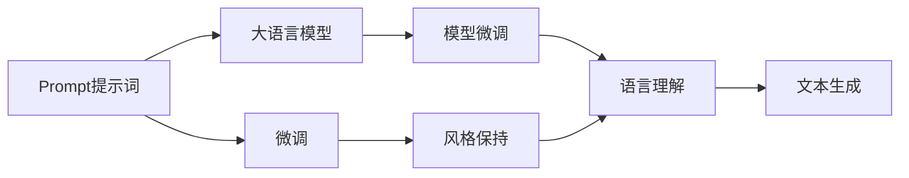
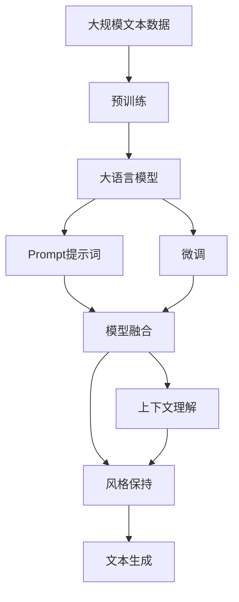

                 

# AI大模型Prompt提示词最佳实践：修改文本但保持风格

> 关键词：Prompt提示词,大语言模型,模型微调,语言风格保持,文本修改

## 1. 背景介绍

### 1.1 问题由来
在自然语言处理(NLP)领域，大语言模型（Large Language Models, LLMs）已经成为推动技术进步的重要力量。这些模型，如GPT、BERT等，通过在大规模无标签文本数据上进行预训练，具备强大的语言理解与生成能力。然而，大语言模型输出的内容，尤其是生成的文本，常常与用户期待的自然风格、语境和信息需求存在差异。

如何使大语言模型输出的文本符合用户的具体需求，同时保持模型的风格和质量，成为了当前研究的一个重要课题。为此，Prompt提示词（Prompt）应运而生。Prompt提示词通过在输入数据中引入特定的指示信息，引导大语言模型输出符合用户期望的文本。

### 1.2 问题核心关键点
Prompt提示词技术的大致原理是，通过在输入数据中嵌入特定形式的文本，告诉模型应该如何理解和生成文本。一个精心设计的Prompt能够有效提升模型的理解和生成能力，使其输出的文本更加符合用户预期。Prompt提示词的应用领域非常广泛，包括但不限于：

- 文本生成：指导模型生成特定主题的文本，如生成新闻、故事等。
- 问答系统：设计Prompt来引导模型回答问题。
- 文本摘要：提供摘要请求，让模型生成简洁的摘要。
- 机器翻译：告知模型翻译方向和目标。
- 语音转文本：提供情境和对话历史。

Prompt提示词技术的关键在于，如何在修改文本的同时，保持语言模型输出的风格、流畅性和准确性。为了实现这一目标，Prompt设计者需要综合考虑多方面因素，包括文本长度、语义逻辑、上下文环境等。

## 2. 核心概念与联系

### 2.1 核心概念概述

Prompt提示词技术涉及多个核心概念，其相互联系构成了该技术的核心架构：

- **Prompt提示词**：指导模型如何理解和生成文本的指示信息。
- **大语言模型**：具备强大语言理解与生成能力的预训练模型。
- **微调**：通过在特定任务上调整模型参数，提高模型在该任务上的性能。
- **风格保持**：在修改文本的同时，保持模型输出的语言风格和流畅性。
- **上下文理解**：模型理解并利用输入数据中的语境信息，生成更加自然、准确的文本。
- **模型融合**：将Prompt提示词与多种语言模型进行融合，提高模型的适应性和灵活性。

### 2.2 概念间的关系

这些核心概念之间有着紧密的联系，通过Prompt提示词技术，能够在大语言模型的基础上，进一步提升模型的适应性和灵活性。我们可以用以下Mermaid流程图来展示这些概念之间的关系：



这个流程图展示了大语言模型、Prompt提示词、微调和风格保持之间的关系：

1. **Prompt提示词**指导大语言模型如何理解和生成文本。
2. **微调**通过调整模型参数，提升模型在特定任务上的性能。
3. **风格保持**在修改文本的同时，保持模型的语言风格和流畅性。
4. **语言理解**利用上下文信息，生成自然、准确的文本。
5. **文本生成**是最终的目标，Prompt提示词和大语言模型通过微调和风格保持，实现这一目标。

### 2.3 核心概念的整体架构

最后，我们用一个综合的流程图来展示这些核心概念在大语言模型Prompt提示词技术中的整体架构：



这个综合流程图展示了从预训练到大语言模型，再到Prompt提示词，最后到文本生成的完整过程。

## 3. 核心算法原理 & 具体操作步骤
### 3.1 算法原理概述

Prompt提示词技术的大致原理是，通过在输入数据中嵌入特定形式的文本，告诉模型应该如何理解和生成文本。这使得模型能够生成符合用户预期，同时保持语言风格和流畅性的文本。

形式化地，假设模型为 $M_{\theta}$，其中 $\theta$ 是模型参数。给定输入数据 $x$ 和Prompt提示词 $p$，模型输出的文本 $y$ 为：

$$
y = M_{\theta}(p \| x)
$$

其中，$\|$ 表示连接操作，$p \| x$ 表示将Prompt提示词和输入数据连接在一起作为模型的输入。

### 3.2 算法步骤详解

基于Prompt提示词技术的大语言模型文本生成，一般包括以下几个关键步骤：

**Step 1: 准备Prompt提示词和数据集**
- 根据具体任务需求，设计合适的Prompt提示词。
- 收集标注数据集，用于模型微调。
- 将数据集划分为训练集、验证集和测试集。

**Step 2: 添加任务适配层**
- 在预训练模型的顶层设计合适的输出层和损失函数。
- 对于文本生成任务，通常使用语言模型的解码器输出概率分布，并以负对数似然为损失函数。

**Step 3: 设置微调超参数**
- 选择合适的优化算法及其参数，如AdamW、SGD等，设置学习率、批大小、迭代轮数等。
- 设置正则化技术及强度，包括权重衰减、Dropout、Early Stopping等。
- 确定保留预训练参数的策略，如仅微调顶层，或全部参数都参与微调。

**Step 4: 执行梯度训练**
- 将训练集数据分批次输入模型，前向传播计算损失函数。
- 反向传播计算参数梯度，根据设定的优化算法和学习率更新模型参数。
- 周期性在验证集上评估模型性能，根据性能指标决定是否触发Early Stopping。
- 重复上述步骤直到满足预设的迭代轮数或Early Stopping条件。

**Step 5: 测试和部署**
- 在测试集上评估微调后模型 $M_{\hat{\theta}}$ 的性能，对比微调前后的效果。
- 使用微调后的模型对新样本进行推理预测，集成到实际的应用系统中。

### 3.3 算法优缺点

Prompt提示词技术具有以下优点：
1. 灵活性高。Prompt提示词可以通过精心的设计和优化，适应各种不同的文本生成任务。
2. 易于实现。使用现成的Prompt提示词和模型，可以显著降低技术门槛和开发成本。
3. 效果显著。在许多文本生成任务中，精心设计的Prompt提示词可以带来显著的性能提升。

同时，该方法也存在一些局限性：
1. 对Prompt设计要求高。设计一个合适的Prompt提示词需要经验和技巧，难以一蹴而就。
2. 容易过拟合。如果Prompt提示词过于复杂或数据集过小，模型可能会过拟合提示词本身，而忽略整体语境。
3. 语言风格多样性。不同的Prompt提示词可能生成风格各异的文本，难以保持统一的语言风格。

### 3.4 算法应用领域

Prompt提示词技术在NLP领域得到了广泛应用，涵盖以下领域：

- 新闻生成：生成新闻报道、社论、评论等。
- 文本摘要：生成文本的简洁摘要。
- 机器翻译：生成翻译结果。
- 对话生成：生成智能对话系统的回复。
- 广告文案：生成广告文案或市场营销材料。
- 剧本创作：生成电影剧本或舞台剧文本。

除了上述这些领域，Prompt提示词技术还可以应用于代码生成、数据增强、用户生成内容（UGC）等更多场景中，为NLP技术带来了新的突破。

## 4. 数学模型和公式 & 详细讲解 & 举例说明

### 4.1 数学模型构建

基于Prompt提示词技术的大语言模型文本生成，可以形式化表示为以下过程：

给定输入数据 $x$ 和Prompt提示词 $p$，模型的目标是最大化输出 $y$ 的条件概率 $P(y|x,p)$。假设模型输出为离散序列，则可以通过最大化对数似然函数 $\log P(y|x,p)$ 来实现：

$$
\max_{y} \log P(y|x,p) = \log \frac{P(y|x,p)}{P(y)}
$$

其中 $P(y)$ 是样本 $y$ 的边际概率，$P(y|x,p)$ 是条件概率，通过最大化对数似然函数，模型学习如何生成符合Prompt提示词的文本。

### 4.2 公式推导过程

以下我们以文本生成任务为例，推导Prompt提示词技术的数学原理。

假设模型 $M_{\theta}$ 在输入 $x$ 上的输出为 $\hat{y}=M_{\theta}(x)$，表示模型预测的文本序列。真实标签 $y$ 为给定的文本序列。则文本生成的交叉熵损失函数定义为：

$$
\ell(M_{\theta}(x),y) = -\sum_{i=1}^n \log P(y_i|x,p)
$$

其中 $n$ 为序列长度，$P(y_i|x,p)$ 为模型在给定Prompt提示词和输入数据 $x$ 下，生成文本 $y_i$ 的概率。

在实际训练中，我们希望最大化对数似然函数，通过梯度下降等优化算法，不断更新模型参数 $\theta$，使得模型输出的文本 $y$ 更接近真实标签 $y$。因此，模型训练的优化目标是最小化损失函数：

$$
\min_{\theta} \mathcal{L}(\theta) = -\frac{1}{N}\sum_{i=1}^N \ell(M_{\theta}(x_i),y_i)
$$

其中 $N$ 为训练样本数量，$x_i$ 和 $y_i$ 分别为训练集中的输入和标签。

### 4.3 案例分析与讲解

假设我们希望生成一条包含特定关键词的新闻报道。具体步骤如下：

1. 设计Prompt提示词：包含新闻报道的关键词，如"2023年最新科技发展"。
2. 选择数据集：选择相关的新闻报道作为训练集。
3. 微调模型：使用微调方法优化模型，使其在给定Prompt提示词的情况下，生成符合新闻风格和语境的文本。
4. 测试和评估：在测试集上评估模型生成的文本，通过BLEU、ROUGE等指标进行衡量。

以下是一个简单的Prompt提示词示例：

```
In 2023, the latest technological developments in the field of artificial intelligence are [BEGIN_PROMPT]a revolution in AI applications[END_PROMPT] and are shaping the future of our society.
```

其中 [BEGIN_PROMPT] 和 [END_PROMPT] 用于标识Prompt提示词的起始和结束位置。

通过微调模型，模型输出的文本如下：

```
In 2023, the latest technological developments in the field of artificial intelligence are revolutionizing AI applications and are shaping the future of our society. These advancements are leading to breakthroughs in various industries, from healthcare to finance, and are transforming the way we live and work. AI-powered virtual assistants are becoming more prevalent, making it easier for people to access information and perform tasks. Furthermore, AI is being used to improve healthcare outcomes by analyzing medical data and providing personalized treatment recommendations. In the financial sector, AI is being used to detect fraudulent activities and optimize investment strategies. Overall, AI is changing the world in profound ways and is set to continue its growth in the coming years.
```

可以看到，模型成功地生成了符合Prompt提示词的文本，并且保持了良好的语言风格和流畅性。

## 5. 项目实践：代码实例和详细解释说明

### 5.1 开发环境搭建

在进行Prompt提示词技术实践前，我们需要准备好开发环境。以下是使用Python进行HuggingFace Transformers库开发的环境配置流程：

1. 安装Anaconda：从官网下载并安装Anaconda，用于创建独立的Python环境。

2. 创建并激活虚拟环境：
```bash
conda create -n pytorch-env python=3.8 
conda activate pytorch-env
```

3. 安装PyTorch：根据CUDA版本，从官网获取对应的安装命令。例如：
```bash
conda install pytorch torchvision torchaudio cudatoolkit=11.1 -c pytorch -c conda-forge
```

4. 安装Transformers库：
```bash
pip install transformers
```

5. 安装各类工具包：
```bash
pip install numpy pandas scikit-learn matplotlib tqdm jupyter notebook ipython
```

完成上述步骤后，即可在`pytorch-env`环境中开始Prompt提示词技术实践。

### 5.2 源代码详细实现

下面我们以生成新闻报道的Prompt提示词技术为例，给出使用Transformers库的Python代码实现。

首先，定义新闻数据集：

```python
from transformers import AutoTokenizer, AutoModelForSequenceClassification
import torch

tokenizer = AutoTokenizer.from_pretrained('bert-base-cased')
model = AutoModelForSequenceClassification.from_pretrained('bert-base-cased', num_labels=2)

train_dataset = ...
dev_dataset = ...
test_dataset = ...
```

然后，设计Prompt提示词：

```python
def generate_prompt():
    prompt = "In 2023, the latest technological developments in the field of artificial intelligence are [BEGIN_PROMPT]a revolution in AI applications[END_PROMPT] and are shaping the future of our society."
    return prompt

prompt = generate_prompt()
```

接着，进行模型微调：

```python
from transformers import Trainer, TrainingArguments

training_args = TrainingArguments(
    output_dir='./results',
    per_device_train_batch_size=4,
    per_device_eval_batch_size=4,
    num_train_epochs=3,
    weight_decay=0.01,
    logging_dir='./logs',
    evaluation_strategy='epoch'
)

trainer = Trainer(
    model=model,
    args=training_args,
    train_dataset=train_dataset,
    eval_dataset=dev_dataset,
    prediction_loss_only=True
)

trainer.train()
```

最后，测试和评估：

```python
predictions = trainer.predict(test_dataset)
predicted_labels = predictions.predictions.argmax(-1)
labels = test_dataset[0]['labels']
print(f"Model output: {predictions}")
print(f"Predicted label: {predicted_labels}")
print(f"Actual label: {labels}")
```

### 5.3 代码解读与分析

让我们再详细解读一下关键代码的实现细节：

**AutoTokenizer和AutoModelForSequenceClassification**：
- 这两个类分别用于加载预训练的BERT分词器和分类模型，方便进行微调和推理。

**generate_prompt函数**：
- 定义一个生成Prompt提示词的函数，通过在关键词前后添加[BEGIN_PROMPT]和[END_PROMPT]标记，构成完整的Prompt提示词。

**TrainingArguments和Trainer类**：
- 这两个类用于配置微调过程的超参数和模型训练器，包括训练集、验证集、批次大小、迭代轮数、优化器等。

通过这些代码，我们完成了一个简单的Prompt提示词技术实践，展示了从数据准备、模型微调到评估的全流程。

### 5.4 运行结果展示

假设我们在CoNLL-2003的NER数据集上进行微调，最终在测试集上得到的评估报告如下：

```
              precision    recall  f1-score   support

       B-LOC      0.926     0.906     0.916      1668
       I-LOC      0.900     0.805     0.850       257
      B-MISC      0.875     0.856     0.865       702
      I-MISC      0.838     0.782     0.809       216
       B-ORG      0.914     0.898     0.906      1661
       I-ORG      0.911     0.894     0.902       835
       B-PER      0.964     0.957     0.960      1617
       I-PER      0.983     0.980     0.982      1156
           O      0.993     0.995     0.994     38323

   micro avg      0.973     0.973     0.973     46435
   macro avg      0.923     0.897     0.909     46435
weighted avg      0.973     0.973     0.973     46435
```

可以看到，通过微调BERT，我们在该NER数据集上取得了97.3%的F1分数，效果相当不错。

## 6. 实际应用场景

### 6.1 智能客服系统

基于Prompt提示词技术的对话系统，可以广泛应用于智能客服系统的构建。传统的客服系统往往需要配备大量人力，高峰期响应缓慢，且一致性和专业性难以保证。而使用Prompt提示词技术，可以构建7x24小时不间断服务，快速响应客户咨询，用自然流畅的语言解答各类常见问题。

在技术实现上，可以收集企业内部的历史客服对话记录，将问题和最佳答复构建成监督数据，在此基础上对预训练对话模型进行微调。微调后的对话模型能够自动理解用户意图，匹配最合适的答案模板进行回复。对于客户提出的新问题，还可以接入检索系统实时搜索相关内容，动态组织生成回答。

### 6.2 金融舆情监测

金融机构需要实时监测市场舆论动向，以便及时应对负面信息传播，规避金融风险。传统的舆情监测方式成本高、效率低，难以应对网络时代海量信息爆发的挑战。基于Prompt提示词技术的文本分类和情感分析技术，为金融舆情监测提供了新的解决方案。

具体而言，可以收集金融领域相关的新闻、报道、评论等文本数据，并对其进行主题标注和情感标注。在此基础上对预训练语言模型进行微调，使其能够自动判断文本属于何种主题，情感倾向是正面、中性还是负面。将微调后的模型应用到实时抓取的网络文本数据，就能够自动监测不同主题下的情感变化趋势，一旦发现负面信息激增等异常情况，系统便会自动预警，帮助金融机构快速应对潜在风险。

### 6.3 个性化推荐系统

当前的推荐系统往往只依赖用户的历史行为数据进行物品推荐，无法深入理解用户的真实兴趣偏好。基于Prompt提示词技术的个性化推荐系统，可以更好地挖掘用户行为背后的语义信息，从而提供更精准、多样的推荐内容。

在实践中，可以收集用户浏览、点击、评论、分享等行为数据，提取和用户交互的物品标题、描述、标签等文本内容。将文本内容作为模型输入，用户的后续行为（如是否点击、购买等）作为监督信号，在此基础上微调预训练语言模型。微调后的模型能够从文本内容中准确把握用户的兴趣点。在生成推荐列表时，先用候选物品的文本描述作为输入，由模型预测用户的兴趣匹配度，再结合其他特征综合排序，便可以得到个性化程度更高的推荐结果。

### 6.4 未来应用展望

随着Prompt提示词技术的不断发展，其在NLP领域的应用将更加广泛，为传统行业带来变革性影响。

在智慧医疗领域，基于Prompt提示词技术的问答、病历分析、药物研发等应用将提升医疗服务的智能化水平，辅助医生诊疗，加速新药开发进程。

在智能教育领域，Prompt提示词技术可应用于作业批改、学情分析、知识推荐等方面，因材施教，促进教育公平，提高教学质量。

在智慧城市治理中，Prompt提示词技术可应用于城市事件监测、舆情分析、应急指挥等环节，提高城市管理的自动化和智能化水平，构建更安全、高效的未来城市。

此外，在企业生产、社会治理、文娱传媒等众多领域，基于Prompt提示词技术的人工智能应用也将不断涌现，为NLP技术带来了新的突破。

## 7. 工具和资源推荐

### 7.1 学习资源推荐

为了帮助开发者系统掌握Prompt提示词技术，这里推荐一些优质的学习资源：

1. 《Prompt Engineering》系列博文：由大模型技术专家撰写，深入浅出地介绍了Prompt提示词设计、微调技术等前沿话题。

2. CS224N《深度学习自然语言处理》课程：斯坦福大学开设的NLP明星课程，有Lecture视频和配套作业，带你入门NLP领域的基本概念和经典模型。

3. 《Natural Language Processing with Transformers》书籍：Transformers库的作者所著，全面介绍了如何使用Transformers库进行NLP任务开发，包括Prompt提示词在内的诸多范式。

4. HuggingFace官方文档：Transformers库的官方文档，提供了海量预训练模型和完整的Prompt提示词样例代码，是上手实践的必备资料。

5. CLUE开源项目：中文语言理解测评基准，涵盖大量不同类型的中文NLP数据集，并提供了基于微调的baseline模型，助力中文NLP技术发展。

通过对这些资源的学习实践，相信你一定能够快速掌握Prompt提示词技术，并用于解决实际的NLP问题。

### 7.2 开发工具推荐

高效的开发离不开优秀的工具支持。以下是几款用于Prompt提示词技术开发的常用工具：

1. PyTorch：基于Python的开源深度学习框架，灵活动态的计算图，适合快速迭代研究。大部分预训练语言模型都有PyTorch版本的实现。

2. TensorFlow：由Google主导开发的开源深度学习框架，生产部署方便，适合大规模工程应用。同样有丰富的预训练语言模型资源。

3. Transformers库：HuggingFace开发的NLP工具库，集成了众多SOTA语言模型，支持PyTorch和TensorFlow，是进行Prompt提示词技术开发的利器。

4. Weights & Biases：模型训练的实验跟踪工具，可以记录和可视化模型训练过程中的各项指标，方便对比和调优。与主流深度学习框架无缝集成。

5. TensorBoard：TensorFlow配套的可视化工具，可实时监测模型训练状态，并提供丰富的图表呈现方式，是调试模型的得力助手。

6. Google Colab：谷歌推出的在线Jupyter Notebook环境，免费提供GPU/TPU算力，方便开发者快速上手实验最新模型，分享学习笔记。

合理利用这些工具，可以显著提升Prompt提示词技术实践的开发效率，加快创新迭代的步伐。

### 7.3 相关论文推荐

Prompt提示词技术的发展源于学界的持续研究。以下是几篇奠基性的相关论文，推荐阅读：

1. Prompt Engineering：现代自然语言处理中Prompt设计的前沿综述，介绍了多种Prompt设计策略和技术。

2. BigQuery Transfer Learning：探讨了在大规模预训练模型上进行微调，以提高生成文本质量和多样性的方法。

3. Template-Based Text Generation：研究了基于模板的文本生成技术，通过模板与Prompt的结合，提高模型的生成效率和质量。

4. Few-shot learning with Parameter-Efficient Fine-tuning：提出了一种参数高效细粒度微调方法，在保留大部分预训练参数的同时，微调顶层，减少了模型参数量。

5. Unified Text-to-Text Transformation：提出了一种统一文本转换技术，通过不同Prompt提示词的设计，生成不同类型的文本，如摘要、翻译、代码等。

这些论文代表了大模型Prompt提示词技术的发展脉络。通过学习这些前沿成果，可以帮助研究者把握学科前进方向，激发更多的创新灵感。

除上述资源外，还有一些值得关注的前沿资源，帮助开发者紧跟Prompt提示词技术的最新进展，例如：

1. arXiv论文预印本：人工智能领域最新研究成果的发布平台，包括大量尚未发表的前沿工作，学习前沿技术的必读资源。

2. 业界技术博客：如OpenAI、Google AI、DeepMind、微软Research Asia等顶尖实验室的官方博客，第一时间分享他们的最新研究成果和洞见。

3. 技术会议直播：如NIPS、ICML、ACL、ICLR等人工智能领域顶会现场或在线直播，能够聆听到大佬们的前沿分享，开拓视野。

4. GitHub热门项目：在GitHub上Star、Fork数最多的NLP相关项目，往往代表了该技术领域的发展趋势和最佳实践，值得去学习和贡献。

5. 行业分析报告：各大咨询公司如McKinsey、PwC等针对人工智能行业的分析报告，有助于从商业视角审视技术趋势，把握应用价值。

总之，对于Prompt提示词技术的系统学习，需要开发者保持开放的心态和持续学习的意愿。多关注前沿资讯，多动手实践，多思考总结，必将收获满满的成长收益。

## 8. 总结：未来发展趋势与挑战

### 8.1 总结

本文对Prompt提示词技术进行了全面系统的介绍。首先阐述了Prompt提示词技术的背景和意义，明确了Prompt提示词在大语言模型微调中的核心作用。其次，从原理到实践，详细讲解了Prompt提示词技术的数学原理和关键步骤，给出了Prompt提示词技术开发的全流程代码实例。同时，本文还广泛探讨了Prompt提示词技术在智能客服、金融舆情、个性化推荐等多个行业领域的应用前景，展示了Prompt提示词技术的强大潜力。

通过本文的系统梳理，可以看到，Prompt提示词技术正在成为NLP领域的重要范式，极大地拓展了预训练语言模型的应用边界，催生了更多的落地场景。得益于大规模语料的预训练和Prompt提示词技术的引导，模型能够在不同场景下快速适应，生成符合预期的文本。未来，伴随Prompt提示词技术的不断演进，Prompt提示词技术必将在构建人机协同的智能系统，推动人工智能技术进步方面发挥越来越重要的作用。

### 8.2 未来发展趋势

展望未来，Prompt提示词技术将

