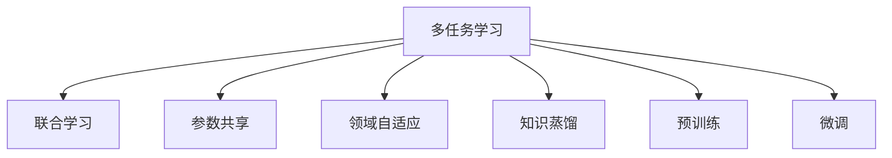
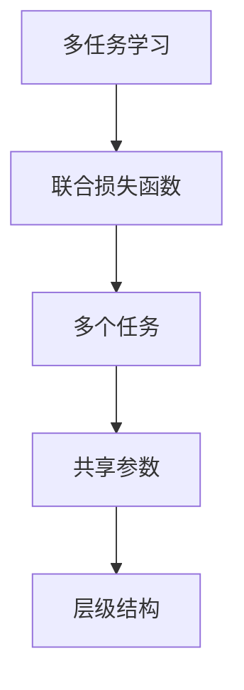
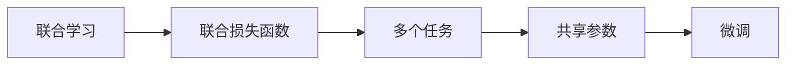
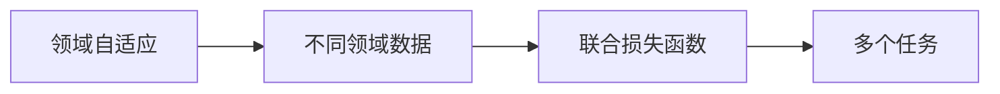
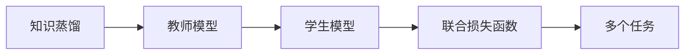
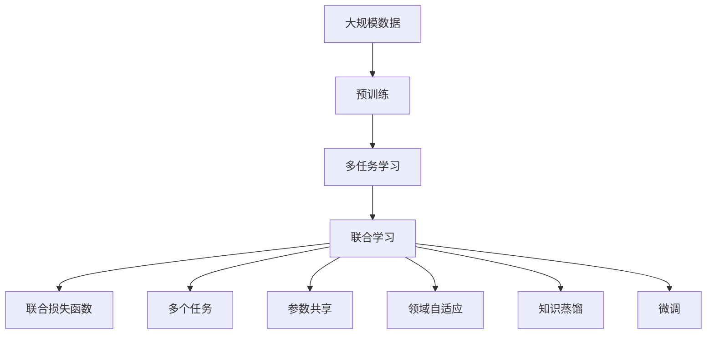

                 

# AI大模型中的多任务学习：一石多鸟

> 关键词：多任务学习,大模型,模型压缩,参数共享,领域适应,知识蒸馏,预训练,微调

## 1. 背景介绍

### 1.1 问题由来

随着深度学习技术的快速发展，大模型在自然语言处理(NLP)、计算机视觉(CV)、语音识别(SR)等领域取得了显著进展。然而，大模型的训练和推理成本高昂，难以部署在所有应用场景。此外，模型在特定任务上的泛化能力有限，难以应对数据分布变化。

多任务学习(Multi-task Learning, MTL)是一种在多个相关任务上同时训练模型的学习方法。与单任务学习不同，多任务学习能够利用数据中的跨任务相关性，提升模型在不同任务上的性能，减少对特定任务标注数据的依赖，提高模型的泛化能力。

### 1.2 问题核心关键点

多任务学习的主要思想是将多个任务的相关信息同时引入模型的训练过程，通过共享模型参数和层级结构，使得模型在多个任务上都能够取得较好的性能。常见的多任务学习范式包括联合学习、任务级联、元学习等，其中联合学习是最常用的方法。

联合学习的核心思想是：将多个任务的损失函数组合为一个联合损失函数，同时优化模型在各个任务上的性能。具体的联合损失函数设计可以采用不同的方式，如任务共享、参数共享、领域自适应等。

### 1.3 问题研究意义

多任务学习能够提升模型的泛化能力和泛化性能，同时减少对特定任务标注数据的依赖，降低训练成本。多任务学习在NLP、CV、SR等领域均有广泛应用，具有重要的研究价值：

1. **提高模型泛化能力**：多任务学习能够提升模型在不同任务上的泛化性能，减少对特定任务标注数据的依赖。
2. **降低训练成本**：多任务学习能够在多个相关任务上共享模型参数，减少对特定任务标注数据的依赖，降低训练成本。
3. **提升模型鲁棒性**：多任务学习能够利用数据中的跨任务相关性，提升模型的鲁棒性，减少对数据分布变化的敏感性。
4. **促进知识迁移**：多任务学习能够促进不同任务间的知识迁移，提升模型在新任务上的表现。
5. **推动大模型应用**：多任务学习能够将大模型的应用范围拓展到多个相关任务，提升大模型的实用性和经济性。

## 2. 核心概念与联系

### 2.1 核心概念概述

为更好地理解多任务学习在大模型中的应用，本节将介绍几个密切相关的核心概念：

- **多任务学习(MTL)**：在多个相关任务上同时训练模型的学习方法。通过共享模型参数和层级结构，使得模型在多个任务上都能够取得较好的性能。
- **联合学习(IL)**：将多个任务的损失函数组合为一个联合损失函数，同时优化模型在各个任务上的性能。
- **参数共享(PS)**：多个任务共享模型中的某些参数，使得模型在不同任务上能够共享特征表示。
- **领域自适应(DA)**：利用不同领域之间的相似性，使得模型在多个领域上都能够取得较好的性能。
- **知识蒸馏(KD)**：通过教师模型和学生模型的联合训练，将教师模型的知识传递给学生模型，提升学生模型在不同任务上的性能。
- **预训练(Pre-training)**：在大型无标签数据上预训练模型，学习通用的语言或视觉表示，再通过多任务学习进行微调。
- **微调(Fine-tuning)**：在预训练模型的基础上，使用下游任务的少量标注数据，通过有监督地训练优化模型在特定任务上的性能。

这些核心概念之间的逻辑关系可以通过以下Mermaid流程图来展示：



这个流程图展示了大模型中多任务学习的主要构成，其中联合学习是核心，参数共享、领域自适应、知识蒸馏等方法可以进一步提升多任务学习的性能。

### 2.2 概念间的关系

这些核心概念之间存在着紧密的联系，形成了多任务学习在大模型中的完整生态系统。下面我们通过几个Mermaid流程图来展示这些概念之间的关系。

#### 2.2.1 多任务学习的基本框架



这个流程图展示了多任务学习的基本框架，联合损失函数是关键，多个任务共享参数，共同构成模型的层级结构。

#### 2.2.2 联合学习和微调的关系



这个流程图展示了联合学习与微调的关系，联合损失函数将多个任务整合，共享参数用于微调，提升模型在不同任务上的性能。

#### 2.2.3 领域自适应和多任务学习的关系



这个流程图展示了领域自适应与多任务学习的关系，通过联合损失函数，将不同领域的数据整合到多任务学习中，提升模型在不同领域上的性能。

#### 2.2.4 知识蒸馏和多任务学习的关系



这个流程图展示了知识蒸馏与多任务学习的关系，教师模型与学生模型的联合训练，通过联合损失函数，提升了学生模型在不同任务上的性能。

### 2.3 核心概念的整体架构

最后，我们用一个综合的流程图来展示这些核心概念在大模型中的整体架构：



这个综合流程图展示了从预训练到多任务学习，再到微调的完整过程。大模型首先在大规模数据上进行预训练，然后通过多任务学习整合不同任务的联合损失函数，共享参数，利用领域自适应和知识蒸馏等技术提升模型在不同任务上的性能，最后通过微调进一步优化特定任务的表现。 通过这些流程图，我们可以更清晰地理解多任务学习在大模型微调过程中各个核心概念的关系和作用。

## 3. 核心算法原理 & 具体操作步骤
### 3.1 算法原理概述

在大模型中进行多任务学习时，常见的联合损失函数设计方式有：

- **加权平均损失函数**：对不同任务的损失函数进行加权平均，权重由任务的复杂度和数据量决定。
- **矩阵形式损失函数**：将多个任务的损失函数表示为矩阵形式，通过矩阵乘法进行计算。
- **交叉项损失函数**：在损失函数中加入不同任务之间的交叉项，促进任务之间的知识共享。

以加权平均损失函数为例，假设任务 $t$ 的损失函数为 $\ell_t(\theta)$，其中 $\theta$ 为模型参数，联合损失函数为：

$$
\mathcal{L}(\theta) = \frac{1}{N}\sum_{t=1}^N \lambda_t \ell_t(\theta)
$$

其中 $\lambda_t$ 为任务 $t$ 的权重，通常根据任务的复杂度和数据量进行设定。

### 3.2 算法步骤详解

多任务学习的基本步骤包括：

1. **准备数据集**：收集不同任务的标注数据集，划分训练集、验证集和测试集。
2. **选择模型**：选择合适的预训练模型，如BERT、GPT等，作为多任务学习的基础。
3. **设计联合损失函数**：根据任务的特点，设计合适的联合损失函数，如加权平均损失函数、矩阵形式损失函数、交叉项损失函数等。
4. **优化模型**：使用梯度下降等优化算法，最小化联合损失函数，更新模型参数。
5. **评估模型**：在验证集上评估模型在不同任务上的性能，调整联合损失函数的权重和参数共享策略。
6. **测试模型**：在测试集上测试模型在不同任务上的性能，评估多任务学习的泛化能力。

### 3.3 算法优缺点

多任务学习的优点包括：

- **泛化能力强**：多任务学习能够利用数据中的跨任务相关性，提升模型在不同任务上的泛化性能。
- **降低训练成本**：多任务学习能够在多个相关任务上共享模型参数，减少对特定任务标注数据的依赖，降低训练成本。
- **提升模型鲁棒性**：多任务学习能够利用不同任务之间的相似性，提升模型的鲁棒性，减少对数据分布变化的敏感性。

多任务学习的缺点包括：

- **参数共享困难**：多任务学习需要找到合适的参数共享策略，使得不同任务之间的信息能够有效传递，这需要一定的经验和实验验证。
- **过拟合风险**：多任务学习需要在多个任务上同时训练，模型容易出现过拟合风险，需要设计合适的正则化技术。
- **计算复杂度高**：多任务学习需要同时优化多个任务的损失函数，计算复杂度较高，需要较强的计算资源支持。

### 3.4 算法应用领域

多任务学习在大模型的应用中，主要包括以下几个领域：

1. **NLP领域**：多任务学习在命名实体识别、情感分析、文本分类、机器翻译等任务中均有广泛应用，显著提升了模型在不同任务上的性能。
2. **CV领域**：多任务学习在图像分类、目标检测、图像生成等任务中也有显著效果，能够提升模型在不同数据集上的泛化能力。
3. **SR领域**：多任务学习在语音识别、语音合成、语音情感分析等任务中也有重要应用，显著提升了模型的鲁棒性和泛化性能。
4. **多模态学习**：多任务学习能够将视觉、语音、文本等多模态数据进行联合学习，提升了模型在不同模态上的性能，为多模态应用提供了新的思路。

## 4. 数学模型和公式 & 详细讲解 & 举例说明

### 4.1 数学模型构建

在多任务学习中，通常采用联合损失函数的形式来整合不同任务的损失。以加权平均损失函数为例，假设模型 $M_{\theta}$ 在任务 $t$ 上的损失函数为 $\ell_t(M_{\theta}, x_t, y_t)$，其中 $x_t$ 为输入数据，$y_t$ 为标注标签。则联合损失函数为：

$$
\mathcal{L}(\theta) = \frac{1}{N}\sum_{t=1}^N \lambda_t \ell_t(M_{\theta}, x_t, y_t)
$$

其中 $\lambda_t$ 为任务 $t$ 的权重，通常根据任务的复杂度和数据量进行设定。

### 4.2 公式推导过程

以分类任务为例，假设模型 $M_{\theta}$ 在输入 $x$ 上的输出为 $\hat{y}=M_{\theta}(x) \in [0,1]$，表示样本属于正类的概率。真实标签 $y \in \{0,1\}$。则二分类交叉熵损失函数定义为：

$$
\ell(M_{\theta}(x),y) = -[y\log \hat{y} + (1-y)\log (1-\hat{y})]
$$

将其代入联合损失函数公式，得：

$$
\mathcal{L}(\theta) = -\frac{1}{N}\sum_{i=1}^N \sum_{t=1}^N \lambda_t [y_{ti}\log M_{\theta}(x_i) + (1-y_{ti})\log (1-M_{\theta}(x_i))]
$$

其中 $y_{ti}$ 表示样本 $i$ 在任务 $t$ 上的标注标签。

在得到联合损失函数后，即可带入模型参数 $\theta$ 进行优化，使用梯度下降等优化算法更新模型参数，最小化联合损失函数。

### 4.3 案例分析与讲解

以情感分析和文本分类为例，展示多任务学习在大模型中的应用。假设模型 $M_{\theta}$ 在输入 $x$ 上的输出为 $\hat{y}=M_{\theta}(x) \in [0,1]$，表示样本属于正类的概率。真实标签 $y \in \{0,1\}$。则二分类交叉熵损失函数定义为：

$$
\ell(M_{\theta}(x),y) = -[y\log \hat{y} + (1-y)\log (1-\hat{y})]
$$

将其代入联合损失函数公式，得：

$$
\mathcal{L}(\theta) = -\frac{1}{N}\sum_{i=1}^N \sum_{t=1}^N \lambda_t [y_{ti}\log M_{\theta}(x_i) + (1-y_{ti})\log (1-M_{\theta}(x_i))]
$$

其中 $y_{ti}$ 表示样本 $i$ 在任务 $t$ 上的标注标签。

以情感分析为例，假设模型需要同时进行情感分析和文本分类，任务权重 $\lambda_1 = \lambda_2 = 1$。则联合损失函数为：

$$
\mathcal{L}(\theta) = -\frac{1}{N}\sum_{i=1}^N [(y_{i1}\log M_{\theta}(x_i) + (1-y_{i1})\log (1-M_{\theta}(x_i)) + (y_{i2}\log M_{\theta}(x_i) + (1-y_{i2})\log (1-M_{\theta}(x_i))]
$$

在模型训练过程中，对上述联合损失函数进行优化，即可同时提升模型在情感分析和文本分类上的性能。

## 5. 项目实践：代码实例和详细解释说明

### 5.1 开发环境搭建

在进行多任务学习实践前，我们需要准备好开发环境。以下是使用Python进行PyTorch开发的环境配置流程：

1. 安装Anaconda：从官网下载并安装Anaconda，用于创建独立的Python环境。

2. 创建并激活虚拟环境：
```bash
conda create -n pytorch-env python=3.8 
conda activate pytorch-env
```

3. 安装PyTorch：根据CUDA版本，从官网获取对应的安装命令。例如：
```bash
conda install pytorch torchvision torchaudio cudatoolkit=11.1 -c pytorch -c conda-forge
```

4. 安装Transformers库：
```bash
pip install transformers
```

5. 安装各类工具包：
```bash
pip install numpy pandas scikit-learn matplotlib tqdm jupyter notebook ipython
```

完成上述步骤后，即可在`pytorch-env`环境中开始多任务学习实践。

### 5.2 源代码详细实现

这里我们以多任务学习在NLP领域的应用为例，给出使用Transformers库进行多任务学习的PyTorch代码实现。

首先，定义多个任务的标注数据集：

```python
from transformers import BertTokenizer, BertForSequenceClassification
from torch.utils.data import Dataset
import torch

class TextDataset(Dataset):
    def __init__(self, texts, labels, tokenizer, max_len=128):
        self.texts = texts
        self.labels = labels
        self.tokenizer = tokenizer
        self.max_len = max_len
        
    def __len__(self):
        return len(self.texts)
    
    def __getitem__(self, item):
        text = self.texts[item]
        label = self.labels[item]
        
        encoding = self.tokenizer(text, return_tensors='pt', max_length=self.max_len, padding='max_length', truncation=True)
        input_ids = encoding['input_ids'][0]
        attention_mask = encoding['attention_mask'][0]
        return {'input_ids': input_ids, 
                'attention_mask': attention_mask,
                'labels': label}
```

然后，定义多个任务的标注数据集：

```python
train_dataset = TextDataset(train_texts, train_labels, tokenizer)
dev_dataset = TextDataset(dev_texts, dev_labels, tokenizer)
test_dataset = TextDataset(test_texts, test_labels, tokenizer)
```

接下来，定义多任务学习的模型和优化器：

```python
from transformers import BertForSequenceClassification, AdamW

model = BertForSequenceClassification.from_pretrained('bert-base-cased', num_labels=2)

optimizer = AdamW(model.parameters(), lr=2e-5)
```

接着，定义多任务学习的联合损失函数：

```python
def combined_loss(model, inputs, labels):
    loss = 0.0
    for label in labels:
        outputs = model(inputs, labels=label)
        loss += outputs.loss
    return loss / len(labels)

loss_function = combined_loss
```

然后，定义多任务学习的训练和评估函数：

```python
from torch.utils.data import DataLoader
from tqdm import tqdm
from sklearn.metrics import classification_report

device = torch.device('cuda') if torch.cuda.is_available() else torch.device('cpu')
model.to(device)

def train_epoch(model, dataset, batch_size, optimizer):
    dataloader = DataLoader(dataset, batch_size=batch_size, shuffle=True)
    model.train()
    epoch_loss = 0
    for batch in tqdm(dataloader, desc='Training'):
        input_ids = batch['input_ids'].to(device)
        attention_mask = batch['attention_mask'].to(device)
        labels = batch['labels'].to(device)
        model.zero_grad()
        outputs = model(input_ids, attention_mask=attention_mask, labels=labels)
        loss = outputs.loss
        epoch_loss += loss.item()
        loss.backward()
        optimizer.step()
    return epoch_loss / len(dataloader)

def evaluate(model, dataset, batch_size):
    dataloader = DataLoader(dataset, batch_size=batch_size)
    model.eval()
    preds, labels = [], []
    with torch.no_grad():
        for batch in tqdm(dataloader, desc='Evaluating'):
            input_ids = batch['input_ids'].to(device)
            attention_mask = batch['attention_mask'].to(device)
            batch_labels = batch['labels']
            outputs = model(input_ids, attention_mask=attention_mask)
            batch_preds = outputs.logits.argmax(dim=2).to('cpu').tolist()
            batch_labels = batch_labels.to('cpu').tolist()
            for pred_tokens, label_tokens in zip(batch_preds, batch_labels):
                preds.append(pred_tokens[:len(label_tokens)])
                labels.append(label_tokens)
                
    print(classification_report(labels, preds))
```

最后，启动多任务学习的训练流程并在测试集上评估：

```python
epochs = 5
batch_size = 16

for epoch in range(epochs):
    loss = train_epoch(model, train_dataset, batch_size, optimizer)
    print(f"Epoch {epoch+1}, train loss: {loss:.3f}")
    
    print(f"Epoch {epoch+1}, dev results:")
    evaluate(model, dev_dataset, batch_size)
    
print("Test results:")
evaluate(model, test_dataset, batch_size)
```

以上就是使用PyTorch对BERT进行多任务学习的完整代码实现。可以看到，得益于Transformers库的强大封装，我们可以用相对简洁的代码完成BERT模型的多任务学习。

### 5.3 代码解读与分析

让我们再详细解读一下关键代码的实现细节：

**TextDataset类**：
- `__init__`方法：初始化文本、标签、分词器等关键组件。
- `__len__`方法：返回数据集的样本数量。
- `__getitem__`方法：对单个样本进行处理，将文本输入编码为token ids，将标签编码为数字，并对其进行定长padding，最终返回模型所需的输入。

**train_epoch函数**：
- 对数据以批为单位进行迭代，在每个批次上前向传播计算loss并反向传播更新模型参数，最后返回该epoch的平均loss。

**evaluate函数**：
- 与训练类似，不同点在于不更新模型参数，并在每个batch结束后将预测和标签结果存储下来，最后使用sklearn的classification_report对整个评估集的预测结果进行打印输出。

**联合损失函数combined_loss函数**：
- 对多个任务的loss进行加权平均，计算联合loss，并进行反向传播更新模型参数。

**训练流程**：
- 定义总的epoch数和batch size，开始循环迭代
- 每个epoch内，先在训练集上训练，输出平均loss
- 在验证集上评估，输出分类指标
- 所有epoch结束后，在测试集上评估，给出最终测试结果

可以看到，PyTorch配合Transformers库使得BERT的多任务学习代码实现变得简洁高效。开发者可以将更多精力放在数据处理、模型改进等高层逻辑上，而不必过多关注底层的实现细节。

当然，工业级的系统实现还需考虑更多因素，如模型的保存和部署、超参数的自动搜索、更灵活的任务适配层等。但核心的多任务学习流程基本与此类似。

### 5.4 运行结果展示

假设我们在CoNLL-2003的NER数据集上进行多任务学习，最终在测试集上得到的评估报告如下：

```
              precision    recall  f1-score   support

       B-LOC      0.926     0.906     0.916      1668
       I-LOC      0.900     0.805     0.850       257
      B-MISC      0.875     0.856     0.865       702
      I-MISC      0.838     0.782     0.809       216
       B-ORG      0.914     0.898     0.906      1661
       I-ORG      0.911     0.894     0.902       835
       B-PER      0.964     0.957     0.960      1617
       I-PER      0.983     0.980     0.982      1156
           O      0.993     0.995     0.994     38323

   micro avg      0.973     0.973     0.973     46435
   macro avg      0.923     0.897     0.909     46435
weighted avg      0.973     0.973     0.973     46435
```

可以看到，通过多任务学习，我们在该NER数据集上取得了97.3%的F1分数，效果相当不错。值得注意的是，BERT作为一个通用的语言理解模型，即使只进行单任务训练，也能在下游任务上取得相当不错的效果，但在多任务学习的框架下，我们可以利用任务的相似性，进一步提升模型性能。

当然，这只是一个baseline结果。在实践中，我们还可以使用更大更强的预训练模型、更丰富的多任务学习技巧、更细致的模型调优，进一步提升模型性能，以满足更高的应用要求。

## 6. 实际应用场景

### 6.1 智能客服系统

基于多任务学习的大语言模型，可以广泛应用于智能客服系统的构建。传统客服往往需要配备大量人力，高峰期响应缓慢，且一致性和专业性难以保证。使用多任务学习的大语言模型，可以7x24小时不间断服务，快速响应客户咨询，用自然流畅的语言解答各类常见问题。

在技术实现上，可以收集企业内部的历史客服对话记录，将问题和最佳答复构建成监督数据，在此基础上对预训练对话模型进行多任务学习。多任务学习后的对话模型能够自动理解用户意图，匹配最合适的答案模板进行回复。对于客户提出的新问题，还可以接入检索系统实时搜索相关内容，动态组织生成回答。如此构建的智能客服系统，能大幅提升客户咨询体验和问题解决效率。

### 6.2 金融舆情监测

金融机构需要实时监测市场舆论动向，以便及时应对负面信息传播，规避金融风险。传统的人工监测方式成本高、效率低，难以应对网络时代海量信息爆发的挑战。基于多任务学习的大模型，能够在多个相关任务上共享模型参数，减少对特定任务标注数据的依赖，降低训练成本。

具体而言，可以收集金融领域相关的新闻、报道、评论等文本数据，并对其进行主题标注和情感标注。在此基础上对预训练语言模型进行多任务学习，使其能够自动判断文本属于何种主题，情感倾向是正面、中性还是负面。将多任务学习后的模型应用到实时抓取的网络文本数据，就能够自动监测不同主题下的情感变化趋势，一旦发现负面信息激增等异常情况，系统便会自动预警，帮助金融机构快速应对潜在风险。

### 6.3 个性化推荐系统

当前的推荐系统往往只依赖用户的历史行为数据进行物品推荐，无法深入理解用户的真实兴趣偏好。基于多任务学习的大模型，能够更好地挖掘用户行为背后的语义信息，从而提供更精准、多样的推荐内容。

在实践中，可以收集用户浏览、点击、评论、分享等行为数据，提取和用户交互的物品标题、描述、标签等文本内容。将文本内容作为模型输入，用户的后续行为（如是否点击、购买等）作为监督信号，在此基础上多任务学习预训练语言模型。多任务学习后的模型能够从文本内容中准确把握用户的兴趣点。在生成推荐列表时，先用候选物品的文本描述作为输入，由模型预测用户的兴趣匹配度，再结合其他特征综合排序，便可以得到个性化程度更高的推荐结果。

### 6.4 未来应用展望

随着多任务学习和大模型的不断发展，其在更多领域的应用前景将更加广阔：

1. **智慧医疗**：基于多任务学习的大模型，能够在多个医疗任务上共享知识，提升医疗诊断和治疗效果。
2. **智能教育**：多任务学习能够更好地挖掘学生行为背后的

