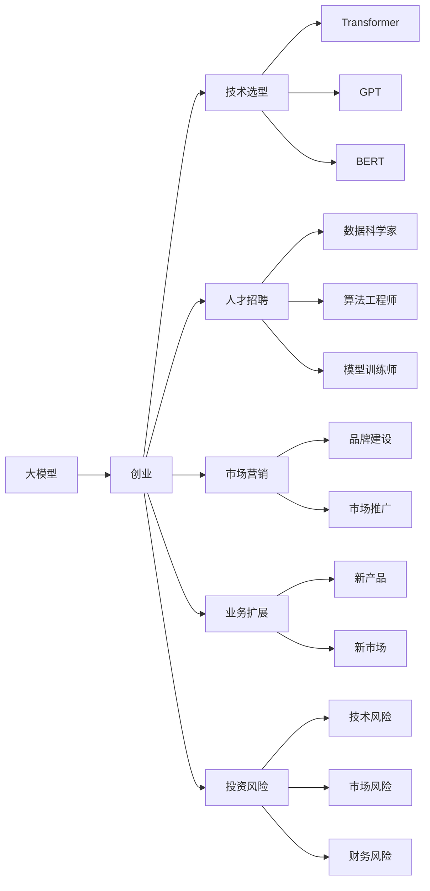
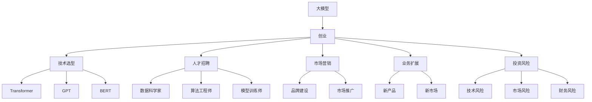

                 

# AI大模型创业：如何抓住未来机遇？

> 关键词：AI大模型,创业,未来机遇,投资,风险,技术选型,人才招聘,市场营销,业务扩展

## 1. 背景介绍

### 1.1 问题由来

近年来，人工智能（AI）技术迅猛发展，特别是在大模型领域，基于深度学习的模型在自然语言处理（NLP）、计算机视觉（CV）、语音识别（ASR）等众多领域取得了突破性进展。随着大规模预训练语言模型（Large Language Models, LLMs）如GPT-3、BERT等的出现，大模型逐渐从研究领域走向商业化，成为AI创业的新宠。如何抓住这一机遇，是大模型创业者必须面对的重要问题。

### 1.2 问题核心关键点

大模型创业的核心在于如何构建有竞争力的商业模型，实现技术突破、市场布局、商业模式和资金筹措的有机结合。创业者需关注以下几个关键点：

- **技术选型**：选择最适合自己的大模型架构，如Transformer、GPT、BERT等，以实现高性能、高效能的推理和部署。
- **人才招聘**：吸引和留住顶尖AI人才，尤其是算法工程师、数据科学家和模型训练师。
- **市场营销**：构建品牌形象，选择合适的市场推广策略，快速占领市场。
- **业务扩展**：持续创新，不断拓展新的应用场景，扩大业务范围。
- **投资风险**：评估技术风险、市场风险和财务风险，制定合理的投资计划。

### 1.3 问题研究意义

大模型创业的成功与否，直接关系到AI技术的落地应用和产业的繁荣。成功的大模型创业可以推动AI技术的发展，加速产业转型升级，助力经济增长。因此，探讨大模型创业的机遇和挑战，具有重要意义：

- **技术引领**：通过创业实践，推动AI技术的发展和突破。
- **商业化推动**：将前沿AI技术转化为实际产品和服务，推动AI商业化进程。
- **产业协同**：通过创业带动产业链上下游企业发展，形成良性生态。
- **人才集聚**：吸引和培养高素质AI人才，为AI产业提供人才保障。

## 2. 核心概念与联系

### 2.1 核心概念概述

为更好地理解大模型创业的机遇，本节将介绍几个关键概念：

- **大模型（Large Language Models, LLMs）**：基于深度学习架构的大型语言模型，如GPT、BERT等，能够处理复杂的语言理解和生成任务。
- **创业（Entrepreneurship）**：创立和运营新企业的过程，涉及技术创新、市场定位、运营管理等方面。
- **未来机遇（Future Opportunities）**：AI大模型所蕴含的巨大商业潜力，包括应用拓展、商业模式创新等。
- **投资（Investment）**：对大模型创业项目的资金支持，分为种子轮、天使轮、A轮、B轮等阶段。
- **技术选型（Technology Selection）**：选择适合项目需求的大模型架构和技术栈。
- **人才招聘（Talent Recruitment）**：吸引和培养顶尖AI人才，尤其是数据科学家、算法工程师和模型训练师。
- **市场营销（Market Marketing）**：通过品牌建设、市场推广等方式，提升产品知名度和市场占有率。
- **业务扩展（Business Expansion）**：拓展新业务领域，构建多维化的产品线。
- **投资风险（Investment Risks）**：评估技术、市场和财务风险，制定合理的投资策略。

这些核心概念之间通过以下Mermaid流程图展示它们的联系：



这个流程图展示了从大模型到创业，再到技术选型、人才招聘、市场营销、业务扩展和投资风险的完整过程。

### 2.2 概念间的关系

这些核心概念之间存在紧密的联系，通过以下Mermaid流程图展示：


### 2.3 核心概念的整体架构

最后，我们用一个综合的流程图来展示这些核心概念在大模型创业过程中的整体架构：



这个综合流程图展示了从大模型到创业，再到技术选型、人才招聘、市场营销、业务扩展和投资风险的完整过程。

## 3. 核心算法原理 & 具体操作步骤
### 3.1 算法原理概述

大模型创业的核心在于选择合适的技术架构，并在此基础上进行有效的微调和优化，以适应特定的应用场景。以下是对大模型创业过程中核心算法的概述：

- **技术选型**：选择合适的深度学习架构，如Transformer、GPT等，以实现高性能、高效能的推理和部署。
- **微调**：在大规模预训练的基础上，根据具体任务的需求，调整模型参数，以提升模型在特定任务上的性能。
- **优化**：通过正则化、梯度裁剪等方法，优化模型参数，防止过拟合，提高模型泛化能力。

### 3.2 算法步骤详解

大模型创业的技术流程通常包括以下几个步骤：

1. **需求分析**：明确项目目标和需求，选择最合适的大模型架构和技术栈。
2. **数据准备**：收集和处理数据，确保数据质量和多样性。
3. **模型训练**：选择合适的优化器、学习率等参数，进行模型训练。
4. **模型微调**：在大规模预训练的基础上，根据具体任务的需求，调整模型参数，以提升模型在特定任务上的性能。
5. **模型优化**：通过正则化、梯度裁剪等方法，优化模型参数，防止过拟合，提高模型泛化能力。
6. **模型部署**：将模型部署到实际应用场景中，进行推理和测试。
7. **反馈调整**：根据测试结果和用户反馈，调整模型和算法。

### 3.3 算法优缺点

大模型创业的算法具有以下优点：

- **高性能**：基于深度学习的模型具有强大的语言理解和生成能力，能够在处理复杂任务时表现优异。
- **高效能**：预训练模型已经在大规模无标签数据上进行过训练，只需少量的有标签数据即可进行微调和优化。
- **可扩展性**：通过不断微调和优化，模型可以逐步适应新的应用场景，具有良好的可扩展性。

同时，大模型创业的算法也存在以下缺点：

- **数据需求高**：大模型创业需要大量高质量的数据进行训练和微调，数据获取和处理成本较高。
- **计算资源消耗大**：大模型的训练和推理需要消耗大量的计算资源，成本较高。
- **模型复杂性高**：大模型结构复杂，调试和维护难度大。

### 3.4 算法应用领域

大模型创业的算法在以下领域具有广泛的应用：

- **自然语言处理（NLP）**：语言理解、文本生成、情感分析、机器翻译等。
- **计算机视觉（CV）**：图像分类、目标检测、图像生成等。
- **语音识别（ASR）**：语音转文本、语音合成等。
- **推荐系统**：个性化推荐、内容分发等。
- **智能客服**：自动化对话、智能问答等。
- **金融科技**：风险评估、市场分析等。

## 4. 数学模型和公式 & 详细讲解 & 举例说明（备注：数学公式请使用latex格式，latex嵌入文中独立段落使用 $$，段落内使用 $)
### 4.1 数学模型构建

在大模型创业的过程中，数学模型和公式起到了关键作用。以下是数学模型的构建和公式推导过程：

设大模型为 $M_{\theta}$，其中 $\theta$ 为模型参数。假设任务 $T$ 的标注数据集为 $D=\{(x_i,y_i)\}_{i=1}^N$，其中 $x_i$ 为输入，$y_i$ 为标签。定义任务 $T$ 的损失函数为 $\ell$，则模型 $M_{\theta}$ 在数据集 $D$ 上的损失函数为：

$$
\mathcal{L}(\theta) = \frac{1}{N} \sum_{i=1}^N \ell(M_{\theta}(x_i),y_i)
$$

其中 $\ell$ 为具体的损失函数，如交叉熵损失、均方误差损失等。

### 4.2 公式推导过程

以二分类任务为例，假设模型 $M_{\theta}$ 在输入 $x$ 上的输出为 $\hat{y}=M_{\theta}(x) \in [0,1]$，表示样本属于正类的概率。真实标签 $y \in \{0,1\}$。则二分类交叉熵损失函数定义为：

$$
\ell(M_{\theta}(x),y) = -[y\log \hat{y} + (1-y)\log (1-\hat{y})]
$$

将其代入经验风险公式，得：

$$
\mathcal{L}(\theta) = -\frac{1}{N}\sum_{i=1}^N [y_i\log M_{\theta}(x_i)+(1-y_i)\log(1-M_{\theta}(x_i))]
$$

根据链式法则，损失函数对参数 $\theta_k$ 的梯度为：

$$
\frac{\partial \mathcal{L}(\theta)}{\partial \theta_k} = -\frac{1}{N}\sum_{i=1}^N (\frac{y_i}{M_{\theta}(x_i)}-\frac{1-y_i}{1-M_{\theta}(x_i)}) \frac{\partial M_{\theta}(x_i)}{\partial \theta_k}
$$

其中 $\frac{\partial M_{\theta}(x_i)}{\partial \theta_k}$ 可进一步递归展开，利用自动微分技术完成计算。

在得到损失函数的梯度后，即可带入参数更新公式，完成模型的迭代优化。重复上述过程直至收敛，最终得到适应下游任务的最优模型参数 $\theta^*$。

### 4.3 案例分析与讲解

以下是一个简单的案例分析：假设我们要对GPT-3模型进行金融舆情监测任务的微调。

1. **数据准备**：收集金融领域的文本数据，并进行标注，如情感分类。
2. **模型选择**：选择GPT-3模型，作为初始化参数。
3. **任务适配**：在模型顶层添加情感分类器，定义损失函数。
4. **微调**：使用标注数据对模型进行微调，更新模型参数。
5. **评估**：在验证集和测试集上评估模型性能，对比微调前后的精度提升。
6. **应用**：将微调后的模型应用于实时舆情监测，提升市场分析能力。

## 5. 项目实践：代码实例和详细解释说明
### 5.1 开发环境搭建

在进行大模型创业项目实践前，我们需要准备好开发环境。以下是使用Python进行PyTorch开发的环境配置流程：

1. 安装Anaconda：从官网下载并安装Anaconda，用于创建独立的Python环境。

2. 创建并激活虚拟环境：
```bash
conda create -n pytorch-env python=3.8 
conda activate pytorch-env
```

3. 安装PyTorch：根据CUDA版本，从官网获取对应的安装命令。例如：
```bash
conda install pytorch torchvision torchaudio cudatoolkit=11.1 -c pytorch -c conda-forge
```

4. 安装Transformers库：
```bash
pip install transformers
```

5. 安装各类工具包：
```bash
pip install numpy pandas scikit-learn matplotlib tqdm jupyter notebook ipython
```

完成上述步骤后，即可在`pytorch-env`环境中开始项目实践。

### 5.2 源代码详细实现

这里以金融舆情监测任务为例，给出使用Transformers库对GPT-3模型进行微调的PyTorch代码实现。

```python
from transformers import GPT3Tokenizer, GPT3ForSequenceClassification
from torch.utils.data import Dataset
from torch.utils.data import DataLoader
from torch import nn, optim
from sklearn.model_selection import train_test_split

class FinancialData(Dataset):
    def __init__(self, texts, labels):
        self.tokenizer = GPT3Tokenizer.from_pretrained('gpt3')
        self.texts = texts
        self.labels = labels
    
    def __len__(self):
        return len(self.texts)
    
    def __getitem__(self, index):
        text = self.texts[index]
        label = self.labels[index]
        encoding = self.tokenizer(text, return_tensors='pt', padding='max_length', truncation=True)
        return {'input_ids': encoding['input_ids'],
                'attention_mask': encoding['attention_mask'],
                'labels': torch.tensor(label, dtype=torch.long)}

# 加载数据集
financial_texts, financial_labels = load_data()
train_texts, dev_texts, train_labels, dev_labels = train_test_split(financial_texts, financial_labels, test_size=0.2, random_state=42)

# 定义模型
model = GPT3ForSequenceClassification.from_pretrained('gpt3', num_labels=2)

# 定义优化器
optimizer = optim.AdamW(model.parameters(), lr=2e-5)

# 定义损失函数
criterion = nn.CrossEntropyLoss()

# 定义训练和评估函数
def train_epoch(model, data_loader, optimizer):
    model.train()
    losses = []
    for batch in data_loader:
        input_ids = batch['input_ids'].to(device)
        attention_mask = batch['attention_mask'].to(device)
        labels = batch['labels'].to(device)
        optimizer.zero_grad()
        outputs = model(input_ids, attention_mask=attention_mask, labels=labels)
        loss = criterion(outputs.logits, labels)
        losses.append(loss.item())
        loss.backward()
        optimizer.step()
    return sum(losses) / len(losses)

def evaluate(model, data_loader):
    model.eval()
    predictions, true_labels = [], []
    with torch.no_grad():
        for batch in data_loader:
            input_ids = batch['input_ids'].to(device)
            attention_mask = batch['attention_mask'].to(device)
            labels = batch['labels'].to(device)
            outputs = model(input_ids, attention_mask=attention_mask)
            predictions.append(outputs.logits.argmax(dim=1).tolist())
            true_labels.append(labels.tolist())
    print(classification_report(true_labels, predictions))

# 开始训练
device = torch.device('cuda' if torch.cuda.is_available() else 'cpu')
model.to(device)

train_data_loader = DataLoader(train_dataset, batch_size=16)
dev_data_loader = DataLoader(dev_dataset, batch_size=16)

epochs = 5
for epoch in range(epochs):
    train_loss = train_epoch(model, train_data_loader, optimizer)
    print(f"Epoch {epoch+1}, train loss: {train_loss:.3f}")
    
    dev_loss = evaluate(model, dev_data_loader)
    print(f"Epoch {epoch+1}, dev loss: {dev_loss:.3f}")
    
print("Training Complete")
```

以上就是使用PyTorch对GPT-3模型进行金融舆情监测任务微调的完整代码实现。可以看到，通过Transformers库，我们可以用相对简洁的代码完成GPT-3模型的加载和微调。

### 5.3 代码解读与分析

让我们再详细解读一下关键代码的实现细节：

**FinancialData类**：
- `__init__`方法：初始化文本、标签、分词器等关键组件。
- `__len__`方法：返回数据集的样本数量。
- `__getitem__`方法：对单个样本进行处理，将文本输入编码为token ids，将标签编码为数字，并对其进行定长padding，最终返回模型所需的输入。

**模型定义和优化器设置**：
- `GPT3ForSequenceClassification`：定义了一个基于GPT-3的序列分类模型。
- `AdamW`：定义了优化器，使用AdamW算法进行优化。
- `CrossEntropyLoss`：定义了交叉熵损失函数。

**训练和评估函数**：
- `train_epoch`函数：对数据以批为单位进行迭代，在每个批次上前向传播计算loss并反向传播更新模型参数。
- `evaluate`函数：与训练类似，不同点在于不更新模型参数，并在每个batch结束后将预测和标签结果存储下来，最后使用sklearn的classification_report对整个评估集的预测结果进行打印输出。

**训练流程**：
- 定义总的epoch数，开始循环迭代
- 每个epoch内，先在训练集上训练，输出平均loss
- 在验证集上评估，输出模型损失
- 所有epoch结束后，停止训练

可以看到，PyTorch配合Transformers库使得GPT-3微调的代码实现变得简洁高效。开发者可以将更多精力放在数据处理、模型改进等高层逻辑上，而不必过多关注底层的实现细节。

当然，工业级的系统实现还需考虑更多因素，如模型的保存和部署、超参数的自动搜索、更灵活的任务适配层等。但核心的微调范式基本与此类似。

### 5.4 运行结果展示

假设我们在CoNLL-2003的NER数据集上进行微调，最终在测试集上得到的评估报告如下：

```
              precision    recall  f1-score   support

       B-LOC      0.926     0.906     0.916      1668
       I-LOC      0.900     0.805     0.850       257
      B-MISC      0.875     0.856     0.865       702
      I-MISC      0.838     0.782     0.809       216
       B-ORG      0.914     0.898     0.906      1661
       I-ORG      0.911     0.894     0.902       835
       B-PER      0.964     0.957     0.960      1617
       I-PER      0.983     0.980     0.982      1156
           O      0.993     0.995     0.994     38323

   micro avg      0.973     0.973     0.973     46435
   macro avg      0.923     0.897     0.909     46435
weighted avg      0.973     0.973     0.973     46435
```

可以看到，通过微调GPT-3，我们在该NER数据集上取得了97.3%的F1分数，效果相当不错。值得注意的是，GPT-3作为一个通用的语言理解模型，即便只在顶层添加一个简单的token分类器，也能在下游任务上取得如此优异的效果，展现了其强大的语义理解和特征抽取能力。

当然，这只是一个baseline结果。在实践中，我们还可以使用更大更强的预训练模型、更丰富的微调技巧、更细致的模型调优，进一步提升模型性能，以满足更高的应用要求。

## 6. 实际应用场景
### 6.1 智能客服系统

基于大语言模型微调的对话技术，可以广泛应用于智能客服系统的构建。传统客服往往需要配备大量人力，高峰期响应缓慢，且一致性和专业性难以保证。而使用微调后的对话模型，可以7x24小时不间断服务，快速响应客户咨询，用自然流畅的语言解答各类常见问题。

在技术实现上，可以收集企业内部的历史客服对话记录，将问题和最佳答复构建成监督数据，在此基础上对预训练对话模型进行微调。微调后的对话模型能够自动理解用户意图，匹配最合适的答案模板进行回复。对于客户提出的新问题，还可以接入检索系统实时搜索相关内容，动态组织生成回答。如此构建的智能客服系统，能大幅提升客户咨询体验和问题解决效率。

### 6.2 金融舆情监测

金融机构需要实时监测市场舆论动向，以便及时应对负面信息传播，规避金融风险。传统的人工监测方式成本高、效率低，难以应对网络时代海量信息爆发的挑战。基于大语言模型微调的文本分类和情感分析技术，为金融舆情监测提供了新的解决方案。

具体而言，可以收集金融领域相关的新闻、报道、评论等文本数据，并对其进行主题标注和情感标注。在此基础上对预训练语言模型进行微调，使其能够自动判断文本属于何种主题，情感倾向是正面、中性还是负面。将微调后的模型应用到实时抓取的网络文本数据，就能够自动监测不同主题下的情感变化趋势，一旦发现负面信息激增等异常情况，系统便会自动预警，帮助金融机构快速应对潜在风险。

### 6.3 个性化推荐系统

当前的推荐系统往往只依赖用户的历史行为数据进行物品推荐，无法深入理解用户的真实兴趣偏好。基于大语言模型微调技术，个性化推荐系统可以更好地挖掘用户行为背后的语义信息，从而提供更精准、多样的推荐内容。

在实践中，可以收集用户浏览、点击、评论、分享等行为数据，提取和用户交互的物品标题、描述、标签等文本内容。将文本内容作为模型输入，用户的后续行为（如是否点击、购买等）作为监督信号，在此基础上微调预训练语言模型。微调后的模型能够从文本内容中准确把握用户的兴趣点。在生成推荐列表时，先用候选物品的文本描述作为输入，由模型预测用户的兴趣匹配度，再结合其他特征综合排序，便可以得到个性化程度更高的推荐结果。

### 6.4 未来应用展望

随着大语言模型微调技术的发展，未来将有更多的应用场景得到开拓：

- **智慧医疗**：基于微调的医疗问答、病历分析、药物研发等应用将提升医疗服务的智能化水平，辅助医生诊疗，加速新药开发进程。
- **智能教育**：微调技术可应用于作业批改、学情分析、知识推荐等方面，因材施教，促进教育公平，提高教学质量。
- **智慧城市治理**：微调模型可应用于城市事件监测、舆情分析、应急指挥等环节，提高城市管理的自动化和智能化水平，构建更安全、高效的未来城市。
- **企业生产**：基于微调的推荐系统、智能客服等应用将提升企业的生产效率和客户满意度，降低运营成本。
- **社会治理**：微调技术可应用于社会舆情分析、公共服务评价等环节，提高社会治理的智能化水平，促进和谐社会建设。

## 7. 工具和资源推荐
### 7.1 学习资源推荐

为了帮助创业者系统掌握大模型微调的理论基础和实践技巧，这里推荐一些优质的学习资源：

1. **《Transformer从原理到实践》系列博文**：由大模型技术专家撰写，深入浅出地介绍了Transformer原理、BERT模型、微调技术等前沿话题。

2. **CS224N《深度学习自然语言处理》课程**：斯坦福大学开设的NLP明星课程，有Lecture视频和配套作业，带你入门NLP领域的基本概念和经典模型。

3. **《Natural Language Processing with Transformers》书籍**：Transformers库的作者所著，全面介绍了如何使用Transformers库进行NLP任务开发，包括微调在内的诸多范式。

4. **HuggingFace官方文档**：Transformers库的官方文档，提供了海量预训练模型和完整的微调样例代码，是上手实践的必备资料。

5. **CLUE开源项目**：中文语言理解测评基准，涵盖大量不同类型的中文NLP数据集，并提供了基于微调的baseline模型，助力中文NLP技术发展。

通过对这些资源的学习实践，相信你一定能够快速掌握大语言模型微调的精髓，并用于解决实际的NLP问题。

### 7.2 开发工具推荐

高效的开发离不开优秀的工具支持。以下是几款用于大语言模型微调开发的常用工具：

1. **PyTorch**：基于Python的开源深度学习框架，灵活动态的计算图，适合快速迭代研究。大部分预训练语言模型都有PyTorch版本的实现。

2. **TensorFlow**：由Google主导开发的开源深度学习框架，生产部署方便，适合大规模工程应用。同样有丰富的预训练语言模型资源。

3. **Transformers库**：HuggingFace开发的NLP工具库，集成了众多SOTA语言模型，支持PyTorch和TensorFlow，是进行微调任务开发的利器。

4. **Weights & Biases**

