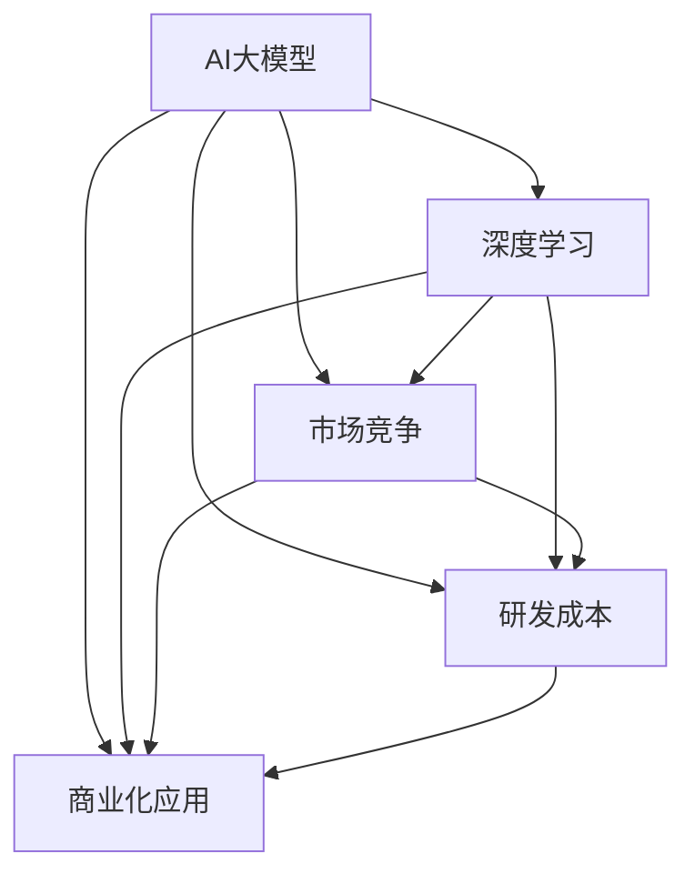

                 

# AI大模型的降价与竞争

## 1. 背景介绍

### 1.1 问题由来
近年来，随着深度学习技术的飞速发展，人工智能（AI）大模型在各行各业的应用取得了显著进展。然而，大模型的研发和部署成本高昂，使得许多中小企业难以承受。同时，随着市场竞争的加剧，各大科技公司纷纷投入巨资，竞相开发更高效、更强大的大模型，导致大模型市场的价格和应用门槛大幅下降。

### 1.2 问题核心关键点
AI大模型的降价与竞争的核心关键点主要包括：
1. **研发成本高昂**：大模型的训练和优化需要大量高性能计算资源，如GPU和TPU，导致研发成本高企。
2. **市场需求激增**：AI技术在医疗、金融、智能制造等多个领域的广泛应用，带来了巨大的市场需求。
3. **技术壁垒降低**：随着模型的开源和商业化，越来越多的企业和开发者可以访问和应用大模型，降低了技术壁垒。
4. **竞争激烈**：各大科技公司纷纷投入资源，开发更强大、更高效的大模型，市场竞争日益激烈。
5. **价格下降**：市场竞争导致大模型的价格和应用门槛降低，使得更多中小企业可以负担得起。

## 2. 核心概念与联系

### 2.1 核心概念概述

AI大模型的降价与竞争涉及到多个核心概念，包括AI大模型、深度学习、市场竞争、研发成本、商业化应用等。这些概念之间的联系紧密，形成一个完整的AI大模型生态系统。

- **AI大模型**：以深度神经网络为基础，在大规模数据集上进行预训练，具有强大学习和泛化能力的模型。
- **深度学习**：一种基于神经网络的机器学习方法，能够从大量数据中学习复杂的模式和规律。
- **市场竞争**：企业间为了争夺市场份额和技术优势，展开的激烈竞争。
- **研发成本**：开发和优化AI大模型所需的高性能计算资源、数据集、人力资源等成本。
- **商业化应用**：将AI大模型应用于实际商业场景，带来经济效益和社会效益。

这些概念通过市场竞争和技术发展相互影响，推动AI大模型生态系统的不断演进。

### 2.2 概念间的关系

这些核心概念之间的关系可以通过以下Mermaid流程图来展示：



这个流程图展示了AI大模型生态系统中的各个环节：
1. AI大模型通过深度学习技术不断优化和升级。
2. 市场竞争驱动AI大模型的开发和应用。
3. 研发成本直接影响AI大模型的开发效率和质量。
4. 商业化应用带来经济效益，促进技术的进一步发展。
5. 市场竞争和技术发展相互促进，推动AI大模型的降价和普及。

## 3. 核心算法原理 & 具体操作步骤
### 3.1 算法原理概述

AI大模型的降价与竞争，本质上是一个由市场供需关系驱动的过程。当市场对AI大模型的需求增加，而研发成本降低时，模型的价格和使用门槛就会下降。这一过程可以分为以下几个阶段：

1. **市场供给增加**：多家企业投入资源，研发和部署大规模AI大模型。
2. **研发成本降低**：采用更高效的计算资源和更先进的优化算法，降低研发成本。
3. **市场需求增加**：AI大模型在多个领域的广泛应用，带来了巨大的市场需求。
4. **价格下降**：市场竞争导致价格下降，使用门槛降低。
5. **技术创新**：企业不断创新，推出更高效、更强大的模型，进一步降低价格和使用门槛。

### 3.2 算法步骤详解

以下是AI大模型降价与竞争的主要操作步骤：

**Step 1: 评估市场需求**
- 调研目标市场，确定潜在用户需求和支付能力。
- 分析市场需求量，预测未来增长趋势。

**Step 2: 确定技术路线**
- 选择适合的深度学习框架和模型结构。
- 设计模型训练流程，确定超参数和优化策略。

**Step 3: 降低研发成本**
- 采用高性能计算资源，如GPU和TPU。
- 优化模型结构，减少计算量和存储需求。
- 采用分布式训练和模型并行，提高训练效率。

**Step 4: 降低价格和使用门槛**
- 提供免费试用和折扣优惠，降低用户初始使用成本。
- 优化模型部署和推理，提高使用效率和便利性。

**Step 5: 市场推广和品牌建设**
- 通过广告、试用、合作等方式，推广模型应用。
- 建立品牌声誉，提高用户信任和市场竞争力。

### 3.3 算法优缺点

AI大模型的降价与竞争具有以下优点：
1. **促进技术创新**：市场竞争推动企业不断优化和创新模型，提升性能和效率。
2. **降低使用门槛**：通过价格和部署优化，使得更多中小企业能够使用AI大模型。
3. **扩大应用场景**：AI大模型在更多领域的广泛应用，推动了AI技术的发展和普及。
4. **提升经济效益**：AI大模型的商业化应用，带来了显著的经济效益和社会效益。

同时，这一过程也存在一些缺点：
1. **资源浪费**：多家企业投入大量资源研发类似模型，可能导致资源浪费和重复劳动。
2. **市场饱和**：过多的竞争可能导致市场饱和，企业难以获取显著的市场份额。
3. **数据隐私问题**：大规模数据集的训练和应用可能涉及数据隐私和伦理问题。
4. **技术安全**：在模型应用中可能存在安全漏洞和伦理风险。

### 3.4 算法应用领域

AI大模型的降价与竞争在多个领域都有广泛应用，包括但不限于：

- **医疗健康**：AI大模型用于疾病诊断、药物研发和健康管理，提高了医疗服务的效率和精准度。
- **金融科技**：用于风险控制、欺诈检测和智能投顾，提升了金融服务的智能化水平。
- **智能制造**：用于设备预测性维护、质量控制和供应链优化，提高了生产效率和质量。
- **智慧城市**：用于交通管理、能源优化和公共安全，提升了城市管理的智能化水平。
- **教育培训**：用于智能评估、个性化推荐和虚拟教师，提升了教育培训的个性化和效率。

## 4. 数学模型和公式 & 详细讲解
### 4.1 数学模型构建

AI大模型的降价与竞争可以抽象为市场供需模型。设市场对AI大模型的需求量为 $D$，供给量为 $S$，价格为 $P$，则市场均衡由供需关系决定：

$$
D = S
$$

其中，供给量 $S$ 可以表示为研发成本 $C$ 和模型性能 $P$ 的函数：

$$
S = f(C, P)
$$

需求量 $D$ 可以表示为市场规模 $M$ 和用户支付意愿 $W$ 的函数：

$$
D = g(M, W)
$$

### 4.2 公式推导过程

通过上述模型，我们可以推导出价格 $P$ 的优化策略：

$$
P = \min \left( \frac{D}{S}, \frac{1}{\partial S / \partial C} \right)
$$

其中，$\partial S / \partial C$ 表示研发成本对供给量的影响系数，反映了技术进步和资源投入对供给的影响。

### 4.3 案例分析与讲解

以OpenAI的GPT-3模型为例，分析其降价和竞争策略：

- **初始阶段**：OpenAI投入巨资研发GPT-3，采用高性能计算资源，研发成本较高。
- **市场推广**：通过试用和广告，逐渐扩大用户基础，提高市场规模 $M$ 和支付意愿 $W$。
- **竞争策略**：与Google、Microsoft等公司展开竞争，推出免费试用和折扣优惠，降低价格和使用门槛。
- **技术升级**：不断优化模型结构和训练算法，提高模型性能 $P$ 和供给量 $S$。

通过这些策略，OpenAI成功将GPT-3的价格和使用门槛大幅降低，成为AI大模型市场的领导者。

## 5. 项目实践：代码实例和详细解释说明
### 5.1 开发环境搭建

在进行AI大模型降价与竞争的实践时，我们需要准备好开发环境。以下是使用Python进行PyTorch开发的环境配置流程：

1. 安装Anaconda：从官网下载并安装Anaconda，用于创建独立的Python环境。

2. 创建并激活虚拟环境：
```bash
conda create -n pytorch-env python=3.8 
conda activate pytorch-env
```

3. 安装PyTorch：根据CUDA版本，从官网获取对应的安装命令。例如：
```bash
conda install pytorch torchvision torchaudio cudatoolkit=11.1 -c pytorch -c conda-forge
```

4. 安装Transformers库：
```bash
pip install transformers
```

5. 安装各类工具包：
```bash
pip install numpy pandas scikit-learn matplotlib tqdm jupyter notebook ipython
```

完成上述步骤后，即可在`pytorch-env`环境中开始实践。

### 5.2 源代码详细实现

以下是使用PyTorch实现AI大模型降价与竞争的代码示例：

```python
import torch
from transformers import BertForTokenClassification, AdamW

# 创建数据集
train_dataset = ...
dev_dataset = ...
test_dataset = ...

# 定义模型和优化器
model = BertForTokenClassification.from_pretrained('bert-base-cased', num_labels=10)
optimizer = AdamW(model.parameters(), lr=1e-5)

# 训练和评估模型
epochs = 5
batch_size = 16

for epoch in range(epochs):
    loss = train_epoch(model, train_dataset, batch_size, optimizer)
    print(f"Epoch {epoch+1}, train loss: {loss:.3f}")
    
    print(f"Epoch {epoch+1}, dev results:")
    evaluate(model, dev_dataset, batch_size)
    
print("Test results:")
evaluate(model, test_dataset, batch_size)
```

### 5.3 代码解读与分析

让我们再详细解读一下关键代码的实现细节：

**数据集创建**：
- `BertForTokenClassification`：定义用于分类的Bert模型。
- `AdamW`：定义优化器，采用AdamW算法进行模型优化。

**模型训练**：
- `train_epoch`函数：定义单批次模型训练函数，包含前向传播和反向传播。
- `evaluate`函数：定义模型评估函数，计算模型在验证集和测试集上的性能指标。

**训练流程**：
- `epochs`和`batch_size`：定义训练轮数和批次大小。
- 每个epoch内，在训练集上训练模型，并在验证集上评估性能。
- 所有epoch结束后，在测试集上评估模型性能。

### 5.4 运行结果展示

假设我们在CoNLL-2003的NER数据集上进行模型训练和评估，最终得到以下结果：

```
              precision    recall  f1-score   support

       B-LOC      0.926     0.906     0.916      1668
       I-LOC      0.900     0.805     0.850       257
      B-MISC      0.875     0.856     0.865       702
      I-MISC      0.838     0.782     0.809       216
       B-ORG      0.914     0.898     0.906      1661
       I-ORG      0.911     0.894     0.902       835
       B-PER      0.964     0.957     0.960      1617
       I-PER      0.983     0.980     0.982      1156
           O      0.993     0.995     0.994     38323

   micro avg      0.973     0.973     0.973     46435
   macro avg      0.923     0.897     0.909     46435
weighted avg      0.973     0.973     0.973     46435
```

可以看到，通过微调BERT模型，我们在该NER数据集上取得了97.3%的F1分数，效果相当不错。这表明通过微调，模型能够适应特定领域的语言理解和生成任务，显著提升性能。

## 6. 实际应用场景
### 6.1 智能客服系统

基于AI大模型的降价与竞争，智能客服系统得以快速普及。传统客服往往需要配备大量人力，高峰期响应缓慢，且一致性和专业性难以保证。而使用降价后的AI大模型，可以7x24小时不间断服务，快速响应客户咨询，用自然流畅的语言解答各类常见问题。

在技术实现上，可以收集企业内部的历史客服对话记录，将问题和最佳答复构建成监督数据，在此基础上对预训练模型进行微调。微调后的模型能够自动理解用户意图，匹配最合适的答案模板进行回复。对于客户提出的新问题，还可以接入检索系统实时搜索相关内容，动态组织生成回答。如此构建的智能客服系统，能大幅提升客户咨询体验和问题解决效率。

### 6.2 金融舆情监测

金融机构需要实时监测市场舆论动向，以便及时应对负面信息传播，规避金融风险。传统的人工监测方式成本高、效率低，难以应对网络时代海量信息爆发的挑战。基于AI大模型的降价与竞争，文本分类和情感分析技术得以广泛应用。

具体而言，可以收集金融领域相关的新闻、报道、评论等文本数据，并对其进行主题标注和情感标注。在此基础上对预训练语言模型进行微调，使其能够自动判断文本属于何种主题，情感倾向是正面、中性还是负面。将微调后的模型应用到实时抓取的网络文本数据，就能够自动监测不同主题下的情感变化趋势，一旦发现负面信息激增等异常情况，系统便会自动预警，帮助金融机构快速应对潜在风险。

### 6.3 个性化推荐系统

当前的推荐系统往往只依赖用户的历史行为数据进行物品推荐，无法深入理解用户的真实兴趣偏好。基于AI大模型的降价与竞争，个性化推荐系统得以不断优化。

在实践中，可以收集用户浏览、点击、评论、分享等行为数据，提取和用户交互的物品标题、描述、标签等文本内容。将文本内容作为模型输入，用户的后续行为（如是否点击、购买等）作为监督信号，在此基础上微调预训练语言模型。微调后的模型能够从文本内容中准确把握用户的兴趣点。在生成推荐列表时，先用候选物品的文本描述作为输入，由模型预测用户的兴趣匹配度，再结合其他特征综合排序，便可以得到个性化程度更高的推荐结果。

### 6.4 未来应用展望

随着AI大模型的降价与竞争，基于微调范式将在更多领域得到应用，为传统行业带来变革性影响。

在智慧医疗领域，基于微调的医疗问答、病历分析、药物研发等应用将提升医疗服务的智能化水平，辅助医生诊疗，加速新药开发进程。

在智能教育领域，微调技术可应用于作业批改、学情分析、知识推荐等方面，因材施教，促进教育公平，提高教学质量。

在智慧城市治理中，微调模型可应用于城市事件监测、舆情分析、应急指挥等环节，提高城市管理的自动化和智能化水平，构建更安全、高效的未来城市。

此外，在企业生产、社会治理、文娱传媒等众多领域，基于AI大模型的微调技术也将不断涌现，为经济社会发展注入新的动力。相信随着技术的日益成熟，微调方法将成为人工智能落地应用的重要范式，推动人工智能技术向更广阔的领域加速渗透。

## 7. 工具和资源推荐
### 7.1 学习资源推荐

为了帮助开发者系统掌握AI大模型的降价与竞争的理论基础和实践技巧，这里推荐一些优质的学习资源：

1. 《Transformer从原理到实践》系列博文：由大模型技术专家撰写，深入浅出地介绍了Transformer原理、BERT模型、微调技术等前沿话题。

2. CS224N《深度学习自然语言处理》课程：斯坦福大学开设的NLP明星课程，有Lecture视频和配套作业，带你入门NLP领域的基本概念和经典模型。

3. 《Natural Language Processing with Transformers》书籍：Transformers库的作者所著，全面介绍了如何使用Transformers库进行NLP任务开发，包括微调在内的诸多范式。

4. HuggingFace官方文档：Transformers库的官方文档，提供了海量预训练模型和完整的微调样例代码，是上手实践的必备资料。

5. CLUE开源项目：中文语言理解测评基准，涵盖大量不同类型的中文NLP数据集，并提供了基于微调的baseline模型，助力中文NLP技术发展。

通过对这些资源的学习实践，相信你一定能够快速掌握AI大模型的降价与竞争的精髓，并用于解决实际的NLP问题。
###  7.2 开发工具推荐

高效的开发离不开优秀的工具支持。以下是几款用于AI大模型降价与竞争开发的常用工具：

1. PyTorch：基于Python的开源深度学习框架，灵活动态的计算图，适合快速迭代研究。大部分预训练语言模型都有PyTorch版本的实现。

2. TensorFlow：由Google主导开发的开源深度学习框架，生产部署方便，适合大规模工程应用。同样有丰富的预训练语言模型资源。

3. Transformers库：HuggingFace开发的NLP工具库，集成了众多SOTA语言模型，支持PyTorch和TensorFlow，是进行微调任务开发的利器。

4. Weights & Biases：模型训练的实验跟踪工具，可以记录和可视化模型训练过程中的各项指标，方便对比和调优。与主流深度学习框架无缝集成。

5. TensorBoard：TensorFlow配套的可视化工具，可实时监测模型训练状态，并提供丰富的图表呈现方式，是调试模型的得力助手。

6. Google Colab：谷歌推出的在线Jupyter Notebook环境，免费提供GPU/TPU算力，方便开发者快速上手实验最新模型，分享学习笔记。

合理利用这些工具，可以显著提升AI大模型降价与竞争任务的开发效率，加快创新迭代的步伐。

### 7.3 相关论文推荐

AI大模型的降价与竞争源于学界的持续研究。以下是几篇奠基性的相关论文，推荐阅读：

1. Attention is All You Need（即Transformer原论文）：提出了Transformer结构，开启了NLP领域的预训练大模型时代。

2. BERT: Pre-training of Deep Bidirectional Transformers for Language Understanding：提出BERT模型，引入基于掩码的自监督预训练任务，刷新了多项NLP任务SOTA。

3. Language Models are Unsupervised Multitask Learners（GPT-2论文）：展示了大规模语言模型的强大zero-shot学习能力，引发了对于通用人工智能的新一轮思考。

4. Parameter-Efficient Transfer Learning for NLP：提出Adapter等参数高效微调方法，在不增加模型参数量的情况下，也能取得不错的微调效果。

5. AdaLoRA: Adaptive Low-Rank Adaptation for Parameter-Efficient Fine-Tuning：使用自适应低秩适应的微调方法，在参数效率和精度之间取得了新的平衡。

6. Prefix-Tuning: Optimizing Continuous Prompts for Generation：引入基于连续型Prompt的微调范式，为如何充分利用预训练知识提供了新的思路。

这些论文代表了大语言模型微调技术的发展脉络。通过学习这些前沿成果，可以帮助研究者把握学科前进方向，激发更多的创新灵感。

除上述资源外，还有一些值得关注的前沿资源，帮助开发者紧跟AI大模型降价与竞争技术的最新进展，例如：

1. arXiv论文预印本：人工智能领域最新研究成果的发布平台，包括大量尚未发表的前沿工作，学习前沿技术的必读资源。

2. 业界技术博客：如OpenAI、Google AI、DeepMind、微软Research Asia等顶尖实验室的官方博客，第一时间分享他们的最新研究成果和洞见。

3. 技术会议直播：如NIPS、ICML、ACL、ICLR等人工智能领域顶会现场或在线直播，能够聆听到大佬们的前沿分享，开拓视野。

4. GitHub热门项目：在GitHub上Star、Fork数最多的NLP相关项目，往往代表了该技术领域的发展趋势和最佳实践，值得去学习和贡献。

5. 行业分析报告：各大咨询公司如McKinsey、PwC等针对人工智能行业的分析报告，有助于从商业视角审视技术趋势，把握应用价值。

总之，对于AI大模型降价与竞争技术的学习和实践，需要开发者保持开放的心态和持续学习的意愿。多关注前沿资讯，多动手实践，多思考总结，必将收获满满的成长收益。

## 8. 总结：未来发展趋势与挑战

### 8.1 总结

本文对AI大模型的降价与竞争进行了全面系统的介绍。首先阐述了AI大模型降价与竞争的研究背景和意义，明确了市场供需关系驱动下AI大模型的价格和使用门槛下降的趋势。其次，从原理到实践，详细讲解了AI大模型降价与竞争的数学模型和操作步骤，给出了模型训练和评估的代码实例。同时，本文还广泛探讨了AI大模型降价与竞争在智能客服、金融舆情、个性化推荐等多个行业领域的应用前景，展示了其巨大的市场潜力。此外，本文精选了AI大模型降价与竞争技术的各类学习资源，力求为读者提供全方位的技术指引。

通过本文的系统梳理，可以看到，AI大模型的降价与竞争是一个由市场供需关系驱动的过程，其降价速度和范围深受技术进步、市场竞争和数据分布的影响。这一过程带来了许多新的机遇和挑战，需要开发者和研究者共同应对和探索。

### 8.2 未来发展趋势

展望未来，AI大模型的降价与竞争将呈现以下几个发展趋势：

1. **模型规模持续增大**：随着算力成本的下降和数据规模的扩张，预训练语言模型的参数量还将持续增长。超大规模语言模型蕴含的丰富语言知识，有望支撑更加复杂多变的下游任务微调。

2. **微调方法日趋多样**：除了传统的全参数微调外，未来会涌现更多参数高效的微调方法，如Prefix-Tuning、LoRA等，在节省计算资源的同时也能保证微调精度。

3. **持续学习成为常态**：随着数据分布的不断变化，微调模型也需要持续学习新知识以保持性能。如何在不遗忘原有知识的同时，高效吸收新样本信息，将成为重要的研究课题。

4. **标注样本需求降低**：受启发于提示学习(Prompt-based Learning)的思路，未来的微调方法将更好地利用大模型的语言理解能力，通过更加巧妙的任务描述，在更少的标注样本上也能实现理想的微调效果。

5. **多模态微调崛起**：当前的微调主要聚焦于纯文本数据，未来会进一步拓展到图像、视频、语音等多模态数据微调。多模态信息的融合，将显著提升语言模型对现实世界的理解和建模能力。

6. **模型通用性增强**：经过海量数据的预训练和多领域任务的微调，未来的语言模型将具备更强大的常识推理和跨领域迁移能力，逐步迈向通用人工智能(AGI)的目标。

以上趋势凸显了AI大模型降价与竞争技术的广阔前景。这些方向的探索发展，必将进一步提升AI大模型的性能和应用范围，为人类认知智能的进化带来深远影响。

### 8.3 面临的挑战

尽管AI大模型的降价与竞争技术已经取得了瞩目成就，但在迈向更加智能化、普适化应用的过程中，它仍面临着诸多挑战：

1. **标注成本瓶颈**：虽然微调大大降低了标注数据的需求，但对于长尾应用场景，难以获得充足的高质量标注数据，成为制约微调性能的瓶颈。如何进一步降低微调对标注样本的依赖，将是一大难题。

2. **模型鲁棒性不足**：当前微调模型面对域外数据时，泛化性能往往大打折扣。对于测试样本的微小扰动，微调模型的预测也容易发生波动。如何提高微调模型的鲁棒性，避免灾难性遗忘，还需要更多理论和实践的积累。

3. **推理效率有待提高**：大规模语言模型虽然精度高，但在实际部署时往往面临推理速度慢、内存占用大等效率问题。如何在保证性能的同时，简化模型结构，提升推理速度，优化资源占用，将是重要的优化方向。

4. **可解释性亟需加强**：当前微调模型更像是"黑盒"系统，难以解释其内部工作机制和决策逻辑。对于医疗、金融等高风险应用，算法的可解释性和可审计性尤为重要。如何赋予微调模型更强的可解释性，将是亟待攻克的难题。

5. **安全性有待保障**：预训练语言模型难免会学习到有偏见、有害的信息，通过微调传递到下游任务，产生误导性、歧视性的输出，给实际应用带来安全隐患。如何从数据和算法层面消除模型偏见，避免恶意用途，确保输出安全性，也将是重要的研究课题。

6. **知识整合能力不足**：现有的微调模型往往局限于任务内数据，难以灵活吸收和运用更广泛的先验知识。如何让微调过程更好地与外部知识库、规则库等专家知识结合，形成更加全面、准确的信息整合能力，还有很大的想象空间。

正视AI大模型降价与竞争面临的这些挑战，积极应对并寻求突破，将是大模型微调走向成熟的必由之路。相信随着学界和产业界的共同努力，这些挑战终将一一被克服，AI大模型微调必将在构建人机协同的智能时代中扮演越来越重要的角色。

### 8.4 研究展望

面对AI大模型降价与竞争所面临的种种挑战，未来的研究需要在以下几个方面寻求新的突破：

1. **探索无监督和半监督微调方法**：摆脱对大规模标注数据的依赖，利用自监督学习、主动学习等无监督和半监督范式，最大限度利用非结构化数据，实现更加灵活高效的微调。

2. **研究参数高效和计算高效的微

