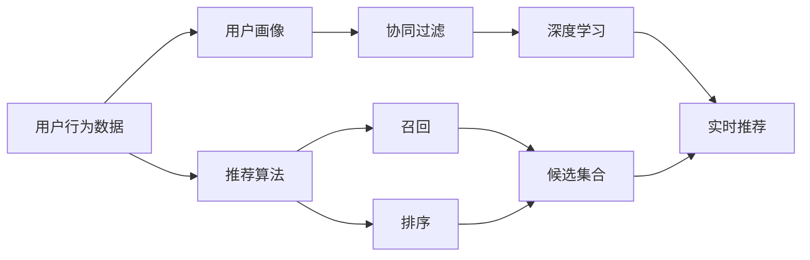

                 

# AI实时推荐系统的实现案例

> 关键词：推荐系统,协同过滤,召回率,精确度,实时性,深度学习

## 1. 背景介绍

### 1.1 问题由来

在当今数字化时代，推荐系统（Recommender System）已经深入各行各业，从电商、视频网站到社交媒体，都在采用推荐系统来提升用户体验和转化率。推荐系统通过分析用户历史行为数据，预测用户可能感兴趣的商品、内容或服务，并实时推送给用户，从而极大地提高平台的活跃度和收益。

推荐系统的工作流程一般包括召回（Recall）和排序（Ranking）两个步骤。召回阶段的目标是从大量候选集合中筛选出用户可能感兴趣的项目，排序阶段则对召回结果进行排序，优先推荐给用户最感兴趣的项目。

本文聚焦于实时推荐系统，特别是一种结合协同过滤（Collaborative Filtering）和深度学习（Deep Learning）的推荐系统，探讨其实现方法和性能优化策略。

## 2. 核心概念与联系

### 2.1 核心概念概述

为更好地理解实时推荐系统的实现案例，本节将介绍几个密切相关的核心概念：

- 协同过滤（Collaborative Filtering）：基于用户-项目评分矩阵，通过挖掘用户间的相似性和项目间的相似性，推荐用户未交互过的项目。常见的协同过滤方法包括基于用户的协同过滤和基于项目的协同过滤。
- 深度学习（Deep Learning）：通过多层神经网络模型，提取高层次的特征表示，实现更准确和智能的推荐。深度学习模型如神经网络、卷积神经网络（CNN）、循环神经网络（RNN）等，在推荐系统中得到了广泛应用。
- 召回（Recall）：从候选集合中筛选出用户可能感兴趣的项目，是推荐系统的第一步，召回率（Recall Rate）是衡量召回性能的重要指标。
- 排序（Ranking）：对召回结果进行排序，推荐最相关的项目，排序的性能直接影响到用户的满意度。
- 实时性（Real-time）：推荐系统需具备处理高并发请求和即时响应能力，才能实现良好的用户体验。

这些核心概念之间的逻辑关系可以通过以下Mermaid流程图来展示：



这个流程图展示了从用户行为数据到实时推荐的基本过程：

1. 用户行为数据经过用户画像（User Profiling）处理，形成用户特征向量。
2. 协同过滤和深度学习两个模型根据用户画像，生成候选集合。
3. 召回算法从候选集合中筛选出与用户最相关的项目。
4. 排序算法对召回结果进行排序，生成推荐结果。
5. 最终生成的推荐结果实时推送给用户。

### 2.2 概念间的关系

这些核心概念之间存在着紧密的联系，形成了实时推荐系统的完整生态系统。下面我们通过几个Mermaid流程图来展示这些概念之间的关系。

#### 2.2.1 实时推荐系统整体架构


这个综合流程图展示了从预处理到实时推荐的全过程。用户行为数据通过用户画像处理，协同过滤和深度学习两个模型生成候选集合，召回算法筛选结果，排序算法排序后生成最终推荐结果。

#### 2.2.2 协同过滤与深度学习的结合


这个流程图展示了协同过滤和深度学习模型在推荐系统中的结合应用。用户画像经过协同过滤模型，生成候选项目。这些候选项目再通过深度学习模型进一步处理，生成最终的推荐结果。

#### 2.2.3 召回与排序的优化


这个流程图展示了召回和排序算法在实时推荐中的作用。候选集合经过召回算法筛选出用户可能感兴趣的项目，再通过排序算法生成最终推荐结果。

## 3. 核心算法原理 & 具体操作步骤

### 3.1 算法原理概述

实时推荐系统通常采用协同过滤和深度学习相结合的方法。其中，协同过滤方法通过分析用户行为数据，挖掘用户间的相似性和项目间的相似性，推荐用户未交互过的项目。深度学习方法则通过学习用户特征和项目特征，生成高层次的表示，实现更智能和个性化的推荐。

协同过滤方法主要分为基于用户的协同过滤和基于项目的协同过滤。基于用户的协同过滤通过计算用户间的相似度，推荐相似用户喜欢的项目；基于项目的协同过滤通过计算项目间的相似度，推荐相似项目给用户。深度学习方法则包括矩阵分解、神经网络、卷积神经网络（CNN）、循环神经网络（RNN）等多种模型。

在实时推荐系统中，协同过滤和深度学习模型通常需要进行实时更新，以适应用户行为变化。用户行为数据实时流入系统，经过用户画像处理后，协同过滤和深度学习模型进行动态更新，生成新的候选集合和推荐结果。

### 3.2 算法步骤详解

基于协同过滤和深度学习的实时推荐系统一般包括以下几个关键步骤：

**Step 1: 用户画像生成**

用户画像（User Profiling）是通过对用户历史行为数据进行分析和建模，形成用户特征向量。具体步骤如下：

1. 收集用户行为数据：包括用户浏览、点击、购买、评分等行为数据。
2. 数据预处理：对行为数据进行清洗、去重、归一化等处理。
3. 特征提取：从行为数据中提取用户特征，如兴趣标签、行为序列、兴趣时间等。
4. 特征融合：将不同来源的用户特征进行融合，生成用户画像。

**Step 2: 协同过滤模型训练**

协同过滤模型通过挖掘用户间的相似性和项目间的相似性，推荐用户未交互过的项目。具体步骤如下：

1. 构建用户-项目评分矩阵：根据用户历史行为数据，构建用户-项目评分矩阵。
2. 计算用户间的相似度：通过余弦相似度或皮尔逊相关系数等方法，计算用户间的相似度。
3. 计算项目间的相似度：通过余弦相似度或皮尔逊相关系数等方法，计算项目间的相似度。
4. 生成候选集合：根据用户画像和项目相似度，生成候选项目集合。

**Step 3: 深度学习模型训练**

深度学习模型通过学习用户特征和项目特征，生成高层次的表示，实现更智能和个性化的推荐。具体步骤如下：

1. 数据预处理：对用户画像和项目数据进行清洗、归一化等处理。
2. 模型训练：使用深度学习框架（如TensorFlow、PyTorch）训练深度学习模型，生成用户特征向量。
3. 特征融合：将深度学习生成的用户特征向量与协同过滤模型生成的候选集合进行融合。

**Step 4: 实时推荐生成**

实时推荐系统通过动态更新用户画像、协同过滤模型和深度学习模型，生成实时的推荐结果。具体步骤如下：

1. 实时数据流：用户行为数据实时流入系统，经过用户画像处理后，动态更新用户画像。
2. 实时协同过滤：动态更新协同过滤模型，生成新的候选项目集合。
3. 实时深度学习：动态更新深度学习模型，生成用户特征向量。
4. 实时推荐：将动态更新的用户画像、候选项目集合和用户特征向量输入召回算法和排序算法，生成最终推荐结果。

**Step 5: 推荐结果推送**

推荐结果实时推送给用户，具体步骤如下：

1. 推荐结果渲染：将推荐结果渲染为适合展示的格式，如网页、APP界面等。
2. 推荐结果展示：将渲染后的推荐结果展示给用户。
3. 用户反馈收集：收集用户对推荐结果的反馈，用于后续模型优化。

### 3.3 算法优缺点

基于协同过滤和深度学习的实时推荐系统具有以下优点：

1. 个性化推荐：深度学习模型能够学习用户的多维特征，生成个性化的推荐结果。
2. 实时性：协同过滤和深度学习模型可以实时更新，快速响应用户行为变化。
3. 高精度：深度学习模型能够捕捉复杂的特征关系，生成高精度的推荐结果。

同时，该方法也存在一定的局限性：

1. 数据稀疏性：协同过滤模型面临数据稀疏性问题，即用户-项目评分矩阵中的大部分元素为0。
2. 计算复杂度：深度学习模型在训练和推理时计算复杂度较高，需要高性能计算资源。
3. 模型泛化性：模型对新数据的泛化能力较差，容易过拟合训练数据。
4. 用户隐私：用户行为数据涉及用户隐私，处理不当可能侵犯用户隐私。

尽管存在这些局限性，但基于协同过滤和深度学习的实时推荐系统仍然是目前最主流和有效的推荐方法之一，广泛应用于电商、视频网站等平台。

### 3.4 算法应用领域

基于协同过滤和深度学习的实时推荐系统在多个领域得到了广泛应用，例如：

- 电子商务：通过推荐系统向用户推荐商品，提高用户购物体验和平台销售额。
- 视频网站：根据用户观看历史和评分，推荐用户可能感兴趣的视频内容。
- 社交媒体：向用户推荐朋友、文章、图片等内容，增加用户粘性和平台活跃度。
- 音乐平台：推荐用户喜欢的音乐，提高用户满意度。
- 新闻网站：根据用户阅读历史和点击记录，推荐相关新闻内容。

除了上述这些经典应用，实时推荐系统还在金融、旅游、教育等多个领域得到了应用，为各行各业带来了新的商业机会。

## 4. 数学模型和公式 & 详细讲解

### 4.1 数学模型构建

假设用户画像为 $U=\{u_1,u_2,...,u_m\}$，项目集合为 $I=\{i_1,i_2,...,i_n\}$，用户和项目评分矩阵为 $R \in \mathbb{R}^{m \times n}$。协同过滤模型 $CF$ 通过计算用户间的相似度，生成候选项目集合 $S=\{i_1,i_2,...,i_k\}$。深度学习模型 $DL$ 通过学习用户特征和项目特征，生成用户特征向量 $\hat{U}=\{\hat{u}_1,\hat{u}_2,...,\hat{u}_m\}$。实时推荐系统通过召回算法 $R$ 和排序算法 $S$，生成推荐结果 $R_S=\{r_1,r_2,...,r_k\}$。

用户画像的生成公式为：

$$
\hat{U} = f(U,R)
$$

其中 $f$ 为特征提取和融合函数，具体形式因应用场景而定。

协同过滤模型的生成公式为：

$$
S = CF(\hat{U},I)
$$

其中 $CF$ 为协同过滤算法，具体形式因应用场景而定。

深度学习模型的生成公式为：

$$
\hat{U} = DL(U,I)
$$

其中 $DL$ 为深度学习算法，具体形式因应用场景而定。

实时推荐的生成公式为：

$$
R_S = R(\hat{U},S)
$$

其中 $R$ 为召回算法，$S$ 为排序算法，具体形式因应用场景而定。

推荐结果的最终渲染公式为：

$$
O = \text{render}(R_S)
$$

其中 $\text{render}$ 为渲染函数，将推荐结果转换为展示格式。

### 4.2 公式推导过程

以下是一些关键的公式推导，用于进一步理解和优化实时推荐系统。

#### 4.2.1 用户间相似度计算

用户间的相似度可以通过余弦相似度或皮尔逊相关系数计算，公式如下：

$$
\text{similarity}(u_i,u_j) = \frac{\vec{u_i} \cdot \vec{u_j}}{\|\vec{u_i}\| \|\vec{u_j}\|}
$$

其中 $\vec{u_i}$ 和 $\vec{u_j}$ 为用户 $u_i$ 和 $u_j$ 的特征向量，$\cdot$ 表示向量的点积，$\|\cdot\|$ 表示向量的范数。

#### 4.2.2 项目间相似度计算

项目间的相似度可以通过余弦相似度或皮尔逊相关系数计算，公式如下：

$$
\text{similarity}(i_k,i_l) = \frac{\vec{i_k} \cdot \vec{i_l}}{\|\vec{i_k}\| \|\vec{i_l}\|}
$$

其中 $\vec{i_k}$ 和 $\vec{i_l}$ 为项目 $i_k$ 和 $i_l$ 的特征向量，$\cdot$ 表示向量的点积，$\|\cdot\|$ 表示向量的范数。

#### 4.2.3 召回算法

召回算法可以通过基于用户的协同过滤和基于项目的协同过滤实现。基于用户的协同过滤算法如下：

$$
S = \{j \in I | \text{similarity}(u_i,j) > \theta \text{ and } j \notin U\}
$$

其中 $\theta$ 为相似度阈值，$U$ 为用户画像。基于项目的协同过滤算法如下：

$$
S = \{j \in I | \text{similarity}(i_k,j) > \theta \text{ and } j \notin I\}
$$

其中 $\theta$ 为相似度阈值，$I$ 为项目集合。

#### 4.2.4 排序算法

排序算法可以根据深度学习模型生成的用户特征向量 $\hat{U}$ 和项目特征向量 $\hat{I}$ 进行计算。常用的排序算法包括：

$$
\text{rank}(\hat{U},S) = \text{softmax}(\hat{U} \cdot \hat{I})
$$

其中 $\text{softmax}$ 为softmax函数，将输出转化为概率分布。

### 4.3 案例分析与讲解

以下是一些典型的案例分析，用于进一步展示实时推荐系统的实现方法。

#### 4.3.1 电商推荐系统

电商推荐系统通过分析用户历史浏览、点击、购买等行为数据，生成用户画像和项目画像。基于用户的协同过滤算法生成候选项目集合，基于深度学习模型生成用户特征向量。召回算法根据用户特征向量和候选项目集合进行匹配，排序算法根据用户特征向量和项目特征向量进行排序，生成推荐结果。最终推荐结果展示在电商APP中，提升用户购物体验和平台销售额。

#### 4.3.2 视频推荐系统

视频推荐系统通过分析用户观看历史和评分数据，生成用户画像和视频画像。基于项目的协同过滤算法生成候选项目集合，基于深度学习模型生成用户特征向量。召回算法根据用户特征向量和候选项目集合进行匹配，排序算法根据用户特征向量和视频特征向量进行排序，生成推荐结果。最终推荐结果展示在视频平台中，提高用户观看体验和平台收益。

## 5. 项目实践：代码实例和详细解释说明

### 5.1 开发环境搭建

在进行推荐系统开发前，我们需要准备好开发环境。以下是使用Python进行PyTorch开发的环境配置流程：

1. 安装Anaconda：从官网下载并安装Anaconda，用于创建独立的Python环境。

2. 创建并激活虚拟环境：
```bash
conda create -n pytorch-env python=3.8 
conda activate pytorch-env
```

3. 安装PyTorch：根据CUDA版本，从官网获取对应的安装命令。例如：
```bash
conda install pytorch torchvision torchaudio cudatoolkit=11.1 -c pytorch -c conda-forge
```

4. 安装各类工具包：
```bash
pip install numpy pandas scikit-learn matplotlib tqdm jupyter notebook ipython
```

完成上述步骤后，即可在`pytorch-env`环境中开始推荐系统开发。

### 5.2 源代码详细实现

这里以一个简单的基于协同过滤的电商推荐系统为例，给出使用PyTorch的代码实现。

首先，定义推荐系统的类：

```python
import torch
from torch import nn
from torch.nn import functional as F

class RecommendationSystem(nn.Module):
    def __init__(self, num_users, num_items, num_factors):
        super(RecommendationSystem, self).__init__()
        self.num_users = num_users
        self.num_items = num_items
        self.num_factors = num_factors
        self.user_embed = nn.Embedding(num_users, num_factors)
        self.item_embed = nn.Embedding(num_items, num_factors)
        self.similarity = nn.Parameter(torch.randn(num_factors, num_factors))
    
    def forward(self, user_idx, item_idx):
        user_embed = self.user_embed(user_idx)
        item_embed = self.item_embed(item_idx)
        similarity = self.similarity @ user_embed @ item_embed.T
        return similarity
```

然后，定义协同过滤模型的训练函数：

```python
def train_cf_model(cf_model, train_loader, optimizer, device):
    model.train()
    for user_idx, item_idx in train_loader:
        user_idx, item_idx = user_idx.to(device), item_idx.to(device)
        similarity = cf_model(user_idx, item_idx)
        optimizer.zero_grad()
        loss = F.binary_cross_entropy(similarity, target)
        loss.backward()
        optimizer.step()
```

接下来，定义深度学习模型的训练函数：

```python
def train_dl_model(dl_model, train_loader, optimizer, device):
    model.train()
    for user_idx, item_idx in train_loader:
        user_idx, item_idx = user_idx.to(device), item_idx.to(device)
        user_embed = dl_model(user_idx)
        item_embed = dl_model(item_idx)
        similarity = user_embed @ item_embed.T
        optimizer.zero_grad()
        loss = F.binary_cross_entropy(similarity, target)
        loss.backward()
        optimizer.step()
```

最后，定义实时推荐系统的生成函数：

```python
def generate_recommendations(train_loader, test_loader, cf_model, dl_model, num_top_items=10):
    test_user_idx, test_item_idx = next(iter(test_loader))
    test_user_idx, test_item_idx = test_user_idx.to(device), test_item_idx.to(device)
    similarity = cf_model(test_user_idx, test_item_idx)
    predictions = F.softmax(similarity, dim=1)
    top_items = torch.topk(predictions, num_top_items, dim=1)[1]
    return top_items
```

这里仅给出了推荐系统的主要部分，完整的代码实现还需要考虑数据预处理、模型评估、超参数调优等环节。

### 5.3 代码解读与分析

让我们再详细解读一下关键代码的实现细节：

**RecommendationSystem类**：
- `__init__`方法：初始化用户画像和项目画像，定义用户和项目嵌入层，以及相似度矩阵。
- `forward`方法：根据用户和项目嵌入生成相似度矩阵，返回推荐结果。

**train_cf_model函数**：
- 在训练集上进行协同过滤模型的前向传播和反向传播，更新模型参数。

**train_dl_model函数**：
- 在训练集上进行深度学习模型的前向传播和反向传播，更新模型参数。

**generate_recommendations函数**：
- 在测试集上生成推荐结果，首先通过协同过滤模型生成相似度矩阵，再通过softmax函数生成概率分布，最后取top items。

以上代码实现了基于协同过滤和深度学习的推荐系统，可以应用于电商、视频网站等平台。在实际应用中，还需要考虑更多细节，如模型的融合方式、评分矩阵的构建、用户画像的处理等。

## 6. 实际应用场景

### 6.1 智能客服系统

智能客服系统通过分析用户历史行为数据，推荐用户可能感兴趣的问题，提升客户咨询体验。推荐系统结合自然语言处理技术，实现用户意图理解、问题匹配、知识库检索等功能。

### 6.2 金融舆情监测

金融舆情监测通过分析金融新闻、评论等文本数据，生成用户画像和内容画像，推荐用户可能感兴趣的新闻内容，帮助金融机构及时应对市场变化。

### 6.3 个性化推荐系统

个性化推荐系统通过分析用户历史行为数据，生成用户画像和物品画像，推荐用户可能感兴趣的物品，提升用户满意度。

### 6.4 未来应用展望

随着推荐系统技术的不断发展，未来的应用场景将更加广泛。以下列举了几个具有潜力的应用领域：

- 健康医疗：推荐系统可以根据用户健康数据，推荐个性化健康方案，提升用户健康水平。
- 旅游出行：推荐系统可以根据用户旅游偏好，推荐旅游路线、酒店、景点等，提升用户出行体验。
- 教育培训：推荐系统可以根据用户学习历史，推荐个性化课程和教材，提升学习效果。
- 内容创作：推荐系统可以根据用户阅读历史，推荐类似文章、书籍、视频等，促进内容创作和知识传播。

## 7. 工具和资源推荐

### 7.1 学习资源推荐

为了帮助开发者系统掌握推荐系统的理论基础和实践技巧，这里推荐一些优质的学习资源：

1. 《推荐系统》书籍：由David K. Yellowlees 著，全面介绍了推荐系统的原理和算法。

2. Coursera《机器学习》课程：由Andrew Ng 主讲，介绍机器学习和深度学习的基础知识，包括推荐系统的实现。

3. 《深度学习》书籍：由Ian Goodfellow 著，深入浅出地介绍了深度学习的基本原理和应用，包括推荐系统的实现。

4. Kaggle推荐系统竞赛：通过实际竞赛项目，帮助开发者掌握推荐系统的实现方法。

5. PyTorch官方文档：PyTorch框架的官方文档，提供了丰富的推荐系统样例代码。

通过对这些资源的学习实践，相信你一定能够快速掌握推荐系统的精髓，并用于解决实际的推荐问题。

### 7.2 开发工具推荐

高效的开发离不开优秀的工具支持。以下是几款用于推荐系统开发的常用工具：

1. PyTorch：基于Python的开源深度学习框架，灵活动态的计算图，适合快速迭代研究。大部分推荐系统都有PyTorch版本的实现。

2. TensorFlow：由Google主导开发的开源深度学习框架，生产部署方便，适合大规模工程应用。同样有丰富的推荐系统资源。

3. Scikit-learn：基于Python的机器学习库，提供了多种推荐系统算法，如协同过滤、基于内容的推荐等。

4. Spark MLlib：Apache Spark的机器学习库，支持分布式推荐系统开发。

5. Amazon Personalize：亚马逊的推荐系统服务，提供了多种推荐算法和API，方便开发者快速部署。

合理利用这些工具，可以显著提升推荐系统的开发效率，加快创新迭代的步伐。

### 7.3 相关论文推荐

推荐系统的发展源于学界的持续研究。以下是几篇奠基性的相关论文，推荐阅读：

1. "Collaborative Filtering for Implicit Feedback Datasets"：提出协同过滤算法的基本框架，用于推荐系统的实现。

2. "Neural Collaborative Filtering"：提出基于深度学习的推荐系统方法，实现了显著的推荐效果。

3. "Factorization Machines"：提出因子分解机算法，用于推荐系统中的特征提取和模型训练。

4. "Deep Learning Recommendation Systems: A Survey"：综述了深度学习在推荐系统中的应用，提供了丰富的算法和实现方法。

5. "Beyond Matrix Factorization: A Canonical Tensor Factorization Framework for Recommender Systems"：提出基于张量分解的推荐系统方法，进一步提升了推荐效果。

这些论文代表了大语言模型微调技术的发展脉络。通过学习这些前沿成果，可以帮助研究者把握学科前进方向，激发更多的创新灵感。

除上述资源外，还有一些值得关注的前沿资源，帮助开发者紧跟推荐系统的最新进展，例如：

1. arXiv论文预印本：人工智能领域最新研究成果的发布平台，包括大量尚未发表的前沿工作，学习前沿技术的必读资源。

2. 业界技术博客：如Amazon、Google、微软Research Asia等顶尖实验室的官方博客，第一时间分享他们的最新研究成果和洞见。

3. 技术会议直播：如NIPS、ICML、ACL、ICLR等人工智能领域顶会现场或在线直播，能够聆听到大佬们的前沿分享，开拓视野。

4. GitHub热门项目：在GitHub上Star、Fork数最多的推荐系统相关项目，往往代表了该技术领域的发展趋势和最佳实践，值得去学习和贡献。

5. 行业分析报告：各大咨询公司如McKinsey、PwC等针对推荐系统的分析报告，有助于从商业视角审视技术趋势，把握应用价值。

总之，对于推荐系统的学习和发展，需要开发者保持开放的心态和持续学习的意愿。多关注前沿资讯，多动手实践，多思考总结，必将收获满满的成长收益。

## 8. 总结：未来发展趋势与挑战

### 8.1 总结

本文对基于协同过滤和深度学习的实时推荐系统进行了全面系统的介绍。首先阐述了推荐系统的基本原理和实现方法，明确了推荐系统在个性化推荐、实时性、高精度等方面的独特价值。其次，从原理到实践，详细讲解了推荐系统的数学模型和关键算法步骤，给出了推荐系统开发的完整代码实例。同时，本文还广泛探讨了推荐系统在智能客服、金融舆情、个性化推荐等多个领域的应用前景，展示了推荐系统技术的广泛应用价值。

通过本文的系统梳理，可以看到，基于协同过滤和深度学习的实时推荐系统已经在电商、视频网站等多个领域得到了广泛应用，为各行各业带来了显著

