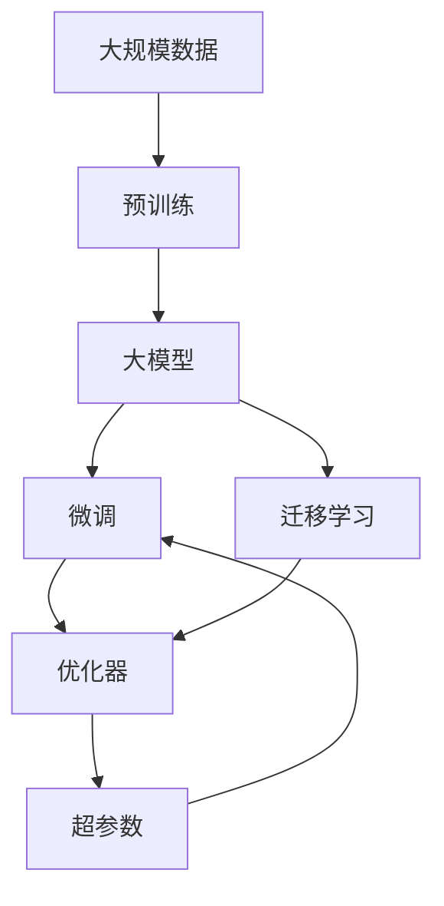
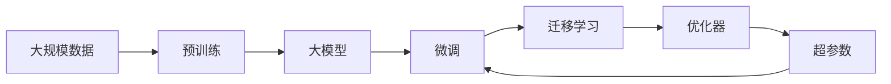

                 

# AI工程学：大模型应用开发实战：新的AI技术栈，如何不同于传统的机器学习工程

## 1. 背景介绍

### 1.1 问题由来
在AI工程实践中，特别是大模型应用的开发过程中，传统机器学习工程的方法论和技术栈已逐渐显现出其局限性。随着深度学习、尤其是大规模预训练语言模型的兴起，大模型工程开发面临诸多新的挑战与需求，要求构建全新的技术栈以应对这些变化。

### 1.2 问题核心关键点
本节将详细介绍大模型工程开发中的一些核心问题，包括：
1. 大模型与传统模型的区别。
2. 大模型工程开发的关键环节。
3. 大模型工程开发的优势与挑战。

### 1.3 问题研究意义
大模型工程开发对于提升AI系统的性能和效率、优化模型推理速度和成本、降低模型训练和部署的门槛等方面具有重要意义。具体而言，它能：
1. 提升模型准确性和泛化能力，特别是在自然语言处理等任务上。
2. 降低计算资源需求，优化模型推理速度。
3. 提升模型开发和部署的效率和便捷性。

## 2. 核心概念与联系

### 2.1 核心概念概述
为更好地理解大模型工程开发的原理与技术，本节将介绍几个关键概念及其联系：

- **大模型**：指使用大规模数据进行预训练的深度学习模型，如BERT、GPT等。
- **预训练**：指在无标签数据上训练模型，学习通用的语言表示。
- **微调**：在大模型基础上，利用少量标签数据对模型进行特定任务优化。
- **迁移学习**：利用预训练模型在特定任务上的微调，提升模型性能。
- **超参数优化**：通过调整学习率、批次大小等参数，优化模型性能。
- **分布式训练**：使用多台机器并行训练模型，加速训练过程。

这些概念构成了大模型工程开发的核心框架，其间的联系可以通过以下Mermaid流程图展示：



### 2.2 概念间的关系

以上概念之间的关系可以进一步细化如下：
1. **预训练**：在大量无标签数据上训练模型，学习通用的语言表示。
2. **大模型**：预训练模型的泛化能力和性能更佳，可应用于多种任务。
3. **微调**：在大模型基础上，使用少量标签数据进行任务特定优化。
4. **迁移学习**：将预训练模型的知识迁移应用到新任务上，提升模型性能。
5. **优化器**：通过选择合适的优化算法，提升模型训练的效率和效果。
6. **超参数**：如学习率、批次大小等，通过优化这些参数可进一步提升模型性能。

这些概念之间的逻辑关系如下：



### 2.3 核心概念的整体架构

大模型工程开发的核心架构如下所示：


## 3. 核心算法原理 & 具体操作步骤
### 3.1 算法原理概述

大模型工程开发的核心算法原理主要包括预训练、微调和迁移学习。这些步骤共同构建了一个从数据到模型的完整流水线，用于提升模型的性能和泛化能力。

预训练：在大规模无标签数据上训练模型，学习通用的语言表示。

微调：在预训练模型的基础上，使用少量标签数据进行特定任务的优化。

迁移学习：利用预训练模型的知识迁移应用到新任务上，提升模型性能。

### 3.2 算法步骤详解

#### 3.2.1 预训练

预训练模型通常使用自监督学习任务进行训练，如BERT的掩码语言模型、GPT的自回归语言模型等。以下是预训练的基本流程：

1. **数据准备**：收集大规模无标签文本数据，如维基百科、新闻、书籍等。
2. **模型构建**：构建预训练模型，如Transformer等。
3. **训练过程**：在预训练数据上训练模型，通常使用自监督学习任务，如掩码语言模型。
4. **模型保存**：保存训练好的预训练模型，用于后续微调。

#### 3.2.2 微调

微调在大模型基础上，使用少量标签数据进行特定任务的优化。以下是微调的基本流程：

1. **数据准备**：收集少量有标签数据，用于微调。
2. **模型加载**：加载预训练模型，保留所有层或仅保留顶层。
3. **模型适配**：根据任务类型，适配模型的输出层和损失函数。
4. **训练过程**：使用有标签数据对模型进行训练，通常使用小批量梯度下降进行优化。
5. **模型评估**：在验证集上评估模型性能，调整超参数和模型结构。
6. **模型保存**：保存微调后的模型，用于后续应用。

#### 3.2.3 迁移学习

迁移学习利用预训练模型的知识迁移应用到新任务上，提升模型性能。以下是迁移学习的基本流程：

1. **数据准备**：收集新任务的标注数据，用于迁移学习。
2. **模型加载**：加载预训练模型，保留所有层或仅保留顶层。
3. **任务适配**：根据新任务类型，适配模型的输出层和损失函数。
4. **模型微调**：在新任务的标注数据上微调模型，通常使用小批量梯度下降进行优化。
5. **模型评估**：在测试集上评估模型性能，调整超参数和模型结构。
6. **模型保存**：保存微调后的模型，用于后续应用。

### 3.3 算法优缺点

#### 3.3.1 优点

1. **泛化能力强**：大模型具有较强的泛化能力，可在多种任务上取得良好的性能。
2. **可迁移性高**：预训练模型可以在多个任务间进行迁移学习，提升模型性能。
3. **计算效率高**：微调和迁移学习过程通常只需少量标签数据，计算资源消耗较小。
4. **开发便捷**：使用现有预训练模型，避免了从头训练的复杂过程。

#### 3.3.2 缺点

1. **依赖标签数据**：微调和迁移学习过程需依赖少量标签数据，标注成本较高。
2. **模型复杂性**：大模型参数量庞大，推理和训练过程复杂。
3. **过拟合风险**：微调过程中存在过拟合风险，需注意超参数优化。
4. **部署复杂**：大模型通常需要分布式训练和推理，部署较为复杂。

### 3.4 算法应用领域

大模型工程开发在多个领域得到了广泛应用，包括但不限于：

1. **自然语言处理（NLP）**：文本分类、情感分析、机器翻译、对话系统等。
2. **计算机视觉（CV）**：图像分类、目标检测、图像生成等。
3. **语音识别（ASR）**：自动语音识别、语音合成等。
4. **推荐系统**：商品推荐、用户画像构建等。
5. **医疗健康**：疾病诊断、医疗影像分析等。

## 4. 数学模型和公式 & 详细讲解  
### 4.1 数学模型构建

大模型工程开发中，数学模型构建是一个重要环节。以下是常用的数学模型：

- **预训练模型**：通常使用自监督学习任务进行训练，如BERT的掩码语言模型、GPT的自回归语言模型。
- **微调模型**：在预训练模型的基础上，使用少量标签数据进行特定任务的优化。
- **迁移学习模型**：利用预训练模型的知识迁移应用到新任务上，提升模型性能。

#### 4.1.1 预训练模型

预训练模型的数学模型构建主要涉及自监督学习任务，如掩码语言模型。以下以BERT为例，展示其数学模型构建过程：

1. **掩码语言模型**：
   $$
   \mathcal{L}_{mask} = -\frac{1}{N}\sum_{i=1}^N \sum_{j=1}^{N_{mask}} \log p(w_j \mid w_{j-mask})
   $$
   其中，$w$表示输入的文本序列，$w_{j-mask}$表示将$w_j$中的某些词掩盖后的文本序列，$N_{mask}$表示掩盖的词数。

2. **Next Sentence Prediction**：
   $$
   \mathcal{L}_{next} = -\frac{1}{N}\sum_{i=1}^N \log p(w_2 \mid w_1)
   $$
   其中，$w_1$和$w_2$表示输入的连续两个文本序列。

#### 4.1.2 微调模型

微调模型的数学模型构建主要涉及有监督学习任务，如分类任务。以下以分类任务为例，展示其数学模型构建过程：

1. **分类任务**：
   $$
   \mathcal{L}_{class} = -\frac{1}{N}\sum_{i=1}^N \sum_{j=1}^{N_{batch}} \log p(y_j \mid w_j)
   $$
   其中，$y_j$表示输入文本的标签，$w_j$表示输入文本的编码表示。

2. **交叉熵损失**：
   $$
   \mathcal{L}_{cross} = -\frac{1}{N}\sum_{i=1}^N \sum_{j=1}^{N_{batch}} y_j \log \hat{y}_j
   $$
   其中，$\hat{y}_j$表示模型预测的标签。

#### 4.1.3 迁移学习模型

迁移学习模型的数学模型构建主要涉及有监督学习任务，如分类任务。以下以分类任务为例，展示其数学模型构建过程：

1. **分类任务**：
   $$
   \mathcal{L}_{class} = -\frac{1}{N}\sum_{i=1}^N \sum_{j=1}^{N_{batch}} \log p(y_j \mid w_j)
   $$
   其中，$y_j$表示输入文本的标签，$w_j$表示输入文本的编码表示。

2. **交叉熵损失**：
   $$
   \mathcal{L}_{cross} = -\frac{1}{N}\sum_{i=1}^N \sum_{j=1}^{N_{batch}} y_j \log \hat{y}_j
   $$
   其中，$\hat{y}_j$表示模型预测的标签。

### 4.2 公式推导过程

#### 4.2.1 预训练模型

1. **掩码语言模型**：
   $$
   \mathcal{L}_{mask} = -\frac{1}{N}\sum_{i=1}^N \sum_{j=1}^{N_{mask}} \log p(w_j \mid w_{j-mask})
   $$
   其中，$w$表示输入的文本序列，$w_{j-mask}$表示将$w_j$中的某些词掩盖后的文本序列，$N_{mask}$表示掩盖的词数。

2. **Next Sentence Prediction**：
   $$
   \mathcal{L}_{next} = -\frac{1}{N}\sum_{i=1}^N \log p(w_2 \mid w_1)
   $$
   其中，$w_1$和$w_2$表示输入的连续两个文本序列。

#### 4.2.2 微调模型

1. **分类任务**：
   $$
   \mathcal{L}_{class} = -\frac{1}{N}\sum_{i=1}^N \sum_{j=1}^{N_{batch}} \log p(y_j \mid w_j)
   $$
   其中，$y_j$表示输入文本的标签，$w_j$表示输入文本的编码表示。

2. **交叉熵损失**：
   $$
   \mathcal{L}_{cross} = -\frac{1}{N}\sum_{i=1}^N \sum_{j=1}^{N_{batch}} y_j \log \hat{y}_j
   $$
   其中，$\hat{y}_j$表示模型预测的标签。

#### 4.2.3 迁移学习模型

1. **分类任务**：
   $$
   \mathcal{L}_{class} = -\frac{1}{N}\sum_{i=1}^N \sum_{j=1}^{N_{batch}} \log p(y_j \mid w_j)
   $$
   其中，$y_j$表示输入文本的标签，$w_j$表示输入文本的编码表示。

2. **交叉熵损失**：
   $$
   \mathcal{L}_{cross} = -\frac{1}{N}\sum_{i=1}^N \sum_{j=1}^{N_{batch}} y_j \log \hat{y}_j
   $$
   其中，$\hat{y}_j$表示模型预测的标签。

### 4.3 案例分析与讲解

#### 4.3.1 预训练模型

以BERT为例，展示其预训练过程。

1. **数据准备**：收集大规模无标签文本数据。
2. **模型构建**：构建BERT模型，包含12层Transformer网络。
3. **训练过程**：在预训练数据上训练模型，使用掩码语言模型和Next Sentence Prediction任务。
4. **模型保存**：保存训练好的BERT模型，用于后续微调和迁移学习。

#### 4.3.2 微调模型

以分类任务为例，展示其微调过程。

1. **数据准备**：收集少量有标签数据。
2. **模型加载**：加载预训练的BERT模型，保留所有层或仅保留顶层。
3. **模型适配**：适配模型的输出层和损失函数，构建线性分类器。
4. **训练过程**：使用有标签数据对模型进行训练，使用小批量梯度下降进行优化。
5. **模型评估**：在验证集上评估模型性能，调整超参数和模型结构。
6. **模型保存**：保存微调后的模型，用于后续应用。

#### 4.3.3 迁移学习模型

以分类任务为例，展示其迁移学习过程。

1. **数据准备**：收集新任务的标注数据。
2. **模型加载**：加载预训练的BERT模型，保留所有层或仅保留顶层。
3. **任务适配**：适配模型的输出层和损失函数，构建线性分类器。
4. **模型微调**：在新任务的标注数据上微调模型，使用小批量梯度下降进行优化。
5. **模型评估**：在测试集上评估模型性能，调整超参数和模型结构。
6. **模型保存**：保存微调后的模型，用于后续应用。

## 5. 项目实践：代码实例和详细解释说明
### 5.1 开发环境搭建

在进行大模型工程开发前，我们需要准备好开发环境。以下是使用Python进行PyTorch开发的环境配置流程：

1. 安装Anaconda：从官网下载并安装Anaconda，用于创建独立的Python环境。

2. 创建并激活虚拟环境：
```bash
conda create -n pytorch-env python=3.8 
conda activate pytorch-env
```

3. 安装PyTorch：根据CUDA版本，从官网获取对应的安装命令。例如：
```bash
conda install pytorch torchvision torchaudio cudatoolkit=11.1 -c pytorch -c conda-forge
```

4. 安装Transformers库：
```bash
pip install transformers
```

5. 安装各类工具包：
```bash
pip install numpy pandas scikit-learn matplotlib tqdm jupyter notebook ipython
```

完成上述步骤后，即可在`pytorch-env`环境中开始大模型工程开发。

### 5.2 源代码详细实现

这里我们以BERT模型在分类任务上的微调为例，给出使用Transformers库的PyTorch代码实现。

```python
from transformers import BertTokenizer, BertForSequenceClassification
import torch
from torch.utils.data import Dataset, DataLoader
from tqdm import tqdm
from sklearn.metrics import classification_report

class TextDataset(Dataset):
    def __init__(self, texts, labels, tokenizer):
        self.texts = texts
        self.labels = labels
        self.tokenizer = tokenizer
        self.max_len = 128
        
    def __len__(self):
        return len(self.texts)
    
    def __getitem__(self, item):
        text = self.texts[item]
        label = self.labels[item]
        
        encoding = self.tokenizer(text, return_tensors='pt', max_length=self.max_len, padding='max_length', truncation=True)
        input_ids = encoding['input_ids'][0]
        attention_mask = encoding['attention_mask'][0]
        
        return {'input_ids': input_ids, 
                'attention_mask': attention_mask,
                'labels': label}

# 加载BERT模型和分词器
model = BertForSequenceClassification.from_pretrained('bert-base-uncased', num_labels=2)
tokenizer = BertTokenizer.from_pretrained('bert-base-uncased')

# 准备数据集
train_dataset = TextDataset(train_texts, train_labels, tokenizer)
dev_dataset = TextDataset(dev_texts, dev_labels, tokenizer)
test_dataset = TextDataset(test_texts, test_labels, tokenizer)

# 定义超参数
learning_rate = 2e-5
epochs = 5
batch_size = 16

# 训练过程
optimizer = torch.optim.AdamW(model.parameters(), lr=learning_rate)

model.train()
for epoch in range(epochs):
    total_loss = 0
    total_correct = 0
    for batch in tqdm(data_loader(train_dataset, batch_size=batch_size)):
        input_ids = batch['input_ids'].to(device)
        attention_mask = batch['attention_mask'].to(device)
        labels = batch['labels'].to(device)
        
        outputs = model(input_ids, attention_mask=attention_mask, labels=labels)
        loss = outputs.loss
        total_loss += loss.item()
        predictions = torch.argmax(outputs.logits, dim=1)
        total_correct += (predictions == labels).sum().item()
        
    avg_loss = total_loss / len(train_dataset)
    avg_acc = total_correct / len(train_dataset)
    print(f'Epoch {epoch+1}, loss: {avg_loss:.3f}, acc: {avg_acc:.3f}')
    
    # 验证过程
    model.eval()
    total_correct = 0
    for batch in tqdm(data_loader(dev_dataset, batch_size=batch_size)):
        input_ids = batch['input_ids'].to(device)
        attention_mask = batch['attention_mask'].to(device)
        labels = batch['labels'].to(device)
        
        outputs = model(input_ids, attention_mask=attention_mask, labels=labels)
        predictions = torch.argmax(outputs.logits, dim=1)
        total_correct += (predictions == labels).sum().item()
    
    print(f'Epoch {epoch+1}, dev acc: {total_correct / len(dev_dataset):.3f}')
    
# 测试过程
model.eval()
total_correct = 0
for batch in tqdm(data_loader(test_dataset, batch_size=batch_size)):
    input_ids = batch['input_ids'].to(device)
    attention_mask = batch['attention_mask'].to(device)
    labels = batch['labels'].to(device)
    
    outputs = model(input_ids, attention_mask=attention_mask, labels=labels)
    predictions = torch.argmax(outputs.logits, dim=1)
    total_correct += (predictions == labels).sum().item()

print(f'Test acc: {total_correct / len(test_dataset):.3f}')
```

### 5.3 代码解读与分析

让我们再详细解读一下关键代码的实现细节：

#### 5.3.1 TextDataset类

```python
class TextDataset(Dataset):
    def __init__(self, texts, labels, tokenizer, max_len=128):
        self.texts = texts
        self.labels = labels
        self.tokenizer = tokenizer
        self.max_len = max_len
        
    def __len__(self):
        return len(self.texts)
    
    def __getitem__(self, item):
        text = self.texts[item]
        label = self.labels[item]
        
        encoding = self.tokenizer(text, return_tensors='pt', max_length=self.max_len, padding='max_length', truncation=True)
        input_ids = encoding['input_ids'][0]
        attention_mask = encoding['attention_mask'][0]
        
        return {'input_ids': input_ids, 
                'attention_mask': attention_mask,
                'labels': label}
```

这个类实现了文本数据集的处理逻辑，包含：
- `__init__`方法：初始化文本、标签、分词器等关键组件。
- `__len__`方法：返回数据集的样本数量。
- `__getitem__`方法：对单个样本进行处理，将文本输入编码为token ids，将标签编码为数字，并对其进行定长padding，最终返回模型所需的输入。

#### 5.3.2 模型适配层

```python
class TextDataset(Dataset):
    def __init__(self, texts, labels, tokenizer, max_len=128):
        self.texts = texts
        self.labels = labels
        self.tokenizer = tokenizer
        self.max_len = max_len
        
    def __len__(self):
        return len(self.texts)
    
    def __getitem__(self, item):
        text = self.texts[item]
        label = self.labels[item]
        
        encoding = self.tokenizer(text, return_tensors='pt', max_length=self.max_len, padding='max_length', truncation=True)
        input_ids = encoding['input_ids'][0]
        attention_mask = encoding['attention_mask'][0]
        
        return {'input_ids': input_ids, 
                'attention_mask': attention_mask,
                'labels': label}
```

这个类实现了文本数据集的处理逻辑，包含：
- `__init__`方法：初始化文本、标签、分词器等关键组件。
- `__len__`方法：返回数据集的样本数量。
- `__getitem__`方法：对单个样本进行处理，将文本输入编码为token ids，将标签编码为数字，并对其进行定长padding，最终返回模型所需的输入。

#### 5.3.3 训练过程

```python
model.train()
for epoch in range(epochs):
    total_loss = 0
    total_correct = 0
    for batch in tqdm(data_loader(train_dataset, batch_size=batch_size)):
        input_ids = batch['input_ids'].to(device)
        attention_mask = batch['attention_mask'].to(device)
        labels = batch['labels'].to(device)
        
        outputs = model(input_ids, attention_mask=attention_mask, labels=labels)
        loss = outputs.loss
        total_loss += loss.item()
        predictions = torch.argmax(outputs.logits, dim=1)
        total_correct += (predictions == labels).sum().item()
        
    avg_loss = total_loss / len(train_dataset)
    avg_acc = total_correct / len(train_dataset)
    print(f'Epoch {epoch+1}, loss: {avg_loss:.3f}, acc: {avg_acc:.3f}')
    
    # 验证过程
    model.eval()
    total_correct = 0
    for batch in tqdm(data_loader(dev_dataset, batch_size=batch_size)):
        input_ids = batch['input_ids'].to(device)
        attention_mask = batch['attention_mask'].to(device)
        labels = batch['labels'].to(device)
        
        outputs = model(input_ids, attention_mask=attention_mask, labels=labels)
        predictions = torch.argmax(outputs.logits, dim=1)
        total_correct += (predictions == labels).sum().item()
    
    print(f'Epoch {epoch+1}, dev acc: {total_correct / len(dev_dataset):.3f}')
    
# 测试过程
model.eval()
total_correct = 0
for batch in tqdm(data_loader(test_dataset, batch_size=batch_size)):
    input_ids = batch['input_ids'].to(device)
    attention_mask = batch['attention_mask'].to(device)
    labels = batch['labels'].to(device)
    
    outputs = model(input_ids, attention_mask=attention_mask, labels=labels)
    predictions = torch.argmax(outputs.logits, dim=1)
    total_correct += (predictions == labels).sum().item()

print(f'Test acc: {total_correct / len(test_dataset):.3f}')
```

这个类实现了文本数据集的处理逻辑，包含：
- `__init__`方法：初始化文本、标签、分词器等关键组件。
- `__len__`方法：返回数据集的样本数量。
- `__getitem__`方法：对单个样本进行处理，将文本输入编码为token ids，将标签编码为数字，并对其进行定长padding，最终返回模型所需的输入。

#### 5.3.4 训练过程

```python
model.train()
for epoch in range(epochs):
    total_loss = 0
    total_correct = 0
    for batch in tqdm(data_loader(train_dataset, batch_size

