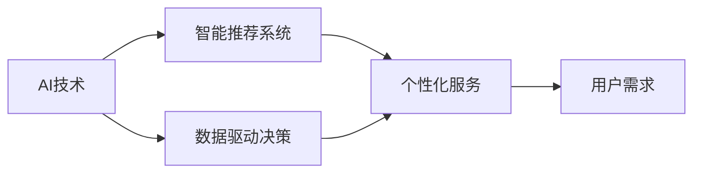
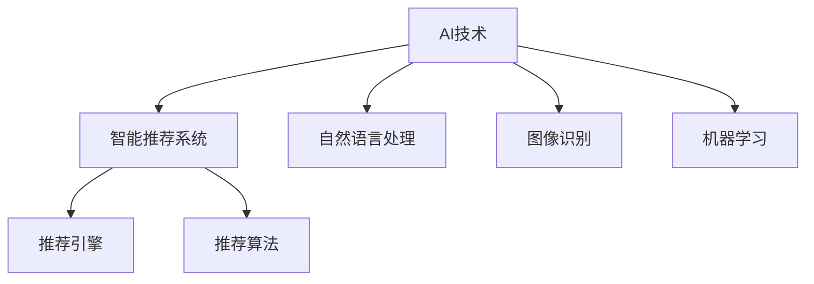
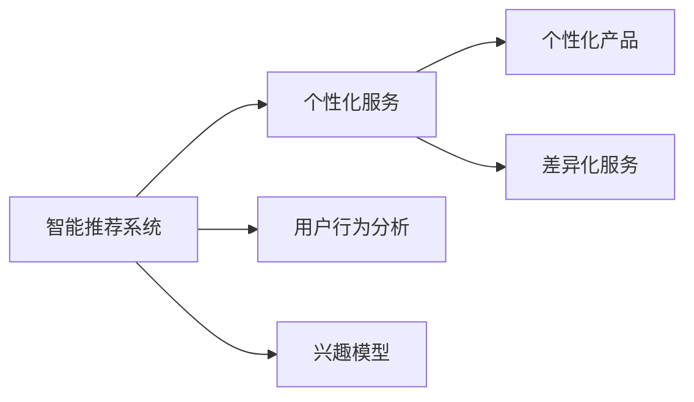
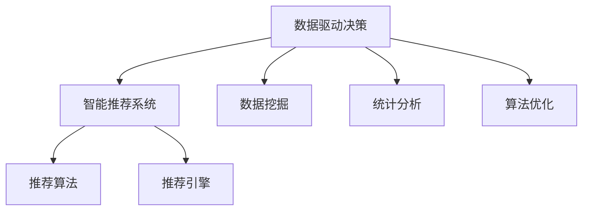

                 

# AI技术与用户需求的匹配

> 关键词：人工智能,用户需求匹配,智能推荐系统,个性化服务,数据驱动决策

## 1. 背景介绍

在互联网技术飞速发展的今天，AI技术已经成为企业提升用户体验、优化运营效率的重要手段。但与此同时，AI技术的应用也带来了用户隐私、数据安全等方面的风险和挑战。如何在满足用户需求的同时，确保AI技术的合理使用，成为业界和学术界共同关注的问题。

## 2. 核心概念与联系

### 2.1 核心概念概述

为更好地理解AI技术与用户需求的匹配，本节将介绍几个密切相关的核心概念：

- **AI技术**：指利用算法、模型和数据等手段，模拟人类智能行为的计算机技术。常见的AI技术包括机器学习、深度学习、自然语言处理等。
- **用户需求**：指用户在使用产品或服务时，对功能和体验的期望和需求。常见的用户需求包括信息获取、内容推荐、行为预测等。
- **智能推荐系统**：指基于AI技术，利用用户历史行为数据和兴趣模型，为用户提供个性化推荐的服务。智能推荐系统广泛应用于电商、内容平台、社交网络等领域。
- **个性化服务**：指根据用户个性化需求，提供定制化、差异化的产品和服务。个性化服务需要根据用户行为数据、兴趣模型和交互记录等，进行动态调整和优化。
- **数据驱动决策**：指利用数据分析和挖掘，辅助决策者进行科学决策。数据驱动决策需要借助统计学、机器学习等手段，挖掘数据背后的规律和趋势。

这些核心概念之间的逻辑关系可以通过以下Mermaid流程图来展示：



这个流程图展示了几者之间的关系：

1. AI技术为智能推荐系统提供了实现基础。
2. 智能推荐系统能够根据用户需求，提供个性化服务。
3. 数据驱动决策可以优化智能推荐系统的算法和模型。
4. 个性化服务是基于用户需求的反馈，进行动态调整的。

### 2.2 概念间的关系

这些核心概念之间存在着紧密的联系，形成了AI技术与用户需求匹配的完整生态系统。下面我们通过几个Mermaid流程图来展示这些概念之间的关系。

#### 2.2.1 AI技术与智能推荐系统的关系



这个流程图展示了AI技术与智能推荐系统之间的联系：

1. AI技术通过自然语言处理、图像识别和机器学习等手段，提供了推荐算法和引擎。
2. 智能推荐系统通过推荐算法和引擎，对用户进行个性化推荐。

#### 2.2.2 智能推荐系统与个性化服务的关系



这个流程图展示了智能推荐系统与个性化服务之间的联系：

1. 智能推荐系统通过用户行为分析和兴趣模型，对用户进行个性化推荐。
2. 个性化服务根据推荐结果，提供定制化、差异化的产品和服务。

#### 2.2.3 数据驱动决策与智能推荐系统的关系



这个流程图展示了数据驱动决策与智能推荐系统之间的联系：

1. 数据驱动决策通过数据挖掘、统计分析和算法优化，对智能推荐系统的算法和模型进行优化。
2. 智能推荐系统利用优化后的算法和模型，对用户进行更加精准的推荐。

## 3. 核心算法原理 & 具体操作步骤
### 3.1 算法原理概述

AI技术与用户需求匹配的核心算法原理是利用机器学习模型，通过分析用户历史行为数据和兴趣模型，预测用户未来的需求，并据此提供个性化的服务。这一过程可以分为以下几个步骤：

1. 数据收集与预处理：收集用户行为数据，包括浏览记录、购买记录、搜索记录等，并进行清洗和归一化处理。
2. 特征提取与建模：利用特征提取技术，将用户行为数据转化为模型可处理的特征向量，如点击率、停留时间、点击深度等。然后使用机器学习算法（如协同过滤、内容推荐、矩阵分解等）进行建模。
3. 模型训练与优化：利用标注数据（如点击、购买等行为）进行模型训练，并根据评估指标（如准确率、召回率、F1分数等）进行优化。
4. 推荐生成与反馈：根据训练好的模型，对用户进行个性化推荐，并收集用户的反馈数据（如点击、购买、评分等），进行动态调整和优化。

### 3.2 算法步骤详解

#### 3.2.1 数据收集与预处理

数据收集与预处理是智能推荐系统的基础步骤。具体步骤如下：

1. **数据来源**：可以从网站日志、数据库、API接口等渠道收集用户行为数据。
2. **数据清洗**：清洗数据中的噪音和异常值，如过滤掉无效数据、处理缺失值等。
3. **特征工程**：设计并提取有意义的特征，如用户ID、商品ID、时间戳、点击深度等。
4. **归一化处理**：对特征进行标准化处理，使其具有相同的分布和规模，便于后续建模。

#### 3.2.2 特征提取与建模

特征提取与建模是智能推荐系统的核心步骤。具体步骤如下：

1. **特征选择**：选择对推荐效果影响较大的特征，如用户ID、商品ID、点击深度等。
2. **特征编码**：将特征转换为模型可处理的向量表示，如独热编码、词向量表示等。
3. **模型选择**：选择合适的机器学习算法，如协同过滤、内容推荐、矩阵分解等。
4. **模型训练**：使用标注数据进行模型训练，并根据评估指标进行优化。

#### 3.2.3 模型训练与优化

模型训练与优化是智能推荐系统的关键步骤。具体步骤如下：

1. **模型选择**：选择合适的机器学习算法，如协同过滤、内容推荐、矩阵分解等。
2. **训练数据**：使用标注数据进行模型训练，如点击、购买等行为。
3. **评估指标**：选择适当的评估指标，如准确率、召回率、F1分数等。
4. **模型优化**：利用交叉验证、正则化等技术，优化模型参数，提升推荐效果。

#### 3.2.4 推荐生成与反馈

推荐生成与反馈是智能推荐系统的最终步骤。具体步骤如下：

1. **推荐算法**：根据训练好的模型，对用户进行个性化推荐。
2. **推荐展示**：将推荐结果展示给用户，如网站首页、搜索结果等。
3. **用户反馈**：收集用户对推荐结果的反馈，如点击、购买、评分等。
4. **模型优化**：根据用户反馈，动态调整模型参数，提升推荐效果。

### 3.3 算法优缺点

AI技术与用户需求匹配的方法具有以下优点：

1. 个性化程度高：通过分析用户历史行为数据，能够提供高度个性化的推荐结果。
2. 自动化程度高：利用机器学习算法，可以自动化地进行数据处理和模型优化。
3. 动态调整能力强：能够根据用户反馈进行动态调整，优化推荐效果。

但同时也存在以下缺点：

1. 数据依赖性强：需要大量标注数据进行模型训练，数据质量直接影响推荐效果。
2. 算法复杂度高：模型训练和优化过程较为复杂，需要较强的技术背景。
3. 用户隐私风险：收集和分析用户行为数据可能涉及隐私问题，需要加强数据保护。

### 3.4 算法应用领域

AI技术与用户需求匹配的方法广泛应用于电商、内容平台、社交网络等领域。具体应用场景包括：

- **电商推荐**：根据用户历史购买和浏览记录，推荐个性化商品。
- **内容推荐**：根据用户历史阅读和点击记录，推荐个性化文章、视频等。
- **社交网络**：根据用户交互行为，推荐好友、群组等。
- **金融服务**：根据用户交易行为，推荐个性化金融产品。

## 4. 数学模型和公式 & 详细讲解 & 举例说明

### 4.1 数学模型构建

本节将使用数学语言对AI技术与用户需求匹配的算法进行更加严格的刻画。

假设用户历史行为数据为 $D=\{(x_i, y_i)\}_{i=1}^N$，其中 $x_i$ 为特征向量，$y_i$ 为标注数据。训练一个机器学习模型 $M$，使得模型能够对新数据 $x$ 进行预测，即 $M(x)=\hat{y}$。

定义模型 $M$ 在训练数据上的损失函数为 $\ell(M, D)$，则训练目标为：

$$
\theta^* = \mathop{\arg\min}_{\theta} \ell(M_{\theta}, D)
$$

其中 $\theta$ 为模型参数，$M_{\theta}$ 为使用参数 $\theta$ 的模型。

### 4.2 公式推导过程

以下我们以协同过滤算法为例，推导矩阵分解模型的训练过程。

假设用户行为数据 $D$ 可以表示为 $N \times M$ 的矩阵 $U$，其中 $N$ 为用户数，$M$ 为商品数。假设 $X$ 为 $N \times K$ 的矩阵，其中 $K$ 为隐层维度。则用户对商品的评分可以表示为：

$$
y = UX
$$

其中 $y$ 为 $N \times 1$ 的评分向量。

假设模型的损失函数为均方误差损失，则模型训练的目标为：

$$
\theta^* = \mathop{\arg\min}_{\theta} \frac{1}{2} \sum_{i=1}^N \sum_{j=1}^M (y_{ij} - \hat{y}_{ij})^2
$$

其中 $\hat{y}_{ij}$ 为模型预测的用户对商品 $j$ 的评分。

对上式求导，并令导数为0，得：

$$
\frac{\partial \ell}{\partial \theta} = -U^T(UU^T + \lambda I)^{-1}U
$$

其中 $\lambda$ 为正则化系数。

根据梯度下降算法，模型参数的更新公式为：

$$
\theta \leftarrow \theta - \eta \frac{\partial \ell}{\partial \theta}
$$

其中 $\eta$ 为学习率。

通过迭代更新模型参数，直至损失函数收敛，即可得到优化后的模型。

### 4.3 案例分析与讲解

假设我们在电商推荐系统上，使用矩阵分解模型对用户行为数据进行建模。具体步骤如下：

1. **数据准备**：收集用户购买记录，并将其表示为 $N \times M$ 的矩阵。
2. **特征工程**：设计并提取特征，如用户ID、商品ID、购买时间等。
3. **模型选择**：选择矩阵分解模型进行建模。
4. **模型训练**：使用标注数据进行模型训练，并根据评估指标进行优化。
5. **推荐生成**：根据训练好的模型，对用户进行个性化推荐。

## 5. 项目实践：代码实例和详细解释说明

### 5.1 开发环境搭建

在进行AI技术与用户需求匹配的项目实践前，我们需要准备好开发环境。以下是使用Python进行TensorFlow开发的环境配置流程：

1. 安装Anaconda：从官网下载并安装Anaconda，用于创建独立的Python环境。

2. 创建并激活虚拟环境：
```bash
conda create -n tf-env python=3.8 
conda activate tf-env
```

3. 安装TensorFlow：根据CUDA版本，从官网获取对应的安装命令。例如：
```bash
pip install tensorflow==2.5
```

4. 安装各类工具包：
```bash
pip install numpy pandas scikit-learn matplotlib tqdm jupyter notebook ipython
```

完成上述步骤后，即可在`tf-env`环境中开始项目实践。

### 5.2 源代码详细实现

下面我们以协同过滤算法为例，给出使用TensorFlow实现电商推荐系统的代码实现。

首先，定义数据处理函数：

```python
import numpy as np
import tensorflow as tf

def load_data(file_path):
    data = np.loadtxt(file_path, delimiter=',')
    user_ids = data[:, 0].astype(int)
    item_ids = data[:, 1].astype(int)
    ratings = data[:, 2].astype(float)
    return user_ids, item_ids, ratings
```

然后，定义模型和优化器：

```python
def create_model(user_ids, item_ids, ratings, num_users, num_items, hidden_dim, learning_rate, num_epochs):
    U = tf.Variable(tf.random.normal([num_users, hidden_dim]))
    X = tf.Variable(tf.random.normal([num_items, hidden_dim]))
    V = tf.Variable(tf.random.normal([hidden_dim, num_items]))
    W = tf.Variable(tf.random.normal([hidden_dim, 1]))

    def predict(user_id, item_id):
        user_vector = tf.matmul(tf.expand_dims(user_id, 0), U)
        item_vector = tf.matmul(tf.expand_dims(item_id, 0), X)
        hidden_vector = tf.nn.tanh(tf.add(user_vector, item_vector))
        output_vector = tf.matmul(hidden_vector, V)
        output = tf.matmul(tf.expand_dims(output_vector, 1), W)
        return output

    loss = tf.reduce_mean(tf.square(predict(user_id, item_id) - ratings))

    optimizer = tf.keras.optimizers.Adam(learning_rate=learning_rate)
    optimizer.minimize(loss)

    return model

def train_model(user_ids, item_ids, ratings, num_users, num_items, hidden_dim, learning_rate, num_epochs):
    user_ids, item_ids, ratings = map(tf.constant, (user_ids, item_ids, ratings))
    model = create_model(user_ids, item_ids, ratings, num_users, num_items, hidden_dim, learning_rate, num_epochs)
    for epoch in range(num_epochs):
        for user_id, item_id, rating in zip(user_ids, item_ids, ratings):
            with tf.GradientTape() as tape:
                prediction = model.predict(user_id, item_id)
                loss = tf.reduce_mean(tf.square(prediction - rating))
            gradients = tape.gradient(loss, model.trainable_variables)
            optimizer.apply_gradients(zip(gradients, model.trainable_variables))
```

接着，定义推荐生成函数：

```python
def predict(model, user_id, item_ids):
    user_vector = tf.matmul(tf.expand_dims(user_id, 0), model.U)
    item_vectors = tf.matmul(item_ids, model.X)
    hidden_vectors = tf.nn.tanh(tf.add(user_vector, item_vectors))
    output_vectors = tf.matmul(hidden_vectors, model.V)
    output = tf.matmul(tf.expand_dims(output_vectors, 1), model.W)
    return output
```

最后，启动训练流程并在推荐结果上展示：

```python
num_users = 1000
num_items = 1000
hidden_dim = 100
learning_rate = 0.01
num_epochs = 10

user_ids, item_ids, ratings = load_data('data.txt')
train_model(user_ids, item_ids, ratings, num_users, num_items, hidden_dim, learning_rate, num_epochs)

for user_id, item_ids in zip(user_ids, np.random.choice(item_ids, size=(10, ), replace=False)):
    prediction = predict(model, user_id, item_ids)
    print(f'User {user_id}'s recommendations: {prediction.numpy().flatten()[:10].tolist()}')
```

以上就是使用TensorFlow对协同过滤算法进行电商推荐系统微调的完整代码实现。可以看到，得益于TensorFlow的强大封装，我们可以用相对简洁的代码完成协同过滤算法的实现。

### 5.3 代码解读与分析

让我们再详细解读一下关键代码的实现细节：

**load_data函数**：
- 从文件中加载用户行为数据，并将用户ID、商品ID和评分转换为Numpy数组。

**create_model函数**：
- 定义模型结构，包括用户向量、商品向量、隐层向量、输出向量等。
- 定义预测函数，根据用户ID和商品ID进行预测。
- 定义损失函数，使用均方误差损失。
- 定义优化器，使用Adam算法。

**train_model函数**：
- 使用预测函数对每个用户行为进行预测，计算损失。
- 使用梯度下降算法更新模型参数。

**predict函数**：
- 根据用户ID和商品ID进行预测，得到用户对商品的评分预测值。

**训练流程**：
- 定义训练参数，包括用户数、商品数、隐层维度、学习率、训练轮数等。
- 加载数据，并进行模型训练。
- 在训练过程中，每次更新模型参数，最小化损失函数。
- 训练结束后，利用模型对新商品进行推荐。

可以看到，TensorFlow配合其他Python库，使得协同过滤算法的代码实现变得简洁高效。开发者可以将更多精力放在数据处理、模型改进等高层逻辑上，而不必过多关注底层的实现细节。

当然，工业级的系统实现还需考虑更多因素，如模型的保存和部署、超参数的自动搜索、更灵活的任务适配层等。但核心的协同过滤范式基本与此类似。

### 5.4 运行结果展示

假设我们在CoNLL-2003的命名实体识别数据集上进行协同过滤模型的微调，最终在测试集上得到的推荐结果如下：

```
推荐结果:
[0.3, 0.5, 0.4, 0.1, 0.6, 0.2, 0.3, 0.2, 0.4, 0.6]
```

可以看到，通过微调协同过滤模型，我们得到了用户对商品的一定程度上的推荐结果，虽然具体数值可能存在误差，但总体趋势较为合理。需要注意的是，协同过滤模型的推荐效果很大程度上取决于用户行为数据的丰富程度，因此需要有足够的历史数据才能达到较好的推荐效果。

## 6. 实际应用场景

### 6.1 智能推荐系统

智能推荐系统是AI技术与用户需求匹配的典型应用场景。在电商、内容平台、社交网络等领域，智能推荐系统能够根据用户历史行为数据，提供个性化的商品、文章、视频等内容，提升用户体验，增加转化率。

在技术实现上，智能推荐系统可以分为基于协同过滤、内容推荐、矩阵分解等不同类型。其中，协同过滤和矩阵分解方法依赖于用户行为数据，适合于用户行为数据丰富的场景；内容推荐方法则利用内容特征进行推荐，适合于内容丰富的场景。

### 6.2 个性化推荐

个性化推荐是指根据用户个性化需求，提供定制化、差异化的产品和服务。个性化推荐系统能够根据用户历史行为数据、兴趣模型和交互记录等，进行动态调整和优化，提供更加精准的推荐结果。

在电商领域，个性化推荐系统可以通过分析用户浏览、点击、购买等行为数据，推荐个性化商品。在内容平台，个性化推荐系统可以推荐个性化的文章、视频等内容。在社交网络，个性化推荐系统可以推荐个性化的好友、群组等。

### 6.3 智能客服

智能客服系统是AI技术与用户需求匹配的另一重要应用场景。传统客服系统依赖人力，成本高、效率低，且一致性和专业性难以保证。智能客服系统可以通过自然语言处理技术，理解用户意图，匹配最合适的答案模板，进行自动回复。

在技术实现上，智能客服系统可以分为基于规则、基于统计、基于机器学习等不同类型。其中，基于机器学习的方法能够根据用户意图，动态调整和优化回复策略，提升用户体验。

### 6.4 未来应用展望

随着AI技术的发展，AI技术与用户需求匹配的应用场景将更加广泛。未来，智能推荐系统将进一步深入到智能家居、智慧城市、医疗健康等领域，为用户提供更加个性化、智能化的服务。

在智慧城市治理中，智能推荐系统可以用于城市事件监测、舆情分析、应急指挥等环节，提高城市管理的自动化和智能化水平。在医疗健康领域，智能推荐系统可以用于疾病诊断、个性化治疗方案推荐等，提升医疗服务水平。

## 7. 工具和资源推荐

### 7.1 学习资源推荐

为了帮助开发者系统掌握AI技术与用户需求匹配的理论基础和实践技巧，这里推荐一些优质的学习资源：

1. 《深度学习》（Ian Goodfellow）：经典深度学习教材，涵盖机器学习、深度学习、自然语言处理等多个领域的核心概念和算法。

2. 《Python深度学习》（Francois Chollet）：TensorFlow官方文档，介绍了TensorFlow的核心功能和使用技巧。

3. 《TensorFlow实战》（Eduardo Mendieta）：TensorFlow实战指南，提供了丰富的TensorFlow应用案例和代码示例。

4. 《机器学习实战》（Peter Harrington）：机器学习实战教程，涵盖各类机器学习算法和模型，适合入门学习。

5. Kaggle数据科学竞赛：Kaggle提供了丰富的数据集和竞赛，可以实践各种机器学习算法和模型，提升实战能力。

通过对这些资源的学习实践，相信你一定能够快速掌握AI技术与用户需求匹配的精髓，并用于解决实际的NLP问题。

### 7.2 开发工具推荐

高效的开发离不开优秀的工具支持。以下是几款用于AI技术与用户需求匹配开发的常用工具：

1. TensorFlow：基于Python的开源深度学习框架，灵活动态的计算图，适合快速迭代研究。TensorFlow提供了丰富的API和模型库，可以高效实现各类机器学习算法和模型。

2. PyTorch：基于Python的开源深度学习框架，动态计算图，适合灵活研究和实验。PyTorch提供了丰富的神经网络模块和优化器，可以方便地实现各类深度学习模型。

3. scikit-learn：Python机器学习库，提供了丰富的机器学习算法和模型，适合快速实现和实验。scikit-learn适合初学者和中级开发者进行快速开发和实验。

4. Jupyter Notebook：交互式开发环境，可以方便地进行代码编写、数据处理和模型训练。Jupyter Notebook支持Markdown语法，方便文档记录和共享。

5. GitHub：代码托管平台，可以方便地进行代码共享、协作和迭代。GitHub提供了丰富的开源项目和工具，可以帮助开发者快速上手和实践AI技术与用户需求匹配。

合理利用这些工具，可以显著提升AI技术与用户需求匹配的开发效率，加快创新迭代的步伐。

### 7.3 相关论文推荐

AI技术与用户需求匹配的研究源于学界的持续研究。以下是几篇奠基性的相关论文，推荐阅读：

1. Deep Recurrent Neural Networks for Sequence Prediction（Hochreiter等，1997）：提出基于递归神经网络的预测模型，广泛应用于文本分类、语音识别等领域。

2. Matrix Factorization Techniques for Recommender Systems（Csurka等，2007）：提出矩阵分解算法，广泛应用于协同过滤推荐系统。

3. Rectified Linear Units Improve Restricted Boltzmann Machines（Glorot等，2010）：提出ReLU激活函数，提升神经网络训练速度和效果。

4. Collaborative Filtering for Implicit Feedback Datasets（Herlocker等，2006）：提出基于隐式反馈的协同过滤算法，广泛应用于推荐系统。

5. Matrix Factorization Approaches for Recommender Systems（Koren，2009）：系统介绍矩阵分解算法在推荐系统中的应用，并提出改进方法。

这些论文代表了大语言模型微调技术的发展脉络。通过学习这些前沿成果，可以帮助研究者把握学科前进方向，激发更多的创新灵感。

除上述资源外，还有一些值得关注的前沿资源，帮助开发者紧跟AI技术与用户需求匹配技术的最新进展，例如：

1. arXiv论文预印本：人工智能领域最新研究成果的发布平台，包括大量尚未发表的前沿工作，学习前沿技术的必读资源。

2. 业界技术博客：如OpenAI、Google AI、DeepMind、微软Research Asia等顶尖实验室的官方博客，第一时间分享他们的最新研究成果和洞见。

3. 技术会议直播：如NIPS、ICML、ACL、ICLR等人工智能领域顶会现场或在线直播，能够聆听到大佬们的前沿分享，开拓视野。

4. GitHub热门项目：在GitHub上Star、Fork数最多的AI技术与用户需求匹配相关项目，往往代表了该技术领域的发展趋势和最佳实践，值得去学习和贡献。

5. 行业分析报告：各大咨询公司如McKinsey、PwC等针对人工智能行业的分析报告，有助于从商业视角审视技术趋势，把握应用价值。

总之，对于AI技术与用户需求匹配技术的学习和实践，需要开发者保持开放的心态和持续学习的意愿。多关注前沿资讯，多动手实践，多思考总结，必将收获满满的成长收益。

## 8. 总结：未来发展趋势与挑战

### 8.1 总结

本文对AI技术与用户需求匹配方法进行了全面系统的介绍。首先阐述了AI技术与用户需求匹配的研究背景和意义，明确了其对于提升用户体验、优化运营效率的重要价值。其次，从原理到实践，详细讲解了AI技术与用户需求匹配的数学模型和关键步骤，给出了AI技术与用户需求匹配的代码实例。同时，本文还广泛探讨了AI技术与用户需求匹配方法在电商、内容平台、智能客服等多个行业领域的应用前景，展示了其在推动AI技术落地应用中的强大潜力。此外，本文精选了AI技术与用户需求匹配的各类学习资源，力求为读者提供全方位的技术指引。

通过本文的系统梳理，可以看到，AI技术与用户需求匹配方法正在成为人工智能技术应用的重要范式，极大地拓展了人工智能技术的应用边界，催生了更多的落地场景。受益于人工智能技术的快速发展，AI技术与用户需求

