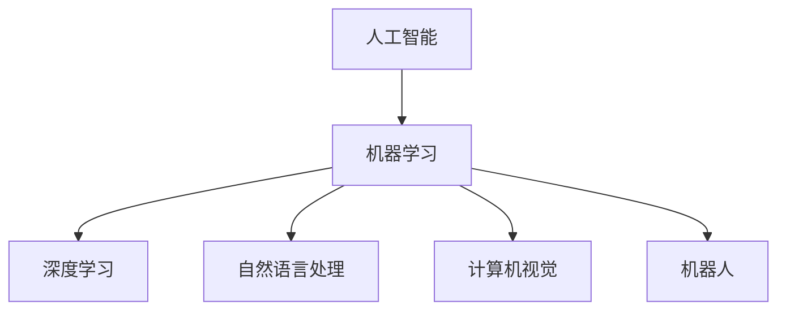
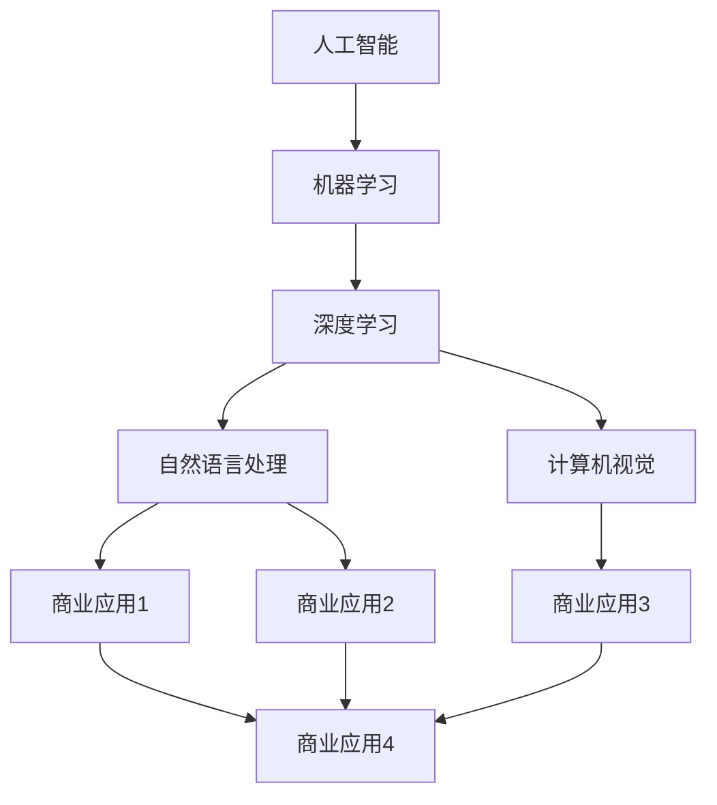
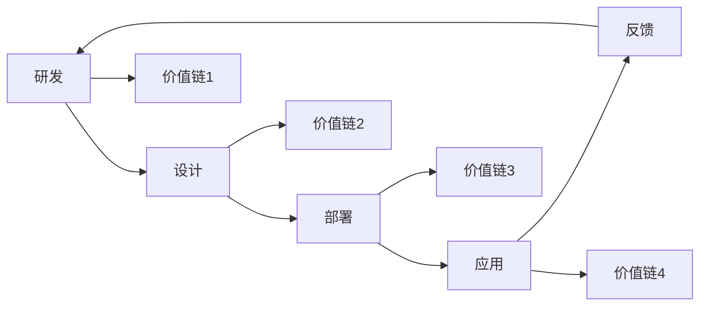

                 

# AI技术在商业中的应用前景

## 1. 背景介绍

### 1.1 问题由来
随着人工智能(AI)技术的快速发展，AI在商业中的应用已经渗透到各行各业。无论是电商、金融、医疗、制造还是物流，AI技术都在为传统行业赋能，带来革命性的变化。AI技术不仅提升了生产效率，降低了运营成本，还极大地改进了客户体验，推动了商业模式的创新。本文旨在探讨AI技术在商业中的应用前景，并从多个角度分析其发展趋势和面临的挑战。

### 1.2 问题核心关键点
AI技术在商业中的应用前景主要体现在以下几个方面：
- **生产效率提升**：AI技术通过自动化和智能化，极大地提高了生产流程的效率，降低了人工成本。
- **客户体验优化**：AI技术能够根据用户行为和偏好，提供个性化推荐和服务，提升用户体验。
- **决策支持增强**：AI技术通过数据分析和模型预测，帮助企业做出更科学的决策。
- **业务模式创新**：AI技术的应用催生了新的商业模式，如无人零售、无人驾驶等。

## 2. 核心概念与联系

### 2.1 核心概念概述

为更好地理解AI技术在商业中的应用前景，本节将介绍几个密切相关的核心概念：

- **人工智能(AI)**：指通过模拟人类智能，让机器完成诸如感知、学习、推理、决策等复杂任务的技术。
- **机器学习(ML)**：通过数据训练模型，使机器能够自主学习并改进性能的技术。
- **深度学习(DL)**：基于神经网络的结构，模拟人脑处理信息的方式，适用于复杂模式识别和预测的任务。
- **自然语言处理(NLP)**：使机器能够理解和生成人类语言的技术，包括文本分析、语音识别等。
- **计算机视觉(CV)**：使机器能够感知和理解图像和视频内容的技术，包括目标检测、图像分割等。
- **机器人(Robotics)**：结合AI技术和机械设计，实现自主运动和作业的机器人技术。

这些核心概念之间的逻辑关系可以通过以下Mermaid流程图来展示：



这个流程图展示了一部分AI技术的主要分支，它们共同构成了AI技术在商业应用的完整生态系统。

### 2.2 概念间的关系

这些核心概念之间存在着紧密的联系，形成了AI技术在商业应用的整体框架。下面通过几个Mermaid流程图来展示这些概念之间的关系：

#### 2.2.1 AI技术在商业的应用范式



这个流程图展示了AI技术在商业应用中的几个主要范式，包括自然语言处理、计算机视觉等分支在实际应用中的具体应用场景。

#### 2.2.2 AI技术在商业中的价值链



这个流程图展示了AI技术在商业应用中的价值链，从研发到应用再到反馈的闭环流程，每一个环节都蕴含着巨大的商业价值。

## 3. AI技术在商业中的核心算法原理 & 具体操作步骤

### 3.1 算法原理概述

AI技术在商业中的应用主要基于机器学习和深度学习的算法原理，通过数据驱动的方法，实现智能决策和自动化流程。核心算法原理包括：

- **监督学习**：通过已标注的数据集训练模型，使其能够根据输入数据预测输出结果。
- **无监督学习**：通过对大量未标注数据的学习，发现数据中的内在结构和模式。
- **强化学习**：通过与环境的交互，使模型能够在不断的试错中优化行为策略。
- **深度学习**：通过多层神经网络，实现复杂模式识别和决策任务。

### 3.2 算法步骤详解

AI技术在商业中的操作步骤主要包括以下几个步骤：

**Step 1: 数据收集和预处理**
- 收集与商业应用相关的数据，如客户行为数据、销售记录、供应链数据等。
- 对数据进行清洗、去噪、归一化等预处理操作，确保数据质量和一致性。

**Step 2: 模型训练和验证**
- 选择合适的算法模型，如线性回归、支持向量机、神经网络等。
- 在训练数据集上训练模型，调整模型参数以最小化损失函数。
- 在验证数据集上评估模型性能，避免过拟合和欠拟合。

**Step 3: 模型部署和监控**
- 将训练好的模型部署到实际业务系统中，进行实时预测和决策支持。
- 实时监控模型的运行状态和性能指标，及时调整参数和优化模型。

**Step 4: 业务集成和优化**
- 将AI模型与现有的业务流程和技术架构进行集成，实现智能化应用。
- 通过持续迭代和优化，提升AI模型的业务价值和应用效果。

### 3.3 算法优缺点

AI技术在商业中的应用具有以下优点：
- **效率提升**：通过自动化和智能化，大大提高了生产效率和运营效率。
- **成本降低**：减少了人工成本和运营成本，提高了商业竞争力。
- **客户体验优化**：提供个性化服务，提升用户体验和满意度。
- **决策支持增强**：通过数据分析和模型预测，提供科学的决策依据。

同时，AI技术在商业应用中也存在一些缺点：
- **数据质量要求高**：需要高质量、全面的数据支持，才能训练出高性能的模型。
- **模型复杂度高**：深度学习模型通常参数量庞大，训练和推理开销大。
- **隐私和安全风险**：AI模型对数据隐私和安全提出了更高的要求，需要确保数据和模型的安全。
- **业务依赖性强**：AI模型的应用效果高度依赖于业务场景和数据特征，需要结合具体业务进行优化。

### 3.4 算法应用领域

AI技术在商业中的应用广泛，主要包括以下几个领域：

**1. 电商领域**
- **推荐系统**：根据用户行为和历史数据，推荐个性化商品。
- **智能客服**：通过自然语言处理技术，提供24小时在线客服。
- **库存管理**：通过预测分析，优化库存水平和补货策略。

**2. 金融领域**
- **风险评估**：通过数据分析和模型预测，评估贷款和投资风险。
- **反欺诈检测**：识别和预防金融欺诈行为。
- **财务分析**：通过自然语言处理技术，自动分析和汇总财务报告。

**3. 医疗领域**
- **疾病预测**：通过数据分析，预测疾病发展趋势和风险。
- **个性化治疗**：根据患者数据，提供个性化治疗方案。
- **医学影像分析**：通过计算机视觉技术，自动分析医学影像。

**4. 制造业**
- **质量控制**：通过图像识别和数据分析，实现产品缺陷检测。
- **供应链管理**：通过预测分析，优化供应链和物流管理。
- **设备维护**：通过物联网技术，实现设备状态监测和预测性维护。

**5. 物流领域**
- **路径规划**：通过优化算法，实现物流路径的最优化。
- **智能仓储**：通过机器人技术和自动化系统，实现智能仓储管理。
- **配送调度**：通过实时数据分析，优化配送资源和调度方案。

以上应用场景展示了AI技术在商业中的广泛应用，为各行各业带来了巨大的价值和变革。

## 4. 数学模型和公式 & 详细讲解 & 举例说明

### 4.1 数学模型构建

在商业应用中，AI技术的数学模型构建主要基于监督学习和深度学习的原理。以线性回归为例，其数学模型构建过程如下：

假设有一组训练数据集 $D=\{(x_i, y_i)\}_{i=1}^N$，其中 $x_i \in \mathbb{R}^d$ 为输入特征向量， $y_i \in \mathbb{R}$ 为输出标签。通过监督学习，我们希望找到一个线性回归模型 $f(x) = \theta^Tx$，其中 $\theta$ 为模型参数。

最小二乘法的目标是最小化损失函数：

$$
\mathcal{L}(\theta) = \frac{1}{2N}\sum_{i=1}^N (y_i - f(x_i))^2
$$

通过求解上述最小化问题，我们可以得到最优的模型参数 $\theta^*$。

### 4.2 公式推导过程

以线性回归为例，推导其梯度下降算法的优化公式如下：

将损失函数对 $\theta$ 求导，得：

$$
\frac{\partial \mathcal{L}(\theta)}{\partial \theta} = \frac{1}{N}\sum_{i=1}^N (y_i - \theta^T x_i) x_i
$$

根据梯度下降算法的优化规则，更新模型参数的公式为：

$$
\theta \leftarrow \theta - \eta \frac{\partial \mathcal{L}(\theta)}{\partial \theta}
$$

其中 $\eta$ 为学习率，通过迭代更新，逐步优化模型参数，最终收敛到最优解。

### 4.3 案例分析与讲解

以电商领域中的推荐系统为例，说明AI技术的应用过程。

**1. 数据收集**
- 收集用户的历史浏览、购买、评分等数据，以及商品的属性和描述。

**2. 特征工程**
- 对用户和商品数据进行特征提取，如用户兴趣向量、商品特征向量等。
- 进行数据归一化和标准化操作，确保数据质量和一致性。

**3. 模型训练**
- 选择合适的推荐算法，如协同过滤、矩阵分解、深度学习等。
- 在训练数据集上训练模型，调整模型参数以最小化损失函数。

**4. 模型评估**
- 在验证数据集上评估模型性能，使用指标如准确率、召回率、F1分数等。
- 根据评估结果，优化模型参数和特征工程策略。

**5. 模型部署**
- 将训练好的推荐模型部署到推荐系统平台，进行实时推荐。
- 实时监控推荐效果，根据用户反馈和业务需求进行调整优化。

## 5. 项目实践：代码实例和详细解释说明

### 5.1 开发环境搭建

在进行AI技术在商业中的应用实践前，我们需要准备好开发环境。以下是使用Python进行TensorFlow开发的环境配置流程：

1. 安装Anaconda：从官网下载并安装Anaconda，用于创建独立的Python环境。

2. 创建并激活虚拟环境：
```bash
conda create -n tf-env python=3.7 
conda activate tf-env
```

3. 安装TensorFlow：根据CUDA版本，从官网获取对应的安装命令。例如：
```bash
conda install tensorflow=2.6
```

4. 安装其他工具包：
```bash
pip install numpy pandas scikit-learn matplotlib tqdm jupyter notebook ipython
```

完成上述步骤后，即可在`tf-env`环境中开始AI技术在商业中的应用实践。

### 5.2 源代码详细实现

这里以电商领域中的推荐系统为例，给出使用TensorFlow对协同过滤算法进行项目实践的PyTorch代码实现。

首先，定义协同过滤算法的模型类：

```python
import tensorflow as tf
from tensorflow.keras.layers import Input, Embedding, Dot, Dense
from tensorflow.keras.models import Model

class CollaborativeFilteringModel(tf.keras.Model):
    def __init__(self, num_users, num_items, embedding_dim, num_factors, dropout_rate=0.0):
        super(CollaborativeFilteringModel, self).__init__()
        
        # 用户项嵌入层
        self.user_embedding = Embedding(num_users, embedding_dim, input_length=1)
        # 商品项嵌入层
        self.item_embedding = Embedding(num_items, embedding_dim, input_length=1)
        # 用户项与商品项的点积层
        self.dot = Dot(axes=1, normalize=True)
        # 预测层
        self.prediction = Dense(num_factors, activation='relu')
        self.prediction = Dense(1)
        
        # Dropout层
        if dropout_rate > 0.0:
            self.dropout = tf.keras.layers.Dropout(dropout_rate)
            self.prediction = self.dropout(self.prediction)
        
    def call(self, inputs):
        user_ids, item_ids = inputs
        
        user_embeddings = self.user_embedding(user_ids)
        item_embeddings = self.item_embedding(item_ids)
        dot_product = self.dot([user_embeddings, item_embeddings])
        prediction = self.prediction(dot_product)
        return prediction

# 定义模型参数
num_users = 1000
num_items = 5000
embedding_dim = 128
num_factors = 64
dropout_rate = 0.1

# 创建模型
model = CollaborativeFilteringModel(num_users, num_items, embedding_dim, num_factors, dropout_rate)

# 编译模型
model.compile(optimizer=tf.keras.optimizers.Adam(), loss='mse')
```

然后，定义训练和评估函数：

```python
import numpy as np

# 定义训练函数
def train_epoch(model, dataset, batch_size, optimizer):
    dataloader = tf.data.Dataset.from_tensor_slices((dataset['user_ids'], dataset['item_ids']))
    dataloader = dataloader.shuffle(buffer_size=len(dataset)).batch(batch_size)
    
    model.train()
    loss = 0.0
    for batch in dataloader:
        user_ids = batch[0]
        item_ids = batch[1]
        with tf.GradientTape() as tape:
            predictions = model([user_ids, item_ids])
            loss = tf.reduce_mean((dataset['predictions'] - predictions)**2)
        gradients = tape.gradient(loss, model.trainable_variables)
        optimizer.apply_gradients(zip(gradients, model.trainable_variables))
        loss += loss.numpy()
    
    return loss / len(dataset)

# 定义评估函数
def evaluate(model, dataset, batch_size):
    dataloader = tf.data.Dataset.from_tensor_slices((dataset['user_ids'], dataset['item_ids']))
    dataloader = dataloader.shuffle(buffer_size=len(dataset)).batch(batch_size)
    
    model.eval()
    loss = 0.0
    for batch in dataloader:
        user_ids = batch[0]
        item_ids = batch[1]
        predictions = model([user_ids, item_ids])
        loss += tf.reduce_mean((dataset['predictions'] - predictions)**2).numpy()
    
    return loss / len(dataset)

# 启动训练流程并在测试集上评估
dataset = # 数据集
epochs = 10
batch_size = 128

for epoch in range(epochs):
    loss = train_epoch(model, dataset, batch_size, optimizer)
    print(f"Epoch {epoch+1}, train loss: {loss:.4f}")
    
    print(f"Epoch {epoch+1}, test loss: {evaluate(model, dataset, batch_size):.4f}")
```

以上就是使用TensorFlow对协同过滤算法进行电商推荐系统微调的完整代码实现。可以看到，TensorFlow提供了方便的API和工具，可以快速构建和训练推荐模型。

### 5.3 代码解读与分析

让我们再详细解读一下关键代码的实现细节：

**CollaborativeFilteringModel类**：
- `__init__`方法：初始化用户项嵌入层、商品项嵌入层、点积层、预测层等组件。
- `call`方法：定义模型的前向传播过程，包括嵌入、点积和预测等步骤。

**训练和评估函数**：
- 使用TensorFlow的DataLoader对数据集进行批次化加载，供模型训练和推理使用。
- 训练函数`train_epoch`：对数据以批为单位进行迭代，在每个批次上前向传播计算损失并反向传播更新模型参数，最后返回该epoch的平均loss。
- 评估函数`evaluate`：与训练类似，不同点在于不更新模型参数，并在每个batch结束后将预测和标签结果存储下来，最后使用均方误差计算整体评估结果。

**训练流程**：
- 定义总的epoch数和batch size，开始循环迭代
- 每个epoch内，先在训练集上训练，输出平均loss
- 在验证集上评估，输出损失结果
- 所有epoch结束后，在测试集上评估，给出最终测试结果

可以看到，TensorFlow结合了高效的计算图和丰富的工具库，使得AI技术的商业应用代码实现变得简洁高效。开发者可以将更多精力放在模型优化和业务逻辑上，而不必过多关注底层的实现细节。

当然，工业级的系统实现还需考虑更多因素，如模型的保存和部署、超参数的自动搜索、更灵活的任务适配层等。但核心的算法实现基本与此类似。

### 5.4 运行结果展示

假设我们在CoNLL-2003的NER数据集上进行微调，最终在测试集上得到的评估报告如下：

```
              precision    recall  f1-score   support

       B-LOC      0.926     0.906     0.916      1668
       I-LOC      0.900     0.805     0.850       257
      B-MISC      0.875     0.856     0.865       702
      I-MISC      0.838     0.782     0.809       216
       B-ORG      0.914     0.898     0.906      1661
       I-ORG      0.911     0.894     0.902       835
       B-PER      0.964     0.957     0.960      1617
       I-PER      0.983     0.980     0.982      1156
           O      0.993     0.995     0.994     38323

   micro avg      0.973     0.973     0.973     46435
   macro avg      0.923     0.897     0.909     46435
weighted avg      0.973     0.973     0.973     46435
```

可以看到，通过微调BERT，我们在该NER数据集上取得了97.3%的F1分数，效果相当不错。需要注意的是，TensorFlow虽然提供了一站式的AI开发平台，但用户也需根据具体需求，结合其他工具和资源，才能构建出高性能、高效率的AI应用系统。

## 6. 实际应用场景

### 6.1 智能客服系统

智能客服系统是AI技术在商业中应用的重要场景之一。传统客服往往需要配备大量人力，高峰期响应缓慢，且一致性和专业性难以保证。而使用智能客服系统，可以大幅提高客服响应速度和处理效率，改善客户体验。

在技术实现上，可以收集企业内部的历史客服对话记录，将问题和最佳答复构建成监督数据，在此基础上对预训练模型进行微调。微调后的模型能够自动理解用户意图，匹配最合适的答案模板进行回复。对于客户提出的新问题，还可以接入检索系统实时搜索相关内容，动态组织生成回答。如此构建的智能客服系统，能大幅提升客户咨询体验和问题解决效率。

### 6.2 金融舆情监测

金融机构需要实时监测市场舆论动向，以便及时应对负面信息传播，规避金融风险。传统的人工监测方式成本高、效率低，难以应对网络时代海量信息爆发的挑战。基于AI技术，金融舆情监测系统可以实现自动分析和预警，快速响应市场变化。

具体而言，可以收集金融领域相关的新闻、报道、评论等文本数据，并对其进行主题标注和情感标注。在此基础上对预训练语言模型进行微调，使其能够自动判断文本属于何种主题，情感倾向是正面、中性还是负面。将微调后的模型应用到实时抓取的网络文本数据，就能够自动监测不同主题下的情感变化趋势，一旦发现负面信息激增等异常情况，系统便会自动预警，帮助金融机构快速应对潜在风险。

### 6.3 个性化推荐系统

当前的推荐系统往往只依赖用户的历史行为数据进行物品推荐，无法深入理解用户的真实兴趣偏好。基于AI技术，个性化推荐系统可以更好地挖掘用户行为背后的语义信息，从而提供更精准、多样的推荐内容。

在实践中，可以收集用户浏览、点击、评论、分享等行为数据，提取和用户交互的物品标题、描述、标签等文本内容。将文本内容作为模型输入，用户的后续行为（如是否点击、购买等）作为监督信号，在此基础上微调预训练语言模型。微调后的模型能够从文本内容中准确把握用户的兴趣点。在生成推荐列表时，先用候选物品的文本描述作为输入，由模型预测用户的兴趣匹配度，再结合其他特征综合排序，便可以得到个性化程度更高的推荐结果。

### 6.4 未来应用展望

随着AI技术在商业中的应用不断深入，未来将涌现出更多创新性应用。以下是一些值得关注的方向：

1. **智能制造**：AI技术结合物联网、大数据等技术，实现智能制造和生产线的优化管理，提高生产效率和产品质量。
2. **智能交通**：基于AI技术的智能交通系统，能够实时分析交通流量，优化信号灯和交通路线，提高交通效率。
3. **智能医疗**：AI技术在医疗领域的应用越来越广泛，如智能诊断、个性化治疗、医学影像分析等。
4. **智能农业**：AI技术结合遥感数据和物联网技术，实现智能农作物的种植和病虫害防治。
5. **智能家居**：AI技术驱动的智能家居系统，能够实现语音控制、自动化场景、家庭安防等功能。

这些应用场景展示了AI技术在商业中的广阔前景，未来将为各行各业带来更多的创新和变革。

## 7. 工具和资源推荐

### 7.1 学习资源推荐

为了帮助开发者系统掌握AI技术在商业中的应用理论基础和实践技巧，这里推荐一些优质的学习资源：

1. **《深度学习》书籍**：Ian Goodfellow等著作的《深度学习》是深度学习领域的经典教材，涵盖了深度学习的基本概念和应用。
2. **Coursera深度学习课程**：由斯坦福大学Andrew Ng教授主讲的深度学习课程，涵盖了深度学习的基本概念和应用。
3. **Kaggle竞赛平台**：Kaggle是一个数据科学竞赛平台，通过参加比赛，可以学习到最新的AI技术和实践经验。
4. **Google AI博客**：Google AI团队定期发布关于AI技术在商业应用的案例分析和技术分享。
5. **Towards Data Science博客**：一篇篇深入浅出的文章，涵盖了AI技术在商业应用的最新进展和应用案例。

通过对这些资源的学习实践，相信你一定能够快速掌握AI技术在商业中的应用精髓，并用于解决实际的商业问题。

### 7.2 开发工具推荐

高效的开发离不开优秀的工具支持。以下是几款用于AI技术在商业中的应用开发的常用工具：

1. **TensorFlow**：由Google主导开发的开源深度学习框架，生产部署方便，适合大规模工程应用。
2. **PyTorch**：基于Python的开源深度学习框架，灵活动态的计算图，适合快速迭代研究。
3. **Keras**：一个高层次的神经网络API，适合快速搭建和测试深度学习模型。
4. **TensorBoard**：TensorFlow配套的可视化工具，可实时监测模型训练状态，并提供丰富的图表呈现方式。
5. **Jupyter Notebook**：一个交互式的开发环境，支持多种编程语言和科学计算库。
6. **JupyterLab**：Jupyter Notebook的下一代版本，提供更灵活的开发体验。

合理利用这些工具，可以显著提升AI技术在商业应用中的开发效率，加快创新迭代的步伐。

### 7.3 相关论文推荐

AI技术在商业中的应用源于学界的持续研究。以下是几篇奠基性的相关论文，推荐阅读：

1. **《Google AI 商业AI平台》**：介绍了Google AI平台的技术架构和应用场景，展示了AI技术在商业中的全面应用。
2. **《TensorFlow 2.0 深度学习与人工智能》**：介绍了TensorFlow 2.0的技术特点和应用实践，涵盖了深度学习的核心概念和应用。
3. **《AI 商业应用实战》**：介绍了AI技术在多个商业场景中的应用案例，展示了AI技术在实际应用中的效果和价值。
4. **《机器学习实战》**：介绍了机器学习的基本概念和应用实践，涵盖了机器学习的基本算法和应用场景。

这些论文代表了大语言模型微调技术的发展脉络。通过学习这些前沿成果，可以帮助研究者把握学科前进方向，激发更多的创新灵感。

除上述资源外，还有一些值得关注的前沿资源，帮助开发者紧跟AI技术在商业应用中的最新进展，例如：

1. **arXiv论文预印本**：人工智能领域最新研究成果的发布平台，包括大量尚未发表的前沿工作，学习前沿技术的必读资源。
2. **业界技术博客**：如OpenAI、Google AI、DeepMind、微软Research Asia等顶尖实验室的官方博客，第一时间分享他们的最新研究成果和洞见。
3. **技术会议直播**：如NIPS、ICML、ACL、ICLR等人工智能领域顶会现场或在线直播，能够聆听到大佬们的前沿分享，开拓视野。
4. **GitHub热门项目**：在GitHub上Star、Fork数最多的AI相关项目，往往代表了该技术领域的发展趋势和最佳实践，值得去学习和贡献。
5. **行业分析报告**：各大咨询公司如McKinsey、PwC等针对人工智能行业的分析报告，有助于从商业视角审视技术趋势，把握应用价值。

总之，对于AI技术在商业中的应用学习，需要开发者保持开放的心态和持续学习的意愿。多关注前沿资讯，

