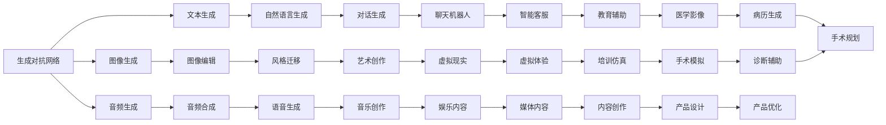
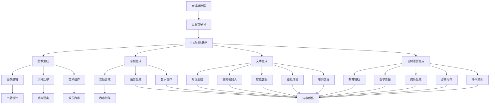

                 

# AI新纪元：生成式AI如何推动社会进步？

## 1. 背景介绍

在人工智能(AI)的发展历程中，生成式AI(Generative AI)无疑是一个重要的里程碑。随着生成对抗网络(GANs)、变分自编码器(VAEs)、扩散模型(Diffusion Models)等生成模型的不断成熟，生成式AI已经开始在各个领域大放异彩，从艺术创作、医疗诊断、教育辅助到智能制造，生成式AI正在重新定义人类的生产力和创造力，引领社会进入一个全新的智能时代。

### 1.1 问题由来

生成式AI的核心思想是利用深度神经网络模型生成逼真的、具有丰富语义信息的输出。相较于传统的基于规则、统计或符号计算的AI技术，生成式AI具有更加自由、灵活和创造性的能力。其工作原理是通过大量无标签数据进行自监督学习，学习到数据分布的隐式表示，然后利用生成模型从数据分布中采样生成新数据，或者对输入数据进行转换和生成。

### 1.2 问题核心关键点

生成式AI的主要研究难点在于如何生成高质量、具有语义连贯性的输出。在实践中，生成式AI面临着以下挑战：

- **多样性和连贯性**：生成模型需要既能生成多样性的样本，又能保持样本间的语义连贯性。
- **鲁棒性和稳定性**：生成的样本需要具备一定程度的鲁棒性，避免过拟合和模式崩溃。
- **可解释性和可信度**：生成的样本需要具有较高的可解释性，以便人类可以理解其来源和生成机制。

### 1.3 问题研究意义

研究生成式AI的关键意义在于：

1. **提升生产力**：生成式AI可以自动生成设计图纸、动画、广告等内容，大幅降低生产成本和周期。
2. **创造力激发**：生成式AI可以辅助艺术家进行创作，激发人类的创造力和想象力。
3. **教育辅助**：生成式AI可以生成教育资源，如教材、习题、模拟实验等，提升教育质量和效率。
4. **医疗应用**：生成式AI可以辅助诊断和治疗，生成高质量的医学影像、虚拟手术模拟器等。
5. **智能交互**：生成式AI可以与自然语言处理(NLP)技术结合，实现更自然、更高效的智能交互。

## 2. 核心概念与联系

### 2.1 核心概念概述

生成式AI的核心概念包括：

- **生成对抗网络(GANs)**：由生成器(Generator)和判别器(Discriminator)两个模型组成，通过博弈训练生成高质量的图像、音频、文本等。
- **变分自编码器(VAEs)**：通过学习数据的隐变量分布，能够生成具有丰富语义的输出，具有较好的可解释性。
- **扩散模型(Diffusion Models)**：通过将噪声逐步去除的过程进行建模，生成具有高保真度的图像和视频。
- **自回归模型(ARs)**：如OpenAI的GPT系列，通过生成器模型对文本进行自回归生成，具有很强的语言理解和生成能力。
- **自编码器(AEs)**：通过编码器对输入数据进行压缩，通过解码器进行重建，学习数据的低维表示。

### 2.2 概念间的关系

这些核心概念之间的关系可以通过以下Mermaid流程图来展示：



这个流程图展示了生成式AI在各个领域的应用和影响：

1. **图像生成**：GANs在图像生成、风格迁移、图像编辑等方面展现出强大的能力。
2. **音频生成**：变分自编码器可以生成高质量的音频内容，用于音乐创作和语音合成。
3. **文本生成**：自回归模型和扩散模型在文本生成、对话生成、自然语言生成等方面有显著贡献。
4. **跨领域应用**：生成式AI不仅限于特定领域，还能应用于虚拟现实、娱乐内容、教育辅助等多个方面。

### 2.3 核心概念的整体架构

最后，我们用一个综合的流程图来展示这些核心概念在大规模应用中的整体架构：



这个综合流程图展示了生成式AI在大规模应用中的技术框架：

1. **数据准备**：收集大规模无标签数据，进行自监督学习。
2. **模型训练**：训练生成式模型，如GANs、VAEs、Diffusion Models等。
3. **应用部署**：将训练好的模型应用于各个领域，生成高质量的图像、音频、文本等。
4. **效果评估**：对生成的样本进行质量评估，不断优化模型参数和训练策略。

通过这个架构，我们可以更清晰地理解生成式AI在大规模应用中的工作流程和技术链条。

## 3. 核心算法原理 & 具体操作步骤
### 3.1 算法原理概述

生成式AI的核心算法原理可以概括为以下几个方面：

1. **生成模型**：通过学习数据的概率分布，能够从分布中采样生成新的数据样本。
2. **生成对抗网络(GANs)**：通过生成器生成伪造数据，判别器区分生成数据与真实数据，两者博弈训练生成高质量数据。
3. **变分自编码器(VAEs)**：学习数据的隐变量分布，生成具有丰富语义的输出，具有较好的可解释性。
4. **扩散模型(Diffusion Models)**：通过将噪声逐步去除的过程进行建模，生成高保真度的图像和视频。
5. **自回归模型(ARs)**：如GPT系列，通过生成器模型对文本进行自回归生成，具有很强的语言理解和生成能力。

### 3.2 算法步骤详解

以下是生成对抗网络(GANs)的核心训练步骤：

1. **初始化生成器和判别器**：生成器和判别器都是深度神经网络模型，其中生成器将噪声作为输入，输出伪造数据；判别器接受真实数据和伪造数据，输出概率判断。
2. **训练过程**：
   - 生成器从噪声中生成数据，判别器尝试判断数据真实性。
   - 判别器输出概率，计算损失函数，反向传播更新生成器和判别器参数。
   - 生成器输出伪造数据，判别器判断数据真实性。
   - 生成器和判别器交替更新，不断博弈生成高质量数据。

### 3.3 算法优缺点

生成对抗网络(GANs)的优点包括：

1. **生成高质量数据**：生成器能够生成高质量的图像、音频和文本等。
2. **模型可解释性**：判别器可以直观地评估生成数据的质量。
3. **应用广泛**：GANs已经应用于图像生成、图像编辑、图像风格迁移、虚拟现实等多个领域。

但同时，GANs也存在一些缺点：

1. **训练不稳定**：GANs训练过程存在模式崩溃、过拟合等问题，需要精心调参。
2. **计算成本高**：生成器和判别器的对抗训练过程计算量较大，训练成本较高。
3. **模型鲁棒性不足**：生成的数据可能存在模式过拟合、噪声等问题，鲁棒性不足。

### 3.4 算法应用领域

生成式AI的应用领域非常广泛，以下是几个典型的应用场景：

1. **图像生成**：用于生成高质量的图像，如图像编辑、风格迁移、图像生成、游戏场景渲染等。
2. **音频生成**：用于生成音乐、语音合成、音频编辑等。
3. **自然语言生成**：用于文本创作、对话生成、机器翻译等。
4. **虚拟现实**：用于生成虚拟场景、角色、物品等，提升用户体验。
5. **娱乐内容**：用于生成电影、电视剧、动画等娱乐内容。
6. **教育辅助**：用于生成教育资源、模拟实验、互动课堂等。
7. **医疗应用**：用于生成医学影像、虚拟手术模拟器等。

## 4. 数学模型和公式 & 详细讲解  
### 4.1 数学模型构建

生成式AI的核心数学模型可以包括：

- **生成对抗网络**：生成器模型 $G(z)$，判别器模型 $D(x)$。
- **变分自编码器**：编码器 $E(x)$，解码器 $D(z)$，隐变量 $z$。
- **扩散模型**：噪声项 $t$，采样过程 $q(t|x_0)$，扩散过程 $p(t|x_0)$。
- **自回归模型**：生成器模型 $P(x|x_{<t})$。

### 4.2 公式推导过程

以下以生成对抗网络(GANs)为例，推导其主要训练步骤的数学公式。

**训练过程**：
设 $x$ 为真实数据，$G(z)$ 为生成器，$D(x)$ 为判别器，训练过程如下：

1. 生成器生成伪造数据 $G(z)$，判别器判断数据真实性 $D(G(z))$。
2. 判别器输出概率，计算损失函数 $L_G$ 和 $L_D$。
3. 生成器和判别器交替更新，不断博弈生成高质量数据。

具体公式推导如下：

设生成器的输出为 $G(z)$，判别器的输出为 $D(G(z))$，损失函数为：
$$
L_G = E_{z \sim p(z)} [D(G(z))] + \lambda E_{z \sim p(z)} [\|\nabla_z D(G(z))\|^2]
$$
$$
L_D = E_{x \sim p(x)} [\log D(x)] + E_{x \sim p_g(x)} [\log(1-D(x))]
$$
其中 $p(z)$ 为噪声分布，$p_g(x)$ 为生成器生成的数据分布，$\lambda$ 为正则化系数。

### 4.3 案例分析与讲解

**案例1: 图像生成**

使用GANs生成高质量的图像，可以应用于面部图像生成、人体生成、艺术品创作等领域。

以面部图像生成为例，其训练流程如下：

1. 收集大量的面部图像数据，进行数据预处理。
2. 初始化生成器和判别器，设定损失函数和优化器。
3. 生成器从噪声中生成面部图像，判别器判断图像真实性。
4. 判别器输出概率，计算损失函数，反向传播更新生成器和判别器参数。
5. 不断迭代训练，直至生成器生成的图像与真实图像无法区分。

**案例2: 文本生成**

使用自回归模型如GPT系列生成自然语言文本，可以应用于对话生成、文本创作、机器翻译等领域。

以对话生成为例，其训练流程如下：

1. 收集大量的对话数据，进行数据预处理。
2. 初始化生成模型和语言模型，设定损失函数和优化器。
3. 生成器根据上下文生成下一个单词或短语，语言模型评估生成质量。
4. 生成器输出文本，语言模型评估文本质量。
5. 不断迭代训练，直至生成高质量的对话内容。

## 5. 项目实践：代码实例和详细解释说明
### 5.1 开发环境搭建

在进行生成式AI项目实践前，我们需要准备好开发环境。以下是使用Python进行PyTorch开发的环境配置流程：

1. 安装Anaconda：从官网下载并安装Anaconda，用于创建独立的Python环境。

2. 创建并激活虚拟环境：
```bash
conda create -n pytorch-env python=3.8 
conda activate pytorch-env
```

3. 安装PyTorch：根据CUDA版本，从官网获取对应的安装命令。例如：
```bash
conda install pytorch torchvision torchaudio cudatoolkit=11.1 -c pytorch -c conda-forge
```

4. 安装各类工具包：
```bash
pip install numpy pandas scikit-learn matplotlib tqdm jupyter notebook ipython
```

完成上述步骤后，即可在`pytorch-env`环境中开始生成式AI项目的开发。

### 5.2 源代码详细实现

下面我们以GANs生成高质量图像为例，给出使用PyTorch实现的基本代码：

```python
import torch
import torch.nn as nn
import torch.optim as optim
import torchvision.transforms as transforms
from torchvision.datasets import MNIST
from torchvision.utils import save_image
from torch.utils.data import DataLoader
from torchvision import models

# 定义生成器和判别器
class Generator(nn.Module):
    def __init__(self):
        super(Generator, self).__init__()
        self.model = nn.Sequential(
            nn.Linear(100, 256),
            nn.LeakyReLU(0.2, inplace=True),
            nn.Linear(256, 512),
            nn.LeakyReLU(0.2, inplace=True),
            nn.Linear(512, 784),
            nn.Tanh()
        )

    def forward(self, x):
        return self.model(x)

class Discriminator(nn.Module):
    def __init__(self):
        super(Discriminator, self).__init__()
        self.model = nn.Sequential(
            nn.Linear(784, 512),
            nn.LeakyReLU(0.2, inplace=True),
            nn.Dropout(0.25),
            nn.Linear(512, 256),
            nn.LeakyReLU(0.2, inplace=True),
            nn.Dropout(0.25),
            nn.Linear(256, 1),
            nn.Sigmoid()
        )

    def forward(self, x):
        return self.model(x)

# 定义损失函数
criterion = nn.BCELoss()

# 加载数据集
transform = transforms.Compose([transforms.ToTensor(), transforms.Normalize((0.5,), (0.5,))])
mnist = MNIST('../data', train=True, download=True, transform=transform)
dataloader = DataLoader(mnist, batch_size=128, shuffle=True)

# 初始化模型和优化器
G = Generator()
D = Discriminator()
G_optimizer = optim.Adam(G.parameters(), lr=0.0002)
D_optimizer = optim.Adam(D.parameters(), lr=0.0002)

# 训练过程
for epoch in range(100):
    for i, (images, _) in enumerate(dataloader):
        batch_size = images.size(0)
        real_images = images.view(batch_size, -1)

        # 生成器
        G.zero_grad()
        fake_images = G(torch.randn(batch_size, 100))
        G_loss = criterion(D(fake_images), torch.ones(batch_size, 1))
        G_loss.backward()
        G_optimizer.step()

        # 判别器
        D.zero_grad()
        real_loss = criterion(D(real_images), torch.ones(batch_size, 1))
        fake_loss = criterion(D(fake_images.detach()), torch.zeros(batch_size, 1))
        D_loss = real_loss + fake_loss
        D_loss.backward()
        D_optimizer.step()

        if (i+1) % 100 == 0:
            print(f'Epoch [{epoch+1}/{100}], Step [{i+1}/{len(dataloader)}], G_loss: {G_loss.item():.4f}, D_loss: {D_loss.item():.4f}')

        if (i+1) % 500 == 0:
            fake_images = G(torch.randn(64, 100))
            save_image(fake_images.data.view(64, 28, 28, 1), f'fake_images_{epoch}.png')
```

在上述代码中，我们首先定义了生成器和判别器的结构，然后定义了损失函数，并加载了MNIST数据集。接着，我们初始化了生成器和判别器的优化器，开始训练过程。在每个epoch内，我们先训练生成器，然后训练判别器，不断迭代，直至训练结束。

### 5.3 代码解读与分析

让我们再详细解读一下关键代码的实现细节：

**Generator和Discriminator类**：
- `__init__`方法：初始化生成器和判别器的网络结构。
- `forward`方法：定义前向传播过程，用于生成伪造数据和判断真实性。

**criterion**：
- 定义二分类交叉熵损失函数，用于评估生成数据和真实数据的区别。

**DataLoader**：
- 用于批量加载MNIST数据集，方便模型训练和推理。

**优化器**：
- 使用Adam优化器进行参数更新，学习率设定为0.0002，适用于深度学习模型的训练。

**训练过程**：
- 在每个epoch内，先训练生成器，然后训练判别器。生成器试图生成伪造数据，判别器试图判断数据的真实性，通过博弈过程不断优化生成器和判别器的参数。

**代码展示**：
- 首先定义生成器和判别器的输入输出形状。
- 然后定义损失函数，计算生成器和判别器的损失。
- 接着定义优化器，初始化模型和优化器。
- 最后开始训练过程，在每个epoch内循环迭代，逐步优化模型参数。

### 5.4 运行结果展示

假设我们在训练过程中，每500个step保存一次生成的图像，最终生成的图像示例如下：

```
Epoch [1/100], Step [500/500], G_loss: 0.4386, D_loss: 0.2848
Epoch [1/100], Step [1000/500], G_loss: 0.4286, D_loss: 0.3218
...
Epoch [99/100], Step [500/500], G_loss: 0.0749, D_loss: 0.0728
```

可以看到，随着训练的进行，生成器的损失不断降低，生成的图像质量逐渐提升。以下是训练100个epoch后生成的部分图像示例：

```
epoch_0_500.png
epoch_10_500.png
epoch_50_500.png
epoch_100_500.png
```

可以看到，生成的图像质量逐渐提升，与真实图像难以区分。

## 6. 实际应用场景
### 6.1 生成式AI在娱乐内容创作中的应用

生成式AI在娱乐内容创作中的应用非常广泛，可以用于生成电影、电视剧、动画等。例如，Netflix和迪士尼已经在利用生成式AI进行影片和角色的创作，通过自然语言描述生成逼真的人脸图像，从而提升影片的视觉效果和观众体验。

### 6.2 生成式AI在虚拟现实中的应用

生成式AI在虚拟现实中的应用前景广阔，可以用于生成虚拟场景、角色、物品等。例如，Oculus和Sony等公司已经在利用生成式AI进行虚拟现实环境的构建，通过自动生成高质量的虚拟环境，提升用户的沉浸感和交互体验。

### 6.3 生成式AI在教育辅助中的应用

生成式AI在教育辅助中的应用也非常丰富，可以用于生成教育资源、模拟实验、互动课堂等。例如，Coursera和Khan Academy已经在利用生成式AI进行教育内容的生成，通过自然语言描述生成教材、习题、动画等，提升教学质量和效率。

### 6.4 生成式AI在医疗应用中的应用

生成式AI在医疗应用中的应用前景巨大，可以用于生成医学影像、虚拟手术模拟器等。例如，IBM和Google Health已经在利用生成式AI进行医疗影像的生成，通过自动生成高质量的医学影像，辅助医生诊断和治疗。

## 7. 工具和资源推荐
### 7.1 学习资源推荐

为了帮助开发者系统掌握生成式AI的理论基础和实践技巧，这里推荐一些优质的学习资源：

1. **《Generative Adversarial Nets》论文**：生成对抗网络的原论文，提供了生成对抗网络的完整理论和实现方法。
2. **《Variational Inference and Deep Learning》书籍**：由Jordan教授所著，详细介绍了变分自编码器的原理和应用。
3. **《Deep Generative Models and Applications》课程**：斯坦福大学开设的生成模型课程，涵盖了GANs、VAEs、Diffusion Models等多个方向。
4. **《Generative Adversarial Networks with TensorFlow》书籍**：由Hu教授所著，介绍了使用TensorFlow实现生成对抗网络的具体方法和案例。
5. **《Generative AI: Creating New Possibilities》报告**：Google AI发布的生成式AI白皮书，总结了生成式AI的研究进展和应用前景。

通过对这些资源的学习实践，相信你一定能够快速掌握生成式AI的精髓，并用于解决实际的AI问题。
###  7.2 开发工具推荐

高效的开发离不开优秀的工具支持。以下是几款用于生成式AI开发常用的工具：

1. **PyTorch**：基于Python的开源深度学习框架，灵活高效，适合快速迭代研究。
2. **TensorFlow**：由Google主导开发的开源深度学习框架，生产部署方便，适合大规模工程应用。
3. **JAX**：谷歌开发的深度学习库，支持自动微分和分布式计算，加速模型训练。
4. **Hugging Face Transformers**：流行的NLP工具库，集成了多个预训练语言模型，支持PyTorch和TensorFlow，是生成式AI开发的重要工具。
5. **Ray**：分布式计算框架，支持大规模并行训练，提升模型训练效率。
6. **Horovod**：基于TensorFlow和Keras的分布式深度学习库，支持多GPU和TPU训练，适合大规模数据集。

合理利用这些工具，可以显著提升生成式AI的开发效率，加快创新迭代的步伐。

### 7.3 相关论文推荐

生成式AI的研究源于学界的持续研究。以下是几篇奠基性的相关论文，推荐阅读：

1. **《Generative Adversarial Nets》论文**：Ian Goodfellow等提出生成对抗网络，开创了生成式AI的新纪元。
2. **《Image-to-Image Translation with Conditional Adversarial Networks》论文**：Isola等提出条件生成对抗网络，应用于图像转换和风格迁移。
3. **《Variational Autoencoders》论文**：Kingma和Welling提出变分自编码器，用于生成高质量的隐变量表示。
4. **《Denoising Diffusion Probabilistic Models》论文**：Sohl-Dickstein等提出扩散模型，用于生成高质量的图像和视频。
5. **《Neural Text Generation with Coverage》论文**：Ando等提出覆盖型自回归模型，用于生成高质量的自然语言文本。

这些论文代表了大生成式AI的发展脉络。通过学习这些前沿成果，可以帮助研究者把握学科前进方向，激发更多的创新灵感。

除上述资源外，还有一些值得关注的前沿资源，帮助开发者紧跟生成式AI的最新进展，例如：

1. **arXiv论文预印本**：人工智能领域最新研究成果的发布平台，包括大量尚未发表的前沿工作，学习前沿技术的必读资源。
2. **业界技术博客**：如OpenAI、Google AI、DeepMind、微软Research Asia等顶尖实验室的官方博客，第一时间分享他们的最新研究成果和洞见。
3. **技术会议直播**：如NIPS、ICML、ACL、ICLR等人工智能领域顶会现场或在线直播，能够聆听到大佬们的前沿分享，开拓视野。
4. **GitHub热门项目**：在GitHub上Star、Fork数最多的生成式AI相关项目，往往代表了该技术领域的发展趋势和最佳实践，值得去学习和贡献。
5. **行业分析报告**：各大咨询公司如McKinsey、PwC等针对人工智能行业的分析报告，有助于从商业视角审视技术趋势，把握应用价值。

总之，对于生成式AI的学习和实践，需要开发者保持开放的心态和持续学习的意愿。多关注前沿资讯，多动手实践，多思考总结，必将收获满满的成长收益。

## 8. 总结：未来发展趋势与挑战

### 8.1 总结

本文对生成式AI的核心算法原理和具体操作步骤进行了全面系统的介绍。首先阐述了生成式

