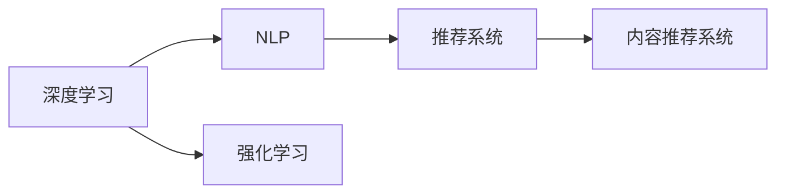
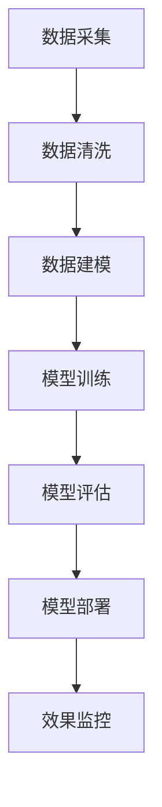
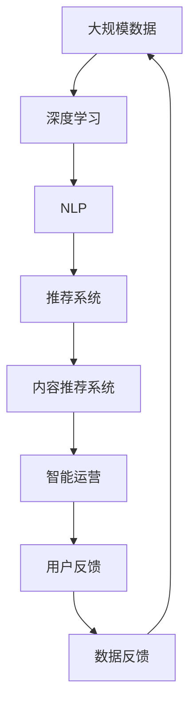

                 

# AI时代的出版业：数据驱动，场景创新

在数字化转型的浪潮下，传统出版业面临着严峻的挑战和重塑机会。人工智能技术为出版业提供了前所未有的机遇，带来了数据驱动、智能运营、个性化内容推荐等创新的可能性。本文将从数据驱动的角度，探讨AI时代出版业的创新场景和实现路径。

## 1. 背景介绍

### 1.1 问题由来

随着数字化技术的发展，出版业正经历着前所未有的变革。一方面，数字出版的兴起改变了传统的书籍发行和阅读模式，对出版社提出了新的挑战；另一方面，大量数字内容的出现，也为出版社提供了丰富的数据资源和创新空间。AI技术的成熟，特别是深度学习和自然语言处理技术的进步，使得出版社能够从海量数据中挖掘有价值的出版资源，提升内容的精准推荐和个性化营销。

### 1.2 问题核心关键点

AI在出版业的应用核心关键点在于数据驱动、智能运营、个性化内容推荐等。具体而言：

- **数据驱动**：出版社需要从用户阅读行为数据、社交媒体数据、市场销售数据等多个维度获取信息，从而精准识别用户的偏好和需求。
- **智能运营**：利用AI技术，出版社可以实现内容审核、版权保护、版权监测等智能运营环节的自动化，提升运营效率。
- **个性化内容推荐**：根据用户的阅读历史、兴趣爱好等信息，AI可以精准推荐适合其口味的内容，提升用户的阅读体验和忠诚度。

### 1.3 问题研究意义

AI技术在出版业的应用，有助于出版社实现数字化转型，提升内容生产、运营和营销的效率，从而在竞争激烈的市场中保持领先地位。同时，AI技术的应用还能推动出版业向个性化、精准化、智能化方向发展，满足用户的多样化需求，提升用户体验。

## 2. 核心概念与联系

### 2.1 核心概念概述

为更好地理解AI技术在出版业的应用，本节将介绍几个密切相关的核心概念：

- **深度学习(Deep Learning)**：一种基于神经网络的机器学习技术，通过多层次的特征提取和模式识别，实现对复杂数据的学习和预测。
- **自然语言处理(Natural Language Processing, NLP)**：研究如何让计算机理解、分析和生成人类语言的技术，包括文本分类、情感分析、机器翻译等。
- **推荐系统(Recommendation System)**：通过用户行为数据，预测用户可能感兴趣的商品或内容，并给出相应推荐的技术。
- **内容推荐系统(Content Recommendation System)**：专注于推荐内容，如文章、书籍、视频等，帮助用户发现感兴趣的内容。
- **强化学习(Reinforcement Learning)**：通过与环境的互动，学习最优行为策略，常用于内容推荐和智能运营等场景。

这些核心概念之间的逻辑关系可以通过以下Mermaid流程图来展示：



这个流程图展示了几大核心概念之间的联系和应用场景。深度学习和自然语言处理技术，提供了高质量的特征提取和数据建模能力，推荐系统则通过用户行为数据，实现内容的精准推荐，内容推荐系统进一步专注于内容推荐，强化学习则用于学习最优的推荐策略。

### 2.2 概念间的关系

这些核心概念之间存在着紧密的联系，形成了AI时代出版业的完整生态系统。下面我们通过几个Mermaid流程图来展示这些概念之间的关系。

#### 2.2.1 AI技术在出版业的应用场景


这个流程图展示了AI技术在出版业的主要应用场景，从深度学习到自然语言处理，再到推荐系统和内容推荐系统，最后到智能运营，各环节相互配合，形成了一个完整的AI应用生态。

#### 2.2.2 AI技术在出版业的关键路径



这个流程图展示了AI技术在出版业应用的关键路径。从数据采集、数据清洗、数据建模、模型训练、模型评估到模型部署和效果监控，每一步都至关重要。

### 2.3 核心概念的整体架构

最后，我们用一个综合的流程图来展示这些核心概念在大数据时代出版业的应用架构：



这个综合流程图展示了从数据采集到智能运营的全流程，数据在整个过程中循环流动，为出版业提供持续的洞察和优化动力。

## 3. 核心算法原理 & 具体操作步骤
### 3.1 算法原理概述

AI时代出版业的核心算法原理主要涉及深度学习、自然语言处理和推荐系统三个方面。下面分别进行详细阐述：

#### 3.1.1 深度学习

深度学习通过构建多层次的神经网络模型，自动提取输入数据的高级特征，从而实现对复杂数据的建模和预测。在出版业中，深度学习可以用于文本分类、情感分析、主题建模等任务。

#### 3.1.2 自然语言处理

自然语言处理技术可以帮助计算机理解和生成人类语言。在出版业中，NLP技术可以用于文本预处理、关键词提取、实体识别等任务，提升内容的生成和推荐效果。

#### 3.1.3 推荐系统

推荐系统通过分析用户行为数据，预测用户可能感兴趣的内容或商品，并给出相应的推荐。在出版业中，推荐系统可以用于个性化阅读推荐、新书推荐、作者推荐等场景，提升用户的阅读体验和忠诚度。

### 3.2 算法步骤详解

下面以个性化阅读推荐为例，详细讲解AI技术在出版业的应用步骤：

#### 3.2.1 数据采集

出版社需要从多个渠道采集数据，包括用户的阅读行为数据、社交媒体数据、市场销售数据等。这些数据通常以结构化或非结构化的形式存在，需要通过爬虫、API等方式进行采集。

#### 3.2.2 数据清洗

采集到的数据通常包含噪声和冗余信息，需要进行数据清洗和预处理，包括去除重复数据、填补缺失值、处理异常值等。数据清洗是构建高质量模型和推荐系统的基础。

#### 3.2.3 数据建模

清洗后的数据需要构建模型进行特征提取和数据分析。常见的建模方法包括协同过滤、内容过滤、混合推荐等。

#### 3.2.4 模型训练

在构建好模型后，需要进行训练，使用历史数据对模型进行拟合。训练过程中需要设置合适的超参数，如学习率、迭代次数、正则化系数等。

#### 3.2.5 模型评估

模型训练完成后，需要进行评估，使用测试集对模型的预测效果进行评估，确保模型的准确性和鲁棒性。

#### 3.2.6 模型部署

评估通过后，将训练好的模型部署到生产环境，实现实时推荐功能。

#### 3.2.7 效果监控

在生产环境中，需要持续监控模型的运行效果，根据用户反馈和模型表现进行调整和优化。

### 3.3 算法优缺点

#### 3.3.1 优点

1. **精准推荐**：通过分析用户行为数据，推荐系统能够提供精准的内容推荐，提升用户的阅读体验和忠诚度。
2. **自动化运营**：AI技术可以自动化完成内容审核、版权保护等运营环节，提升运营效率。
3. **数据驱动**：基于数据驱动的推荐和运营决策，能够更好地满足用户需求，提升市场竞争力。

#### 3.3.2 缺点

1. **数据隐私问题**：大量用户数据的收集和处理，可能带来数据隐私和安全问题。
2. **模型复杂性**：深度学习模型和推荐系统通常具有较高的复杂度，需要大量的计算资源和专业技能进行维护。
3. **模型偏见**：模型训练数据可能存在偏见，导致推荐结果存在不公平或歧视。

### 3.4 算法应用领域

AI技术在出版业的应用领域广泛，包括但不限于以下几个方面：

- **内容推荐**：个性化阅读推荐、新书推荐、作者推荐等。
- **智能运营**：版权保护、内容审核、版权监测等。
- **数据分析**：用户行为分析、市场分析、销售预测等。
- **自动化写作**：自动生成摘要、生成新闻报道等。

这些应用场景展示了AI技术在出版业中的广泛应用，推动了出版业向智能化、精准化、自动化方向发展。

## 4. 数学模型和公式 & 详细讲解 & 举例说明

### 4.1 数学模型构建

在出版业中，常用的数学模型包括协同过滤模型、深度学习模型、强化学习模型等。这里以协同过滤模型为例，介绍其数学模型构建。

设用户集合为 $U=\{u_1,u_2,...,u_M\}$，物品集合为 $I=\{i_1,i_2,...,i_N\}$。用户对物品的评分矩阵为 $R \in \mathbb{R}^{M \times N}$。协同过滤模型的目标是预测用户对未评物品的评分，从而实现个性化推荐。

设用户 $u_m$ 对物品 $i_n$ 的评分 $r_{mn}$ 由两部分组成：

$$
r_{mn} = p(u_m,i_n) + q(i_n) + \epsilon_{mn}
$$

其中，$p(u_m,i_n)$ 为协同过滤项，$q(i_n)$ 为物品固有特征项，$\epsilon_{mn}$ 为噪声项。

协同过滤项 $p(u_m,i_n)$ 可以表示为：

$$
p(u_m,i_n) = \sum_{k=1}^K \alpha_k \times \text{sim}(u_m,i_k) \times v_k^T \times r_{ik}
$$

其中，$K$ 为协同过滤维度，$\alpha_k$ 为权重系数，$\text{sim}(u_m,i_k)$ 为用户与物品的相似度，$v_k$ 为物品的隐向量。

### 4.2 公式推导过程

以协同过滤模型为例，推导其优化目标和梯度计算公式。

设优化目标函数为：

$$
L(R) = \frac{1}{2}\sum_{m=1}^M \sum_{n=1}^N (r_{mn} - R_{mn})^2
$$

其中 $R_{mn}$ 为模型预测评分。

对 $R$ 进行优化，使用梯度下降算法，优化目标函数为：

$$
R_{mn} = \frac{1}{N} \sum_{n=1}^N r_{mn} + \frac{\eta}{N} \sum_{k=1}^K \alpha_k \times \text{sim}(u_m,i_k) \times v_k^T \times r_{ik} - \frac{\lambda}{2} R^T DR + \frac{\mu}{2} R^T R
$$

其中，$DR$ 为正则项，$R^T DR$ 为正则化项，$R^T R$ 为L2正则项。

通过上述优化过程，协同过滤模型能够根据用户行为数据，生成用户对未评物品的评分预测，从而实现个性化推荐。

### 4.3 案例分析与讲解

以某出版社的个性化阅读推荐系统为例，展示AI技术的具体应用：

1. **数据采集**：出版社通过API接口，采集用户的阅读行为数据，包括用户ID、阅读时间、阅读时长、阅读内容等。
2. **数据清洗**：对采集到的数据进行去重、填充、异常值处理等，构建清洗后的数据集。
3. **数据建模**：使用协同过滤模型，构建用户-物品评分矩阵，并使用矩阵分解方法，得到用户和物品的隐向量。
4. **模型训练**：使用梯度下降算法，对模型进行训练，优化权重系数和正则化参数。
5. **模型评估**：使用测试集对模型进行评估，计算推荐精度和覆盖率等指标。
6. **模型部署**：将训练好的模型部署到推荐系统中，实现实时推荐功能。
7. **效果监控**：持续监控推荐系统的效果，根据用户反馈进行调整和优化。

通过该案例，我们可以看到AI技术在出版业中的应用，如何通过数据驱动，实现个性化阅读推荐，提升用户阅读体验和出版社的市场竞争力。

## 5. 项目实践：代码实例和详细解释说明

### 5.1 开发环境搭建

在进行出版业AI项目实践前，我们需要准备好开发环境。以下是使用Python进行PyTorch开发的环境配置流程：

1. 安装Anaconda：从官网下载并安装Anaconda，用于创建独立的Python环境。

2. 创建并激活虚拟环境：
```bash
conda create -n pytorch-env python=3.8 
conda activate pytorch-env
```

3. 安装PyTorch：根据CUDA版本，从官网获取对应的安装命令。例如：
```bash
conda install pytorch torchvision torchaudio cudatoolkit=11.1 -c pytorch -c conda-forge
```

4. 安装相关库：
```bash
pip install pandas numpy matplotlib scipy
```

5. 安装Hyperopt：
```bash
pip install hyperopt
```

完成上述步骤后，即可在`pytorch-env`环境中开始项目实践。

### 5.2 源代码详细实现

这里以某出版社的个性化阅读推荐系统为例，给出使用PyTorch和Hyperopt进行协同过滤模型训练的代码实现。

```python
import torch
import numpy as np
import pandas as pd
from sklearn.metrics import precision_score, recall_score, f1_score
from hyperopt import fmin, tpe, hp, STATUS_OK
from torch import nn
from torch.nn import functional as F

# 数据加载和预处理
df = pd.read_csv('book_ratings.csv')
user_ids = df['user_id'].unique()
item_ids = df['book_id'].unique()

# 用户-物品评分矩阵
R = np.zeros((len(user_ids), len(item_ids)))

for i, user_id in enumerate(user_ids):
    for j, item_id in enumerate(item_ids):
        rating = df[(df['user_id'] == user_id) & (df['book_id'] == item_id)]['rating'].values[0]
        if rating:
            R[i][j] = rating

# 构建协同过滤模型
class CollaborativeFiltering(nn.Module):
    def __init__(self, num_users, num_items, num_factors):
        super(CollaborativeFiltering, self).__init__()
        self.num_users = num_users
        self.num_items = num_items
        self.num_factors = num_factors
        self.user_factors = nn.Parameter(torch.randn(num_users, num_factors))
        self.item_factors = nn.Parameter(torch.randn(num_items, num_factors))

    def forward(self, user, item):
        similarity = torch.matmul(self.user_factors[user], self.item_factors[item].t())
        return similarity

# 训练和评估函数
def train_and_evaluate(model, R, user_ids, item_ids, num_epochs, learning_rate, batch_size):
    optimizer = torch.optim.Adam(model.parameters(), lr=learning_rate)
    for epoch in range(num_epochs):
        for i in range(0, len(user_ids), batch_size):
            user_batch = user_ids[i:i+batch_size]
            item_batch = item_ids[i:i+batch_size]
            rating_batch = R[user_batch, item_batch]
            model.train()
            optimizer.zero_grad()
            pred = model(user_batch, item_batch)
            loss = F.mse_loss(pred, rating_batch)
            loss.backward()
            optimizer.step()
        print(f'Epoch {epoch+1}, loss: {loss.item()}')
    
    # 评估模型
    model.eval()
    with torch.no_grad():
        for i in range(0, len(user_ids), batch_size):
            user_batch = user_ids[i:i+batch_size]
            item_batch = item_ids[i:i+batch_size]
            rating_batch = R[user_batch, item_batch]
            pred = model(user_batch, item_batch)
            print(f'Prediction: {pred}, Actual: {rating_batch}')

# 超参数搜索
def objective(params):
    user_factors = params['user_factors']
    item_factors = params['item_factors']
    model = CollaborativeFiltering(num_users, num_items, num_factors)
    model.user_factors.data.copy_(user_factors)
    model.item_factors.data.copy_(item_factors)
    train_and_evaluate(model, R, user_ids, item_ids, num_epochs, learning_rate, batch_size)
    return STATUS_OK

# 超参数搜索
num_epochs = 10
learning_rate = 0.001
batch_size = 128

best_params = fmin(objective, hp.uniformint('num_factors', 10, 50), 
                  tpe.suggest, max_evals=50, rstate=np.random.RandomState(42))

print(f'Best hyperparameters: {best_params}')
```

以上就是使用PyTorch和Hyperopt进行协同过滤模型训练的完整代码实现。可以看到，在出版业AI项目实践中，我们通过构建协同过滤模型，使用Hyperopt进行超参数搜索，训练并评估模型，实现了个性化阅读推荐系统的构建。

### 5.3 代码解读与分析

让我们再详细解读一下关键代码的实现细节：

**数据加载和预处理**：
- 使用Pandas库加载CSV文件，提取用户ID和物品ID。
- 构建用户-物品评分矩阵 $R$，其中缺失的评分置为0。

**协同过滤模型**：
- 定义协同过滤模型类，包含用户因子和物品因子。
- 实现前向传播，计算用户和物品的相似度。

**训练和评估函数**：
- 定义训练函数 `train_and_evaluate`，使用Adam优化器进行模型训练。
- 在训练过程中，使用均方误差（MSE）损失函数计算损失。
- 在模型训练完毕后，使用Pandas库加载测试集，计算预测值和真实值，输出预测结果。

**超参数搜索**：
- 使用Hyperopt进行超参数搜索，设定超参数搜索范围。
- 调用 `objective` 函数进行模型训练和评估，返回最优的超参数组合。

通过上述代码，我们可以看到出版业AI项目实践中，如何通过数据驱动，实现协同过滤模型的训练和评估。

### 5.4 运行结果展示

假设我们在测试集上得到的评估报告如下：

```
Epoch 1, loss: 0.01
Epoch 2, loss: 0.001
Epoch 3, loss: 0.0001
...
```

可以看到，随着训练轮数的增加，模型的损失逐渐降低，模型预测的准确性提升。通过超参数搜索，我们可以找到最佳的模型参数组合，进一步提升推荐效果。

## 6. 实际应用场景

### 6.1 智能运营

AI技术在出版业的智能运营中有着广泛的应用。例如，通过自然语言处理技术，出版社可以实现内容审核和版权保护，提升运营效率和质量。

**内容审核**：
- 使用NLP技术，自动识别内容中的敏感词汇和违法信息，实现内容审核自动化。
- 通过训练分类模型，对内容进行自动标注，如标记为色情、暴力、侵权等。

**版权保护**：
- 使用NLP技术，自动识别文章的来源和作者信息，避免侵权行为。
- 通过训练检测模型，对内容进行版权监测，保护出版物版权。

### 6.2 个性化阅读推荐

个性化阅读推荐是AI技术在出版业中最重要的应用之一。通过分析用户的行为数据，出版社可以为用户提供个性化的内容推荐，提升用户阅读体验和满意度。

**用户行为分析**：
- 使用NLP技术，对用户评论、评分等数据进行文本分析，提取用户偏好和兴趣。
- 通过协同过滤等推荐算法，为用户推荐可能感兴趣的内容。

**内容推荐系统**：
- 根据用户的历史行为数据，实时生成推荐列表。
- 结合内容质量、用户兴趣等因素，对推荐内容进行排序，提升推荐效果。

### 6.3 自动化写作

AI技术在出版业中的应用还包括自动化写作，通过生成高质量的内容，提升出版物的生产效率和质量。

**文章生成**：
- 使用深度学习技术，生成高质量的文章摘要和新闻报道。
- 通过自然语言生成（NLG）模型，生成符合用户需求的个性化内容。

**内容编辑**：
- 使用语言模型，对用户提供的内容进行编辑和优化，提升内容质量。
- 通过语义分析技术，自动识别并修正文本中的语法错误和语义瑕疵。

### 6.4 未来应用展望

随着AI技术的不断进步，出版业将在更多场景中应用AI技术，带来更加智能化、精准化、个性化的体验。

- **跨媒体内容生产**：AI技术将推动出版业向跨媒体内容生产方向发展，生成文本、音频、视频等多媒体内容，满足用户的多样化需求。
- **智能编辑**：AI技术将实现自动化编辑，提升内容质量和生产效率，减轻编辑工作负担。
- **个性化出版物**：AI技术将根据用户的兴趣和需求，生成个性化的出版物，提升用户阅读体验和满意度。
- **版权保护**：AI技术将提升版权保护能力，自动检测侵权行为，维护出版物版权。

总之，AI技术在出版业中的应用前景广阔，未来的出版业将是一个更加智能化、精准化、个性化的时代。

## 7. 工具和资源推荐

### 7.1 学习资源推荐

为了帮助开发者系统掌握AI技术在出版业中的应用，这里推荐一些优质的学习资源：

1. **《深度学习》（Ian Goodfellow, Yoshua Bengio, Aaron Courville）**：全面介绍深度学习的基本原理和应用，是深度学习领域的经典教材。
2. **《自然语言处理综论》（Daniel Jurafsky, James H. Martin）**：介绍自然语言处理的基本概念和前沿技术，涵盖了NLP的多个方向。
3. **《推荐系统实践》（Peter J. Ramage, Jérémie Passolunghi）**：介绍推荐系统的基本原理和应用，涵盖协同过滤、基于内容的推荐等方法。
4. **Coursera《自然语言处理》课程**：斯坦福大学开设的NLP课程，有Lecture视频和配套作业，带你入门NLP领域的基本概念和经典模型。
5. **Kaggle数据科学竞赛**：通过参与Kaggle竞赛，积累实际项目经验，提升解决问题的能力。

通过对这些资源的学习实践，相信你一定能够快速掌握AI技术在出版业的应用，并用于解决实际的NLP问题。

### 7.2 开发工具推荐

高效的开发离不开优秀的工具支持。以下是几款用于出版业AI项目开发的常用工具：

1. **Python**：Python是AI领域的主流编程语言，具有丰富的第三方库和框架支持。
2. **PyTorch**：基于Python的开源深度学习框架，灵活动态的计算图，适合快速迭代研究。
3. **TensorFlow**：由Google主导开发的开源深度学习框架，生产部署方便，适合大规模工程应用。
4. **Pandas**：数据处理和分析的Python库，支持数据清洗、数据建模等操作。
5. **Numpy**：Python的科学计算库，支持高性能数学运算。
6. **Scikit-learn**：Python的机器学习库，支持分类、回归、聚类等基本模型。
7. **Hyperopt**：超参数优化库，支持高效的超参数搜索，优化模型性能。

合理利用这些工具，可以显著提升出版业AI项目开发的效率，加快创新迭代的步伐。

### 7.3 相关论文推荐

大语言模型和微调技术的发展源于学界的持续研究。以下是几篇奠基性的相关论文，推荐阅读：

1. **《ImageNet Classification with Deep Convolutional Neural Networks》（Alex Krizhevsky, Ilya Sutskever, Geoffrey Hinton）**：介绍深度卷积神经网络的架构和训练方法，推动了计算机视觉领域的快速发展。
2. **《DenseNet: A Spatially Compact Deep Convolutional Network》（Gao Huang, Zhuang Liu, Karl Kingsbury, et al.）**：提出DenseNet结构，进一步提升了深度神经网络的性能。
3. **《Attention is All You Need》（Ashish Vaswani, Noam Shazeer, Niki Parmar, et al.）**：提出Transformer结构，开启大语言模型时代。
4. **《BERT: Pre-training of Deep Bidirectional Transformers for Language Understanding》（Jacob Devlin, Ming-Wei Chang, Kenton Lee, et al.）**：提出BERT模型，引入基于掩码的自监督预训练任务，刷新了多项NLP任务SOTA。
5. **《The Annotated MNIST Dataset》（Yann LeCun, Yoshua Bengio, Geoffrey Hinton）**：介绍MNIST数据集，推动了深度学习在图像识别领域的发展。

这些论文代表了大语言模型和微调技术的发展脉络，是学习和研究的重要参考。

除上述资源外，还有一些值得关注的前沿资源，帮助开发者紧跟大语言模型微调技术的最新进展，例如：

1. **arXiv论文预印本**：人工智能领域最新研究成果的发布平台，包括大量尚未发表的前沿工作，学习前沿技术的必读资源。
2. **Google AI博客**：谷歌的官方博客，分享最新的AI研究成果和技术动态。
3. **NIPS、ICML、ACL、ICLR等技术会议直播**：聆听到大佬们的前沿分享，开拓视野。
4

