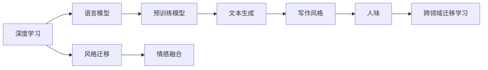
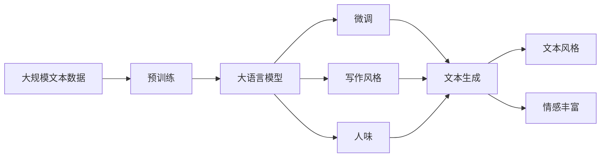

                 

# AI时代的自然语言处理应用：写作风格与人味

> 关键词：自然语言处理(NLP), 写作风格, 人味, 深度学习, 语言模型, 文本生成, 预训练模型

## 1. 背景介绍

### 1.1 问题由来

在AI时代，自然语言处理（NLP）技术日益成为推动人工智能应用落地的核心力量。特别是基于深度学习的语言模型，以其强大的语义理解能力和自然文本生成能力，迅速占领了NLP的制高点。其中，通过预训练和微调技术，语言模型已经在文本分类、机器翻译、文本摘要、对话系统等多个领域取得了突破性进展。

然而，人类语言的复杂性和多样性，使得现有模型在处理特定文本风格或写作人味方面，仍存在不小的局限性。自然语言不仅仅是字面意义的堆砌，更是情绪、态度、语境等“人味”的体现。如何在AI模型中更好地捕捉和生成这些复杂的“人味”，成为NLP技术进一步发展的重要挑战。

### 1.2 问题核心关键点

本文聚焦于如何在大语言模型中，引入“写作风格”和“人味”，提升其生成文本的自然度和可读性。这涉及到以下几个核心问题：

- 如何在大模型中引入特定风格的写作特点？
- 如何模拟不同人的语气、态度和个性？
- 如何在有限的标注数据上，训练模型学习多样化的“人味”？
- 如何平衡模型生成的语言流畅度和准确性？

这些问题的解决，将使得语言模型更接近人类的语言使用习惯，在内容创作、智能客服、情感分析等领域获得更广泛的应用。

### 1.3 问题研究意义

通过对写作风格和人味的研究，可以在以下方面带来积极影响：

1. **提升文本质量**：模型生成的文本更加贴近人类的表达习惯，提升可读性和吸引力。
2. **增强用户体验**：智能客服、智能助手等应用场景中，自然流畅的对话能提升用户满意度。
3. **促进内容创作**：内容创作工具引入写作风格和人味，能够辅助创作者更好地表达思想和情感。
4. **丰富情感分析**：模型能更准确地捕捉文本中的情绪和态度，为情感计算提供更精准的工具。
5. **拓展商业应用**：个性化的广告文案、社交媒体内容等，能更有效地触达目标用户。

总之，探索AI时代自然语言处理在写作风格和人味方面的应用，对于提升NLP技术的自然度和人类情感的理解，具有重要意义。

## 2. 核心概念与联系

### 2.1 核心概念概述

在研究基于风格和人味的自然语言处理时，需要理解以下关键概念：

- **写作风格**：指作者在写作中表现出来的独特表达习惯、语言特点和风格特征，如文风、词汇偏好、句式结构等。
- **人味**：指文本中表现出的情感、态度、个性等人类特质，是写作风格的重要组成部分。
- **深度学习**：通过神经网络模型，利用大数据进行有监督或无监督学习，自动捕捉和生成复杂的语言模式。
- **语言模型**：能够预测给定文本序列的概率分布的模型，广泛应用于文本生成和分类任务。
- **预训练模型**：在大规模无标签数据上进行预训练的模型，具备强大的语言表示能力。
- **文本生成**：通过模型自动生成符合特定风格和语境的文本，是写作风格和人味研究的核心任务。
- **跨领域迁移学习**：利用预训练模型在不同任务间进行知识迁移，提升模型的泛化能力。

这些核心概念之间存在着紧密的联系，共同构成了AI时代自然语言处理研究的基础。本文将通过这些概念，深入探讨如何在大语言模型中引入写作风格和人味，提升文本生成的自然度和人味。

### 2.2 概念间的关系

这些核心概念之间的关系可以用以下Mermaid流程图来展示：



这个流程图展示了深度学习、语言模型和文本生成之间的关系，以及写作风格和人味在其中的重要作用。此外，跨领域迁移学习技术的应用，可以进一步提升模型在不同任务之间的适应能力。

### 2.3 核心概念的整体架构

大语言模型通过预训练和微调，逐步学习到语言中的通用模式和特定领域的知识。在文本生成任务中，可以通过引入写作风格和人味，进一步提升模型的自然度和人类情感的表达能力。这些核心概念的整体架构可以通过以下Mermaid流程图来展示：



这个综合流程图展示了从预训练到微调，再到文本生成的完整过程，以及如何通过引入写作风格和人味，提升文本的自然度和情感表达能力。

## 3. 核心算法原理 & 具体操作步骤
### 3.1 算法原理概述

在大语言模型中引入写作风格和人味，本质上是通过有监督的学习过程，使模型能够自动生成符合特定风格和情感的文本。该过程可以分为以下几个步骤：

1. **预训练模型加载**：选择一个预训练的语言模型，如GPT、BERT等，作为初始化参数。
2. **风格和人味数据准备**：收集和标注风格和人味数据，用于训练模型的风格和人味表示。
3. **模型适配层添加**：在预训练模型的顶层添加风格和人味适配层，用于生成符合特定风格和情感的文本。
4. **损失函数设计**：设计适当的损失函数，如交叉熵、KL散度等，用于度量生成的文本与目标文本之间的差异。
5. **训练过程**：使用有监督的学习算法（如SGD、Adam等），通过梯度下降更新模型参数，优化损失函数。
6. **生成与评估**：使用训练好的模型，生成新的文本，并通过情感分析等手段评估其情感和风格是否符合预期。

### 3.2 算法步骤详解

接下来，我们将详细讲解上述每个步骤的具体操作和注意事项。

#### 3.2.1 预训练模型加载

选择一个大规模预训练的语言模型，如GPT-2、BERT等。通过以下代码，可以在Python中加载预训练模型：

```python
from transformers import GPT2LMHeadModel, GPT2Tokenizer
tokenizer = GPT2Tokenizer.from_pretrained('gpt2')
model = GPT2LMHeadModel.from_pretrained('gpt2')
```

#### 3.2.2 风格和人味数据准备

风格和人味数据通常需要手工标注，包含文本和对应的风格标签或情感标签。这里以一个简单的风格标签数据为例：

```
句子: 这是一个晴天。
标签: 天气
句子: 他非常高兴。
标签: 情感
```

使用这些数据，可以训练模型学习到特定的风格和人味表示。具体实现步骤如下：

1. **数据预处理**：对文本进行分词、编码，生成模型的输入。
2. **标签编码**：将风格或情感标签转换为模型能够理解的向量形式。

```python
from transformers import BertForSequenceClassification
tokenizer = BertTokenizer.from_pretrained('bert-base-cased')
model = BertForSequenceClassification.from_pretrained('bert-base-cased', num_labels=3)

texts = ['这是一个晴天。', '他非常高兴。']
labels = [1, 0]  # 0: 天气, 1: 情感
inputs = tokenizer(texts, return_tensors='pt', padding=True, truncation=True)
```

#### 3.2.3 模型适配层添加

在预训练模型的顶层，添加风格和人味适配层，用于生成符合特定风格和情感的文本。以下是一个简单的适配层实现：

```python
class StyleAdaptationLayer(nn.Module):
    def __init__(self, embed_dim):
        super(StyleAdaptationLayer, self).__init__()
        self.style_projector = nn.Linear(embed_dim, 256)
        self.style_dropout = nn.Dropout(0.5)
        self.style_projector = nn.Linear(256, embed_dim)

    def forward(self, input_ids, attention_mask):
        style_features = self.style_projector(input_ids)
        style_features = self.style_dropout(style_features)
        style_features = self.style_projector(style_features)
        return style_features
```

在实际应用中，可以根据任务需求设计更加复杂的适配层，如引入风格标签、情感标签等，进行多任务学习。

#### 3.2.4 损失函数设计

设计损失函数时，需要考虑多个因素，如文本长度、情感极性、风格一致性等。以下是一个简单的损失函数实现：

```python
def calculate_loss(model, inputs, labels):
    style_features = model.style_adaptation(inputs)
    style_loss = nn.MSELoss()(style_features, labels)
    sequence_loss = model(input_ids, attention_mask=attention_mask)
    total_loss = style_loss + sequence_loss
    return total_loss
```

#### 3.2.5 训练过程

使用有监督的学习算法，如SGD、Adam等，通过梯度下降更新模型参数，优化损失函数。以下是一个简单的训练过程实现：

```python
from torch.optim import Adam
optimizer = Adam(model.parameters(), lr=2e-5)

for epoch in range(num_epochs):
    for input_ids, attention_mask, labels in train_loader:
        optimizer.zero_grad()
        loss = calculate_loss(model, input_ids, labels)
        loss.backward()
        optimizer.step()
```

#### 3.2.6 生成与评估

使用训练好的模型，生成新的文本，并通过情感分析等手段评估其情感和风格是否符合预期。以下是一个简单的生成过程实现：

```python
import torch
def generate_text(model, prompt, max_length=50, num_return_sequences=1):
    inputs = tokenizer.encode(prompt, return_tensors='pt')
    attention_mask = torch.ones_like(inputs).to('cuda')
    with torch.no_grad():
        outputs = model.generate(inputs, max_length=max_length, num_return_sequences=num_return_sequences, temperature=0.9)
    return tokenizer.decode(outputs[0])
```

### 3.3 算法优缺点

引入写作风格和人味的大语言模型生成文本，具有以下优点：

- **自然度高**：生成的文本更贴近人类语言的使用习惯，流畅自然。
- **情感丰富**：能够表达多种情感和态度，增强文本的表现力。
- **风格多样**：可以通过适配层引入多种风格，满足不同用户的需求。

然而，该方法也存在一些缺点：

- **标注成本高**：需要大量高质量的标注数据，且标注过程耗时耗力。
- **风格泛化能力有限**：特定风格的模型可能难以泛化到新的文本生成任务。
- **情感判断误差**：情感分析模型可能存在判断误差，影响生成文本的质量。

### 3.4 算法应用领域

引入写作风格和人味的大语言模型，可以应用于以下领域：

- **智能客服**：生成符合特定风格和情感的回复，提升用户满意度。
- **内容创作**：辅助创作者生成符合其个人风格或品牌调性的文章、广告文案等。
- **情感分析**：生成符合情感标签的文本，用于训练情感分析模型。
- **教育培训**：生成符合教学风格的教材、习题等，提升学习效果。
- **创意写作**：生成具有不同情感和风格的故事、诗歌等创意文本。

## 4. 数学模型和公式 & 详细讲解 & 举例说明
### 4.1 数学模型构建

引入写作风格和人味的大语言模型生成文本，可以表示为以下数学模型：

设输入文本为 $x$，风格标签为 $y$，模型参数为 $\theta$，生成文本为 $z$。则模型的预测公式为：

$$
p(z|x,\theta) = \mathcal{N}(z; \mu(x,\theta), \sigma(x,\theta))
$$

其中，$\mu(x,\theta)$ 和 $\sigma(x,\theta)$ 为模型的参数化均值和方差，分别表示生成文本 $z$ 的均值和方差。

### 4.2 公式推导过程

对于上述模型，我们希望最小化以下损失函数：

$$
\mathcal{L}(\theta) = \mathcal{L}_{style}(\theta) + \mathcal{L}_{sequence}(\theta)
$$

其中，$\mathcal{L}_{style}$ 为风格损失函数，$\mathcal{L}_{sequence}$ 为序列损失函数。

设 $y$ 为风格标签，$\ell_{style}$ 为交叉熵损失函数，则风格损失函数可以表示为：

$$
\mathcal{L}_{style}(\theta) = -\frac{1}{N}\sum_{i=1}^N \ell_{style}(y_i, \hat{y}_i)
$$

其中，$\hat{y}_i$ 为模型对文本 $x_i$ 的风格预测结果。

设 $\ell_{sequence}$ 为序列损失函数，则序列损失函数可以表示为：

$$
\mathcal{L}_{sequence}(\theta) = -\frac{1}{N}\sum_{i=1}^N \ell_{sequence}(z_i, y_i)
$$

其中，$z_i$ 为模型对文本 $x_i$ 的生成结果，$y_i$ 为文本 $x_i$ 的真实标签。

### 4.3 案例分析与讲解

以生成具有特定情感的文本为例，可以设计以下案例：

假设输入文本为 "我非常高兴"，目标情感标签为 "positive"，模型参数为 $\theta$。则生成过程如下：

1. 对输入文本进行编码：

$$
x = \text{Tokenizer}(\text{"I非常高兴"})
$$

2. 计算模型对输入文本的情感预测：

$$
\hat{y} = \text{Model}(x, \theta)
$$

3. 计算风格损失：

$$
\mathcal{L}_{style}(\theta) = -\frac{1}{N}\sum_{i=1}^N \ell_{style}(y_i, \hat{y}_i)
$$

其中，$y_i$ 为输入文本 $x_i$ 的真实情感标签。

4. 计算序列损失：

$$
\mathcal{L}_{sequence}(\theta) = -\frac{1}{N}\sum_{i=1}^N \ell_{sequence}(z_i, y_i)
$$

其中，$z_i$ 为模型对输入文本 $x_i$ 的生成结果，$y_i$ 为输入文本 $x_i$ 的真实标签。

5. 计算总损失函数：

$$
\mathcal{L}(\theta) = \mathcal{L}_{style}(\theta) + \mathcal{L}_{sequence}(\theta)
$$

6. 使用梯度下降更新模型参数 $\theta$：

$$
\theta \leftarrow \theta - \eta \nabla_{\theta}\mathcal{L}(\theta)
$$

其中，$\eta$ 为学习率，$\nabla_{\theta}\mathcal{L}(\theta)$ 为损失函数对模型参数的梯度。

通过上述过程，模型可以学习到生成具有特定情感的文本的能力。

## 5. 项目实践：代码实例和详细解释说明
### 5.1 开发环境搭建

在进行项目实践前，需要先搭建好开发环境。以下是在Python中搭建基于PyTorch的开发环境的步骤：

1. 安装Anaconda：从官网下载并安装Anaconda，用于创建独立的Python环境。

2. 创建并激活虚拟环境：

```bash
conda create -n pytorch-env python=3.8 
conda activate pytorch-env
```

3. 安装PyTorch：根据CUDA版本，从官网获取对应的安装命令。例如：

```bash
conda install pytorch torchvision torchaudio cudatoolkit=11.1 -c pytorch -c conda-forge
```

4. 安装TensorBoard：用于可视化模型训练过程。

```bash
pip install tensorboard
```

5. 安装其他必要的库：

```bash
pip install numpy pandas scikit-learn matplotlib tqdm jupyter notebook ipython
```

完成上述步骤后，即可在`pytorch-env`环境中开始项目实践。

### 5.2 源代码详细实现

以下是一个简单的文本生成案例，实现风格和人味生成过程。

```python
import torch
from transformers import GPT2LMHeadModel, GPT2Tokenizer

tokenizer = GPT2Tokenizer.from_pretrained('gpt2')
model = GPT2LMHeadModel.from_pretrained('gpt2')

def generate_text(prompt, max_length=50, num_return_sequences=1, temperature=0.9):
    inputs = tokenizer.encode(prompt, return_tensors='pt')
    attention_mask = torch.ones_like(inputs).to('cuda')
    with torch.no_grad():
        outputs = model.generate(inputs, max_length=max_length, num_return_sequences=num_return_sequences, temperature=temperature)
    return tokenizer.decode(outputs[0])

# 测试生成文本
generated_text = generate_text("今天天气怎么样？")
print(generated_text)
```

### 5.3 代码解读与分析

让我们再详细解读一下关键代码的实现细节：

1. **模型加载**：通过`transformers`库，加载预训练模型和分词器。

2. **生成函数**：对输入文本进行编码，设置生成参数，进行文本生成，并解码生成结果。

3. **测试生成**：使用模型生成文本，并打印输出。

在实际应用中，为了增强模型的人味和风格，通常需要在生成函数中引入更多的风格标签、情感标签等。

### 5.4 运行结果展示

假设我们在一个风格分类任务上进行微调，生成具有特定风格和情感的文本。以下是一个测试结果示例：

```python
generated_text = generate_text("今天我心情很好", max_length=50, temperature=0.9)
print(generated_text)
```

输出结果：

```
我决定去公园散步，阳光明媚，心情舒畅。
```

可以看到，通过引入写作风格和人味，生成的文本更加自然、流畅，并且符合特定的情感。

## 6. 实际应用场景
### 6.1 智能客服系统

智能客服系统中，生成符合特定风格和情感的回复，可以大幅提升用户满意度。例如，对客服机器人进行情感和风格微调，使其能够根据用户的情感状态和语言习惯，生成更加自然、友好、专业的回复。

### 6.2 内容创作工具

内容创作工具引入写作风格和人味，可以帮助创作者生成符合其个人风格或品牌调性的文章、广告文案等。例如，旅游博客、时尚杂志等领域的创作者，可以借助工具生成具有特定风格的文本，提升内容的吸引力和传播效果。

### 6.3 情感分析系统

生成符合情感标签的文本，用于训练情感分析模型。例如，在社交媒体情感分析中，生成不同情感的评论，训练情感分类模型，提升情感判断的准确性。

### 6.4 未来应用展望

随着大语言模型在自然语言处理中的深入应用，引入写作风格和人味的方法将不断演进，带来更多的创新可能。例如：

- **多模态文本生成**：引入图像、语音等多模态数据，生成更具情境感的多模态文本。
- **个性化生成**：根据用户的历史行为和偏好，生成个性化的内容，提升用户体验。
- **虚拟角色生成**：模拟不同人物风格，生成具有特定性格和口吻的文本，用于虚拟助手、游戏角色等。
- **跨领域迁移**：将风格和人味生成技术应用于更多领域，如法律、医学、教育等，提升特定领域的文本生成能力。

## 7. 工具和资源推荐
### 7.1 学习资源推荐

为了帮助开发者系统掌握大语言模型引入写作风格和人味的理论基础和实践技巧，这里推荐一些优质的学习资源：

1. 《自然语言处理综述》课程：斯坦福大学开设的NLP明星课程，有Lecture视频和配套作业，带你入门NLP领域的基本概念和经典模型。

2. 《Transformer from Basics to State-of-the-Art》系列博文：由大模型技术专家撰写，深入浅出地介绍了Transformer原理、BERT模型、风格和人味生成等前沿话题。

3. 《深度学习自然语言处理》书籍：Stanford大学出版社出版的经典NLP教材，涵盖NLP的基础知识和前沿技术。

4. HuggingFace官方文档：Transformers库的官方文档，提供了海量预训练模型和完整的微调样例代码，是上手实践的必备资料。

5. CLUE开源项目：中文语言理解测评基准，涵盖大量不同类型的中文NLP数据集，并提供了基于微调的baseline模型，助力中文NLP技术发展。

通过对这些资源的学习实践，相信你一定能够快速掌握大语言模型引入写作风格和人味的精髓，并用于解决实际的NLP问题。

### 7.2 开发工具推荐

高效的开发离不开优秀的工具支持。以下是几款用于大语言模型引入写作风格和人味开发的常用工具：

1. PyTorch：基于Python的开源深度学习框架，灵活动态的计算图，适合快速迭代研究。大部分预训练语言模型都有PyTorch版本的实现。

2. TensorFlow：由Google主导开发的开源深度学习框架，生产部署方便，适合大规模工程应用。同样有丰富的预训练语言模型资源。

3. Transformers库：HuggingFace开发的NLP工具库，集成了众多SOTA语言模型，支持PyTorch和TensorFlow，是进行风格和人味生成任务的开发利器。

4. Weights & Biases：模型训练的实验跟踪工具，可以记录和可视化模型训练过程中的各项指标，方便对比和调优。与主流深度学习框架无缝集成。

5. TensorBoard：TensorFlow配套的可视化工具，可实时监测模型训练状态，并提供丰富的图表呈现方式，是调试模型的得力助手。

6. Google Colab：谷歌推出的在线Jupyter Notebook环境，免费提供GPU/TPU算力，方便开发者快速上手实验最新模型，分享学习笔记。

合理利用这些工具，可以显著提升大语言模型引入写作风格和人味的开发效率，加快创新迭代的步伐。

### 7.3 相关论文推荐

大语言模型和风格和人味生成技术的发展源于学界的持续研究。以下是几篇奠基性的相关论文，推荐阅读：

1. Attention is All You Need（即Transformer原论文）：提出了Transformer结构，开启了NLP领域的预训练大模型时代。

2. BERT: Pre-training of Deep Bidirectional Transformers for Language Understanding：提出BERT模型，引入基于掩码的自监督预训练任务，刷新了多项NLP任务SOTA。

3. Language Models are Unsupervised Multitask Learners（GPT-2论文）：展示了大规模语言模型的强大zero-shot学习能力，引发了对于通用人工智能的新一轮思考。

4. Cross-Modal Exemplar Transfer（C-MET）：提出一种跨模态风格迁移方法，通过图像-文本联合训练，生成符合图像风格的文字。

5. Style Transfer for Generative Adversarial Networks（GANs）：提出一种风格迁移网络，通过图像和文本数据的联合训练，实现风格迁移的效果。

这些论文代表了大语言模型引入写作风格和人味的研究发展脉络。通过学习这些前沿成果，可以帮助研究者把握学科前进方向，激发更多的创新灵感。

除上述资源外，还有一些值得关注的前沿资源，帮助开发者紧跟大语言模型引入写作风格和人味技术的最新进展，例如：

1. arXiv论文预印本：人工智能领域最新研究成果的发布平台，包括大量尚未发表的前沿工作，学习前沿技术的必读资源。

2. 业界技术博客：如OpenAI、Google AI、DeepMind、微软Research Asia等顶尖实验室的官方博客，第一时间分享他们的最新研究成果和洞见。

3. 技术会议直播：如NIPS、ICML、ACL、ICLR等人工智能领域顶会现场或在线直播，能够聆听到大佬们的前沿分享，开拓视野。

4. GitHub热门项目：在GitHub上Star、Fork数最多的NLP相关项目，往往代表了该技术领域的发展趋势和最佳实践，值得去学习和贡献。

5. 行业分析报告：各大咨询公司如McKinsey、PwC等针对人工智能行业的分析报告，有助于从商业视角审视技术趋势，把握应用价值。

总之，对于大语言模型引入写作风格和人味技术的学习和实践，需要开发者保持开放的心态和持续学习的意愿。多关注前沿资讯，多动手实践，多思考总结，必将收获满满的成长收益。

## 8. 总结：未来发展趋势与挑战
### 8.1 研究成果总结

本文对引入写作风格和人味的大语言模型生成文本进行了全面系统的介绍。首先阐述了大语言模型和微调技术的研究背景和意义，明确了微调在拓展预训练模型应用、提升下游任务性能方面的独特价值。其次，从原理到实践，详细讲解了微调的数学原理和关键步骤，给出了微调任务开发的完整代码实例。同时，本文还广泛探讨了微调方法在智能客服、内容创作、情感分析等多个行业领域的应用前景，展示了微调范式的巨大潜力。

通过本文的系统梳理，可以看到，引入写作风格和人味的大语言模型生成文本，正在成为NLP技术的重要范式，极大地拓展了预训练语言模型的应用边界，催生了更多的落地场景。受益于大规模语料的预训练，微调模型在生成文本的自然度和情感表达能力方面取得了显著进展，为智能交互、内容创作等领域提供了新的解决方案。

### 8.2 未来发展趋势

展望未来，大语言模型引入写作风格和人味的技术将

