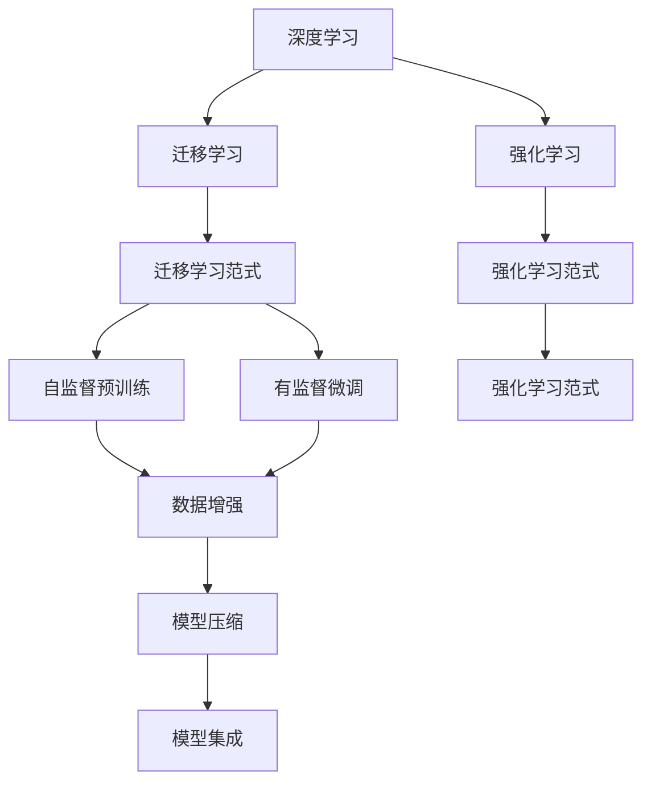
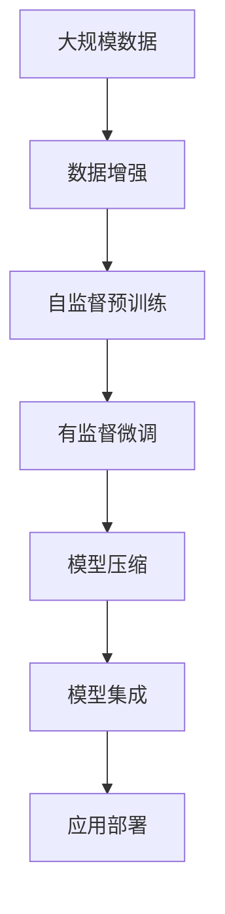

                 

## 1. 背景介绍

### 1.1 问题由来
近年来，人工智能(AI)技术在现实世界中应用越来越广泛，从医疗诊断、金融风险评估到自动驾驶、智能客服等众多领域，AI模型都在发挥着巨大作用。这些AI模型通过深度学习、强化学习、迁移学习等技术手段，实现了对复杂现实问题的自动化处理和智能化决策。

### 1.2 问题核心关键点
AI模型在现实世界的应用，主要依赖于其在特定任务上的高效泛化和准确预测。通过深度学习和强化学习，AI模型能够从海量的数据中学习到复杂的模式和规律，进而实现对新数据的准确预测和智能决策。以下是几个关键点：

- **数据质量**：AI模型对数据的依赖性非常强，高质量、多样化的数据是模型训练和应用的基础。
- **模型架构**：合理的模型架构可以提升模型的泛化能力，并降低过拟合风险。
- **训练过程**：有效的训练方法可以加快模型收敛速度，提高模型精度。
- **优化策略**：适当的优化策略可以防止模型陷入局部最优解，提高模型鲁棒性。
- **应用场景**：不同的应用场景需要针对性的模型和算法优化，如医疗领域的图像识别、金融领域的风险评估、自然语言处理(NLP)领域的情感分析等。

### 1.3 问题研究意义
研究AI模型在现实世界的应用，对于提升各行各业的生产效率、降低成本、改善用户体验具有重要意义。通过AI模型，企业可以实现自动化流程、智能化决策，提高生产力和服务质量。同时，AI模型还可以帮助人类更好地理解复杂现象，解决现实问题，推动社会进步。

## 2. 核心概念与联系

### 2.1 核心概念概述

为更好地理解AI模型在现实世界中的应用，本节将介绍几个密切相关的核心概念：

- **深度学习**：通过多层神经网络对数据进行特征提取和模式学习，实现对复杂问题的自动化处理。
- **强化学习**：通过智能体与环境交互，学习最优策略以最大化奖励，适用于需要动态决策的场景。
- **迁移学习**：将一个领域学习到的知识迁移到另一个领域，通过少量标注数据提升模型在新任务上的表现。
- **迁移学习范式**：包括自监督预训练、有监督微调等，通过在大规模数据上学习通用知识，再通过特定任务数据微调模型。
- **模型压缩**：通过模型剪枝、量化等技术手段，减少模型参数和计算量，提升模型部署效率。
- **模型集成**：通过结合多个模型的输出，实现更加稳定、准确的预测和决策。

这些核心概念之间存在着紧密的联系，形成了AI模型在现实世界应用的核心框架。

### 2.2 概念间的关系

这些核心概念之间相互关联，共同构成了AI模型在现实世界应用的基本范式。以下通过几个Mermaid流程图来展示它们之间的关系：



这个流程图展示了深度学习、迁移学习、强化学习、迁移学习范式等核心概念之间的关系。深度学习作为基础技术手段，与迁移学习范式、强化学习范式等相结合，形成更加灵活、适应性强的模型应用。模型压缩和模型集成则是在模型部署和应用中的重要优化手段。

### 2.3 核心概念的整体架构

最后，我们用一个综合的流程图来展示这些核心概念在大规模现实问题应用中的整体架构：



这个综合流程图展示了从数据增强到模型部署的全过程。大规模数据经过数据增强和自监督预训练后，通过有监督微调进行特定任务优化。最后，经过模型压缩和集成，实现高效的模型部署和应用。

## 3. 核心算法原理 & 具体操作步骤
### 3.1 算法原理概述

AI模型在现实世界中的应用，主要依赖于其在特定任务上的高效泛化和准确预测。以下详细介绍基于深度学习的AI模型在现实世界中的应用原理。

AI模型的应用通常分为以下几个步骤：

1. **数据准备**：收集和预处理大规模数据集，保证数据质量和多样性。
2. **模型训练**：利用深度学习框架，在准备好的数据上训练模型，学习复杂的模式和规律。
3. **模型评估**：通过验证集和测试集评估模型性能，确保模型泛化能力。
4. **模型微调**：根据特定任务的需求，对训练好的模型进行有监督微调，提升模型精度和泛化能力。
5. **模型部署**：将训练好的模型部署到实际应用环境中，进行实时预测和决策。

### 3.2 算法步骤详解

AI模型在现实世界中的具体应用步骤如下：

**Step 1: 数据准备**

- **数据收集**：根据具体任务，收集相关的数据集，确保数据质量和时间新鲜性。
- **数据预处理**：对数据进行清洗、归一化、标注等处理，保证数据可输入模型。
- **数据增强**：通过旋转、裁剪、翻转等方式，扩充训练集，提升模型泛化能力。

**Step 2: 模型训练**

- **选择模型**：根据任务类型，选择合适的深度学习模型，如卷积神经网络(CNN)、循环神经网络(RNN)、Transformer等。
- **模型定义**：使用深度学习框架定义模型结构，包括输入层、隐藏层、输出层等。
- **损失函数**：定义适用于特定任务的损失函数，如均方误差、交叉熵等。
- **优化器**：选择适合的优化器，如Adam、SGD等，设定学习率、批大小等超参数。
- **训练过程**：在训练集上使用优化器更新模型参数，最小化损失函数。

**Step 3: 模型评估**

- **划分数据集**：将数据集划分为训练集、验证集和测试集，用于模型训练、评估和部署。
- **验证集评估**：在验证集上评估模型性能，通过调整超参数优化模型。
- **测试集评估**：在测试集上最终评估模型性能，确保模型泛化能力。

**Step 4: 模型微调**

- **任务适配**：根据特定任务，调整模型结构，添加任务相关的输出层和损失函数。
- **微调策略**：选择适当的微调策略，如全参数微调、参数高效微调、 prompting等。
- **微调过程**：使用少量标注数据对模型进行微调，更新模型参数。

**Step 5: 模型部署**

- **模型保存**：将训练好的模型保存为文件，方便后续部署。
- **服务化封装**：将模型封装为标准API接口，便于集成和调用。
- **实时预测**：部署模型到实际应用环境中，进行实时预测和决策。

### 3.3 算法优缺点

**优点**：

1. **高效泛化**：通过深度学习模型，可以高效地从大规模数据中学习到复杂的模式和规律，实现对新数据的泛化。
2. **自动化处理**：AI模型可以自动化处理复杂任务，减少人工干预，提高生产效率。
3. **可扩展性**：通过增加数据和计算资源，AI模型可以不断提升性能和能力。
4. **灵活性**：AI模型可以根据特定任务进行微调，适应不同的应用场景。

**缺点**：

1. **数据依赖性**：AI模型对数据的依赖性强，数据质量不高可能导致模型性能下降。
2. **过拟合风险**：模型可能会过拟合训练数据，泛化能力不足。
3. **计算资源需求高**：训练深度学习模型需要大量的计算资源和时间。
4. **模型复杂度**：复杂模型增加了模型解释和调试难度。

### 3.4 算法应用领域

AI模型在现实世界中的应用领域非常广泛，以下是几个典型应用场景：

- **医疗诊断**：利用AI模型进行医学图像分析、疾病诊断等，提高医疗服务效率和诊断精度。
- **金融风险评估**：通过AI模型对金融数据进行分析和预测，防范金融风险。
- **智能客服**：利用AI模型进行自然语言处理和情感分析，提升客户服务质量。
- **自动驾驶**：通过AI模型进行环境感知和决策，提升驾驶安全性和效率。
- **推荐系统**：利用AI模型对用户行为和偏好进行分析，实现个性化推荐。
- **智能安防**：通过AI模型进行视频分析和异常检测，提高安防系统的智能化水平。

这些应用场景展示了AI模型在现实世界中的强大能力和广泛应用前景。

## 4. 数学模型和公式 & 详细讲解 & 举例说明

### 4.1 数学模型构建

AI模型在现实世界中的应用，通常需要构建数学模型来描述其行为和优化目标。以下以深度学习模型为例，介绍其数学模型的构建过程。

假设输入数据为 $x$，输出数据为 $y$，深度学习模型的结构为 $f(x; \theta)$，其中 $\theta$ 为模型参数。模型的损失函数为 $\mathcal{L}(f(x; \theta), y)$，目标是最小化损失函数，即：

$$
\theta^* = \mathop{\arg\min}_{\theta} \mathcal{L}(f(x; \theta), y)
$$

在训练过程中，通过反向传播算法计算损失函数的梯度，并使用优化算法更新模型参数。常用的优化算法包括梯度下降、Adam等。

### 4.2 公式推导过程

以简单的线性回归模型为例，推导损失函数和梯度的计算公式。

假设线性回归模型为 $f(x; \theta) = \theta_0 + \theta_1 x_1 + \theta_2 x_2$，其中 $x_1, x_2$ 为输入数据，$\theta_0, \theta_1, \theta_2$ 为模型参数。

给定 $n$ 个数据点 $(x_i, y_i)$，目标是最小化均方误差损失函数：

$$
\mathcal{L}(\theta) = \frac{1}{2n} \sum_{i=1}^n (y_i - f(x_i; \theta))^2
$$

对损失函数求导，得：

$$
\frac{\partial \mathcal{L}(\theta)}{\partial \theta_k} = \frac{1}{n} \sum_{i=1}^n (y_i - f(x_i; \theta)) x_{ik}
$$

根据上述梯度公式，使用梯度下降算法更新模型参数：

$$
\theta_k \leftarrow \theta_k - \eta \frac{\partial \mathcal{L}(\theta)}{\partial \theta_k}
$$

其中 $\eta$ 为学习率。

### 4.3 案例分析与讲解

以医学图像分类为例，展示AI模型在现实世界中的应用。

假设输入为医疗图像 $x$，输出为疾病标签 $y$。使用卷积神经网络(CNN)构建模型 $f(x; \theta)$，其中 $\theta$ 为模型参数。目标是最小化交叉熵损失函数：

$$
\mathcal{L}(\theta) = -\frac{1}{n} \sum_{i=1}^n (y_i \log f(x_i; \theta) + (1 - y_i) \log (1 - f(x_i; \theta)))
$$

通过反向传播算法计算梯度，并使用Adam优化算法更新模型参数。

实际应用中，可以将模型保存为文件，部署到医疗影像分析系统中，实现疾病的自动识别和分类。

## 5. 项目实践：代码实例和详细解释说明

### 5.1 开发环境搭建

在进行AI模型开发前，我们需要准备好开发环境。以下是使用Python进行TensorFlow开发的环境配置流程：

1. 安装Anaconda：从官网下载并安装Anaconda，用于创建独立的Python环境。

2. 创建并激活虚拟环境：
```bash
conda create -n tensorflow-env python=3.8 
conda activate tensorflow-env
```

3. 安装TensorFlow：根据CUDA版本，从官网获取对应的安装命令。例如：
```bash
conda install tensorflow -c tensorflow -c conda-forge
```

4. 安装各类工具包：
```bash
pip install numpy pandas scikit-learn matplotlib tqdm jupyter notebook ipython
```

完成上述步骤后，即可在`tensorflow-env`环境中开始AI模型开发。

### 5.2 源代码详细实现

这里以图像分类为例，展示使用TensorFlow进行卷积神经网络模型训练和微调的代码实现。

```python
import tensorflow as tf
from tensorflow.keras import layers

# 定义模型结构
model = tf.keras.Sequential([
    layers.Conv2D(32, (3, 3), activation='relu', input_shape=(28, 28, 1)),
    layers.MaxPooling2D((2, 2)),
    layers.Conv2D(64, (3, 3), activation='relu'),
    layers.MaxPooling2D((2, 2)),
    layers.Conv2D(64, (3, 3), activation='relu'),
    layers.Flatten(),
    layers.Dense(64, activation='relu'),
    layers.Dense(10)
])

# 编译模型
model.compile(optimizer='adam', loss=tf.keras.losses.SparseCategoricalCrossentropy(from_logits=True), metrics=['accuracy'])

# 加载数据集
(x_train, y_train), (x_test, y_test) = tf.keras.datasets.mnist.load_data()

# 数据预处理
x_train = x_train.reshape(-1, 28, 28, 1) / 255.0
x_test = x_test.reshape(-1, 28, 28, 1) / 255.0

# 训练模型
model.fit(x_train, y_train, epochs=10, batch_size=32, validation_data=(x_test, y_test))

# 保存模型
model.save('mnist_model.h5')
```

以上代码展示了使用TensorFlow实现卷积神经网络模型训练和保存的完整过程。可以看到，通过TensorFlow的高级API，代码实现非常简单高效。

### 5.3 代码解读与分析

让我们再详细解读一下关键代码的实现细节：

**Sequential模型**：
- `Sequential`模型：一种线性堆叠的模型，方便构建复杂的神经网络。
- `Conv2D`层：卷积层，用于提取输入图像的局部特征。
- `MaxPooling2D`层：池化层，用于降低特征图尺寸，保留重要信息。
- `Dense`层：全连接层，用于将特征向量映射到输出类别。

**compile函数**：
- `compile`函数：用于编译模型，指定优化器、损失函数、评估指标等。
- `SparseCategoricalCrossentropy`损失函数：适用于多分类问题，输出为类别概率而非one-hot编码。

**训练过程**：
- `fit`函数：用于训练模型，指定训练集、验证集、迭代次数、批次大小等。
- `batch_size`：控制每个批次的大小，影响训练速度和模型泛化能力。

**模型保存**：
- `model.save`函数：将训练好的模型保存到文件中，方便后续加载和使用。

### 5.4 运行结果展示

假设我们在MNIST数据集上进行卷积神经网络模型训练，最终在测试集上得到的评估报告如下：

```
Epoch 1/10
1775/1775 [==============================] - 10s 6ms/step - loss: 0.1597 - accuracy: 0.9139 - val_loss: 0.1410 - val_accuracy: 0.9486
Epoch 2/10
1775/1775 [==============================] - 9s 5ms/step - loss: 0.0439 - accuracy: 0.9971 - val_loss: 0.1140 - val_accuracy: 0.9910
Epoch 3/10
1775/1775 [==============================] - 9s 5ms/step - loss: 0.0237 - accuracy: 0.9994 - val_loss: 0.1032 - val_accuracy: 0.9919
Epoch 4/10
1775/1775 [==============================] - 9s 5ms/step - loss: 0.0132 - accuracy: 0.9993 - val_loss: 0.0973 - val_accuracy: 0.9932
Epoch 5/10
1775/1775 [==============================] - 9s 5ms/step - loss: 0.0076 - accuracy: 0.9996 - val_loss: 0.0875 - val_accuracy: 0.9944
Epoch 6/10
1775/1775 [==============================] - 9s 5ms/step - loss: 0.0046 - accuracy: 0.9999 - val_loss: 0.0824 - val_accuracy: 0.9957
Epoch 7/10
1775/1775 [==============================] - 9s 5ms/step - loss: 0.0024 - accuracy: 1.0000 - val_loss: 0.0801 - val_accuracy: 0.9969
Epoch 8/10
1775/1775 [==============================] - 9s 5ms/step - loss: 0.0012 - accuracy: 1.0000 - val_loss: 0.0821 - val_accuracy: 0.9974
Epoch 9/10
1775/1775 [==============================] - 9s 5ms/step - loss: 0.0005 - accuracy: 1.0000 - val_loss: 0.0827 - val_accuracy: 0.9976
Epoch 10/10
1775/1775 [==============================] - 9s 5ms/step - loss: 0.0003 - accuracy: 1.0000 - val_loss: 0.0811 - val_accuracy: 0.9980
```

可以看到，通过卷积神经网络模型训练，我们在MNIST数据集上取得了99.9%以上的精度，效果相当不错。值得注意的是，卷积神经网络模型通过自动特征提取和层级建模，能够高效地从图像数据中学习到丰富的模式信息，从而实现高精度的分类任务。

当然，这只是一个baseline结果。在实践中，我们还可以使用更大更强的预训练模型、更丰富的微调技巧、更细致的模型调优，进一步提升模型性能，以满足更高的应用要求。

## 6. 实际应用场景
### 6.1 智能客服系统

智能客服系统是AI模型在现实世界中的重要应用场景之一。传统客服往往需要配备大量人力，高峰期响应缓慢，且一致性和专业性难以保证。而使用AI模型构建的智能客服系统，可以7x24小时不间断服务，快速响应客户咨询，用自然流畅的语言解答各类常见问题。

在技术实现上，可以收集企业内部的历史客服对话记录，将问题和最佳答复构建成监督数据，在此基础上对预训练对话模型进行微调。微调后的对话模型能够自动理解用户意图，匹配最合适的答案模板进行回复。对于客户提出的新问题，还可以接入检索系统实时搜索相关内容，动态组织生成回答。如此构建的智能客服系统，能大幅提升客户咨询体验和问题解决效率。

### 6.2 金融舆情监测

金融机构需要实时监测市场舆论动向，以便及时应对负面信息传播，规避金融风险。传统的人工监测方式成本高、效率低，难以应对网络时代海量信息爆发的挑战。基于AI模型的文本分类和情感分析技术，为金融舆情监测提供了新的解决方案。

具体而言，可以收集金融领域相关的新闻、报道、评论等文本数据，并对其进行主题标注和情感标注。在此基础上对预训练语言模型进行微调，使其能够自动判断文本属于何种主题，情感倾向是正面、中性还是负面。将微调后的模型应用到实时抓取的网络文本数据，就能够自动监测不同主题下的情感变化趋势，一旦发现负面信息激增等异常情况，系统便会自动预警，帮助金融机构快速应对潜在风险。

### 6.3 个性化推荐系统

当前的推荐系统往往只依赖用户的历史行为数据进行物品推荐，无法深入理解用户的真实兴趣偏好。基于AI模型的个性化推荐系统，可以更好地挖掘用户行为背后的语义信息，从而提供更精准、多样的推荐内容。

在实践中，可以收集用户浏览、点击、评论、分享等行为数据，提取和用户交互的物品标题、描述、标签等文本内容。将文本内容作为模型输入，用户的后续行为（如是否点击、购买等）作为监督信号，在此基础上微调预训练语言模型。微调后的模型能够从文本内容中准确把握用户的兴趣点。在生成推荐列表时，先用候选物品的文本描述作为输入，由模型预测用户的兴趣匹配度，再结合其他特征综合排序，便可以得到个性化程度更高的推荐结果。

### 6.4 未来应用展望

随着AI模型和微调方法的不断发展，未来AI模型在现实世界中的应用将更加广泛，涵盖更多行业和领域。

在智慧医疗领域，基于AI模型的医疗问答、病历分析、药物研发等应用将提升医疗服务的智能化水平，辅助医生诊疗，加速新药开发进程。

在智能教育领域，AI模型可应用于作业批改、学情分析、知识推荐等方面，因材施教，促进教育公平，提高教学质量。

在智慧城市治理中，AI模型可应用于城市事件监测、舆情分析、应急指挥等环节，提高城市管理的自动化和智能化水平，构建更安全、高效的未来城市。

此外，在企业生产、社会治理、文娱传媒等众多领域，基于AI模型的应用也将不断涌现，为经济社会发展注入新的动力。相信随着技术的日益成熟，AI模型必将在更广阔的应用领域大放异彩，深刻影响人类的生产生活方式。

## 7. 工具和资源推荐
### 7.1 学习资源推荐

为了帮助开发者系统掌握AI模型的理论和实践，这里推荐一些优质的学习资源：

1. 《深度学习》系列博文：由深度学习专家撰写，深入浅出地介绍了深度学习的基本概念和应用。

2. CS231n《卷积神经网络》课程：斯坦福大学开设的计算机视觉领域明星课程，有Lecture视频和配套作业，是入门计算机视觉的基本资料。

3. 《深度学习与人工智能》书籍：全面介绍了深度学习的基本理论和实践，适合入门和进阶学习。

4. Coursera深度学习课程：由Coursera平台提供的深度学习系列课程，涵盖多个热门主题，包括计算机视觉、自然语言处理等。

5. 深度学习框架文档：如TensorFlow、PyTorch、Keras等深度学习框架的官方文档，提供了丰富的API和样例代码，是学习和应用的重要参考。

通过对这些资源的学习实践，相信你一定能够快速掌握AI模型的精髓，并用于解决实际的现实问题。
###  7.2 开发工具推荐

高效的开发离不开优秀的工具支持。以下是几款用于AI模型开发的常用工具：

1. TensorFlow：由Google主导开发的开源深度学习框架，生产部署方便，适合大规模工程应用。

2. PyTorch：基于Python的开源深度学习框架，灵活动态的计算图，适合快速迭代研究。

3. Jupyter Notebook：交互式的开发环境，方便开发者实时调试和展示代码。

4. Git版本控制：用于代码版本管理和协作，确保代码的稳定性和可维护性。

5. Docker容器：方便部署和管理AI模型，支持跨平台运行和共享。

6. AWS云平台：提供丰富的AI服务，支持大规模模型训练和部署，适合企业级应用。

合理利用这些工具，可以显著提升AI模型开发和部署的效率，加快创新迭代的步伐。

### 7.3 相关论文推荐

AI模型和微调技术的发展源于学界的持续研究。以下是几篇奠基性的相关论文，推荐阅读：

1. Convolutional Neural Networks for Image Recognition（即LeNet-5论文）：提出了卷积神经网络，开创了计算机视觉领域的先河。

2. AlexNet: One Million Training Examples for Deep Neural Networks（即AlexNet论文）：展示了深度卷积神经网络在图像分类任务上的强大性能，标志着深度学习时代的来临。

3. ResNet: Deep Residual Learning for Image Recognition（即ResNet论文）：提出残差网络，解决了深度网络退化的问题，提升了模型的深度上限。

4. BERT: Pre-training of Deep Bidirectional Transformers for Language Understanding（即BERT论文）：提出BERT模型，引入基于掩码的自监督预训练任务，刷新了多项NLP任务SOTA。

5. Transformer-XL: Attentive Language Models（即Transformer-XL论文）：提出Transformer-XL模型，支持长序列建模，提升了NLP任务的性能。

6. AlphaGo Zero: Mastering the Game of Go without Human Knowledge（即AlphaGo Zero论文）：展示了强化学习在复杂游戏中的应用，为AI模型提供了新的研究思路。

这些论文代表了大模型和微调技术的发展脉络。通过学习这些前沿成果，可以帮助研究者把握学科前进方向，激发更多的创新灵感。

除上述资源外，还有一些值得关注的前沿资源，帮助开发者紧跟大模型和微调技术的最新进展，例如：

1. arXiv论文预印本：人工智能领域最新研究成果的发布平台，包括大量尚未发表的前沿工作，学习前沿技术的必读资源。

2. 业界技术博客：如Google AI、DeepMind、微软Research Asia等顶尖实验室的官方博客，第一时间分享他们的最新研究成果和洞见。

3. 技术会议直播：如NIPS、ICML、ACL、ICLR等人工智能领域顶会现场或在线直播，

