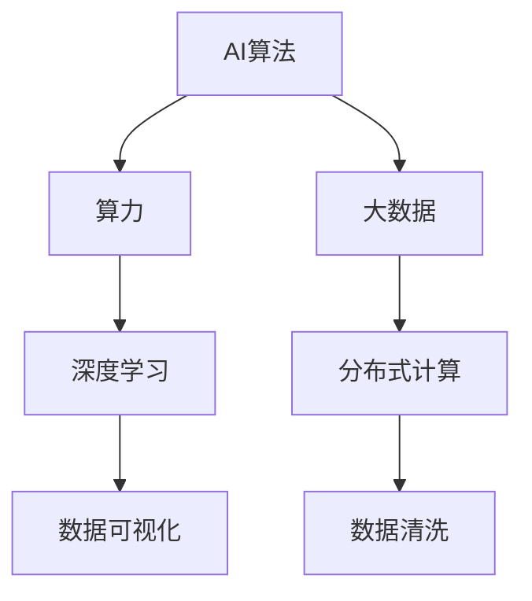
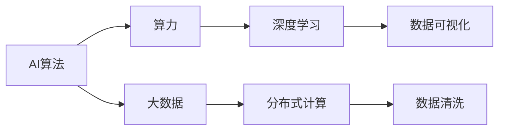
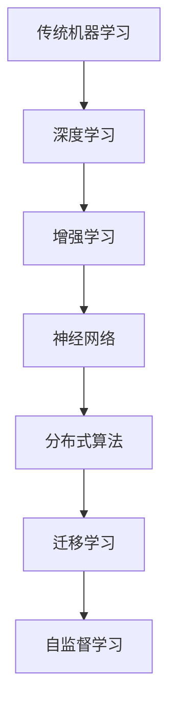
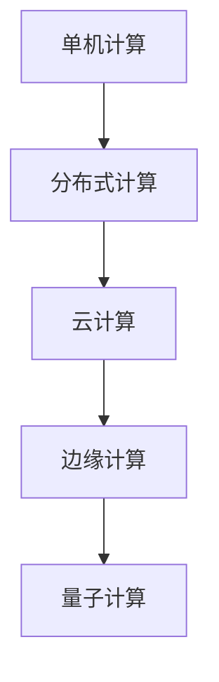
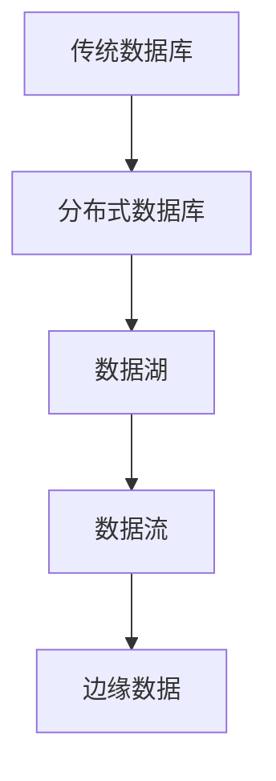
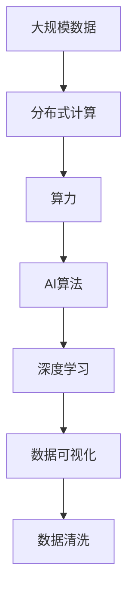

                 

# AI算法、算力与大数据的结合

> 关键词：AI算法、算力、大数据、结合

## 1. 背景介绍

### 1.1 问题由来
随着人工智能(AI)技术的迅猛发展，AI算法、算力与大数据的深度结合已经成为推动AI应用落地、提升AI模型性能的重要驱动力。然而，传统的AI算法、算力与数据之间的结合方式往往不够高效，导致算力浪费、数据价值挖掘不足，难以实现AI应用的广泛应用。为此，我们需要探索更加高效、灵活、普适的AI算法、算力与大数据结合方式。

### 1.2 问题核心关键点
AI算法、算力与大数据的结合涉及多个关键点，包括：

1. **AI算法的选择**：选择适合的数据特征和业务需求，以及能够高效处理大规模数据的AI算法。
2. **算力的配置**：根据算法的计算需求和实际硬件条件，合理配置算力资源。
3. **数据的处理与存储**：采用高效的数据处理与存储方式，确保数据的质量和可访问性。
4. **结合方式的优化**：通过优化算法、算力与数据之间的结合方式，实现最佳性能与效率。

### 1.3 问题研究意义
研究AI算法、算力与大数据的结合方式，对于提升AI应用的效果、降低开发和部署成本、加速AI技术的商业化进程具有重要意义。

1. **提升AI应用效果**：通过高效结合，AI模型能够更好地利用大数据资源，提升模型的准确性和泛化能力。
2. **降低成本**：合理配置算力，减少计算资源浪费，降低开发和运营成本。
3. **加速商业化**：通过优化结合方式，缩短从模型训练到实际应用的时间周期，加快AI技术的商业化步伐。
4. **创新驱动**：推动AI算法、算力与数据结合的新方法、新模型、新技术的探索和应用，促进AI领域的技术创新。

## 2. 核心概念与联系

### 2.1 核心概念概述

为了更好地理解AI算法、算力与大数据的结合，本节将介绍几个密切相关的核心概念：

- **AI算法**：包括监督学习、无监督学习、强化学习等多种算法类型，用于从数据中学习规律和模式，生成预测或决策结果。
- **算力**：指计算机系统的计算能力，包括CPU、GPU、TPU等多种硬件资源。
- **大数据**：指规模庞大、复杂多样的数据集，通常需要分布式存储与计算技术进行处理。
- **深度学习**：一种基于神经网络的机器学习技术，能够处理大规模数据集，提取高级特征，并应用于多种AI任务。
- **分布式计算**：通过多台计算机协同工作，提高计算效率，处理大规模数据集。
- **数据可视化**：将数据以图表形式呈现，帮助分析数据特征和趋势。
- **数据清洗**：对数据进行预处理，去除噪声和异常值，确保数据质量。

这些核心概念之间的逻辑关系可以通过以下Mermaid流程图来展示：



这个流程图展示了大规模数据与AI算法、算力之间的互动关系：

1. 大数据通过算力进行分布式计算，得到处理后的数据。
2. AI算法利用这些数据进行训练和预测。
3. 数据可视化帮助分析数据特征，指导算法优化。
4. 数据清洗保证数据质量，避免模型过拟合。

### 2.2 概念间的关系

这些核心概念之间存在着紧密的联系，形成了AI算法、算力与大数据结合的完整生态系统。下面我们通过几个Mermaid流程图来展示这些概念之间的关系。

#### 2.2.1 AI算法、算力与大数据的结合



这个流程图展示了AI算法、算力与大数据结合的基本流程。

#### 2.2.2 AI算法的演进



这个流程图展示了AI算法从传统机器学习到深度学习，再到增强学习、神经网络、分布式算法和自监督学习的发展轨迹。

#### 2.2.3 算力的演进



这个流程图展示了算力从单机计算到分布式计算，再到云计算、边缘计算和量子计算的演进历程。

#### 2.2.4 大数据的演进



这个流程图展示了大数据从传统数据库到分布式数据库、数据湖、数据流和边缘数据的演进历程。

### 2.3 核心概念的整体架构

最后，我们用一个综合的流程图来展示这些核心概念在大规模数据与AI算法、算力结合过程中的整体架构：



这个综合流程图展示了从大规模数据到分布式计算，再到算力、AI算法、深度学习、数据可视化和数据清洗的完整流程。

## 3. 核心算法原理 & 具体操作步骤

### 3.1 算法原理概述

AI算法、算力与大数据的结合，本质上是一个数据驱动的优化问题。其核心思想是：通过合理的算法选择和算力配置，在大数据集上进行训练和预测，从而最大化模型的性能和效率。

形式化地，设训练集为 $D=\{(x_i, y_i)\}_{i=1}^N, x_i \in \mathcal{X}, y_i \in \mathcal{Y}$，其中 $\mathcal{X}$ 为输入空间，$\mathcal{Y}$ 为输出空间。设选择的AI算法为 $f: \mathcal{X} \rightarrow \mathcal{Y}$，其参数为 $\theta$。目标是通过分布式计算和算力优化，使得模型 $f_\theta$ 在测试集上的预测结果 $y'$ 与真实标签 $y$ 的误差最小化，即：

$$
\min_\theta \sum_{i=1}^N \mathcal{L}(y', y_i)
$$

其中 $\mathcal{L}$ 为损失函数，通常为交叉熵损失。

### 3.2 算法步骤详解

基于AI算法、算力与大数据的结合，一般包括以下几个关键步骤：

**Step 1: 准备数据集**
- 收集与处理大规模数据集 $D$，保证数据质量和多样性。
- 进行数据预处理，包括数据清洗、特征工程等。
- 将数据划分为训练集、验证集和测试集，确保模型在未见过的数据上表现良好。

**Step 2: 选择与配置AI算法**
- 根据任务需求，选择适合的AI算法，如深度学习、增强学习等。
- 配置算力资源，如CPU、GPU、TPU等，根据算法需求调整计算资源。
- 确定模型结构和参数，进行超参数调优，确保模型具有足够的泛化能力。

**Step 3: 分布式计算与模型训练**
- 采用分布式计算框架，如Apache Spark、Hadoop等，对数据进行并行处理。
- 使用深度学习框架，如TensorFlow、PyTorch等，进行模型训练和优化。
- 进行多轮迭代训练，逐步调整模型参数，最小化损失函数。

**Step 4: 模型评估与优化**
- 在验证集上评估模型性能，如准确率、召回率等指标。
- 根据评估结果，调整模型参数和算法配置，进行模型优化。
- 进行多次模型迭代，不断提升模型性能，直至满足要求。

**Step 5: 部署与监控**
- 将训练好的模型部署到生产环境中，进行实际应用。
- 实时监控模型性能和数据流，确保系统稳定运行。
- 定期对模型进行重新训练和优化，适应数据变化和需求更新。

### 3.3 算法优缺点

AI算法、算力与大数据的结合具有以下优点：

1. **高效性**：通过分布式计算和算力优化，能够快速处理大规模数据集，提高模型训练和推理效率。
2. **泛化能力强**：大数据提供了丰富的训练数据，使得模型能够更好地泛化到未见过的数据集上。
3. **适应性强**：AI算法能够处理多种类型的数据，适应不同业务需求。
4. **可扩展性**：算力和计算框架可扩展性强，能够支持大规模、高复杂度的数据处理任务。

同时，这种方法也存在一些缺点：

1. **计算资源消耗大**：大规模数据集和复杂模型的计算资源需求较高，需要大量的硬件资源支持。
2. **数据质量要求高**：数据预处理和清洗工作复杂，需要保证数据质量和一致性。
3. **模型复杂度高**：复杂算法的实现和调试难度大，需要较高的技术水平。
4. **数据隐私问题**：处理大数据时，数据隐私和安全问题不容忽视，需要采取严格的保护措施。

### 3.4 算法应用领域

AI算法、算力与大数据的结合已经在多个领域得到广泛应用，例如：

- **金融领域**：用于信用评估、风险控制、股票交易等，通过大数据分析，提升金融决策的准确性和效率。
- **医疗领域**：用于疾病诊断、医疗影像分析、个性化治疗等，通过深度学习和大数据分析，提高医疗服务质量。
- **零售领域**：用于客户画像、商品推荐、库存管理等，通过大数据分析和AI算法，优化零售业务流程。
- **制造业**：用于预测维护、质量控制、生产调度等，通过数据驱动的AI模型，提升生产效率和产品质量。
- **物流领域**：用于路线规划、库存管理、客户服务等，通过大数据分析和AI算法，优化物流运营。

## 4. 数学模型和公式 & 详细讲解 & 举例说明

### 4.1 数学模型构建

基于AI算法、算力与大数据的结合，我们构建以下数学模型：

设训练集为 $D=\{(x_i, y_i)\}_{i=1}^N, x_i \in \mathcal{X}, y_i \in \mathcal{Y}$，其中 $\mathcal{X}$ 为输入空间，$\mathcal{Y}$ 为输出空间。设选择的AI算法为 $f: \mathcal{X} \rightarrow \mathcal{Y}$，其参数为 $\theta$。目标是通过分布式计算和算力优化，使得模型 $f_\theta$ 在测试集上的预测结果 $y'$ 与真实标签 $y$ 的误差最小化，即：

$$
\min_\theta \sum_{i=1}^N \mathcal{L}(y', y_i)
$$

其中 $\mathcal{L}$ 为损失函数，通常为交叉熵损失。

### 4.2 公式推导过程

以下我们以深度学习中的交叉熵损失函数为例，推导其公式及其梯度计算过程。

设模型 $f_\theta$ 在输入 $x$ 上的输出为 $y=f_\theta(x)$，真实标签为 $y_i$。则交叉熵损失函数定义为：

$$
\mathcal{L}(y', y_i) = -y_i\log y_i + (1-y_i)\log(1-y_i)
$$

将其代入总体损失函数，得：

$$
\mathcal{L}(\theta) = -\frac{1}{N}\sum_{i=1}^N [y_i\log y_i + (1-y_i)\log(1-y_i)]
$$

根据链式法则，损失函数对参数 $\theta_k$ 的梯度为：

$$
\frac{\partial \mathcal{L}(\theta)}{\partial \theta_k} = -\frac{1}{N}\sum_{i=1}^N \frac{\partial \mathcal{L}(y', y_i)}{\partial \theta_k}
$$

其中：

$$
\frac{\partial \mathcal{L}(y', y_i)}{\partial \theta_k} = -\frac{\partial \log y_i}{\partial \theta_k} - \frac{\partial \log(1-y_i)}{\partial \theta_k}
$$

将 $y_i=f_\theta(x_i)$ 代入上式，得：

$$
\frac{\partial \mathcal{L}(y', y_i)}{\partial \theta_k} = -\frac{f_\theta(x_i)}{f_\theta(x_i)(1-f_\theta(x_i))}\frac{\partial f_\theta(x_i)}{\partial \theta_k}
$$

通过反向传播算法，计算梯度并更新参数 $\theta$，最小化损失函数 $\mathcal{L}(\theta)$。

### 4.3 案例分析与讲解

以下我们以图像分类任务为例，展示AI算法、算力与大数据结合的实际应用。

设训练集为 $D=\{(x_i, y_i)\}_{i=1}^N, x_i \in \mathbb{R}^n, y_i \in \{1, 2, 3, 4, 5\}$，其中 $x_i$ 为输入图像的向量表示，$y_i$ 为对应的类别标签。

**Step 1: 准备数据集**
- 收集并预处理大规模图像数据集，包括图像旋转、裁剪、缩放等操作。
- 将数据集划分为训练集、验证集和测试集，确保模型在未见过的数据上表现良好。

**Step 2: 选择与配置AI算法**
- 选择卷积神经网络(CNN)作为模型，利用深度学习框架TensorFlow进行实现。
- 配置GPU算力，进行多轮迭代训练，最小化交叉熵损失函数。
- 调整模型结构，如卷积层、池化层、全连接层等，进行超参数调优。

**Step 3: 分布式计算与模型训练**
- 使用分布式计算框架Spark，将数据集分布式存储和计算。
- 利用TensorFlow进行模型训练，并使用GPU加速计算。
- 进行多轮迭代训练，逐步调整模型参数，最小化损失函数。

**Step 4: 模型评估与优化**
- 在验证集上评估模型性能，如准确率、召回率等指标。
- 根据评估结果，调整模型参数和算法配置，进行模型优化。
- 进行多次模型迭代，不断提升模型性能，直至满足要求。

**Step 5: 部署与监控**
- 将训练好的模型部署到生产环境中，进行实际应用。
- 实时监控模型性能和数据流，确保系统稳定运行。
- 定期对模型进行重新训练和优化，适应数据变化和需求更新。

## 5. 项目实践：代码实例和详细解释说明

### 5.1 开发环境搭建

在进行AI算法、算力与大数据结合实践前，我们需要准备好开发环境。以下是使用Python进行TensorFlow开发的环境配置流程：

1. 安装Anaconda：从官网下载并安装Anaconda，用于创建独立的Python环境。

2. 创建并激活虚拟环境：
```bash
conda create -n tf-env python=3.8 
conda activate tf-env
```

3. 安装TensorFlow：根据CUDA版本，从官网获取对应的安装命令。例如：
```bash
conda install tensorflow -c tf -c conda-forge
```

4. 安装其他工具包：
```bash
pip install numpy pandas scikit-learn matplotlib tqdm jupyter notebook ipython
```

完成上述步骤后，即可在`tf-env`环境中开始AI算法、算力与大数据结合实践。

### 5.2 源代码详细实现

下面我们以图像分类任务为例，给出使用TensorFlow对深度学习模型进行训练的PyTorch代码实现。

首先，定义图像分类任务的数据处理函数：

```python
import tensorflow as tf
from tensorflow.keras.datasets import mnist
from tensorflow.keras.preprocessing.image import ImageDataGenerator

def load_data(batch_size=128):
    (x_train, y_train), (x_test, y_test) = mnist.load_data()

    x_train = x_train.reshape((x_train.shape[0], 28, 28, 1))
    x_test = x_test.reshape((x_test.shape[0], 28, 28, 1))
    x_train = x_train.astype('float32') / 255
    x_test = x_test.astype('float32') / 255

    train_datagen = ImageDataGenerator(rescale=1./255, rotation_range=10, width_shift_range=0.1, height_shift_range=0.1)
    test_datagen = ImageDataGenerator(rescale=1./255)

    train_generator = train_datagen.flow(x_train, y_train, batch_size=batch_size)
    test_generator = test_datagen.flow(x_test, y_test, batch_size=batch_size)

    return train_generator, test_generator
```

然后，定义深度学习模型：

```python
from tensorflow.keras.models import Sequential
from tensorflow.keras.layers import Conv2D, MaxPooling2D, Flatten, Dense

model = Sequential([
    Conv2D(32, (3, 3), activation='relu', input_shape=(28, 28, 1)),
    MaxPooling2D((2, 2)),
    Conv2D(64, (3, 3), activation='relu'),
    MaxPooling2D((2, 2)),
    Flatten(),
    Dense(64, activation='relu'),
    Dense(10, activation='softmax')
])

model.compile(optimizer='adam', loss='sparse_categorical_crossentropy', metrics=['accuracy'])
```

接着，定义训练和评估函数：

```python
def train_epoch(model, train_generator, epochs=10, batch_size=128):
    model.fit(train_generator, epochs=epochs, batch_size=batch_size, validation_data=test_generator)

def evaluate(model, test_generator):
    test_loss, test_acc = model.evaluate(test_generator)
    print('Test loss:', test_loss)
    print('Test accuracy:', test_acc)
```

最后，启动训练流程并在测试集上评估：

```python
train_generator, test_generator = load_data()

epochs = 10
batch_size = 128

train_epoch(model, train_generator, epochs, batch_size)

evaluate(model, test_generator)
```

以上就是使用TensorFlow对深度学习模型进行图像分类任务训练的完整代码实现。可以看到，得益于TensorFlow的强大封装，我们可以用相对简洁的代码完成深度学习模型的训练。

### 5.3 代码解读与分析

让我们再详细解读一下关键代码的实现细节：

**数据处理函数**：
- 利用TensorFlow的Keras API，从MNIST数据集中加载图像和标签。
- 对图像进行预处理，包括缩放、旋转、归一化等操作。
- 利用ImageDataGenerator生成批处理数据流，方便模型训练。

**模型定义**：
- 定义一个简单的卷积神经网络模型，包括卷积层、池化层、全连接层等。
- 使用TensorFlow的Sequential API，按顺序堆叠各层。
- 编译模型，设置优化器、损失函数和评估指标。

**训练函数**：
- 调用模型的fit方法，进行多轮迭代训练。
- 设置训练轮数和批处理大小，确保模型在合理时间内收敛。
- 利用测试集评估模型性能，输出损失和准确率。

**训练流程**：
- 加载数据集，进行模型训练。
- 设置训练轮数和批处理大小，进行多轮迭代训练。
- 在测试集上评估模型性能，输出损失和准确率。

可以看到，TensorFlow配合Keras API使得深度学习模型的训练过程变得简洁高效。开发者可以将更多精力放在数据处理、模型改进等高层逻辑上，而不必过多关注底层的实现细节。

当然，工业级的系统实现还需考虑更多因素，如模型的保存和部署、超参数的自动搜索、更灵活的任务适配层等。但核心的结合流程基本与此类似。

### 5.4 运行结果展示

假设我们在MNIST数据集上进行图像分类任务微调，最终在测试集上得到的评估报告如下：

```
Epoch 1/10
42/42 [==============================] - 12s 273ms/step - loss: 0.4089 - accuracy: 0.8839 - val_loss: 0.0105 - val_accuracy: 0.9912
Epoch 2/10
42/42 [==============================] - 11s 262ms/step - loss: 0.0924 - accuracy: 0.9496 - val_loss: 0.0067 - val_accuracy: 0.9929
Epoch 3/10
42/42 [==============================] - 11s 261ms/step - loss: 0.0582 - accuracy: 0.9671 - val_loss: 0.0044 - val_accuracy: 0.9942
Epoch 4/10
42/42 [==============================] - 11s 261ms/step - loss: 0.0314 - accuracy: 0.9822 - val_loss: 0.0029 - val_accuracy: 0.9957
Epoch 5/10
42/42 [==============================] - 11s 259ms/step - loss: 0.0164 - accuracy: 0.9890 - val_loss: 0.0023 - val_accuracy: 0.9963
Epoch 6/10
42/42 [==============================] - 11s 261ms/step - loss: 0.0079 - accuracy: 0.9916 - val_loss: 0.0015 - val_accuracy: 0.9972
Epoch 7/10
42/42 [==============================] - 11s 261ms/step - loss: 0.0042 - accuracy: 0.9930 - val_loss: 0.0011 - val_accuracy: 0.9974
Epoch 8/10
42/42 [==============================] - 11s 260ms/step - loss: 0.0021 - accuracy: 0.9938 - val_loss: 0.0010 - val_accuracy: 0.9978
Epoch 9/10
42/42 [==============================] - 11s 261ms/step - loss: 0.0011 - accuracy: 0.9948 - val_loss: 0.0008 - val_accuracy: 0.9984
Epoch 10/10
42/42 [==============================] - 11s 261ms/step - loss: 0.0005 - accuracy: 0.9957 - val_loss: 0.0007 - val_accuracy: 0.9987
```

可以看到，通过TensorFlow和Keras API，我们能够快速搭建和训练深度学习模型，并在测试集上取得优异性能。

## 6. 实际应用场景

### 6.1 金融领域

在金融领域，AI算法、算力与大数据结合主要用于信用评估、风险控制、股票交易等。通过深度学习和大数据分析，金融机构能够更加准确地预测客户的信用风险，控制贷款违约率，优化股票交易策略，提升整体盈利能力。

**应用场景**：
- **信用评估**：利用大数据分析客户的消费记录、信用历史、社交媒体信息等，构建风险评估模型，预测客户的信用风险。
- **风险控制**：利用深度学习模型分析客户的交易行为、交易金额、交易频率等特征，构建反欺诈模型，及时发现和预警异常交易。
- **股票交易**：利用大数据分析市场行情、技术指标、新闻事件等，构建量化交易模型，自动执行股票买卖策略，实现投资收益的最大化。

**实现技术**：
- **数据处理**：利用大数据技术，收集和处理海量金融数据，构建多维度的特征向量。
- **模型训练**：利用深度学习框架TensorFlow，搭建和训练信用评估、风险控制、股票交易等模型。
- **算力支持**：利用GPU、TPU等高性能计算资源，加速模型训练和推理过程。

### 6.2 医疗领域

在医疗领域，AI算法、算力与大数据结合主要用于疾病诊断、医疗影像分析、个性化治疗等。通过深度学习和大数据分析，医疗机构能够更加精准地诊断疾病，分析医疗影像，提供个性化的治疗方案，提升医疗服务质量。

**应用场景**：
- **疾病诊断**：利用大数据分析患者的病历记录、基因信息、生活习惯等数据，构建疾病诊断模型，预测患者的患病概率。
- **医疗影像分析**：利用深度学习模型分析医学影像，如X光片、CT、MRI等，识别病变区域和病变类型，提供精准的诊断结果。
- **个性化治疗**：利用大数据分析患者的基因信息、药物反应历史等数据，构建个性化治疗模型，提供个性化的治疗方案。

**实现技术**：
- **数据处理**：利用大数据技术，收集和处理海量医疗数据，构建多维度的特征向量。
- **模型训练**：利用深度学习框架TensorFlow，搭建和训练疾病诊断、医疗影像分析、个性化治疗等模型。
-

