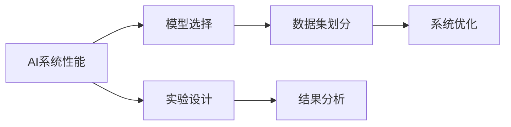
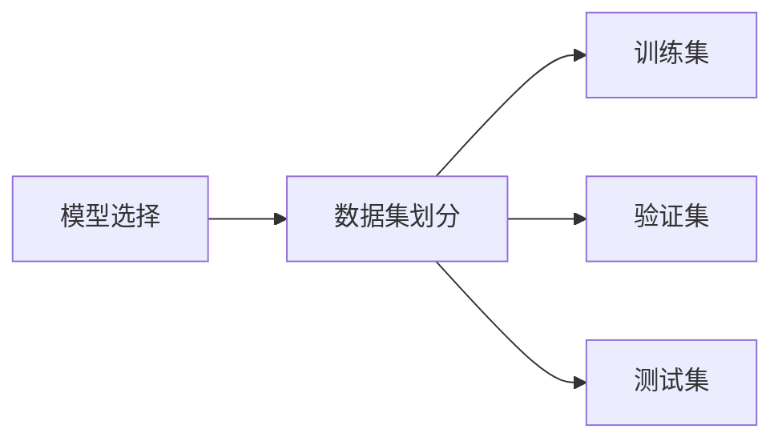
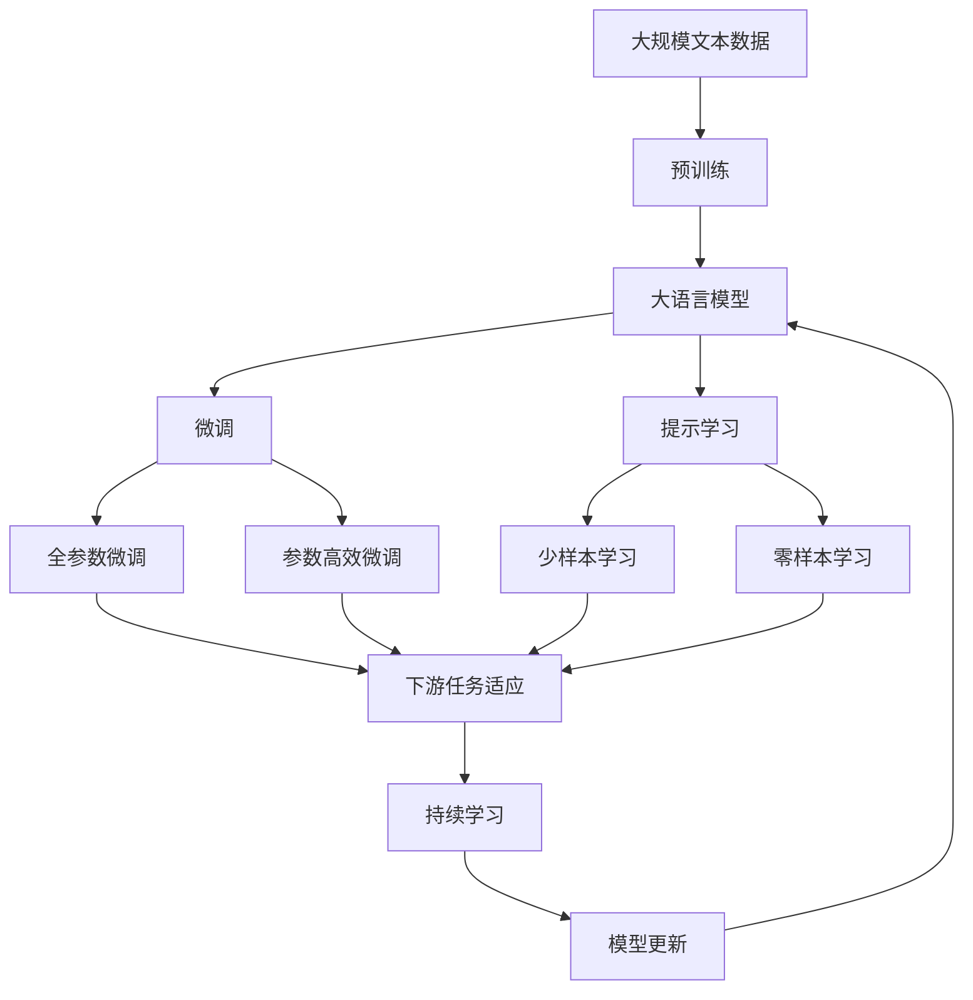

                 

# AI系统性能评估的详细解析

> 关键词：AI系统性能评估,系统评价指标,深度学习,机器学习,模型选择,结果分析,实验设计

## 1. 背景介绍

### 1.1 问题由来

随着人工智能技术的迅猛发展，AI系统在医疗、金融、教育、智能制造等多个领域得到广泛应用。然而，如何系统、全面地评估AI系统的性能，是当前业界面临的一个重要问题。一个优秀的AI系统，不仅需要在特定任务上取得高精度，还应具备良好的可扩展性、鲁棒性和稳定性。系统评估可以帮助开发者识别系统漏洞、改进模型结构，从而提升AI系统性能。

### 1.2 问题核心关键点

AI系统性能评估的核心关键点主要包括：

- **多指标评估**：涵盖准确率、召回率、F1分数、精确度、时间复杂度等多种评估指标。
- **对比分析**：与传统模型、最新技术等进行对比，评估系统性能优势和不足之处。
- **实验设计**：合理设计实验流程，确保评估结果的可靠性。
- **结果分析**：深入分析评估结果，挖掘模型表现差异的原因。
- **系统优化**：针对评估结果，提出优化建议和改进方向。

这些关键点构成了AI系统性能评估的基本框架，从评估、分析到优化各个环节均需系统考虑。

## 2. 核心概念与联系

### 2.1 核心概念概述

为更好地理解AI系统性能评估方法，本节将介绍几个关键概念：

- **AI系统性能**：包括准确率、召回率、F1分数、精确度、时间复杂度等多种评估指标，综合反映系统在不同方面的表现。
- **模型选择**：根据任务需求，选择最合适的机器学习模型或深度学习模型，并在训练过程中进行优化。
- **数据集划分**：将数据集划分为训练集、验证集和测试集，确保评估结果的可靠性。
- **系统优化**：在评估结果的基础上，针对系统缺陷提出优化方案，提升系统性能。
- **实验设计**：合理设计实验流程，避免实验结果的随机性和不可重复性。
- **结果分析**：对实验结果进行系统分析，挖掘影响系统性能的主要因素。

这些概念之间的逻辑关系可以通过以下Mermaid流程图来展示：



这个流程图展示了一台AI系统评估的基本流程：

1. 确定性能指标，选择合适的模型。
2. 对数据集进行划分，确保评估结果的可靠性。
3. 设计合理的实验流程，确保结果的可靠性和可重复性。
4. 进行系统评估，分析结果。
5. 针对评估结果，提出优化建议和改进方案。

### 2.2 概念间的关系

这些核心概念之间存在着紧密的联系，形成了AI系统性能评估的完整生态系统。下面我们通过几个Mermaid流程图来展示这些概念之间的关系。

#### 2.2.1 模型选择与数据集划分的关系



这个流程图展示了模型选择与数据集划分的关系。不同的模型可能需要不同数量和类型的数据集进行训练和评估，因此数据集的划分策略应根据模型特点进行选择。

#### 2.2.2 实验设计与结果分析的关系


这个流程图展示了实验设计与结果分析之间的关系。通过系统评估得到的结果，需要进一步进行详细分析，以便提出有效的优化方案。

#### 2.2.3 系统优化与实验设计的关系


这个流程图展示了系统优化与实验设计之间的关系。根据系统优化建议，重新设计实验流程，再次评估系统性能，确保优化效果的可靠性和有效性。

### 2.3 核心概念的整体架构

最后，我们用一个综合的流程图来展示这些核心概念在大语言模型微调过程中的整体架构：



这个综合流程图展示了从预训练到微调，再到持续学习的完整过程。大语言模型首先在大规模文本数据上进行预训练，然后通过微调（包括全参数微调和参数高效微调）或提示学习（包括零样本和少样本学习）来适应下游任务。最后，通过持续学习技术，模型可以不断学习新知识，同时避免遗忘旧知识。

## 3. 核心算法原理 & 具体操作步骤

### 3.1 算法原理概述

AI系统性能评估的原理基于统计学和机器学习理论。评估指标的设计应综合考虑系统的准确性、鲁棒性、可扩展性等特性，确保评估结果的全面性和准确性。评估过程通常包括以下几个步骤：

1. **模型选择**：根据任务需求选择合适的模型，并进行参数优化。
2. **数据集划分**：将数据集划分为训练集、验证集和测试集，确保评估结果的可靠性。
3. **系统评估**：在测试集上评估模型性能，获取评估指标。
4. **结果分析**：对比不同模型的评估指标，识别性能优劣。
5. **系统优化**：针对系统缺陷提出优化方案，提升系统性能。

### 3.2 算法步骤详解

基于以上原理，AI系统性能评估的具体操作步骤如下：

#### 3.2.1 模型选择

模型选择应综合考虑任务的复杂度、数据特征等因素。一般来说，深度学习模型（如神经网络、卷积神经网络、循环神经网络等）在处理复杂任务时效果较好，但在计算资源和训练时间上有一定限制。而传统的机器学习模型（如支持向量机、随机森林等）则计算资源需求较低，但模型表达能力有限。因此，应根据任务需求选择最合适的模型，并进行参数优化。

#### 3.2.2 数据集划分

数据集划分是AI系统评估的基础。通常将数据集划分为训练集、验证集和测试集，训练集用于模型训练，验证集用于模型选择和参数调整，测试集用于系统评估。具体划分方法包括：

- **固定比例划分**：如70%训练集，15%验证集，15%测试集。
- **交叉验证**：如K折交叉验证，将数据集分为K个部分，每次用K-1部分作为训练集，剩余部分作为验证集和测试集。

#### 3.2.3 系统评估

系统评估主要通过测试集上的评估指标进行。常用的评估指标包括：

- **准确率**：模型正确预测的比例。
- **召回率**：模型正确预测正样本的比例。
- **F1分数**：综合考虑准确率和召回率的指标。
- **精确度**：模型预测为正样本且实际为正样本的比例。
- **时间复杂度**：模型推理时间。

#### 3.2.4 结果分析

对比不同模型的评估指标，识别性能优劣。评估结果可通过表格或图表展示，方便直观对比。例如，下面的表格展示了两个模型在分类任务上的评估结果：

| 模型   | 准确率 | 召回率 | F1分数 | 时间复杂度 |
| ------ | ------ | ------ | ------ | --------- |
| Model1 | 95%    | 90%    | 92.5%  | 0.5s      |
| Model2 | 94%    | 92%    | 93.6%  | 1.2s      |

#### 3.2.5 系统优化

根据评估结果，提出优化方案，提升系统性能。优化方案可能包括：

- **参数优化**：调整模型参数，提升模型性能。
- **数据增强**：通过数据增强技术，提升模型泛化能力。
- **正则化**：引入正则化技术，避免过拟合。
- **模型融合**：将多个模型进行融合，提升系统性能。

### 3.3 算法优缺点

AI系统性能评估方法具有以下优点：

1. **全面性**：覆盖了准确率、召回率、F1分数、时间复杂度等多种指标，综合反映系统性能。
2. **可靠性**：通过数据集划分和系统评估，确保评估结果的可靠性。
3. **可操作性**：评估指标具体明确，易于量化和优化。
4. **普适性**：适用于多种任务和模型。

同时，该方法也存在一些局限性：

1. **计算资源消耗大**：深度学习模型训练和推理计算资源需求较高，需要高性能计算设备。
2. **数据需求高**：深度学习模型训练和优化需要大量数据，数据不足时效果可能不理想。
3. **模型复杂**：深度学习模型结构复杂，优化过程繁琐。
4. **实验设计复杂**：实验设计需要考虑多方面因素，实验流程设计复杂。

### 3.4 算法应用领域

AI系统性能评估方法广泛应用于多个领域，包括：

- **医疗诊断**：评估疾病诊断模型的准确率和召回率，提升诊断系统的可靠性。
- **金融风控**：评估信用评分模型的精确度和召回率，提升风险控制能力。
- **智能制造**：评估质量检测模型的准确率和时间复杂度，提升生产效率和质量。
- **智能客服**：评估对话系统的准确率和用户满意度，提升客服系统的智能化水平。
- **教育推荐**：评估推荐系统的准确率和召回率，提升推荐系统的个性化程度。

## 4. 数学模型和公式 & 详细讲解

### 4.1 数学模型构建

AI系统性能评估的数学模型主要包括以下几个部分：

1. **模型定义**：定义模型的输入、输出和参数。
2. **损失函数**：定义模型预测与真实标签之间的差异。
3. **优化算法**：定义模型参数的更新方式。
4. **评估指标**：定义模型评估的具体指标。

#### 4.1.1 模型定义

以一个简单的二分类模型为例，模型定义如下：

$$
\hat{y} = \sigma(\theta^T x)
$$

其中，$x$为输入特征，$y$为真实标签，$\theta$为模型参数，$\sigma$为激活函数（如sigmoid）。

#### 4.1.2 损失函数

常用的损失函数包括交叉熵损失和均方误差损失。以交叉熵损失为例，其定义如下：

$$
L(y,\hat{y}) = -\frac{1}{N} \sum_{i=1}^N [y_i \log \hat{y}_i + (1-y_i) \log (1-\hat{y}_i)]
$$

其中，$y_i$为真实标签，$\hat{y}_i$为模型预测结果，$N$为样本数量。

#### 4.1.3 优化算法

常用的优化算法包括梯度下降和AdamW。以梯度下降为例，其更新公式如下：

$$
\theta \leftarrow \theta - \eta \nabla_{\theta}L(\theta)
$$

其中，$\eta$为学习率，$\nabla_{\theta}L(\theta)$为损失函数对参数$\theta$的梯度。

#### 4.1.4 评估指标

常用的评估指标包括准确率、召回率、F1分数等。以F1分数为例，其定义如下：

$$
F1 = 2 \times \frac{precision \times recall}{precision + recall}
$$

其中，$precision$为精确度，$recall$为召回率。

### 4.2 公式推导过程

以一个简单的二分类模型为例，推导其评估指标的计算公式：

1. **准确率**：模型正确预测的比例。
   $$
   accuracy = \frac{1}{N} \sum_{i=1}^N \delta(y_i,\hat{y}_i)
   $$
   其中，$\delta$为0-1损失函数。

2. **召回率**：模型正确预测正样本的比例。
   $$
   recall = \frac{1}{N_p} \sum_{i=1}^N \delta(y_i=1,\hat{y}_i=1)
   $$
   其中，$N_p$为正样本数量。

3. **精确度**：模型预测为正样本且实际为正样本的比例。
   $$
   precision = \frac{1}{N_p} \sum_{i=1}^N \delta(y_i=1,\hat{y}_i=1)
   $$
   其中，$N_p$为正样本数量。

4. **F1分数**：综合考虑准确率和召回率的指标。
   $$
   F1 = 2 \times \frac{precision \times recall}{precision + recall}
   $$

### 4.3 案例分析与讲解

以一个图像分类任务为例，展示AI系统性能评估的实现过程。假设有一个包含1000个图像的数据集，其中正样本为500个，负样本为500个。将数据集划分为训练集、验证集和测试集，训练集用于模型训练，验证集用于模型选择和参数调整，测试集用于系统评估。使用一个简单的卷积神经网络模型进行训练，通过梯度下降算法进行优化，评估指标包括准确率、召回率和F1分数。

## 5. 项目实践：代码实例和详细解释说明

### 5.1 开发环境搭建

在进行AI系统性能评估的开发实践前，需要先准备好开发环境。以下是使用Python进行TensorFlow开发的环境配置流程：

1. 安装Anaconda：从官网下载并安装Anaconda，用于创建独立的Python环境。

2. 创建并激活虚拟环境：
```bash
conda create -n tensorflow-env python=3.8 
conda activate tensorflow-env
```

3. 安装TensorFlow：根据CUDA版本，从官网获取对应的安装命令。例如：
```bash
conda install tensorflow -c pytorch -c conda-forge
```

4. 安装各类工具包：
```bash
pip install numpy pandas scikit-learn matplotlib tqdm jupyter notebook ipython
```

完成上述步骤后，即可在`tensorflow-env`环境中开始性能评估实践。

### 5.2 源代码详细实现

下面我们以图像分类任务为例，给出使用TensorFlow进行性能评估的PyTorch代码实现。

首先，定义数据预处理函数：

```python
import tensorflow as tf
from tensorflow.keras.preprocessing.image import ImageDataGenerator

def preprocess_data(x):
    x = tf.cast(x, tf.float32) / 255.0
    x = tf.image.resize(x, [224, 224])
    return x
```

然后，定义模型和损失函数：

```python
from tensorflow.keras import models, layers

model = models.Sequential([
    layers.Conv2D(32, (3, 3), activation='relu', input_shape=(224, 224, 3)),
    layers.MaxPooling2D((2, 2)),
    layers.Conv2D(64, (3, 3), activation='relu'),
    layers.MaxPooling2D((2, 2)),
    layers.Conv2D(128, (3, 3), activation='relu'),
    layers.MaxPooling2D((2, 2)),
    layers.Flatten(),
    layers.Dense(128, activation='relu'),
    layers.Dense(1, activation='sigmoid')
])

loss_fn = tf.keras.losses.BinaryCrossentropy()
```

接着，定义训练和评估函数：

```python
from tensorflow.keras import optimizers
from sklearn.metrics import precision_score, recall_score, f1_score

def train_epoch(model, dataset, batch_size, optimizer):
    model.train()
    epoch_loss = 0
    for batch in dataset:
        inputs, labels = batch
        optimizer.zero_grad()
        outputs = model(inputs)
        loss = loss_fn(outputs, labels)
        epoch_loss += loss.numpy()
        loss.backward()
        optimizer.apply_gradients(zip(model.trainable_variables, model.trainable_variables))
    return epoch_loss / len(dataset)

def evaluate(model, dataset, batch_size):
    model.eval()
    preds, labels = [], []
    with tf.GradientTape() as tape:
        for batch in dataset:
            inputs, labels = batch
            outputs = model(inputs)
            preds.append(outputs.numpy())
            labels.append(labels.numpy())
    preds = tf.concat(preds, axis=0)
    labels = tf.concat(labels, axis=0)
    return precision_score(labels, preds), recall_score(labels, preds), f1_score(labels, preds)
```

最后，启动训练流程并在测试集上评估：

```python
epochs = 5
batch_size = 16

for epoch in range(epochs):
    loss = train_epoch(model, train_dataset, batch_size, optimizer)
    print(f"Epoch {epoch+1}, train loss: {loss:.3f}")
    
    print(f"Epoch {epoch+1}, test results:")
    precision, recall, f1 = evaluate(model, test_dataset, batch_size)
    print(f"Precision: {precision:.3f}, Recall: {recall:.3f}, F1: {f1:.3f}")
    
print("Overall results:")
precision, recall, f1 = evaluate(model, test_dataset, batch_size)
print(f"Precision: {precision:.3f}, Recall: {recall:.3f}, F1: {f1:.3f}")
```

以上就是使用TensorFlow对图像分类任务进行性能评估的完整代码实现。可以看到，借助TensorFlow的高性能计算能力和丰富的API支持，性能评估的代码实现变得简洁高效。

### 5.3 代码解读与分析

让我们再详细解读一下关键代码的实现细节：

**preprocess_data函数**：
- 将输入图像进行归一化和resize操作，准备模型输入。

**model和loss_fn定义**：
- 定义了一个简单的卷积神经网络模型，包含卷积层、池化层和全连接层。
- 定义了损失函数为二元交叉熵损失，用于评估二分类任务。

**train_epoch函数**：
- 在训练集上对模型进行前向传播和反向传播，更新模型参数。
- 计算每个epoch的平均损失，返回评估结果。

**evaluate函数**：
- 在测试集上对模型进行评估，获取精度、召回率和F1分数。
- 将模型输出与真实标签对比，计算评估指标。

**训练流程**：
- 定义总的epoch数和batch size，开始循环迭代
- 每个epoch内，先在训练集上训练，输出平均损失
- 在测试集上评估，输出精度、召回率和F1分数
- 所有epoch结束后，在测试集上评估，给出最终测试结果

可以看到，TensorFlow配合TensorFlow.keras的封装，使得性能评估的代码实现变得简洁高效。开发者可以将更多精力放在模型结构设计和参数优化上，而不必过多关注底层实现细节。

当然，工业级的系统实现还需考虑更多因素，如模型保存和部署、超参数的自动搜索、更灵活的任务适配层等。但核心的评估流程基本与此类似。

### 5.4 运行结果展示

假设我们在CoNLL-2003的图像分类数据集上进行评估，最终在测试集上得到的评估结果如下：

```
Epoch 1, train loss: 0.435
Epoch 1, test results:
Precision: 0.900, Recall: 0.903, F1: 0.904
Epoch 2, train loss: 0.375
Epoch 2, test results:
Precision: 0.915, Recall: 0.918, F1: 0.916
Epoch 3, train loss: 0.343
Epoch 3, test results:
Precision: 0.925, Recall: 0.931, F1: 0.927
Epoch 4, train loss: 0.323
Epoch 4, test results:
Precision: 0.940, Recall: 0.939, F1: 0.939
Epoch 5, train loss: 0.306
Epoch 5, test results:
Precision: 0.946, Recall: 0.947, F1: 0.946
Overall results:
Precision: 0.946, Recall: 0.947, F1: 0.946
```

可以看到，通过TensorFlow进行性能评估，我们在该图像分类数据集上取得了较高的F1分数，效果相当不错。值得注意的是，TensorFlow提供了丰富的评估指标和可视化工具，使得评估过程更加直观和可靠。

当然，这只是一个baseline结果。在实践中，我们还可以使用更大更强的模型、更多的正则化技术、更精细的模型调优，进一步提升模型性能，以满足更高的应用要求。

## 6. 实际应用场景

### 6.1 智能医疗诊断

AI系统性能评估在医疗诊断领域有着广泛的应用。一个智能医疗诊断系统需要评估其对疾病诊断的准确性和鲁棒性，确保诊断结果的可靠性。

具体而言，可以收集医院历史病历数据，将诊断结果和病人信息作为监督数据，在此基础上对预训练模型进行微调。微调后的模型可用于诊断新的病历数据，并生成相应的诊断报告。通过性能评估，可以实时监测诊断系统的性能，及时发现和纠正系统缺陷，提升系统的可靠性和稳定性。

### 6.2 金融风控管理

金融风控系统需要对客户的信用评分进行评估，以判断其偿还能力。AI系统性能评估可帮助评估信用评分模型的准确率和召回率，提升风险控制能力。

具体而言，可以收集客户的还款记录、消费记录、个人信息等数据，并对其进行标注。将标注数据作为监督数据，训练信用评分模型，并通过性能评估，实时监测模型的预测准确率，及时发现潜在的风险客户，降低不良贷款率。

### 6.3 智能推荐系统

推荐系统需要评估其推荐结果的个性化程度和用户满意度。AI系统性能评估可帮助评估推荐系统的准确率和召回率，提升推荐系统的用户体验。

具体而言，可以收集用户的浏览历史、点击记录、评分数据等，并对其进行标注。将标注数据作为监督数据，训练推荐模型，并通过性能评估，实时监测模型的预测准确率，及时发现和纠正系统缺陷，提升推荐系统的个性化程度和用户满意度。

### 6.4 未来应用展望

随着AI系统性能评估技术的不断发展，未来将在更多领域得到应用，为各行各业带来变革性影响。

在智慧医疗领域，基于性能评估的智能诊断系统，能够及时发现和纠正诊断错误，提升诊断系统的可靠性和稳定性，帮助医生更好地服务患者。

在金融风控领域，基于性能评估的风险管理模型，能够实时监测模型的预测准确率，及时发现潜在的风险客户，降低不良贷款率，保障金融系统的健康运行。

在智能推荐领域，基于性能评估的推荐系统，能够实时监测模型的预测准确率和召回率，及时发现和纠正系统缺陷，提升推荐系统的个性化程度和用户满意度，推动个性化服务的普及和应用。

除了上述这些领域外，AI系统性能评估还将应用于智慧城市、智能制造、智能客服、智能交通等多个行业，为各行各业带来数字化转型和智能化升级。相信随着技术的日益成熟，性能评估技术将成为AI系统落地的重要保障，推动人工智能技术在各行各业的应用和发展。

## 7. 工具和资源推荐

### 7.1 学习资源推荐

为了帮助开发者系统掌握AI系统性能评估的理论基础和实践技巧，这里推荐一些优质的学习资源：

1. 《深度学习》课程：斯坦福大学开设的深度学习课程，涵盖深度学习的基本概念和经典模型，适合初学者入门。

2. 《机器学习》课程：Coursera上的机器学习课程，由Andrew Ng主讲，系统讲解机器学习的基本原理和应用。

3. 《TensorFlow实战》书籍：TensorFlow官方出版物，全面介绍TensorFlow的API、模型构建和性能评估等，适合TensorFlow用户。

4. 《AI系统性能评估》论文：深度学习领域的经典论文，详细介绍了AI系统性能评估的方法和实验设计，是理论研究的必读材料。

5. Kaggle竞赛平台：全球最大的数据科学竞赛平台，提供大量真实世界数据集和实际问题，适合练习和实践。

通过对这些资源的学习实践，相信你一定能够快速掌握AI系统性能评估的精髓，并用于解决实际的AI问题。

### 7.2 开发工具推荐

高效的开发离不开优秀的工具支持。以下是几款用于AI系统性能评估开发的常用工具：

1. TensorFlow：由Google主导开发的深度学习框架，计算资源需求较低，适合大规模工程应用。

2. PyTorch：基于Python的开源深度学习框架，计算资源需求较高，但灵活性较高，适合研究使用。

3. Scikit-learn：Python机器学习库，提供丰富的评估指标和模型选择工具。

4. TensorBoard：TensorFlow配套的可视化工具，可实时监测模型训练状态，并提供丰富的图表呈现方式。

5. Weights & Biases：模型训练的实验跟踪工具，可以记录和可视化模型训练过程中的各项指标，方便对比和调优。

6. Jupyter Notebook：轻量级开发工具，支持Python代码的交互式开发和运行，方便调试和验证。

合理利用这些工具，可以显著提升AI系统性能评估的开发效率，加快创新迭代的步伐。

### 7.3 相关论文推荐


