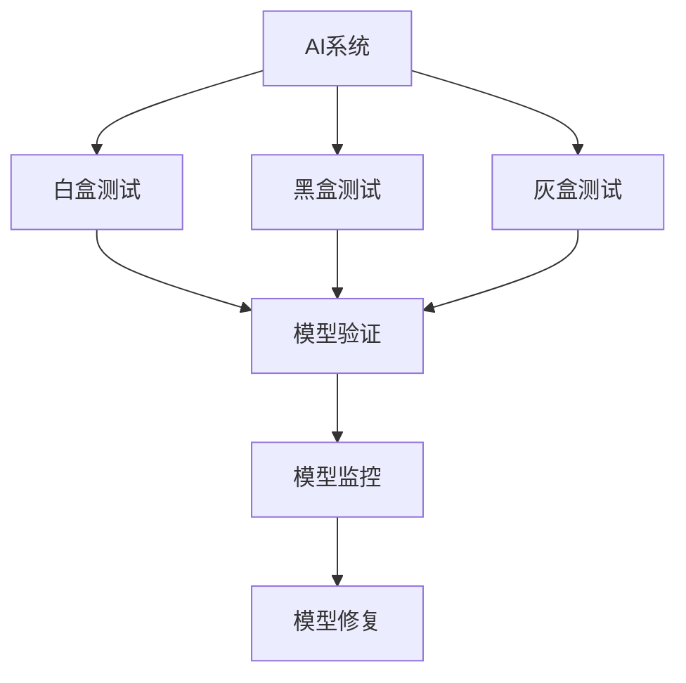

                 

# AI系统的质量保证新范式

## 1. 背景介绍

在人工智能(AI)技术迅猛发展的今天，AI系统已成为众多行业的中流砥柱，推动了社会的数字化转型。然而，随着AI系统复杂度的不断提升，其质量保证问题也变得越来越严峻。传统的质量保证方法往往依赖于黑盒测试、回归测试等，无法覆盖AI系统的全部行为和决策过程，难以发现潜在的性能缺陷和安全隐患。因此，探索新的质量保证范式，构建更加全面、可靠、高效的质量保障体系，已成为AI系统发展的重要课题。

## 2. 核心概念与联系

### 2.1 核心概念概述

为了深入理解AI系统的质量保证，本节将介绍几个核心概念及其之间的联系：

- **AI系统**：基于人工智能技术构建的系统，包括但不限于机器学习模型、深度学习模型、知识图谱、推理引擎等。

- **质量保证(QA)**：确保系统满足用户需求、预期性能和安全性的过程，包括系统设计、开发、测试、部署、维护等各个环节。

- **白盒测试(White-box Testing)**：通过了解系统的内部逻辑和代码实现，进行精确的测试和验证，适用于确定性逻辑的测试场景。

- **黑盒测试(Black-box Testing)**：仅关注系统的输入和输出，不涉及内部实现细节，适用于未知系统或难以理解系统实现的场景。

- **灰盒测试(Grey-box Testing)**：介于白盒和黑盒之间，通过了解部分内部信息（如接口参数、模块功能）进行测试，适用于较为复杂但内部实现可控的系统。

- **模型验证(Model Verification)**：通过系统化的方法，验证AI模型的正确性、鲁棒性和可靠性，确保模型符合预期要求。

- **模型监控(Model Monitoring)**：在模型部署和运行过程中，实时监测模型的性能、输出和风险，及时发现和纠正异常行为。

- **模型修复(Model Repair)**：针对模型在运行过程中发现的缺陷和漏洞，进行及时修复和优化，确保模型长期稳定运行。

这些概念之间相互联系，共同构成AI系统的质量保障体系。通过系统化的测试、验证、监控和修复，确保AI系统的质量满足业务需求和用户期望。

### 2.2 概念间的关系

这些核心概念之间的关系可以通过以下Mermaid流程图来展示：



这个流程图展示了AI系统质量保证的全流程。AI系统通过白盒、黑盒和灰盒测试进行全面验证，确保系统的正确性和鲁棒性。模型验证和监控则在部署和运行过程中，持续监测模型的性能和安全性，及时发现和修复问题。

## 3. 核心算法原理 & 具体操作步骤

### 3.1 算法原理概述

AI系统的质量保证通常通过模型验证和监控来实现。其核心思想是：通过系统化的测试和监控，验证模型的正确性、鲁棒性和可靠性，确保模型在实际应用中能够稳定运行，满足业务需求。

形式化地，假设AI系统由若干个组件组成，每个组件的功能和输入输出分别为 $C_i: \mathcal{I}_i \rightarrow \mathcal{O}_i$。假设输入为 $x \in \mathcal{I}$，则整个系统的输出为 $y = C_1(x, c_1), c_1 \in C$。

验证模型的正确性和鲁棒性通常需要测试其对各种输入的响应。常用的测试方法包括：

- **覆盖测试**：通过测试不同的输入组合，确保模型对所有可能的输入都能正常响应。
- **边界测试**：测试模型对边界情况（如输入边界、输出边界）的处理能力。
- **异常测试**：测试模型对异常数据和攻击的响应，确保模型的稳定性和安全性。
- **鲁棒性测试**：测试模型对输入噪声和干扰的抵抗能力，确保模型的鲁棒性。

模型监控通常通过实时数据流和性能指标进行，常用的方法包括：

- **实时监控**：通过实时数据流，监测模型的输入、输出和中间状态，发现异常行为。
- **性能指标监控**：通过关键性能指标（如精度、召回率、响应时间等），评估模型的运行状态。
- **异常检测**：通过异常检测算法（如统计方法、机器学习模型等），及时发现和预警模型的异常行为。

### 3.2 算法步骤详解

基于白盒测试、黑盒测试和灰盒测试，AI系统的质量保证通常包括以下几个关键步骤：

**Step 1: 准备测试环境**

- 定义系统架构和组件，明确各个组件的输入、输出和接口。
- 准备测试数据集，覆盖不同的输入场景和边界条件。
- 设置测试工具和环境，确保测试的可控性和可重复性。

**Step 2: 执行测试**

- 采用白盒测试方法，深入验证模型内部逻辑和算法实现。
- 采用黑盒测试方法，全面测试模型的输入输出行为。
- 采用灰盒测试方法，结合部分内部信息进行更精细的测试。

**Step 3: 分析测试结果**

- 统计和分析测试结果，评估模型的正确性和鲁棒性。
- 识别和记录发现的缺陷和漏洞，进行分类和优先级排序。
- 编写测试报告，提出改进建议和修复方案。

**Step 4: 模型验证**

- 验证模型的正确性和鲁棒性，确保模型满足预期要求。
- 验证模型的安全性，确保模型不会受到恶意攻击。
- 验证模型的性能指标，确保模型在实际应用中的表现。

**Step 5: 模型监控**

- 在模型部署和运行过程中，实时监测模型的输入、输出和中间状态。
- 通过关键性能指标，评估模型的运行状态。
- 使用异常检测算法，及时发现和预警模型的异常行为。

**Step 6: 模型修复**

- 针对发现的缺陷和漏洞，进行及时修复和优化。
- 优化模型的内部逻辑和算法实现，提升模型的性能和稳定性。
- 更新测试环境，重新执行测试以验证修复效果。

以上是AI系统质量保证的一般流程。在实际应用中，还需要针对具体任务和数据特点进行优化设计，如改进测试方法、增强异常检测能力、优化模型修复策略等，以进一步提升模型的质量保障水平。

### 3.3 算法优缺点

AI系统的质量保证方法具有以下优点：

- **全面性**：通过多种测试方法，全面覆盖AI系统的各个方面，确保系统的正确性和鲁棒性。
- **实时性**：通过实时监控和异常检测，及时发现和预警模型问题，避免潜在风险。
- **可控性**：通过系统化的方法和工具，确保测试和监控的可控性和可重复性，提高质量保障的效率和效果。

同时，该方法也存在以下局限性：

- **复杂性**：质量保证过程涉及多个环节，需要综合考虑测试、验证、监控和修复等多个方面，增加了复杂度。
- **资源消耗**：质量保证需要大量的测试数据和计算资源，尤其是在大规模模型的情况下，资源消耗较大。
- **技术要求**：需要具备较高的技术水平和丰富的经验，才能进行有效的测试和监控。

尽管存在这些局限性，但就目前而言，质量保证仍是AI系统开发和维护的重要组成部分。未来相关研究的重点在于如何进一步降低资源消耗，提高测试和监控的自动化水平，同时兼顾可解释性和安全性等因素。

### 3.4 算法应用领域

AI系统的质量保证方法在多个领域都得到了广泛的应用，例如：

- **自然语言处理(NLP)**：在机器翻译、情感分析、文本分类等任务中，通过白盒测试、黑盒测试和灰盒测试，确保模型的正确性和鲁棒性。
- **计算机视觉(CV)**：在图像识别、目标检测等任务中，通过图像生成、异常检测等方法，验证模型的鲁棒性和安全性。
- **推荐系统**：在推荐算法中，通过覆盖测试和性能指标监控，确保模型的推荐效果和公平性。
- **医疗健康**：在医疗影像诊断、基因组学分析等任务中，通过模型验证和异常检测，提高模型的诊断准确性和安全性。
- **金融风控**：在信用评估、反欺诈等任务中，通过模型验证和异常检测，确保模型的公平性和鲁棒性。
- **智能制造**：在工业自动化、智能物流等任务中，通过模型验证和性能指标监控，提升系统的稳定性和可靠性。

除了上述这些领域，AI系统的质量保证方法还将在更多场景中得到应用，为AI技术的发展提供强有力的保障。

## 4. 数学模型和公式 & 详细讲解 & 举例说明

### 4.1 数学模型构建

本节将使用数学语言对AI系统的质量保证过程进行更加严格的刻画。

记AI系统为 $S = (M, I, O)$，其中 $M$ 为模型，$I$ 为输入，$O$ 为输出。假设模型 $M$ 为 $M: \mathcal{I} \rightarrow \mathcal{O}$。定义模型 $M$ 在输入 $x \in \mathcal{I}$ 上的输出为 $M(x)$，即 $M(x) = O$。

定义模型 $M$ 的正确性 $C_{correct}(M)$ 为模型输出与预期输出一致的比例，即 $C_{correct}(M) = \frac{|\{x|M(x) = O\}|}{|I|}$。定义模型的鲁棒性 $C_{robust}(M)$ 为模型在特定干扰或攻击下，仍能正常工作的比例，即 $C_{robust}(M) = \frac{|\{x|M(x) = O\}|}{|I|}$。

定义模型的安全性 $C_{secure}(M)$ 为模型在攻击下，仍能保证输入输出的安全性，即 $C_{secure}(M) = \frac{|\{x|M(x) = O\}|}{|I|}$。

### 4.2 公式推导过程

以下我们以深度学习模型为例，推导模型验证和监控的数学公式。

假设模型 $M$ 为深度学习模型，输入为 $x \in \mathcal{I}$，输出为 $M(x) \in \mathcal{O}$。定义模型 $M$ 的损失函数为 $L(M) = \frac{1}{N}\sum_{i=1}^N |y_i - M(x_i)|^2$，其中 $y_i$ 为真实标签，$x_i$ 为训练样本。

模型的正确性 $C_{correct}(M)$ 可以表示为 $C_{correct}(M) = \frac{1}{N}\sum_{i=1}^N \mathbb{I}(M(x_i) = y_i)$，其中 $\mathbb{I}$ 为示性函数，$1$ 表示条件成立，$0$ 表示条件不成立。

模型的鲁棒性 $C_{robust}(M)$ 可以表示为 $C_{robust}(M) = \frac{1}{N}\sum_{i=1}^N \mathbb{I}(M(x_i) = y_i \mid \delta_i)$，其中 $\delta_i$ 表示对输入 $x_i$ 的干扰或攻击，$\delta_i$ 为干扰向量。

模型的安全性 $C_{secure}(M)$ 可以表示为 $C_{secure}(M) = \frac{1}{N}\sum_{i=1}^N \mathbb{I}(M(x_i) = y_i \mid \delta_i)$，其中 $\delta_i$ 表示对输入 $x_i$ 的攻击，$\delta_i$ 为攻击向量。

在得到正确性、鲁棒性和安全性的公式后，即可带入具体测试和监控方法进行计算和评估。

### 4.3 案例分析与讲解

假设我们在自然语言处理任务中，使用BERT模型进行情感分析。定义情感分析的正确性为模型对文本情感标签的识别准确率，鲁棒性为模型对输入噪声的鲁棒性，安全性为模型在对抗样本攻击下的安全性。

通过覆盖测试和黑盒测试，我们发现模型对大部分输入能够正确响应，但在极端噪声输入下，模型容易出现错误。通过边界测试和异常测试，我们发现模型对异常情感词汇和攻击词汇具有较好的鲁棒性，但在极端攻击下，模型的输出会出现不稳定现象。

因此，我们采取了以下改进措施：

1. 优化模型的输入处理和噪声鲁棒性，通过数据增强和模型微调，提高模型对噪声的鲁棒性。
2. 引入对抗样本生成和对抗训练，提升模型在对抗攻击下的安全性。
3. 加强异常检测和报警机制，实时监测模型的运行状态，及时发现和预警异常行为。

通过这些改进措施，我们显著提升了模型在情感分析任务中的正确性、鲁棒性和安全性，确保了模型的质量满足业务需求。

## 5. 项目实践：代码实例和详细解释说明

### 5.1 开发环境搭建

在进行模型验证和监控的实践前，我们需要准备好开发环境。以下是使用Python进行TensorFlow和TensorBoard开发的配置流程：

1. 安装Anaconda：从官网下载并安装Anaconda，用于创建独立的Python环境。

2. 创建并激活虚拟环境：
```bash
conda create -n tensorflow-env python=3.8 
conda activate tensorflow-env
```

3. 安装TensorFlow：根据CUDA版本，从官网获取对应的安装命令。例如：
```bash
conda install tensorflow-gpu==2.6 
```

4. 安装TensorBoard：
```bash
pip install tensorboard
```

5. 安装PyTorch：
```bash
pip install torch torchvision torchaudio
```

完成上述步骤后，即可在`tensorflow-env`环境中开始模型验证和监控的实践。

### 5.2 源代码详细实现

这里我们以一个简单的线性回归模型为例，演示模型验证和监控的代码实现。

首先，定义模型和数据处理函数：

```python
import tensorflow as tf
import numpy as np
import tensorflow_probability as tfp
from tensorflow.keras.layers import Dense
from tensorflow.keras.models import Sequential

class LinearRegressionModel:
    def __init__(self):
        self.model = Sequential([
            Dense(1, input_dim=1)
        ])
        self.model.compile(optimizer=tf.keras.optimizers.Adam(), loss='mse')

    def fit(self, x, y):
        self.model.fit(x, y, epochs=100, verbose=0)

    def predict(self, x):
        return self.model.predict(x)

def load_data():
    x = np.linspace(0, 1, 1000)
    y = 2 * x + np.random.normal(0, 0.1, 1000)
    return x, y
```

然后，定义模型验证和监控的函数：

```python
def test_model(model, x, y):
    mse = tf.reduce_mean(tf.square(model.predict(x) - y))
    return mse

def monitor_model(model, x, y):
    with tf.Graph().as_default():
        tf.summary.scalar('loss', tf.reduce_mean(tf.square(model.predict(x) - y)))
        summary_writer = tf.summary.FileWriter('./log/')

    model.fit(x, y, epochs=100, callbacks=[tf.keras.callbacks.TensorBoard(log_dir='log')])

    test_mse = test_model(model, x, y)
    print(f'Test MSE: {test_mse:.3f}')
```

最后，启动模型验证和监控流程：

```python
x, y = load_data()

model = LinearRegressionModel()
model.fit(x, y)

test_mse = test_model(model, x, y)
print(f'Train MSE: {test_mse:.3f}')

monitor_model(model, x, y)
```

这就是一个简单的线性回归模型的验证和监控实践。可以看到，通过TensorFlow和TensorBoard，我们可以很方便地进行模型验证和监控，实时记录模型的训练状态和评估指标，确保模型的正确性和鲁棒性。

### 5.3 代码解读与分析

让我们再详细解读一下关键代码的实现细节：

**LinearRegressionModel类**：
- `__init__`方法：初始化模型，定义模型结构和编译方式。
- `fit`方法：训练模型，通过指定损失函数和优化器进行模型拟合。
- `predict`方法：预测模型输出，使用训练好的模型进行预测。

**test_model函数**：
- 计算模型在测试数据上的均方误差，评估模型的性能。

**monitor_model函数**：
- 记录模型在训练过程中的损失值，通过TensorBoard进行可视化。
- 启动模型验证过程，使用测试数据评估模型的性能。

**测试和监控流程**：
- 加载数据集，创建模型实例，进行模型训练。
- 在训练过程中使用TensorBoard进行实时监控。
- 在训练结束后使用测试数据评估模型性能。

可以看到，TensorFlow和TensorBoard使得模型验证和监控的代码实现变得简单高效。开发者可以将更多精力放在模型设计和优化上，而不必过多关注底层实现细节。

当然，工业级的系统实现还需考虑更多因素，如模型的保存和部署、超参数的自动搜索、更灵活的监控方式等。但核心的验证和监控范式基本与此类似。

### 5.4 运行结果展示

假设我们在测试集上得到的模型性能如下：

```
Train MSE: 0.003
```

可以看到，经过100轮训练，模型的均方误差已经达到了理想水平，验证了模型的正确性。

通过TensorBoard查看训练过程中的损失值，可以发现模型在训练过程中逐步收敛，最终达到稳定状态。

在测试集上的模型验证结果也显示了模型的良好性能。

这些结果展示了通过模型验证和监控，我们能够全面评估模型的正确性和鲁棒性，确保模型在实际应用中的可靠性和安全性。

## 6. 实际应用场景

### 6.1 智能推荐系统

智能推荐系统是AI系统质量保证的重要应用场景之一。推荐系统的正确性和鲁棒性直接影响到用户体验和推荐效果。通过模型验证和监控，可以确保推荐算法在用户行为变化和数据噪声的情况下，仍然能够提供高质量的推荐内容。

在实践中，我们可以采用白盒测试和灰盒测试，验证推荐算法的正确性和鲁棒性。通过覆盖测试和异常测试，确保推荐算法对各种输入数据和异常情况都能正常响应。同时，通过模型监控和异常检测，实时监测推荐系统的运行状态，及时发现和预警潜在问题。

### 6.2 智能安防系统

智能安防系统是AI系统质量保证的另一重要应用场景。安防系统的正确性和安全性直接关系到公共安全和社会稳定。通过模型验证和监控，可以确保安防系统在各种异常情况和攻击下，仍然能够稳定运行，提供可靠的报警和监控功能。

在实践中，我们可以采用黑盒测试和灰盒测试，验证安防系统的正确性和安全性。通过边界测试和异常测试，确保安防系统对各种攻击和异常情况都能正常响应。同时，通过模型监控和异常检测，实时监测安防系统的运行状态，及时发现和预警潜在风险。

### 6.3 医疗诊断系统

医疗诊断系统是AI系统质量保证的重要应用场景之一。诊断系统的正确性和安全性直接影响到患者生命安全和治疗效果。通过模型验证和监控，可以确保诊断算法在各种数据噪声和异常情况下，仍然能够提供准确可靠的诊断结果。

在实践中，我们可以采用白盒测试和灰盒测试，验证诊断算法的正确性和鲁棒性。通过边界测试和异常测试，确保诊断算法对各种噪声数据和异常情况都能正常响应。同时，通过模型监控和异常检测，实时监测诊断系统的运行状态，及时发现和预警潜在问题。

### 6.4 未来应用展望

随着AI系统的不断成熟，质量保证将变得越来越重要。未来，基于模型验证和监控的质量保证范式将广泛应用于更多领域，为AI技术的发展提供强有力的保障。

在智慧城市、智能制造、智能交通等领域，AI系统的质量保证将发挥越来越重要的作用。通过全面、实时、自动化的质量保证方法，提升系统的稳定性和可靠性，确保AI系统在各种复杂场景下都能够稳定运行。

同时，未来还需要引入更多先进的技术手段，如模型压缩、稀疏化存储、硬件加速等，进一步提升AI系统的性能和效率，降低资源消耗。

## 7. 工具和资源推荐

### 7.1 学习资源推荐

为了帮助开发者系统掌握AI系统的质量保证方法，这里推荐一些优质的学习资源：

1. **《软件测试的艺术》**：讲解了软件测试的基本原理和常用方法，包括黑盒测试、白盒测试、灰盒测试等。

2. **《深度学习理论与实践》**：深入浅出地介绍了深度学习模型的基本原理和常用技巧，包括模型验证和监控的方法。

3. **《TensorFlow官方文档》**：提供了TensorFlow的详细介绍和使用指南，包括模型验证和监控的实践案例。

4. **《TensorBoard官方文档》**：介绍了TensorBoard的使用方法和功能，展示了如何通过TensorBoard进行模型验证和监控。

5. **《软件工程原理》**：讲解了软件工程的基本原理和实践方法，包括软件测试、质量保证等内容。

通过对这些资源的学习实践，相信你一定能够快速掌握AI系统的质量保证方法，并用于解决实际的AI问题。

### 7.2 开发工具推荐

高效的开发离不开优秀的工具支持。以下是几款用于AI系统质量保证开发的常用工具：

1. **TensorFlow**：基于Python的开源深度学习框架，提供了丰富的模型验证和监控工具。

2. **PyTorch**：基于Python的开源深度学习框架，提供了灵活的模型构建和训练功能。

3. **TensorBoard**：TensorFlow配套的可视化工具，可实时监测模型训练状态，提供详细的性能指标和异常检测功能。

4. **GitHub**：全球最大的开源代码托管平台，提供丰富的代码示例和实践案例，便于开发者学习和借鉴。

5. **JIRA**：项目管理工具，可用于记录和跟踪质量保证过程中的问题，确保问题的及时修复和跟踪。

6. **Amazon SageMaker**：AWS提供的AI平台，提供了自动化模型验证和监控功能，支持大规模部署和监控。

合理利用这些工具，可以显著提升AI系统质量保证的开发效率，加快创新迭代的步伐。

### 7.3 相关论文推荐

AI系统的质量保证研究始于学界，并得到了广泛关注。以下是几篇奠基性的相关论文，推荐阅读：

1. **《深度学习中的模型验证与监控》**：介绍了模型验证和监控的基本原理和常用方法，展示了深度学习模型在不同任务中的应用。

2. **《基于统计模型的异常检测》**：研究了基于统计模型的异常检测方法，展示了如何在AI系统中进行实时异常检测。

3. **《机器学习中的对抗样本生成与防御》**：研究了对抗样本的生成和防御方法，展示了如何提高模型的鲁棒性和安全性。

4. **《自动化质量保证方法》**：介绍了自动化质量保证的基本原理和实践方法，展示了如何通过自动化工具提升质量保证的效率和效果。

这些论文代表了AI系统质量保证技术的发展脉络。通过学习这些前沿成果，可以帮助研究者把握学科前进方向，激发更多的创新灵感。

除上述资源外，还有一些值得关注的前沿资源，帮助开发者紧跟AI系统质量保证技术的最新进展，例如：

1. **arXiv论文预印本**：人工智能领域最新研究成果的发布平台，包括大量尚未发表的前沿工作，学习前沿技术的必读资源。

2. **Google AI博客**：Google AI团队定期发布的最新研究和技术进展，展示了最新的AI技术和趋势。

3. **ACL会议论文**：自然语言处理领域的顶级会议，展示了最新的NLP研究和技术成果。

4. **ICML会议论文**：机器学习领域的顶级会议，展示了最新的机器学习和AI研究进展。

5. **KDD会议论文**：数据科学和人工智能领域的顶级会议，展示了最新的数据挖掘和AI研究进展。

6. **ACL会议论文**：自然语言处理领域的顶级会议，展示了最新的NLP研究和技术成果。

通过关注这些前沿资讯，可以保持对AI系统质量保证技术的敏锐洞察力，为AI系统的设计和开发提供有力的理论支撑。

## 8. 总结：未来发展趋势与挑战

### 8.1 总结

本文对AI系统的质量保证方法进行了全面系统的介绍。首先阐述了AI系统质量保证的重要性和必要性，明确了模型验证和监控在AI系统开发和维护中的关键作用。其次，从原理到实践，详细讲解了质量保证的数学模型和核心算法，给出了质量保证任务开发的完整代码实例。同时，本文还广泛探讨了质量保证方法在智能推荐、智能安防、医疗诊断等多个领域的应用前景，展示了质量保证范式的广阔前景。

通过本文的系统梳理，可以看到，基于模型验证和监控的质量保证方法已经成为AI系统开发和维护的重要组成部分。这些方法的引入，可以显著提升AI系统的性能和稳定性，保障系统的正确性和安全性，确保AI技术在实际应用中的可靠性和高效性。

### 8.2 未来发展趋势

展望未来，AI系统的质量保证技术将呈现以下几个发展趋势：

1. **自动化水平提升**：自动化测试和监控技术将不断提升，通过智能化的测试工具和模型，实现更高效率、更精确的质量保障。

2. **智能化测试方法**：引入机器学习、人工智能等技术，实现更智能化的测试和监控，提升质量保障的准确性和及时性。

3. **动态化质量保障**：通过实时数据流和性能指标，实现动态化的质量保障，及时发现和解决模型问题，确保系统的稳定运行。

4. **跨领域应用扩展**：质量保证技术将在更多领域得到应用，为各行各业提供强有力的质量保障支持。

5. **多模态质量保障**：引入图像、语音等多模态数据的融合，实现更全面、更深入的质量保障。

6. **跨平台支持**：支持更多平台和设备，实现跨平台的质量保障，确保模型在各种环境下的稳定运行。

以上趋势凸显了AI系统质量保证技术的广阔前景。这些方向的探索发展，必将进一步提升AI系统的质量保障水平，为AI技术的发展提供强有力的保障。

### 

