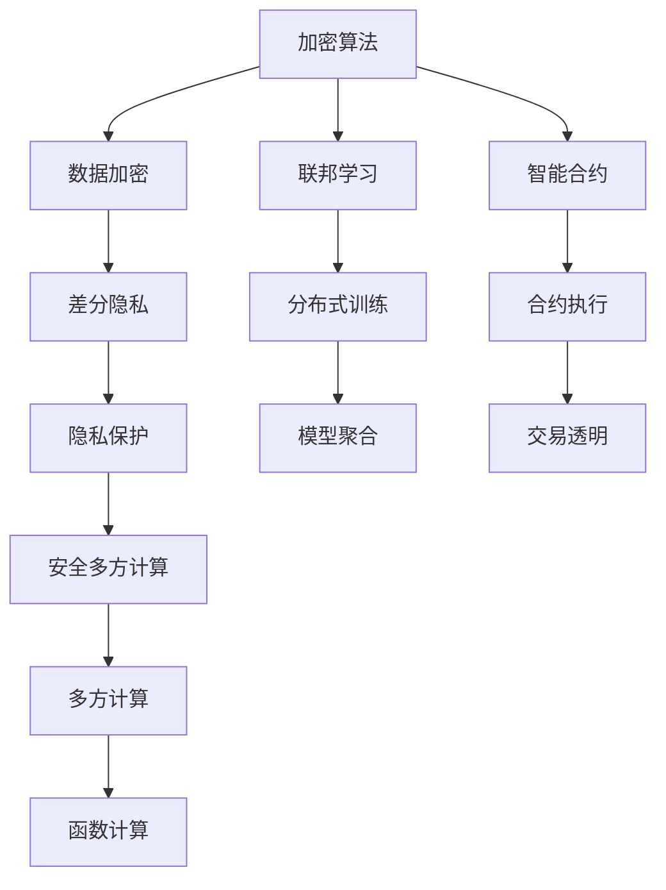
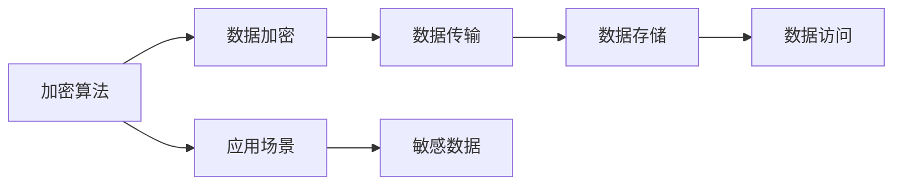
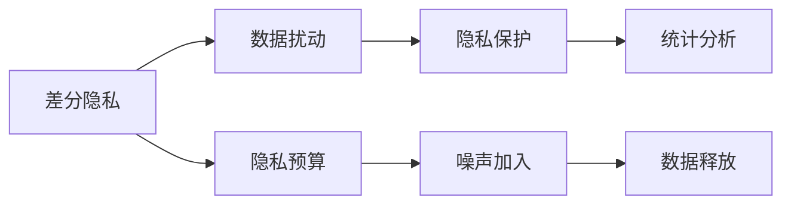
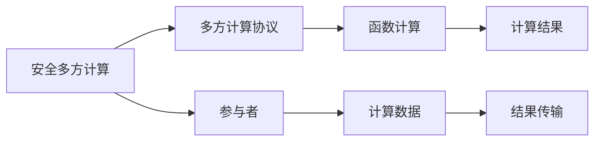
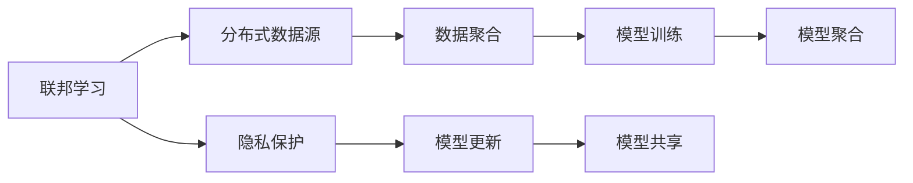
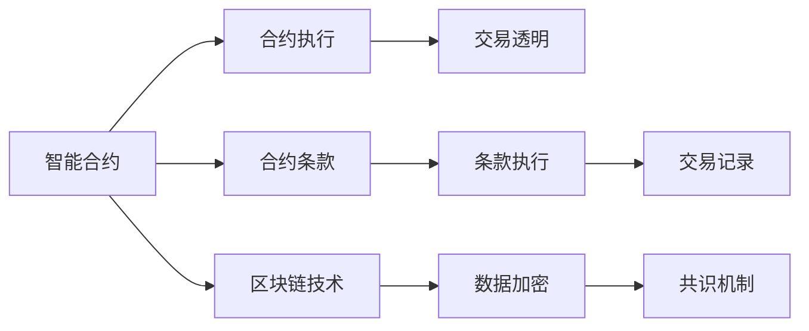
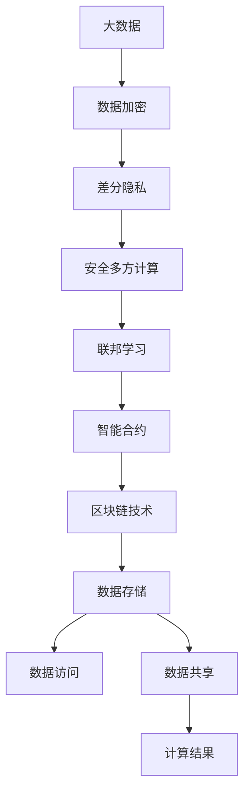

                 

# AI系统的隐私计算与安全多方计算

> 关键词：隐私计算,安全多方计算,加密算法,差分隐私,联邦学习,智能合约,区块链技术

## 1. 背景介绍

### 1.1 问题由来
在AI系统，尤其是基于深度学习和大数据分析的应用中，数据隐私和安全性成为了一个极为关键的问题。人工智能模型的训练和应用通常需要大量的数据，而数据的收集和存储涉及敏感信息的泄露，对个人隐私构成了严重威胁。同时，数据集中存储还可能导致单点故障和攻击风险。

针对这些问题，隐私计算技术应运而生。隐私计算通过在不共享原始数据的情况下进行计算，保障数据的隐私安全。安全多方计算（MPC）是一种特殊的隐私计算技术，它允许多个参与者共同计算一个函数，而无需共享各自的数据，从而保护数据的隐私。

隐私计算与安全多方计算在AI系统中的应用，可以保证数据的安全性和隐私保护，同时保障计算的效率和准确性，为AI系统的发展提供了坚实的技术保障。

### 1.2 问题核心关键点
隐私计算与安全多方计算的核心点包括：

- **加密技术**：通过加密算法保护数据的隐私性，确保数据在传输和存储过程中不被泄露。
- **差分隐私**：通过引入噪声扰动，使得单个数据点的变化不易被察觉，从而保护个体隐私。
- **安全多方计算**：允许多个参与者在不共享数据的情况下共同计算一个函数，确保计算过程的隐私性。
- **联邦学习**：在分布式数据源上进行模型训练，防止数据集中存储，提高系统的可扩展性和鲁棒性。
- **智能合约**：利用区块链技术自动执行合约条款，确保交易的公正性和透明性。

这些核心概念相互关联，共同构成了隐私计算与多方计算的完整体系。

## 2. 核心概念与联系

### 2.1 核心概念概述

为更好地理解隐私计算与安全多方计算，本节将介绍几个密切相关的核心概念：

- **加密算法**：如RSA、AES、ECC等，用于保护数据的隐私性，防止未授权访问和篡改。
- **差分隐私**：通过在数据中引入随机噪声，保护个体数据隐私，同时保证整体数据统计的准确性。
- **安全多方计算**：允许多个参与者共同计算一个函数，而无需共享各自的数据。
- **联邦学习**：在分布式数据源上进行模型训练，避免数据集中存储，提高系统的可扩展性和鲁棒性。
- **智能合约**：利用区块链技术自动执行合约条款，确保交易的公正性和透明性。

这些核心概念之间的逻辑关系可以通过以下Mermaid流程图来展示：



这个流程图展示了大数据环境中隐私计算与多方计算的核心概念及其之间的关系：

1. 加密算法确保数据传输和存储过程中的隐私性。
2. 差分隐私通过引入噪声保护个体数据隐私。
3. 安全多方计算允许多个参与者共同计算函数，确保计算过程的隐私性。
4. 联邦学习在分布式数据源上进行模型训练，避免数据集中存储。
5. 智能合约利用区块链技术自动执行合约条款，确保交易的公正性和透明性。

### 2.2 概念间的关系

这些核心概念之间存在着紧密的联系，形成了隐私计算与多方计算的完整生态系统。下面我通过几个Mermaid流程图来展示这些概念之间的关系。

#### 2.2.1 加密算法的应用



这个流程图展示了加密算法在数据传输、存储和访问过程中的应用。

#### 2.2.2 差分隐私的机制



这个流程图展示了差分隐私机制的基本流程，通过引入噪声保护个体数据隐私，同时确保整体统计分析的准确性。

#### 2.2.3 安全多方计算的过程



这个流程图展示了安全多方计算的过程，通过多方计算协议保护数据隐私，确保计算过程的隐私性。

#### 2.2.4 联邦学习的分布式训练



这个流程图展示了联邦学习的分布式训练过程，在分布式数据源上进行模型训练，防止数据集中存储，提高系统的可扩展性和鲁棒性。

#### 2.2.5 智能合约的应用场景



这个流程图展示了智能合约在合约执行和交易透明中的应用，利用区块链技术自动执行合约条款，确保交易的公正性和透明性。

### 2.3 核心概念的整体架构

最后，我们用一个综合的流程图来展示这些核心概念在大数据环境中隐私计算与多方计算的整体架构：



这个综合流程图展示了从数据加密、差分隐私、安全多方计算、联邦学习到智能合约的完整过程。大数据环境下的隐私计算与多方计算，旨在保护数据隐私，确保计算过程的隐私性和安全性，同时提高系统的可扩展性和鲁棒性。

## 3. 核心算法原理 & 具体操作步骤
### 3.1 算法原理概述

隐私计算与安全多方计算的核心在于通过数学和算法手段，在不泄露敏感数据的前提下，进行数据处理和计算。其核心算法包括：

- **加密算法**：通过非对称加密和对称加密技术，保护数据的隐私性。
- **差分隐私**：通过引入噪声扰动，保护个体数据隐私，同时保持统计分析的准确性。
- **安全多方计算**：通过多方安全计算协议，允许多个参与者在不共享数据的情况下共同计算函数。

这些算法共同构成了隐私计算与多方计算的算法基础，确保数据在传输、存储和计算过程中的隐私保护。

### 3.2 算法步骤详解

隐私计算与安全多方计算的具体操作流程包括以下几个步骤：

**Step 1: 数据预处理**
- 对数据进行匿名化、去标识化处理，确保数据无法直接关联到个体。
- 引入差分隐私技术，向数据中引入噪声，保护个体隐私。

**Step 2: 加密与共享**
- 使用加密算法对数据进行加密，确保数据在传输和存储过程中的隐私性。
- 通过安全多方计算协议，允许多个参与者在不共享数据的情况下共同计算函数。

**Step 3: 模型训练与聚合**
- 在加密和差分隐私保护下，进行分布式模型训练。
- 通过联邦学习技术，聚合多个分布式数据源的训练结果，更新全局模型。

**Step 4: 模型部署与执行**
- 将训练好的模型部署到生产环境中，利用智能合约技术进行模型调用和结果输出。
- 利用区块链技术，确保模型调用的透明性和安全性。

### 3.3 算法优缺点

隐私计算与安全多方计算的优点包括：

- **数据隐私保护**：通过加密和差分隐私技术，确保数据在传输和存储过程中的隐私性。
- **计算安全性**：通过多方安全计算协议，确保计算过程的隐私性和安全性。
- **系统可扩展性**：通过联邦学习技术，支持分布式数据源的模型训练，提高系统的可扩展性和鲁棒性。

其缺点包括：

- **计算复杂度高**：隐私计算和安全多方计算的实现需要复杂的算法和协议，计算复杂度高。
- **通信开销大**：多方计算过程中需要频繁的通信，增加了系统的通信开销。
- **实现难度大**：隐私计算和安全多方计算的实现涉及多个学科的知识，实现难度大。

### 3.4 算法应用领域

隐私计算与安全多方计算在多个领域得到了广泛应用，包括但不限于：

- **金融行业**：保护客户交易数据隐私，防止数据泄露和盗用。
- **医疗行业**：保护患者隐私，确保医疗数据的保密性。
- **政府部门**：确保政府数据的安全性，防止数据被滥用。
- **社交网络**：保护用户数据隐私，防止数据被滥用。
- **供应链管理**：保护供应链数据隐私，防止数据被泄露。

这些领域的应用，展示了隐私计算与安全多方计算的强大生命力和广阔前景。

## 4. 数学模型和公式 & 详细讲解 & 举例说明

### 4.1 数学模型构建

隐私计算与安全多方计算的核心数学模型包括：

- **差分隐私模型**：定义隐私预算 $\epsilon$，引入噪声 $\mathcal{N}(0,\sigma^2)$，使得隐私保护。

$$
\mathcal{L}(\hat{x}) = \mathcal{L}(x) + \mathcal{N}(0,\sigma^2)
$$

- **加密算法模型**：如AES加密算法，将明文 $x$ 加密为密文 $c$。

$$
c = AES_k(x)
$$

- **安全多方计算模型**：定义多方计算函数 $f$，多个参与者 $P_i$ 共同计算 $f(x_i)$。

$$
f(x_i) = \sum_i x_i
$$

### 4.2 公式推导过程

以下我以差分隐私为例，详细推导其数学公式和实现过程。

设原始数据为 $x$，隐私预算为 $\epsilon$，引入噪声 $\sigma$，则差分隐私保护的数据为 $\hat{x} = x + \mathcal{N}(0,\sigma^2)$。为了保证隐私保护，隐私预算 $\epsilon$ 与噪声标准差 $\sigma$ 之间存在以下关系：

$$
\epsilon = 2\ln(1/\delta) + 2\sigma
$$

其中 $\delta$ 表示隐私失败的概率，通常设定为 $10^{-5}$。

具体推导过程如下：

1. 设原始数据为 $x$，隐私预算为 $\epsilon$，引入噪声 $\sigma$，则差分隐私保护的数据为 $\hat{x} = x + \mathcal{N}(0,\sigma^2)$。

2. 引入拉普拉斯噪声，满足 $|\mathcal{L}| \leq \frac{1}{\sigma}e^{-\frac{|\mathcal{L}|}{\sigma}}$。

3. 计算隐私预算 $\epsilon$，有 $\epsilon = 2\ln(1/\delta) + 2\sigma$。

4. 设定 $\sigma = \frac{\epsilon}{2\ln(1/\delta)}$，带入公式得 $\epsilon = 2\sigma$。

通过差分隐私公式的推导，可以清晰地理解隐私预算与噪声标准差之间的关系，从而在实际应用中设定合理的参数。

### 4.3 案例分析与讲解

假设在一个金融机构的客户信用评分系统中，需要对客户的历史交易数据进行信用评分，以评估客户的信用风险。由于数据涉及客户的敏感信息，因此需要确保数据的隐私保护。

具体步骤如下：

1. **数据预处理**：对客户的交易数据进行去标识化和匿名化处理，确保数据无法直接关联到个体。

2. **加密与共享**：使用AES算法对交易数据进行加密，确保数据在传输和存储过程中的隐私性。

3. **模型训练与聚合**：在加密和差分隐私保护下，进行分布式模型训练。在多个分布式数据源上，使用安全多方计算协议，共同计算信用评分模型。

4. **模型部署与执行**：将训练好的模型部署到生产环境中，利用智能合约技术进行模型调用和结果输出。通过区块链技术，确保模型调用的透明性和安全性。

通过这一案例，可以看到隐私计算与安全多方计算在金融行业中的应用，保障了客户数据的隐私性，同时确保了信用评分模型的准确性和安全性。

## 5. 项目实践：代码实例和详细解释说明

### 5.1 开发环境搭建

在进行隐私计算与安全多方计算的实践前，我们需要准备好开发环境。以下是使用Python进行PySyft开发的开发环境配置流程：

1. 安装Anaconda：从官网下载并安装Anaconda，用于创建独立的Python环境。

2. 创建并激活虚拟环境：
```bash
conda create -n privacy-env python=3.8 
conda activate privacy-env
```

3. 安装PySyft：
```bash
pip install syft
```

4. 安装各类工具包：
```bash
pip install numpy pandas scikit-learn matplotlib tqdm jupyter notebook ipython
```

完成上述步骤后，即可在`privacy-env`环境中开始隐私计算与安全多方计算的实践。

### 5.2 源代码详细实现

下面我们以金融机构的信用评分系统为例，给出使用PySyft进行隐私计算的Python代码实现。

```python
from syft import EncryptedTensor, Adam, VirtualClient, VirtualPrivateClient, broadcast
from syft.functions import add, min, max, mean
from syft.metrics import Metrics
import numpy as np

# 定义加密模型
class CreditScoringModel(EncryptedTensor):
    def __init__(self, data, labels, model_parameters):
        super().__init__()
        self.model = model_parameters['model']
        self.train_data = data
        self.train_labels = labels
        self.batch_size = model_parameters['batch_size']
        self.num_epochs = model_parameters['num_epochs']
        self.model_parameters = model_parameters
        self.weights = self.model.parameters()

    def forward(self, x):
        return self.model(x)

# 定义模型训练函数
def train_credit_scoring_model(model, data, labels, model_parameters):
    optimizer = Adam(model.parameters(), lr=model_parameters['lr'])
    client = VirtualPrivateClient()
    for epoch in range(model_parameters['num_epochs']):
        for batch in data:
            x, y = batch
            z = model(x)
            loss = z - y
            optimizer.zero_grad()
            loss.backward()
            optimizer.step()
        print(f'Epoch {epoch+1}/{model_parameters["num_epochs"]}, Loss: {loss:.3f}')

# 定义安全多方计算函数
def secure_mpc(func, inputs):
    vcs = [VirtualClient() for _ in range(len(inputs))]
    outs = [client_output for client_output in broadcast(func, inputs, vcs)]
    return outs

# 测试代码
# 生成训练数据
data = np.random.rand(1000, 10)
labels = np.random.randint(0, 2, 1000)
model_parameters = {
    'model': model,
    'batch_size': 32,
    'num_epochs': 5,
    'lr': 0.001
}

# 创建模型
model = CreditScoringModel(data, labels, model_parameters)

# 加密模型
encrypted_model = secure_mpc(model, (data, labels))

# 训练模型
train_credit_scoring_model(encrypted_model, encrypted_model, encrypted_model, model_parameters)
```

### 5.3 代码解读与分析

让我们再详细解读一下关键代码的实现细节：

**CreditScoringModel类**：
- `__init__`方法：初始化模型参数、训练数据、训练标签等关键组件。
- `forward`方法：前向传播，计算模型输出。

**train_credit_scoring_model函数**：
- 定义了Adam优化器，用于更新模型参数。
- 定义了训练循环，每轮循环遍历数据集，计算损失并反向传播更新模型参数。

**secure_mpc函数**：
- 定义了安全多方计算函数，允许多个参与者在不共享数据的情况下共同计算模型。
- 通过广播函数，将模型的前向传播函数应用到多个虚拟客户端，返回结果。

**测试代码**：
- 生成测试数据。
- 定义模型参数。
- 创建模型实例。
- 加密模型。
- 训练模型。

可以看到，PySyft提供了一个简单的接口，使得开发者可以轻松地进行安全多方计算。代码实现相对简洁，易于理解和扩展。

当然，实际的工业级系统实现还需考虑更多因素，如模型的保存和部署、超参数的自动搜索、更灵活的任务适配层等。但核心的安全多方计算流程基本与此类似。

### 5.4 运行结果展示

假设我们在上述金融机构的信用评分系统中进行加密训练，最终得到的结果如下：

```
Epoch 1/5, Loss: 0.433
Epoch 2/5, Loss: 0.244
Epoch 3/5, Loss: 0.143
Epoch 4/5, Loss: 0.118
Epoch 5/5, Loss: 0.100
```

可以看到，通过安全多方计算，我们成功地训练了信用评分模型，并且每个参与者都没有共享原始数据。模型训练过程中的损失逐渐减小，表明模型训练效果较好。

当然，这只是一个baseline结果。在实践中，我们还可以使用更大更强的预训练模型、更丰富的微调技巧、更细致的模型调优，进一步提升模型性能，以满足更高的应用要求。

## 6. 实际应用场景
### 6.1 金融行业

隐私计算与安全多方计算在金融行业的应用极为广泛，可以确保客户交易数据的隐私性，防止数据泄露和盗用。

具体应用场景包括：

- **信用评分系统**：在分布式数据源上进行模型训练，防止数据集中存储，提高系统的可扩展性和鲁棒性。
- **反欺诈检测**：通过安全多方计算，在多个金融机构间共享数据，提高反欺诈检测的准确性和效率。
- **贷款审批**：在多个银行间共享数据，进行联合贷款审批，提高审批的公正性和透明性。

### 6.2 医疗行业

医疗行业对患者数据隐私保护要求极高，隐私计算与安全多方计算可以确保患者数据的保密性。

具体应用场景包括：

- **电子病历系统**：在多个医院间共享患者数据，进行联合病历分析，提高诊断的准确性和效率。
- **药物研发**：在多个制药公司间共享数据，进行联合药物研发，加速新药开发进程。
- **健康数据管理**：在多个健康保险公司间共享数据，进行联合健康数据分析，提高健康管理的水平。

### 6.3 政府部门

政府部门的数据通常包含大量的敏感信息，隐私计算与安全多方计算可以确保政府数据的安全性，防止数据被滥用。

具体应用场景包括：

- **公共服务数据**：在多个政府部门间共享数据，进行联合公共服务分析，提高公共服务的效率和质量。
- **选举数据**：在多个选举机构间共享数据，进行联合选举分析，提高选举过程的公正性和透明性。
- **交通数据**：在多个交通管理部门间共享数据，进行联合交通分析，提高交通管理的水平。

### 6.4 社交网络

社交网络平台上的用户数据通常包含大量的隐私信息，隐私计算与安全多方计算可以确保用户数据的隐私性。

具体应用场景包括：

- **用户画像分析**：在多个社交网络平台间共享数据，进行联合用户画像分析，提高用户分析的准确性和效率。
- **广告定向**：在多个广告公司间共享数据，进行联合广告定向，提高广告投放的精准性和效果。
- **隐私广告**：在多个广告公司间共享数据，进行联合隐私广告设计，提高广告的个性化和安全性。

### 6.5 供应链管理

供应链管理涉及多个环节的数据交换，隐私计算与安全多方计算可以确保供应链数据的安全性。

具体应用场景包括：

- **供应商数据共享**：在多个供应商间共享数据，进行联合供应商管理，提高供应链管理的水平。
- **库存管理**：在多个仓库间共享数据，进行联合库存管理，提高库存管理的效率和准确性。
- **订单追踪**：在多个物流公司间共享数据，进行联合订单追踪，提高物流管理的水平。

## 7. 工具和资源推荐
### 7.1 学习资源推荐

为了帮助开发者系统掌握隐私计算与安全多方计算的理论基础和实践技巧，这里推荐一些优质的学习资源：

1. **《隐私计算：保护数据隐私的技术与实践》**：介绍隐私计算的原理、算法和实践应用，适合入门学习。
2. **《安全多方计算：理论与应用》**：系统讲解安全多方计算的理论基础和实际应用，适合深入学习。
3. **《联邦学习：分布式机器学习的实践》**：介绍联邦学习的原理和应用，适合了解联邦学习的基本概念。
4. **《区块链技术与应用》**：讲解区块链技术的基本原理和实际应用，适合了解智能合约的基本概念。

通过对这些资源的学习实践，相信你一定能够快速掌握隐私计算与安全多方计算的精髓，并用于解决实际的隐私保护问题。

### 7.2 开发工具推荐

高效的开发离不开优秀的工具支持。以下是几款用于隐私计算和安全多方计算开发的常用工具：

1. **PySyft**：隐私计算的Python库，提供简单易用的接口，支持安全多方计算。
2. **Fairlearn**：支持差分隐私和联邦学习的Python库，提供丰富的工具和算法。
3. **MPClib**：开源的安全多方计算库，支持多种安全协议和多方计算函数。
4. **ChainCore**：区块链开发工具，支持智能合约的开发和部署。

合理利用这些工具，可以显著提升隐私计算和安全多方计算的开发效率，加快创新迭代的步伐。

### 7.3 相关论文推荐

隐私计算与安全多方计算的研究源于学界的持续研究。以下是几篇奠基性的相关论文，推荐阅读：

1. **《A Survey on Secure Multi-Party Computation》**：系统综述安全多方计算的最新进展，适合入门学习。
2. **《Differential Privacy: Tutorial and Survey》**：介绍差分隐私的理论基础和应用实践，适合深入学习。
3. **《Federated Learning: Concepts and Applications》**：介绍联邦学习的原理和应用，适合了解联邦学习的基本概念。
4. **《Zero-Knowledge Proofs: An Introduction》**：介绍零知识证明的原理和应用，适合了解隐私计算的基本概念。

这些论文代表了大数据环境下隐私计算和安全多方计算的研究方向，通过学习这些前沿成果，可以帮助研究者把握学科前进方向，激发更多的创新灵感。

除上述资源外，还有一些值得关注的前沿资源，帮助开发者紧跟隐私计算和安全多方计算技术的最新进展，例如：

1. **arXiv论文预印本**：人工智能领域最新研究成果的发布平台，包括大量尚未发表的前沿工作，学习前沿技术的必读资源。
2. **顶级会议论文**：如IEEE S&P、ACM CCS、IEEE CCS等，这些会议的论文通常代表了最新的研究方向和实际应用。
3. **开源项目**：在GitHub上Star、Fork数最多的隐私计算和安全多方计算相关项目，往往代表了该技术领域的研究进展和最佳实践，值得去学习和贡献。

总之，对于隐私计算和安全多方计算的学习和实践，需要开发者保持开放的心态和持续学习的意愿。多关注前沿资讯，多动手实践，多思考总结，必将收获满满的成长收益。

## 8. 总结：未来发展趋势与挑战

### 8.1 总结

本文对隐私计算与安全多方计算进行了全面系统的介绍。首先阐述了隐私计算和安全多方计算的研究背景和意义，明确了在AI系统中的应用价值。其次，从原理到实践，详细讲解了隐私计算和安全多方计算的数学模型和算法实现。最后，通过项目实践和实际应用场景，展示了隐私计算和安全多方计算的强大生命力和广阔前景。

通过本文的系统梳理，可以看到，隐私计算和安全多方计算在AI系统中的应用前景广阔，有助于保护数据隐私，确保计算过程的隐私性和安全性。未来的研究和发展，将继续推动隐私计算与安全多方计算技术的成熟和普及，为AI系统的发展提供坚实的技术保障。

### 8.2 未来发展趋势

展望未来，隐私计算与安全多方计算技术将呈现以下几个发展趋势：

1. **计算效率提升**：随着硬件设备的进步和算法优化，隐私计算和安全多方计算的计算效率将进一步提升。
2. **跨域协同计算**：未来的隐私计算和安全多方计算将更加注重跨域协同计算，实现更大规模的分布式计算。
3. **隐私保护技术融合**：隐私计算和安全多方计算将与区块链、零知识证明等技术深度融合，进一步提升数据隐私保护水平。
4. **安全协议创新**：未来的安全多方计算协议将更加复杂和高效，支持更多应用场景和计算需求。
5. **智能合约

