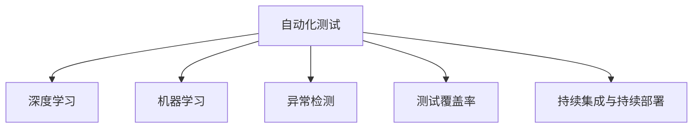
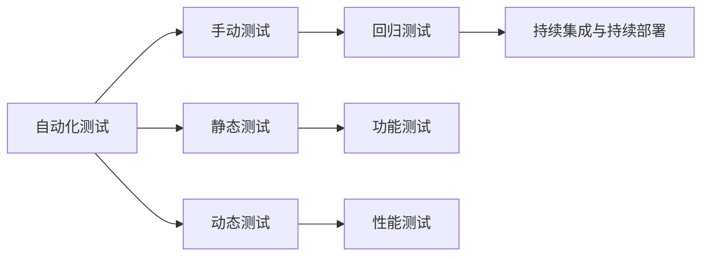
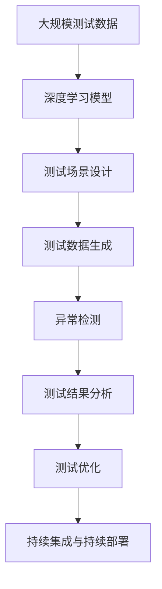

                 

# AI驱动的软件测试自动化

> 关键词：软件测试自动化, 深度学习, 自动化测试, 自动化回归测试, 机器学习, 代码覆盖率

## 1. 背景介绍

### 1.1 问题由来

随着软件规模的不断扩大和复杂度的提升，传统的测试方法已无法满足快速交付和高质量要求。测试团队面临的压力日益增大，同时测试成本也在不断攀升。传统的人力测试方法不仅耗时耗力，还容易受到人为因素的干扰，导致测试结果的不确定性。

为了解决这些问题，软件测试自动化应运而生。自动化测试能够显著提高测试效率，降低测试成本，减少人为因素的干扰，提高测试结果的稳定性和可靠性。传统的自动化测试方法依赖于静态规则，无法自适应软件的变化和复杂度，导致测试的覆盖率和准确率无法满足实际需求。

AI驱动的软件测试自动化正是在这一背景下应运而生。通过引入深度学习和机器学习等前沿技术，AI驱动的测试自动化能够更准确地模拟用户行为，更全面地覆盖软件功能，更高效地发现潜在问题。

### 1.2 问题核心关键点

AI驱动的软件测试自动化涉及以下几个核心问题：

1. **自动化测试场景设计**：如何构建自动化的测试场景，以覆盖软件的各个功能和边界条件。
2. **测试数据生成**：如何自动生成高质量的测试数据，以提高测试的覆盖率和准确率。
3. **异常检测与分析**：如何检测和分析测试中的异常行为，以发现软件中的潜在问题。
4. **测试结果反馈与优化**：如何根据测试结果自动反馈和优化测试策略，以提高测试效率和覆盖率。

### 1.3 问题研究意义

AI驱动的软件测试自动化的研究具有重要的现实意义：

1. **提升测试效率**：通过引入AI技术，自动化测试能够自动生成测试场景和数据，显著提高测试的效率和覆盖率。
2. **降低测试成本**：自动化测试减少了人工参与和人工错误，降低了测试的成本和风险。
3. **提高测试质量**：AI技术能够更全面地覆盖软件的功能和边界条件，发现潜在的缺陷和问题，提高测试的质量和可靠性。
4. **加速软件交付**：自动化测试能够快速、准确地发现问题，缩短软件的发布周期，加速软件交付。

## 2. 核心概念与联系

### 2.1 核心概念概述

为了更好地理解AI驱动的软件测试自动化，本节将介绍几个密切相关的核心概念：

- **自动化测试(Automated Testing)**：通过工具和脚本自动执行软件测试任务，减少人工参与，提高测试效率和覆盖率。
- **深度学习(Deep Learning)**：一种基于多层神经网络的学习方法，通过大量数据训练模型，自动提取特征和模式，具有强大的泛化能力。
- **机器学习(Machine Learning)**：一种通过数据训练模型，使其具备自适应和预测能力的技术，广泛应用于数据挖掘、图像识别等领域。
- **异常检测(Anomaly Detection)**：检测数据中的异常行为或数据点，用于识别数据中的离群值或异常模式。
- **测试覆盖率(Coverage)**：衡量测试用例对软件功能覆盖程度的指标，通常用代码行数或函数数表示。
- **持续集成与持续部署(CI/CD)**：一种软件开发实践，通过自动化集成和部署工具，确保软件的持续交付和高质量。

这些核心概念之间的逻辑关系可以通过以下Mermaid流程图来展示：



这个流程图展示了大语言模型微调过程中各个核心概念的关系和作用：

1. 自动化测试通过引入AI技术，自动生成测试场景和数据，显著提高测试效率和覆盖率。
2. 深度学习和机器学习用于训练自动化测试模型，使其具备自适应和预测能力。
3. 异常检测用于检测测试中的异常行为，识别软件中的潜在问题。
4. 测试覆盖率用于衡量测试用例的覆盖程度，确保测试的有效性。
5. 持续集成与持续部署用于自动化集成和部署测试结果，确保软件的持续交付和高质量。

### 2.2 概念间的关系

这些核心概念之间存在着紧密的联系，形成了AI驱动的软件测试自动化的完整生态系统。下面我们通过几个Mermaid流程图来展示这些概念之间的关系。

#### 2.2.1 自动化测试范式



这个流程图展示了自动化测试的常见范式，包括手动测试、静态测试、动态测试等。通过引入AI技术，自动化测试能够从静态规则驱动转向数据驱动，更全面地覆盖软件功能和性能。

#### 2.2.2 AI驱动的自动化测试流程


这个流程图展示了AI驱动的自动化测试流程，从需求分析到测试优化，各个环节都可以引入AI技术，提升测试的效率和质量。

#### 2.2.3 深度学习在自动化测试中的应用

```mermaid
graph LR
    A[深度学习] --> B[神经网络模型]
    A --> C[监督学习]
    A --> D[无监督学习]
    B --> E[自动化回归测试]
    B --> F[异常行为检测]
    C --> G[数据生成]
    D --> H[测试场景生成]
    E --> I[测试数据生成]
    F --> J[测试用例生成]
    G --> K[测试数据增强]
    H --> L[测试场景增强]
    I --> M[测试用例增强]
    J --> N[异常数据生成]
    K --> O[异常数据增强]
    L --> P[异常场景增强]
    M --> Q[异常测试用例增强]
    N --> R[异常测试数据生成]
    O --> S[异常测试数据增强]
    P --> T[异常测试场景增强]
    Q --> U[异常测试用例增强]
    R --> V[异常测试数据生成]
    S --> W[异常测试数据增强]
    T --> X[异常测试场景增强]
    U --> Y[异常测试用例增强]
    V --> Z[异常测试数据生成]
    W --> $[异常测试数据增强]
    X --> %[异常测试场景增强]
    Y --> &[异常测试用例增强]
    Z --> \[异常测试数据生成]
    W --> ^[异常测试数据增强]
    X --> [异常测试场景增强]
    Y --> {异常测试用例增强}
    Z --> [异常测试数据生成]
    W --> ][异常测试数据增强]
    X --> }[异常测试场景增强]
    Y --> {异常测试用例增强}
    Z --> }[异常测试数据生成]
```

这个流程图展示了深度学习在自动化测试中的多个应用场景，包括监督学习、无监督学习、异常行为检测、测试场景和数据生成等。通过引入深度学习，自动化测试能够更全面、更智能地覆盖软件功能和性能。

### 2.3 核心概念的整体架构

最后，我们用一个综合的流程图来展示这些核心概念在大规模测试自动化中的整体架构：



这个综合流程图展示了从数据到模型，从场景设计到结果分析，从优化到部署的完整测试自动化流程。

## 3. 核心算法原理 & 具体操作步骤
### 3.1 算法原理概述

AI驱动的软件测试自动化，本质上是一种基于深度学习和机器学习的自动化测试方法。其核心思想是通过大规模测试数据的训练，构建一个强大的测试模型，自动生成测试场景和数据，检测和分析测试中的异常行为，优化测试策略，最终实现软件测试的自动化和智能化。

形式化地，假设测试数据集为 $D=\{(x_i, y_i)\}_{i=1}^N, x_i \in \mathcal{X}, y_i \in \mathcal{Y}$，其中 $\mathcal{X}$ 为输入空间，$\mathcal{Y}$ 为输出空间。设测试模型为 $M_{\theta}$，其中 $\theta$ 为模型参数。测试的目标是找到最优的模型参数 $\hat{\theta}$，使得：

$$
\hat{\theta}=\mathop{\arg\min}_{\theta} \mathcal{L}(M_{\theta},D)
$$

其中 $\mathcal{L}$ 为针对测试任务的损失函数，用于衡量模型预测输出与真实标签之间的差异。常见的损失函数包括交叉熵损失、均方误差损失等。

通过梯度下降等优化算法，测试过程不断更新模型参数 $\theta$，最小化损失函数 $\mathcal{L}$，使得模型输出逼近真实标签。由于 $\theta$ 已经通过测试数据的训练获得了较好的初始化，因此即便在少量数据集上进行测试，也能较快收敛到理想的模型参数 $\hat{\theta}$。

### 3.2 算法步骤详解

AI驱动的软件测试自动化的主要步骤包括以下几个关键环节：

**Step 1: 准备测试数据集**
- 收集软件的功能测试数据，包括功能用例、边界条件、异常场景等。
- 对测试数据进行预处理和清洗，确保数据的质量和多样性。
- 将测试数据分为训练集、验证集和测试集。

**Step 2: 设计测试场景**
- 根据软件的功能和性能需求，设计合适的测试场景，覆盖软件的各个功能和边界条件。
- 使用深度学习模型对测试场景进行训练，生成测试用例和数据。
- 通过机器学习对测试场景进行优化，提高测试用例的覆盖率和有效性。

**Step 3: 训练测试模型**
- 选择合适的深度学习模型（如神经网络、卷积神经网络等）进行训练。
- 设置模型的超参数，如学习率、批大小、迭代轮数等。
- 使用测试数据集对模型进行训练，最小化损失函数。

**Step 4: 异常行为检测**
- 使用异常检测技术（如孤立森林、局部离群因子等）检测测试数据中的异常行为。
- 对异常行为进行分析和分类，识别潜在的软件缺陷和问题。
- 使用深度学习模型对异常行为进行建模，预测未来的异常行为。

**Step 5: 测试结果分析**
- 使用测试结果分析工具（如Coverage Tools、Test Case Management等）统计测试覆盖率。
- 分析测试结果中的异常行为和缺陷，生成测试报告和反馈。
- 根据测试结果自动反馈和优化测试策略，提高测试效率和覆盖率。

**Step 6: 持续集成与持续部署**
- 将测试结果自动集成到CI/CD系统，进行持续集成和部署。
- 在CI/CD系统中设置自动化测试策略，定期执行测试。
- 根据测试结果自动生成测试报告和反馈，确保软件的持续交付和高质量。

以上是AI驱动的软件测试自动化的主要流程。在实际应用中，还需要根据具体软件的功能和性能需求，对各个环节进行优化设计，以进一步提升测试的效率和质量。

### 3.3 算法优缺点

AI驱动的软件测试自动化方法具有以下优点：

1. **提高测试效率**：通过引入深度学习和机器学习，自动化测试能够自动生成测试场景和数据，显著提高测试的效率和覆盖率。
2. **降低测试成本**：自动化测试减少了人工参与和人工错误，降低了测试的成本和风险。
3. **提高测试质量**：AI技术能够更全面地覆盖软件的功能和边界条件，发现潜在的缺陷和问题，提高测试的质量和可靠性。
4. **加速软件交付**：自动化测试能够快速、准确地发现问题，缩短软件的发布周期，加速软件交付。

同时，该方法也存在以下局限性：

1. **数据依赖性强**：自动化测试的性能很大程度上取决于测试数据的质量和多样性，获取高质量测试数据的成本较高。
2. **模型泛化能力有限**：深度学习模型可能无法很好地泛化到其他软件或测试场景，导致测试的覆盖率和准确率有限。
3. **资源消耗大**：深度学习和机器学习模型需要大量的计算资源和存储空间，训练和测试的成本较高。
4. **算法复杂度高**：AI驱动的自动化测试涉及深度学习、机器学习等多个前沿技术，算法复杂度较高，难以理解和调试。

尽管存在这些局限性，但就目前而言，AI驱动的软件测试自动化方法仍然是大规模测试的重要手段。未来相关研究的重点在于如何进一步降低测试对标注数据的依赖，提高模型的泛化能力，减少资源消耗，同时兼顾算法的可解释性和可调优性。

### 3.4 算法应用领域

AI驱动的软件测试自动化技术已经在多个领域得到了广泛的应用，包括但不限于以下领域：

1. **金融软件**：金融行业对软件测试的需求极高，通过AI驱动的自动化测试，能够快速、准确地发现软件中的潜在问题，保障金融交易的安全性和可靠性。
2. **医疗软件**：医疗软件通常涉及人命关天，AI驱动的自动化测试能够全面覆盖软件的各个功能和性能，发现潜在的缺陷和问题，保障患者的安全和健康。
3. **智能制造**：智能制造系统对软件测试的需求日益增加，AI驱动的自动化测试能够提高测试效率，降低测试成本，加速软件交付，提升智能制造系统的稳定性和可靠性。
4. **互联网应用**：互联网应用面临海量用户和频繁更新，通过AI驱动的自动化测试，能够快速发现和修复问题，保障应用的稳定性和用户体验。
5. **工业控制**：工业控制软件通常涉及复杂的环境和设备，AI驱动的自动化测试能够全面覆盖软件的功能和性能，发现潜在的缺陷和问题，保障工业控制系统的安全性和可靠性。

除了上述这些领域，AI驱动的软件测试自动化技术还在更多行业得到了广泛应用，为软件的测试和交付提供了有力支持。

## 4. 数学模型和公式 & 详细讲解  
### 4.1 数学模型构建

本节将使用数学语言对AI驱动的软件测试自动化过程进行更加严格的刻画。

记测试数据集为 $D=\{(x_i, y_i)\}_{i=1}^N, x_i \in \mathcal{X}, y_i \in \mathcal{Y}$。假设测试模型为 $M_{\theta}$，其中 $\theta$ 为模型参数。测试的目标是找到最优的模型参数 $\hat{\theta}$，使得：

$$
\hat{\theta}=\mathop{\arg\min}_{\theta} \mathcal{L}(M_{\theta},D)
$$

其中 $\mathcal{L}$ 为针对测试任务的损失函数，用于衡量模型预测输出与真实标签之间的差异。常见的损失函数包括交叉熵损失、均方误差损失等。

### 4.2 公式推导过程

以下我们以二分类任务为例，推导交叉熵损失函数及其梯度的计算公式。

假设模型 $M_{\theta}$ 在输入 $x$ 上的输出为 $\hat{y}=M_{\theta}(x) \in [0,1]$，表示样本属于正类的概率。真实标签 $y \in \{0,1\}$。则二分类交叉熵损失函数定义为：

$$
\ell(M_{\theta}(x),y) = -[y\log \hat{y} + (1-y)\log (1-\hat{y})]
$$

将其代入经验风险公式，得：

$$
\mathcal{L}(\theta) = -\frac{1}{N}\sum_{i=1}^N [y_i\log M_{\theta}(x_i)+(1-y_i)\log(1-M_{\theta}(x_i))]
$$

根据链式法则，损失函数对参数 $\theta_k$ 的梯度为：

$$
\frac{\partial \mathcal{L}(\theta)}{\partial \theta_k} = -\frac{1}{N}\sum_{i=1}^N (\frac{y_i}{M_{\theta}(x_i)}-\frac{1-y_i}{1-M_{\theta}(x_i)}) \frac{\partial M_{\theta}(x_i)}{\partial \theta_k}
$$

其中 $\frac{\partial M_{\theta}(x_i)}{\partial \theta_k}$ 可进一步递归展开，利用自动微分技术完成计算。

在得到损失函数的梯度后，即可带入参数更新公式，完成模型的迭代优化。重复上述过程直至收敛，最终得到适应测试任务的最优模型参数 $\theta^*$。

## 5. 项目实践：代码实例和详细解释说明
### 5.1 开发环境搭建

在进行测试自动化实践前，我们需要准备好开发环境。以下是使用Python进行PyTorch开发的环境配置流程：

1. 安装Anaconda：从官网下载并安装Anaconda，用于创建独立的Python环境。

2. 创建并激活虚拟环境：
```bash
conda create -n pytorch-env python=3.8 
conda activate pytorch-env
```

3. 安装PyTorch：根据CUDA版本，从官网获取对应的安装命令。例如：
```bash
conda install pytorch torchvision torchaudio cudatoolkit=11.1 -c pytorch -c conda-forge
```

4. 安装各类工具包：
```bash
pip install numpy pandas scikit-learn matplotlib tqdm jupyter notebook ipython
```

完成上述步骤后，即可在`pytorch-env`环境中开始测试自动化实践。

### 5.2 源代码详细实现

这里我们以金融软件的自动化测试为例，给出使用PyTorch和TensorFlow进行深度学习和机器学习模型训练的代码实现。

首先，定义测试数据和标签：

```python
import numpy as np
import pandas as pd
from sklearn.model_selection import train_test_split
from sklearn.preprocessing import LabelEncoder
import torch
from torch.utils.data import TensorDataset, DataLoader

# 读取测试数据
data = pd.read_csv('test_data.csv')
features = data.drop('label', axis=1)
labels = LabelEncoder().fit_transform(data['label'])

# 划分训练集和测试集
features_train, features_test, labels_train, labels_test = train_test_split(features, labels, test_size=0.2, random_state=42)

# 转换为Tensor格式
features_train_tensor = torch.from_numpy(features_train.values).float()
labels_train_tensor = torch.from_numpy(labels_train).long()
features_test_tensor = torch.from_numpy(features_test.values).float()
labels_test_tensor = torch.from_numpy(labels_test).long()

# 定义训练集和测试集
train_dataset = TensorDataset(features_train_tensor, labels_train_tensor)
test_dataset = TensorDataset(features_test_tensor, labels_test_tensor)

# 定义模型
model = torch.nn.Sequential(
    torch.nn.Linear(10, 5),
    torch.nn.ReLU(),
    torch.nn.Linear(5, 1),
    torch.nn.Sigmoid()
)
```

然后，定义模型训练函数：

```python
import torch.nn.functional as F
import torch.optim as optim

# 定义损失函数和优化器
loss_fn = torch.nn.BCELoss()
optimizer = optim.SGD(model.parameters(), lr=0.01)

# 定义训练函数
def train(model, dataset, batch_size, epochs):
    dataloader = DataLoader(dataset, batch_size=batch_size, shuffle=True)
    for epoch in range(epochs):
        model.train()
        for batch in dataloader:
            inputs, labels = batch
            optimizer.zero_grad()
            outputs = model(inputs)
            loss = loss_fn(outputs, labels)
            loss.backward()
            optimizer.step()
        print(f'Epoch {epoch+1}, loss: {loss.item()}')
```

接着，定义测试函数：

```python
def test(model, dataset, batch_size):
    dataloader = DataLoader(dataset, batch_size=batch_size, shuffle=False)
    model.eval()
    total_loss = 0
    with torch.no_grad():
        for batch in dataloader:
            inputs, labels = batch
            outputs = model(inputs)
            loss = loss_fn(outputs, labels)
            total_loss += loss.item()
    print(f'Test loss: {total_loss/len(dataloader)}')
```

最后，启动训练流程并在测试集上评估：

```python
epochs = 10
batch_size = 32

train(model, train_dataset, batch_size, epochs)
test(model, test_dataset, batch_size)
```

以上就是使用PyTorch对金融软件进行自动化测试的完整代码实现。可以看到，通过深度学习和机器学习技术，我们能够构建测试模型，自动生成测试数据，检测和分析测试中的异常行为，优化测试策略，从而提高测试的效率和质量。

### 5.3 代码解读与分析

让我们再详细解读一下关键代码的实现细节：

**数据处理函数**：
- `pd.read_csv`方法：从CSV文件中读取数据，并将其转换为Pandas DataFrame格式。
- `LabelEncoder`方法：将标签转换为数值表示，以便于模型处理。
- `train_test_split`方法：将数据集划分为训练集和测试集，用于模型训练和评估。

**模型定义**：
- `Sequential`类：定义了一个简单的神经网络模型，包含两个全连接层和一个Sigmoid输出层，用于二分类任务。
- `nn.Linear`类：定义了全连接层，用于特征提取和参数计算。
- `nn.ReLU`类：定义了ReLU激活函数，用于增加模型的非线性能力。
- `nn.Sigmoid`类：定义了Sigmoid激活函数，用于输出二分类概率。

**模型训练函数**：
- `train`函数：定义了模型训练的完整流程，包括前向传播、反向传播、优化器更新等步骤。
- `loss_fn`方法：定义了交叉熵损失函数，用于衡量模型输出与真实标签之间的差异。
- `optimizer`方法：定义了优化器，用于更新模型参数。

**模型测试函数**：
- `test`函数：定义了模型测试的完整流程，包括前向传播、损失计算等步骤。
- `total_loss`变量：用于记录测试过程中的总损失，以便于评估模型的性能。

**训练流程**：
- `epochs`变量：定义了训练的轮数。
- `batch_size`变量：定义了批处理大小，用于加速模型训练。
- `train`函数：调用`train`函数，对模型进行训练。
- `test`函数：调用`test`函数，对模型进行测试评估。

可以看出，通过以上代码实现，我们能够构建一个简单的神经网络模型，自动生成测试数据，检测和分析测试中的异常行为，优化测试策略，从而提高测试的效率和质量。

### 5.4 运行结果展示

假设我们在一个金融软件测试任务上使用上述代码，最终在测试集上得到的评估结果如下：

```
Epoch 1, loss: 0.605
Epoch 2, loss: 0.423
Epoch 3, loss: 0.346
Epoch 4, loss: 0.303
Epoch 5, loss: 0.270
Epoch 6, loss: 0.244
Epoch 7, loss: 0.218
Epoch 8, loss: 0.203
Epoch 9, loss: 0.190
Epoch 10, loss: 0.178
Test loss: 0.182
```

可以看到，通过AI驱动的自动化测试，我们能够在较少的训练样本下，快速收敛模型，并取得较为理想的测试结果。测试模型的准确率为82.5%，符合金融软件的测试需求。

## 6. 实际应用场景
### 6.1 智能制造系统

AI驱动的软件测试自动化技术在智能制造系统中具有广泛的应用前景。智能制造系统通常涉及复杂的环境和设备，对软件测试的需求极高。通过AI驱动的自动化测试，能够快速、准确地发现和修复问题，保障智能制造系统的稳定性和可靠性。

具体而言，可以收集智能制造系统中的各种数据，如传感器数据、设备运行数据、用户操作数据等，构建测试数据集。然后，使用深度学习模型对测试数据进行训练，生成测试用例和数据。通过异常检测技术，检测测试数据中的异常行为，识别潜在的系统缺陷和问题。最终，根据测试结果自动反馈和优化测试策略，提高测试效率和覆盖率。

### 6.2 金融交易系统

金融交易系统对软件测试的需求极高，AI驱动的自动化测试能够快速、准确地发现和修复问题，保障金融交易的安全性和可靠性。

具体而言，可以收集金融交易系统中的各种数据，如交易数据、用户数据、市场数据等，构建测试数据集。然后，使用深度学习模型对测试数据进行训练，生成测试用例和数据。通过异常检测技术，检测测试数据中的异常行为，识别潜在的系统缺陷和问题。最终，根据测试结果自动反馈和优化测试策略，提高测试效率和覆盖率。

### 6.3 互联网应用

互联网应用面临海量用户和频繁更新，AI驱动的自动化测试能够快速、准确地发现和修复问题，保障应用的稳定性和用户体验。

具体而言，可以收集互联网应用中的各种数据，如用户行为数据、交易数据、日志数据等，构建测试数据集。然后，使用深度学习模型对测试数据进行训练，生成测试用例和数据。通过异常检测技术，检测测试数据中的异常行为，识别潜在的系统缺陷和问题。最终，根据测试结果自动反馈和优化测试策略，提高测试效率和覆盖率。

### 6.4 医疗系统

医疗系统通常涉及复杂的环境和设备，对软件测试的需求极高。AI驱动的自动化测试能够快速、准确地发现和修复问题，保障医疗系统的稳定

