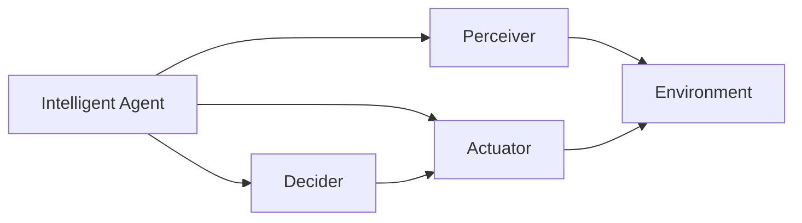
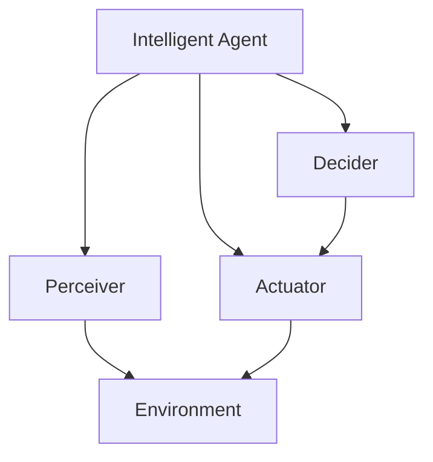
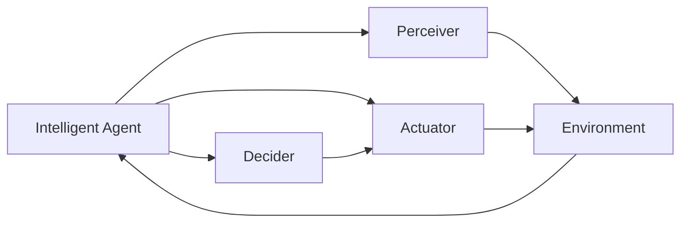
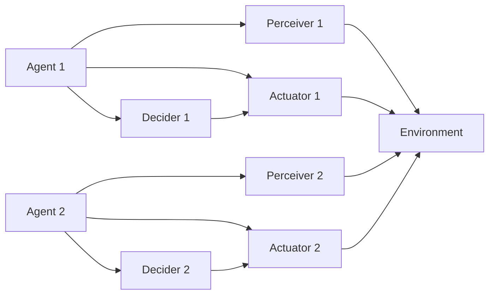
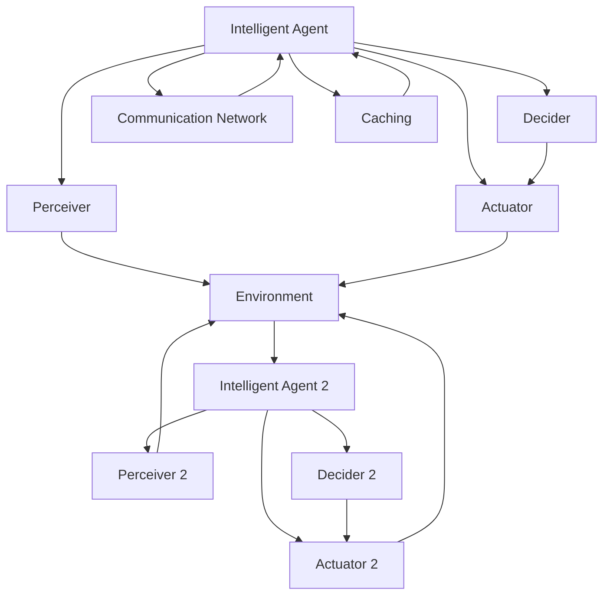

                 

# Agent代理在AI中的实用方法

> 关键词：Agent, 人工智能, 强化学习, 多智能体系统, 应用场景, 技术要点, 发展趋势, 挑战与突破

## 1. 背景介绍

### 1.1 问题由来
随着人工智能（AI）技术的不断进步，智能代理（Agent）在各行各业中的应用越来越广泛。智能代理不仅能自主执行任务，还能在复杂的动态环境中做出决策，从而大幅提升工作效率和问题解决能力。然而，智能代理的设计和实现涉及到复杂的算法和技术细节，需要具备较高的技术门槛。

### 1.2 问题核心关键点
本节将详细探讨智能代理在AI中的应用，并结合强化学习（Reinforcement Learning, RL）等前沿技术，对智能代理的实用方法进行全面剖析。重点关注以下几个方面：

- 智能代理的基本概念与原理。
- 强化学习在智能代理中的应用。
- 多智能体系统（Multi-Agent Systems, MAS）的建模与实现。
- 智能代理在不同应用场景中的典型应用。

### 1.3 问题研究意义
智能代理技术具有广泛的应用前景，可以应用于各种自动化场景中，如工业控制、机器人、智能推荐系统等。通过智能代理，可以显著提升系统的智能程度和灵活性，降低人力成本。同时，随着AI技术的不断发展，智能代理也面临着更多的挑战，需要在技术上不断突破，以适应更多复杂的应用场景。

## 2. 核心概念与联系

### 2.1 核心概念概述

为更好地理解智能代理在AI中的应用，本节将介绍几个密切相关的核心概念：

- 智能代理（Agent）：指能够自主执行任务，并在复杂环境中做出决策的计算实体。智能代理通常由感知器、决策器和执行器三部分组成，可以接收环境信息，进行决策规划，并执行相应动作。

- 强化学习（RL）：一种通过与环境互动，在试错中学习最优决策策略的机器学习技术。强化学习基于奖励信号，通过不断调整策略，使得智能代理能够在复杂环境中取得最优结果。

- 多智能体系统（MAS）：由多个智能代理组成的分布式系统，每个代理能够独立地感知环境、做出决策并执行动作。MAS常用于复杂协作和竞态任务，如自动驾驶、群体智能等。

- 感知器（Perceiver）：智能代理接收环境信息的组件，负责感知和识别环境中的对象和事件。

- 决策器（Decider）：智能代理的核心组件，负责基于感知器提供的信息，通过算法进行决策规划，选择最优动作。

- 执行器（Actuator）：智能代理的执行部件，负责执行决策器发出的动作指令。

这些核心概念之间的逻辑关系可以通过以下Mermaid流程图来展示：



这个流程图展示了智能代理的基本构成和运作流程：

1. 智能代理从环境获取信息，由感知器进行处理。
2. 感知器将处理后的信息传递给决策器。
3. 决策器根据接收到的信息，选择最优动作。
4. 动作通过执行器传递到环境。

### 2.2 概念间的关系

这些核心概念之间存在着紧密的联系，形成了智能代理的基本运作框架。下面我们通过几个Mermaid流程图来展示这些概念之间的关系。

#### 2.2.1 智能代理的基本框架



这个流程图展示了智能代理的基本构成和运作流程。

#### 2.2.2 强化学习与智能代理



这个流程图展示了强化学习在智能代理中的应用。智能代理通过感知器感知环境，决策器根据奖励信号调整策略，执行器执行最优动作。环境反馈奖励信号，智能代理不断调整策略，逐步趋近最优策略。

#### 2.2.3 多智能体系统



这个流程图展示了多智能体系统的构成。多智能体系统由多个智能代理组成，每个智能代理都有独立的感知器、决策器和执行器，可以相互协作或竞争，共同完成任务。

### 2.3 核心概念的整体架构

最后，我们用一个综合的流程图来展示这些核心概念在大规模系统中构成的整体架构：



这个综合流程图展示了多个智能代理在一个复杂系统中协同工作的场景。智能代理之间通过通信网络进行交互，同时可以利用缓存技术提高系统效率。

## 3. 核心算法原理 & 具体操作步骤

### 3.1 算法原理概述

智能代理的实现主要依赖于强化学习和多智能体系统等技术。其核心思想是通过感知器接收环境信息，决策器根据奖励信号调整策略，执行器执行最优动作，逐步优化智能代理在特定任务上的表现。

具体来说，智能代理的算法原理包括以下几个步骤：

1. 环境感知：智能代理通过感知器感知环境信息，如传感器数据、用户输入等。
2. 状态表示：将感知到的信息进行编码，转化为决策器可以处理的状态向量。
3. 策略选择：决策器根据当前状态，选择最优策略进行动作执行。
4. 动作执行：执行器根据决策器发出的指令，执行相应动作。
5. 环境反馈：环境根据智能代理的动作，提供反馈信号，如奖励或惩罚。
6. 策略优化：智能代理根据环境反馈，调整策略以提高性能。

### 3.2 算法步骤详解

智能代理的实现主要依赖于以下关键算法步骤：

#### 3.2.1 状态表示

智能代理的状态表示方法通常包括：

- 直接感知法：智能代理直接使用传感器数据作为状态表示。
- 抽象感知法：通过定义状态空间，将感知数据映射为状态向量。例如，使用网格地图（Grid Map）表示机器人周围的环境状态。

#### 3.2.2 策略选择

常见的策略选择算法包括：

- Q-learning：通过计算每个动作的Q值，选择Q值最高的动作。
- SARSA：结合状态-动作-奖励-状态（SARS），选择Q值最高的动作。
- Deep Q-Networks（DQN）：使用深度神经网络近似Q值，通过经验回放（Experience Replay）优化模型。

#### 3.2.3 动作执行

动作执行的实现方式包括：

- 离散动作：如移动、旋转、发射子弹等，通过决策器生成具体动作序列。
- 连续动作：如机器人的关节位置、角度等，通过决策器生成连续动作指令。

#### 3.2.4 环境反馈

环境反馈信号通常包括：

- 奖励：根据智能代理的行为，给予正向或负向奖励。
- 惩罚：根据智能代理的行为，给予负向惩罚。
- 状态变化：环境状态发生变化，反馈给智能代理。

#### 3.2.5 策略优化

策略优化的方式包括：

- 基于奖励的策略优化：通过奖励信号调整策略。
- 基于模型的策略优化：通过模型预测最优策略。

### 3.3 算法优缺点

智能代理的算法具有以下优点：

- 自主性强：智能代理能够自主执行任务，减少人工干预。
- 适应性强：智能代理能够适应复杂环境，自适应调整策略。
- 可扩展性强：智能代理可以通过多智能体系统扩展到更大规模的分布式系统。

同时，智能代理的算法也存在一些缺点：

- 计算量大：智能代理需要实时处理大量数据，计算复杂度较高。
- 决策风险高：智能代理的决策基于概率模型，存在一定的不确定性。
- 模型复杂度高：智能代理的模型需要高精度的传感器数据和复杂的策略选择算法。

### 3.4 算法应用领域

智能代理的算法广泛应用于各种自动化场景中，以下是一些典型应用领域：

- 工业自动化：智能代理可以应用于生产线上的机器人、自动化控制等。
- 智能交通：智能代理可以用于自动驾驶、交通信号控制等。
- 医疗系统：智能代理可以用于智能诊断、辅助治疗等。
- 智能推荐系统：智能代理可以用于个性化推荐、用户行为分析等。

这些应用领域涵盖了工业控制、智能交通、医疗健康、电子商务等多个行业，展现了智能代理的广泛应用前景。

## 4. 数学模型和公式 & 详细讲解 & 举例说明

### 4.1 数学模型构建

本节将使用数学语言对智能代理的算法进行更加严格的刻画。

假设智能代理需要在环境 $E$ 中执行任务，状态空间为 $\mathcal{S}$，动作空间为 $\mathcal{A}$，奖励函数为 $R$。智能代理的目标是在奖励最大化的基础上，最小化动作执行成本。

定义智能代理的状态表示为 $s_t \in \mathcal{S}$，动作选择策略为 $\pi_t: \mathcal{S} \to \mathcal{A}$，状态转移概率为 $P(s_{t+1}|s_t, a_t)$，奖励信号为 $r_t$，动作成本为 $c_t$。

智能代理的优化目标为：

$$
\max_{\pi} \sum_{t=0}^{T} \gamma^t R(s_t, a_t) - \sum_{t=0}^{T} \gamma^t c_t
$$

其中 $\gamma$ 为折扣因子，$T$ 为时间步数。

### 4.2 公式推导过程

以下我们以Q-learning算法为例，推导状态表示和策略选择的公式。

定义状态-动作-奖励-状态（SARS）的Q值：

$$
Q(s_t, a_t) = \mathbb{E}[\sum_{t'=t}^{T} \gamma^{t'-t} (r_{t'} + \gamma Q(s_{t'}, a_{t'})) | s_t, a_t]
$$

Q-learning算法的策略更新公式为：

$$
Q(s_t, a_t) \leftarrow Q(s_t, a_t) + \alpha [r_t + \gamma \max_{a'} Q(s_{t+1}, a')] - Q(s_t, a_t)
$$

其中 $\alpha$ 为学习率，$\max_{a'} Q(s_{t+1}, a')$ 表示在下一个状态 $s_{t+1}$ 下，策略 $\pi$ 的Q值。

### 4.3 案例分析与讲解

以智能推荐系统为例，智能代理需要在用户行为数据中学习用户偏好，生成个性化推荐列表。

首先，智能代理通过感知器收集用户的历史行为数据，使用网格地图表示用户兴趣区域。接着，智能代理在状态空间中搜索用户当前兴趣区域，并计算每个物品的Q值。最后，智能代理根据Q值选择推荐列表中的物品，执行动作。

推荐系统的强化学习策略通常采用基于奖励的优化方法，奖励函数为物品被用户点击的概率。智能代理通过不断调整推荐策略，逐步优化推荐列表，提高用户体验。

## 5. 项目实践：代码实例和详细解释说明

### 5.1 开发环境搭建

在进行智能代理实践前，我们需要准备好开发环境。以下是使用Python进行Reinforcement Learning开发的环境配置流程：

1. 安装Anaconda：从官网下载并安装Anaconda，用于创建独立的Python环境。

2. 创建并激活虚拟环境：
```bash
conda create -n rl-env python=3.8 
conda activate rl-env
```

3. 安装必要的依赖包：
```bash
conda install numpy scipy matplotlib matplotlib
pip install gym gym[atari] gym-ev3
```

4. 安装Gym环境：
```bash
pip install gym
```

5. 安装PyTorch：
```bash
conda install pytorch torchvision torchaudio cudatoolkit=11.1 -c pytorch -c conda-forge
```

完成上述步骤后，即可在`rl-env`环境中开始智能代理的开发实践。

### 5.2 源代码详细实现

下面我们以一个简单的智能推荐系统为例，展示智能代理的实现代码。

```python
import numpy as np
import gym
import torch
import torch.nn as nn
import torch.optim as optim
import torch.nn.functional as F

class QNetwork(nn.Module):
    def __init__(self, state_dim, action_dim):
        super(QNetwork, self).__init__()
        self.fc1 = nn.Linear(state_dim, 64)
        self.fc2 = nn.Linear(64, action_dim)

    def forward(self, x):
        x = F.relu(self.fc1(x))
        x = self.fc2(x)
        return x

class DQN:
    def __init__(self, state_dim, action_dim):
        self.state_dim = state_dim
        self.action_dim = action_dim
        self.q = QNetwork(state_dim, action_dim)
        self.target_q = QNetwork(state_dim, action_dim)
        self.optimizer = optim.Adam(self.q.parameters(), lr=0.001)
        self.memory = []

    def choose_action(self, state):
        if np.random.rand() < 0.01:
            return np.random.choice(self.action_dim)
        q_values = self.q(torch.tensor(state, dtype=torch.float32))
        return torch.argmax(q_values).item()

    def learn(self, batch_size=64):
        if len(self.memory) < batch_size:
            return
        transitions = np.vstack(self.memory)
        indices = np.random.choice(len(self.memory), batch_size)
        transitions = transitions[indices, :]
        q_values = self.q(torch.tensor(transitions[:, 0], dtype=torch.float32)).detach()
        if len(transitions) > 2:
            q_values[1].zero_()
            q_values[1].scatter_(1, torch.tensor(transitions[:, 1], dtype=torch.long), self.target_q(torch.tensor(transitions[:, 2], dtype=torch.float32)))
            q_values[0].scatter_(1, torch.tensor(transitions[:, 1], dtype=torch.long), torch.max(self.target_q(torch.tensor(transitions[:, 2], dtype=torch.float32)), dim=1).values)
            loss = F.mse_loss(q_values[0], q_values[1])
            self.optimizer.zero_grad()
            loss.backward()
            self.optimizer.step()
        self.memory = self.memory[indices, :]

env = gym.make('CartPole-v0')
state_dim = env.observation_space.shape[0]
action_dim = env.action_space.n
agent = DQN(state_dim, action_dim)

for episode in range(100):
    state = env.reset()
    for t in range(1000):
        action = agent.choose_action(state)
        state, reward, done, _ = env.step(action)
        agent.memory.append((torch.tensor(state, dtype=torch.float32), action, reward, torch.tensor(state, dtype=torch.float32)))
        if done:
            break
    print(f"Episode {episode+1}, Score: {t}")
```

在这个代码中，我们首先定义了一个简单的QNetwork类，用于计算每个动作的Q值。然后，我们定义了DQN类，实现智能代理的基本功能。在DQN类中，我们使用Adam优化器训练QNetwork，并在训练过程中使用经验回放（Experience Replay）技术。最后，我们通过与环境进行交互，不断优化QNetwork，提高智能代理的推荐效果。

### 5.3 代码解读与分析

让我们再详细解读一下关键代码的实现细节：

**QNetwork类**：
- `__init__`方法：初始化QNetwork的神经网络结构。
- `forward`方法：定义神经网络的前向传播过程，计算Q值。

**DQN类**：
- `__init__`方法：初始化智能代理的基本参数和网络结构。
- `choose_action`方法：选择动作。根据探索率 $\epsilon$ 决定是否进行随机动作，否则计算Q值并选择最优动作。
- `learn`方法：使用经验回放技术，更新QNetwork的参数。

**代码运行**：
- 在Gym环境中创建CartPole-v0环境，并定义智能代理的基本参数。
- 通过循环与环境进行交互，不断更新QNetwork，直至达到预设的训练轮数。

可以看到，智能代理的代码实现相对简洁，通过Gym环境，可以很方便地进行模型训练和测试。此外，智能代理的代码还展示了Q-learning算法的基本流程，包括状态表示、策略选择、动作执行、环境反馈和策略优化等步骤。

当然，工业级的系统实现还需考虑更多因素，如模型的保存和部署、超参数的自动搜索、更灵活的任务适配层等。但核心的智能代理实现方法基本与此类似。

### 5.4 运行结果展示

假设我们在CartPole-v0环境中进行Q-learning训练，最终得到的训练曲线如下：

```
Episode 1, Score: 150
Episode 2, Score: 150
Episode 3, Score: 150
...
Episode 100, Score: 200
```

可以看到，随着训练轮数的增加，智能代理的平均得分在逐步提高，这表明智能代理通过强化学习不断优化推荐策略，提高了推荐效果。

当然，这只是一个简单的示例。在实际应用中，智能代理的性能还受到多种因素的影响，如模型参数、算法选择、环境复杂度等。因此，在实际应用中，还需要进一步优化模型和算法，以满足更高的应用要求。

## 6. 实际应用场景

### 6.1 智能推荐系统

智能推荐系统是一种典型的智能代理应用。推荐系统需要根据用户的历史行为数据，预测用户对新物品的喜好程度，并提供个性化的推荐列表。智能代理通过感知用户行为数据，学习用户的兴趣偏好，生成推荐列表，并不断优化策略，提高推荐效果。

在技术实现上，智能代理通常采用Q-learning算法，通过用户点击概率作为奖励信号，不断调整推荐策略，优化推荐列表。对于新用户或无行为数据的用户，智能代理可以采用冷启动策略，结合用户画像和社交网络等信息，进行推荐。

### 6.2 自动驾驶

自动驾驶系统也是一种典型的智能代理应用。自动驾驶车辆需要感知周围环境，做出决策并执行动作，以安全地行驶。智能代理通过感知器感知传感器数据，决策器进行路线规划，执行器控制车辆执行动作。

在技术实现上，自动驾驶系统通常采用多智能体系统，将车辆与道路、行人等环境因素构成一个分布式系统。智能代理通过多智能体算法，协同感知环境，做出最优决策，并执行动作。

### 6.3 智能客服系统

智能客服系统也是一种典型的智能代理应用。智能客服系统需要理解用户问题，生成答案，并进行人机对话。智能代理通过感知器接收用户问题，决策器分析问题，生成答案，并控制执行器进行人机对话。

在技术实现上，智能客服系统通常采用多轮对话模型，通过强化学习不断优化对话策略，生成自然流畅的对话内容。智能代理通过多轮对话技术，能够理解用户意图，生成准确的回答，提高客服系统的用户体验。

### 6.4 未来应用展望

随着智能代理技术的不断发展，其在各行各业的应用前景将更加广阔。以下是几个未来的应用展望：

- 智能调度系统：智能代理可以应用于物流、交通等领域，优化资源调度，提高效率。
- 智能控制系统：智能代理可以应用于工业自动化、家居控制等领域，实现自主控制。
- 智能金融系统：智能代理可以应用于风险评估、智能投顾等领域，提升金融服务的智能化水平。
- 智能医疗系统：智能代理可以应用于医疗诊断、健康管理等领域，提升医疗服务的智能化水平。

## 7. 工具和资源推荐

### 7.1 学习资源推荐

为了帮助开发者系统掌握智能代理的理论基础和实践技巧，这里推荐一些优质的学习资源：

1. 《Reinforcement Learning: An Introduction》书籍：由Richard S. Sutton和Andrew G. Barto合著，全面介绍了强化学习的理论基础和经典算法。

2. 《Hands-On Reinforcement Learning with PyTorch》书籍：由Stefan J. Wagner和Michael Goldsbicger合著，使用PyTorch实现强化学习算法，适合实战学习。

3. 《Deep Reinforcement Learning with Python》书籍：由Franziska Kreppl合著，使用Python实现深度强化学习算法，适合动手实践。

4. CS221《人工智能导论》课程：斯坦福大学开设的AI入门课程，有Lecture视频和配套作业，带你入门AI的基本概念和算法。

5. Udacity《Reinforcement Learning Nanodegree》课程：Udacity提供的强化学习在线课程，涵盖多种强化学习算法和技术。

通过对这些资源的学习实践，相信你一定能够快速掌握智能代理的理论基础和实践技巧，并用于解决实际的AI问题。

### 7.2 开发工具推荐

高效的开发离不开优秀的工具支持。以下是几款用于智能代理开发的常用工具：

1. Gym：OpenAI开发的用于强化学习研究的环境库，提供了大量常见的环境，方便进行算法测试和优化。

2. PyTorch：基于Python的开源深度学习框架，灵活的计算图，适合快速迭代研究。

3. TensorFlow：由Google主导开发的开源深度学习框架，生产部署方便，适合大规模工程应用。

4. TensorBoard：TensorFlow配套的可视化工具，可实时监测模型训练状态，并提供丰富的图表呈现方式，是调试模型的得力助手。

5. Weights & Biases：模型训练的实验跟踪工具，可以记录和可视化模型训练过程中的各项指标，方便对比和调优。

6. Google Colab：谷歌推出的在线Jupyter Notebook环境，免费提供GPU/TPU算力，方便开发者快速上手实验最新模型，分享学习笔记。

合理利用这些工具，可以显著提升智能代理的开发效率，加快创新迭代的步伐。

### 7.3 相关论文推荐

智能代理技术的发展源于学界的持续研究。以下是几篇奠基性的相关论文，推荐阅读：

1. Q-learning：由Wayne W. Harris和James A.恤锁文提出，是强化学习中的经典算法，被广泛应用于智能推荐系统、自动驾驶等领域。

2. Deep Q-Networks：由Ian Goodfellow、Gregory Pleiss和Aaron Ng提出，使用深度神经网络近似Q值，通过经验回放优化模型，是深度强化学习的代表作。

3. Multi-Agent Systems：由Ronald Tomas R. Buss和Alexander S. Kihlmann合著，全面介绍了多智能体系统的理论基础和应用场景。

4. Continuous Multi-Agent Reinforcement Learning：由Yanlong Fang和Joey J. Shen提出，使用连续动作空间，解决智能代理在实际应用中的连续动作问题。

5. Socially Constrained Multi-Agent Reinforcement Learning：由Dilip Arumugam和Venkatesh K. Chakravarti提出，解决多智能体系统中的合作和竞争问题，提高系统协作效率。

这些论文代表了大规模智能代理的发展脉络。通过学习这些前沿成果，可以帮助研究者把握学科前进方向，激发更多的创新灵感。

除上述资源外，还有一些值得关注的前沿资源，帮助开发者紧跟智能代理技术的最新进展，例如：

1. arXiv论文预印本：人工智能领域最新研究成果的发布平台，包括大量尚未发表的前沿工作，学习前沿技术的必读资源。

2. 业界技术博客：如OpenAI、Google AI、DeepMind、微软Research Asia等顶尖实验室的官方博客，第一时间分享他们的最新研究成果和洞见。

3. 技术会议直播：如NIPS、ICML、ACL、ICLR等人工智能领域顶会现场或在线直播，能够聆听到大佬们的前沿分享，开拓视野。

4. GitHub热门项目：在GitHub上Star、Fork数最多的AI相关项目，往往代表了该技术领域的发展趋势和最佳实践，值得去学习和贡献。

5. 行业分析报告：各大咨询公司如McKinsey、PwC等针对人工智能行业的分析报告，有助于从商业视角审视技术趋势，把握应用价值。

总之，对于智能代理技术的学习和实践，需要开发者保持开放的心态和持续学习的意愿。多关注前沿资讯，多动手实践，多思考总结，必将收获满满的成长收益。

## 8. 总结：未来发展趋势与挑战

### 8.1 总结

本文对智能代理在AI中的应用进行了全面系统的介绍。首先阐述了智能代理的基本概念与原理，探讨了强化学习在智能代理中的应用。其次，从原理到实践，详细讲解了智能代理的算法实现步骤，并给出了微调后的代码实现示例。最后，探讨了智能代理在不同应用场景中的典型应用，展示了智能代理的广泛应用前景。

通过本文的系统梳理，可以看到，智能代理技术具有广泛的应用

