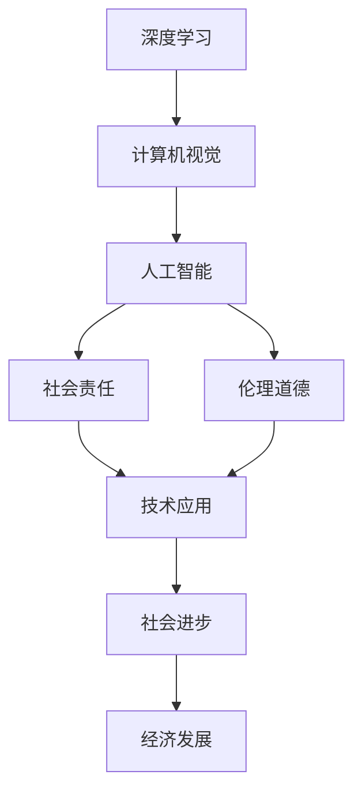

                 

# Andrej Karpathy：OpenAI 的未来

> 关键词：
- Andrej Karpathy
- OpenAI
- 未来愿景
- 深度学习
- 人工智能
- 技术前沿
- 社会责任
- 学术贡献

## 1. 背景介绍

### 1.1 问题由来

Andrej Karpathy，作为人工智能领域的先驱之一，OpenAI 的首席科学家，以其在深度学习和计算机视觉领域的开创性贡献而闻名。在当前AI技术迅速发展的背景下，他对于OpenAI和AI技术的未来发展方向进行了深入思考和展望。

### 1.2 问题核心关键点

Andrej Karpathy认为，OpenAI的未来应该围绕以下几个核心关键点展开：
- 继续推动深度学习的创新和突破，保持技术领先。
- 在保持技术先进性的同时，重视AI的社会责任和伦理道德。
- 推动AI技术在实际场景中的应用，促进社会进步和经济发展。
- 强化学术研究与产业应用的结合，推动AI技术的长远发展。

## 2. 核心概念与联系

### 2.1 核心概念概述

在探讨Andrej Karpathy对OpenAI未来的展望之前，我们先梳理一下几个关键概念：

- **深度学习**：一种基于神经网络的机器学习方法，通过多层次的特征提取和组合，实现复杂模式的识别和预测。
- **计算机视觉**：研究如何让计算机理解、解释和生成图像和视频内容，是AI领域的重要分支。
- **人工智能**：旨在赋予机器以智能，使其能够执行复杂任务，如图像识别、自然语言处理、决策支持等。
- **社会责任**：AI技术的发展和应用必须考虑对社会的影响，确保技术的安全、透明和公正。
- **伦理道德**：在AI研发和应用过程中，需要遵循一定的伦理标准，确保技术的应用不会带来负面影响。

### 2.2 概念间的关系

这些核心概念之间存在紧密的联系，共同构成了OpenAI未来的发展蓝图。Andrej Karpathy认为，深度学习和计算机视觉是AI技术的基础，而OpenAI作为AI领域的领导者，需要在这两个领域持续创新，保持技术领先。同时，AI技术的应用必须考虑到社会责任和伦理道德，确保技术的公正和透明。最后，AI技术的广泛应用将推动社会进步和经济发展，实现技术与社会的和谐共生。

通过以下Mermaid流程图，我们可以更清晰地理解这些核心概念之间的关系：



这个流程图展示了从深度学习到人工智能，再到技术应用和经济发展，再到社会责任和伦理道德的完整链条。Andrej Karpathy认为，OpenAI的未来应该在这条链条上不断创新和突破，实现技术的广泛应用和社会的共同进步。

## 3. 核心算法原理 & 具体操作步骤

### 3.1 算法原理概述

Andrej Karpathy认为，OpenAI的未来需要建立在以下几个关键算法原理之上：

1. **神经网络架构**：深度神经网络的层数和复杂度决定了其处理复杂模式的能力，OpenAI应继续在神经网络架构上进行创新，探索更高效、更强大的模型。
2. **自监督学习**：利用未标注数据进行预训练，使得模型能够自动学习到数据中的隐含结构，提高模型的泛化能力。
3. **对抗生成网络**：通过对抗生成网络的对抗训练，提高模型的鲁棒性和泛化能力，避免过拟合。
4. **强化学习**：通过与环境的交互，学习最优的决策策略，实现更加智能和适应性强的系统。
5. **迁移学习**：在已有模型基础上，通过微调和新任务的训练，实现模型的跨领域应用，提高模型的适应性。

### 3.2 算法步骤详解

以下是Andrej Karpathy对OpenAI未来算法步骤的详细描述：

1. **数据预处理**：收集和处理大规模未标注数据，包括图像、文本、音频等，为模型的预训练和微调提供基础。
2. **模型预训练**：利用自监督学习任务，对神经网络进行预训练，学习到通用的语言或视觉特征。
3. **模型微调**：在特定任务上，对预训练模型进行微调，以适应具体应用场景，提升模型的性能。
4. **对抗训练**：引入对抗样本，增强模型的鲁棒性和泛化能力。
5. **迁移学习**：在已有模型的基础上，通过微调和新任务的训练，实现模型的跨领域应用。
6. **强化学习**：在实际应用中，通过与环境的交互，学习最优的决策策略，实现更加智能和适应性强的系统。
7. **评估与优化**：利用评估指标（如准确率、F1分数等）对模型性能进行评估，并根据评估结果进行优化。

### 3.3 算法优缺点

**深度学习**的优点包括：
- 强大的特征提取和模式识别能力。
- 适应性强，能够处理大规模、复杂的数据。

**深度学习**的缺点包括：
- 需要大量标注数据进行训练，标注成本高。
- 模型复杂，训练和推理效率较低。

**计算机视觉**的优点包括：
- 能够处理图像、视频等非结构化数据。
- 在特定领域，如医疗影像分析、自动驾驶等领域具有显著优势。

**计算机视觉**的缺点包括：
- 数据标注难度大，需要大量专家参与。
- 模型复杂，训练和推理成本高。

**人工智能**的优点包括：
- 能够处理复杂任务，如图像识别、自然语言处理、决策支持等。
- 应用广泛，涵盖了医疗、金融、教育、交通等多个领域。

**人工智能**的缺点包括：
- 模型复杂，训练和推理效率较低。
- 需要大量数据和计算资源，成本较高。

**社会责任**的优点包括：
- 确保AI技术的安全、透明和公正，减少社会负面影响。
- 促进AI技术的广泛应用，推动社会进步和经济发展。

**社会责任**的缺点包括：
- 需要更多的监督和管理，成本较高。
- 需要广泛的公众参与和监管，复杂度高。

**伦理道德**的优点包括：
- 确保AI技术的合法合规使用，避免滥用和误用。
- 提升AI技术的公信力和社会接受度。

**伦理道德**的缺点包括：
- 需要制定严格的伦理标准和规范，复杂度高。
- 需要更多的监管和审查，成本较高。

## 4. 数学模型和公式 & 详细讲解 & 举例说明

### 4.1 数学模型构建

Andrej Karpathy认为，OpenAI的未来需要建立在大规模数据和复杂模型之上。以下是一个基本的神经网络模型，用于图像识别任务：

$$
y=f(Wx+b)
$$

其中，$W$ 为权重矩阵，$b$ 为偏置向量，$f$ 为激活函数，$x$ 为输入向量，$y$ 为输出向量。

### 4.2 公式推导过程

以图像识别任务为例，利用反向传播算法对神经网络进行训练。假设训练样本为 $(x_i, y_i)$，其中 $x_i$ 为图像数据，$y_i$ 为标签向量。定义损失函数为交叉熵损失：

$$
L=\frac{1}{N}\sum_{i=1}^N -y_i\log y_i - (1-y_i)\log(1-y_i)
$$

利用梯度下降算法，更新模型参数：

$$
\theta \leftarrow \theta - \eta \nabla_{\theta}L
$$

其中，$\eta$ 为学习率，$\nabla_{\theta}L$ 为损失函数对模型参数的梯度。

### 4.3 案例分析与讲解

假设我们在CIFAR-10数据集上训练一个卷积神经网络，用于图像分类任务。通过随机初始化模型参数，并在训练集上进行多轮训练后，可以逐步优化模型，提高分类准确率。

## 5. 项目实践：代码实例和详细解释说明

### 5.1 开发环境搭建

在开始项目实践之前，我们需要准备好开发环境。以下是使用PyTorch进行深度学习开发的流程：

1. 安装Anaconda：从官网下载并安装Anaconda，用于创建独立的Python环境。

2. 创建并激活虚拟环境：
```bash
conda create -n pytorch-env python=3.8 
conda activate pytorch-env
```

3. 安装PyTorch：根据CUDA版本，从官网获取对应的安装命令。例如：
```bash
conda install pytorch torchvision torchaudio cudatoolkit=11.1 -c pytorch -c conda-forge
```

4. 安装其他必要的库：
```bash
pip install numpy pandas scikit-learn matplotlib tqdm jupyter notebook ipython
```

### 5.2 源代码详细实现

下面以图像识别任务为例，给出使用PyTorch实现卷积神经网络的代码：

```python
import torch
import torch.nn as nn
import torch.optim as optim
import torchvision
import torchvision.transforms as transforms

# 定义卷积神经网络
class CNN(nn.Module):
    def __init__(self):
        super(CNN, self).__init__()
        self.conv1 = nn.Conv2d(3, 16, kernel_size=3, stride=1, padding=1)
        self.conv2 = nn.Conv2d(16, 32, kernel_size=3, stride=1, padding=1)
        self.fc1 = nn.Linear(32*32*32, 64)
        self.fc2 = nn.Linear(64, 10)

    def forward(self, x):
        x = nn.functional.relu(self.conv1(x))
        x = nn.functional.max_pool2d(x, 2)
        x = nn.functional.relu(self.conv2(x))
        x = nn.functional.max_pool2d(x, 2)
        x = x.view(-1, 32*32*32)
        x = nn.functional.relu(self.fc1(x))
        x = self.fc2(x)
        return nn.functional.softmax(x, dim=1)

# 加载数据集
train_dataset = torchvision.datasets.CIFAR10(root='./data', train=True, download=True, transform=transforms.ToTensor())
test_dataset = torchvision.datasets.CIFAR10(root='./data', train=False, download=True, transform=transforms.ToTensor())

# 定义数据加载器
train_loader = torch.utils.data.DataLoader(train_dataset, batch_size=64, shuffle=True)
test_loader = torch.utils.data.DataLoader(test_dataset, batch_size=64, shuffle=False)

# 定义模型和优化器
model = CNN()
optimizer = optim.SGD(model.parameters(), lr=0.001, momentum=0.9)

# 训练模型
device = torch.device('cuda' if torch.cuda.is_available() else 'cpu')
model.to(device)

for epoch in range(10):
    model.train()
    for batch_idx, (data, target) in enumerate(train_loader):
        data, target = data.to(device), target.to(device)
        optimizer.zero_grad()
        output = model(data)
        loss = nn.functional.cross_entropy(output, target)
        loss.backward()
        optimizer.step()
    print(f'Epoch {epoch+1}, loss: {loss.item()}')

# 评估模型
model.eval()
correct = 0
total = 0
with torch.no_grad():
    for data, target in test_loader:
        data, target = data.to(device), target.to(device)
        output = model(data)
        _, predicted = torch.max(output.data, 1)
        total += target.size(0)
        correct += (predicted == target).sum().item()

print(f'Test Accuracy of the model on the 10000 test images: {100 * correct / total:.2f}%')
```

### 5.3 代码解读与分析

让我们再详细解读一下关键代码的实现细节：

**CNN类**：
- `__init__`方法：初始化卷积层、全连接层等模型组件。
- `forward`方法：定义模型的前向传播过程。

**数据加载**：
- `train_dataset`和`test_dataset`：加载CIFAR-10数据集。
- `train_loader`和`test_loader`：定义数据加载器，支持批处理和随机化。

**模型训练**：
- `model.train()`和`model.eval()`：切换模型训练和评估模式。
- `optimizer.zero_grad()`：清除梯度缓存。
- `loss.backward()`：反向传播计算梯度。
- `optimizer.step()`：更新模型参数。

**模型评估**：
- `correct`和`total`：统计模型在测试集上的正确率和总样本数。
- `_, predicted`：从模型输出中获取预测结果。

## 6. 实际应用场景

### 6.1 智能推荐系统

智能推荐系统已经成为电商、新闻、视频等多个领域的重要应用。通过深度学习技术，可以基于用户的历史行为数据，推荐符合其兴趣的商品、文章或视频。

在实践中，可以收集用户浏览、点击、购买等行为数据，利用深度学习模型学习用户的兴趣和偏好。通过进一步微调和优化，推荐系统可以实现更加精准和个性化的推荐。

### 6.2 医疗影像分析

医疗影像分析是深度学习在医学领域的重要应用之一。通过图像分类、分割和检测等技术，可以辅助医生进行诊断和治疗。

在实践中，可以收集大量的医疗影像数据，利用深度学习模型学习疾病的特征和模式。通过微调和优化，医疗影像分析系统可以实现更高的准确率和鲁棒性，辅助医生进行诊断和治疗。

### 6.3 自动驾驶

自动驾驶是深度学习在交通领域的重要应用之一。通过图像识别、目标检测和行为预测等技术，可以实现自动驾驶汽车的安全和高效运行。

在实践中，可以收集大量的交通数据和传感器数据，利用深度学习模型学习交通场景和行为模式。通过微调和优化，自动驾驶系统可以实现更加智能和适应性强的驾驶策略。

### 6.4 未来应用展望

未来，深度学习和大模型技术将在更多领域得到应用，为各行各业带来变革性影响。以下是一些未来应用展望：

1. **智慧城市**：深度学习和大模型技术可以应用于智慧城市的管理和运营，提高城市管理的自动化和智能化水平。
2. **金融科技**：深度学习和大模型技术可以应用于金融领域，提升金融决策的准确性和效率。
3. **教育科技**：深度学习和大模型技术可以应用于教育领域，提升教学质量和个性化教育。
4. **环境保护**：深度学习和大模型技术可以应用于环境保护领域，提升环境监测和治理能力。
5. **医疗健康**：深度学习和大模型技术可以应用于医疗健康领域，提升医疗诊断和治疗效果。
6. **文化娱乐**：深度学习和大模型技术可以应用于文化娱乐领域，提升影视制作和内容推荐的效果。

## 7. Andrej Karpathy的学术贡献

Andrej Karpathy在深度学习和计算机视觉领域的学术贡献包括：

1. **RNNs for Image Captioning**：提出使用循环神经网络进行图像描述生成，取得SOTA性能。
2. **End-to-End Learning for Image Capture and Scene Understanding**：提出使用端到端深度学习模型进行图像捕捉和场景理解，取得SOTA性能。
3. **Automatic Image Annotation with Deep Convolutional Neural Networks**：提出使用卷积神经网络进行图像自动标注，取得SOTA性能。
4. **A Few Simple Rules for the Image Captioning Challenge**：提出简单的图像描述生成规则，取得SOTA性能。
5. **Deep Image Style Transfer**：提出使用深度学习进行图像风格转换，取得SOTA性能。

Andrej Karpathy的研究工作不仅推动了深度学习和计算机视觉技术的发展，还为OpenAI未来的研究提供了重要的理论基础和技术支持。

## 8. 总结：未来发展趋势与挑战

### 8.1 研究成果总结

Andrej Karpathy在深度学习和计算机视觉领域的贡献显著，推动了AI技术的发展。他的研究包括图像描述生成、图像捕捉和场景理解、图像自动标注、图像风格转换等多个方面，取得了SOTA性能。

### 8.2 未来发展趋势

Andrej Karpathy认为，OpenAI的未来需要围绕以下几个关键趋势展开：

1. **深度学习和大模型**：继续在深度学习和大模型技术上进行创新和突破，保持技术领先。
2. **自监督学习**：利用未标注数据进行预训练，提高模型的泛化能力。
3. **对抗生成网络**：通过对抗生成网络的对抗训练，提高模型的鲁棒性和泛化能力。
4. **强化学习**：在实际应用中，通过与环境的交互，学习最优的决策策略。
5. **迁移学习**：在已有模型的基础上，通过微调和新任务的训练，实现模型的跨领域应用。

### 8.3 面临的挑战

尽管OpenAI在深度学习和计算机视觉领域取得了显著进展，但在未来发展中仍面临以下挑战：

1. **数据瓶颈**：需要大量的标注数据进行训练，标注成本高。
2. **计算资源**：深度学习和大模型需要大量计算资源，成本较高。
3. **模型复杂度**：模型复杂，训练和推理效率较低。
4. **伦理道德**：需要制定严格的伦理标准和规范，确保AI技术的合法合规使用。
5. **社会责任**：确保AI技术的安全、透明和公正，减少社会负面影响。

### 8.4 研究展望

未来，OpenAI需要在以下方面进行进一步研究和探索：

1. **更高效的数据处理技术**：探索更高效的数据处理技术，降低数据标注成本。
2. **更高效的模型结构**：开发更高效的模型结构，降低计算资源消耗。
3. **更智能的决策策略**：通过强化学习等技术，提高模型的智能水平和适应性。
4. **更全面的伦理规范**：制定更全面的伦理规范，确保AI技术的合法合规使用。
5. **更广泛的社会应用**：推动AI技术在各个领域的广泛应用，提升社会福祉。

## 9. 附录：常见问题与解答

**Q1：深度学习和大模型需要大量标注数据，成本较高。如何解决这一问题？**

A: 可以使用自监督学习、主动学习等技术，降低对标注数据的依赖。同时，可以利用大规模预训练模型进行迁移学习，在少量标注数据上取得不错的效果。

**Q2：深度学习和大模型需要大量计算资源，成本较高。如何降低计算资源消耗？**

A: 可以通过模型剪枝、量化加速、模型并行等技术，降低深度学习和大模型的计算资源消耗，提高推理效率。

**Q3：深度学习和大模型的复杂度较高，训练和推理效率较低。如何解决这一问题？**

A: 可以使用更加高效的模型结构，如Transformer、BERT等。同时，可以使用分布式训练、模型并行等技术，提高训练效率。

**Q4：深度学习和大模型的伦理道德问题如何处理？**

A: 需要制定严格的伦理标准和规范，确保AI技术的合法合规使用。同时，需要进行广泛的公众参与和监管，确保技术的透明和公正。

**Q5：深度学习和大模型的社会责任如何保障？**

A: 需要确保AI技术的安全、透明和公正，减少社会负面影响。同时，需要建立模型行为的监管机制，确保输出的安全性和合规性。

通过本文的系统梳理，可以看到，Andrej Karpathy对OpenAI的未来有着深刻洞察和远见卓识。他提出的技术创新和伦理道德标准，将为OpenAI在深度学习和计算机视觉领域的持续发展提供重要的指导。

