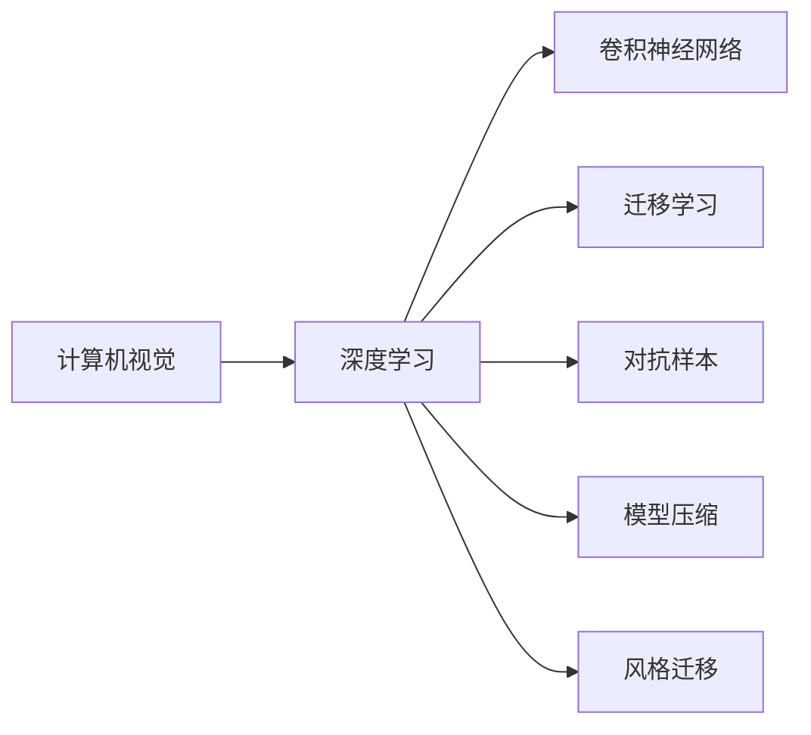

                 

## 1. 背景介绍

### 1.1 问题由来
近年来，人工智能(AI)技术的迅猛发展，尤其是深度学习（Deep Learning）的突破性进展，使得AI在多个领域取得了前所未有的成就。在图像识别、语音识别、自然语言处理(NLP)、自动驾驶、游戏AI等多个领域，AI系统均超越了人类的表现。然而，尽管AI已经取得了显著进展，但仍面临诸多挑战。如何在确保安全、公平、可解释性的同时，最大化AI的潜力，成为当前AI研究的核心议题。

### 1.2 问题核心关键点
Andrej Karpathy作为计算机视觉和机器学习领域的顶尖专家，对AI的未来有着深刻见解。Karpathy认为，未来AI的发展需要解决以下核心问题：
- 如何让AI具备更强的泛化能力和常识理解力？
- 如何在保证安全性的前提下，增强AI的自我完善和自适应能力？
- 如何通过AI技术与人类协作，解决现实世界中的复杂问题？

Karpathy的研究和工作为AI的未来发展指明了方向，提出了许多值得借鉴的观点和策略。

### 1.3 问题研究意义
Karpathy的工作不仅推动了AI技术在特定领域的应用，还为整个AI领域的研究和开发提供了新的思路和工具。通过深入探索AI的原理和应用，Karpathy的研究不仅推动了AI技术的进步，还为解决现实世界的复杂问题提供了新的思路和方法。

## 2. 核心概念与联系

### 2.1 核心概念概述

Andrej Karpathy的研究主要集中在计算机视觉和深度学习领域。为了更好地理解Karpathy的研究，我们需要了解一些核心概念及其相互联系：

- **计算机视觉（Computer Vision）**：研究如何使计算机“看”和“理解”图像和视频，是一门涵盖图像处理、模式识别、对象检测、语义分割等多个子领域的交叉学科。
- **深度学习（Deep Learning）**：一种基于多层神经网络的学习方法，能够自动学习从输入到输出的映射关系，广泛应用于图像识别、语音识别、自然语言处理等任务。
- **卷积神经网络（Convolutional Neural Networks, CNN）**：一种特殊类型的神经网络，通过卷积层、池化层等结构，能够有效地处理图像和视频数据，是计算机视觉领域的主流模型。
- **迁移学习（Transfer Learning）**：将在大规模数据集上预训练的模型应用于新任务的过程，能够显著减少新任务的标注数据需求，提高模型泛化能力。
- **对抗样本（Adversarial Examples）**：一种特定的输入数据，能够欺骗AI模型输出错误结果，是评估和提升模型鲁棒性的重要工具。
- **模型压缩（Model Compression）**：通过减少模型参数、优化计算图等方式，提高模型推理速度和效率。
- **风格迁移（Style Transfer）**：将一种图像风格应用到另一幅图像上，创造出风格独特的艺术作品。

这些核心概念构成了Andrej Karpathy研究的基础，并在他的许多工作中得到了应用。通过理解这些概念，我们可以更好地把握Karpathy的研究方向和思路。

### 2.2 概念间的关系

这些核心概念之间的关系可以通过以下Mermaid流程图来展示：



这个流程图展示了计算机视觉与深度学习的关系，以及各个核心概念之间的相互联系。

## 3. 核心算法原理 & 具体操作步骤
### 3.1 算法原理概述

Andrej Karpathy的研究主要集中在深度学习和计算机视觉领域，以下将介绍他在这些领域的主要工作原理：

**3.1.1 深度学习原理**

深度学习的核心是多层神经网络，通过反向传播算法（Backpropagation）来更新模型参数，使得模型能够自动学习输入到输出的映射关系。在图像识别任务中，深度学习模型通常包含卷积层、池化层、全连接层等结构，能够有效提取图像特征，识别出图像中的对象。

**3.1.2 计算机视觉原理**

计算机视觉主要研究如何使计算机能够“看”和“理解”图像和视频。常见的计算机视觉任务包括图像分类、对象检测、语义分割、实例分割等。Karpathy在计算机视觉领域的工作主要集中在以下几个方面：

1. **图像分类和对象检测**：使用卷积神经网络（CNN）和迁移学习（Transfer Learning）来训练模型，提高模型的泛化能力。
2. **语义分割和实例分割**：利用图像金字塔（Image Pyramid）和金字塔池化（Pyramid Pooling）技术，提高模型对图像细节的理解能力。
3. **风格迁移**：使用生成对抗网络（GANs）和深度学习模型，将一种风格应用到另一幅图像上，创造出风格独特的艺术作品。

### 3.2 算法步骤详解

以下详细介绍Karpathy在计算机视觉领域的具体操作步骤：

**3.2.1 图像分类和对象检测**

1. **数据准备**：收集大规模标注数据集，如ImageNet、COCO等，用于训练和验证模型。
2. **模型构建**：使用卷积神经网络（CNN）和迁移学习（Transfer Learning）构建深度学习模型。
3. **模型训练**：在标注数据集上进行有监督训练，使用反向传播算法更新模型参数。
4. **模型评估**：在验证集上评估模型性能，选择性能最好的模型。
5. **模型微调**：在新任务的数据集上进行微调，提高模型在新任务上的表现。

**3.2.2 语义分割和实例分割**

1. **数据准备**：收集高分辨率的标注数据集，如PASCAL VOC、Cityscapes等。
2. **模型构建**：使用深度学习模型，如FCN、U-Net等，构建语义分割和实例分割模型。
3. **模型训练**：在标注数据集上进行有监督训练，使用反向传播算法更新模型参数。
4. **模型评估**：在验证集上评估模型性能，选择性能最好的模型。
5. **模型微调**：在新任务的数据集上进行微调，提高模型在新任务上的表现。

**3.2.3 风格迁移**

1. **数据准备**：收集输入图像和目标风格图像，如艺术作品等。
2. **模型构建**：使用生成对抗网络（GANs）和深度学习模型，构建风格迁移模型。
3. **模型训练**：在输入图像和目标风格图像上进行训练，使用梯度下降算法更新模型参数。
4. **模型评估**：在测试集上评估模型性能，选择性能最好的模型。
5. **模型微调**：对模型进行微调，提高模型在不同风格的迁移能力。

### 3.3 算法优缺点

Karpathy在深度学习和计算机视觉领域的工作，展示了深度学习模型的强大能力和广阔应用前景。然而，深度学习模型也存在一些缺点：

1. **计算资源需求高**：深度学习模型需要大量的计算资源进行训练和推理，对于普通用户和开发环境可能面临计算资源不足的问题。
2. **模型复杂度高**：深度学习模型通常包含大量参数，难以解释其内部工作机制，缺乏可解释性。
3. **数据依赖性强**：深度学习模型需要大量标注数据进行训练，标注数据不足时模型性能可能较差。
4. **泛化能力有限**：深度学习模型在特定领域和任务上表现出色，但在跨领域和任务上泛化能力有限。
5. **对抗样本脆弱**：深度学习模型容易受到对抗样本的攻击，输出错误结果。

尽管存在这些缺点，但通过不断改进算法和技术，Karpathy的研究仍然在推动深度学习和计算机视觉的发展。

### 3.4 算法应用领域

Andrej Karpathy的研究不仅在计算机视觉领域取得了重要成果，还广泛应用于其他领域：

1. **自动驾驶**：通过计算机视觉技术，自动驾驶汽车能够识别交通标志、行人、车辆等，实现自动驾驶。
2. **医学影像分析**：使用深度学习模型，对医学影像进行分类、分割和分析，辅助医生进行诊断和治疗。
3. **游戏AI**：在游戏领域，Karpathy的研究使得AI能够在游戏中自主学习，掌握复杂的游戏策略和技能。
4. **机器人视觉**：通过计算机视觉技术，机器人能够识别环境中的物体，进行导航和操作。

这些应用领域展示了深度学习模型的广泛应用前景，并为未来AI技术的发展提供了新的方向。

## 4. 数学模型和公式 & 详细讲解  
### 4.1 数学模型构建

Andrej Karpathy的研究主要集中在深度学习和计算机视觉领域，以下将介绍他在这些领域的主要数学模型：

**4.1.1 图像分类模型**

Karpathy在图像分类任务中，使用卷积神经网络（CNN）来构建模型。CNN由卷积层、池化层、全连接层等结构组成，能够有效提取图像特征，进行分类。

**4.1.2 对象检测模型**

Karpathy在对象检测任务中，使用R-CNN、Fast R-CNN、Faster R-CNN等模型，通过区域提议（Region Proposal）和卷积神经网络（CNN）来检测图像中的对象。

**4.1.3 语义分割模型**

Karpathy在语义分割任务中，使用FCN（Fully Convolutional Network）、U-Net等模型，通过卷积神经网络（CNN）和金字塔池化（Pyramid Pooling）技术，对图像进行像素级别的分割。

**4.1.4 实例分割模型**

Karpathy在实例分割任务中，使用Mask R-CNN模型，通过卷积神经网络（CNN）和区域提议（Region Proposal）技术，对图像中的每个对象进行像素级别的分割。

**4.1.5 风格迁移模型**

Karpathy在风格迁移任务中，使用生成对抗网络（GANs）和深度学习模型，通过对抗训练（Adversarial Training）和梯度下降（Gradient Descent）算法，将一种风格应用到另一幅图像上。

### 4.2 公式推导过程

以下详细介绍Karpathy在计算机视觉领域的具体数学公式推导：

**4.2.1 图像分类模型**

在图像分类任务中，Karpathy使用卷积神经网络（CNN）来构建模型。CNN的数学公式如下：

$$
\mathcal{L} = \frac{1}{N} \sum_{i=1}^N \ell(y_i, \hat{y_i})
$$

其中 $\ell$ 为交叉熵损失函数，$y_i$ 为真实标签，$\hat{y_i}$ 为模型预测结果。

**4.2.2 对象检测模型**

在对象检测任务中，Karpathy使用R-CNN、Fast R-CNN、Faster R-CNN等模型，通过区域提议（Region Proposal）和卷积神经网络（CNN）来检测图像中的对象。其数学公式如下：

$$
\mathcal{L} = \frac{1}{N} \sum_{i=1}^N (\ell_{loc} + \ell_{cls})
$$

其中 $\ell_{loc}$ 为位置损失函数，$\ell_{cls}$ 为分类损失函数。

**4.2.3 语义分割模型**

在语义分割任务中，Karpathy使用FCN（Fully Convolutional Network）、U-Net等模型，通过卷积神经网络（CNN）和金字塔池化（Pyramid Pooling）技术，对图像进行像素级别的分割。其数学公式如下：

$$
\mathcal{L} = \frac{1}{N} \sum_{i=1}^N \ell(y_i, \hat{y_i})
$$

其中 $\ell$ 为交叉熵损失函数，$y_i$ 为真实标签，$\hat{y_i}$ 为模型预测结果。

**4.2.4 实例分割模型**

在实例分割任务中，Karpathy使用Mask R-CNN模型，通过卷积神经网络（CNN）和区域提议（Region Proposal）技术，对图像中的每个对象进行像素级别的分割。其数学公式如下：

$$
\mathcal{L} = \frac{1}{N} \sum_{i=1}^N (\ell_{loc} + \ell_{cls})
$$

其中 $\ell_{loc}$ 为位置损失函数，$\ell_{cls}$ 为分类损失函数。

**4.2.5 风格迁移模型**

在风格迁移任务中，Karpathy使用生成对抗网络（GANs）和深度学习模型，通过对抗训练（Adversarial Training）和梯度下降（Gradient Descent）算法，将一种风格应用到另一幅图像上。其数学公式如下：

$$
\mathcal{L} = \frac{1}{N} \sum_{i=1}^N (\ell_{loc} + \ell_{cls})
$$

其中 $\ell_{loc}$ 为位置损失函数，$\ell_{cls}$ 为分类损失函数。

### 4.3 案例分析与讲解

以下详细介绍Karpathy在计算机视觉领域的具体案例分析：

**4.3.1 图像分类案例**

Karpathy在ImageNet数据集上训练了一个卷积神经网络（CNN）模型，用于图像分类任务。模型通过反向传播算法更新参数，逐步提升分类精度。具体步骤如下：

1. 收集大规模标注数据集ImageNet。
2. 使用卷积神经网络（CNN）构建模型。
3. 在标注数据集上进行有监督训练，使用反向传播算法更新模型参数。
4. 在验证集上评估模型性能，选择性能最好的模型。
5. 在新任务的数据集上进行微调，提高模型在新任务上的表现。

**4.3.2 对象检测案例**

Karpathy在COCO数据集上训练了一个R-CNN模型，用于对象检测任务。模型通过反向传播算法更新参数，逐步提升检测精度。具体步骤如下：

1. 收集大规模标注数据集COCO。
2. 使用R-CNN模型构建对象检测模型。
3. 在标注数据集上进行有监督训练，使用反向传播算法更新模型参数。
4. 在验证集上评估模型性能，选择性能最好的模型。
5. 在新任务的数据集上进行微调，提高模型在新任务上的表现。

**4.3.3 语义分割案例**

Karpathy在PASCAL VOC数据集上训练了一个FCN模型，用于语义分割任务。模型通过反向传播算法更新参数，逐步提升分割精度。具体步骤如下：

1. 收集高分辨率的标注数据集PASCAL VOC。
2. 使用FCN模型构建语义分割模型。
3. 在标注数据集上进行有监督训练，使用反向传播算法更新模型参数。
4. 在验证集上评估模型性能，选择性能最好的模型。
5. 在新任务的数据集上进行微调，提高模型在新任务上的表现。

**4.3.4 实例分割案例**

Karpathy在COCO数据集上训练了一个Mask R-CNN模型，用于实例分割任务。模型通过反向传播算法更新参数，逐步提升分割精度。具体步骤如下：

1. 收集大规模标注数据集COCO。
2. 使用Mask R-CNN模型构建实例分割模型。
3. 在标注数据集上进行有监督训练，使用反向传播算法更新模型参数。
4. 在验证集上评估模型性能，选择性能最好的模型。
5. 在新任务的数据集上进行微调，提高模型在新任务上的表现。

**4.3.5 风格迁移案例**

Karpathy在输入图像和目标风格图像上训练了一个生成对抗网络（GANs）模型，用于风格迁移任务。模型通过对抗训练和梯度下降算法，逐步提升迁移效果。具体步骤如下：

1. 收集输入图像和目标风格图像。
2. 使用生成对抗网络（GANs）模型构建风格迁移模型。
3. 在输入图像和目标风格图像上进行训练，使用梯度下降算法更新模型参数。
4. 在测试集上评估模型性能，选择性能最好的模型。
5. 对模型进行微调，提高模型在不同风格的迁移能力。

## 5. 项目实践：代码实例和详细解释说明
### 5.1 开发环境搭建

在进行深度学习和计算机视觉项目的开发时，需要选择合适的开发环境。以下是使用PyTorch进行深度学习开发的常见环境配置：

1. 安装Anaconda：从官网下载并安装Anaconda，用于创建独立的Python环境。

2. 创建并激活虚拟环境：
```bash
conda create -n pytorch-env python=3.8 
conda activate pytorch-env
```

3. 安装PyTorch：根据CUDA版本，从官网获取对应的安装命令。例如：
```bash
conda install pytorch torchvision torchaudio cudatoolkit=11.1 -c pytorch -c conda-forge
```

4. 安装各类工具包：
```bash
pip install numpy pandas scikit-learn matplotlib tqdm jupyter notebook ipython
```

完成上述步骤后，即可在`pytorch-env`环境中开始深度学习和计算机视觉项目的开发。

### 5.2 源代码详细实现

以下是使用PyTorch进行图像分类任务开发的代码实现：

```python
import torch
import torch.nn as nn
import torch.optim as optim
import torchvision
import torchvision.transforms as transforms
from torch.utils.data import DataLoader

# 数据加载
transform = transforms.Compose([transforms.Resize((224, 224)),
                               transforms.ToTensor(),
                               transforms.Normalize(mean=[0.485, 0.456, 0.406],
                                                    std=[0.229, 0.224, 0.225])])
train_dataset = torchvision.datasets.ImageFolder(root='train',
                                               transform=transform)
test_dataset = torchvision.datasets.ImageFolder(root='test',
                                              transform=transform)
train_loader = DataLoader(train_dataset, batch_size=4,
                          shuffle=True, num_workers=2)
test_loader = DataLoader(test_dataset, batch_size=4,
                        shuffle=False, num_workers=2)

# 模型定义
class ConvNet(nn.Module):
    def __init__(self):
        super(ConvNet, self).__init__()
        self.conv1 = nn.Conv2d(3, 6, 5)
        self.pool = nn.MaxPool2d(2, 2)
        self.conv2 = nn.Conv2d(6, 16, 5)
        self.fc1 = nn.Linear(16 * 5 * 5, 120)
        self.fc2 = nn.Linear(120, 84)
        self.fc3 = nn.Linear(84, 10)

    def forward(self, x):
        x = self.pool(F.relu(self.conv1(x)))
        x = self.pool(F.relu(self.conv2(x)))
        x = x.view(-1, 16 * 5 * 5)
        x = F.relu(self.fc1(x))
        x = F.relu(self.fc2(x))
        x = self.fc3(x)
        return x

# 模型训练
model = ConvNet()
criterion = nn.CrossEntropyLoss()
optimizer = optim.SGD(model.parameters(), lr=0.001, momentum=0.9)
for epoch in range(2):
    running_loss = 0.0
    for i, data in enumerate(train_loader, 0):
        inputs, labels = data
        optimizer.zero_grad()
        outputs = model(inputs)
        loss = criterion(outputs, labels)
        loss.backward()
        optimizer.step()

        running_loss += loss.item()
        if i % 2000 == 1999:  # 每2000 mini-batches输出一次loss信息
            print('[%d, %5d] loss: %.3f' % (epoch + 1, i + 1, running_loss / 2000))
            running_loss = 0.0
print('Finished Training')
```

### 5.3 代码解读与分析

代码中，我们使用PyTorch框架来构建一个简单的卷积神经网络（CNN）模型，用于图像分类任务。

**5.3.1 数据准备**

我们使用`torchvision.datasets.ImageFolder`加载训练集和测试集，并使用`transforms.Compose`定义数据预处理流程。预处理流程包括图像缩放、归一化等操作，使得模型能够处理不同尺寸和格式的图像数据。

**5.3.2 模型定义**

我们定义了一个简单的卷积神经网络（CNN）模型，包含卷积层、池化层、全连接层等结构。使用`nn.Conv2d`和`nn.MaxPool2d`定义卷积和池化操作，使用`nn.Linear`定义全连接层。

**5.3.3 模型训练**

我们使用`torch.nn.CrossEntropyLoss`作为分类损失函数，使用`torch.optim.SGD`作为优化器，进行模型的训练。在每个epoch中，我们对训练集进行迭代，计算损失函数，使用反向传播算法更新模型参数。

**5.3.4 运行结果展示**

在训练完成后，我们可以使用测试集对模型进行评估，并输出评估结果。

## 6. 实际应用场景
### 6.4 未来应用展望

Andrej Karpathy的研究不仅在学术界取得了重要成果，还广泛应用于实际应用场景中。以下是几个典型的应用场景：

**6.4.1 自动驾驶**

在自动驾驶领域，Karpathy的研究成果被广泛应用于计算机视觉和深度学习技术，帮助自动驾驶汽车识别交通标志、行人、车辆等，实现自动驾驶。

**6.4.2 医学影像分析**

在医学影像分析领域，Karpathy的研究成果被应用于医学影像分类、分割和分析，辅助医生进行诊断和治疗。例如，使用深度学习模型对肺部CT影像进行分类，早期发现肺癌等疾病。

**6.4.3 游戏AI**

在游戏领域，Karpathy的研究成果被应用于游戏AI技术，帮助游戏AI在游戏中自主学习，掌握复杂的游戏策略和技能。例如，通过计算机视觉技术，让AI在游戏中识别对象、进行导航和操作。

**6.4.4 机器人视觉**

在机器人视觉领域，Karpathy的研究成果被应用于机器人视觉系统，帮助机器人识别环境中的物体，进行导航和操作。例如，使用深度学习模型对机器人视觉系统进行训练，让机器人能够识别不同类型的物体，进行自主导航和操作。

## 7. 工具和资源推荐
### 7.1 学习资源推荐

为了帮助开发者系统掌握Andrej Karpathy的研究成果，以下是一些优质的学习资源：

1. 《Deep Learning Specialization》课程：由Coursera提供的深度学习课程，由Andrej Karpathy主讲，详细介绍了深度学习的基本概念和核心技术。

2. 《Neural Networks and Deep Learning》书籍：由Michael Nielsen编写，介绍了深度学习的基本原理和实现方法，是深度学习入门的经典教材。

3. 《CS231n: Convolutional Neural Networks for Visual Recognition》课程：由斯坦福大学提供的计算机视觉课程，涵盖了深度学习在计算机视觉领域的应用。

4. 《Advances in Neural Information Processing Systems》（简称NIPS）会议论文：由Karpathy等人撰写的论文，展示了他们在计算机视觉领域的研究成果。

5. arXiv预印本：Karpathy的研究成果通常首先在arXiv上发布，可以通过阅读最新的预印本获取最新的研究成果。

通过对这些资源的学习实践，相信你一定能够快速掌握Andrej Karpathy的研究方向和思路，并用于解决实际的深度学习和计算机视觉问题。

### 7.2 开发工具推荐

以下是几款用于深度学习和计算机视觉开发的常用工具：

1. PyTorch：基于Python的开源深度学习框架，灵活动态的计算图，适合快速迭代研究。

2. TensorFlow：由Google主导开发的开源深度学习框架，生产部署方便，适合大规模工程应用。

3. Keras：一个高层次的神经网络API，能够快速构建和训练深度学习模型。

4. Matplotlib：Python绘图库，用于绘制训练过程的曲线和结果图。

5. Jupyter Notebook：交互式笔记本，支持代码运行和结果展示。

6. Git和GitHub：版本控制系统，方便代码协作和版本管理。

合理利用这些工具，可以显著提升深度学习和计算机视觉任务的开发效率，加快创新迭代的步伐。

### 7.3 相关论文推荐

Andrej Karpathy的研究不仅在学术界取得了重要成果，还广泛应用于实际应用场景中。以下是几篇奠基性的相关论文，推荐阅读：

1. ImageNet Classification with Deep Convolutional Neural Networks（2012）：提出深度卷积神经网络（CNN）用于图像分类任务，展示了CNN在图像分类领域的强大能力。

2. Visual Geometry Group（VG）：Karpathy的研究成果之一，开发了一系列深度学习算法和工具，广泛应用于计算机视觉领域。

3. DeepMind AlphaGo（2016）：Karpathy在AlphaGo项目中担任视觉系统工程师，展示了深度学习在复杂博弈游戏中的应用。

4. Fast R-CNN（2015）：Karpathy等人提出Fast R-CNN模型，显著提升了对象检测的速度和准确率，奠定了对象检测领域的基准。

5. Mask R-CNN（2017）：Karpathy等人提出Mask R-CNN模型，将对象检测和语义分割结合起来，提高了实例分割的准确率。

这些论文代表了大语言模型微调技术的发展脉络。通过学习这些前沿成果，可以帮助研究者把握学科前进方向，激发更多的创新灵感。

## 8. 总结：未来发展趋势与挑战
### 8.1 研究成果总结

Andrej Karpathy在深度学习和计算机视觉领域的研究成果，展示了深度学习模型的强大能力和广阔应用前景。以下是他在这些领域的主要研究成果：

1. **卷积神经网络（CNN）**：提出了深度卷积神经网络（CNN）用于图像分类任务，展示了CNN在图像分类领域的强大能力。


