                 

# Andrej Karpathy：人工智能的未来发展方向

> 关键词：人工智能,深度学习,未来趋势,计算机视觉,自然语言处理,NLP,图像生成,计算机程序设计艺术

## 1. 背景介绍

### 1.1 问题由来
在现代科技日新月异的时代背景下，人工智能（AI）正以令人瞩目的速度发展。作为深度学习领域的先锋，Andrej Karpathy以其深厚的学术造诣和丰富的实践经验，对AI的未来发展趋势进行了深入的思考和预测。他的见解不仅体现在各大顶级AI会议的演讲中，也反映在他个人的研究和工程实践中。本文将全面探讨Andrej Karpathy对AI未来发展方向的看法，旨在为读者提供深刻的洞察和启示。

### 1.2 问题核心关键点
Andrej Karpathy在其研究和演讲中，强调了以下几个核心关键点，这些关键点构成了他对AI未来发展方向的总体看法：

1. **深度学习与神经网络的潜力**：深度学习通过构建多层次的神经网络模型，显著提升了在计算机视觉、自然语言处理等领域的表现，证明了其在AI领域的基础性地位。
2. **强化学习与控制理论的结合**：强化学习能够使AI系统在复杂环境中通过试错学习，逐步优化策略。结合控制理论，可以实现更加灵活和自适应的AI系统。
3. **多模态学习与跨领域融合**：多模态学习不仅融合了视觉、听觉、文本等多种数据源，还促进了跨领域知识的迁移和整合，提升了AI系统的智能水平。
4. **大规模预训练与迁移学习**：通过大规模无监督预训练，AI模型可以学习到丰富的知识表示，然后在下游任务中进行微调，实现知识的迁移和应用。
5. **AI伦理与社会责任**：AI技术的快速发展和应用带来了伦理和法律方面的挑战，强调了在追求技术进步的同时，需关注AI的社会影响和伦理问题。

这些关键点不仅勾勒出了AI未来的发展蓝图，也指明了当前研究和技术的前进方向。接下来，我们将从深度学习、强化学习、多模态学习、预训练与迁移学习以及AI伦理等角度，深入探讨Andrej Karpathy对AI未来发展的见解。

## 2. 核心概念与联系

### 2.1 核心概念概述

Andrej Karpathy在深度学习和AI领域的贡献，主要体现在以下几个核心概念上：

- **深度学习**：通过构建多层次神经网络，自动学习特征表示，实现复杂模式识别和数据分析。
- **神经网络**：由多层神经元组成，通过反向传播算法优化权重，提升模型性能。
- **强化学习**：通过试错学习，逐步优化策略，实现智能决策和控制。
- **多模态学习**：融合视觉、文本、音频等多种数据源，提升AI系统的感知能力。
- **大规模预训练**：通过在大规模无标签数据上预训练模型，学习通用知识表示。
- **迁移学习**：利用预训练模型的知识，在特定任务上进行微调，实现知识的迁移。
- **AI伦理**：探讨AI技术的应用和社会影响，强调技术进步与伦理责任的平衡。

这些概念之间的联系紧密，共同构成了AI技术发展的理论基础和实践框架。Andrej Karpathy认为，深度学习、强化学习、多模态学习和预训练与迁移学习是推动AI技术前进的关键技术，而AI伦理则是确保技术应用符合社会价值导向的重要保障。

### 2.2 概念间的关系

这些核心概念之间的关系可以通过以下Mermaid流程图来展示：

```mermaid
graph TB
    A[深度学习] --> B[神经网络]
    A --> C[强化学习]
    A --> D[多模态学习]
    A --> E[大规模预训练]
    A --> F[迁移学习]
    B --> G[特征表示]
    C --> H[智能决策]
    D --> I[感知能力]
    E --> J[知识表示]
    F --> K[知识迁移]
    G --> L[模型性能]
    H --> L
    I --> L
    J --> L
    K --> L
    L --> M[AI技术]
    M --> N[AI伦理]
    N --> O[社会影响]
```



这个流程图展示了大语言模型微调过程中各个核心概念的关系和作用：

1. 深度学习通过构建神经网络，自动学习特征表示。
2. 强化学习通过试错学习，优化智能决策。
3. 多模态学习融合多种数据源，提升感知能力。
4. 大规模预训练学习通用知识表示。
5. 迁移学习实现知识迁移，应用于特定任务。
6. 特征表示、智能决策、感知能力、知识表示、知识迁移等共同提升了AI技术的性能。
7. AI伦理确保技术应用符合社会价值导向。

通过理解这些核心概念及其关系，我们可以更好地把握AI技术的发展脉络和应用方向。

## 3. 核心算法原理 & 具体操作步骤

### 3.1 算法原理概述

Andrej Karpathy认为，AI技术的发展离不开深度学习和神经网络的基础。深度学习通过多层次的神经网络，自动学习特征表示，提升了模式识别和数据分析的准确性。神经网络通过反向传播算法优化权重，实现了复杂的模型训练。这些技术的结合，使得AI系统能够处理更加复杂的任务。

### 3.2 算法步骤详解

基于Andrej Karpathy的研究，深度学习和神经网络的训练过程大致分为以下几步：

1. **数据准备**：收集并预处理训练数据，包括数据增强、数据标准化等步骤。
2. **模型构建**：设计多层神经网络结构，包括卷积层、池化层、全连接层等。
3. **权重初始化**：随机初始化模型参数，如Xavier初始化、He初始化等。
4. **前向传播**：将输入数据送入网络，计算每个神经元的输出。
5. **损失计算**：计算模型输出与真实标签之间的差异，如均方误差、交叉熵等。
6. **反向传播**：通过链式法则，计算每个神经元对损失的贡献，更新权重。
7. **参数更新**：使用优化算法（如SGD、Adam等）更新模型参数。
8. **验证与调参**：在验证集上评估模型性能，调整超参数，如学习率、批大小等。
9. **模型评估**：在测试集上评估最终模型性能，输出结果。

### 3.3 算法优缺点

深度学习和神经网络的优点包括：

- **自动特征学习**：能够自动学习到数据的高级特征表示。
- **并行计算**：可以利用GPU、TPU等硬件加速训练过程。
- **可解释性**：通过可视化工具，可以理解模型内部机制。

缺点包括：

- **资源消耗大**：需要大量计算资源和存储资源。
- **过拟合风险**：需要精心设计数据增强和正则化技术。
- **可解释性不足**：复杂模型难以解释内部决策过程。

### 3.4 算法应用领域

Andrej Karpathy认为，深度学习和神经网络在多个领域得到了广泛应用，例如：

- **计算机视觉**：图像分类、目标检测、图像生成等。
- **自然语言处理**：文本分类、情感分析、机器翻译等。
- **机器人控制**：路径规划、动作生成、环境感知等。
- **语音识别**：语音识别、自动语音生成等。
- **生物信息学**：基因序列分析、蛋白质结构预测等。

## 4. 数学模型和公式 & 详细讲解 & 举例说明

### 4.1 数学模型构建

Andrej Karpathy在论文中详细介绍了深度学习和神经网络的基本数学模型。以下是一个典型的卷积神经网络（CNN）的数学模型：

$$
y = W_2 \sigma(W_1 z + b_1) + b_2
$$

其中，$z$ 为输入数据，$W_1$、$W_2$ 为卷积核权重，$b_1$、$b_2$ 为偏置项，$\sigma$ 为激活函数，通常采用ReLU或Sigmoid。

### 4.2 公式推导过程

以卷积神经网络为例，推导其在图像分类任务中的训练过程。假设输入图像为 $x$，输出类别为 $y$，损失函数为交叉熵损失：

$$
L(y, \hat{y}) = -\frac{1}{N}\sum_{i=1}^N y_i \log \hat{y}_i
$$

其中，$N$ 为样本数量，$y_i$ 为真实标签，$\hat{y}_i$ 为模型预测概率。

根据链式法则，计算损失函数对卷积核权重 $W_1$、$W_2$ 和偏置项 $b_1$、$b_2$ 的梯度：

$$
\frac{\partial L}{\partial W_1} = \frac{\partial L}{\partial \hat{y}} \frac{\partial \hat{y}}{\partial z} \frac{\partial z}{\partial W_1}
$$

$$
\frac{\partial L}{\partial W_2} = \frac{\partial L}{\partial \hat{y}} \frac{\partial \hat{y}}{\partial z} \frac{\partial z}{\partial W_2}
$$

$$
\frac{\partial L}{\partial b_1} = \frac{\partial L}{\partial \hat{y}} \frac{\partial \hat{y}}{\partial z} \frac{\partial z}{\partial b_1}
$$

$$
\frac{\partial L}{\partial b_2} = \frac{\partial L}{\partial \hat{y}} \frac{\partial \hat{y}}{\partial z} \frac{\partial z}{\partial b_2}
$$

通过反向传播算法，更新模型参数，使得损失函数最小化。

### 4.3 案例分析与讲解

以图像分类任务为例，Andrej Karpathy通过CIFAR-10数据集，展示了深度学习模型的训练过程。首先，收集并预处理数据集，将图像归一化并转换为张量形式。然后，设计一个卷积神经网络，包括卷积层、池化层、全连接层等。使用SGD优化器，设定学习率为0.1，训练100个epoch。在每个epoch结束时，计算验证集上的准确率，并在epoch数达到最大值时停止训练。

通过可视化工具，观察模型的训练过程和梯度变化，调整超参数，如批大小、学习率等，最终在测试集上取得了约70%的准确率。

## 5. 项目实践：代码实例和详细解释说明

### 5.1 开发环境搭建

进行深度学习和神经网络项目实践，需要搭建良好的开发环境。以下是搭建环境的步骤：

1. **安装Python**：选择Python 3.x版本，建议3.6或更高版本。
2. **安装深度学习框架**：如TensorFlow、PyTorch、Keras等。
3. **安装数据处理库**：如NumPy、Pandas、Scikit-Learn等。
4. **安装可视化工具**：如TensorBoard、Matplotlib等。

### 5.2 源代码详细实现

以下是使用PyTorch框架实现卷积神经网络进行图像分类的Python代码：

```python
import torch
import torch.nn as nn
import torch.optim as optim
import torchvision.transforms as transforms
from torchvision.datasets import CIFAR10
from torchvision.models import resnet18
from torch.utils.data import DataLoader

# 定义训练参数
batch_size = 64
learning_rate = 0.1
num_epochs = 100

# 加载数据集
transform = transforms.Compose([
    transforms.ToTensor(),
    transforms.Normalize((0.5, 0.5, 0.5), (0.5, 0.5, 0.5))
])

train_dataset = CIFAR10(root='./data', train=True, download=True, transform=transform)
test_dataset = CIFAR10(root='./data', train=False, download=True, transform=transform)

train_loader = DataLoader(train_dataset, batch_size=batch_size, shuffle=True)
test_loader = DataLoader(test_dataset, batch_size=batch_size, shuffle=False)

# 加载预训练模型
model = resnet18(pretrained=True)

# 定义损失函数和优化器
criterion = nn.CrossEntropyLoss()
optimizer = optim.SGD(model.parameters(), lr=learning_rate, momentum=0.9)

# 训练过程
for epoch in range(num_epochs):
    model.train()
    train_loss = 0.0
    correct = 0
    total = 0
    
    for data, target in train_loader:
        data, target = data.to(device), target.to(device)
        optimizer.zero_grad()
        output = model(data)
        loss = criterion(output, target)
        loss.backward()
        optimizer.step()
        train_loss += loss.item()
        _, predicted = output.max(1)
        total += target.size(0)
        correct += predicted.eq(target).sum().item()
        
    train_acc = correct / total
    
    model.eval()
    test_loss = 0.0
    total = 0
    correct = 0
    
    with torch.no_grad():
        for data, target in test_loader:
            data, target = data.to(device), target.to(device)
            output = model(data)
            loss = criterion(output, target)
            test_loss += loss.item()
            _, predicted = output.max(1)
            total += target.size(0)
            correct += predicted.eq(target).sum().item()
    
    test_acc = correct / total
    
    print(f'Epoch {epoch+1}, Train Loss: {train_loss/len(train_loader):.4f}, Train Acc: {train_acc:.4f}')
    print(f'Epoch {epoch+1}, Test Loss: {test_loss/len(test_loader):.4f}, Test Acc: {test_acc:.4f}')
```

### 5.3 代码解读与分析

这段代码实现了卷积神经网络进行CIFAR-10图像分类的完整流程。首先，我们定义了训练参数，包括批大小、学习率、epoch数等。然后，加载了CIFAR-10数据集，并对数据进行预处理。接着，加载了预训练的ResNet-18模型，定义了损失函数和优化器。在每个epoch中，我们进行前向传播、反向传播和参数更新，并在训练集和验证集上评估模型性能。最终，在测试集上输出最终的准确率。

### 5.4 运行结果展示

运行上述代码，可以看到模型在训练集和测试集上的准确率变化趋势。通常，我们会观察到模型在训练集上的准确率逐渐提高，而在测试集上的准确率变化较为平稳。这表明模型能够泛化到未见过的数据，并进行了有效的学习。

## 6. 实际应用场景

Andrej Karpathy认为，深度学习和神经网络在实际应用中，能够显著提升系统的性能和效率。以下是他对深度学习应用场景的详细分析：

### 6.1 图像分类与目标检测

深度学习在图像分类和目标检测领域取得了显著的成果。通过卷积神经网络，能够自动提取图像的高级特征表示，实现对复杂场景的分类和定位。Andrej Karpathy强调，随着硬件加速技术的进步，深度学习模型可以处理更大规模的图像数据，提升分类和检测的准确率。

### 6.2 自然语言处理

自然语言处理（NLP）领域是深度学习的重要应用之一。通过构建语言模型，能够自动学习文本数据的表示，进行情感分析、文本分类、机器翻译等任务。Andrej Karpathy认为，未来的NLP技术将更加注重多模态学习和跨领域融合，提升系统的智能水平。

### 6.3 机器人控制

深度学习在机器人控制领域也有广泛应用。通过强化学习，机器人能够通过试错学习，逐步优化控制策略，实现自主导航、路径规划、动作生成等任务。Andrej Karpathy指出，结合控制理论，深度学习模型可以实现更加灵活和自适应的控制。

### 6.4 生物信息学

深度学习在生物信息学领域也有重要的应用。通过构建基因序列预测模型，能够预测蛋白质结构和功能，加速药物研发和疾病诊断。Andrej Karpathy认为，未来的生物信息学技术将更加注重跨模态学习和跨领域融合，提升系统的复杂性和精确度。

## 7. 工具和资源推荐

### 7.1 学习资源推荐

为了帮助开发者掌握深度学习和神经网络技术，以下是Andrej Karpathy推荐的优质学习资源：

1. **Deep Learning Specialization**（由Coursera提供的深度学习课程）：由Andrew Ng主讲，涵盖了深度学习的基本概念和实践技巧。
2. **Fast.ai**：提供了一整套深度学习课程和实践项目，注重动手实践，快速上手。
3. **NeurIPS 2018 Lecture Notes**：包含深度学习和神经网络领域的最新研究成果和未来趋势。
4. **PyTorch官方文档**：详细介绍了PyTorch框架的使用方法和最佳实践。
5. **Google AI Blog**：谷歌AI团队定期发布深度学习和神经网络领域的研究进展和应用案例。

### 7.2 开发工具推荐

Andrej Karpathy推荐了以下开发工具，供开发者使用：

1. **PyTorch**：由Facebook开发的深度学习框架，具有灵活性和易用性。
2. **TensorFlow**：由Google开发的深度学习框架，适合大规模工程应用。
3. **Keras**：高层API，提供简单易用的深度学习模型构建工具。
4. **TensorBoard**：用于可视化训练过程和模型性能的工具。
5. **Jupyter Notebook**：交互式编程环境，适合快速实验和分享。

### 7.3 相关论文推荐

Andrej Karpathy在其论文和演讲中，分享了深度学习和神经网络领域的最新研究成果。以下是几篇值得关注的论文：

1. **ImageNet Classification with Deep Convolutional Neural Networks**（AlexNet论文）：标志着深度学习在图像分类任务上的突破。
2. **Very Deep Convolutional Networks for Large-Scale Image Recognition**（VGG论文）：提出了多层次卷积网络，提升了图像分类的准确率。
3. **Residual Networks for Image Recognition**（ResNet论文）：通过残差连接解决了深层网络训练困难的问题。
4. **Attention is All You Need**（Transformer论文）：提出了自注意力机制，提升了序列建模的性能。
5. **Playing Atari with Deep Reinforcement Learning**：展示了深度强化学习在视频游戏领域的应用。

## 8. 总结：未来发展趋势与挑战

### 8.1 总结

Andrej Karpathy认为，深度学习和神经网络是推动AI技术发展的核心技术。通过对深度学习和神经网络原理的深入理解，我们可以更好地把握AI技术的发展方向，探索更广泛的应用场景。Andrej Karpathy的见解不仅来源于其丰富的学术研究和工程实践，也反映了当前AI技术的前沿趋势和未来愿景。

### 8.2 未来发展趋势

Andrej Karpathy认为，未来深度学习和神经网络技术将呈现以下几个发展趋势：

1. **更大规模的模型**：随着算力成本的下降，深度学习模型的参数量将持续增长，提升系统的智能水平。
2. **更高效的学习算法**：未来将开发更加高效的学习算法，提升训练速度和模型精度。
3. **更广泛的融合**：深度学习将与其他AI技术（如强化学习、多模态学习等）进行更深入的融合，提升系统的综合性能。
4. **更智能的控制系统**：深度学习将应用于更复杂的控制系统，提升智能决策和控制能力。
5. **更强大的跨领域应用**：深度学习将应用于更多领域，如医疗、金融、教育等，提升系统的实用价值。

### 8.3 面临的挑战

尽管深度学习和神经网络技术取得了显著的成果，但也面临诸多挑战：

1. **计算资源瓶颈**：深度学习模型的训练和推理需要大量计算资源，可能面临硬件瓶颈。
2. **数据质量和标注成本**：大规模数据标注和处理是深度学习应用的难点，标注成本高昂。
3. **模型的可解释性**：深度学习模型通常难以解释其内部决策过程，缺乏透明性和可信度。
4. **伦理和社会影响**：AI技术的广泛应用可能带来伦理和社会问题，如偏见和歧视等。
5. **技术的可持续性**：AI技术的快速发展需要持续的投资和支持，可能面临技术更新和迭代的不稳定性。

### 8.4 研究展望

Andrej Karpathy认为，解决上述挑战需要从多个方面进行研究和探索：

1. **高效算法和模型结构**：开发更高效的学习算法和更简洁的模型结构，提升计算资源利用率和系统性能。
2. **自动化标注和数据处理**：研究和探索自动化标注和数据处理技术，降低数据标注成本和提高数据质量。
3. **可解释性和透明性**：开发可解释性更高的模型和算法，增强系统的透明性和可信度。
4. **伦理和社会影响**：研究和制定AI技术的伦理和社会影响标准，确保技术应用的公正性和安全性。
5. **持续学习和演化**：开发更具有弹性的模型和算法，实现持续学习和演化，提升系统的稳定性和适应性。

## 9. 附录：常见问题与解答

**Q1: 深度学习在实际应用中，有哪些成功案例？**

A: 深度学习在实际应用中，已经取得了许多成功案例。例如，Google的AlphaGo在围棋比赛中战胜了世界冠军，Amazon的推荐系统通过深度学习实现了个性化推荐，Tesla的自动驾驶系统通过深度学习提升了安全性。

**Q2: 深度学习在计算资源方面的瓶颈如何缓解？**

A: 深度学习需要大量的计算资源，可以通过以下方式缓解：

1. **分布式计算**：利用多台计算机进行并行计算，提升训练速度。
2. **混合精度训练**：使用混合精度（如float16）进行训练，减少计算资源消耗。
3. **硬件加速**：利用GPU、TPU等硬件加速深度学习计算。
4. **模型压缩**：通过剪枝、量化等技术，减小模型尺寸，降低计算资源需求。

**Q3: 深度学习模型在可解释性方面有哪些挑战？**

A: 深度学习模型通常难以解释其内部决策过程，面临以下挑战：

1. **黑盒问题**：深度学习模型通常被视为"黑盒"，难以理解其内部机制。
2. **复杂性**：深层网络结构复杂，难以解释其决策逻辑。
3. **数据依赖**：模型输出结果受输入数据的影响较大，难以进行统一的解释。
4. **交互性**：深度学习模型通常缺乏交互性，难以进行人为干预和调试。

为解决这些问题，Andrej Karpathy建议开发者使用可解释性更高的模型和算法，如LIME、SHAP等，增强系统的透明性和可信度。

**Q4: 深度学习在未来发展中有哪些方向？**

A: 深度学习在未来发展中有以下几个方向：

1. **更广泛的融合**：深度学习将与其他AI技术（如强化学习、多模态学习等）进行更深入的融合，提升系统的综合性能。
2. **更大规模的模型**：随着算力成本的下降，深度学习模型的参数量将持续增长，提升系统的智能水平。
3. **更高效的学习算法**：未来将开发更加高效的学习算法，提升训练速度和模型精度。
4. **更智能的控制系统**：深度学习将应用于更复杂的控制系统，提升智能决策和控制能力。
5. **更强大的跨领域应用**：深度学习将应用于更多领域，如医疗、金融、教育等，提升系统的实用价值。

**Q5: 深度学习在AI伦理方面有哪些应用？**

A: 深度学习在AI伦理方面有广泛的应用，例如：

1. **偏见检测**：通过检测和消除模型中的偏见，提升系统的公平性和公正性。
2. **隐私保护**：通过差分隐私等技术，保护用户数据隐私。
3. **可信性评估**：通过可信性评估技术，确保系统输出结果的可信度和可靠性。
4. **责任归属**：在AI应用中，明确责任归属，确保技术应用的法律和伦理责任。

通过这些应用，深度学习技术在AI伦理方面发挥了重要作用，为AI技术的可持续发展提供了保障。

---

作者：禅与计算机程序设计艺术 / Zen and the Art of Computer Programming

