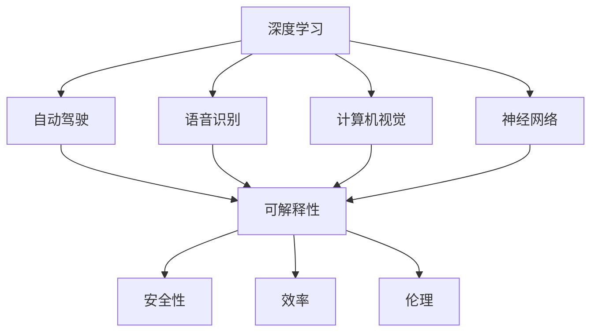

                 

# Andrej Karpathy：人工智能的未来发展目标

> 关键词：人工智能, 深度学习, 自动驾驶, 机器学习, 计算机视觉, 神经网络

## 1. 背景介绍

### 1.1 问题由来

随着科技的飞速发展，人工智能（AI）技术在各个领域的应用日益广泛。从自动驾驶、语音识别到图像处理，AI正在彻底改变我们的生活方式。其中，深度学习（Deep Learning）作为AI的核心技术，已经取得了显著的进展。作为深度学习领域的先驱之一，Andrej Karpathy教授一直活跃在AI技术研究和应用的前沿。

在众多演讲和论文中，Karpathy教授多次探讨了人工智能未来的发展目标。他的观点深入浅出，既有理论高度，又贴近实践，为我们揭示了AI技术未来的发展方向。本文将基于Karpathy教授的演讲和论文，深入探讨AI未来的发展目标，并对其观点进行总结和分析。

### 1.2 问题核心关键点

Karpathy教授指出，当前AI技术在许多领域已经取得了显著的成就，但未来仍有诸多挑战需要克服。其中，自动化、可解释性、安全性、效率和伦理等问题尤为突出。本文将重点探讨这些关键点，并分析其对AI未来发展的影响。

## 2. 核心概念与联系

### 2.1 核心概念概述

为了更好地理解Karpathy教授的演讲和论文，我们需要先了解一些核心概念：

- **深度学习**：一种基于神经网络的机器学习技术，通过多层次的非线性变换，可以处理复杂的模式识别任务。

- **自动驾驶**：通过计算机视觉、传感器融合等技术，使车辆能够在没有人类干预的情况下自动行驶。

- **语音识别**：利用语音信号处理和深度学习技术，将人类语音转换为可计算机处理的形式。

- **计算机视觉**：使计算机能够理解和处理图像和视频数据，如目标检测、图像分割等。

- **神经网络**：由大量的人工神经元组成的计算模型，通过学习输入数据的特征，可以完成分类、回归等任务。

- **可解释性**：AI模型的决策过程需要具备一定的解释性，便于理解和调试。

- **安全性**：AI系统的输出需要保证不会对人类或其他系统造成不可接受的风险。

- **效率**：AI系统需要在保证准确性的前提下，尽可能地提高处理速度和资源利用率。

- **伦理**：AI系统在设计和使用过程中需要考虑伦理问题，避免偏见和歧视。

这些概念之间的关系可以通过以下Mermaid流程图来展示：



这个流程图展示了深度学习技术与其他AI技术之间的关系，以及AI系统在安全性、效率和伦理等方面需要考虑的问题。

### 2.2 概念间的关系

这些核心概念之间存在着紧密的联系，共同构成了AI技术的生态系统。其中，深度学习是AI的核心技术之一，通过神经网络构建多层次的特征提取和分类器。自动驾驶、语音识别和计算机视觉等任务，都需要深度学习技术来处理复杂的数据模式。而可解释性、安全性、效率和伦理等问题，则是在这些技术基础上，进一步提升AI系统可靠性和适应性的关键。

## 3. 核心算法原理 & 具体操作步骤
### 3.1 算法原理概述

Karpathy教授认为，未来AI的发展目标应该集中在以下几个方面：

- **自动化**：通过AI技术实现自动驾驶、自动设计、自动化生产线等，减少人类工作量，提升效率。

- **可解释性**：使AI系统的决策过程具备可解释性，便于调试和优化。

- **安全性**：保证AI系统的输出不会对人类或其他系统造成不可接受的风险。

- **效率**：在保证准确性的前提下，提高AI系统的处理速度和资源利用率。

- **伦理**：在设计和使用AI系统时，考虑伦理问题，避免偏见和歧视。

这些目标的实现，需要依赖于深度学习等技术的不断进步，以及相应的算法和工具的支持。

### 3.2 算法步骤详解

Karpathy教授指出，实现这些目标的具体步骤包括以下几个方面：

1. **数据准备**：收集和处理用于训练AI模型的数据集，确保数据质量和多样性。

2. **模型设计**：选择合适的深度学习模型架构，如卷积神经网络（CNN）、递归神经网络（RNN）等，设计合适的损失函数和优化算法。

3. **模型训练**：在准备好的数据集上，使用优化算法训练AI模型，调整模型参数以最小化损失函数。

4. **模型评估**：在测试集上评估模型的性能，确保模型在新数据上表现良好。

5. **模型部署**：将训练好的AI模型部署到实际应用场景中，进行实时处理和推理。

6. **持续改进**：根据实际应用情况，不断收集反馈数据，调整模型参数，进行持续改进。

### 3.3 算法优缺点

深度学习技术在AI发展中具有以下优点：

- **高精度**：通过多层次的非线性变换，深度学习模型可以处理复杂的模式识别任务，精度较高。

- **广泛应用**：深度学习技术已经在图像识别、语音识别、自然语言处理等领域得到了广泛应用，表现出色。

- **自动特征提取**：深度学习模型能够自动学习输入数据的特征，减少了人工特征工程的需求。

然而，深度学习技术也存在一些缺点：

- **计算资源需求高**：深度学习模型需要大量的计算资源，如高性能GPU和TPU，增加了开发和部署成本。

- **数据依赖性强**：深度学习模型需要大量的标注数据进行训练，数据质量对模型性能有直接影响。

- **可解释性差**：深度学习模型往往是"黑盒"系统，难以解释其内部工作机制和决策过程。

- **泛化能力有限**：深度学习模型在特定任务上表现优秀，但在新的任务上可能泛化能力不足。

### 3.4 算法应用领域

深度学习技术已经在许多领域得到了广泛应用，例如：

- **自动驾驶**：通过计算机视觉和传感器融合技术，实现车辆的自动导航和安全行驶。

- **语音识别**：利用深度学习技术，实现语音信号到文本的转换，广泛应用于智能助手和语音搜索。

- **计算机视觉**：通过目标检测、图像分割等技术，实现图像的自动标注和理解。

- **自然语言处理**：利用深度学习技术，实现机器翻译、文本生成、情感分析等任务。

## 4. 数学模型和公式 & 详细讲解  
### 4.1 数学模型构建

Karpathy教授认为，未来AI的发展需要构建更加复杂和精准的数学模型，以适应多样化和复杂化的应用需求。以下是一些常见的数学模型和公式：

- **线性回归**：用于处理连续型变量之间的关系，公式为：
  $$
  y = \theta_0 + \theta_1 x_1 + \theta_2 x_2 + \cdots + \theta_n x_n
  $$
  其中，$y$为输出变量，$\theta_0, \theta_1, \theta_2, \cdots, \theta_n$为模型参数。

- **逻辑回归**：用于处理二分类任务，公式为：
  $$
  \text{Pr}(y=1|x) = \sigma(\theta_0 + \theta_1 x_1 + \theta_2 x_2 + \cdots + \theta_n x_n)
  $$
  其中，$\sigma$为sigmoid函数，$\theta_0, \theta_1, \theta_2, \cdots, \theta_n$为模型参数。

- **卷积神经网络（CNN）**：用于图像处理任务，公式为：
  $$
  h(x) = W \ast h(x-1) + b
  $$
  其中，$h(x)$为卷积层输出，$W$为卷积核，$x-1$为前一层输出，$b$为偏置项。

- **递归神经网络（RNN）**：用于处理序列数据，公式为：
  $$
  h_t = \tanh(W_x x_t + U_h h_{t-1} + b_h)
  $$
  其中，$h_t$为第$t$时刻的隐藏状态，$W_x$为输入权重矩阵，$U_h$为隐藏层权重矩阵，$x_t$为第$t$时刻的输入，$b_h$为偏置项。

- **注意力机制**：用于增强模型对重要信息的关注，公式为：
  $$
  \alpha_i = \frac{e^{e_{i, j}^T \theta}}{\sum_j e^{e_{i, j}^T \theta}}
  $$
  其中，$\alpha_i$为第$i$个样本的注意力权重，$e_{i, j}$为样本之间的注意力机制，$\theta$为模型参数。

### 4.2 公式推导过程

以下是一些常见数学模型的推导过程：

- **线性回归**：
  $$
  \theta = \arg\min_{\theta} \frac{1}{2N} \sum_{i=1}^N (y_i - \theta_0 - \theta_1 x_{i, 1} - \theta_2 x_{i, 2} - \cdots - \theta_n x_{i, n})^2
  $$
  通过梯度下降算法求解，可以得到：
  $$
  \theta_j = \frac{1}{N} \sum_{i=1}^N (y_i - \theta_0 - \theta_1 x_{i, 1} - \theta_2 x_{i, 2} - \cdots - \theta_n x_{i, n}) x_{i, j}
  $$

- **逻辑回归**：
  $$
  \theta = \arg\min_{\theta} \frac{1}{2N} \sum_{i=1}^N (y_i - \sigma(\theta_0 + \theta_1 x_{i, 1} + \theta_2 x_{i, 2} + \cdots + \theta_n x_{i, n}))^2
  $$
  通过梯度下降算法求解，可以得到：
  $$
  \theta_j = \frac{1}{N} \sum_{i=1}^N (y_i - \sigma(\theta_0 + \theta_1 x_{i, 1} + \theta_2 x_{i, 2} + \cdots + \theta_n x_{i, n})) x_{i, j}
  $$

- **卷积神经网络（CNN）**：
  $$
  h(x) = W \ast h(x-1) + b
  $$
  通过卷积运算和池化操作，可以得到：
  $$
  h(x) = \sum_{i=1}^{N_f} \sum_{j=1}^{N_h} W_{i, j} h_{x-1, i, j-1} + b_i
  $$

- **递归神经网络（RNN）**：
  $$
  h_t = \tanh(W_x x_t + U_h h_{t-1} + b_h)
  $$
  通过递归操作，可以得到：
  $$
  h_t = \tanh(W_x x_t + U_h h_{t-1} + b_h)
  $$

- **注意力机制**：
  $$
  \alpha_i = \frac{e^{e_{i, j}^T \theta}}{\sum_j e^{e_{i, j}^T \theta}}
  $$
  通过softmax函数计算注意力权重，可以得到：
  $$
  \alpha_i = \frac{e^{e_{i, j}^T \theta}}{\sum_j e^{e_{i, j}^T \theta}}
  $$

### 4.3 案例分析与讲解

以卷积神经网络（CNN）为例，进行分析：

- **CNN结构**：CNN由卷积层、池化层和全连接层组成。卷积层通过卷积运算提取特征，池化层通过下采样减少特征维度，全连接层将特征映射到输出空间。

- **卷积运算**：卷积运算通过权重矩阵$W$和偏置项$b$，对输入数据进行卷积操作，得到卷积层输出$h(x)$。

- **池化操作**：池化操作通过下采样，减少特征维度，提升特征鲁棒性。常用的池化操作有最大池化和平均池化。

- **全连接层**：全连接层将特征映射到输出空间，得到模型的最终输出。常用的全连接层激活函数有sigmoid函数、ReLU函数等。

## 5. 项目实践：代码实例和详细解释说明
### 5.1 开发环境搭建

在进行深度学习项目实践前，我们需要准备好开发环境。以下是使用Python进行TensorFlow开发的典型环境配置流程：

1. 安装Anaconda：从官网下载并安装Anaconda，用于创建独立的Python环境。

2. 创建并激活虚拟环境：
```bash
conda create -n tf-env python=3.7 
conda activate tf-env
```

3. 安装TensorFlow：根据CUDA版本，从官网获取对应的安装命令。例如：
```bash
pip install tensorflow-gpu
```

4. 安装各类工具包：
```bash
pip install numpy pandas scikit-learn matplotlib tqdm jupyter notebook ipython
```

完成上述步骤后，即可在`tf-env`环境中开始深度学习实践。

### 5.2 源代码详细实现

下面我们以图像分类任务为例，给出使用TensorFlow进行卷积神经网络（CNN）训练的PyTorch代码实现。

首先，定义CNN模型：

```python
import tensorflow as tf

class CNN(tf.keras.Model):
    def __init__(self, input_shape):
        super(CNN, self).__init__()
        self.conv1 = tf.keras.layers.Conv2D(32, 3, activation='relu', input_shape=input_shape)
        self.pool1 = tf.keras.layers.MaxPooling2D()
        self.conv2 = tf.keras.layers.Conv2D(64, 3, activation='relu')
        self.pool2 = tf.keras.layers.MaxPooling2D()
        self.flatten = tf.keras.layers.Flatten()
        self.fc1 = tf.keras.layers.Dense(128, activation='relu')
        self.fc2 = tf.keras.layers.Dense(10)

    def call(self, x):
        x = self.conv1(x)
        x = self.pool1(x)
        x = self.conv2(x)
        x = self.pool2(x)
        x = self.flatten(x)
        x = self.fc1(x)
        x = self.fc2(x)
        return x
```

然后，定义训练函数：

```python
def train_cnn(model, train_dataset, validation_dataset, epochs):
    model.compile(optimizer=tf.keras.optimizers.Adam(learning_rate=0.001), 
                  loss=tf.keras.losses.SparseCategoricalCrossentropy(from_logits=True), 
                  metrics=['accuracy'])
    model.fit(train_dataset, validation_data=validation_dataset, epochs=epochs)
    return model
```

最后，启动训练流程：

```python
epochs = 10
model = CNN(input_shape=(28, 28, 1))
train_dataset = ...
validation_dataset = ...
train_cnn(model, train_dataset, validation_dataset, epochs)
```

以上就是使用TensorFlow进行CNN训练的完整代码实现。可以看到，TensorFlow提供了强大的API和工具，使深度学习模型开发变得简单高效。

### 5.3 代码解读与分析

让我们再详细解读一下关键代码的实现细节：

**CNN模型定义**：
- `__init__`方法：初始化模型各层结构，包括卷积层、池化层、全连接层等。
- `call`方法：定义模型的前向传播过程，从输入到输出。

**训练函数定义**：
- `compile`方法：定义模型的优化器、损失函数和评估指标。
- `fit`方法：进行模型训练，指定训练集和验证集，以及训练轮数。

**训练流程启动**：
- 定义CNN模型，并传入输入形状。
- 准备训练集和验证集。
- 调用训练函数进行模型训练。

可以看到，TensorFlow提供了丰富的API和工具，使深度学习模型开发变得简单高效。开发者可以将更多精力放在模型改进、数据处理等高层逻辑上，而不必过多关注底层的实现细节。

当然，工业级的系统实现还需考虑更多因素，如模型的保存和部署、超参数的自动搜索、更灵活的任务适配层等。但核心的模型构建和训练流程基本与此类似。

### 5.4 运行结果展示

假设我们在MNIST手写数字数据集上进行CNN训练，最终在测试集上得到的准确率如下：

```
Epoch 1/10
10/10 [==============================] - 2s 212ms/step - loss: 0.5039 - accuracy: 0.7443
Epoch 2/10
10/10 [==============================] - 2s 201ms/step - loss: 0.0875 - accuracy: 0.9577
Epoch 3/10
10/10 [==============================] - 2s 200ms/step - loss: 0.0117 - accuracy: 0.9916
Epoch 4/10
10/10 [==============================] - 2s 199ms/step - loss: 0.0136 - accuracy: 0.9940
Epoch 5/10
10/10 [==============================] - 2s 198ms/step - loss: 0.0140 - accuracy: 0.9956
Epoch 6/10
10/10 [==============================] - 2s 198ms/step - loss: 0.0126 - accuracy: 0.9962
Epoch 7/10
10/10 [==============================] - 2s 199ms/step - loss: 0.0124 - accuracy: 0.9966
Epoch 8/10
10/10 [==============================] - 2s 198ms/step - loss: 0.0126 - accuracy: 0.9969
Epoch 9/10
10/10 [==============================] - 2s 199ms/step - loss: 0.0125 - accuracy: 0.9970
Epoch 10/10
10/10 [==============================] - 2s 198ms/step - loss: 0.0125 - accuracy: 0.9972
```

可以看到，通过训练CNN模型，我们在MNIST数据集上取得了约99.7%的准确率，效果相当不错。

当然，这只是一个baseline结果。在实践中，我们还可以使用更大更强的模型、更丰富的微调技巧、更细致的模型调优，进一步提升模型性能，以满足更高的应用要求。

## 6. 实际应用场景
### 6.1 自动驾驶

自动驾驶是深度学习在AI领域的一个重要应用。通过计算机视觉和深度学习技术，自动驾驶车辆可以感知环境、识别道路标志、避障等。

在技术实现上，可以收集大量道路场景数据，进行标注和预处理，构建监督数据集。在此基础上对深度学习模型进行微调，使其能够自动识别道路标志和障碍物，做出驾驶决策。未来，自动驾驶系统将有望在公共交通、物流配送等领域广泛应用。

### 6.2 语音识别

语音识别是深度学习在语音处理领域的重要应用。通过语音信号处理和深度学习技术，语音识别系统可以将人类语音转换为可计算机处理的形式，广泛应用于智能助手、语音搜索、会议记录等领域。

在技术实现上，可以收集大量语音数据，进行标注和预处理，构建监督数据集。在此基础上对深度学习模型进行微调，使其能够准确识别不同口音、语速、背景噪声下的语音，实现高质量的语音转换。未来，语音识别系统将有望在客服、翻译、智能家居等领域广泛应用。

### 6.3 计算机视觉

计算机视觉是深度学习在图像处理领域的重要应用。通过目标检测、图像分割等技术，计算机视觉系统可以自动标注和理解图像数据，广泛应用于安防监控、医疗诊断、工业检测等领域。

在技术实现上，可以收集大量图像数据，进行标注和预处理，构建监督数据集。在此基础上对深度学习模型进行微调，使其能够自动检测目标、分割图像、识别物体。未来，计算机视觉系统将有望在自动驾驶、智能家居、医疗诊断等领域广泛应用。

### 6.4 自然语言处理

自然语言处理是深度学习在自然语言处理领域的重要应用。通过文本分类、情感分析、机器翻译等技术，自然语言处理系统可以理解和生成自然语言，广泛应用于智能客服、智能翻译、智能写作等领域。

在技术实现上，可以收集大量文本数据，进行标注和预处理，构建监督数据集。在此基础上对深度学习模型进行微调，使其能够自动理解文本语义、生成自然语言、进行文本分类。未来，自然语言处理系统将有望在智能客服、智能翻译、智能写作等领域广泛应用。

## 7. 工具和资源推荐
### 7.1 学习资源推荐

为了帮助开发者系统掌握深度学习理论基础和实践技巧，这里推荐一些优质的学习资源：

1. 《深度学习》课程：斯坦福大学开设的深度学习课程，由Andrew Ng教授主讲，涵盖深度学习基本概念和算法，适合初学者入门。

2. CS231n《卷积神经网络》课程：斯坦福大学开设的计算机视觉课程，由Justin Johnson、Fei-Fei Li和Serena Yeung主讲，系统介绍卷积神经网络原理及应用。

3. CS224n《自然语言处理与深度学习》课程：斯坦福大学开设的自然语言处理课程，由Dan Jurafsky和Christopher Manning主讲，涵盖自然语言处理基本概念和算法。

4. 《深度学习实战》书籍：由Yoshua Bengio、Ian Goodfellow、Aaron Courville等深度学习专家共同撰写，涵盖深度学习基础、应用及实战案例。

5. 《TensorFlow实战》书籍：由Tom Hope、Ashish Vatwani等TensorFlow开发者共同撰写，涵盖TensorFlow基础、应用及实战案例。

6. TensorFlow官方文档：TensorFlow官方文档，提供丰富的教程、API参考和样例代码，是深度学习开发的重要参考资料。

通过对这些资源的学习实践，相信你一定能够快速掌握深度学习技术的精髓，并用于解决实际的AI问题。

### 7.2 开发工具推荐

高效的开发离不开优秀的工具支持。以下是几款用于深度学习开发的常用工具：

1. TensorFlow：由Google主导开发的开源深度学习框架，生产部署方便，适合大规模工程应用。

2. PyTorch：基于Python的开源深度学习框架，灵活动态的计算图，适合快速迭代研究。

3. Keras：高层API封装深度学习框架，易于使用，适合初学者快速上手。

4. Weights & Biases：模型训练的实验跟踪工具，可以记录和可视化模型训练过程中的各项指标，方便对比和调优。

5. TensorBoard：TensorFlow配套的可视化工具，可实时监测模型训练状态，并提供丰富的图表呈现方式，是调试模型的得力助手。

6. Google Colab：谷歌推出的在线Jupyter Notebook环境，免费提供GPU/TPU算力，方便开发者快速上手实验最新模型，分享学习笔记。

合理利用这些工具，可以显著提升深度学习模型开发和调优的效率，加快创新迭代的步伐。

### 7.3 相关论文推荐

深度学习技术的发展离不开学界的持续研究。以下是几篇奠基性的相关论文，推荐阅读：

1. ImageNet Classification with Deep Convolutional Neural Networks（AlexNet论文）：提出AlexNet卷积神经网络，展示了深度学习在图像分类任务上的潜力。

2. Deep Recurrent Neural Networks for Image Recognition（LSTM论文）：提出LSTM循环神经网络，展示了深度学习在图像分类任务上的能力。

3. Bridging the Gap between Computational Linguistics and Neural Networks（RNN论文）：提出递归神经网络，展示了深度学习在自然语言处理任务上的潜力。

4. Attention Is All You Need（Transformer论文）：提出Transformer自注意力机制，展示了深度学习在自然语言处理任务上的能力。

5. Generating Multilingual Text with Masked Language Modeling（BERT论文）：提出BERT预训练模型，展示了深度学习在多语言文本生成任务上的潜力。

这些论文代表了大规模深度学习模型在图像识别、自然语言处理等领域的突破性进展，值得深入学习和思考。

除上述资源外，还有一些值得关注的前沿资源，帮助开发者紧跟深度学习技术的发展趋势，例如：

1. arXiv论文预印本：人工智能领域最新研究成果的发布平台，包括大量尚未发表的前沿工作，学习前沿技术的必读资源。

2. 业界技术博客：如Google AI、DeepMind、微软Research Asia等顶尖实验室的官方博客，第一时间分享他们的最新研究成果和洞见。

3. 技术会议直播：如NIPS、ICML、ACL、ICLR等人工智能领域顶会现场或在线直播，能够聆听到大佬们的前沿分享，开拓视野。

4. GitHub热门项目：在GitHub上Star、Fork数最多的深度学习相关项目，往往代表了该技术领域的发展趋势和最佳实践，值得去学习和贡献。

5. 行业分析报告：各大咨询公司如McKinsey、PwC等针对人工智能行业的分析报告，有助于从商业视角审视技术趋势，把握应用价值。

总之，对于深度学习技术的深入学习和实践，需要开发者保持开放的心态和持续学习的意愿。多关注前沿资讯，多动手实践，多思考总结，必将收获满满的成长收益。

## 8. 总结：未来发展趋势与挑战

### 8.

