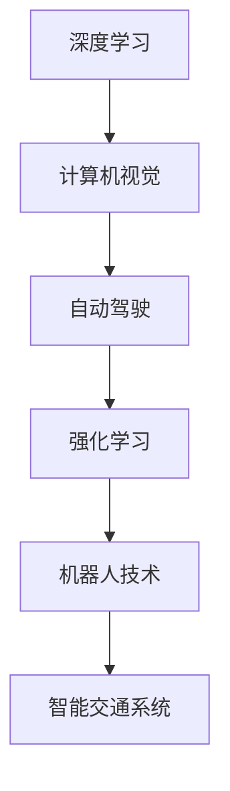
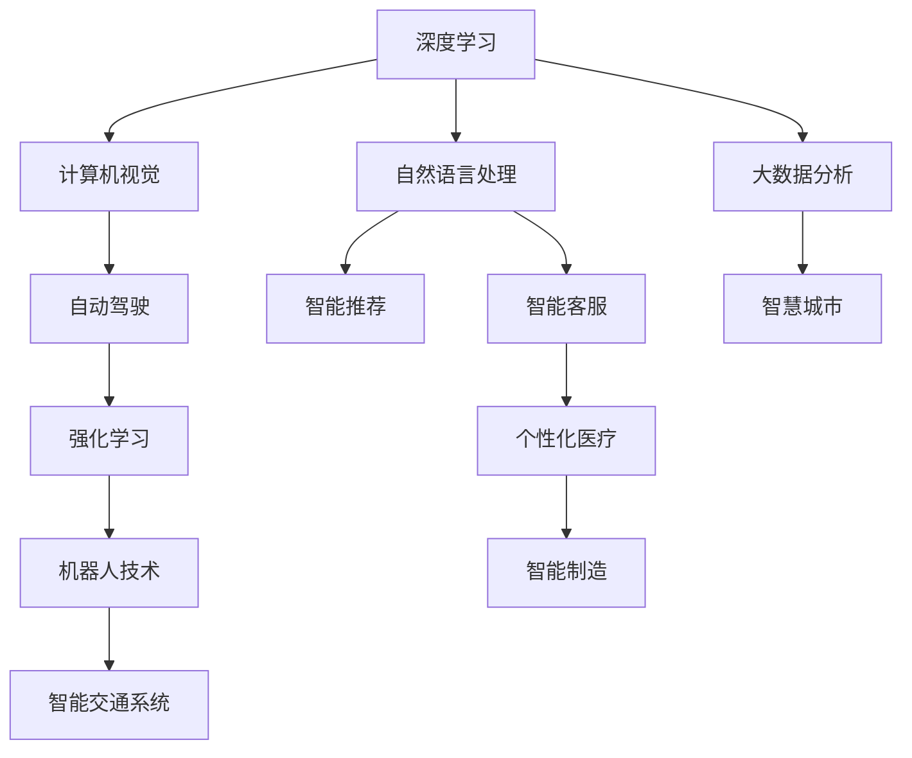

                 

# Andrej Karpathy：人工智能的未来发展目标

> 关键词：人工智能, 深度学习, 计算机视觉, 自动驾驶, 强化学习

## 1. 背景介绍

Andrej Karpathy，作为OpenAI的研究科学家和斯坦福大学教授，深度学习领域的权威，曾多次在顶级会议和公开场合分享自己对人工智能未来发展的见解和思考。本文将梳理Andrej Karpathy对于人工智能未来的发展目标和方向，帮助读者更好地理解该领域的最新动态和技术趋势。

## 2. 核心概念与联系

### 2.1 核心概念概述

Andrej Karpathy的核心观点和研究领域涵盖了以下几个关键概念：

- **深度学习**：通过多层神经网络模拟人类大脑的处理方式，实现对复杂数据模式的识别和预测。
- **计算机视觉**：利用深度学习技术，使计算机能够“看”懂并理解图像和视频中的视觉信息。
- **自动驾驶**：结合计算机视觉和强化学习，让车辆在无需人工干预的情况下自主驾驶。
- **强化学习**：通过不断试错，让智能体学习最优的行动策略，优化决策过程。
- **机器人技术**：将计算机视觉、自然语言处理和控制理论相结合，使机器人具备高度的自主性和适应性。
- **智能交通系统**：利用AI技术优化交通流量管理，提高交通效率和安全性。

这些概念之间通过深度学习技术相互连接，共同推动了人工智能技术的快速发展。以下通过Mermaid流程图展示这些概念之间的联系：



### 2.2 概念间的关系

Andrej Karpathy认为，深度学习是人工智能的核心技术，而计算机视觉、自动驾驶、强化学习和机器人技术则是在深度学习基础上发展起来的几个重要领域。这些技术不仅各自独立发展，更相互之间深度融合，共同构建了智能社会的基石。以下通过更多细节图表展示这些概念之间的关系：



## 3. 核心算法原理 & 具体操作步骤

### 3.1 算法原理概述

Andrej Karpathy指出，深度学习的核心在于多层神经网络的设计和训练。通过反向传播算法，深度网络可以自动学习输入和输出之间的映射关系，从而实现复杂的模式识别和预测。

以下简要介绍深度学习的基本原理：

1. **神经网络结构**：由多个层次的神经元组成，每层都通过权重矩阵和偏置项进行信息传递和变换。
2. **反向传播算法**：通过链式法则计算每个参数的梯度，反向更新权重和偏置项，实现模型参数的优化。
3. **损失函数**：衡量模型输出与真实标签之间的差异，通常使用均方误差或交叉熵等。

### 3.2 算法步骤详解

Andrej Karpathy详细介绍了深度学习的训练流程，包括数据准备、模型初始化、正向传播、反向传播和参数更新等步骤。以下是具体的步骤描述：

1. **数据准备**：将原始数据预处理成模型所需的格式，如图像数据需要标准化、归一化等。
2. **模型初始化**：随机初始化网络参数，通常使用均值为0、方差为$\sigma^2$的正态分布。
3. **正向传播**：将输入数据传递到网络中，计算每个神经元的输出。
4. **损失计算**：计算模型输出与真实标签之间的损失值。
5. **反向传播**：通过链式法则计算每个参数的梯度，反向传播到输入层。
6. **参数更新**：使用优化算法（如SGD、Adam等）更新模型参数，减小损失值。
7. **迭代训练**：重复执行上述步骤，直到损失值收敛。

### 3.3 算法优缺点

Andrej Karpathy详细分析了深度学习的优缺点：

**优点**：
- **强大的表示能力**：多层网络可以学习到复杂的数据模式和特征。
- **端到端学习**：可以直接从原始数据中学习到任务的解决方案，无需手动特征工程。
- **高精度预测**：在许多任务上，深度学习模型已经超越了传统机器学习算法。

**缺点**：
- **数据依赖**：深度学习模型需要大量标注数据进行训练，否则容易过拟合。
- **计算成本高**：训练大规模深度模型需要高性能计算资源，成本较高。
- **黑盒模型**：模型的决策过程难以解释，缺乏可解释性。

### 3.4 算法应用领域

Andrej Karpathy指出了深度学习在多个领域的广泛应用：

- **计算机视觉**：图像分类、目标检测、图像生成等任务。
- **自然语言处理**：语言模型、机器翻译、文本生成等任务。
- **自动驾驶**：传感器融合、路径规划、行为决策等任务。
- **机器人技术**：感知、控制、规划等任务。
- **智能推荐**：个性化广告、商品推荐、内容推荐等任务。
- **医疗健康**：影像分析、基因组学、疾病预测等任务。

## 4. 数学模型和公式 & 详细讲解 & 举例说明

### 4.1 数学模型构建

Andrej Karpathy以一个简单的二分类问题为例，详细阐述了数学模型的构建过程。

假设我们有一个输入样本$x$和一个标签$y$，模型输出为$h_\theta(x)$，其中$\theta$为模型参数。目标是最小化损失函数$L(\theta)$，即：

$$
L(\theta) = \frac{1}{N} \sum_{i=1}^N [\ell(h_\theta(x_i), y_i)]
$$

其中$\ell(h_\theta(x), y)$为损失函数，$\ell(h_\theta(x), y)$通常选择均方误差或交叉熵等。

### 4.2 公式推导过程

以下详细介绍交叉熵损失函数的推导过程：

设模型输出$h_\theta(x)$为：

$$
h_\theta(x) = \sigma(\theta^T x)
$$

其中$\sigma(\cdot)$为Sigmoid函数，$\theta^T x$为线性变换。则交叉熵损失函数$\ell(h_\theta(x), y)$可表示为：

$$
\ell(h_\theta(x), y) = -[y\log h_\theta(x) + (1-y)\log(1-h_\theta(x))]
$$

将其代入经验风险公式，得：

$$
L(\theta) = -\frac{1}{N}\sum_{i=1}^N [y_i\log h_\theta(x_i)+(1-y_i)\log(1-h_\theta(x_i))]
$$

### 4.3 案例分析与讲解

以图像分类任务为例，Andrej Karpathy介绍了使用深度卷积神经网络进行分类的方法。

假设输入图像$x$经过卷积层、池化层等处理后，得到特征图$z$。目标是最小化损失函数$L(\theta)$，即：

$$
L(\theta) = \frac{1}{N} \sum_{i=1}^N \ell(h_\theta(z_i), y_i)
$$

其中$h_\theta(z_i)$为模型对输入图像$z_i$的分类预测，$\ell(h_\theta(z_i), y_i)$为交叉熵损失函数。

## 5. 项目实践：代码实例和详细解释说明

### 5.1 开发环境搭建

为了实践深度学习算法，我们需要配置相应的开发环境。以下是基本的配置步骤：

1. **安装Python**：选择Python 3.6及以上版本，从官网下载并安装。
2. **安装深度学习库**：
   - 安装TensorFlow：
     ```bash
     pip install tensorflow
     ```
   - 安装Keras：
     ```bash
     pip install keras
     ```
   - 安装其他工具库：如NumPy、Pandas、Matplotlib等。
3. **安装GPU驱动**：确保GPU驱动已正确安装，使用NVIDIA CUDA工具包进行配置。

### 5.2 源代码详细实现

以下是一个简单的图像分类任务的代码实现，以CIFAR-10数据集为例：

```python
from tensorflow.keras.datasets import cifar10
from tensorflow.keras.models import Sequential
from tensorflow.keras.layers import Dense, Dropout, Flatten, Conv2D, MaxPooling2D
from tensorflow.keras.optimizers import Adam

# 加载CIFAR-10数据集
(x_train, y_train), (x_test, y_test) = cifar10.load_data()

# 数据预处理
x_train = x_train / 255.0
x_test = x_test / 255.0

# 构建模型
model = Sequential()
model.add(Conv2D(32, kernel_size=(3, 3), activation='relu', input_shape=(32, 32, 3)))
model.add(Conv2D(64, (3, 3), activation='relu'))
model.add(MaxPooling2D(pool_size=(2, 2)))
model.add(Dropout(0.25))
model.add(Flatten())
model.add(Dense(512, activation='relu'))
model.add(Dropout(0.5))
model.add(Dense(10, activation='softmax'))

# 编译模型
model.compile(loss='categorical_crossentropy',
              optimizer=Adam(lr=0.001),
              metrics=['accuracy'])

# 训练模型
model.fit(x_train, y_train, epochs=10, batch_size=128, validation_data=(x_test, y_test))
```

### 5.3 代码解读与分析

该代码实现了基于卷积神经网络的图像分类模型，详细解释如下：

1. **数据加载与预处理**：使用TensorFlow内置的CIFAR-10数据集，将图像像素归一化到[0,1]区间。
2. **模型构建**：使用Sequential模型，定义多个卷积层、池化层和全连接层。
3. **模型编译**：设置损失函数为交叉熵，优化器为Adam，学习率为0.001。
4. **模型训练**：使用fit方法进行模型训练，指定训练轮数和批次大小。

### 5.4 运行结果展示

在训练10轮后，可以通过evaluate方法评估模型的性能：

```python
test_loss, test_acc = model.evaluate(x_test, y_test)
print('Test accuracy:', test_acc)
```

## 6. 实际应用场景

### 6.1 计算机视觉

Andrej Karpathy指出，计算机视觉在自动驾驶、医学影像分析、安防监控等领域有着广泛应用。以下通过几个具体场景说明：

1. **自动驾驶**：使用深度学习模型进行目标检测、行为识别和路径规划，实现车辆的自主驾驶。
2. **医学影像分析**：利用卷积神经网络对医疗影像进行分类、分割和重建，帮助医生进行疾病诊断和治疗方案制定。
3. **安防监控**：使用深度学习模型进行人脸识别、行为分析和异常检测，提高安全监控系统的智能化水平。

### 6.2 自然语言处理

Andrej Karpathy认为，自然语言处理在机器翻译、语音识别、文本生成等方面已经取得了显著进展。以下通过几个具体场景说明：

1. **机器翻译**：使用序列到序列模型进行文本翻译，提高翻译的准确率和流畅度。
2. **语音识别**：利用深度学习模型对语音信号进行特征提取和分类，实现语音识别和语音助手功能。
3. **文本生成**：使用生成对抗网络（GAN）等模型进行文本生成和情感分析，帮助理解人类语言背后的情感和意图。

### 6.3 智能推荐

Andrej Karpathy指出，智能推荐在电商、广告、内容推荐等领域有着广泛应用。以下通过几个具体场景说明：

1. **电商推荐**：使用深度学习模型对用户行为进行建模，推荐个性化商品和优惠活动。
2. **广告推荐**：利用深度学习模型对用户兴趣进行预测，推送精准广告，提高广告点击率和转化率。
3. **内容推荐**：使用深度学习模型对用户阅读和观看行为进行建模，推荐个性化的视频和文章内容。

## 7. 工具和资源推荐

### 7.1 学习资源推荐

以下是一些Andrej Karpathy推荐的学习资源：

1. **《Deep Learning》课程**：斯坦福大学Andrew Ng教授开设的深度学习课程，系统介绍了深度学习的基础知识和应用场景。
2. **《Neural Networks and Deep Learning》书籍**：Michael Nielsen所著，深入浅出地介绍了深度学习的基本原理和实践技巧。
3. **Coursera深度学习课程**：提供了一系列深度学习相关的课程，包括计算机视觉、自然语言处理、强化学习等。
4. **arXiv预印本**：获取最新深度学习研究成果的权威平台，涵盖计算机视觉、自然语言处理、自动驾驶等多个领域。

### 7.2 开发工具推荐

以下是一些Andrej Karpathy推荐的开发工具：

1. **TensorFlow**：Google开源的深度学习框架，支持分布式计算和GPU加速。
2. **Keras**：基于TensorFlow的高层API，支持快速构建深度学习模型。
3. **PyTorch**：Facebook开源的深度学习框架，支持动态图和GPU加速。
4. **MXNet**：Apache开源的深度学习框架，支持多种编程语言和分布式计算。

### 7.3 相关论文推荐

以下是Andrej Karpathy推荐的相关论文：

1. **ImageNet Classification with Deep Convolutional Neural Networks**：Alex Krizhevsky等，ImageNet图像分类任务，展示了深度卷积神经网络的高效性。
2. **Long Short-Term Memory**：Sepp Hochreiter等，提出长短期记忆网络，在时间序列数据上取得了卓越性能。
3. **Attention is All You Need**：Ashish Vaswani等，提出Transformer模型，大幅提升了机器翻译和语言模型效果。
4. **Playing Atari with Deep Reinforcement Learning**：Volodymyr Mnih等，利用深度强化学习技术成功实现了Atari游戏的自动通关。

## 8. 总结：未来发展趋势与挑战

### 8.1 研究成果总结

Andrej Karpathy认为，深度学习已经在多个领域取得了突破性进展，但仍然存在一些关键问题需要解决：

1. **模型可解释性**：深度学习模型通常被认为是“黑盒”，缺乏可解释性，难以理解其内部决策过程。
2. **数据依赖**：深度学习模型需要大量标注数据进行训练，数据获取和标注成本较高。
3. **计算资源**：大规模深度学习模型需要高性能计算资源，计算成本较高。
4. **泛化能力**：深度学习模型在特定领域和特定数据上的泛化能力有待提升。

### 8.2 未来发展趋势

Andrej Karpathy预测，未来深度学习将向以下几个方向发展：

1. **模型可解释性**：开发更多的可解释性技术，如LIME、SHAP等，帮助理解深度学习模型的决策过程。
2. **无监督学习**：发展更多无监督学习方法，减少对标注数据的依赖。
3. **跨模态学习**：将不同模态的数据（如文本、图像、语音等）进行融合，提升模型的综合能力。
4. **自适应学习**：开发更多自适应学习算法，使模型能够根据数据分布变化进行调整。
5. **迁移学习**：利用迁移学习方法，将已有模型应用于新领域和新任务，提高模型适应性。

### 8.3 面临的挑战

Andrej Karpathy指出，深度学习在未来面临以下挑战：

1. **数据获取**：获取高质量、大规模的数据仍然是一个重要挑战。
2. **模型泛化**：如何使模型在不同领域和不同数据集上具有更强的泛化能力，是一个需要解决的问题。
3. **资源消耗**：大规模深度学习模型的计算和存储资源消耗巨大，如何在保证性能的前提下进行优化，是一个重要的研究方向。
4. **伦理问题**：深度学习模型在应用过程中可能存在伦理问题，如数据隐私、算法偏见等，需要开发相应的技术来解决。

### 8.4 研究展望

Andrej Karpathy对深度学习的研究展望如下：

1. **自动化机器学习**：发展自动化机器学习技术，使深度学习模型自动进行超参数优化、模型选择和数据预处理。
2. **模型压缩**：研究模型压缩和量化技术，减小深度学习模型的资源消耗，提升计算效率。
3. **多模态融合**：研究多模态数据融合技术，使深度学习模型能够处理复杂的多模态数据，提升模型的综合能力。
4. **人机协同**：开发人机协同技术，使深度学习模型能够与人类进行有效的互动，提升系统的智能化水平。

总之，Andrej Karpathy认为，深度学习在人工智能领域的应用前景广阔，未来将进一步提升模型的智能水平和适应性，带来更多创新和突破。

## 9. 附录：常见问题与解答

### 问题1：深度学习与传统机器学习有什么区别？

**回答**：深度学习通过多层神经网络学习数据中的复杂模式，具有很强的特征提取能力，适合处理高维、非线性数据。而传统机器学习主要依赖手工设计的特征工程，适用于低维、线性数据。

### 问题2：如何理解深度学习中的反向传播算法？

**回答**：反向传播算法通过链式法则，将输出层的误差逐步反向传播到输入层，计算每个参数的梯度。梯度用于更新模型参数，优化模型的输出。

### 问题3：深度学习模型有哪些应用场景？

**回答**：深度学习模型广泛应用于计算机视觉、自然语言处理、自动驾驶、机器人技术、智能推荐等多个领域，如图像分类、目标检测、语音识别、机器翻译等任务。

---

作者：禅与计算机程序设计艺术 / Zen and the Art of Computer Programming

