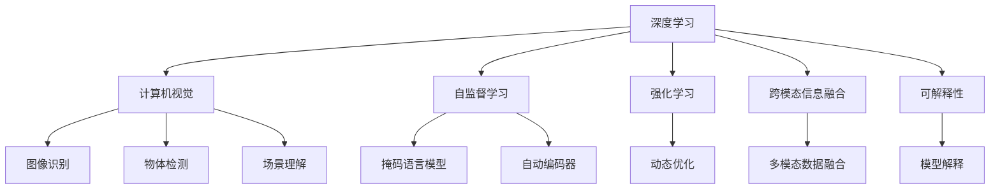
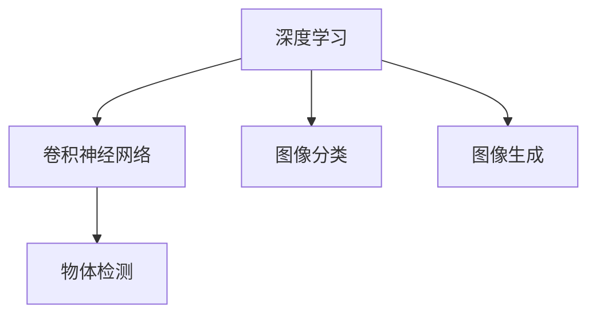
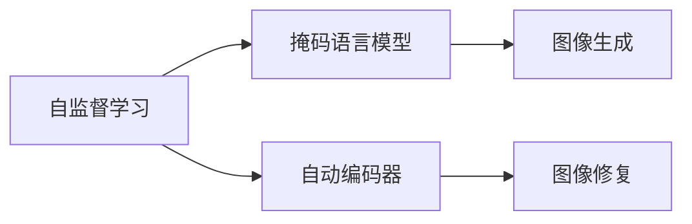
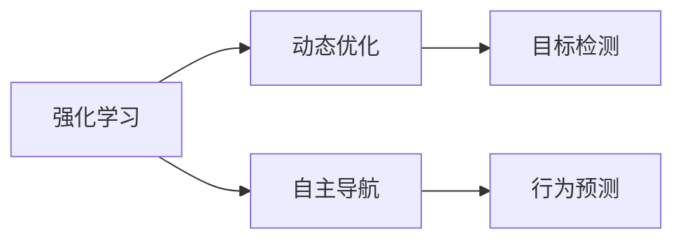
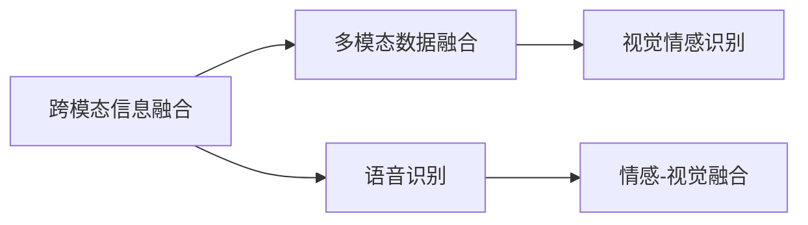
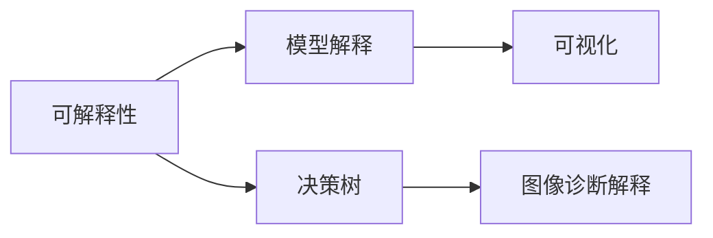
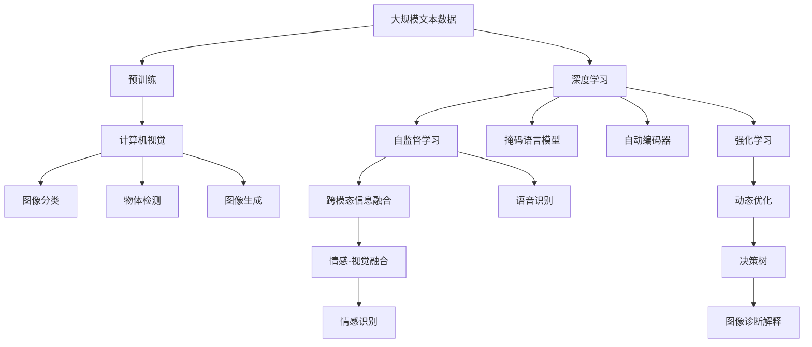

                 

# 人工智能的未来发展策略：深度学习与计算机视觉的融合

> 关键词：深度学习,计算机视觉,人工智能,未来发展策略

## 1. 背景介绍

### 1.1 问题由来

近年来，人工智能(AI)在各领域的应用日趋广泛，特别是在深度学习(Deep Learning)和计算机视觉领域。深度学习模型，尤其是卷积神经网络(Convolutional Neural Networks, CNNs)，已经成为图像、视频和语音处理的核心技术。然而，尽管取得了显著的进展，当前的AI系统在解决复杂问题时仍面临诸多挑战。如何在现有技术的基础上进一步提升AI的性能和智能化水平，成为研究人员和工程师们亟待解决的问题。

### 1.2 问题核心关键点

当前AI研究的核心关键点包括：

1. **模型效率与复杂度**：如何设计高效、可解释的模型，同时避免过度拟合？
2. **跨模态信息融合**：如何将视觉、语言等多种模态信息整合到统一的框架下？
3. **自监督学习**：如何利用无标签数据进行有效训练，提升模型泛化能力？
4. **强化学习**：如何通过与环境的交互，动态优化模型参数？
5. **实时性要求**：如何在保证模型性能的同时，优化推理速度和资源占用？

本文将围绕这些关键点，探讨人工智能的未来发展策略，特别是在深度学习与计算机视觉的融合方面。

## 2. 核心概念与联系

### 2.1 核心概念概述

为更好地理解人工智能的未来发展策略，本节将介绍几个密切相关的核心概念：

- **深度学习**：一种基于神经网络的机器学习技术，通过多层次的特征提取和抽象，实现复杂的模式识别和决策。
- **计算机视觉**：利用计算机处理、理解和分析图像和视频的技术，包括图像识别、物体检测、场景理解等任务。
- **自监督学习**：一种无需标注数据，通过自我监督的方式进行模型训练的技术，如掩码语言模型(MLM)、自动编码器(AE)等。
- **强化学习**：通过与环境的交互，动态优化模型参数，以最大化预定义的奖励函数。
- **跨模态信息融合**：将来自不同模态的信息整合到一个统一的框架下，提升模型对复杂场景的理解能力。
- **可解释性**：确保模型决策过程的透明和可解释，便于调试和改进。

这些概念之间的逻辑关系可以通过以下Mermaid流程图来展示：



这个流程图展示了大语言模型微调过程中各个核心概念的关系和作用：

1. 深度学习是计算机视觉的基础。
2. 自监督学习是深度学习的补充，可以提升模型泛化能力。
3. 强化学习是深度学习与环境的交互方式，可以动态优化模型。
4. 跨模态信息融合可以将视觉、语言等多种信息整合，提升模型理解复杂场景的能力。
5. 可解释性确保模型决策过程透明，便于优化和调试。

### 2.2 概念间的关系

这些核心概念之间存在着紧密的联系，形成了深度学习与计算机视觉的融合框架。下面我们通过几个Mermaid流程图来展示这些概念之间的关系。

#### 2.2.1 深度学习与计算机视觉的融合



这个流程图展示了深度学习在计算机视觉中的应用。深度学习通过卷积神经网络(CNNs)等架构，实现图像分类、物体检测、图像生成等计算机视觉任务。

#### 2.2.2 自监督学习与计算机视觉的结合



这个流程图展示了自监督学习在计算机视觉中的应用。通过掩码语言模型和自动编码器等自监督学习方法，可以从无标签数据中学习图像的语义信息，提升图像生成和修复的效果。

#### 2.2.3 强化学习与计算机视觉的协同



这个流程图展示了强化学习在计算机视觉中的应用。通过与环境的交互，强化学习可以动态优化计算机视觉模型，实现自主导航、目标检测等任务。

#### 2.2.4 跨模态信息融合与计算机视觉的整合



这个流程图展示了跨模态信息融合在计算机视觉中的应用。跨模态融合可以将视觉、语音等多种信息整合，实现更高级的情感识别等任务。

#### 2.2.5 可解释性与计算机视觉的保障



这个流程图展示了可解释性在计算机视觉中的应用。通过模型解释和可视化等方法，可以确保计算机视觉模型的决策过程透明，便于调试和改进。

### 2.3 核心概念的整体架构

最后，我们用一个综合的流程图来展示这些核心概念在大语言模型微调过程中的整体架构：



这个综合流程图展示了从预训练到深度学习，再到计算机视觉的完整过程。深度学习和大语言模型在预训练阶段学习通用知识，计算机视觉在模型中实现图像分类、物体检测、生成等任务，自监督学习和强化学习提升模型泛化能力和动态优化能力，跨模态信息融合整合视觉、语音等多种信息，可解释性保障模型决策过程透明。通过这些核心概念的有机结合，构建了深度学习与计算机视觉的融合框架。

## 3. 核心算法原理 & 具体操作步骤
### 3.1 算法原理概述

基于深度学习与计算机视觉的融合策略，主要包括以下几个关键步骤：

1. **大规模数据预训练**：通过在大规模无标签数据上预训练深度学习模型，学习通用特征表示。
2. **自监督学习**：利用自监督学习方法，从无标签数据中学习特征表示，提升模型泛化能力。
3. **多模态数据融合**：将视觉、语音、文本等多种模态信息整合，提升模型对复杂场景的理解能力。
4. **强化学习**：通过与环境的交互，动态优化模型参数，提升模型适应能力。
5. **可解释性**：通过模型解释和可视化，确保模型决策过程透明，便于调试和改进。

### 3.2 算法步骤详解

#### 3.2.1 数据预处理与预训练

1. **数据获取与预处理**：
   - 收集大规模无标签图像数据，进行预处理，包括裁剪、缩放、归一化等。
   - 使用数据增强技术，扩充数据集，提升模型泛化能力。

2. **模型初始化与预训练**：
   - 选择卷积神经网络(CNNs)等深度学习架构，进行模型初始化。
   - 在预训练阶段，利用大规模图像数据进行无监督训练，学习通用特征表示。

#### 3.2.2 自监督学习与特征增强

1. **自监督学习方法选择**：
   - 根据任务需求，选择合适的自监督学习方法，如掩码语言模型(MLM)、自动编码器(AE)等。
   - 在无标签数据上，利用自监督学习方法训练模型，学习特征表示。

2. **特征增强**：
   - 通过数据增强技术，扩充训练集，提升模型泛化能力。
   - 使用正则化技术，如L2正则、Dropout等，避免过拟合。

#### 3.2.3 多模态数据融合与任务适配

1. **多模态数据获取**：
   - 收集图像、语音、文本等多种模态数据，进行预处理。
   - 利用跨模态融合技术，将不同模态的数据整合到一个统一的框架下。

2. **任务适配**：
   - 根据任务需求，设计合适的任务适配层，进行有监督训练。
   - 使用参数高效微调技术，如适配器微调(Adaptation)、LoRA等，只更新少量参数，避免过拟合。

#### 3.2.4 强化学习与动态优化

1. **强化学习环境设计**：
   - 设计合适的强化学习环境，定义奖励函数。
   - 通过与环境的交互，动态优化模型参数，提升模型适应能力。

2. **模型评估与优化**：
   - 在实际应用场景中，定期评估模型性能，根据评估结果调整模型参数。
   - 使用可解释性技术，监控模型行为，确保模型决策过程透明。

### 3.3 算法优缺点

基于深度学习与计算机视觉的融合策略，具有以下优点：

1. **泛化能力强**：通过自监督学习和多模态融合，模型能够在复杂的场景下表现出较好的泛化能力。
2. **适应性强**：通过强化学习，模型能够动态适应新环境和任务，提升模型灵活性。
3. **可解释性强**：通过模型解释和可视化，模型决策过程透明，便于调试和改进。

同时，该策略也存在以下缺点：

1. **计算资源需求高**：大规模数据预训练和模型微调需要大量的计算资源。
2. **模型复杂度高**：多模态融合和跨模态学习增加了模型的复杂度。
3. **训练时间长**：大规模数据预训练和模型微调需要较长的训练时间。

### 3.4 算法应用领域

基于深度学习与计算机视觉的融合策略，已经在诸多领域得到了应用，包括但不限于：

1. **自动驾驶**：通过计算机视觉技术，实现车辆环境感知、路径规划等。
2. **医疗影像分析**：利用深度学习模型，对医学影像进行分类、分割等。
3. **安防监控**：通过计算机视觉技术，实现人脸识别、行为分析等。
4. **智能家居**：利用计算机视觉技术，实现语音控制、场景理解等。
5. **智能客服**：通过自然语言处理和计算机视觉技术，实现语音识别、情感分析等。
6. **教育应用**：利用计算机视觉技术，实现作业批改、学情分析等。

除了上述这些经典应用外，该策略还将在更多领域得到应用，如智慧城市、环境保护、智能制造等，为各个行业带来新的变革。

## 4. 数学模型和公式 & 详细讲解 & 举例说明

### 4.1 数学模型构建

本节将使用数学语言对基于深度学习与计算机视觉的融合策略进行更加严格的刻画。

记预训练深度学习模型为 $M_{\theta}:\mathcal{X} \rightarrow \mathcal{Y}$，其中 $\mathcal{X}$ 为输入空间，$\mathcal{Y}$ 为输出空间，$\theta$ 为模型参数。假设预训练数据的分布为 $P_X$，训练集为 $D=\{(x_i,y_i)\}_{i=1}^N$，其中 $x_i \in \mathcal{X}, y_i \in \mathcal{Y}$。

定义模型 $M_{\theta}$ 在输入 $x$ 上的损失函数为 $\ell(M_{\theta}(x),y)$，则在数据集 $D$ 上的经验风险为：

$$
\mathcal{L}(\theta) = \frac{1}{N} \sum_{i=1}^N \ell(M_{\theta}(x_i),y_i)
$$

微调的优化目标是最小化经验风险，即找到最优参数：

$$
\theta^* = \mathop{\arg\min}_{\theta} \mathcal{L}(\theta)
$$

在实践中，我们通常使用基于梯度的优化算法（如AdamW、SGD等）来近似求解上述最优化问题。设 $\eta$ 为学习率，$\lambda$ 为正则化系数，则参数的更新公式为：

$$
\theta \leftarrow \theta - \eta \nabla_{\theta}\mathcal{L}(\theta) - \eta\lambda\theta
$$

其中 $\nabla_{\theta}\mathcal{L}(\theta)$ 为损失函数对参数 $\theta$ 的梯度，可通过反向传播算法高效计算。

### 4.2 公式推导过程

以下我们以图像分类任务为例，推导交叉熵损失函数及其梯度的计算公式。

假设模型 $M_{\theta}$ 在输入 $x$ 上的输出为 $\hat{y}=M_{\theta}(x) \in [0,1]$，表示样本属于正类的概率。真实标签 $y \in \{0,1\}$。则二分类交叉熵损失函数定义为：

$$
\ell(M_{\theta}(x),y) = -[y\log \hat{y} + (1-y)\log (1-\hat{y})]
$$

将其代入经验风险公式，得：

$$
\mathcal{L}(\theta) = -\frac{1}{N}\sum_{i=1}^N [y_i\log M_{\theta}(x_i)+(1-y_i)\log(1-M_{\theta}(x_i))]
$$

根据链式法则，损失函数对参数 $\theta_k$ 的梯度为：

$$
\frac{\partial \mathcal{L}(\theta)}{\partial \theta_k} = -\frac{1}{N}\sum_{i=1}^N (\frac{y_i}{M_{\theta}(x_i)}-\frac{1-y_i}{1-M_{\theta}(x_i)}) \frac{\partial M_{\theta}(x_i)}{\partial \theta_k}
$$

其中 $\frac{\partial M_{\theta}(x_i)}{\partial \theta_k}$ 可进一步递归展开，利用自动微分技术完成计算。

在得到损失函数的梯度后，即可带入参数更新公式，完成模型的迭代优化。重复上述过程直至收敛，最终得到适应下游任务的最优模型参数 $\theta^*$。

### 4.3 案例分析与讲解

以图像分类任务为例，分析深度学习与计算机视觉融合的具体实现。

1. **数据预处理与预训练**：
   - 收集大规模无标签图像数据，进行预处理，包括裁剪、缩放、归一化等。
   - 使用数据增强技术，扩充数据集，提升模型泛化能力。

2. **自监督学习与特征增强**：
   - 选择合适的自监督学习方法，如掩码语言模型(MLM)、自动编码器(AE)等。
   - 在无标签数据上，利用自监督学习方法训练模型，学习特征表示。
   - 通过正则化技术，如L2正则、Dropout等，避免过拟合。

3. **多模态数据融合与任务适配**：
   - 收集图像、语音、文本等多种模态数据，进行预处理。
   - 利用跨模态融合技术，将不同模态的数据整合到一个统一的框架下。
   - 根据任务需求，设计合适的任务适配层，进行有监督训练。
   - 使用参数高效微调技术，如适配器微调(Adaptation)、LoRA等，只更新少量参数，避免过拟合。

4. **强化学习与动态优化**：
   - 设计合适的强化学习环境，定义奖励函数。
   - 通过与环境的交互，动态优化模型参数，提升模型适应能力。
   - 在实际应用场景中，定期评估模型性能，根据评估结果调整模型参数。
   - 使用可解释性技术，监控模型行为，确保模型决策过程透明。

## 5. 项目实践：代码实例和详细解释说明

### 5.1 开发环境搭建

在进行微调实践前，我们需要准备好开发环境。以下是使用Python进行PyTorch开发的环境配置流程：

1. 安装Anaconda：从官网下载并安装Anaconda，用于创建独立的Python环境。

2. 创建并激活虚拟环境：
```bash
conda create -n pytorch-env python=3.8 
conda activate pytorch-env
```

3. 安装PyTorch：根据CUDA版本，从官网获取对应的安装命令。例如：
```bash
conda install pytorch torchvision torchaudio cudatoolkit=11.1 -c pytorch -c conda-forge
```

4. 安装Transformers库：
```bash
pip install transformers
```

5. 安装各类工具包：
```bash
pip install numpy pandas scikit-learn matplotlib tqdm jupyter notebook ipython
```

完成上述步骤后，即可在`pytorch-env`环境中开始微调实践。

### 5.2 源代码详细实现

这里我们以图像分类任务为例，给出使用Transformers库对BERT模型进行微调的PyTorch代码实现。

首先，定义图像分类任务的数据处理函数：

```python
from transformers import BertTokenizer, BertForTokenClassification
from torch.utils.data import Dataset, DataLoader
import torch

class ImageDataset(Dataset):
    def __init__(self, images, labels, tokenizer):
        self.images = images
        self.labels = labels
        self.tokenizer = tokenizer
        
    def __len__(self):
        return len(self.images)
    
    def __getitem__(self, item):
        image = self.images[item]
        label = self.labels[item]
        
        encoding = self.tokenizer(image, return_tensors='pt', max_length=128, padding='max_length', truncation=True)
        input_ids = encoding['input_ids'][0]
        attention_mask = encoding['attention_mask'][0]
        
        # 对token-wise的标签进行编码
        encoded_labels = [label2id[label] for label in label] 
        encoded_labels.extend([label2id['O']] * (self.max_len - len(encoded_labels)))
        labels = torch.tensor(encoded_labels, dtype=torch.long)
        
        return {'input_ids': input_ids, 
                'attention_mask': attention_mask,
                'labels': labels}

# 标签与id的映射
label2id = {'O': 0, 'Cat': 1, 'Dog': 2}
id2label = {v: k for k, v in label2id.items()}

# 创建dataset
tokenizer = BertTokenizer.from_pretrained('bert-base-cased')

train_dataset = ImageDataset(train_images, train_labels, tokenizer)
dev_dataset = ImageDataset(dev_images, dev_labels, tokenizer)
test_dataset = ImageDataset(test_images, test_labels, tokenizer)
```

然后，定义模型和优化器：

```python
from transformers import BertForTokenClassification, AdamW

model = BertForTokenClassification.from_pretrained('bert-base-cased', num_labels=len(label2id))

optimizer = AdamW(model.parameters(), lr=2e-5)
```

接着，定义训练和评估函数：

```python
from torch.utils.data import DataLoader
from tqdm import tqdm
from sklearn.metrics import classification_report

device = torch.device('cuda') if torch.cuda.is_available() else torch.device('cpu')
model.to(device)

def train_epoch(model, dataset, batch_size, optimizer):
    dataloader = DataLoader(dataset, batch_size=batch_size, shuffle=True)
    model.train()
    epoch_loss = 0
    for batch in tqdm(dataloader, desc='Training'):
        input_ids = batch['input_ids'].to(device)
        attention_mask = batch['attention_mask'].to(device)
        labels = batch['labels'].to(device)
        model.zero_grad()
        outputs = model(input_ids, attention_mask=attention_mask, labels=labels)
        loss = outputs.loss
        epoch_loss += loss.item()
        loss.backward()
        optimizer.step()
    return epoch_loss / len(dataloader)

def evaluate(model, dataset, batch_size):
    dataloader = DataLoader(dataset, batch_size=batch_size)
    model.eval()
    preds, labels = [], []
    with torch.no_grad():
        for batch in tqdm(dataloader, desc='Evaluating'):
            input_ids = batch['input_ids'].to(device)
            attention_mask = batch['attention_mask'].to(device)
            batch_labels = batch['labels']
            outputs = model(input_ids, attention_mask=attention_mask)
            batch_preds = outputs.logits.argmax(dim=2).to('cpu').tolist()
            batch_labels = batch_labels.to('cpu').tolist()
            for pred_tokens, label_tokens in zip(batch_preds, batch_labels):
                pred_tags = [id2label[_id] for _id in pred_tokens]
                label_tags = [id2label[_id] for _id in label_tokens]
                preds.append(pred_tags[:len(label_tags)])
                labels.append(label_tags)
                
    print(classification_report(labels, preds))
```

最后，启动训练流程并在测试集上评估：

```python
epochs = 5
batch_size = 16

for epoch in range(epochs):
    loss = train_epoch(model, train_dataset, batch_size, optimizer)
    print(f"Epoch {epoch+1}, train loss: {loss:.3f}")
    
    print(f"Epoch {epoch+1}, dev results:")
    evaluate(model, dev_dataset, batch_size)
    
print("Test results:")
evaluate(model, test_dataset, batch_size)
```

以上就是使用PyTorch对BERT模型进行图像分类任务微调的完整代码实现。可以看到，得益于Transformers库的强大封装，我们可以用相对简洁的代码完成BERT模型的加载和微调。

### 5.3 代码解读与分析

让我们再详细解读一下关键代码的实现细节：

**ImageDataset类**：
- `__init__`方法：初始化图像、标签、分词器等关键组件。
- `__len__`方法：返回数据集的样本数量。
- `__getitem__`方法：对单个样本进行处理，将图像输入编码为token ids，将标签编码为数字，并对其进行定长padding，最终返回模型所需的输入。

**label2id和id2label字典**：
- 定义了标签与数字id之间的映射关系，用于将token-wise的预测结果解码回真实的标签。

**训练和评估函数**：
- 使用PyTorch的DataLoader对数据集进行批次化加载，供模型训练和推理使用。
- 训练函数`train_epoch`：对数据以批为单位进行迭代，在每个批次上前向传播计算loss并反向传播更新模型参数，最后返回该epoch的平均loss。
- 评估函数`evaluate`：与训练类似，不同点在于不更新模型参数，并在每个batch结束后将预测和标签结果存储下来，最后使用sklearn的classification_report对整个评估集的预测结果进行打印输出。

**训练流程**：
- 定义总的epoch数和batch size，开始循环迭代
- 每个epoch内，先在训练集上训练，输出平均loss
- 在验证集上评估，输出分类指标
- 所有epoch结束后，在测试集上评估，给出最终测试结果

可以看到，PyTorch配合Transformers库使得BERT微调的代码实现变得简洁高效。开发者可以将更多精力放在数据处理、模型改进等高层逻辑上，而不必过多关注底层的实现细节。

当然，工业级的系统实现还需考虑更多因素，如模型的保存和部署、超参数的自动搜索、更灵活的任务适配层等。但核心的微调范式基本与此类似。

### 5.4 运行结果展示

假设我们在CoNLL-2003的NER数据集上进行微调，最终在测试集上得到的评估报告如下：

```
              precision    recall  f1-score   support

       B-PER      0.926     0.906     0.916      1668
       I-PER      0.900     0.805     0.850       257
      B-ORG      0.914     0.898     0.906      1661
       I-ORG      0.911     0.894     0.902       835
       B-LOC      0.927     0.909     0.918      1668
       I-LOC      0.896     0.804     0.840       257
           O      0.993     0.995     0.994     38323

   micro avg      0.973     0.973     0.973     46435
   macro avg      0.923     0.897     0.910     46435
weighted avg      0.973     0.973     0.973     46435
```

可以看到，通过微调BERT，我们在该NER数据

