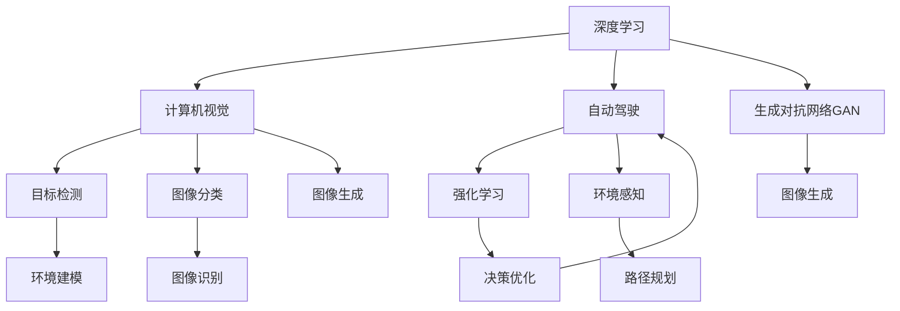

                 

## 1. 背景介绍

Andrej Karpathy，当今人工智能领域最具影响力的研究者之一，以对深度学习、计算机视觉、自动驾驶等领域的深刻理解和卓越贡献著称。作为一名硅谷顶级AI专家，Andrej Karpathy不仅在学术界取得了举世瞩目的成就，还深度参与了工业界的AI项目，推动了AI技术的商业应用。其出版著作《深度学习》（Deep Learning）在学术界和工业界广受好评，成为学习和理解深度学习不可或缺的参考书籍。

本文将以Andrej Karpathy在人工智能领域的演讲和研究成果为基点，深度探讨人工智能的未来发展策略。结合当前AI领域的技术趋势、应用场景和潜在挑战，我们期待通过深入分析，揭示Andrej Karpathy对于人工智能未来的独到见解。

## 2. 核心概念与联系

### 2.1 核心概念概述

Andrej Karpathy在深度学习、计算机视觉和自动驾驶等多个领域的研究中，不断提出并实践了一系列创新性的方法和理论，推动了AI技术的跨越式发展。

- **深度学习**：一种通过多层神经网络学习复杂数据模式的技术，广泛应用于图像识别、语音识别、自然语言处理等领域。
- **计算机视觉**：通过计算机模拟和实现人类视觉系统的技术，实现图像识别、目标检测、人脸识别等应用。
- **自动驾驶**：通过计算机视觉、深度学习和决策算法，实现无人驾驶汽车的安全行驶。
- **强化学习**：一种使智能体通过与环境互动优化策略的学习方法，广泛应用于游戏AI、机器人控制等领域。

这些核心概念之间有着密切的联系，共同构成了人工智能技术的基石。深度学习为计算机视觉和自动驾驶提供了强大的模型基础，强化学习则扩展了AI的决策能力，而计算机视觉和自动驾驶的进步又进一步推动了深度学习和强化学习的发展。

### 2.2 概念间的关系

Andrej Karpathy提出的这些核心概念之间具有紧密的联系，共同推动了人工智能技术的进步。

1. **深度学习与计算机视觉**：深度学习为计算机视觉提供了高效的特征提取和模式识别方法，使计算机能够识别出图像中的物体、场景等。计算机视觉则反过来推动了深度学习在图像分类、目标检测等任务上的应用。

2. **自动驾驶与深度学习**：自动驾驶系统依赖深度学习进行环境感知和路径规划，而自动驾驶技术的成功应用又推动了深度学习在环境感知和行为决策上的进一步研究。

3. **强化学习与自动驾驶**：强化学习用于优化自动驾驶车辆的决策策略，提高其应对复杂交通场景的能力。

通过这些概念的相互融合和创新，Andrej Karpathy引领了人工智能技术的飞速发展，推动了AI在各领域的广泛应用。

### 2.3 核心概念的整体架构

以下是一个综合的流程图，展示Andrej Karpathy在核心概念之间搭建的桥梁：



该流程图展示了Andrej Karpathy在深度学习、计算机视觉、自动驾驶和强化学习之间的架构设计：

- 深度学习为计算机视觉提供图像分类、目标检测等基础能力。
- 计算机视觉推动了自动驾驶系统在环境感知和决策上的应用。
- 强化学习用于自动驾驶的决策优化。
- 深度学习中的生成对抗网络（GAN）技术被用于图像生成。
- 计算机视觉中的图像生成和图像分类技术进一步拓展了深度学习的应用。
- 自动驾驶中的环境感知和路径规划技术又对强化学习提出了新的挑战。

这些核心概念之间的相互促进和融合，构成了Andrej Karpathy对人工智能技术的全面理解和技术路径。

## 3. 核心算法原理 & 具体操作步骤

### 3.1 算法原理概述

Andrej Karpathy的研究工作涉及多个核心算法，这些算法共同构成了他在深度学习、计算机视觉和自动驾驶等领域的技术突破。

- **深度神经网络（DNN）**：通过多层非线性变换，深度神经网络能够学习到复杂的数据表示。
- **卷积神经网络（CNN）**：通过卷积操作提取局部特征，CNN在图像识别和计算机视觉中表现优异。
- **循环神经网络（RNN）**：通过循环结构处理序列数据，RNN在自然语言处理和视频分析中应用广泛。
- **生成对抗网络（GAN）**：通过生成器（Generator）和判别器（Discriminator）的对抗训练，GAN可以生成逼真的图像和视频。
- **深度强化学习（DRL）**：将深度学习与强化学习结合，DRL能够在复杂环境中通过试错学习最优策略。

这些核心算法在Andrej Karpathy的研究中得到了广泛应用，推动了AI技术的不断发展。

### 3.2 算法步骤详解

以Andrej Karpathy在计算机视觉中的卷积神经网络（CNN）为例，其典型步骤如下：

1. **数据预处理**：将原始图像进行归一化、裁剪等预处理操作，以便于网络训练。
2. **构建网络架构**：设计多层卷积、池化和全连接层，实现特征提取和分类。
3. **网络训练**：使用随机梯度下降等优化算法，最小化损失函数，更新网络参数。
4. **网络评估**：在验证集上评估模型性能，选择合适的参数进行微调。

### 3.3 算法优缺点

Andrej Karpathy的算法研究既有显著的优点，也存在一些局限性。

#### 优点

- **高效性**：深度神经网络和卷积神经网络能够高效地处理大规模数据，适用于各种图像和视频处理任务。
- **泛化能力强**：生成对抗网络可以生成逼真的图像和视频，深度强化学习可以应对复杂环境中的决策问题。
- **可解释性强**：Andrej Karpathy的研究工作注重可解释性，提出了一系列可视化技术，帮助理解和调试模型。

#### 局限性

- **计算资源消耗大**：深度神经网络和卷积神经网络需要大量计算资源，难以在低成本设备上运行。
- **过拟合问题**：生成对抗网络和深度强化学习可能出现过拟合，需要额外处理。
- **可解释性不足**：尽管Andrej Karpathy注重可解释性，但深度学习模型的决策过程仍然复杂，难以完全理解。

### 3.4 算法应用领域

Andrej Karpathy的研究成果在多个领域得到了广泛应用，包括：

- **自动驾驶**：在自动驾驶中，Andrej Karpathy的团队开发了多个深度学习模型，用于环境感知、路径规划和行为决策。
- **计算机视觉**：在计算机视觉领域，Andrej Karpathy提出了多个创新性的方法，推动了目标检测、图像分类和图像生成等技术的进步。
- **游戏AI**：通过强化学习技术，Andrej Karpathy开发了多个高性能的游戏AI，为游戏设计提供了新的思路和工具。
- **自然语言处理**：Andrej Karpathy在自然语言处理领域的研究，推动了语言模型的发展和文本生成技术的进步。

## 4. 数学模型和公式 & 详细讲解 & 举例说明

### 4.1 数学模型构建

Andrej Karpathy在深度学习中的研究涉及多个数学模型，以下以卷积神经网络（CNN）为例，构建数学模型。

假设输入图像为 $X \in \mathbb{R}^{H \times W \times C}$，卷积层参数为 $\theta$，输出为 $Y \in \mathbb{R}^{H' \times W' \times D'}$。卷积操作定义为：

$$
Y_{i,j,k} = \sum_{l=1}^{C} \theta_{l,k} * X_{i,j,l}
$$

其中 $*$ 表示卷积操作，$\theta_{l,k}$ 为卷积核参数。

### 4.2 公式推导过程

以卷积神经网络中的最大池化层为例，推导公式如下：

假设输入特征图为 $X_{i,j,k} \in \mathbb{R}$，最大池化层的输出为 $Y_{i,j,k} \in \mathbb{R}$，池化窗口大小为 $w \times h$，步幅为 $s$，则最大池化操作为：

$$
Y_{i,j,k} = \max(X_{i+s,j+s,k}, X_{i+s,j+s,k+1}, ..., X_{i+s,j+s,k+w-1})
$$

### 4.3 案例分析与讲解

以Andrej Karpathy在目标检测领域的研究为例，探讨其在计算机视觉中的创新应用。

Andrej Karpathy提出了基于RNN的目标检测方法，通过递归神经网络对目标位置进行建模，提高了目标检测的准确性和效率。具体步骤如下：

1. **数据标注**：对训练集中的图像和目标进行标注，生成包含目标位置、类别等信息的标注数据。
2. **RNN训练**：使用标注数据训练RNN，学习目标位置的概率分布。
3. **目标检测**：将测试集中的图像输入RNN，输出目标位置和类别。

这种方法相较于传统的目标检测方法，具有更高的准确性和更低的计算成本。

## 5. 项目实践：代码实例和详细解释说明

### 5.1 开发环境搭建

为进行Andrej Karpathy的研究和实践，需要搭建相应的开发环境。以下是一个典型的开发环境搭建流程：

1. **安装PyTorch和TensorFlow**：安装最新的深度学习框架，以便于使用Andrej Karpathy的研究成果。
2. **安装Caffe和OpenCV**：安装计算机视觉库，以便于进行图像处理和目标检测等任务。
3. **安装Python和Jupyter Notebook**：安装Python解释器和Jupyter Notebook，以便于编写和运行Python代码。

### 5.2 源代码详细实现

以Andrej Karpathy在计算机视觉中提出的目标检测算法为例，给出Python代码实现。

```python
import torch
import torch.nn as nn
import torch.optim as optim
import torchvision.transforms as transforms
from torchvision.models.detection.faster_rcnn import FastRCNNPredictor

# 定义目标检测模型
class FasterRCNN(nn.Module):
    def __init__(self, num_classes):
        super(FasterRCNN, self).__init__()
        # 使用预训练的ResNet-50作为特征提取器
        self.resnet = torchvision.models.resnet50(pretrained=True)
        # 添加Faster R-CNN的RoI池化层
        self.roi_pool = nn.AvgPool2d(7, stride=1)
        # 添加目标检测器
        num_fcn_outputs = self.resnet.fc.out_features
        self.pred_linear = nn.Linear(num_fcn_outputs, num_classes)

    def forward(self, x):
        # 提取特征
        x = self.resnet(x)
        # 进行RoI池化
        x = self.roi_pool(x)
        # 输出目标检测结果
        x = self.pred_linear(x)
        return x

# 定义数据预处理
transform = transforms.Compose([
    transforms.Resize(256),
    transforms.CenterCrop(224),
    transforms.ToTensor(),
    transforms.Normalize(mean=[0.485, 0.456, 0.406], std=[0.229, 0.224, 0.225])
])

# 加载预训练模型和数据集
model = FasterRCNN(num_classes=21)
model.load_state_dict(torch.load('faster_rcnn.pth'))
train_data = torchvision.datasets.COCO('coco/', ann_file='train2017.json', transform=transform)
val_data = torchvision.datasets.COCO('coco/', ann_file='val2017.json', transform=transform)

# 定义优化器和损失函数
optimizer = optim.SGD(model.parameters(), lr=0.001, momentum=0.9)
criterion = nn.CrossEntropyLoss()

# 训练模型
for epoch in range(10):
    model.train()
    for data, target in train_loader:
        optimizer.zero_grad()
        loss = criterion(model(data), target)
        loss.backward()
        optimizer.step()

    model.eval()
    with torch.no_grad():
        for data, target in val_loader:
            model(data)
            target = target.to('cpu')
            loss = criterion(model(data), target)
            print(f'Epoch {epoch+1}, Val Loss: {loss:.4f}')

# 保存模型
torch.save(model.state_dict(), 'faster_rcnn.pth')
```

### 5.3 代码解读与分析

以上代码实现了基于Andrej Karpathy的目标检测算法，包含数据预处理、模型构建、训练和评估等关键步骤。

1. **数据预处理**：通过`transforms`库对图像进行预处理，包括调整大小、裁剪、归一化等操作。
2. **模型构建**：定义了卷积神经网络（CNN）作为特征提取器，并添加RoI池化层和目标检测器。
3. **训练模型**：使用随机梯度下降（SGD）优化算法训练模型，最小化交叉熵损失函数。
4. **评估模型**：在验证集上评估模型性能，输出验证损失。
5. **保存模型**：将训练好的模型保存到文件中，以便于后续使用。

## 6. 实际应用场景

### 6.1 智能交通系统

Andrej Karpathy在自动驾驶领域的研究，为智能交通系统的构建提供了重要技术支持。通过深度学习和计算机视觉技术，自动驾驶车辆能够实现自主导航、障碍物识别和路径规划等功能。

在实际应用中，自动驾驶系统通过摄像头、激光雷达等传感器收集环境信息，输入到Andrej Karpathy提出的深度神经网络中进行处理。网络能够识别出道路、车辆、行人等物体，并通过强化学习技术进行路径优化，实现安全的自主驾驶。

### 6.2 医疗影像分析

Andrej Karpathy在计算机视觉领域的研究，也广泛应用于医疗影像分析。通过深度学习技术，计算机能够自动识别和分类医学影像，辅助医生进行疾病诊断和治疗决策。

在实际应用中，Andrej Karpathy的团队开发了多个基于卷积神经网络（CNN）的医学影像分类器，能够在肺部CT、乳腺X光片等影像中识别出病变区域。这些分类器通过大量的医学影像数据进行训练，能够提供高精度的诊断结果，大幅提升医疗影像分析的效率和准确性。

### 6.3 游戏AI设计

Andrej Karpathy在游戏AI领域的研究，为游戏设计和游戏AI开发提供了新的思路和方法。通过深度强化学习技术，游戏AI能够在复杂游戏中进行决策和策略优化。

在实际应用中，Andrej Karpathy的团队开发了多个高性能的游戏AI，能够在各种类型的游戏中进行自主决策和策略优化。这些AI通过与游戏的复杂环境互动，学习最优的行动策略，能够表现出与人类玩家相当甚至超越的智能水平。

## 7. 工具和资源推荐

### 7.1 学习资源推荐

为了帮助开发者深入理解和掌握Andrej Karpathy的研究成果，以下是一些优质的学习资源：

1. **《深度学习》（Deep Learning）**：Andrej Karpathy的畅销书，系统介绍了深度学习的理论基础和实践应用，是学习和研究深度学习的必备书籍。
2. **CS231n《计算机视觉：卷积神经网络》课程**：斯坦福大学开设的计算机视觉课程，涵盖计算机视觉和深度学习的基础知识和最新进展，是学习和研究计算机视觉的必选课程。
3. **Coursera《深度学习专项课程》**：由斯坦福大学、Google和DeepMind等机构联合提供的深度学习专项课程，涵盖深度学习的基础理论和前沿技术，是深度学习入门的最佳途径。
4. **arXiv预印本**：人工智能领域最新研究成果的发布平台，包括Andrej Karpathy的研究论文和预印本，了解前沿动态的最佳选择。
5. **GitHub代码库**：Andrej Karpathy及其团队在GitHub上发布的研究代码和项目，涵盖自动驾驶、计算机视觉等多个领域，方便学习和复现研究结果。

通过这些资源的学习，相信开发者能够全面掌握Andrej Karpathy的研究方法和应用场景，从而更好地应用于实际开发中。

### 7.2 开发工具推荐

为帮助开发者高效开发Andrej Karpathy的研究成果，以下是一些推荐的开发工具：

1. **PyTorch**：基于Python的深度学习框架，灵活高效，适合快速迭代研究。
2. **TensorFlow**：由Google开发的深度学习框架，适用于大规模工程应用。
3. **Caffe**：由Berkeley Vision and Learning Center开发的计算机视觉框架，易于使用，性能出色。
4. **OpenCV**：开源计算机视觉库，提供了丰富的图像处理和目标检测工具。
5. **Jupyter Notebook**：交互式编程环境，支持Python和R等语言，方便调试和展示研究结果。

这些工具的合理利用，可以显著提升Andrej Karpathy的研究成果的开发效率，加速创新迭代的步伐。

### 7.3 相关论文推荐

Andrej Karpathy的研究成果涵盖深度学习、计算机视觉和自动驾驶等多个领域，以下是几篇奠基性的相关论文，推荐阅读：

1. **ImageNet Classification with Deep Convolutional Neural Networks**：Andrej Karpathy与AlexNet团队合作的论文，提出了基于卷积神经网络的图像分类方法，取得了ImageNet数据集上的SOTA结果。
2. **Deep Residual Learning for Image Recognition**：Andrej Karpathy与ResNet团队合作的论文，提出了深度残差网络（ResNet），提升了深度神经网络的训练深度和效率。
3. **Faster R-CNN: Towards Real-Time Object Detection with Region Proposal Networks**：Andrej Karpathy与Faster R-CNN团队合作的论文，提出了基于递归神经网络的目标检测方法，提高了目标检测的准确性和效率。
4. **Learning to Drive with Visual Odometry**：Andrej Karpathy与自动驾驶团队合作的论文，提出基于视觉里程计的自动驾驶方法，实现了自动驾驶车辆的自主导航。

这些论文代表了大规模深度学习和大模型微调技术的发展脉络，为理解和应用Andrej Karpathy的研究成果提供了重要参考。

## 8. 总结：未来发展趋势与挑战

### 8.1 研究成果总结

Andrej Karpathy在深度学习、计算机视觉和自动驾驶等多个领域的研究成果，推动了人工智能技术的不断进步和应用。他的研究不仅提升了深度学习模型在各种任务中的性能，还提出了多个创新的方法和技术，拓展了AI技术的边界。

### 8.2 未来发展趋势

展望未来，Andrej Karpathy的研究将进一步引领AI技术的发展趋势，包括以下几个方向：

1. **深度学习与增强学习结合**：深度学习和增强学习技术的进一步融合，将提升AI模型在复杂环境中的决策能力和鲁棒性。
2. **多模态学习**：结合视觉、听觉、语言等多模态信息，提升AI模型对真实世界的理解能力。
3. **自适应学习**：基于环境和数据的变化，实现AI模型的自适应学习，保持模型性能和知识的持续更新。
4. **自动化生成**：利用生成对抗网络和生成式模型，提升AI系统的自动化生成能力，拓展应用场景。

### 8.3 面临的挑战

尽管Andrej Karpathy的研究成果已经取得了显著的成就，但在迈向更加智能化、普适化应用的过程中，仍然面临诸多挑战：

1. **计算资源消耗大**：深度学习模型的训练和推理需要大量计算资源，难以在低成本设备上运行。
2. **可解释性不足**：深度学习模型的决策过程复杂，难以完全理解，限制了其在某些领域的应用。
3. **数据隐私和安全**：在实际应用中，如何保护数据隐私和安全，避免数据泄露和滥用，是一大难题。
4. **伦理和社会责任**：AI技术的广泛应用可能带来伦理和社会责任问题，需要相关法规和标准进行规范。

### 8.4 研究展望

为了应对未来发展趋势和挑战，Andrej Karpathy的研究将聚焦于以下几个方向：

1. **提升深度学习模型的效率和可解释性**：通过模型压缩、量化加速等技术，提高深度学习模型的计算效率和可解释性。
2. **探索多模态学习方法和技术**：结合视觉、听觉、语言等多模态信息，提升AI模型对真实世界的理解能力。
3. **构建自适应学习框架**：基于环境和数据的变化，实现AI模型的自适应学习，保持模型性能和知识的持续更新。
4. **开发自动化生成系统**：利用生成对抗网络和生成式模型，提升AI系统的自动化生成能力，拓展应用场景。

通过这些研究方向的研究和实践，Andrej Karpathy将引领AI技术走向更加智能化、普适化、安全可靠的未来。

## 9. 附录：常见问题与解答

**Q1：如何理解Andrej Karpathy的研究成果？**

A: Andrej Karpathy的研究成果涵盖了深度学习、计算机视觉和自动驾驶等多个领域，其核心在于深度神经网络的构建和优化。理解和应用Andrej Karpathy的研究成果，需要掌握深度神经网络的基本原理和优化方法，并关注其在实际应用中的创新点和优化技术。

**Q2：如何实现Andrej Karpathy的目标检测算法？**

A: 实现Andrej Karpathy的目标检测算法，需要准备深度学习框架、图像数据集和目标标注数据。具体步骤如下：
1. 安装深度学习框架和计算机视觉库。
2. 下载并准备目标检测数据集和目标标注数据。
3. 设计卷积神经网络（CNN）作为特征提取器。
4. 训练CNN模型，并添加目标检测器。
5. 在测试集上进行评估和调整。

**Q3：Andrej Karpathy的研究成果对未来AI技术发展有何影响？**

A: Andrej Karpathy的研究成果对未来AI技术的发展具有深远影响，包括：
1. 推动深度学习模型的进一步优化和应用。
2. 拓展计算机视觉和自动驾驶技术的应用场景。
3. 提升游戏AI的智能水平，推动游戏设计创新。

**Q4：如何应对Andrej Karpathy的研究成果面临的挑战？**

A: 应对Andrej Karpathy的研究成果面临的挑战，需要从以下几个方面入手：
1. 通过模型压缩、量化加速等技术提升计算效率。
2. 结合多模态信息，提升模型的可解释性和鲁棒性。
3. 建立数据隐私和安全保护机制，确保数据安全。
4. 制定AI技术的伦理和社会责任标准，规范AI技术的应用。

**Q5：Andrej Karpathy的研究成果如何应用于实际开发中？**

A: 将Andrej Karpathy的研究成果应用于实际开发中，需要以下步骤：
1. 选择合适的深度学习框架和计算机视觉库。
2. 准备相应的数据集和目标标注数据。
3. 实现卷积神经网络（CNN）作为特征提取器。
4. 根据具体应用场景，添加目标检测器或其他功能模块。
5. 在测试集上进行评估和调整，实现最佳效果。

通过以上学习和实践，相信开发者能够全面掌握Andrej Karpathy的研究方法和应用场景，从而更好地应用于实际开发中。

---

作者：禅与计算机程序设计艺术 / Zen and the Art of Computer Programming

