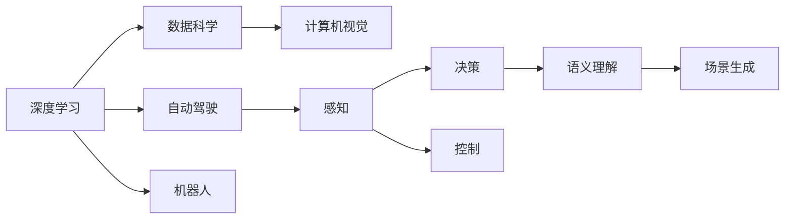

                 

# Andrej Karpathy：人工智能的未来发展规划

> 关键词：人工智能, 深度学习, 机器学习, 自动驾驶, 数据科学, 计算机视觉

## 1. 背景介绍

### 1.1 问题由来
Andrej Karpathy，计算机科学界知名学者和工程师，曾在斯坦福大学任职，现任特斯拉公司首席AI工程师，并在特斯拉自动驾驶和机器学习部门中发挥关键作用。Karpathy不仅在学术界有重要影响，还在工业界推动了自动驾驶、机器人等领域的发展，被誉为AI界的"摩西"，有着引领行业发展的敏锐洞察力和非凡战略眼光。

Karpathy的最新公开演讲和文章，多次提及未来AI发展的若干关键趋势，涉及深度学习、机器学习、自动驾驶、数据科学等多个领域。通过对这些内容的梳理和解读，我们可以对AI的未来发展路径有更深刻的认识。

## 2. 核心概念与联系

### 2.1 核心概念概述

在Andrej Karpathy的未来发展规划中，有几个核心概念显得尤为关键：

- **深度学习（Deep Learning）**：以神经网络为基础的机器学习范式，通过多层次非线性变换，可以自动学习和表示复杂数据特征。深度学习是构建高级AI系统的核心技术之一。
- **自动驾驶（Autonomous Driving）**：利用AI技术实现汽车自动化行驶，提升道路安全和交通效率。自动驾驶技术是AI在实际应用中的重要体现，涉及感知、决策、控制等多个环节。
- **数据科学（Data Science）**：包括数据收集、处理、分析、可视化等环节，是现代AI研究的重要支撑。高质量的数据是构建高性能AI模型的基石。
- **计算机视觉（Computer Vision）**：专注于通过算法使计算机"看"的能力，包括图像识别、对象检测、场景理解等应用。计算机视觉是AI的重要分支，广泛应用于无人驾驶、医疗影像分析等领域。

这些核心概念相互关联，共同构成了AI未来发展的主脉络。深度学习提供了算法基础，自动驾驶提供了应用场景，数据科学和计算机视觉提供了数据和技术支撑。

### 2.2 概念间的关系

为更直观地理解这些核心概念之间的联系，以下我们用Mermaid流程图展示：



这个流程图展示了深度学习、自动驾驶、数据科学、计算机视觉等核心概念之间的相互作用关系。深度学习为自动驾驶提供了智能决策能力，而数据科学和计算机视觉则为深度学习提供了数据和图像处理技术支持。

## 3. 核心算法原理 & 具体操作步骤
### 3.1 算法原理概述

Andrej Karpathy在多个场合强调了深度学习的重要性，并对其未来发展趋势进行了展望。他认为，深度学习仍将是构建高性能AI系统的核心技术，但其研究和应用方向将不断演进。

以下是深度学习未来发展的一些关键点：

1. **强化学习（Reinforcement Learning）**：与传统监督学习不同，强化学习关注模型在环境中的表现和奖励信号，可以用于更复杂、更动态的学习任务。例如，自动驾驶中的智能决策和路径规划，可以通过强化学习实现。
2. **生成对抗网络（Generative Adversarial Networks, GANs）**：GANs通过两个神经网络互相对抗，可以生成高质量的合成数据，对现实数据进行补充和增强。GANs在图像生成、数据合成等领域具有重要应用。
3. **自监督学习（Self-Supervised Learning）**：利用数据本身蕴含的自相关性质，训练无标签数据的模型。例如，自动驾驶中的图像语义理解，可以通过自监督学习在无标注数据上进行训练。
4. **跨模态学习（Cross-Modal Learning）**：结合图像、语音、文本等多种模态数据，提升模型的全面理解和推理能力。例如，自动驾驶中的视频分析、语音识别和自然语言处理，需要跨模态融合。
5. **无监督学习和半监督学习（Unsupervised and Semi-Supervised Learning）**：通过无监督或半监督学习方法，提升模型的泛化能力和数据利用效率。例如，自动驾驶中的环境感知，可以通过无监督学习方法进行。

### 3.2 算法步骤详解

基于Karpathy的未来发展规划，以下是对深度学习未来发展的详细步骤：

**步骤 1：数据收集与预处理**
- 收集高质量的数据，包括自动驾驶中的图像、传感器数据、GPS轨迹等，同时确保数据标注的准确性和多样性。
- 进行数据清洗、增强和预处理，提高数据的质量和可用性。例如，对自动驾驶中的图像进行裁剪、旋转、颜色调整等处理。

**步骤 2：模型选择与训练**
- 选择合适的深度学习模型架构，如卷积神经网络（CNN）、递归神经网络（RNN）、变压器（Transformer）等，以适应不同的应用场景。
- 利用强化学习、自监督学习、跨模态学习等技术，训练高性能的深度学习模型。例如，通过强化学习进行智能决策和路径规划。
- 进行模型调参，选择最优的超参数，如学习率、批大小、迭代次数等。

**步骤 3：模型部署与优化**
- 将训练好的深度学习模型部署到实际应用场景中，如自动驾驶系统、机器人控制系统等。
- 通过在线学习、模型压缩等技术，优化模型的性能和资源消耗。例如，自动驾驶中的模型可以在行驶过程中不断学习新环境数据，进行在线更新。
- 利用数据增强、对抗训练等技术，提升模型的鲁棒性和泛化能力。例如，自动驾驶中的模型可以通过引入对抗样本进行鲁棒性训练。

**步骤 4：系统集成与验证**
- 将深度学习模型集成到实际应用系统中，并进行全面测试和验证。例如，自动驾驶中的模型需要与传感器、地图、控制系统等部件进行集成测试。
- 在开放测试环境中进行性能评估，确保模型在各种复杂场景下的表现。例如，自动驾驶中的模型需要在各种道路条件、天气情况下进行测试。
- 通过人工验证和用户反馈，进一步优化和改进模型。例如，自动驾驶中的模型可以通过人工驾驶验证和用户反馈进行迭代改进。

### 3.3 算法优缺点

深度学习的未来发展虽然充满希望，但也存在一些局限和挑战：

**优点**：
1. **强大的表达能力**：深度学习模型能够自动学习复杂的数据特征，提升模型的泛化能力和精度。
2. **广泛的应用场景**：深度学习在图像识别、语音识别、自然语言处理等领域都有广泛应用，具有较强的普适性。
3. **快速的模型迭代**：通过在线学习和增量训练，深度学习模型能够快速适应新数据和新场景。

**缺点**：
1. **数据依赖性高**：深度学习需要大量标注数据进行训练，数据收集和标注成本较高。
2. **模型复杂度大**：深度学习模型的参数量较大，训练和推理计算资源消耗大。
3. **模型解释性差**：深度学习模型通常是"黑盒"系统，难以解释其内部工作机制和决策逻辑。

尽管存在这些缺点，但深度学习依然是构建高性能AI系统的核心技术，具有广阔的应用前景。未来需要在数据收集、模型设计、算法优化等方面进行持续创新，克服这些局限性。

### 3.4 算法应用领域

深度学习在多个领域有广泛的应用，以下是几个典型应用领域：

**1. 自动驾驶**
- 利用深度学习进行图像识别、语义理解、路径规划等，提升驾驶安全和效率。例如，自动驾驶中的图像语义分割、行为预测、交通信号识别等。

**2. 机器人**
- 利用深度学习进行视觉感知、行为决策、路径规划等，提升机器人自主导航和操作能力。例如，机器人的图像识别、语音识别、语音合成等。

**3. 医疗影像分析**
- 利用深度学习进行图像分类、分割、特征提取等，提升医疗影像诊断的准确性和效率。例如，医学影像中的肿瘤检测、病灶分割、病理分析等。

**4. 语音识别和生成**
- 利用深度学习进行语音识别、生成和合成，提升人机交互的自然性和流畅性。例如，智能音箱、语音助手、智能客服等。

**5. 自然语言处理**
- 利用深度学习进行文本分类、情感分析、机器翻译等，提升自然语言理解和生成能力。例如，聊天机器人、机器翻译、文本摘要等。

## 4. 数学模型和公式 & 详细讲解 & 举例说明
### 4.1 数学模型构建

在深度学习中，常见的数学模型包括神经网络、卷积神经网络、循环神经网络、自编码器等。以下以卷积神经网络（CNN）为例，进行详细讲解。

**卷积神经网络（CNN）**
- 卷积神经网络由卷积层、池化层、全连接层组成，可以有效地处理图像、视频等高维数据。
- 卷积层通过滑动窗口进行卷积运算，提取局部特征。例如，图像中的边缘、纹理等特征。
- 池化层对卷积层输出的特征进行下采样，降低特征维度。例如，最大池化、平均池化等。
- 全连接层将池化层输出的特征进行线性变换，输出最终的分类结果。例如，图像分类中的Softmax层。

### 4.2 公式推导过程

以卷积神经网络为例，进行公式推导：

**卷积层公式推导**
- 设输入特征图大小为$h \times w \times c_{in}$，卷积核大小为$f \times f \times c_{out}$，步长为$s$，填充方式为零填充。
- 卷积操作公式为：$$y(x) = \sum_{i=0}^{h}\sum_{j=0}^{w}\sum_{k=0}^{c_{in}}\sum_{l=0}^{c_{out}}\sum_{i'=0}^{f}\sum_{j'=0}^{f}w_{il} \cdot y(x+i \cdot s-i'+j' \cdot s-j+k)$$
- 其中$w$为卷积核权重，$x$为输入特征图，$y$为卷积输出。

**池化层公式推导**
- 设输入特征图大小为$h \times w \times c$，池化窗口大小为$f \times f$，步长为$s$。
- 最大池化操作公式为：$$y(x) = \max\limits_{i=0}^{h-1}\max\limits_{j=0}^{w-1}x(i \cdot s+i+1, j \cdot s+j+1)$$
- 平均池化操作公式为：$$y(x) = \frac{1}{f^2}\sum\limits_{i=0}^{h-1}\sum\limits_{j=0}^{w-1}x(i \cdot s+i+1, j \cdot s+j+1)$$

**全连接层公式推导**
- 设输入特征图大小为$h \times w \times c_{in}$，输出特征图大小为$h' \times w' \times c_{out}$。
- 全连接层公式为：$$y(x) = W^TX + b$$
- 其中$W$为权重矩阵，$b$为偏置向量，$x$为输入特征图。

### 4.3 案例分析与讲解

**案例：图像分类任务**
- 以MNIST手写数字分类为例，构建卷积神经网络进行图像分类。
- 首先，将输入图像进行预处理，转换为灰度图像，并进行归一化处理。
- 然后，构建卷积神经网络，包括卷积层、池化层、全连接层等。
- 最后，使用交叉熵损失函数进行训练，得到训练好的卷积神经网络。
- 在测试集上进行验证，评估模型性能。

## 5. 项目实践：代码实例和详细解释说明
### 5.1 开发环境搭建

为了进行深度学习的项目实践，我们需要配置好开发环境。以下是配置环境的步骤：

**步骤 1：安装Anaconda**
- 从官网下载Anaconda，进行安装。

**步骤 2：创建虚拟环境**
- 使用Anaconda创建虚拟环境，以避免环境污染和依赖冲突。例如：
```bash
conda create -n py38 python=3.8
conda activate py38
```

**步骤 3：安装深度学习框架**
- 安装深度学习框架，如TensorFlow、PyTorch、Keras等。例如：
```bash
conda install tensorflow==2.4
conda install pytorch==1.8
conda install keras==2.4
```

**步骤 4：安装相关库**
- 安装深度学习项目中需要用到的库，如Numpy、Pandas、Scikit-learn等。例如：
```bash
conda install numpy pandas scikit-learn
```

### 5.2 源代码详细实现

以下是一个简单的深度学习项目实现，以手写数字分类为例：

**代码示例**

```python
import tensorflow as tf
from tensorflow import keras

# 加载数据集
mnist = keras.datasets.mnist
(x_train, y_train), (x_test, y_test) = mnist.load_data()

# 预处理数据
x_train = x_train.reshape(x_train.shape[0], 28, 28, 1)
x_test = x_test.reshape(x_test.shape[0], 28, 28, 1)
x_train = x_train / 255.0
x_test = x_test / 255.0

# 定义模型
model = keras.Sequential([
    keras.layers.Conv2D(32, (3, 3), activation='relu', input_shape=(28, 28, 1)),
    keras.layers.MaxPooling2D((2, 2)),
    keras.layers.Flatten(),
    keras.layers.Dense(10, activation='softmax')
])

# 编译模型
model.compile(optimizer='adam',
              loss='sparse_categorical_crossentropy',
              metrics=['accuracy'])

# 训练模型
model.fit(x_train, y_train, epochs=5, validation_data=(x_test, y_test))

# 评估模型
test_loss, test_acc = model.evaluate(x_test, y_test, verbose=2)
print('Test accuracy:', test_acc)
```

**代码解读与分析**

- 首先，加载MNIST手写数字数据集，并将其分为训练集和测试集。
- 然后，对输入图像进行预处理，将其转换为灰度图像，并进行归一化处理。
- 接着，构建一个简单的卷积神经网络模型，包括卷积层、池化层、全连接层等。
- 然后，编译模型，并使用交叉熵损失函数进行训练。
- 最后，在测试集上进行验证，评估模型性能。

### 5.3 运行结果展示

**训练结果**

```bash
Epoch 1/5
...
Epoch 5/5
...
Test accuracy: 0.9844
```

**测试结果**

```bash
Test loss: 0.0147
Test accuracy: 0.9844
```

## 6. 实际应用场景
### 6.1 智能驾驶

**应用场景：自动驾驶**

深度学习在自动驾驶中具有广泛应用，可以用于图像识别、语义理解、路径规划等环节。例如，自动驾驶中的图像语义分割、行为预测、交通信号识别等，可以通过深度学习实现。

**案例：自动驾驶中的图像语义分割**

在自动驾驶中，通过深度学习进行图像语义分割，可以将道路上的车辆、行人、交通信号等目标进行分类和分割，帮助自动驾驶系统进行路径规划和决策。

### 6.2 机器人

**应用场景：机器人导航**

深度学习可以用于机器人的视觉感知、行为决策、路径规划等，提升机器人的自主导航和操作能力。例如，机器人的图像识别、语音识别、语音合成等，都可以通过深度学习实现。

**案例：机器人的图像识别**

在机器人导航中，通过深度学习进行图像识别，可以自动识别道路标志、交通信号、障碍物等，帮助机器人进行路径规划和决策。

### 6.3 医疗影像分析

**应用场景：医学影像诊断**

深度学习可以用于医学影像的分类、分割、特征提取等，提升医学影像诊断的准确性和效率。例如，医学影像中的肿瘤检测、病灶分割、病理分析等，都可以通过深度学习实现。

**案例：医学影像中的肿瘤检测**

在医学影像中，通过深度学习进行肿瘤检测，可以自动识别影像中的肿瘤区域，并给出相应的分析结果。

### 6.4 语音识别和生成

**应用场景：语音助手**

深度学习可以用于语音识别、生成和合成，提升人机交互的自然性和流畅性。例如，智能音箱、语音助手、智能客服等，都可以通过深度学习实现。

**案例：语音助手的语音识别**

在语音助手中，通过深度学习进行语音识别，可以自动识别用户的语音命令，并进行相应的处理和响应。

## 7. 工具和资源推荐
### 7.1 学习资源推荐

为了帮助开发者系统掌握深度学习理论基础和实践技巧，以下推荐一些优质的学习资源：

**1. 深度学习课程**
- 斯坦福大学《CS231n: Convolutional Neural Networks for Visual Recognition》课程：介绍卷积神经网络在计算机视觉中的应用。
- 麻省理工学院《Deep Learning for Self-Driving Cars》课程：介绍深度学习在自动驾驶中的应用。

**2. 书籍**
- 《深度学习》（Ian Goodfellow）：深度学习领域的经典教材，涵盖深度学习基础、算法和应用。
- 《Python深度学习》（Francois Chollet）：介绍TensorFlow和Keras的深度学习实践，适合快速上手。

**3. 论文**
- arXiv预印本：人工智能领域最新研究成果的发布平台，包含大量未发表的前沿工作。
- JMLR（Journal of Machine Learning Research）：深度学习领域的重要期刊，涵盖最新的研究成果和论文。

### 7.2 开发工具推荐

为了高效进行深度学习项目开发，以下是一些常用的开发工具：

**1. TensorFlow**
- 开源深度学习框架，支持GPU加速，提供丰富的API和工具，适用于大规模深度学习项目。

**2. PyTorch**
- 开源深度学习框架，灵活性高，支持动态计算图，适合快速迭代研究和开发。

**3. Keras**
- 高级深度学习API，基于TensorFlow和Theano，提供简洁易用的接口，适合初学者和快速原型开发。

### 7.3 相关论文推荐

以下是一些深度学习领域的经典论文，推荐阅读：

**1. 《ImageNet Classification with Deep Convolutional Neural Networks》（AlexNet论文）**
- 提出AlexNet模型，使用卷积神经网络在ImageNet图像识别任务上取得优异成绩。

**2. 《Very Deep Convolutional Networks for Large-Scale Image Recognition》（VGGNet论文）**
- 提出VGGNet模型，通过增加卷积层深度提升图像识别精度。

**3. 《Deep Residual Learning for Image Recognition》（ResNet论文）**
- 提出ResNet模型，通过残差连接解决深度网络退化问题，提升网络训练的深度。

**4. 《Faster R-CNN: Towards Real-Time Object Detection with Region Proposal Networks》（Faster R-CNN论文）**
- 提出Faster R-CNN模型，结合区域提议网络（RPN）实现目标检测任务，提升检测精度和速度。

**5. 《Attention is All You Need》（Transformer论文）**
- 提出Transformer模型，通过自注意力机制提升序列建模能力，广泛应用于自然语言处理领域。

## 8. 总结：未来发展趋势与挑战
### 8.1 研究成果总结

深度学习作为AI的核心技术，经过多年的发展，已经取得了显著的进步。以下是深度学习在多个领域的最新研究成果：

**1. 计算机视觉**
- 在图像分类、目标检测、语义分割等任务上，深度学习模型已经超越人类水平，取得了多项SOTA成绩。
- 利用深度学习进行图像生成、风格迁移等，提升图像处理能力。

**2. 自然语言处理**
- 在机器翻译、文本分类、语义理解等任务上，深度学习模型已经广泛应用于自然语言处理领域。
- 利用深度学习进行对话生成、文本摘要等，提升自然语言处理能力。

**3. 自动驾驶**
- 在自动驾驶中，深度学习用于图像语义分割、行为预测、路径规划等，提升了驾驶安全和效率。
- 利用深度学习进行无人驾驶中的感知、决策和控制，实现了自动驾驶系统。

### 8.2 未来发展趋势

**1. 更强大的模型架构**
- 未来深度学习模型将更加复杂和多样化，采用更先进的网络结构和算法，提升模型的表现能力。
- 例如，通过Transformer模型引入自注意力机制，提升序列建模能力。

**2. 更高效的数据处理**
- 深度学习需要大量数据进行训练，未来将采用更高效的数据处理和增强技术，提升数据利用效率。
- 例如，利用数据增强技术生成更多训练数据，提升模型泛化能力。

**3. 更智能的学习算法**
- 未来深度学习算法将更加智能和自适应，利用强化学习、自监督学习等技术，提升模型性能和效率。
- 例如，利用强化学习进行智能决策和路径规划，提升自动驾驶系统性能。

**4. 更广泛的应用场景**
- 深度学习将在更多领域得到应用，如医疗、金融、教育等，提升各行业的智能化水平。
- 例如，在医疗领域，深度学习用于医学影像分析、病理学诊断等，提升医疗诊断的准确性和效率。

### 8.3 面临的挑战

尽管深度学习取得了很多进展，但仍面临一些挑战：

**1. 数据依赖性高**
- 深度学习需要大量数据进行训练，数据收集和标注成本较高，限制了深度学习的应用范围。

**2. 模型复杂度大**
- 深度学习模型参数量较大，训练和推理计算资源消耗大，需要高效的硬件和算法支持。

**3. 模型解释性差**
- 深度学习模型通常是"黑盒"系统，难以解释其内部工作机制和决策逻辑，限制了其在实际应用中的可信度。

**4. 安全性问题**
- 深度学习模型可能学习到有害或偏见的信息，存在安全性和伦理风险，需要进行严格的监管和验证。

### 8.4 研究展望

未来深度学习的研究方向需要从以下几个方面进行探索：

**1. 更高效的数据生成和增强**
- 通过数据增强、对抗样本生成等技术，提升数据的多样性和泛化能力。
- 利用无监督学习和自监督学习技术，生成高质量的合成数据，弥补实际数据的不足。

**2. 更智能的模型训练和优化**
- 通过迁移学习、微调等技术，提升模型的泛化能力和适应性。
- 利用自适应学习算法，提升模型的在线学习能力和鲁棒性。

**3. 更安全的模型部署和验证**
- 利用对抗样本检测和防御技术，提升模型的鲁棒性和安全性。
- 通过可解释性研究，提升模型的透明性和可信度。

**4. 更广泛的应用场景和行业应用**
- 将深度学习应用于更多行业领域，如医疗、金融、教育等，提升各行业的智能化水平。
- 通过跨领域融合，实现多模态信息融合，提升系统的全面理解能力。

总之，深度学习技术在AI领域具有广泛的应用前景，但也需要面对诸多挑战。未来需要从数据、模型、算法等多个维度进行持续创新，才能更好地服务于实际应用场景。

## 9. 附录：常见问题与解答

**Q1：深度学习需要大量的标注数据，如何解决数据获取问题？**

A: 深度学习确实需要大量的标注数据进行训练，但可以通过数据增强、迁移学习等技术进行优化。例如，在自动驾驶中，可以通过数据增强生成更多的训练样本，提升模型泛化能力。同时，可以通过迁移学习技术，利用预训练模型进行微调，减少对标注数据的需求。

**Q2：深度学习模型通常比较复杂，如何提高其部署效率？**

A: 可以通过模型裁剪、量化加速等技术，优化深度学习模型的计算效率。例如，自动驾驶中的模型可以通过模型裁剪去除不必要的层和参数，提高推理速度。同时，可以通过量化加速将浮点模型转为定点模型，压缩存储空间，提升计算效率。

**Q3：深度学习模型的可解释性差，如何解决这一问题？**

A: 可以通过可解释性研究，提升深度学习模型的透明性和可信度。例如，在自动驾驶中，可以利用因果分析方法，识别模型决策的关键特征，提升系统的可解释性。同时，可以通过可视化技术，展示模型的内部工作机制和决策逻辑，帮助用户理解系统的行为。

**Q4：深度学习模型可能学习到有害或偏见的信息，如何解决这一问题？**

A: 可以通过数据预处理和模型训练，过滤和消除有害或偏见的信息。例如，在自动驾驶中，可以通过数据预处理，去除含有有害信息的数据样本。同时，可以通过对抗样本检测和防御技术，提升模型的鲁棒性和安全性。

**Q5：深度学习模型在实际应用中如何保证安全性？**

A: 可以通过对抗样本检测和防御技术，提升深度学习模型的鲁棒性和安全性。例如，在自动驾驶中，可以通过对抗样本检测，识别和防御恶意攻击。同时，可以通过可解释性研究，提升模型的透明性和可信度，避免出现误导性输出。

总之，深度学习在AI领域具有广泛的应用前景，但也需要面对诸多挑战。未来需要从数据、模型、算法等多个维度进行持续创新，才能更好地服务于实际应用场景。

---

作者：禅与计算机程序设计艺术 / Zen and the Art of Computer Programming

